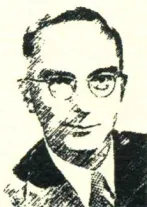

西方传统 经典与解释

Classici et commentarii

# HERMES

沃格林集

刘小枫 ● 主编

A black and white portrait of Eric Voegelin, a man with glasses and a suit, looking directly at the camera.

[美]沃格林 (Eric Voegelin) ○ 著

# 记忆

——历史与政治理论

Anamnesis:

On the Theory of History and Politics

朱成明 ○ 译

华东师范大学出版社

# HERMES

西方传统 经典与解释

Classici et commentarii

沃格林集

《记忆》一书在沃格林的智识生涯中，地位相当独特。一般来说，他很少有兴趣去回顾之前已经发表过的东西，甚至，一旦兴趣不再，他连卷帙浩繁的《政治观念史》都无意筹备发表。那么，《记忆》这部旨在回望和盘点、而不是闯进新领域的作品，就值得读者们注意了。

沃格林亲自编修的这本书，并非单纯的旧文重刊：从带有私人回忆性质的文字开头，到观念史议题的专门论述，再以讨论政治的本质做结。由此我们可以看出，沃格林是如何从其思想事业的出发点——胡塞尔现象学——逐步推进到对西方政治观念史的宏大研究。因而，本书也当之无愧的是沃格林式政治哲学的奠基之作！

上架建议 ▶ 哲学研究 政治哲学

ISBN 978-7-5675-6524-1

9 787567 565241 >

定价：88.00元

[www.ecnupress.com.cn](http://www.ecnupress.com.cn)西方传统 经典与解释  
Classici et commentarii

HERMES

沃格林集

刘小枫 ● 主编

# 记忆

——历史与政治理论

Anamnesis:

On the Theory of History and Politics

[美]沃格林 (Eric Voegelin) ○ 著

朱成明 ○ 译

华东师范大学出版社## 图书在版编目(CIP)数据

记忆：历史与政治理论 / (美)沃格林著；朱成明译。  
--上海：华东师范大学出版社，2017

ISBN 978-7-5675-6524-1

I. ①记… II. ①沃…②朱… III. ①政治思想史—古希腊 IV. ①D091.2

中国版本图书馆CIP数据核字(2017)第121536号

华东师范大学出版社六点分社

企画人 倪为国

*Anamnesis: On the Theory of History and Politics*

by Eric Voegelin

Copyright © 2002 by The Curators of the University of Missouri

University of Missouri Press, Columbia, MO 65201

Simplified Chinese Translation Copyright © 2017 by East China Normal University Press Ltd

ALL RIGHTS RESERVED.

上海市版权局著作权合同登记 图字：09-2017-161号

沃格林集

## 记忆：历史与政治理论

著 者 (美)沃格林

译 者 朱成明

责任编辑 陈哲泓

封面设计 刘怡霖

出版发行 华东师范大学出版社

社 址 上海市中山北路3663号 邮编 200062

网 址 [www.ecnupress.com.cn](http://www.ecnupress.com.cn)

电 话 021-60821666 行政传真 021-62572105

客服电话 021-62865537

门市(邮购)电话 021-62869887

地 址 上海市中山北路3663号华东师范大学校内先锋路口

网 店 <http://hdsdcbs.tmall.com>

印 刷 者 上海景条印刷有限公司

开 本 890×1240 1/32

插 页 2

印 张 19.25

字 数 470千字

版 次 2017年10月第1版

印 次 2017年10月第1次

书 号 ISBN 978-7-5675-6524-1/B·1081

定 价 88.00元

出 版 人 王 焰

(如发现本版图书有印订质量问题,请寄回本社客服中心调换或电话021-62865537联系)西方传统 经典与解释  
Classici et commentarii

**HERMES**

# HERMES

在古希腊神话中，赫耳墨斯是宙斯和迈亚的儿子，奥林波斯神们的信使，道路与边界之神，睡眠与梦想之神，亡灵的引导者，演说者、商人、小偷、旅者和牧人的保护神……

华东师范大学出版社六点分社 策划

重庆大学中央高校基本科研业务费NO.2017CDJSK47YJ10（项目名称：沃格林哲学研究）资助## “沃格林集”出版说明

沃格林(1901—1984)出生于德国古城科隆,小学时随家迁居奥地利,后来就读维也纳大学。博士期间虽然攻读的是政治学,沃格林却喜欢哲学和法学,真正师从的老师是自由主义法学大师凯尔森,心目中的偶像则是当时的学界思想泰斗韦伯。不过,沃格林虽荣幸作过凯尔森的助教,后来却成了自由主义最为深刻的批判者之一。

念博士时,沃格林就显得才华横溢,博士毕业即获洛克斐勒奖学金访学美国,回国后写下处女作《论美国精神的形式》(*On the Form of the American Mind*)。纳粹吞并奥地利之后,沃格林流亡美国(1938年),数年后在美国Baton城的University of Louisiana谋得教职(1942年)。此前沃格林曾与一家出版公司签约,要为大学生撰写一部《西方政治思想史》简明教科书。但出版社和沃格林本人人都没想到:本来约好写两百来页“简史”,沃格林却下笔千页,即便如此,仍觉得没把西方政治思想史的要事说清楚。这个写作计划由于外在和内在原因最终废置,变成了一堆“政治观念史稿”。

废置“史稿”的外在原因不仅仅是“卷轶过大”,还因为沃格林的写法不合“学术规范”。当时(现在同样如此)的“学术规范”是:凡学问要讲究学科划分,哲学史、文学史、宗教史、史学史、政治思2记忆

想史、经济思想史,得分门别类地写。沃格林的“史稿”打破这种现代式学术藩篱,仅就这一点来说,这部“史稿”不仅对西方学界意义重大,对我们来说同样如此。依笔者陋见,在林林种种的各色西方政治思想史中,经后人整理的沃格林《政治观念史稿》(八卷)最为宏富、最富启发性,剖析我们关切的问题,迄今无出其右者。

沃格林觉得,即便写大学生教科书,也应该带着自己的问题意识来写。《政治观念史》的问题意识是:已经显露出种种凶相的现代性究竟怎么回事,又是怎么来的?废置“史稿”的内在原因就在于,沃格林以政治思想史方式展开对现代性问题的探究时,思想发生了转变,因此他决心推倒已经成形的“观念史”,从头来过。起初,沃格林力图搞清楚西方各历史阶段的主导性观念与生活实在之间的关系,但在写作过程中他发现,“象征”而非“观念”与生活实在的关系更为根本。于是他另起炉灶,大量运用“史稿”已有的材料,撰成后来成为其标志性著作的多卷本《秩序与历史》(*Order and History*)以及其他重要文集。我们奇怪如今的《政治观念史稿》何以从“希腊化时期”开始,其实,此前的材料大多用去撰写《秩序与历史》的前四卷了。沃格林启发我们:除非中国学人已经打算在西方现代性思想中安家并与某个现代或后现代“大师”联姻生育后代,否则我们必须随时准备从头开始认识西方传统。而沃格林的“政治观念史稿”,正是我们可能会有的无数次从头开始的契机之一。毕竟,这部被废置的近两千页“史稿”本身,就是沃格林亲身从头开始的见证。

1951年,沃格林应邀在芝加哥大学做讲座,次年,讲稿以“新政治科学”为题出版,成为沃格林思想成熟的标志。随后,沃格林全力撰写多卷本《秩序与历史》,时有其他专题文集问世。1958年,沃格林返回德国,执教慕尼黑大学哲学系,并创建慕尼黑大学“政治学研究所”。然而在战后的德语学界,沃格林的学问几乎没有留下影响痕迹,着实令人费解。退休以后,沃格林再度赴美,继“沃格林集”出版说明3

续撰写因各种事务搁置的《秩序与历史》后两卷。

在思考世界文明的历史性危机方面，施特劳斯和沃格林无疑是 20 世纪最为重要的思想家——在笔者看来，二人精深的哲思和广袤的视野，西方学界迄今无人能与比肩。沃格林去世后，他的美国弟子着手编辑《沃格林集》，成 34 卷（含索引一卷，书信两卷）。除 5 卷本《秩序与历史》和 8 卷本《政治观念史稿》外，还有 6 卷《已刊文集》（*Published Essays*），以及其他自编文集和未刊文稿。沃格林学述将艰深的现象学思辨与广博的史学视野融为一炉，汉译殊为不易，译者极难寻觅。我们只能耐心等待胜任的译者，陆续择要逐译。

古典文明研究工作坊

西方典籍编译部乙组

2016 年 3 月## 缩略语说明

Ad 《记忆》德文版(*Anamnesis, zur Theorie der Geschichte und Politik*, München: R. Piper & Co Verlag, 1966)

Ae 《记忆》英文版(*Anamnesis, On the Theory of History and Politics*, Columbia: University of Missouri Press, 2002)

CW 《沃格林著作集》(*The Collected Works of Eric Voegelin*, 34 卷, Columbia: University of Missouri Press)

DK 《前苏格拉底哲人残篇》(*Die Fragmente der Vorsokratiker*, 6 Aufl., Hermann Diels 与 Walther Kranz 编, Berlin: Weidmann, 1951~52)。本书引用前苏格拉底哲人, 编号均从本书

《观念》 Husserliana III/i; Edmund Husserl, 《纯粹现象学与现象学哲学的观念》(*Ideen zu einer reinen Phänomenologie und phänomenologischen Philosophie, 1tes Buch*, Haag: Martinus Nijhoff, 1976)

《危机》 Husserliana VI; Edmund Husserl, 《欧洲科学危机与先验现象学》(*Die Krisis der europäischen Wissenschaften und die transzendentale Phänomenologie*, Walter Biemel 编, Haag: Martinus Nijhoff, 1954)

记忆回忆 原文一词在汉语多种表达, 而汉语只能取其一时, 右下角标注其他## 中译本前言

译者拿到一本书后,较少去阅读长篇评述性“前言”类文字,而是在了解一些有关文本使用的细节之后,就直接去拜访作者本人。这不是暗示各种“前言”都不值得读或无趣,相反,这都归结到译者自己的疏懒和不知感激:无论是译者还是文本编辑者,向我们引荐了一个我们可能感兴趣的人物,我们却舍不得多敷衍他一会儿,直接抛开他去找正主,这多少都有些失礼。不过,话说回来,人们向一个门房问打听清楚拜访对象的情况之后,并没有继续留下听他唠叨家务事的义务,而是去完成拜访。这是人之常情。无论是作为拜访者还是门房,我都能理解、体谅这一点。因此,在前言中,我不打算用长篇导言或读后感来劳苦读者,只想就《记忆》中译本的一些“事务性”问题作一下交代,感兴趣的读者也许能从中找到利用这个译文的一些信息。

### 一、版本

本书所用的底本是  $A_e$ ,同时参考了  $A_d$ 。选题的时候选择  $A_e$  作底本,一是因为译者自己在接触  $A_e$  时,正在和友人研读第三编《意识之秩序》的内容,觉得表达和  $A_d$  差别极小,便武断地认为英2记忆

译全本质量都如此；一是我们考虑到  $A_c$  在国内比较通行，方便读者查对。最后决定购买  $A_c$  的版权。

遗憾的是，在翻译过程中，发现  $A_c$  有不少问题（不是瑕疵）：从大小上看，有疏漏、失误，一直到错误；从性质上看，有事实性的、文本的、语文的、思路的、思想的等等。译者所发现的问题，大部分在随文“译注”中以对勘的形式作了交代（读者在阅读时可具体查对），另外一小部分没法仔细交代，因为某些可能一整段、几段都不得不根据  $A_d$  来调整、译出。其中，问题最严重的第十一章《密尔》（第二章《致舒茨》）完全据  $A_d$  另有原因，不是  $A_c$  本身的问题，绝大部分内容都必须要依赖  $A_d$  来调整。① 汉译本翻译原则如下：

（一）在  $A_c$  与  $A_d$  两本表述相同的地方，汉译文从  $A_c$ ；（二）两本在表达上略有出入，但不必然涉及理解差异的地方，译文从  $A_c$ ，同时附上  $A_d$  的表述，供读者参考；（三） $A_c$  译文影响理解的地方，从  $A_d$ 。

另外，译文中附英、德文原文较多，主要原因是：即使对于原文读者，沃格林的术语和文风也不算易懂，有必要多附原文，以便读者揣摩、查对。其中，附德文主要有如下几种情形：

（一） $A_c$  本身就有（数量相对很少）；（二）两本间表达有细微差异，但仅阅读  $A_c$  可能会出现理解偏差的地方，附上德文（这对对比  $A_c$  的读者也有一定参考作用）；（三） $A_c$  有失误，导致汉译文与  $A_c$  差异较大，需要按  $A_d$  译出时，附德文。

$A_c$  第一、三两编总体较好（第三编有少数术语和理解问题有偏差）。第二编在质量方面问题稍微突出，除了前面提到的第十一

---

① 本篇最早被译为英文，收在《自由与奴役》（1961）中。《自由与奴役》是对“极权主义”宣传的一个应激性反应，因此译文也有急就章的味道，译者也没有很好理解沃格林的术语设置。CW 编委会不可能看不出这篇译文中那些最严重的问题（比如数次把“存在秩序”译为“事物秩序”这类）——他们可能仅仅是没那么关心这一篇，所以把《自由与奴役》中的译文原封不动拿过来，基本未作修订。中译本前言3

章,第八、九两章问题相当多:

首先,译者明显对这类经验性、异国的题材少了必要的(就理解作者来说必要的)兴趣,也没有完全进入沃格林对材料的使用、掌握、分析的过程。这让细致的阅读者能看出,英译者的耐心如何慢慢地被大量材料和思路复构消磨,变得逐渐不耐烦,最后只求快点译完拉倒;其次,这两章涉及的材料、语种较多,英译者不查对作者所使用的任何材料,对这些材料引文的翻译也较粗糙(如抄错材料原文词句、用想象力来填补知识和理解力空白、遇到绕不过的问题不求解决反而乱加按语之类)。不过,这些材料,绝大多数在网络上都有电子版,译者尽量对这些问题作了纠正。译者提到 Ae 问题时,采用了一个较严格的标准(这是译者个人的偏执)。如果人们没有专门研究沃格林或他处理的这两个问题,这两章的英译文也完全够用。但必须提到,在这两章中,译者对拉丁文、近古法文、西班牙文、德文原材料的翻译,从 Ae 所附英译文中受益巨大。

对第三、六、七、十二、十三这几个沉思性文本,也是我们通常去寻找“沃格林哲学”(就像我们读《王制》都喜欢关心“理式论”一样的地方, Ae 的处理相对较好,但时不时会冒出些令人恼火的(译者当时的感受)错误:比如术语、指代、思路方面的错误。

严格说, Ae 的质量离一个精准的批判译本还有一定距离,这与《记忆》在沃格林著作中的地位多少有些不相称。中译本全书都受到 Ad 的节制,译者希望通过对勘方法,在一定程度上弥补这些缺陷。

译文当中的注释性内容分四种:

(一)“原注”、“按”(作者自己的说明);(二)“英译按”(都在正文中,很少);(三)“编者注”(集中在导言中出现,正文中有两个)、“编者按”(一般附在作者原注后);(四)“译注”、“译按”。

除了对引用材料的翻译,英译者本身未以脚注形式提供任何注释性内容。“译注”和“译按”由汉译者提供,事实上占据了注释4记忆

文字的绝大部分；它不仅提供信息、建议、转述，也是译者自身学习这个文本的笔记，同时也是译者与读者（尤其是那些对沃格林抱有较大兴趣的读者）沟通的一个“场域”。

译注中指涉原文、文后索引均用 Ae 本来页码，以便读者交叉查对。

## 二、若干说明

要读通一个著作家的书，要先了解、理解他的术语设置。就沃格林来说，我们在这一点上做得还远远不够。沃格林通过中文向读者说的话，多数时候会造成两种情况：一些人（比如某个熟悉康德、胡塞尔，或海德格尔读者）会认为他在胡说，从而厌烦他；另一些人觉得他太晦涩，从而放弃他。鉴于他在政治学方面的声誉，一些坚韧的读者，见到像“超验经验”这类术语，保不定会像堂吉诃德先生读名作家席尔瓦（Feliciano de Silva）的小说那样“迷了心窍”，挖空心思也探究不出这些话里面的意义。不过，我们无需感到失望，因为我相信即使沃格林本人来了，也不知道这类话是什么意思——如果他必须借助这类含混的中文术语来了解“沃格林思想”的话。

沃格林哲学的源头活水，是古典哲人、基督教哲人（教父、中世纪哲人、神秘论哲人）、以色列先知；① 他哲学的成熟期，从与启蒙

---

① 有人说沃格林的思想有印度成分，又猜测说，熟悉印度人思想会更容易理解他。这是一个误解。

在沃格林的智识生涯中，印度顶多是一个辅助（比如他早年听过 Paul Deussen 讲奥义书，后来经常会用奥义书作一些沉思练习），不可能是沃格林思想的任何主要来源。他在晚年仍然在说，奥义书尚未在象征层面有所突破，印度的“跃入存在”（leap in being）是由佛陀、大雄完成的。实际上奥义书中相当多的象征（尤其是无主词的“在！”[沃格林在解读巴门尼德时尤其爱提示这一点]和“非此也，非彼也”这类）表明奥义书仙人已经在象征层面将超越体验明晰表达出来，佛陀和大雄的反动是奥义书真理失落之后的事情。沃格林对印度的了解依赖印度学学者（比如 Deussen, Helmuth von Glasenapp 等）提供的材料和解读，但这些研究（转下页注）中译本前言5

哲学、胡塞尔(对传统形而上学的“糟糕反动”)的决裂开始,他晚年将各种启蒙哲学置于“我显”(egophany,与“神显”[theophany]相对)象征之下。由于历史原因,汉语学界的哲学术语多来自启蒙哲学(甚至对古典哲学的熟悉,也借道于此),对于他的术语设置,我们更多时候需要回溯到他所学习的那些人,而且需要仔细地把他的术语与启蒙哲学所主导的术语、行话区分开。一般术语,正文中都已经尽量作了说明,下面译者结合沃格林哲思中某些疑似误解或难点,来对其术语理解作一个示例。在康德那里,“transcendental-transcendent”[先验—超验]区分得到确立,一直影响至今。难怪当王炳文先生在《危机》中译本“译后记”中提出把“transcendental”改译为“超越论的”时,孙周兴教授觉得“兹事体大”,要动摇“我们中国哲学界一个多世纪好不容易建立起来的哲学基本理解”了。① 孙、王两位先生的讨论也涉及到本书的“译名”、“义理”(先

---

(接上页注)“印度哲学”学者和他本人完全不在一个层次上。从沃格林的著作看,他对印度的了解相对有限;他对中国和印度(包括阿拉伯、波斯)固然抱着极大的同情理解,但在材料方面,他仍然受到“东方学”、“中国学”这类框架的限制;他对印度、中国语文的了解,还不足以支撑他对相关材料进行他最拿手的(像他处理柏拉图、先知、黑格尔那样)那种穿透。印度思想对他的影响,远远不如以色列对他的影响。

据我了解,印度最好的思想家(比如奥义书仙人、佛陀、龙树、商羯罗、世亲之类),他们的取径和基督教否定神学、神秘论沉思没有什么本质上的不同,同样,印度人的部派型偏离和西方从希腊化到现代的各种教条论偏离也没有什么根本差别。沃格林发展出的“言语引得”理论,固然类似佛教、印度教最好的思想家对语言和实在问题所说的话(比如佛典经常说“非某某,是名某某”、“以手指月”;商羯罗也认识到象征、字面化、神话创制问题),但沃格林完全可以从古典哲学、新柏拉图主义、神秘论那里获得同样的资源(比如前言提到的普罗提诺)。沃格林与印度人的某些契入,完全是偶然。胡塞尔和唯识学(主要是“分析性”部分,唯识学真正要紧的部分不是“意向性分析”[执与所执],而是“转依”,而“转依”在意向性结构外),海德格尔和奥义书思辨,都有类似契入,不知道这两位是不是也受印度人影响。

沃格林(甚至维科)提醒我们,象征形式的相同或类似,乃是源于“参与”(实在形式)的相同,这种雷同,更多是隔着时空的河惊叹“吾师乎! 吾师乎!”,而不是实际的亲传或偷师。

① 参孙周兴,《超越·先验·超验》,见《后哲学的哲学问题》,北京:商务印书馆,2009年,页20~41。6记忆

验、超越、经验)问题,译者不揣孤陋,在此简要说明。

就“transcendental”来说:(一)如果“先验”不是指时间上先前于(chronologically anterior to)经验,而是指存在论层面优先于(ontologically superior to)经验,那么,康德、胡塞尔两者哲学何尝不都是“先验哲学”。王炳文先生觉得“先验的经验”会导致“圆的方”这种矛盾,这当然只是字面上的矛盾,因为“先验的”本身就是一种态度——对一切知识能力之发源地(无论是“纯粹理性”,还是“我”)——优先进行考虑、讲论的态度。如此,胡塞尔“先验的经验”也能成立。(二)就一切纯粹知识毕竟都来源于经验、在经验中达到其运用来说,两者何尝不都意味着“主体”在对经验知识的超越(通过回溯)中实施自我肯定和确证,从而达到某种恒常认识领域的“超越论态度”,何尝不都是“超越论哲学”。孙周兴先生认为不能“轻松地”放弃“验”这个部分,那么,在这个“主体”遗经验而独立,并打算复归经验的“超越论”知识戏剧中,何尝又有“验”被放弃?或许,如果明白“transcendental”的实事内涵,“先验的经验”,语词上放弃了“验”的“超越论”,都不会招致误解(当然,这是针对不把读哲学名词与读哲学著作等同起来的人们而言)。在本译文中,译为语词经济原因,对“transcendental”一律采用“先验”这个译法。

另外,“transcendent”总是和“immanent”相对。在康德那里,都是针对“可能的经验”而言,因此,“transcendent”被译为“超验的”。“immanent”[内在于可能经验的]被译为“内在的”。不过,“transcendent”在康德哲学中固然能译为“超验”而不影响义理,但对于其他哲人,也许不仅行不通,还可能引起误解(在胡塞尔那里,“transcendent”就不是“超越经验的”)。另外,最重要的是,在康德语境中,“可能经验”是指认知主体对客体的经验。除非这种主客经验模式是唯一的经验模式,是所有“哲学理解”不可置疑的前提,否则,译者没看出“transcendent”一词非得要译为“超验”的必要性。康德以这种“经验”为前提,得以在内在层面展开其二论背反,中译本前言7

虽然能“谦虚”地把一些自命不凡的神学或形而上学“超验原理”宣布为“幻相”，却没说那类屡经破除的“幻相”为何会一再蛊惑人心。“幻相”破除之后，他那谦虚的理性，便要为人类知识立法，为“进步”着的人类提供一幅没有幻觉的实在图景了。

我们都知道这两个词的词源意义(超越)，也都知道，康德为了处理他自己的问题，才赋予了这两个经院哲学旧词自己的意义。康德可以如此，胡塞尔和胡塞尔之后的人当然也可以效法康德对前人所做过的事情。这类“点铁成金”甚至“夺胎换骨”的佳话，非徒古中国诗家惯技，西方哲人之间，往往有之。除非康德(或胡塞尔或其他哪位哲人)是“我们中国哲学界”的 *philosophus* (托马斯意义上的)，否则，译名方面的一定改动也不至于像十级地震一样可怕。有时候，改动和变动还是必须的——就像胡塞尔的“*transcendent*”被他的中译者正确地译为“超越的”一样。

上面提到了沃格林的“超验经验”。这个词组的原文应当是“*transcendence experience*”或“*experience of transcendence*”[*Transzendenzerfahrung*]。首先，我们要明确，汉语中这里的“超验”不是形容词(光看“超验经验”或许会有这种误解)，而是被经验之“物”，因此，“超验经验”的意思是说“对‘超验’之经验”或“经验到‘超验’”。那么，问题在于，我们如何能“经验”到“超验”？如果我们按照康德哲学的理解，“*transcendence*”是超出可能的“经验”之外，那么它是不可能被“经验”到的；如果我们放弃康德主客经验模式，那么，“*transcendence*”完全可以被“经验”到(虽然“它”不是以时空中客体或思维客体被“经验”到)，那么“*transcendence*”并不“超验”。因此，在沃格林语境中，把“*transcendence*”理解为“超验”，怎么说都是个“圆的方”。这种不经检讨的解读法，把康德术语(连同与该术语相关的系列问题)带入沃格林思想语境中，但是，把他拉到了我们可以操控的层次，无助于我们理解他。

不能把沃格林著作中的“*transcendence*”理解为“超验”，而应8记忆

理解为“超越”。沃格林对“transcendent”的使用类似胡塞尔(对意识本身的超越)——虽然两人的“超越”所具有各自的实事内容完全不一样。在沃格林那里,“超越”分狭义和广义;比如“意识”直接“从内部”经验到自身,但它不能“从内部”经验到的物质、躯体、根基。因此,物质、躯体、根基都超越于意识,前两种“超越”是在内在地(immanently)超越,最后一种是绝对的超越。在绝大多数时候,沃格林对“超越”的使用,都是指狭义的、绝对的超越,因此,“超越的”大多数时候就是“超越于世的”,也就是“神”(God)、“神性存在”(the divine being)、“根基”(ground)、“神性根基”(divine ground)、“神性的存在根基”(the divine ground of being)、“神性的生存根基”(the divine ground of existence)、“永恒存在”(eternal being)、“至善”(summum bonum)等等的同义词。有鉴于此,被译为“超验存在”、“超验根基”等等的类似术语,似乎都应该改为“超越[于世]的存在”,“超越[于世]的根基”。

反之,沃格林的“immanent”指内在于意识经验(狭义),内在于时间性存在的世界(广义)。比如,一个具体的人的意识过程,对这人来说是绝对“内在的”,因为该过程只能被他本人“从内部”体验到。另外,作为现象的物理(比如声光电火)、生物过程(身体的生老病死)、他人的意识过程、社会过程,它们是“内在的”,因为这些过程能作为“现象”被具体之人的意识经验到。在绝大多数时候,沃格林对“内在”的使用,都是广义的、相对的内在,也就是“世界”(world)、“时间性存在”(temporal being)、“内在世界”(immanent world)、“事物[构成的]世界”(the world of things)等等的同义词。

需要注意的是,上述过程是内在的,不代表它们仅仅是内在于世的。“超越”与“内在”不是空间上的区分:“超越于世”也不意味着这个“世界”(关于它有边无边的“哲学”讨论会产生康德的二论背反)之外别有一个叫“超越”的世界;“内在于世”也不意味着这个世界仅仅只是一个由人和事物组成的“世界”。“超越”(神、根基)与中译本前言9

“内在”(世界)是两个语词“引得”,它们不指代现成的实物,而是作为指示实在的“引得”,引领人去观看两种不同的实在。“神”与“世界”的区分,是在各种“跃入存在”(或“神显”)事件中,由意识(灵魂)从宇宙这个紧敛的结构中所殊显(differentiate)出来,不是由我们的眼睛、耳朵等躯体感官区分出来。这一点十分重要,因为自然科学的发展,让物理学意义上的——也就是作为感官对象的——“宇宙”垄断了“宇宙”一词的意义,宇宙一词在人们心中所唤起的“宇宙”图景,让人们愈发“忘却来时路”:原初的宇宙是充满诸神的宇宙,后来超越经验(对超越之经验)虽然将宇宙“解离”为“神”(超越的根基)与“世界”(各种内在的事物),但“宇宙图景”转化为“存在图景”之后,“宇宙”(即“存在图景”下的“存在”共同体)总是包含“神”与“世界”,而不仅仅是一个自足的、由各种“事物”构成的物理的“宇宙”。因此,一方面,如果沃格林说的“神”是真的,我们也不能指望用肉眼看见“神”,因为“神”不是时空之中的实存客体,而是“非实存实在”(non-existent reality);另一方面,即便人与社会之生存的物理过程只发生在“世界”上,但这不代表人与社会的生存可以不理会“神”,因为“神”不幸总是在场。比如,人的生存不只是摄取消化等生理事实,进行目的理性的考量,他还有他自身无法操控的生存张力(羞耻心、良心、激情、爱恨、苦痛……);①社会除了发展经济,经

---

① 人们对这样的事情熟视却无睹:生存张力并不发源于“主体”,也不受“主体”操控,它乃是“人”的“被穿透”,以拥有“理性”而自豪的人尽管能克制自己的愤怒等激情,却无法选择让自己没有这类激情。作为生存张力的各种激情,来的时候不打招呼,走的时候留不住(人无法通过单纯的意志努力来获取“快乐”或排斥掉“痛苦”)。古人通常能很好地理解这一点:像 *pathos* 和 *passio* 这类表示生存张力的词,墨子悲素丝“被染”这类寓言,很好地表达了古人对人那种“被穿透”的被动处境的经验:人不是绝对的“主体”,更不是自己的造主。在现代这个各色“主体”(无论是认识论的,还是物理—心理的、社会科学的“主体”)主导的年代,生存张力不仅不再被当成被赋予之物来对待,反而被看成是阻碍“主体”形成绝对“客观”认识(所谓的“科学”和“逻辑”)的阻碍,生存张力随时被“人”经验,却总是不被“人”当作实在之物来对待。这形成了一个奇怪的现象:“科学”和“逻辑”至上者们认为生存张力阻碍他们对“客观”真理的探索,搞得好像对科学真理和逻辑学真理的激情不是激情(生存张力)一样。10记忆

营领土,还需要为这个过程充实进意义;而且,人(社会)的生存是否需要意义不是由他(它)自己说了算,生存的实现也不简单地等于在“世界”上的躯体快乐(富国强兵)。超越(“神”),无非就是世界“之外”那个虽然不实存,却随时规定①着人与社会的实在之域(realm of reality)。康德所批判的各种“超验原理”,刚好就是就是关于这个实在之域的一些衰朽的象征形式。顺便要提到的是,令当年的康德感到困惑,也令现在的一个理性启蒙者或无神论人士感到愤懑的是,尽管各种“迷信”的“错误”从哲学上、科学上被揭露得一览无余,它们仍坚挺地发挥其社会效力——而且更不幸的是,它们既然熬得过康德的批判,也完全有希望熬过现在那些比康德粗鄙许多倍的启蒙者或无神论人士。

正是这个实在之域,支撑着“迷信”的社会生命力(当然,并不是说这个实在之域仅仅支撑各种迷信和自负的“超验原理”,因为各种超越经验也是从这里发源)。“超越”不是现成“事物”,也不实存,却是我们无法拒绝的一个实在之域。它和我们感官所及的“世界”,既不相同,也不相异。“神”(超越)与“世界”的关系,按沃格林的说法就是:“世界”是“神”的此侧,“神”是“世界”的彼岸。我们可以作如下理解,人经验的实在是一个整全的实在,感官和对象性思维所接收——就像天线那样——到的,被称作“世界”,而灵魂接收到的,被称作“神”。在这个意义上,启蒙思想家和后来的那些意识形态巨头,在破除作为象征形式的“超验原理”的同时,也顺带着把催生那类象征形式的实在之域(即“神”)本身给拒斥、抹除了。沃格林会大谈“神”、“超越”,但他说的“神”不是神学教条论的某个神性实体,而是“神”这个象征指向(“象征”也叫“引得”)的那个非实存的实在之域。

“experience/Erfahrung”[经验、体验、经历、经受],指“实在过程当中的一个显亮的视景(luminous perspective)”(CW,34:159)。

---

① 规定:即亚里士多德的“边界”(peras)、“目标”(telos)、“终点”(eschaton)。中译本前言11

这实际上就是亚里士多德的“参与”(participation):人参与到整全实在中,并与整全实在中的其他“端点”(termini)或“伙伴”——神、他人、社会、世界等——产生关系。这种关系,也被描述为具体的意识在“存在状层面的事件”(ontic event),发生在“存在”中的一个激荡(disturbance)。尤其应注意的是,在这种关系中,人是整个实在过程的一部分,他固然可以通过这种“彼此参与”获得“主体”地位,但这地位永远无法像一些著名的认识论构建那样,上升到阿基米德点位置,成为万物的尺度。相反,他只能在对实在的参与中“观看”实在:先是被运斡、推动,而后才可能观看(“先”、“后”不指时间,指孰轻孰重)。我们前面提到,经验不只是主客模式,这是对于“参与”这种经验而言。“参与”并非取消主客经验模式,它只是想强调,主客经验模式需要以非主客的“参与”经验为条件,从而成为一种次级经验模式。另外,沃格林所谓意识的“显亮性”或“显亮”,无非就是承认意识的先行地参与,被“神”推动,它本身也没有任何“甚深微妙”之处,更不是——像有的人所认为的——沃格林找到了一种“新的意识”。另,关于“非主体的经验”,参看本书页[322]以下。

译者本应把“experience/Erfahrung”一词译为“经验”,但由于启蒙到现在的“经验”,若不是被各种庸俗心理学、心理分析的主体“经验”染渍,便是“主体”对“客体”的哲学“经验”垄断,如果随顺这类“经验”,难保作者不遭误解,因此,在正文中,一律将“experience”译为“体验”(在给舒茨的信中,沃格林也数次用“Erlebnis”和“Erfahrung”互换)。另外,正文中的“超越体验”、“存在体验”、“宇宙体验”等等,是为语词经济,句子通顺作的简化调整,它们本身都指“对……之体验”。①

---

① 本文以下及正文中均译为“体验”。译者把 experience 译为“体验”,同时却不得不仍旧把 empirical 这个词译为“经验的”。类似的处理还有 *nous/ratio*:译者把 *nous/ratio* 译为“智性”,却保留 rational 等等“理性的”惯用译法(参页[347]相关说明)——这是不得已的选择。12记忆

“认知主体”的迷梦让位于“知晓地参与着的人”(亚里士多德),沃格林与现象学决裂后,努力在先知、古典哲人、基督、教父、神秘哲人那里重获源始体验及对经验的诠释。——这是他成熟哲思的起点,也是理解沃格林的最重要线索。沃格林不是一个晦涩的科学家,更无意故作高深,他的著作都是诠释沃格林这个人意识体验的文字。人们认为他的书比较难读,或许是因为:(一)他是一个体系型科学家,人们不能轻易总结其“学说”,以付之学院式讨论;(二)他对语言敏感,不愿意使用陈腔滥调,违背了现代智识讨论氛围;(三)他乐于采用新术语,但问题不在于“新”,恰在于新得“无一字无来历”; (四)我们自己对元典疏离——沃格林的材料来自那些能“真正”分析“体验”的人(除了上面提到那些哲人,还有各种领域的那些特出人物),但我们对那些人的作品和问题不熟悉,或不能达到“同情之理解”; (五)各种“前沿问题”、新奇的“主义”消耗掉了我们理解严肃思想的能力,也阻碍了我们在某种程度上去跟随他执行沉思。

译者取用“超验经验”作为反例,不针对沃格林的任何中文译者,而是看中这个词组的代表性。译者无法在前言中对沃格林任何一个方面作较全面说明,但通过对这个词组的辨析,既能说明某些可能误解的来源,也能为希望理解沃格林的读者提供一些事实、问题、方向上的信息。目前还没有中文的沃格林术语词典,有条件的读者,请尽量利用CW第34卷中的术语表。①

另外,译者还要就编者导言略说几句。总体上,编者在导言中提供了一些有用的信息,但我们还不能过于信赖编者,因为,在说到一些核心之处的时候,他的话有一些偏差:前半部分,他一面陈述一面不时地引用沃格林原文的时候,并没有犯什么错误;当他用海德格尔和沃格林作对比时,犯下了一些不小的错误;后面自己作

---

① 另外还介绍一个网络词典:<http://watershade.net/ev/ev-dictionary.html>。中译本前言13

“扩展”时,基本上是一知半解的曲说。

编者对海德格尔和沃格林突破意向性的哲思取向对比,为我们提供了一个很好的视角,但在具体分析中,会很让人误会。编者似乎认为,沃格林的“显亮性”(显亮)和海德格尔的“去蔽”和类似,沃格林也认可“存在”(Being)和“存在者”(beings)区分这个哲思取向,以至于说出“存在的显亮”和“朝向存在的敞开”这类话(好像这是沃格林自己的意思)。实际上,沃格林的“存在”(有)不是海德格尔的“存在概念”,而是指向一个“实在复构”或“秩序语境”(存在共同体、存在过程)的象征(参本书[331]下~[332])。沃格林区分具体的“存在层级”、“存在等级”、“存在模式”,都是相当具体地使用“存在”:时空中的事物(实存的实在)、人与社会(生存的实在)、不在时空之内的神(非实存实在),都是某种模式的“存在”(有)。或许沃格林“神性存在”、“永恒存在”这类话导致了误解,让编者认为沃格林的“存在”本身是“神性的”、“永恒的”(但这两个形容词不是同位地限定,而是分有限定:神性的、永恒的存在[神性根基]之外,还有非神性、时间性的存在[世界]),因此才谈论“存在的显亮”和“朝向存在的敞开”,好像“存在”在开显自身,好像“存在”是一个来临中的神一样。沃格林会说意识的显亮或显亮性:意识作为某种“存在”,它在“存在”共同体之中(参与),照亮了作为共同体的“存在”,识别出(殊显出)神(根基)、人(我)、社会(我与邻人)、世界这些端点。但要明确,在沃格林那里:显亮,总是意识的显亮(可以类比为一盏被点亮的灯将光亮投向四周);存在,总是具体的“存在”(神、人、社会、世界的存在)。沃格林强调哲思的经验性,就是不想陷入海德格尔那类反形而上学的形而上学思辨,经过编者这么一个导言,沃格林的“经验性调控”(empirical control)因素被抹除,取而代之的是托马斯或海德格尔的一个模仿者形象。

在最后所作的“扩展”(页[25]下及后文)中,编者除了宣布自己的信仰,还顺带把他之前说得不怎么糟的话也忘了。编者把犹14记忆

太教—基督教的启示往哲学上面靠拢,鲁莽地要让信仰和哲学合流,共同建筑一个“新开端”,去庇护时间中的理性生活(life of reason,即观审生活),并认为这将是沃格林“记忆大道”的延续。这番话虽然应该由编者自己负责,但它给人感觉却是,这类愿景似乎是沃格林工作的某种合乎逻辑的延伸。编者记得沃格林将哲学也视为“神显”(或启示),却不细究沃格林所说的实事内容。也正是他的这番后续扩展,让沃格林成了“先知”——而且是必定会被人怀疑为伪先知的那种先知。这更加误导人们以为沃格林以科学(哲学)之名宣示信仰,或者说不分作为象征形式的哲学与宗教。

首先,“神”只是“根基”的象征,并不是任何宗教的有具体名字的神,“神显”无非意味着,人知道了有超越于自身、超越于世界的最终真实,知道了人之境况,知道了人之为人。其次,沃格林区分“灵性神显”(重心在神的牵引)与“智性神显”(重心在人的求索),两者在体验、知识内容上的差别相当大(编者说犹太—基督教启示比哲学本身更切实地确立了哲学的结构,犹如梦话)。再其次,哲学(智性科学)在探究实在结构方面的功能无法被其他类知识取代,智性科学打破了启示与哲学的“藩篱”,但这种打破不是象征形式层面的打破,而是在意识体验的层面打破(而且还不是无条件的):两者都是朝向神性根基的张力,但这不代表对两种体验的诠释、言说也可以互相通约。再其次,只有人们把宗教教条误会为超越体验的体验内容时,才会说教堂的老妪比哲人知道得多——然而超越体验永远只可能出现在“少数人”的具体意识中,它不是反复指涉便能激发起来的(这是为何先知、哲人稀有),反复的指涉,绝大多数时候无非是强化教条。最后,如果人类不是要一直生活在洞穴中话,它为何需要哲学和信仰,而且还需要好哲学和好信仰(比如按编者设想那种合流的东西)?反过来,如果我们承认人类要一直生活在洞穴中,那么,编者所设想的“新开端”到底会“新”在哪里?如果编者认真读了他在前面啧啧称赞过的第三编(尤其是中译本前言15

对博丹的讨论),也不至于说出这番话。

沃格林说过,信仰和哲学都是意识(灵魂)朝向根基的张力所触发,但他从来没有说过,在时间之中,洞穴中的人类,对对这个根基之体验的表达、言说、传达(即象征形式)没有差别。作为象征形式的启示和哲学,虽然来源于神,但它们都是实打实属人的知识,而且是属于具体的人、具体人群的知识(特定语言的声音、图像、文字……)。

沃格林的意识哲学也只是一个象征形式,它也要落入世界的各种制约中,它使用的象征也会成为学院或咖啡馆言说的猎物,①被各种学术、宗教、政治部派援引为论据。这类言说、援引,有时候甚至只是因为一个名词看起来好用。然而——如果译者没错得太离谱——我们学习任何严肃思想家的著作,不就是为了免除自己身上这类“矮人看戏”的习气?

### 三、多余的话

虽然大学毕业才开始接触到“经典与解释”,这套丛书陪伴着译者后来的学习生涯。作为这套丛书的受益人,对主编者、译(作)者们和其他相关贡献人有说不完的感激。我们这个时代,履行自

---

① 比如,人们可以在一个极好大学的研究生课上听到一个政治学教授发出如下感叹:像韦伯等等人物,为什么对中国研究很好,却不能指引出解决中国问题的办法?另外,一个更敏锐自信的学者,会觉得中国人缺乏“存在的自觉”,从而希望中国人来一次“存在的跳跃”(按:他大概说的是 leap in being[跃入存在])。在许多中国知识分子眼中,“中国”不是他们具体地生活于其中的共同体,而是一个外在于他们的、永远需要疗治的(如果不是拯救的话)抽象对象,“好”的“中国”永远处于某个启示录式的愿景中。“中国”被不承认、不悦纳中国之具体性的“中国人”言说,他们言说中的那个“中国”,只配成为各路江湖郎中、跳大神人员的主顾(所以各路伪先知的“主义”大受欢迎,不开药方的科学家反而引起惊诧),却不配从自身中培育出一个个具体的、有德性的人(优秀的人),从而在整体上成为一个好的社会。16记 忆

己义务①的人少,批评履行义务的人多。据说(我不记得是谁了),人们往往不满意自己的财产地位,却总是对自己的智慧很满意。我倾向于认为后者是前面那种情形的原因:越是不满意自己的财产和荣誉,才越不愿意踏实履行义务;越是满意于自己的智慧,才越能放胆批评履行义务的人。一个社会,当它遍地都是热衷名利的聪明人时,为了平衡,它也必须要有自知无知的人,有时候,还需要从外国引进——当然了,这种引进可能仍然不免被批评。

这套丛书(包括主编及相关贡献人组成的智识圈)是当代中国的一个令人惊叹的智识现象。无论是从它的出发点,还是从它真正产出的东西来看,如果不值得读书人学习,也值得读书人尊重。一些批评者可能也得承认,它在相当大程度上塑造了当代大学中许多年轻人的思考。中西碰撞和交通中,中国人曾经引入了各种政治思想,但真正引入政治思考的,是包括这套丛书主编者在内的少数人。在西方从中国人药铺变成邻居过程中,在常识和平常德性回归中国社会的过程中,这些人物、这类事件主动参与到了其中,并在一定程度上塑造了这个过程。相对于塑造一个成熟共同体的“政治人”来说,这套丛书的“学术”功绩和影响反而是次要——这一点,那些热衷于争论“这一套”或“那一套”古典学的人似乎还没明白。

特别感谢刘小枫教授在整个翻译过程中给予的信任、鼓励、帮助、指导。刘教授时间宝贵,但在翻译开始时,他就通读了导言和前两章,并对格式、文字、译名等方面的问题作了细致校改(译者上完初中作文课后,作业就再没得到老师这么细致的批改)。初稿完成后,他又在译名、语言、知识方面给予了一些及时的帮助和指导。

---

① 义务,对于中国古人来说,是“义”(宜),对于希腊古人来说,是“正当之事”、“正确之事”,对于印度古人来说,是“法”。据说,在这三种传统中,履行义务——也就是“为所当为”——都和幸福(连同艰辛)、特权(连同责任)、高贵(连同被诋毁)联系在一起。中译本前言17

对于译者这样的年轻人，不分专业，但凡他发现一丁点优点，都会尽长者之力以提携——所有一切，都令人难忘。

沃格林学养的深厚和思想的高度众所周知，译者才疏学浅，译文中一定还有许多不当、错误之处，所有问题皆由译者负责，同时也期待广大读者通过各种方式批评、指正，以便将来改正。

2016年12月

重庆大学高研院古典学中心## 编者导言

[1]《记忆》(*Anamnesis*)是沃格林智识艰辛旅程中的枢机之作。它标志着《政治新科学》(*The New Science of Politics*)所勾勒出和《秩序与历史》①前三卷展开的历史哲学,转换到后两卷(《天下时代》与《求索秩序》)所倾注的意识哲学(*philosophy of consciousness*)上来。原来从古代近东到意识形态当下的六卷本研究计划中断。在《天下时代》导言中,沃格林本人就计划的改变进行了说明。部分原因是他的视野——就整体维度与时间维度而言——在经验层面有了极大扩展,不过,最关键的因素却是沃格林本人在《秩序与历史》前三卷之后的十年中所经历的智识转变。从多方面来说,这条路仍是他此前轨途的延伸;从第一部书《论美国心灵的形式》起(尤其是从1947年放弃《政治观念史》②这一巨构起),他就一直处于这条轨途上。尽管穿插其间的这部《记忆:历史与政治理论》完全地发出了他转变的信号,但当《秩序与历史》重现于《天下时代》中时,转变后的特征仍令许多英文读者措手不及。

---

① [译注]参 CW,14~18;*Order and History*。前三卷已经有中译本,参看沃格林著,《秩序与历史》(1~3),霍伟岸等译,译林出版社,2009~2014。

② [译注]参 CW,19~26;*History of Political Ideas*。中译本参看沃格林著,《政治观念史稿》,刘小枫主编,谢华育等译,上海:华东师范大学出版社,2007~2011。2记忆

在《记忆》一书里，沃格林为他自己解决了两个问题重新构思；《秩序与历史》将会是什么；还有，其核心的哲学取向（approach）本质上会是什么。重新定位（reorientation）这个特征可解释此书的特殊性质。在沃格林的书中，独有这一部让我们看到作者回望和盘点自身发展，而不是进入一些新领域与新问题。因此，《记忆》[2]在某种程度上偏离了沃格林的治学习惯。一般来讲，他少有兴趣去回顾之前发表过的东西；而且，一旦兴趣不再，他甚至都懒得去筹备发表篇幅巨大的《政治观念史》。各种特定主题的论文同研究一个接着一个，搞得作者自己从来无暇考虑将其结集付印。沃格林在写给朋友海尔曼（Robert B. Heilman）的一封信提到了出版《记忆》的最直接动因：“我什么时候得出本德文书，也算是公共义务，因为这里没人读我用英文写的书。再说了，一个教授总得时不时弄本书出来。”当然，单单这个尚不足以打乱其智识爱欲（scholarly eros）的格局。① 也可能仅仅是因为，沃格林觉得一本回溯性的著作可以成为接下来前跃的手段，而且他也找到了完成这个前跃所必需的兴趣点。另外我们也要记得，但凡追踪到之前所未发现的洞见，他也经常愿意多次重新审视相同的文本和材料，一如他处理柏拉图和黑格尔。在这个意义上，“记忆”这个标题有一种在多个层面都通达的恰如其分。

本书既是沃格林对自身发展的回忆（recollection）——甚至回溯到冲年的记忆（memories），也是他对记忆方法（anamnetic method）的示范；记忆方法被运用于广泛的、历史地忆起的材料。生存维度与历史维度不可分离，这是沃格林意识哲学的内核，眼下这部书最接近于此给出独立表述。这当然不是说，凭借生存与经验层面各种材料所获取的理论性洞见，在这里变得独立于材料

---

① [编者注]参1966年6月19日致海尔曼的信，收于哈佛研究所档案馆，沃格林资料部，第17匣，卷宗9（[译按]另可参看CW,30:503~506）。编者导言3

本身；而是讲，沃格林虽则一直提醒我们哲学须得从体验世界（world of experience）发源，这次却许可其哲学结构更清晰地显露出来。① 在呈现其意识哲学时，沃格林不太可能去忽视它的核心体悟：意识，总是关于某物的意识。没有什么意识结构（structure of consciousness）会在人对秩序之历史性求索之前就作为某种自足的性质（self-contained nature）被预先给定。关于意识结构，我们所知晓的一切，[3]无非是在与失序相互角逐这个展开过程中赢获或失落的秩序本身。② 有了具体性（concreteness）这层微悟，我们方能将《记忆》视为沃格林对其理论的总概陈述。在之前的尼迈耶（Gerhart Niemeyer）译本中，③“体验与历史”被节略，眼下这版通过恢复中间这个经验性部分，减少了些招致误解的可能。这版还包括了“致舒茨：论胡塞尔”及“纪念舒茨”，它们在传记层面很重要，本身也被沃格林收在了德文原版中。后来的两篇理论性文章（“回忆往事”与“理性：古典的体验”）原本穿插在之前的译本中，④ 现将其略去。[此书]现在应被视为沃格林所创立之“哲学新文体”最好的独立概述：[哲学]与个人及历史体验之丰富性的关联在其中得到强化。⑤

---

① [译注]指沃格林几乎未对自己意识哲学（或秩序科学、智性科学）作出独立表述，但本书好歹最接近这一点。沃格林强调哲学的经验性与沉思性，在其他著作中，通常认为的哲学（“理论性洞悉”）往往深藏于具体问题与经验材料中，并非历历可辨，而本书则略有不同（按：《秩序与历史》第五卷也是如此）。

② [译注]即：秩序与无序的互相角逐，是一个逐渐展开的过程（历史），它表现为人在历史与社会中生存的各个具体的秩序现象。

③ [译注]参 Eric Voegelin, 《记忆》(*Anamnesis*, Gerhart Niemeyer 译, Columbia and London: University of Missouri Press, 1990)。

④ [译注]“回忆过往”(Remembrance of Things Past)与“理性：古典的体验”(Reason: The Classic Experience)分别参看尼迈耶译本 3~13 页；89~115 页。另分别参 CW, 12: 304~314; 265~291。

⑤ [译注]“哲学新文体”(the new literary form in philosophy)见沃格林致海尔曼的信。这是沃格林夫子自道：他这种哲学写作的文体，既非前苏格拉底式（比如格言），亦非古典哲人或基督教哲人的样式，故自称“新文体”（参 CW, 30: 504~505）。4记忆

这不外乎是他针对哲学讲论(discourse)中之核心问题的解决方案,正如他在同一封信中向海尔曼作的说明:

赫拉克利特(Heraclitus)是第一个将哲学确认为对*psyche*[灵魂]——其张力、动力、结构等——作深层探索的思想家。自那以后,对*psychē*或意识①的诠释(exegesis)就一直是哲学的核心。然而,在历史层面,它却为第二义(in the secondary sense)的哲学所遮覆;这类哲学传达诠释的结果及其推究性结论。于是,哲学在历史中上下沉浮:从对意识的诠释,到对[诠释]结果的教条论表述,再回归到源始的意识,再形成新的教条论结论,如此反复。我们眼前面临着以下问题:清除大堆神学、形而上学、意识形态教条,以重获源始的意识体验,即人朝向他生存之神性根基的张力。在当今,教条尽可以以这类形式出现:各色体系、基于未经质疑前提的推理、对哲学文献中提出的问题作推考性阐述(exposition);然而,对意识的本源性质诠释,唯有通过对灵魂结构的直接观察与沉思性追觅方能进行。再说,这个结构并非一个被给定的、可通过命题描述之[物],而是灵魂本身之过程;此过程进行时,它须得寻获其语言象征(language symbols)。最后,意识之自我阐释不可能被一劳永逸地成办(done),它是一个人终其一生[来实施]的过程。因着这些特殊性,就有了文体方面的各种问题(literary problems)。赫拉克利特找到格言形式来充分表达那些照亮(illuminating)其灵魂结构的生命历史(biographical)②时刻。另一种形式则是[4]基督教式沉思中的“遮损法”(via negativa),笛

① [译注]在沃格林意识哲学中,意识与*psychē*是对同一种实在(灵魂)的不同象征,意义没有差别。

② [译注]参页[81]关于“生命历史”的注释。编者导言5

卡尔当时还用到过它。从历史层面来讲,对意识作本源性诠释的每一次努力,既针对当时风行的教条论执行,也因此而遭其染渍;如此一来,事情就进一步复杂化。人之境况(human condition)在意识中开显自身,当它被各种晦暗象征[形成的]废墟掩盖,这种诠释来试图恢复或记起(故有“*Anamnesis*”[记忆]这个题名)它。因此,我们还不能简单地将之前的某种意识分析(比如赫拉克利特式、亚里士多德式、或奥古斯丁式)接过手来,而须得从当下那些[干扰]人之自我理解的障碍出发。①

正常来说,沃格林是很急切的,不过,正是展示此“哲学新文体”的可能性,促使他重审与重印这些涵盖自身前三十年发展的作品。本书第二、三编的所有内容都在之前印过,第一编“记忆”的所有材料均写成于40年代,是沃格林厘清自身与现象学关系的部分[结果]。唯有“前言”专为此书而作。沃格林浸淫意识哲学四十载,在“前言”和致海尔曼的信中,我们能感觉到他对辨清这一哲学的振奋。这也是为何本书绝不单单是个论文集:作品的格局本身已然通透,而且一本书[应有的]完备和连贯它都具备。沃格林长期以来倾注精力于经验性的哲学沉思,他究竟也为此找到了适当的文体。形式与主题臻于稳固的平衡,这是他后来几乎二十年成熟作品的标志。想说之事与须得如何说之间达成了和谐,而《记忆》只算是展现此种和谐的首个主要时机。传达的方式与所传达内容臻于交融,这标举出一位伟大思想家。

之前仅作为经验性历史研究之前提起作用的意识哲学,如今被认作这类研究的本质性构件。同样地,对特定案例与材料的探究是必需的手段,对意识哲学的沉思性发挥有赖于它才得以实施。对于沃格林来说,意识哲学构成“政治哲学之核心”(见下文页

---

① [编者注]页[1]编者注。6记忆

[33]);[思想]在沉思性与历史性两个层面的运动①共同形成意识哲学的本质。[5]他给海尔曼作的即时说明还可以补充前言中所作的解释。

此书第一、第三编包括两个沉思练习,每个约 50 页。1943 年 9 到 11 月间我经历并写下了头一个[沉思];后一个则完成于 1965 年下半年。在巴吞鲁日(Baton Rouge)的头一个[沉思]是个突破;通过它,我从当时各种意识理论(尤其是现象学)中重获了意识本身。第二个始于对亚里士多德意识诠释(《形而上学》卷 A、B)的再思考,然后就扩展到了新的意识领域;这些领域虽然并未进入古典哲学的视野,但如今应得到探索,好将前面提到的各式教条论清扫出意识。在两个沉思之间,我用“体验与历史”为题目放了八个专项研究,以演示历史中的秩序现象如何导致那类以对意识之沉思性探索为总归的分析。因此,全书由经验性(empiricism)之双重运动拢束在一起:(甲)从历史中的秩序现象到它们所催生之意识结构的运动;(乙)从对意识的分析到各种秩序现象——毕竟,意识结构又是历史现象的阐释(interpretation)工具。②

其结果就是第三编那个[题为]“何为政治实在?”的长篇沉思,本文是窥视沃格林成熟哲思格局的独特切入点;个人与治学方面的长期发展造就了他的探究格局,也正是凭着这些发展,此文得以呈现于此。的确,最后那个恢伟的沉思之弧的要领在于:在经验与理论层面的广泛记忆(anamnesis)虽先于它,彼此却不能割裂开

① [译注]直译:“沉思性与历史性运动两者”,显然这里说的运动是指“思想”,“沉思性”与“历史性”是表明维度或层面:观审性与经验性。仍是申说前面已铺陈的两面俱全之意。

② [编者注]页[1]编者注。编者导言7

来。回忆(recollection)，是令已穿行过的道路再次成为现实，绝非徒然概说其终点。

因为这个原因，对收入《记忆》各种材料进行拣择反映出[作者]超常的细心。沃格林从大批可资使用的作品中仅挑出了那些对他理解意识秩序有关键推动作用的[材料]。与舒茨(Alfred Schütz)的友情，俩人对胡塞尔现象学各种潜力和限制的共同探索，还有他们分别从胡塞尔的局限突入到某种意识理论。——以上这些都是这一艰旅主要部分。这些阶段对沃格林自身的发展必不可少，[6]所以，对于想理解其诠释性沉思(exegetic meditation)成果的人来说，它们仍然必不可少。在后来对这些奋争的概述版本中，他解释说：“舍分析者自身之具体意识而外，意识分析别无其他工具。”①受这一体悟驱使，沃格林就自身最早记忆进一步实施了一系列沉思性回想。他确信，对于哲学探究来说，具体性无法可避；这些特别的“记忆实验”(anamnetic experiments)及其迷人的自传性掠影(glimpses)，正是其鉴证。以记忆里的孩提琐事形式出现的回忆过往，活脱脱勾勒出这样一个孩童：有点早慧、好奇、自负、想象力方面敏感。换句话说，这些追忆虽说有其特殊性质，但它们揭示的无非是未明晰化地出现在人类生存中的寻常[意识]结构。当我们开始知道某个世界时，它的诸般张力与问题就已在那里，我们不可能再往外追溯；同时，除了通过对它的动态开显作出同等[动态的]自我回忆，我们亦无法进入那个世界。②“意识作为深化对本己逻各斯

① [编者注]参 Eric Voegelin,《回忆往事》，收于《文集：1966～1985》(*Published Essays, 1966～1985*, Ellis Sandoz 编, Columbia: University of Missouri Press, 1990), 页 305(CW 卷 12)。

② [译注]这里仍然在申说哲思与发问的具体性、经验性、持续性。即：我们的“世界”，总是充满各种生存张力以及由此而生的各种问题的“世界”，此外别无一个现成的、我们不去参与的“世界”作为认识对象。而且，即便是这个唯一的“世界”(唯一的实在)，它本身是在动态地开显自身，我们作为参与者，亦须持续地回忆、发问，才能与实在保持最直接的接触。8记忆

之洞悉的过程,其特点决定了眼前这部书的形式”(见下文页[33])。

对第二编(“体验与历史”)中所探究历史材料的拣择别有一番趣味。沃格林在前言中对这一话题评说最多。我没必要再来重复他在那里已陈述的机由。不过,值得一提的是,他在那里所确认的各种关联还不算顶完整。这些研究还有一个同样有趣的背景,那就是沃格林后来的作品——尤其是《天下时代》;而且这些研究实质上恰恰是《天下时代》的垫脚石。因此需要注意的是,头篇论文所讨论的“史源论”(Historiogenesis)标志着[作者]明显地转离了《秩序与历史》前三卷所形成的视角。的确,沃格林后来也会总结说,他在自己之前所采取的编年型叙事中辨别出了某种史源论式(historiogenetic)倾向。如今,他将这类直线式历史构建确认为各种史源论的倾向的一个变体;从当下某个受特尊的历史片断,直接回推到[源自]宇宙的天命基础(dispenstional foundation)。[7]紧随本文的是两项就亚里士多德“本性自然”与“自然正当”观念的研究;[这两者本身]建基于某种实在,[并蕴含着]朝向此种实在的体验性敞开(experiential opening),但[后人的]诸般构想却使得进一步实现此种敞开的道路变得晦暗。与对古典[哲学中]沉思性元典(sources)的各种蔽晦相角逐之后,沃格林又通过“人文主义者的帖木儿形象”与“神之命令”分析了帝国强派其真理[的现象]。当然,最后一个层次的蔽晦来自意识形态型帝国主义:先是其较纯粹的表现形式,即巴枯宁(Mikhail Bakunin)的革命启示录(revolutionary apocalypse);再就是它较温和的表现形式,即密尔(John Stuart Mill)这种自由主义式的世俗式封闭(secular closure)。也只有在看到最后一文“时间中的永恒存在”时候,我们方开始真理之开显这一逆向运动(countermovement)。① 它不再是一

① [译注]沃格林后期也经常使用“countermovement”这个词,表示神人之间的“推动”和“被推动(任由推动)”中的后者,它的“counter”意义不在“逆反”,而仅仅表示在一条线的“对头”,因此没有“逆向运动”的意义。编者在使用这个词的时候(含下文页[23])想必是用的它普通意义,否则,他就犯了一个错误。编者导言9

个特殊研究,而是通向某种沉思性追复的桥梁;[被追复的],是向存在敞开(openness toward being);追复本身则构成了沃格林在第三编中的意识哲学。

正如沃格林讨论“蒙古的归顺令”时所作的提点,基底脉络,是对真理之争取(struggle for truth)。这个带点异国风的题材在30年代吸引了他的注意力;因为该题材的特点是各种真理的碰撞,而沃格林在他自己时代的各色意识形态帝国主义(ideological imperialisms)中恰恰经历到同样的问题。移除通向实在之真理的各种障碍,这成了沃格林著作的支配性主题。个人与历史的记忆(Anamnesis)是一个手段,通过它,垢壳(accretions)的各个层次得以剥除,朝向实在的敞开(openness toward reality)得以重新成为人类生存的整饬性中心(ordering center)。字面化(literalization)是个顶大的障碍,这一现象也在“蒙古的归顺令”得到生动的说明。作为神之代理的汗(Khan)既然已拥有统治诸民族的权力,剩下的一切只是同意或汲取归顺。① 精神真理(spiritual truth)被字面化,[诠释]鲜活体验的一个个象征变得僵固;这些象征也因此被随意地摆弄,成为帝国教条战(dogmatomachy)这类搏戏中的各色套路。意识哲学呈现了沃格林的奋争:越过失序的各种千年强力(millennial forces),再到秩序的各种催生性体验(engendering experience);②秩序,仍旧产生于这种催生性体验。

紧随着《政治观念史》与《秩序与历史》前三卷,沃格林研究计划进入第三阶段,恰切的探究格局已经完全发挥出来。第三编

---

① [译注]即:神已经给了大汗普天下的统治权,剩下的只是同意或汲取他族归顺(像在井里打现成的水一样)。

② [译注]“失序的”、“秩序的”在此并非表示所属,而是分别与后面的语词保持同位关系:无序即“各种千年强力”、秩序就是“各种催生性体验”。这小话说了两件事:(一)沃格林通过意识哲学试图从各式各样的教条(“千年强力”)中恢复象征的源始意义,寻获历史中催生各种象征形式的鲜活体验;(二)意识哲学通过此种努力,自身也成为了一种秩序,也基于催生性的体验。10记忆

（“意识之秩序”）由一篇扩写过的论文（“何为政治实在？”）构成，它是这种追问形式最好的说明。叙事[8]结构，任何类似问题史的东西，或者任何显得对主题的组织有勉强而为之迹象的东西，这里都没有。它忠实于现象学的推动力（phenomenological impulse），让实在显露其自身。这个沉思先是对政治科学及其对象作了一个惯常的考察，然后就在令人迷眩的富足中、以哲思与学问为祈向而腾起，除了实在本身的丰富性，它们不理会任何法则。德国政治学协会（German Political Science Association）的主席原本要求沃格林就政治科学的基本原理（fundamentals）作讲演，但当沃格林通过这些“基本原理”带他们作旋风之旅时，主席和他的同事们当时有何感想，我们只能靠猜了。据作者本人交代，最后一篇论文分量比原来翻了两番，结果它也成了“对某种意识哲学的一个全面且暂时满意的新表述”（见页[34]）。这是一篇杰作，沃格林在探索各式[特定]课题时所运用的深度与强度，都无法与此作相比拟。在本文之中，各种问题形成沉思的整体，而对元典（sources）炉火纯青的把握严格地从属于这些问题的展开：它们在上下、前后、左右轻松游动，同时还从不曾离开篇首所提出政治科学问题这根主线——这些问题[最终]都复归于它。沃格林将柏拉图在《法义》（*Laws*）所示范的那种随心所欲的探究格局定为“至点形式”（solstitial form），①而与这篇文章[探究形式]绝类的，也就是他自己解读里所谓的“至点形式”。

对沃格林来说，哲学已尽量远离“主—客”对立模式，从而成了对先于探究而在场（present）的知识之诸边界的延展。我们唯有通过准备着进入同样的生存运动方能切入用来反思的材料，因

① [编者注]参 Eric Voegelin,《柏拉图与亚里士多德》(*Plato and Aristotle*, Dante Germano 编[1957], Columbia: University of Missouri Press, 2000), 页 248 (CW, 16: 302)。编者导言11

为材料本身首先是由生存运动所创造。甚至在沃格林最早的作品中,这也一直是他的阐释原则。他力求让自己置身于文本作者的生命体验中。在《秩序与历史》前几卷中,这种取径(approach)在理论层面已臻明晰。沃格林于是着手追踪那些产生各种观念的催生性体验与象征,而不是追逐秩序观念的历史。如今他[9]通过将追问塑造为运动着的沉思性体验迈出了最后一步。他的取径不再局限于对各种显亮性(luminous)体验作出分析;这种取径本身也参与了在各个方向上发生之相同的动态展开。①沃格林的著作是实行沉思,而非讲论(discourse about)沉思。主题与传达[方式]臻于水乳交融。任何就“体验—象征—实在”间关联之线的自由展开而言有所缺失的东西,都会有外在性强加(external imposition)这种嫌疑,从而也会有非法构建(illegitimate construction)的嫌疑。令哲学追问本身归属于实在结构,这一必然性由对实在的敞开所决定。

意义之线(lines of meaning)同时于各个方向上纵横交错,单对某条进行孤立,就损害了我们所参与(participate)之历史实在的复杂性。不过更糟的却是此类假定对于理解哲学本身的影响。如果到了这种程度;从一种误惑的优越(misconstrued superiority)这种视角来观照(behold)本身托举着我们的实在,那么我们也扭曲了[对实在的]沉思性敞开,因为,恰是这种敞开构成了对实在的哲思性照亮。贯彻哲学沉思是彰显其特征的唯一方法。鉴于不可能将进入奇妙共时的所有元素都完全阐述出来,在沃格林后期的沉思型文体中,某种程度上的简省②或许是免不掉的代价,但为着将

---

① [译注]即:沃格林之前的取径一般地较看重分析、阐释文献中的各种显亮性体验(即先知、哲人的超越体验),但如今这种取径本身也进入了纯粹的哲思领域,这大概是赞扬沃格林从学者成了哲人。

② [译注]原文作 elipticism, 当为 ellipticism[希腊文“*elleipsis*”[省略]]之误拼或异拼。12记忆

哲学运动中的内在真理忠实地传递出来,他认为这个险值得冒。按他自己的理解,这个代价甚至也包括叙事中缺乏戏剧性层面的明晰;而且恰是这种叙事,推动着《政治观念史》,而且也不失为《秩序与历史》前几卷的核心。《政治新科学》里庄重宣布的“历史哲学”这个迫切任务,如今不说被放弃,至少也是很大程度地失声了。这是个要紧的转变,因为它改变了沃格林早期作品以来的政治科学指导原则。他很早前就已经与该学科的各种学风(intellectual conventions)决裂;它们对待当前的各种政治格局与建制,搞得好像这类[政治事物]自无始以来就有了(existed)似的。相反,沃格林一直强烈地觉察到这类研究的时间片(time-slice)特征;这些现象只是历史演化的一瞬,不将恰切的历史演化考虑在内,它们就无能充分地探究这些现象。“人类在政治社会中之生存是历史性生存;而且一种政治理论,[10]若它要贯透到诸原理,必须同时也是一种历史理论”。①当然,这不是说沃格林摒弃了他之前所呈现的、对从[古希腊]到现代性危机之人类戏剧(drama of humanity)所作的大清扫;②而是说,历史哲学的迫切要求是需要确认它本身仅仅是历史哲学。一个叙事哪怕展开了一直延伸到当下的视角,也无能避免其立场的相对性。独尊阐释者所处之当下这类不可避免的趋向应予以抵制,不仅是因为这涉及经验层面的扭曲,还因为这种做法有一个哲学层面的暗示:它逃出了历史之流(flow of history)本身。各种“历史哲学”的构建同历史与哲学本身之本性相悖。只有当历史哲学被纳入繁复的、通过意识哲学展开的意义之

① [编者注]参 Eric Voegelin,《政治新科学》(*The New Science of Politics: An Introduction*, Dante Germino 序[1952], Chicago: University of Chicago Press, 1987), 第 1 页;另见于 Voegelin,《没有约束的现代性:政治宗教;政治新科学;科学、政治及灵知主义》(*Modernity without Restraint*, Manfred Henningsen 编, Columbia: University of Missouri Press, 2000), CW 卷 5。

② [译注]《政治新科学》中,沃格林对从古希腊到现代(柏拉图到霍布斯)的主要政治思想所作的清理(第 2~6 章)。编者导言13

网(web of meanings),这类扭曲才能得到避免。

在这个意义上,《记忆》或可被看作是对 20 世纪哲学中心——生存这个焦点——的实现。然而与大多后黑格尔[哲学]转向生存不同的是,沃格林避免了一切自我指涉式沉迷(self-referential absorption)的败坏;这种沉迷让丰饶开端之大部分变得贫乏。生存不能局限于哲人的自我(ego)这个狭隘的范围,而应当是——在材料许可情况下——敞开与人类历史性生存洪流的体验性接触。沃格林对更广泛的实在框架(framework of reality)感到兴趣,正是这种兴趣,一开始就把他从新康德主义这个哲学背景中解救出来。他着手让自己熟悉法律实践与各国的现实历史,而不是耗费精力去追求纯粹法理论或纯粹的国家理论。这是他第一本书的特征,这本书也正是基于他在不甚熟悉的现实——美国的实用主义与社会政治生活——中所作的托克维尔式旅行。他找到了进入“美国心灵”的路,办法是进入美国那代表性心灵的亲证性体验(lived experience),尤其是像爱德华兹(Jonathan Edwards)、桑塔亚那(George Santayana)及康芒斯(John R. Commons)这些人。正如沃格林本人在方法论上的训练所提示,使用类型概念(type concepts)[11]只会蔽晦生存这一实在的丰富性,从而致使意在理解它的各种构想(conceptions)变得贫乏。

各种类型概念、先验范畴、以及其他各种理性方法(rational method)本质上不适于恰切描述各种智识运动(intellectual movements),因为,它们是非时间性的(atemporal)。通过将意义的诸线索揭示为材料中所固有这种方式重组与复制(rearranging and reproducing)结构本身,每个[智识运动]都可得到把握。但本质上讲,必须将阐释限定为对各种相关或迥异样式的编排与并置(organizing and juxtaposing),并且,所有概括性表达——比如我们[所用]的各种范畴——应14记忆

被理解为一种辅助,即:它们本身虽则并非自主的(*autonomous*),却能通过指涉细密的讨论(*detailed discussions*)而履行其功能。”①

哲人们倾向于诉诸各种抽象化(*abstractions*)以求掌握现实生存(*actual existence*)之丰富性;然而,对实在的渴求不会允许沃格林安守于各种抽象化。正是通过投身实在的自行开显(*self-disclosure*)这一现象学原则,他超越了现象学学派本身的各种局限。

第一编是份珍贵的事状(*account*),它详述了作者自己与胡塞尔的决裂。从沃格林发展这一视角来看,它也很有意思;其中对20世纪可能最有影响力的支配性哲学运动之局限性作出的阐述,或许才是顶吸引人的。这些文献记录了沃格林在理论层面与现象学决裂的关口(*point*),因为他之前很早就在哲学实践上背离了各种囿于学科本身的那种做哲学的模式。由于直觉到学术与反思之必然关联,他的道路从一开始就包括对各种历史材料的经验性探究。但也就是到了40年代,而且部分地是通过与舒茨的交流,他才得以确认当代哲学在自我限制方面的缺陷。他现在明白了,从实在退缩,进入在知性层面更易把握的世界(纯粹体验与“自我”[*the ego*])导致了这一缺陷。胡塞尔的自我囚禁在很大程度上可由以下事实证明:他想看到哲学史在他本人的著作中到达其巅峰。虽然胡塞尔在认识论方面有各种不可否认的成就,但现在沃格林明白是什么让自己厌弃他了。

[12]胡塞尔这样的现象学哲思,在原则上以对外部世界

---

① [编者注]参 Eric Voegelin,《论美国心灵的形式》(*On the Form of American Mind*, Ruth Hein 译, Jürgen Gebhardt 及 Barry Cooper 编、序, Columbia: University of Missouri Press, 1995), 页 18~19; CW 卷 1。[译按]引文包含着沃格林对新康德主义方法论的检讨,这里的“理性方法”(*rational*)主要是指纯粹的逻辑推理。编者导言15

诸客体之体验这一模式为祈向；古典[哲人]关于政治秩序的哲思，同样地在原则上以对超越神性存在之智性体验这一模式为祈向”(见下文页[43])。

主体指向客体①[模式的]意向性(Intentionality)不是意识的唯一模式。至少同等重要的是参与(participation)在实在之中的意识，正是它使得意向性关系得以可能。正是后一种显亮性(luminosity)②模式，遭到胡塞尔完全忽略，他也因此勾销了作为哲学核心特征的沉思性。

将“先验自我”创建为哲学的核心象征，意味着勾销了宇宙的整全——但哲思本身好歹要在这宇宙整全中才可能。自我论界域的基础主体性，作为胡塞尔哲学不容商榷的最后通牒，是精神层面虚无主义的症候，它作为反动虽仍有其功绩，但也仅此而已。(参下文页[83])。

与胡塞尔的决裂让人联想到海德格尔著名的“转向”(turn)：从《存在与时间》(*Being and Time*)的现象学取径转到存在(Being)问题本身。两者对意向性分析(intentionality analysis)这件束身衣(straitjacket)有类似的不满，也都日益感到，具有各种

---

① [译注]这里的主体(subject)与客体(object)不是传统形而上学中的主体与客体，而是指胡塞尔哲学里纯粹意识构成中的自我极(Ichpol)与对象极(Gegenstandpol)。

② [译注]关于“显亮性”参看CW,18:27~31。另，沃格林虽然从《记忆》开始才使用“显亮”或“显亮性”这一术语，但它在后文中对胡塞尔的检讨中提到“超越”问题时，已经隐含了对这一意识结构的洞见。遗憾的是，编者在本文中“对luminosity”(显亮、显亮性)一词的使用情况，表明它并未明白这个术语的意思：显亮总是意识的显亮(仿佛一盏灯在黑暗中被点亮，照亮了包含这个灯的空间)，然而编者似乎在海德格尔“解蔽”这个意义上理解“显亮”(比如他紧接着会说“存在的显亮”)——这是想当然的理解。16记忆

“主—客”关系的世界,其可能性由向存在敞开(openness to Being)保证,因此,向存在敞开这一问题更为源始。他们以不同的方式申说,人若未先行地朝向超越实存中纷繁存在者(beings)的[存在]敞开,就不可能有什么意向性。海德格尔强调,存在,是存在者世界的去蔽(unconcealment);在人这里,这种依存变得显亮。正如其哲思模式的范例《论稿》(*Beiträge*)所充分展示,后期海德格尔的哲思品格极具沉思性。① 他与沃格林的平行十分显著,虽然也有诸多重大差别。主要差别是,海德格尔就存在与存在者的沉思主要在较有限的哲学与诗歌文本范围内实施,沃格林则拣择尽可能宽泛的体验与象征进行探索。[13]这个差别反应了沃格林与意向性分析决裂更为彻底。海德格尔对那些典型的存在体验感到兴味,沃格林则看重这类体验不可互代的独特性。对遮蔽(concealment)与去蔽(unconcealment)这类张力更为有限的拣择足以支持海德格尔对存在的冥想。沃格林则确信,除却历史上流传下来的那些真实发生的遭遇(encounters),别无途径进入朝存在敞开。对于沃格林来说,存在本身(Being as such)并不是什么问题,只有那些为存在的显亮(luminosity of Being)所牵引之②特殊个体的具体沉思[才有存在问题]。这一差异也解释了下列事实:海德格尔对不能切近他彻底殊显存在与存在者间张力的任何东西都没耐心,而相较之下,沃格林对哲学地追问存在的各种对等[现象]在解释层面有更大的共鸣(greater hermeneutical sympathy)。

这两个恢卓的哲学沉思范例间,差异的关键当然还得数他们

① [编者注]参 Martin Heidegger,《哲学论稿(从本有而来)》(*Beiträge zur Philosophie [vom Ereignis]*, Friedrich Wilhelm von Hermann, Frankfurt: Klostermann, 1989);英文版: *Contributions to Philosophy (From Enowning)*, Parvis Ernad 与 Kenneth Maly 译, Bloomington: Indiana University Press, 1999。[译按]中译本参海德格尔,《哲学论稿》,孙周兴译,北京:商务印书馆,2013。

② [译注]编者似乎想用“存在的显亮”指沃格林所说的“跃入存在”(leap in being)或“神显”(theophany)事件,但沃格林本人从未在任何意义上谈论“存在”的“显亮”。编者导言17

各自同意向性支配(dominance of intentionality)决裂的程度。在沃格林这里,虽然明晰表达决裂的各种成果成了数十年间的事业,但决裂更为利落。但对于海德格尔来说,与意向性模式的斗争更为持续,部分地是因为他拒绝与语言这个负累(the burden of language)妥协,但语言毕竟是在对客体化世界的指涉中发展而来。从沃格林在最后一文中对“言语引得”的讨论可看到,沃格林在继续给出妥协方案,但他从不怀疑:妥协既是不可避免的,也是所能达成的最佳结果。海德格尔则持续地与语言桎梏本身角力,由此使得其自身的哲学构建越来越特异、或退迹于诗歌之中。当然了,他的意图一直是明显的,就是通过[指涉]存在者的语言去开显存在本身。如此一来就危险地蹣跚于此种诱惑的边缘:凭着意向性分析本身去领会存在。若海德格尔力求去说那不可说之事,那么沃格林明白这事不可能。存在之踪迹飘忽不定,能被捕捉到的,都散落于人类历史宝藏中。最终最终,相比单个思想家——哪怕是到海德格尔这种高度的人——沉思的锦心绣口(meditative spinings),人类历史才是可供采炼且远为丰饶的矿脉。①

[14]意识哲学必然是历史的(historical),因为人的存在(the being of man)绝非于任何历史片段中得到充分实现。②自18世纪起,这一洞见的力量导致了哲学中的历史意识。海德格尔对哲学之理解(即:在哲学中,哲学史提供了大部分用作反思的材料)的大部分,背后仍然是相同的认可。上个世纪,倾注于哲学著作中的正典(canon)尤其成了政治理论的标志。然而,愿意接受这一导向

---

① [编者注]沃格林与海德格尔在政治层面的巨大差异亦有同样原因。海德格尔对国家社会主义特征的不寻常误读,很大程度上是远离具体政治判断世界的后果。参看Rüdiger Safranski,《海德格尔:善恶之间》(Martin Heidegger: Between Good and Evil, Ewald Osers 译, Cambridge: Harvard University Press, 1998)。

② [译注]直译应为“……人之存在绝非被完全包含于任何一种历史层面的实现之中”。18记忆

(orientation)之逻辑的人看起来却相对较少。如果过去、连同它所筛滤与累积起来的智慧储库要成为追问的媒介,而不是抱着笛卡尔与启蒙时期那种重新建设哲学的自大,那么,将视界(pur-view)限定在某些习惯上被认可的“高点”也就说不大通。人类对意义的千年求索(millennial search),其精神的丰富性应得到充分测度。在这方面,褊狭作风(parochialism)对于[处理]希腊哲学与基督教哲学没什么用,因为,唯有在求索秩序历史中的那种充分的、比较的背景之下,它们的各种力道才能得到展现。在这个意义上,沃格林为意识哲学构建的经验性特征,在当代历史学方法之中算不得突兀。它的卓异体现在对所探究材料要求的严格与宽泛。毫无疑问,他性情适合开拓性治学历险,而且为了有效地实施[研究],也愿意去获取必要的语言和学科能力。他一度计划对亚洲展开更广泛的研究,蒙古的材料只是这个计划的开头;另外,在晚年他仍在计划对旧石器与新石器时代象征形式(symbolism)的研究。但他为自己所制定计划的十足雄心并未在任何方面削弱哲学这一整体所必需的力量。

用纯粹意识(pure consciousness)来作孤立的哲学分析,这种想法一旦被放弃,除了与散落在广大空间与时间中的各种文本作解释性处理这一现实工作,别无其他选择。在更早些给海尔曼的一封信中,沃格林反思了自己任务的特征。

[15]唯有将其当成对人本性的追问来执行,倾注于艺术、诗歌、哲学、神话想象之类才有意义。这话虽然剔除了历史主义(historicism),却未剔除历史本身,因为人性特殊之处在于它历史地展开其潜能。这并不是说在历史层面有任何“新”东西出现——人的本性总是完全地在场——而是说,人对自身及自身在世界中的位置之理解在历史层面有不同模式的明晰与不同程度的全面性。就对人的理解而言,柏拉图和莎士比编者导言19

亚(Shakespeare)明显比杂牌大学的某琼斯博士(Dr. Jones of Cow College)更清晰更全面。因此,研习古典作品是自我教养的主要工具;而且,若一个人带着关爱(with loving care)去研习……他突然会发现他对伟大作品的理解(还有他传达此种理解的能力)有所长进,理由很充分:学生通过学习过程得到长进——再说,那毕竟也是[学习]这事儿的目的。(至少是我花费生命中时间去研习先知、哲人、圣徒的目的)。我刚才概说的(当然了,很不充分)是自赫尔德(J. G. Herder)、巴阿德(F. X. von Baader)、谢林(F. W. J. Schelling)以来的历史阐释的基础。历史是人类 *psyche*[灵魂]的展开;历史书写是通过历史学家的 *psyche* 来重构这一展开。历史阐释的基础则是阐释客体与主体中真质(亦即 *psyche*)的同一;其目的则是参与到逾百千年的人们之间的、关于他们本性与命运的对话;若是在高度(在个人局限这个范围内)上不朝最好那个级别的[人物]长进,就不可能有什么参与;还有,除非一个人认可权威,并向其输诚(surrenders to it),否则就不可能有什么长进。①

这封信与《秩序与历史》前三卷同时,它展示了将历史哲学构建为意识哲学在多大程度上成了沃格林的指导信念。他在之前已通过对紧敛性(compactness)与殊显性(differentiation)的理解,解决了历史主义——人性随时间推移的每次特殊展开——这一核心问题(issue)。对各种秩序体验都是对等的,因为人之充分实在性(the full reality of man)在任何阶段都在场(present)。不过,联系

① [编者注]1956年8月22日致海尔曼的信。[译按]沃格林书信选集已经刊出,参见CW,30:293~296。另,这里引文可能来自胡佛档案馆的书信原件,与CW版在个别单词、标点上有差异,引文按CW译出。20记忆

到随时间所发生的各种精神突破与崩坏,对人性之各个维度的察觉,其殊显性程度各异。唯有凭借紧敛与殊显这种连续统一(continuum),我们才能解释跨越诸世代的对话;恰是这种跨越时间的对话,掩盖了历史主义昏昧攻击。① 沃格林咬定,我们都能够[16]在作者的心灵、其历史境遇及决定因素之间作出区分。

我们可以因袭亚里士多德反对柏拉图理式(ideas)的论证;我们可以凭理性论证来支持我们在问题中的各自的立场;我们搞这类事情的时候,倒一刻也不为这类想法忧心:希腊哲学也是被“历史地决定的”,只适于事实性描述,而不是命题真假的检验。②

跨越历史地传达(communication),这种可能性是有的,因为每个人都能与各种历史环境保持距离,将它们置于被考察地位,并判定它们在多大程度上塑造了我们自己与他人头脑中的各种观念。正是这种跨历史对话(transhistorical dialogue)的可能性施予给我们参与其间的义务。

在某种意义上,广袤时间中的人们凭借这种“灵魂共同体”(community of the *psyche*)对彼此变得在场;沃格林将这种“灵魂共同体”某些特别的后果实现为一种历史哲学。在《记忆》中,他着手处理《秩序与历史》所指向的蕴涵。不仅对编年性或任何其他叙事线条的独尊会因其不合理而被摒弃,甚至连历史作为随时间延伸之过程这种看法也被显著弱化。凭着编年型构建,各种事件在外部世界随时间流逝被确定年代;而人类生存的里层实在(inner

---

① [译注]之所以叫“掩盖”(belied),乃是因为:正是这种跨越时间的对话,使得历史主义的昏昧攻击显得不愚蠢。被掩盖的,不是历史主义的攻击,是历史主义的愚蠢。

② [编者注]参页[15]编者注。编者导言21

reality)却是:它处于时间与永恒之间,且以[两者]整体之共时性(simultaneity)为特征;因此,沃格林现在更细心地去将编年型构建与人类生存的内层实在区分开。

为着此目的,且让我们再次回顾一下,在对时间与永恒双极间各种张力的哲学体验中,不仅永恒存在不会成为一个时间之内的客体,而且时间性存在亦不会倒置进入永恒。我们处于所谓的“间隙”,在时间性的——却又有永恒一直在场的——体验之流中。这种流动不能被切分为世内时间的一个过去、现在、将来,因为,流动中的任何一个点上,都持存着朝向那超越时间的永恒存在的张力。永恒存在,于时间性流动中在场现在、显在——对于这种在场之特征,恰切的表达似乎是“流动着的在场”(the flowing presence)。(见下文页[329])

构建一场穿越历史的精神对话勾销了时间分割出来的距离;时间不过是对永恒现在的参与之流(flow of participation)。一旦充分认可这一洞见,一如沃格林[17]在《记忆》及以后那样,就意味着出现在对话中的意义之线会追随多重方向。意识哲学替换了历史哲学的非方向性(non-directionality)。

职是之故,《记忆》不是重获某个过往,而是重获对话中的现在;这场对话永远在那里(perpetually available),因为其完满性(fullness)每时每刻、自始至终都在那里(is there)。被唤起的,不是对过往的追复(retrieval),却是对已作为遭逢(encounter)本身的可能性而在场之事的追复。这一可能性向每个人敞开,因为每人都参与到包举整全的永恒存在中。但并非每个人都意识到自己有回忆(recollection)的能力,而且没有哪个人能全方位或决定性地开显我们所参与其中的[实在]之意义。我们所拥有的一切,是历史地达成的记忆(anamnesis)、我们个人的沉思的功夫(ef-22记忆

forts),还有历经世代协同努力所结成的果实。沉思运动不可能在某个真空(vacuum)中发生。必须通过奋力将我们赖以开始的各种问题带入明晰化的省察(awareness),才能构建起沉思运动;而且,除了已经在历史中冒出来的那些象征形式(symbolic forms),别无其他象征形式的储积。将各种伟大的、对精神的象征化实现为鲜活的明澈(transparency),这是沃格林对哲学作记忆性构想(anamnetic conception)的最主要意义。在场之流(flow of presence),必须成为参与到时间这种充满张力的流动的一切之在场。①

对记忆来说,顶大的障碍源于[表达]存在体验之象征的字面化。鲜活象征的僵固是所有出现于历史中[象征]的命运。沃格林所大力实施的、反对此种僵固的斗争是现代哲学的重要任务。自尼采令其流布开来后,虚无主义就成了思想的口号。在现代晚期的哲学反思环境中,它体现为:一切对意义所作的象征化都崩塌了。无论是历史上的各种哲学与启示传统,还是现代性力求取而代之的各种替代性构建,都不复能自称真理。当没什么东西的意义保持着明澈的时候,通过教条形成的意义垢壳就到达了它的极限。按沃格林的想法,这就是哲学如今面临的挑战。唯有一种彻底的记忆,往各种观念性表述之外继续回溯到催生性的体验及各种鲜活的象征,才能恢复连接存在真理(truth of Being)的关联。[18]超越对各种传统之保守性恢复的是更深层的问题:是什么使

---

① [译注]参本书《时间中的永恒存在》一章。“在场之流”(flow of presence)与“时间这种充满张力的流动”都是指上文“流动的在场”(时间与永恒的“交点”,故而充满张力),即历史。不过,“在场之流”是针对意识哲学的努力而言,后者是针对历史上各种象征形式而言。意识哲学本身并非完成物,它需要不断的记忆性努力;而之前的各种象征形式及其在时间中开显的一切意义,需要不断地被重新回忆起,以便带入到现在在场(“参与……在场”)。亦即:意识哲学通过对历史上各种伟大象征形式的沉思性记忆,试图恢复它们本来的明晰性,从而令它们对今人显现其源始意义。编者导言23

得传统值得恢复。唯一可行的尺度,是出现在生存本身这个检验之中的尺度。一种以生存为格局的哲学①由与存在的遭逢构成;从这种遭逢中,关于存在的语言得以产生。现代语境中的记忆所必须恢复的,不仅仅是知识,还有实在。

这一任务可谓令人生畏,因为它公然与风行于现代世界的思维定式(mind-set)作对。存在秩序的来源超出于我们人之外,对它的服从足以让某类方案失去效力;这类方案的特征是,人试图对作为整全的实在进行控制。②“主体站在一个充满各种客体的世界对面”之所以成了一个不可抗拒的意识图景(image of consciousness),正是由于它强化下列动机:将世界定义为通过对自然的控制而实现“人类处境之解放”(for the relief of man's estate)。③尽管沃格林并未像海德格尔那样将技术的支配格局当成现代社会的一个隐喻,但他明显赞同对那种压榨性的技术型科学的批判;这种科学依赖于实在之秩序,但本身又丝毫不顾及实在之秩序。沃格林更直接关心的是这种普罗米修斯精神在政治层面的表现——甚至连海德格尔也屈从于此种宿命性(fatality)。毕竟,如果世界被看成一个无节制操控的场所,如果知晓大自然与改变大自然的矛盾不再被意识到,那么政治领域出现相同的精神几乎不可避免。陶醉于改容(transfiguration)的对应图景④就会成为政治生活中

---

① [译注] An existential mode of philosophy: 直译为“哲学的某种生存格局……”或“对哲学来说,其生存格局……”,实际上都是指以生存为基本问题的哲学。前面提到,20世纪哲学的中心是“生存”这个焦点。

② [译注]这里主要说的是各色意识形态(这类建构背后是“权力欲”[libido dominandi],而非知识欲[philosophy])。

③ [译注]是为培根名言,参看 Francis Bacon,《学术的进展/新大西洋岛》(*The Advancement of Learning and New Atlantis*, Arthur Johnston 编, Oxford: Clarendon Press, 1974)页36。

④ [译注]“改容”指改变实在面貌;“对应图景”指自然与人类社会两者的平行。人通过技术极大改换了自然的容貌,那么,人也有理由相信自己在社会、历史领域可达成同样的控制力。24记忆

的推动力。各种意识形态型群众运动及它们在各个极权主义国家的实现就是那悲情的合卺(consummation)。

海德格尔未识别出此种连续性和他自己批判[中所包含]的那种更广泛的技术层面之现代性,倒也不足为奇。文明危机恰恰是由这样一些人的盲目造成的;他们看到此危机充分发展的后果,从而受其影响。海德格尔的迟钝当然刚好对应极权主义的自由派对头们普遍无能识别以下事态:此辈自身那种不容置疑的、对技术支配的信仰也流于相同倾向。只有一个小得多的共同体中的人识别出精神上的失向(disorientation)在何种程度上影响了政治层面的全方位对峙;沃格林处于这个共同体中,这或许正是他作为思想家之高度的尺度。[19]教条论是政治的一种样式;它不能被完全驯服,因为它也从人类同样的醉梦中流溢出来,那就是对作为整全的实在[实施]救主式征服(messianic conquest)的醉梦。政治层面对每个人的客体化,正是以实在[结构]之客体化图景的名义得到实施。人一旦将自身看成是站在外在于自身生存的道德秩序对面,就会把自己臆想成自身生存的造主(creator),而不是安守可通过服从之而辨认出的存在秩序的约束。现代世界失向(disorientation)的根源深藏于那些保护性转折中;这种转折的特点是,各种伟大的精神突破以教条形式凝固起来。现代性虽未从古代世界开始,却从[古代世界的]学说化疏离(doctrinal distance)那里接到邀约;在这种学说化疏离中,真理被客观化,且不复出现在体验层面的生活中。

值得注意的是,沃格林与海德格尔都将此种过失回溯到古典哲学周缘的时期。哲学与启示这类伟大的精神迸发一发生,它们的源泉就开始封闭,因为其内容都被各种观念(ideas)与学说(doctrines)的护盾层层包裹。通过体验的字面化,与存在的生存性遭逢得以用存在者的语言保存下来,神之道(Word of God)得以被包含在经书之道说(words of a book)中;这种字面化恰是蔽编者导言25

晦真理的开端。沃格林能以其更通透的历史识度(historical penetration)探索学说化(doctrinalization)的各种原因。他将其理解为一种对发源于体验的真理不可避免甚至必要的保护。在《记忆》中,他开始发展出后来对作为天下时代(ecumenic age)一种现象的学说化的理解。①各种象征一旦被用来为帝国正名(justification),就会遭曲解;对史源论与蒙古秩序的研究,就像第二编中②所有经验性研究那样,都是以能阐明此种曲解为标准而拣择出来。在此类环境中,精神真理各个载体的某种保护性反应就是去采用相同的、缺乏弹性的客体化表述(objectified formulations)。沃格林在后来的《天下时代》中探索了帝国背景下的各种精神传统的代表——犹太人、哲人、基督徒、穆斯林——都有多愿意去竞逐认可垄断。真理的学说化尚未发展充分的程度,尤其是各种生气蓬勃精神共同体保留体验性敞开这种鲜活实在的程度,在沃格林后来的叙述中则仅是一带而过。[20]他的焦点,确切说是他对教条化(dogmatization)这一基础问题的倾注,常造成下述印象:我们经历了两千年的偏离(derailment),毫无余暇顾忌[精神真理的]连续性;但这种连续性仍然还是有的。当然,任何阅读沃格林《政治观念史》的读者都不能犯这样的错误:认为真理已经不再是思想家们、过渡期社会的至要关切。为了细说在现在来讲成了记忆之障碍的东西,他似乎是甘愿冒夸张的危险。以教条形式对真理所作的保护性留存究竟还是阻塞了进入真理源泉的路。

在《天下时代》中,沃格林继续更详尽地探索了帝国扩张与真理字面化的关系。这两者情投意合,不仅是因为教条能抵抗失序

① [译注]真理的学说化是《天下时代》中一个重要论题,作者在导言中有集中论述(参CW,17:83~106)。

② [译注]原文作“第三编”(part 3),应为笔误,据实际情况改回。26记 42

(disorder), 还因为帝国时代延纳对意义作教化构建。政治上的掌控对应着通过客体化来掌控意义。就其中任何一种情况来说, 不可掌握的被搞得可掌握, 而且人也获得了对他置身其中之整全的操控感。正如天下型帝国主义(ecumenic imperialism)在构建权力组织中得到满足, 智识式帝国主义(intellectual imperialism)则在构建各种意识形态体系中到达其巅峰。《天下时代》能覆盖从古代世界到我们自己时代的整个时期, 因为其核心论题——在学说创制中进行的帝国扩张——仍不失为根本的问题。不消说, 这并非一个对全球两千年的一个平衡或全面的考察, 但它忠实地呈现了沃格林探求意识哲学的方式; 也穿越了根根[意义]线条所引向之历史连续性的各种延展(stretches of historical continuity)。沃格林在将主要的问题复构(complex of problems)置于这一焦点之前, 用了数十年时间对各种历史材料进行筛选。但一旦完成, 成果就同时是合乎其经验性与理论性分析工具的、对历史书写与哲学两者的贡献。

关于连接古今世界的天下型驱力(ecumenic drives)之特征, 它所达到的明晰度尤其值得注意。沃格林在“时间中的永恒存在”中开始察觉, 寻求支配与从时间朝向永恒的精神出离(spiritual exodus)相关。对帝国的食欲式驱力(concupiscential drive)①乃是对其目标的错误定位, 因为这个目标本身只能通过从世内生存(immanent existence)朝向超越根基(transcendent ground)的运动才能得到回应。[21]沃格林在《天下时代》中说明, 天下式扩张(ecumenic expansion)成了普遍的人类人性(universal humanity)之替代。在“何为政治实在?”中, 他审慎地力求详阐一种关于“言语引得”的理论, 为的就是消除发生这类混淆的可能。各种象征所取得

词, 参下文“食欲式出离”注。

① [译注]食欲(concupiscentia, concupiscential)是沃格林在《天下时代》中使用的一个编者导言27

的殊显(differentiation),是参与存在之体验(experiences of participation in Being)的各种内在维度;因此这些象征完全不指涉各种体验之外的、任何内在于世的实在(immanent realities)。在现世领域之内实施[象征真理]——搞得好像对现世的支配能保证超越憧憬(transcendent longing)的兑现——只会以全球性灾难告终。这是古代世界中天下型驱力(ecumenic drive)的体验,它催生了各式硕大的权力组织,摧毁了那些脆弱的、对秩序的象征化;这类象征化虽则产生出来,却未寻获足以支撑它们抱负的精神真质(spiritual substance)。除了其间的中世纪时期在教会与帝国间所达到的平衡,权力寻求其目的这种态势在现代又重新开始。确实,“全球化”仍然是一个激唤性的象征(evocative symbol),通过它,世界范围内的统治驱力戴上了普世性意义的面具。[全球化]的枉然,在那个悬浮在表层下的问题上就不怎么压得住了:扩张到达其极限之后再干嘛?失望于一切内在于时间之功业的现世特性,是将与超越相关的象征错用于世内之客体的必然结果。沃格林还解释道,贪嗜式出离(concupiscential exodus)不可避免地要与有限生存(finite existence)的各种极限相碰撞,对有限生存的克服唯有通过朝向超越存在的出离(exodus toward transcendent Being)才能达成。①

更早些被沃格林与灵知主义(gnosticism)联系在一起的“终末之内在化”(immanentization of the eschaton),结果被证明是所有对超越实施象征化行动的内在倾向。言语引得被曲解为世内的各种客体(objects)。以至于意向性(即主体面对一个充满客体的世界)在现代世界成为独一无二的意识模式(mode of con-

---

① [译注]“贪嗜式出离”指现世的帝国式征服(故以身体欲——尤其色欲[concupiscence]——作譬喻),即让人生活在某个普世帝国之下;朝向存在根基的出离指精神出离,即灵魂对神性根基的敞开。参看《天下时代》相关章节(CW, 17: 240; 257~259; 274~302; 371~372; 385)。28记忆

sciousness), 滥用[表达]超越[体验]之象征的趋势比比皆是。结果就有了完完全全的失向(disorientation), 毕竟, 对客体事物的支配不足以为一个包含“主—客”[双向]关系的世界提供秩序。意识参与着存在秩序, 唯有通过意识的显亮性朝向超越存在敞开, 才会给予人以安身立命的、整全的意义(meaning of the whole)。正是因为问题的根源在意识问题内,[22]所以, 关于现代性之灵知特征的那个著名论点在《记忆》中几乎没占什么分量。当沃格林在《天下时代》重回此题时, 灵知主义不再被扣死到各种历史类型。毋宁说, 它被吸收进更为宽泛的意识分析中: 从存在体验到这类体验产生于其中的整全秩序(order of the whole), 有各种不合理的外推(extrapolations), 灵知主义只是其中可能的一种。① [精神真理]朝世内层面的兑现转移(shift)——作为转变(move), 它在中世纪的约阿希姆(Joachim de Floris)对第三个圣灵时代的期待中历历可辨;② 作为重点, 它在现代世界支配着人对实在之体验——仍可被视为灵知意识(gnostic consciousness)的迸发, 然而其根源却埋藏更深。逃离与改造的灵知冲动本身是对超越憧憬的错置运用这一更广波幅的一部分。神之命令一旦被听取, 就会招致滥用; 通过滥用, 神之命令被等同于帝国之命令。

正是因为沃格林自《记忆》起的后期兴趣点有变化, 很多读者

---

① [译注]“外推”将精神真理中的象征当成世界之内的事物, 把对体验的象征化当成字面的命题或条款。《天下时代》导言中对这类偏离(“不合理外推”)作了一个综述, 其中, 灵知主义仍十分重要, 但同时还包括前面提到的哲学的学说化、启示的宗教化、学说型的神学、折中性的唯灵论(syncretistic spiritualism)、犹太启示录论(apocalypticism)等等(参看 CW, 17: 63~107)。其中多数型只是对源始真理的某种程度偏离, 并非都是绝对消极的构建。

② [译注]参看《政治新科学》第四章第2节(CW, 5: 178~180)。约阿希姆为历史构建了三个时期, 分属圣父、圣子、圣灵, 最后的圣灵时代会在这个世界上实现为最终完美的第三王国。编者导言29

才没跟上他的思想。通过《政治新科学》中所示范的灵知主义批判,大家本已熟悉他早些时候与极权危机的奋战,但未必总能鉴别沃格林在何种程度上倾力于更广更深问题。意识哲学——而非历史哲学,成了这种风格更开阔的反思的恰切方式。沃格林感到兴味的不仅有意识形态—极权型激变,更有隐藏于后的各种意向性—显亮性张力;而这种失序现象最终产生自这类张力中。分析将他引向对古今世界间各种连续性进行一个更广泛的思考,通常与海德格尔的考察对象形成对应。后者与极权主义有不清不楚的关系,这与沃格林炫目的明晰刚好形成对比;尽管如此,两者后期的著作中还是有一个汇流:充分解决现代危机在何种程度上要求回归到哲学肇端时的一些错误演变(misdevelopments)。主—客模式的生存或许从朝向存在敞开起就已经发端,但这种模式的普遍运用如今构成了朝存在调谐(attunement toward Being)的主要障碍。主体正是通过与那在一切存在者之彼岸的[存在]之关系,方才获得赖以面对一切事物的距离。然而,[23]如果先没有昭示根本性统一性的敞开这个禀赋(gift),就不会有这类客体化过程。仅仅因为人受邀去分享存在本身的距离,主体赖以拒隔世界(holds the world at bay)、找到支配之可能性的距离才得以可能。沃格林与海德格尔都赞同,对存在的遗忘开始于形而上学的来临;这种遗忘源自对哲学得以殊显出来的根源之遗忘。朝存在敞开的各种象征一旦实体化(hypostatized)为现前之诸客体(objects of presence),那么,不仅哲学变得晦暗,重回朝向超越之运动的道路也已对我们封闭。在今天,哲学被迫回到它的开端,以求恢复它赖以肇端的敞开。唯有存在的显亮可打破意向性的独占。

沃格林在后期著作中倾力于意识在这两个维度之间的平衡问题;这种平衡在于找到一条路,以抵御意识不可避免的意向性倾向侵入先行的显亮性;因为,在显亮性[结构中]意识才得以参与[整30记忆

全实在]。① 世内憧憬与超越憧憬之间的平衡,还有反对各种尘世天堂醉梦的斗争,都仍旧保留着其重要性。但如今,那种政治层面的张力已经归入到更为根本的意识之张力中。朝向存在的驱力②——这种驱力搞得好像存在本身应当从存在者世界寻获——或许意味着遗忘的极限,但它是意识的一个基本恒量(constant),也是自天下时代以来历史之一因素。沃格林现在的注意力开始从政治危机转移到它在意识中的动力上,同样也开始针对现代世界发挥出一条不同的取径。在[现代世界中的]某些人物那里,对神的反抗达到了其怪诞的巅峰,相比将精力集中在这些人物身上,他现在更加关注能令人在意识中重获秩序的逆反运动(counter-movement)。沃格林仍然关心那些高自标树的(of titanic self-assertion)人物,并探索使他们抗拒某些对实在之觉察(即那类会威胁到他们方案的觉察)的动力。③ 检讨只是哲学之一时刻(moment)。远为重要的是去打开一个方向,直至它揭示检讨赖以产生的各种根由(grounds),以此实现朝向存在的敞开,并还原实在。一些现代人物,如博丹、维柯、谢林等,找到了通向其目的的道路,

---

① [译注]……the prior luminosity in which consciousness participates, 编者没有理解“显亮性”的意思。显亮性是意识的结构之一端,意识在显亮性这一结构中参与到“整全的实在”(comprehending reality),并非参与到显亮性本身中,因此译者在此根据沃格林著作(CW, 18: 27~31)对句子略作修补。另需注意的是,显亮性的“先行”(prior)是存在论意义上的“优先”,而非时间上的“先前”;意识固然总是关于某物的意识(意向性),但意识本身总是参与到整全实在的意识(显亮性)。后者的优先性体现在:意向着对象的意识(思),它本身首先必须是整个实在的一部分(在),因此:我在故我思。

② [译注] 编者在前面多次提到“驱力”(drive),都取譬于身体意识,指外向的渴求(色欲、权力)。褒义的是灵魂朝神性根基的敞开。

③ [译注] 沃格林在智识上的无畏与坦诚众所周知。黑格尔、马克思、尼采、弗洛伊德、孔德、海德格尔、萨特这类现代哲学巨头都曾是他批评的对象。另,高自标树的(of titanic self-assertion):肯定自我,“自我”(self-)在沃格林那里有更重要的意义,与“我显反抗”(egophanic revolt)相关。在他的诊断中,从启蒙到当代社会的各种“-ism”都和“我显”(egophany)有关。编者导言31

沃格林也深深感到他自身与这些人物的连续性。

[24]在这个意义上,现代性的完成超过了对它的检讨;当哲学不再仅仅是个分析工具,还是灵魂朝存在敞开中的现实运动时,它也必然会如此。①哲人必须重启这种前人搞砸了的运动,他不能仅仅安于严厉谴责。即便是已失败的现代方案也不失为不可或缺的资源,毕竟,它清楚地划分出应予以避免的道路,也散落着寻获了真正可引导它的尺度的一个个思想家。在褊狭的现代性疆域外,尚有着各条体验与象征化的洪流,人类在社会与历史中的生存赖它们才得以殊显化。注重经验性的哲人在他自身追寻存在的过程中不可能做到既忽略任何有关存在的踪迹,同时还不缩减其沉思的视野。对黑格尔式方案进行修订需要涵盖一切类似的觉悟:时间之内不可能有什么绝对的视点(absolute viewpoint);然而也为了同样原因,这种修订又需向能反映绝对本身(the absolute itself)之视点的所有阶段取材;这些阶段构成了取之不尽用之不竭的财富。黑格尔认为人类求索秩序的历史很重要,这没什么问题;但认为这个历史可以从他本人所处当下那个视角被囊括和取消,②那就大错特错了。关于意识的历史性哲学(historical philosophy)是沃格林对黑格尔历史之辩证顶点的回应。相比于对历史的取消,我们有了对历史的保全。

沃格林在《记忆》之后进入了探究的最后阶段,在这近20年间,他仍旧忠实的去打开而非封闭自己的视野。做哲学丝毫不能偷工减料。他让沉思与自己那时所能接触到的实在充分遭逢。延

---

① [译注]前半句较好理解:现代性进程超过了其自我检讨(我们想到“没有约束的现代性”)。后半句意思是:当哲学不仅仅应当是分析工具,而且还应当是灵魂的运动时,现代哲学的缺陷就很明显。思想家与哲学本身出现问题,现代性缺乏检讨和节制也是必然之事。

② [译注]“取消”(abolish)当是指取消自己的当下,从而取消了历史的完整性,即:否认或未意识到自己不过仍处于历史洪流当中,而不是站在一个绝对的阿基米德点来俯视历史。32记忆

续这种沉思要求我们继续这种追寻——即对存在的热爱(*love of Being*)，而不仅仅是安卧于已经确立的各种视野之内。我前面已提到，要不是沃格林觉得能在远为根本的历史性哲学构想范围内重启那些早先阶段的探究，眼前这部书大概永远不会出版。它绝不是那些引起他兴味的各种经验性研究之徒然堆砌。各种特殊性因素之所以有意义，乃是由于它们能向那些永恒问题撒下亮光，而且沃格林也深刻觉察到，离开特殊性因素，这类问题也不可能得到有效探索。意识哲学为此提供了源泉。历史成为一个可供探究的场域，[25]乃是由于我们在其中找到大量能激唤起问题的东西，而这些问题与牵引着我们自己的问题并无不同。

现代哲学一直在朝意识这一方向转移，沃格林的伟大成就是让意识的基本结构——或许应该叫“非结构”——变得明晰。从这个点可以观察他与海德格尔的对应。人不再是那个将实在搞成客体再来面对之的主体。他是生存之内的一个参与者(*participant*)，他对整全(*the whole*)的知识有赖于他对自己身处其间的秩序之服从。存在的显亮——或用海德格尔的话来说——存在的去蔽不由我们指使。毋宁说，它是人——当人朝向已作为求索之开端被给予之物敞开时——从存在那里接受的赠礼禀赋。将哲学澄清为智性诠释(*noetic exegesis*)是一个伟大的成就。哲学被恢复到它在体验中的发源，而不是对经实体化的(*hypostatized*)概念进行思辨。沃格林与海德格尔都将这个看作20世纪的一个具有标志性意义的事件；而且他们以不同的方式奋力去确保它不再随随便便地失落在持续的碾压中；所谓碾压，就是将一切都扯进更易于操控的学院式论说(*academic discourse*)监牢[这种作风]。看到哲学从命题系(*propositional results*)这个累赘解脱的可能性之后，他们本质上都拒绝写作哲学书。相反，他们的作品都尽可能地成了一种哲学练习，而不是哲学报告。

将存在从一切类似对存在者的掌控分离开十分关键，或许也编者导言33

值得通过结论来点出一个重要的扩展途径。沃格林与海德格尔都鉴别出与存在遭逢中的启示成分，且对哲学史对此事的遗忘叹惋有加。但他们又分别——当然以极为不同的方式——未能充分地把握他们这种体悟的重要意义。在多方面来说，海德格尔是出了名的谈论启示却又忽略其实在性；沃格林虽则远为重视[启示]，却在追寻其蕴含时出人意料地不充分。毫无疑问，他们方式各异地对基督教启示所蒙上的各种教条论式发挥不满，并因此不怎么情愿将其视为哲学的资源。但即便一个最终结果的分析会显得削弱那个判断。① 哲学流变到“神的死亡”和“形而上学的死亡”[这样的局面]，基督教[26]虽历经其变迁，却没有搞到这般分崩离析。难道会是信条的教条论外表下保存着某些东西？这当然和以下事实有关系：对超越在场(transcendent presence)之觉察仍作为体验性实在而留存，这一情形在教会远远好过学术界。说起来恐怕有些好笑，哲人苦身焦思求索之真实实在，却是教堂安坐的质朴老妪所熟知。一般我们不作这种并举，是因为我们依从将这两个世界分开来的习惯。然而，当哲学本身已经打破其藩篱，我们当然有理由去审视它们的距离并对这种隔离生疑。②

不可能通过对存在层级的上溯去知晓一切存在者彼岸的存在。从存在者的疆域甚至连瞥都瞥不到超越(What is transcendent)。唯有通过它自我启示，我们才能知晓它。因此，犹太教与基督教的启示比哲学本身更为切实地确立了哲学体验的结构。即便其内容以教条化的术语得到规定，但这些规定性的来源却没有什么都不确定1。各种表述可追踪到那些特殊的事件，还有它们所依存

---

① [译注] 他意思是两者似乎应该更重视基督教哲学一点。“最终结果的分析”编者马上会提到。

② [编者注] 我在别处曾尝试更详尽地勾勒这些思想，参看 David Walsh, 《第三个千禧年》(*The Third Millennium: Reflections on Faith and Reason*, Washington, D. C.; Georgetown University Press, 1999)。34记忆

的、且在共同体生活之内一再重现的种种体验。当催生性事件一再被指涉,那么各种内容就不太可能脱离其源泉。启示让人向存在敞开的结构更加明晰,我们不能忽视这种明晰,因为它让存在[给人]的禀赋赠礼主题化。正如沃格林后来所阐述那样:“启示这一事实即其内容”。① 这个观察的意义现在必须延伸到哲学的启示特性上去,以便找到一种方法,将哲学作为沉思性遭逢保护起来而免于反复出现的各种分解倾向。我们仍然可期望作为神学的伙伴而非婢女——当然更不是对手——的哲学就启示在历史中的开显方面扮演某种不同的角色。当某个时候哲学的[发展]方向想促成一个汇流,并得到信仰的各种代表赞同,[27]那设想我们自己处于现代世界某个新开端的边缘大概还不算过于乐观;这时,哲学与启示重新走到一起,去庇护时间中的理性生活(life of reason)。这肯定会是记忆(anamnesis)这条大道的延续。

沃尔什(David Walsh)②

---

① [编者注]参看 Eric Voegelin,《天下时代》(*The Ecumenic Age*, Michael Franz 编, Columbia: University of Missouri Press, 2000) 页 297。[译按]这句话并不是“后来”(later)说的,他与施特劳斯(Leo Strauss)通信说过一次(CW, 30:77),在《政治新科学》讲座中也说过(CW, 5:151),都是 50 年代前期。

② [译注]编者沃尔什是美国天主教大学政治学系教授,主要研究方向为政治理论、现代哲学。## 英译本说明

[28]鉴于《记忆》在沃格林著作中的特殊性,对它的翻译也带上了多层次印记,这大概不足为奇。最开始的节译本由尼迈耶承担,他的工作仍是眼前这个足本的基础。哈那克(Miroslav Hanak)是眼前这本书的主要译者,他将之前未译成英文的部分从头译了出来,对尼迈耶的译文作了校改。沃格林本人提供了前言的翻译,之前以“意识与秩序”为题刊登在《逻各斯》(*Logos: Philosophical Issues in Christian Perspective*, 1983, Vol. 4, 页 17~24)上。另外,“史源论”一章绝大部分也是沃格林自己的英文版:他翻译了“史源论”的绝大部分,收在未刊的“焦虑与理性”(参 CW, 28)与后来经大大扩展的《天下时代》([译按]参 CW, 17: 108~166)中,而且在这两处都包含了多处明显的修订与改编。特奥多罗卜罗斯(Mark Theodoropoulos)将它们都与德文原版的论文作了对勘,仅重新译出各英文版中未出现过的材料。译文有时候会更倾向于他后来的英文表述,而不求严格忠实于德文本。瑟巴(Gregor Sebba)在《秩序哲学》发表过“纪念舒茨”的译文(参 *The Philosophy of Order: Essays on History, Consciousness and Politics*, Peter Opitz 与 Gregor Sebba 编, Stuttgart: Klett-Cotta, 1981, 页 463~465)。“致舒茨:论胡塞尔”之前已被恩伯莱(Peter Emberley)与库2记忆

珀(Barry Cooper)在普塞尔(Brendan Purcell)襄助下译出,收在《信仰与政治哲学》(*Faith and Political Philosophy: The Correspondence Between Leo Strauss and Eric Voegelin*, 1934~1964, Pennsylvania State University Press, 1993, 页 19~34)中。① [29] “密尔——讨论自由与讨论意愿”一文在之前以“论理性讨论之意愿”(“On Readiness to Rational Discussion”)为题译出,收在《自由与奴役》(*Freedom and Serfdom*, Albert Hunold 编, Dordrecht: Reidel, 1961, 页 269~284)中。另外,沃格林本人以英文发表了“神之命令”与“巴枯宁的忏悔”两文中许多材料。在各章注释中会给出全部引用。所有这类情形中,可资使用的译文都为本书提供了不可或缺的指导。

另外,本书还大大得益于一个大型翻译顾问团队的协作。《文集》(CW)编委诸位成员对他们认为是系列中枢机之作的本书也是倍加关注。卡林杰拉(Paul Caringella)热心首倡其事,另有霍尔维克(Thomas Hollweck)、桑多斯(Ellis Sandoz)、戈卜哈特(Jürgen Gebhardt)大力支持。② 还有很多人——比如赫宁森(Manfred Henningssen,《记忆》出版时是沃格林的学生兼助理)——也给出了有益的建议。各单章广泛地得到以下人的评论:克万特(Ken Quandt)、西沃士(Peter von Sivers)、霍尔维克、卡林杰拉、惠兰(Ken Whealan)、魏斯(Gilbert Weiss)、以及罗什巴赫(Stefan Rossbach);尤其是罗什巴赫对翻译篇幅最大的“何为政治实在?”贡献良多。另外感谢麦克戈那格尔(David McGonagle)与普塞尔(Brendan Purcell)对拉丁文翻译的建议。尽管有广泛协作,无疑仍会留下错误和不足之处,这类地方必然与广大贡献者无

① [译注]中译本参《信仰与政治哲学》,刘小枫主编,谢华育、张新樟等译,上海:华东师范大学出版社,2007,页 25~45。

② [译注]这些人是《沃格林文集》的编委会成员。英译本说明3

关,最终责任由编者同译者承担。

本书的不寻常特征、本书的酝酿,都让密苏里大学出版社付出了超乎寻常的忍耐。我特别感谢文字编辑薛弗海德(Julie Schorfheide)的技能与耐心,执行主编拉戈(Jane Lago)的持之以恒。特别地致谢出版社社长加莱特(Beverly Jarrett),旅途奔忙考验、同时也展示了她对此项目超常的奉献与支持。①

最后,对沃格林原来只留下各种[其他外语]原文的段落也作了翻译,并按照《文集》中的惯例包括进本书。所有这类地方的译文都由哈那克提供。为方便读者[阅读]、时不时地给出较新近的参考,译者同编者间或插入了附注。[30]所有这类地方都以方括号标注,以便与沃格林提供的材料区别开。这些附注中,专门指出来的只有编者自己所作的,因为其余大部分都来自译者。②

---

① [译按]加莱特是密苏里大学出版社社长与总编,她原先在路易斯安那州立大学出版社(沃格林原先一些著作发表于路州州立大学出版社)工作。

② [译注] Ad中有不少拉丁文、希腊文、意大利文等原文, Ae均以方括号加上了英译文,有时候加上一些按语(但因为未参考沃格林所引用的原始材料,这些按语不少是错的)。另外,英译者并未以脚注形式提供任何注释,脚注中的“原注”都来自沃格林,编者间或加了“编者按”。## 前言

[33]社会与历史中的人类秩序问题,起源于意识之秩序(*order of consciousness*)。因此,意识哲学是一门政治哲学(*philosophy of politics*)的核心。

在20年代时我就已明白,政治科学(*political science*)①陷入了新康德主义认识论(*neo-Kantian theories of knowledge*)、各种价值关涉方法(*value-relating methods*)、历史主义(*historicism*)、描述性建制主义(*descriptive institutionalism*)、还有意识形态的历史思辨(*ideological speculations on history*)中,唯有借助一种新的意识哲学,这种糟糕状况才能得到克服。在《论美国心灵的形式》(1928)(尤其是论“时间与实存”[*Zeit und Existenz*]那一章)中,可以找到我对当时已知最重要的一些意识理论的讨论。这个首次尝试的批判性结论(*critical results*)现在仍然成立,但那时我尚缺乏哲学和历史方面的知识,因此这个尝试并未实质性地超出单纯的批判(*criticism*)。自那时起,厘清一种意识理论的各种努力就没有间断,数十年之中,在各式变换的尝试——处理各种秩序现象

---

① [译注]沃格林的著作中(尤其是从《政治新科学》起),“科学”、“哲学”、“理论”基本同义,指以古典哲学为主桌的“智性科学”(noetic science)。2记忆

(phenomena of order), 又将秩序现象还原为意识的逻各斯(logos of consciousness)——中得以延续。这些努力的结果乃是这样一个洞见:与某种预先给定之结构相关的普遍有效命题这种意义上的意识“理论”是不可能的。因为,意识不是一种可以从外部进行推演的给定之物(a given to be deduced form outside),①而是对存在根基之参与的一种体验(an experience of participation in the ground of being);而且,唯有通过对参与本身的沉思性诠释(meditative exegesis),才能令参与的逻各斯(whose logos)②达成明晰。“理论”的幻象必须让位于沉思过程的实在,③而且,这个过程必须贯通增进着体验与洞悉的诸阶段。

[34]意识是增进着④对本己逻各斯(its own logos)之洞悉的过程。它的这个特征决定了眼前这部书的形式。

首先,本书讲述了这个沉思过程的主要阶段:从对其问题的首次决定性洞悉(第一编),到对它暂时的最终(provisionally last)表述(第三编)。明确表达决定性突破的那些研究写于1943年,它们源自与舒茨的通信,迄今尚未发表。本书的第一编把这些研究集中在“记忆”(Remembrance)这个标题之下,并将“纪念舒茨”置于编首。这些研究[所达成]的洞见,是《政治新科学》(1952)和《秩序与历史》(1956/57)⑤中所发挥出的政治理论之先决条件(precondition)。与这个暂时的最终沉思阶段相关的东西,是我在1965年6月须得就“何为政治实在?”所做的一个讲座。后来对各种问题

① [译注]Ad作:“因为,意识不是一种可以从外部进行描述的被给予之物”。

② [译注]参与的逻各斯:参页[376]、[381]。它与“意识的逻各斯”(logos of consciousness)同义。

③ [译注]沉思过程的实在(the reality of meditative process),也可理解为“沉思过程这一实在”,即真正实行沉思。关于某种现成意识结构的命题型“理论”不可能,理论无非就是沉思过程本身的实在性(所谓的“理论”被描述为“幻象”)。

④ [译注]增进着(augmenting),Ad作:“深化着”(vertiefend)。

⑤ [译注]两书分别收在CW之第5,14,15,16卷。## 前言

[33]社会与历史中的人类秩序问题,起源于意识之秩序(*order of consciousness*)。因此,意识哲学是一门政治哲学(*philosophy of politics*)的核心。

在20年代时我就已明白,政治科学(*political science*)①陷入了新康德主义认识论(*neo-Kantian theories of knowledge*)、各种价值关涉方法(*value-relating methods*)、历史主义(*historicism*)、描述性建制主义(*descriptive institutionalism*)、还有意识形态的历史思辨(*ideological speculations on history*)中,唯有借助一种新的意识哲学,这种糟糕状况才能得到克服。在《论美国心灵的形式》(1928)(尤其是论“时间与实存”[*Zeit und Existenz*]那一章)中,可以找到我对当时已知最重要的一些意识理论的讨论。这个首次尝试的批判性结论(*critical results*)现在仍然成立,但那时我尚缺乏哲学和历史方面的知识,因此这个尝试并未实质性地超出单纯的批判(*criticism*)。自那时起,厘清一种意识理论的各种努力就没有间断,数十年之中,在各式变换的尝试——处理各种秩序现象

---

① [译注]沃格林的著作中(尤其是从《政治新科学》起),“科学”、“哲学”、“理论”基本同义,指以古典哲学为主桌的“智性科学”(*noetic science*)。2记忆

(phenomena of order), 又将秩序现象还原为意识的逻各斯(logos of consciousness)——中得以延续。这些努力的结果乃是这样一个洞见:与某种预先给定之结构相关的普遍有效命题这种意义上的意识“理论”是不可能的。因为,意识不是一种可以从外部进行推演的给定之物(a given to be deduced form outside),①而是对存在根基之参与的一种体验(an experience of participation in the ground of being);而且,唯有通过对参与本身的沉思性诠释(meditative exegesis),才能令参与的逻各斯(whose logos)②达成明晰。“理论”的幻象必须让位于沉思过程的实在,③而且,这个过程必须贯通增进着体验与洞悉的诸阶段。

[34]意识是增进着④对本己逻各斯(its own logos)之洞悉的过程。它的这个特征决定了眼前这部书的形式。

首先,本书讲述了这个沉思过程的主要阶段:从对其问题的首次决定性洞悉(第一编),到对它暂时的最终(provisionally last)表述(第三编)。明确表达决定性突破的那些研究写于1943年,它们源自与舒茨的通信,迄今尚未发表。本书的第一编把这些研究集中在“记忆”(Remembrance)这个标题之下,并将“纪念舒茨”置于编首。这些研究[所达成]的洞见,是《政治新科学》(1952)和《秩序与历史》(1956/57)⑤中所发挥出的政治理论之先决条件(precondition)。与这个暂时的最终沉思阶段相关的东西,是我在1965年6月须得就“何为政治实在?”所做的一个讲座。后来对各种问题

---

① [译注]Ad作:“因为,意识不是一种可以从外部进行描述的被给予之物”。

② [译注]参与的逻各斯:参页[376]、[381]。它与“意识的逻各斯”(logos of consciousness)同义。

③ [译注]沉思过程的实在(the reality of meditative process),也可理解为“沉思过程这一实在”,即真正实行沉思。关于某种现成意识结构的命题型“理论”不可能,理论无非就是沉思过程本身的实在性(所谓的“理论”被描述为“幻象”)。

④ [译注]增进着(augmenting),Ad作:“深化着”(vertiefend)。

⑤ [译注]两书分别收在CW之第5、14、15、16卷。前言3

所作的深思熟虑(*thinking through*)，令它增加到原来分量的三到四倍；而且，这个始料未及的结果，是对某种意识哲学的一个全面且暂时满意的新表述。第三编会在“意识之秩序”标题下呈现这些经过增扩的研究。

社会与历史中的人类生存，其具体秩序从意识这个显亮的中心(*luminous center*)放射出来。政治哲学是经验性的(*empirical*)，它在严格意义上探究一些体验(*experience*)，这些体验以它们的秩序(*order*)穿透被我们象征为“人”的这种实在的全部领域。① 如前面所说，政治哲学的工作，需要在以下两件事情中经常变换：对于具体秩序现象之研究，还有对意识(是意识让社会与历史中的人类秩序变得可知知[*intelligible*]之分析。既然意识分析以历史层面的各种秩序现象为前提，而且[在这里]只能举要地提到这些秩序现象，因此，我在第一、三两部分②之间放置了一系列专项研究，并冠以“体验与历史”这个标题。这些研究意在表明，意识分析问题如何得以从对各种历史材料的处理中产生。这些研究以如下标准拣择出来：(甲)它们能让那些更大的、亟待某种意识哲学来作理论性穿透(*theoretical penetration*)的材料复构(*complexes of materials*)变得清晰，于是，(乙)它们能通过对各种材料的分析性工作展示出，一门意识哲学如何得以在经验的层面发挥出来。这些专项研究意在强调，意识分析与秩序现象之间那种紧密的、经验性的相互关联(*empirical correlation*)；[35]由于人类生存之具体秩序从意识放射到社会与历史中，那么，社会与历史秩序现象的经验性(*empiricism*, *Empirie*)就延展到意识的经验性及各

---

① [译注]A4作：“这些体验以整饰性方式(*ordnend*)穿透人这个存在之域的全部”。“人这个存在之域”(*Seinsbereich Mensch*)是作者在本书末尾阶段发挥出来的一个智性阐释象征(参页[406]及以下)。人不是“东西”，它是一个“实在之域”(a realm of reality)。

② [译注]A4作：“……两个分析性部分”。4记忆

种参与体验本身。

[下面]来略说下一些特定的相互关联：

这些专项研究首先处理“史源论”(historiogenesis)——即古代东方诸帝国对历史的线性构建现象——问题。传统上认定，古代东方诸文明只有某种“循环时间”(cyclical time)观念，这被证明是错的。它们事实上也创造出了一些线性历史象征形式(symbolisms of liner history)，而且，他们很明显是在政治秩序的一些严重动荡语境中创造了这些象征形式。线性构建源自对秩序之维持、秩序之合法性(preservation and legitimacy of order)的焦虑，它们有如下功能：去恢复、合法化，或通过革命创造各自的秩序。①另外，为着这些目的而对各种历史材料进行粗暴的扭曲，这是古代东方这些构建的特征——这一点，和现代的各种“历史哲学”一模一样。这个分析意在提请读者注意，以神话和意识形态思辨为媒介所作的各种迷醉型政治构建(politically obsessive constructions)[之间]有某种等价性(equivalence)。首个研究通过末个研究——关于“时间中的永恒存在”(1964)——得到平衡。鉴于首个研究与线性时间象征形式相关，那么，末个研究则探讨“流动着的在场现在”(在这里，时间与永恒交会)问题。它打开了各种迷醉型构建之外的某种历史哲学视角，并——以此为目的——隐隐点出了某种意识哲学的一些本质性问题，比如将在第三编中重新继续探讨的“言语引得”(language indices)理论。

第二个问题重构则限定在对古典政治学的研究上(1963)。关于“自然正当”(Right by Nature)的文章回溯了自然法(natural law)这一论题性(topical)②象征形式之哲学渊源；那就是亚里士多

① [译注]Ad作：“通过某种巫术性力量去恢复……”。

② [译注]“论题性”在这里不是中性的，它带有贬义，参页[140]相关内容及注释。前言5

德对社会的正当秩序、以及该秩序从生存层面正当的[人类意识]秩序中之发源的那些探究。① 关于“何为本性?”(What is Nature?)问题的研究是对前一研究所作的补充,因为“自然正当”这一问题的提出,要求对那令“正当”本身变得正当的“自然本性”问题作出澄清。在这个语境下,就出现了亚里士多德“对根基之意识”(consciousness of the ground)这个问题;此问题会在本书第三编中继续讨论。

第三个问题复构涉及西方文明与蒙古帝国之间的关系。在研究[36]文艺复兴时期政治时,我注意到,帖木儿(Timur)的出现致使人文主义思想家们发挥出一种权力政治型和划时代型行动(power-political and historic-epochal action)的神话。这个神话的发展,一直延伸到马基雅维利(Niccolò Machiavelli)的“君主”(Prince)构想。因为着力于该问题,便有了《人文主义者的帖木儿形象》(*The Humanists' Image of Timur*, 1937)一文。关于西方与蒙古帝国之关系,我在随后更广泛深入的研究中碰到了蒙古诸汗向西方列强发出的归顺令(Orders of Submission)。经过检讨性分类与校勘后,这些文书无论是对研究蒙古人构建其征服世界的权利(right),还是对理解一般意义上的天下型帝国的创建(ecumenical empire-building),都算是顶重要的资料。这些结果在1941年以《蒙古对欧洲列强的归顺令,1245~1255》②为题发表。在这本书中,则行之以“神之命令”(The Order of God)这个标题;另外,[在英文原版中尚不充分的]分析性部分在这里得以展开,并被置于最新的理论态势(der neuste Stand der Theorie)中,这样,它与现代共产主义征服世界的帝国法(empire-law)的各种平

① [译注]A.少了“人类意识”,据Ad补上,较完整。

② [译注]原文为英文,发表在《拜占庭研究》上(Eric Voegelin, “The Mongol Orders of Submission to European Powers, 1245~1255”, 见 *Byzantium*, 1941, Vol. 15, 页 378~413);另参(W. 10, 76~125。6记忆

行性就进一步变得明晰。帝国的创建尚未终止,对此问题的进一步探究则通过收在这里的两各专论开始。一种关于帝国的理论,至今仍被侧重于民族国家理论(theory of national state)的政治科学所忽视,关于帝国理论更具连贯性的表述,可以在《史源论》、《时间中的永恒存在》、还有第三编中找到。同时,我在伦敦所作“世界帝国与人类的一统”①的讲座,也概述了一种帝国理论的主要问题。

第四个问题复构由在意识形态领域的两个研究组成。“巴枯宁的忏悔”(1946),以某个革命帝国迷梦分子(imperial dreamer)为例,进一步详阐了帝国理论。就“密尔——讨论自由与讨论意愿”(1959)所作的讲座处理了以下问题:拒绝理性辩论所导致的辩论自由的衰退,以及阻碍辩论的诸种伎俩。它在对古典政治学的研究([译按]第二编中)与第三编中的意识分析之间建立了联系。

秩序哲学(philosophy of order)是一个过程:通过这个过程,我们——作为人——在意识的秩序中寻找我们生存之秩序。柏拉图让“*anamnesis*”[记忆、回忆]这一象征下主导了这种哲学。[37]不过,被忆起之事(remembered),将是已被遗忘之事(what has been forgotten);而且,我们忆起被遗忘之事(有时候需要很大努力),是因为它不该保持在被遗忘[状态]。被罪过地(culpably)遗忘之事,通过记忆被带入到知识之显在(presence of knowledge);同时,在与知识的张力中,遗忘将它自身显现为无知(non-knowledge)——即柏拉图意义上灵魂的 *agnoia* [无知、无明]——这一状态。知识与无知,乃是生存层面的秩序与失序

① [编者注]参 Eric Voegelin,《世界帝国与人类的一体》(“World-Empire and the Unity of Mankind”),见 *International Affairs*, 1962, Vol. 38, 第2册, 页170~188; [译按]另参 CW, 11: 134~155。前言7

(existential order and disorder)这两种状态。① 不过,唯是因为所遗忘之事是以遗忘这一情态(mode)而存在的知识,所以遗忘之事才能被忆起;知识,通过它在遗忘中的在场(presence in oblivion),触发生存的不安(existential unrest),这种不安又推动着遗忘上升到知识这一情态。遗忘与知识是意识的两种情态,前一情态可以通过记忆转化为后一情态。记忆是意识的活动(activity),通过它,遗忘——即在潜在于意识中的知识——从未被意识得以提升到意识这种显在。普罗提诺(Plotinus)在《九章集》(*Enneads* 4,3.30)中将这一活动描述为未经明晰化的思(non-articulate thinking)转化为经明晰化的、自身体察到自身的思(articulate thinking that perceives itself)。通过某个体察性的意会(*antilepsis*)行动,那未经明晰化的知识(*noēma*)被转化为有意识的知识(conscious knowledge);而后,这种体察性知识(*antileptic knowledge*)又通过言说(*logos*)得到固定。因此,记忆乃是这样一个过程:在此过程中,未经明晰化的(*amerēs*)知识被提升到语言图像的领域(*to phantastikon*),并通过准确意义上的那种在外部(*eis to exo*)成像的表达,被提升到言说层面明晰化的(*linguistically articulated*)意识之显在。②

在《秩序与历史》中,我已经描述了柏拉图从早期到后期的对

---

① [译注]沃格林将“知识”(真理)等同于“生存层面的秩序”,那么,对于他来说,对彼岸神圣智慧的爱,并让这种爱欲来整饬自身的生存,成了哲思的先决条件:哲人是生存在真理之中,并用殊显化、明晰的语言将这种真理传达给同类的人,而不是对某个最高“哲学”范畴进行锦心绣口之思辨的人,更不是言说正确命题的人。

② [译注]即:未经明晰化的知识转化为知识,再由这种知识转化为语言这种“图像”(语言被类比为意识之图像)。沃格林引用了普罗提诺的譬喻:未经明晰化知识→经明晰化的知识→语言这一过程好比思想在外部成像。因此,语言是意识体验、实在在“外部世界”所成的像,是体验和实在本身的感性关联。这一点,是沃格林从“观念”(体验和实在之实体化、内在化僵硬图像),转到“象征”(通过沉思重构对实在之鲜活体验)的要点,也是他发挥出“言语引得”理论的关键。8记忆

话中,对记忆①之洞见是如何变化和深化的;他在《美诺》(*Meno*)中引入关于灵魂前世(pre-existence)的民间神话,好让人理解,关于美德之 *eidos*[本质]的知识,如何得以通过哲思行动从尘世的遗忘状态被带入到意识的某种显在,②而且,此种显在又与它在前世的完满知识(full *kononeldepe*)相符合。在《王制》(*Politeia*)中,对神话的承袭转变为哲学的神话创制(philosophical mythopoesis);关于人与社会之秩序的知识,起源于通过观看至善(the vision of the *agathon*)对灵魂的整饬(ordering of the soul);而这种关于秩序之知识,又处于与世间这一洞穴(连同其秩序影戏)的张力中,亦即:处于与城邦生存层面失序(existential disorder)的张力中;同时,知晓秩序的代表(representative of the knowledge of order),[38]现在成了 *kallipolis* [美好城邦]中的哲人王(philosopher-king)——哲人王苏格拉底—柏拉图创造了关于审判的哲学神话。最后,在《蒂迈欧》和《克里提阿》(*Timaeus-Critias*)中,记忆将关于人与社会之生存向历史与宇宙秩序调谐的全面知识,从未被意识提升到意识中。记忆得以展开为某种关于意识的哲学;意识处于——被意识到与未被意识到,知识之潜在与知识之显在,知晓与遗忘(knowing and forgetting),个人、社会以及历史生存中的秩序与失序——这些张力中;记忆亦得以展开为某种象征哲学(a philosophy of symbols),在其中,上面所说的那些张力寻获其言说层面的表达(linguistic expression)。不过,人关于他自身相对神性存在根基(the divine ground of being)之张力的知识,仍然是那具体的意识的中心点;被记忆的,乃是那些起源(origins)、那些开端(beginnings)、还有人当下生存之秩序诸根基。普罗提诺追随亚

① [译注]Ad对记忆有个修饰:将遗忘带入知识之显在的[记忆]。

② [译注]Ad作:“自尘世的遗忘性潜在(Latenz)得以通过哲思被带入到某种意识之显在(Präsenz)”。前言9

里士多德的《论记忆》(*De Memoria*)，着力强调对记忆着的意识(*remembering consciousness*)在言说层面的明晰化；他的强调提醒我们：相对于意识那流动着的在场显在(*the flowing presence*)，①相对于时间与永恒之间(亦即柏拉图所谓的 *metaxy*[间际])的张力，一切象征性表达，都是处于这个世界及其时间的“外在性”(*externality*)之中的形状(*shape*)。②当记忆达成对知识的明晰化言说表达，这种表达便即落入世界的各种制约中；在外部世界中，象征则可能与那记忆着的意识相脱离：就被表达的体验③来说，它在言说层面的象征可能变得晦暗不明；④那记忆着的知识(*remembering knowledge*)⑤可能再次从意识之显在堕入遗忘之潜在。在社会失序的各个时期——比如我们当下，我们被原本表达过往记忆的那些象征[所形成]的废墟，以及反抗此种遗忘状态的那些象征所包围；职是之故，我们须得重新开始记忆这一事业。⑥

收在本书中的这些分析，其记忆性特征(*anamnetic character*)决定了本书的题名。

1966年2月，于慕尼黑

---

① [译注]参页[329]。

② [译注]这是“成像”譬喻的延续，即：知识(意识)发生在时间与永恒的交会点(流动的在场/显在)，而言说(象征)却不可避免的只属于感性世界(声音、文字)，因而不可避免的带有“外在性”。意识发生于柏拉图的“间际”(*metaxy*)，而象征纯然只是意识在此世及其时间中的影子或影像。

③ [译注]Ad作：“回忆”(Erinnerung)。

④ [译注]即：象征与催生此象征的意识体验相互脱离和隔绝，导致象征失去其原始意义。

⑤ [译注]Ad作：“被记起来的知识”。“记忆着的意识”、“记忆着的知识”是同义词，另，知识和意识本身在“记忆”。

⑥ [译注]Ad作：“我们须得将记忆事业重新拉回正轨”。# 目 录

缩略语说明 / 1

中译本前言 / 1

编者导言 / 1

英译本说明 / 1

前言 / 1

## 第一编: 记忆 / 1

第一章 纪念舒茨 / 3

第二章 致舒茨: 论胡塞尔 / 8

第三章 论意识理论 / 32

第四章 记忆 / 64

## 第二编: 体验与历史 / 85

第五章 史源论 / 87

第六章 自然正当 / 141

第七章 何为本性? / 165

第八章 人文主义者的帖木儿形象 / 1912记 忆

第九章 神之命令 / 243

第十章 巴枯宁的忏悔 / 311

第十一章 密尔

——讨论自由与讨论意愿 / 333

第十二章 时间中的永恒存在 / 351

**第三编：意识之秩序 / 391**

第十三章 何为政治实在？ / 393

索引 / 495# 第一编：记 忆This image is a blank white page. It contains several small, dark specks which appear to be scanning artifacts or dust particles. There is no text, handwriting, or printed content on the page.## 第一章 纪念舒茨

[41]与舒茨的哲学对话始于我们在维也纳大学(University of Vienna)做学生的20年代,直到他1959年去世才终止。

在维也纳期间,对话以彻夜长谈的形式进行。1938年移民之后,我们天各一方:舒茨住在纽约,我住在路易斯安那。只有我去东部时,彼此才有交谈机会,大部分对话都是以通信方式进行的。

印在这里的三个文本要追溯到通信时期。第一篇,即关于胡塞尔《危机》的通信,对胡塞尔所构建之意识的不充分性提出了质疑。时间上紧接着《通信》的,是一些记忆实验:通过这些实验,我企图寻获那些推动我本人哲思意识(*philosophizing consciousness*)的一些体验。这些实验以“记忆”(Anamnesis)为题排为本编的第三篇。第二篇以《论意识理论》为题,其中的意识分析虽然在时间上紧后于上述对体验的寻找(*seeking*)与寻获(*finding*),但在编排顺序上却是“记忆”[这一篇]的导引。三者构成一个沉思的整体;它们受某次对舒茨在纽约的拜访所激发,写成于1943年9月底到11月初。

通过在纽约的交谈与随后的通信,在推动哲思之诸体验的问题上,我们至少是达成了暂时的明晰。

自从开始对话,我们就专注于此类问题,不过,当时的哲学工4记忆

具不足以[令我们]取得对这类问题的满意洞视。对我们两人来说,共同的出发点取决于我们在[42]新康德主义方法论上所受的训练,尤其还取决于胡塞尔现象学。

在韦伯(Max Weber)上的训练让我们彼此都更进一步明白:一旦沾染各色意识形态,科学就一无是处——尽管我们还不知道该用些什么方法去处理那些被各色意识形态所处理过的问题,尤其还有各种意识形态问题本身。最终,我们彼此都想借助那些能为我所用的哲学工具草创出一种关于社会行动(social action)和政治秩序的理论。不过,在具体的尝试中,我们又走上了不同的道路。

舒茨在智识方面远比我有活力,也远比我更关心切实可触的成果。他从此执著地继续探究和使用现象学方法。舒茨各种努力的首个成果是《社会世界的意义构成——理解社会学导论》(*Der sinnhafte Aufbau der sozialen Welt; Eine Einführung in die verstehende Soziologie*, 1932)。① 在此书中,舒茨自身关于行动、行为意义、以及理解的理论以韦伯、胡塞尔、以及伯格森(Henri Bergson)的那些理论为依托。他后来在美国的工作采取了大量专论的形式,由于《现象学研究》(*Phänomenologica*)文丛对他《论文集》(I, 1962; II, 1964)②的刊发,这些专论如今也得以切近更多读者。在我看来,他后期这些工作中顶重要的要数那些关于实在(reality)问题的篇章。我特地要提到如下几项特出的研究:《论多重实在》与《象征、实在及社会》,另外还有短小些的《堂吉诃德与实在问题》。③ 从这些研究中,[我们]可以察觉到美国哲学与社会学对他

① [译注]参舒茨著,《社会世界的意义构成》,游淙祺译,北京:商务印书馆,2012。

② [译注]舒茨《论文集》国内尚无译本。参 Alfred Schütz, *Collected Papers I: The Problem of Social Reality*, M. A. Natanson 与 H. L. van Breda 编, Dordrecht: Martinus Nijhoff Publishers, 1962; *Collected Papers II: Studies in Social Theory*, A. Brodersen 编, 同前书, 1964。

③ [译注]这些论文都收在《论文集》前两卷中。第一编：记忆5

所产生的激发性[影响]；尤其是他越过现象学[门户]，对那些蕴含在詹姆斯(William James)多元论(pluralism)中的思想作了进一步发挥。

与舒茨满是劲头地前进相比，我的开端要犹豫得多。我的兴趣倾向在柏拉图—亚里士多德政治学；研习古典作品时，我不可能没注意到它们关于政治秩序的哲思前提根本与现象学相异，虽然我还想不太清楚，这两者在推动性体验方面有哪些差异。因此我只能搞些专项研究——《论美国心灵的形式》(*Über die Form des amerikanischen Geistes*)、《雷到卡鲁斯思想史中的种族观念》(*Die Rassenidee in der Geistesgeschichte von Ray bis Carus*)、《论威权国家》(*Der autoritären Staat*)、《政治宗教》(*Die politischen Religionen*)①——以期逐步取得处理那些我已察觉却不能理解的问题所需之历史、哲学知识。

[43]我俩一直在以不同但平行的努力在追索一个问题，也正是1943年在纽约的几次谈话为我们俩都澄清了此问题：胡塞尔的现象学哲思，在原则上以对外部世界各种客体之体验这一模式为祈向(is oriented to)；而古典[哲人]关于政治秩序的哲思，同样地在原则上以对超越神性存在之智性体验(noetic experience)这一模式为祈向。

这个新洞见虽然未迫使我们两个人中任何一个抛弃胡塞尔的取径路线(line of approach)，却的确迫使我们识别出这种取径的某些局限并作出些更正。

对舒茨而言，其理论发展的大障碍是先验自我(the transcendental ego)②与交互主体性(intersubjectivity)的现象学问题：在此之前，胡塞尔1931年的《笛卡尔式沉思》(*Méditations Cartésiennes*

---

① [译注]以上四书都已经译为英文，收在《文集》中，分别参看CW第1、3、4、5卷。

② [译注]或“先验本我”。6记 忆

nes)①在该问题上已经触礁。从自我论推导出交互主体性(the ego-logical derivation of intersubjectivity)[这一做法]应当被抛弃。在1955年的论文中,舒茨有了决定性认识:社会世界(social world)作为一种历史层面的被给予之物(a historical given),非现象学所能通达。我在此要特别地从《论文集》中挑出一些表述:卷一页312及以下;卷二页228及以下。范布萊达神甫(H. L. van Breda)在《文集》第一卷编者前言中提请人们注意舒茨对这一理论的修订:

尝试从先验自我推导出交互主体性,与作为原真事实性(facticité primordiale)的交互主体性(l'intersubjetivité)来了个对碰之后,舒茨似乎已认识到了此自我论视角(vue égologique)的各种局限。然而,或许正是此时此刻,舒茨遭到了胡塞尔本人最后的思想(la dernière pensée de Husserl lui-même)?

对我而言,这个洞见引出了以下结论:古典政治学虽则是所有就社会秩序进行哲思的基础,却绝非有关此主题的最终定论。首先,事实上确有内在于世的(world-immanent)行为网络,尤其是整个以目的为导向的、理性计划行为的领域,而且阐释这个领域需要舒茨所发展的那种理论。其次,就那些直接关系到我们的各种体验而言,体验(experience)与象征(symbol)之间关系这个更笼统的问题对于我来说已变得清晰;实在的重心(Realitätsakzent)已经转移到了各种体验上。因此,我只好[44]将之前所计划而且已经有相当进展的“政治观念史”当成过时的事情抛弃。取而代之的

---

① [译注]参 Edmund Husserl, *Méditations cartésiennes: Introduction à la phénoménologie*, G. Peiffer 与 M. Levinas 译, Paris: A. Colin, 1931; 中译本参《笛卡尔沉思与巴黎讲演》, 张宪译, 北京: 人民出版社, 2008。第一编：记忆7

是对意识哲学的新探究：关于对秩序的各种体验、关于这些体验在象征层面的表达、关于各种开创性建制、最后是关于意识之秩序本身。

这一席哲学对话以舒茨离世而告终。但是它真的终止了么？将近四十载的共同思考和相互检讨，不会只在作品上留下它们的印记，它们还会留下这个习惯：通过一部作品问自己，另一个人对此会说些什么。我们这代最敏锐的哲学头脑之一，仍然是我思考的无声同伴。## 第二章 致舒茨：论胡塞尔\*

路易斯安那州巴吞鲁日市茶花路 903 号

1943 年 9 月 17 日

[45] 亲爱的朋友：

与贤伉俪共度了好些个美妙的夜晚，先容我们表示衷心的感谢。只可惜时间太短，我俩还无暇讨论好些彼此必定都很感兴趣的事情……

正是这会儿，无法与你当面沟通使我大为难受。考夫曼(Felix Kaufmann)①好心借我胡塞尔关于“欧洲科学危机”的论文(收

---

\* [译注]这封信的翻译据 Ad，主要参考《记忆》(CW, 6)中的英文版。另外还参看了《信仰与政治哲学》英、中文版。另，《信仰与政治哲学》、《沃格林书信选集》(CW, 29)也收入此信，这两者是同一版，与《记忆》中的英文版略有差异。选择德文版作底本纯技术性考虑：(一)信中大量引用胡塞尔《危机》德文，英译者给出的胡塞尔英译不堪再行转译，需要译者直接从德文译出。如果用英文信主体，又穿插些引文德文，容易搅乱结构(信本身的结构已经够复杂)；(二)英文版有两个，译出的话容易混淆。最后，译文页码仍从 Ae页码；信中引用胡塞尔页码从缩略语表中的《危机》(另附中译页码)。

① [译注]考夫曼、沃格林、舒茨等都是当年在维也纳大学时同一智识圈(Geistkreis)的成员(发起人是弗尔特[J. H. Fürth]与哈耶克[F. A. von Hayek])，他们移民美国后仍然保持着联系。第一编：记忆9

在《哲学》[*Philosophia*]第一卷)。① 我刚读完,很想跟你说说它。容我好歹用信作些许点评;②你可能没时间进入各种细节,不过要是我哪里误解了胡塞尔,你或许可以纠正我。

首先,总体印象是:恢弘。这不光与我们时代其他哲学成果相比如此,较之胡塞尔自己的好些著作,也是如此。胡塞尔可喜地避免了所有那些曾糟蹋《观念》中好些篇幅的、小题大做的胡闹(各种“重大的”与“劳苦的”分析探究之类),为“哲学的生存”流汗也不过两三次。③ 虽然语言干枯,论文本身却沉浸在最纯粹的哲学热忱这一超绝的氛围(*olympische Atmosphäre*)中。他对题材的把握娴熟;关于伽利略式世界[46]观、导致物理主义(*Physikalismus*)各种掩盖④的问题,他的描述清晰无匹。最后,作为笛卡尔以来哲学之主题的先验主体性(*die transzendentale Subjectivität*)⑤问题,对我来说还从来不曾像现在这般清晰。就对先验问题之表述来

① [译注]马堡学派的里贝特(Arthur Liebert)于1933年流亡到贝尔格莱德,创立了“哲学学会”(Gesellschaft *Philosophia*),《哲学》是他编辑的国际哲学年鉴(1936~1939)。沃格林读到的是1936年第一卷,仅含现各通行本《危机》中第一、二部分,没有篇幅巨大的第三部分及附录,所以沃格林称之为“论文”。

② [译注]英译各本将原文 *brieflich*[书信的/凭信]译为 *brief*[简短],应是粗心导致的笔误。

③ [译注]《观念》见缩略语表,中译本:《纯粹现象学通论》,李幼蒸译,北京:商务印书馆,1997。括号中打引号的词可能是故意引用胡塞尔在《观念》中的原话,如“重大的[探究课题]”这类文字(页86,297等),也许只是涉笔成趣。“哲学的生存”(*philosophische Existenz*);《危机》中说:“因此,哲学的危机意味着作为哲学普遍性之分支的各种现代科学的危机,亦即——先潜伏着,后来愈来愈显露的——欧洲人性本身在其文化生活的意义性方面,在其整个生存方面之危机”(参页10;中译页23)。沃格林大概认为胡塞尔以哲学为己任(哲学的生存),立意重塑哲思方式,但哲思格局过于拘苦、探究方式过于细碎,故打趣“流汗”。

④ [译注]《危机》中详细描述了对自然的数学化及其后果(页20以下;中译本页33以下)。胡塞尔认为,伽利略作为物理学的巨擘,开始了近代以来对自然的数学化历程,其贡献既是发现(*Entdeckung*),也是掩盖(*Verdeckung*),发现的是物理学的自然(导致物理主义),掩盖的是有意义的生活(页53;中译页68~69)。

⑤ [译注]这类带“先验/超越论”(transzendental/transcendental)的词,参中译者前言所作说明。10记忆

讲,胡塞尔对以前各种尝试的批判显得很中肯;相应地,他对“自我论”界域(*die egologische Sphäre*)的发挥、在先验自我(*das transzendentale Ego*)的诸成就上对世界之客体性(*die Objektivität der Welt*)的建立,都完全成功。我极愿承认,此论文是我们时代在认识论方面的最重要成果。

不过,这论文和胡塞尔其他著作一样也令我失望。认识论批判固然是哲学中十分重要的课题,却未穷尽哲学的整个领域;在此领域内,认识论批判既非一个独立的课题,也并非那个一切其他哲学问题得以发源的界域(*Sphäre*);如果真这样,那为某种认识论奠基,便是为一种哲学奠基了。这篇论文正与他的《逻辑研究》和《观念》一样,都是某种哲学的前言,却不是一种得到充分建基的哲学事业。当然了,我这个异议会碰到如下说法:胡塞尔尚未刊出的著作中,还会有些重大的发现。过去二十年我一直听到这说法,但照这么说,我就会怀疑竟有这样的事儿:一个有丰富发表纪录的大思想家,除了临终,居然会一次也没触及哲学之根本问题。因此,依我说,任凭胡塞尔未刊手稿中逻辑学与认识论批判方面的研究多有价值,还是别期待从他身后的将刊发文稿中找到这类东西:它能在某个意外的维度上对胡塞尔为人熟知的课题范围有所丰富。然而,我们为何不能再期待[他会触及]哲学意义上的根本问题呢?我相信正是眼前这篇论文让各种原因变得明晰。且容我就此主题作一些评述。

一、胡塞尔在本文中展开了一种历史图景(*Geschichtsbild*),这与他的维也纳讲座(我当时参加了)上所勾勒的历史图景在大体特征上没什么不同。这是一幅维多利亚式的图景。切题的(*relevant*)人类历史只由希腊古代与[47]文艺复兴以来的现代组成。于是,希腊化时期、基督教时期、中世纪——一个不过两千年的、无关紧要的时间段——是多余的插曲;印度人与中国人(胡塞尔将其搁在引号中)是略显滑稽的古董(*Kuriosität*),处于地表外缘。中第一编：记忆11

心呢,则站立着作为道地的人(*der Mensch schlechthin*)的西方人。人是理性的存在,“因此,哲学与科学是普遍的、‘内在于’人性本身(*Menschentum als solchem*)之理性的启示这一历史运动”(页13~14)。正是在希腊人的人性中,人性中的 *entelechia*[隐德莱希]取得了首次突破(页13)。① 先是希腊人对哲学的原初创立(*Urstiftung*),再是两千年的间隔(这段时间里,*entelechia* 肯定是在别处自得其乐),然后是笛卡尔完成了它在现代的重新创立(*Neustiftung*)。笛卡尔在现代的重新创立后因某些缺陷而走上了歧路,胡塞尔自己对这些缺陷作了高超的分析。康德开了部分好头,将哲学拉回正轨。我们略过德国唯心主义与浪漫主义,然后就在胡塞尔先验论哲学中到达哲学的最终创立(*Endstiftung*)。

二、我不信有谁能说出多少话,来为这样一幅贫乏的人类精神历史图景作辩护。的确,有人可能会反驳说,这种贫乏乃是出于一个大体系哲人情有可原的幼稚,而且这也无伤于他的本质成就;或许,太过直白地揪住他这一点,甚至还有些不地道。那对此我肯定要回敬说,一个黑格尔之后的德国哲人,如果不懂如何更好地处理精神的历史性(*Geschichtlichkeit*)这个问题(从这篇论文来看就很明显),那这个哲人成色就可疑(*von dubioser Qualität*)。不过,我会放弃这个论点。对于我来讲更重要的是:如此文所示,这一历史图景并非一个可原宥的、系统性层面无伤大雅的偏离(*unwesentliche Entgleisung*);相反,它直接形成了胡塞尔论题的前提。

第15节(页71以下)引入了指导性的“对我们历史地思考之方法的反思”;这一方法的要点如下:

---

① [译注]在这里,胡塞尔基本沿用了亚里士多德对隐德莱希(*entelechia*)的规定(参《论灵魂》412a27;《形而上学》1050a23);(一)理性作为人最完满的现实性;(二)理性作为人实现自身过程中的动能。12记忆

(一) 哲学的历史生成(Werden)有其目的论(Teleologie)。

(二) 从哲思的各种历史形式中,此目的论可得到理解。

(三) [48]以此方式得到理解、得到明晰的目的论,使得对 *telos*[目的、目标]本身之制订得以可能,从而俾其成为当前哲人(即胡塞尔)之任务。

(四) 因此,通过对现代精神历史中 *telos* 之理解,个人的哲学任务亦得以昭显。

(五) 然而,此任务并不因此在历史层面变得相对。因为,这不是对“在纯粹外在的因果层面的连续”①搞排列这类事儿;这个 *telos* 是永恒的,只在历史生成中展开。

(六) 哲人之生存于是获得了一种特别的辩证性特征;胡塞尔以下两个论点揭示了此特征:

[一] 我们完全是且仅是历史性精神的生成之物(*historisch-geistig Gewordene*)。(〔译按〕参页 72;中译页 89)

.....

此种通过对诸目标(Ziele)之原初创立的回溯来廓清历史的方式(这些目标是将来各代这根链条的连接……);……,不过是一个哲人对以下事情实打实的自我反思(*Selbstbesinnung*):他真正意欲达成者;他自身之意欲(来源于且作为其精神前辈之意欲)。这就意味着要对沉淀下来的概念性(*Begrifflichkeit*)之前被遮蔽的历史意义作再次激活;因为作为自明之事(*Selbstverständlichkeit*)的这种概念性是他个人、以及非历史性工作的基础。(〔译按〕参页 72~73;中译页 89~90)

[二] 根据其本质,一个作为历史过程之任务的最终创立归属于每一个原初创立。最终创立在下面情形下得以完成:此任务

① [译注]参《危机》页 72;中译页 89。第一编：记忆13

(Aufgabe)臻于完全明晰,并由此到达一种绝然的方法(apodiktische Methode);此方法在达成[目标]过程中的每一步骤对于新步骤都是恒常的通衢(der ständige Durchgang);同时,这些新步骤又具有必然导致成功的特征,亦即绝然性特征。作为无限任务的哲学于是便达成了其绝然性的开端、其绝然性的朝前开展这个视界。”(这里的强调[楷体]为沃格林所加;[译按]页 73~74;中译页 91)①

(七) 最终创立应与各种自我反思应区分开,后者由历史上各个哲人执行,以便确定他自己——相对过往与当前的哲学同仁们——的位置。从哲学史方面来说,其他一切哲人所作的自我阐释(Selbstinterpretation)告诉不了我们“什么”要紧的东西(worauf es ankommt)。[49]历史之 *telos* 只会在胡塞尔所达成之最终创立的阐释中得到开显;得益于此,过往的哲人倒能得到——比他们自己理解自身——更好地理解。②

(八) 从最终创立的、目的论的历史观照这一受独尊的立场,自然可得出,这种观照是历史层面的论据(比如这类说法:在事实与语文层面可证明,某个被胡塞尔阐释的哲人,其本来意图与胡塞尔——根据自己对 *telos* 知识为根据——硬派给他的大相径庭)所无法驳倒的。在批判的全景审视这样一种自明性(Evidenz)中,历史过程中那种充满意义的和谐,首次从哲学史的各种“历史事实”背后闪现出来。③

① [译注][一]与[二]两段引文原文被沃格林用斜体强调。另参观《危机》页 72~74;中译页 89~91。这些地方需要读者仔细参看胡塞尔原文,同时注意条目的层级关系:这是第 2 点第 6 条的两个小目。

② [译注]这是沃格林对胡塞尔的复述(参《危机》页 74;中译页 91)。

③ [译注]仍沃格林是对胡塞尔的复述(参《危机》页 74;中译页 91~92)。胡塞尔认为,“最终创立”(endstiftlich)、“目的论”(teleologisch)这类态度的“历史观察”(Geschichtsbetrachtung)是“特殊的真理”,文献、当事人的证词等历史层面证据(沃格林所谓事实与语文学层面论据)驳不倒这种特殊真理。为何?比如有(转下页注)14记忆

三、先验哲人的系统任务与哲学史之间的关系被概括在以下表述中：

因此，在我们的哲思中，我们是人类的受命者(Funktionär)。① (页 15)

我们正是我们所是的：即现代哲学之人性的受命者，是贯穿于人性之意欲方向的继承人与共同承担人；而且，我们成为这样的角色乃是出于某种原初创立；然而，这种原初创立既是对希腊人之原初创立的后继创立(Nachstiftung)，同时又是对它的修改。那个目的论性质的开端(teleologische Anfang)，亦即一般意义上欧洲精神的真正诞生，就蕴含于希腊人的原初创立中。(页 72，强调[楷体]为胡塞尔自己所加)

这一表述与第 15 节所陈述的诸要点结合过来的话，仍需要作些评述。而且你可能都想得到我有各种激烈的评论不吐不快。比如，说自己对一般所谓的各种受命者有成见，而且这样一来，我也不会将国家社会主义党的受命者与人类的受命者分得太开；或者这样说：党的受命者屠杀人类，然而人类的受命者却未对此罪恶的本质作足够深刻的审视；[如果有这种审视]，他至少还看得到这罪恶的根子之一恰恰就在受命者的本质之中。——但丽希(Lissy)②

---

(接上页注)人提出事实与语文学层面的论据说：胡塞尔对哲人甲作的阐释不对，因为甲本来意思不是胡塞尔所说的那个嘛。——这是没用的，因为 *telos* 只在胡塞尔对哲学的最终创立中得到了开显，甲并不知道这个 *telos*，胡塞尔基于对 *telos* 的知识对甲的阐释当然胜过对此 *telos* 无知的人(含甲本人)对甲的阐释。绝对的 *telos* 赋予了胡塞尔云端的位置(“在批判的全景审视这种明见性中”[in der Evidenz einer kritischen Gesamtschau])，事实与语文学层面的相对论据在胡塞尔面前失去效力。

① [译注]Funktionär 是指“受命”(aufgegeben)去执行“任务”(Aufgabe)者，公仆、实施者，起作用者。实施胡塞尔所许可这种哲思的人成为了人性的代表，站在作为理性启示自身的历史过程及其 *telos* 面前。

② [译注]Lissy Voegelin，沃格林夫人。第一编：记忆15

跟我讲，弄个“胡塞尔批判”(Husserl-Kritik)来答谢你在“香榭丽舍”的盛宴，不管怎么说都是缺礼数(Gemeinheit)；如果我非这么干不可，[49]那这个批判就不该说“逗趣儿”的话。所以，我们还是正经些。

但是，对胡塞尔的立场作严肃的分析有各种困难；因为，尽管他对态度的表述在语言上完全清晰，在思路上(gedanklich)却并非如此。一个彻底的哲人，应明晰他思(Denken)之 *radices*[诸般根底]；在这意义上，胡塞尔并非一个彻底的哲人；胡塞尔总强调自己的彻底性(Radikalismus)，但他的彻底性并非哲学生存上的彻底性，而是在对某个特殊问题(即先验哲学的问题)之追索上的彻底性。在我看来，也就是在这个特殊问题上他追索到了那些根源(鉴于其彻底性这种 *pathos*[热忱]是真切的)。然而，对世界之认知的客体性方面进展——一直到它在自我这个奠定根基的主体性(die fundierende Subjektivität des Ego)中的诸根源——是否事实上就是在哲学之根本问题上的进展？据我所知，关于这个问题，胡塞尔在他发表的著作中还碰都没碰过。我觉得胡塞尔在这点上完全是幼稚的。他的立场之所以得到了合适的理解，是因为眼前这篇论文语言上的清晰掩盖了一个充满实事性蕴涵(sachliche Implikationen)的世界，而人们本来应对这些实事性蕴含作充分揭示。用一封信的长度作这样一个揭示是不可能的，但用必要的篇幅以别的方式做这事的话，恐怕又不值得费这劲。所以我须得将自己限定在以下事情上：以简要提点的方式将某些被遮盖的层次揭露出来，让你自己的想象去补充各种背景与详细阐述。

(一)在最顶层、最广泛的层次上，胡塞尔的历史目的论(Geschichtsteleologie)应被归为阿威罗伊(Averroes)式思辨的一个案例。正值国家社会主义与法西斯主义思辨盛行时，我在《论威权国家》中对此论题作过详尽的处理。另外，那篇《布拉邦16记忆

的西格尔》①你可能记得更清楚，它应该能澄清我说这话的意思。有关人的本质问题，我们在西方哲学中应区分两个根本的立场；这两种态度最鲜明的代表分别是托马斯(S. Thomas Aquinas)的基督教正统，还有西格尔(Siger de Brabant)的异端。托马斯主义立场强调人真质②(即 *intellectus*[心智])的单独性(*Singularität*)；西格尔的立场则强调宇宙心智(*Weltseele*)，并认为单个人的真质是宇宙心智的一个微粒。[51] 历史上来说，这两种立场都可追溯到亚里士多德的灵魂学说(《论灵魂》[*De Anima*]卷三)，在亚里士多德那里，这个问题悬而未决，因此事实上这两种立场中任何一个都可从《论灵魂》中推导出来。

对宇宙灵魂的设想、以及与之相应的个体灵魂的“微粒特性”(Partikel-Charakter)，我将其简称为阿威罗伊式立场(*die averroistische*)；因为，这一立场从13世纪起能在西方形成，它在文献史层面(*literarhistorisch*)最重要来源就是阿威罗伊对亚里士多德的注释。当然，我很清楚，阿威罗伊并非原创地发挥出这一立场，此外芝诺(Zenon)哲学中的宇宙理性(*Weltlogos*)以及作为宇宙理性之 *a pospasmata*[火花]的个体灵魂[这类说法]原则上就包含了这一立场。③ 在这意义上，阿威罗伊式立场历经了多次修改与脱胎。高于个体灵魂的集合灵魂(*Kollektivseele*)或是被理解为超越于世的灵魂(如芝诺)；或者，[灵魂的]集合(*Kollektivum*)转化到世界本身中，作为——例如——人类朝完美发展的理性隐德莱希(*Vernunftentelechie*)，这就形成康德历史哲学的

① [译注]参 Eric Voegelin, “Siger de Brabant”, 收于 *Philosophy and Phenomenological Research*, 1944, Vol. 4, 页 507~526。另参 CW, 20, 第11章。

② [译注]Substanz(substance): 一般译为“实体”。译者根据它的词源学意义，将其理解为任何事物背后的、或作为根基的那种实在(沃格林在正面或中性使用这个词时候，也是这个意思)，故译为“真质”。

③ [译注]参 CW, 19, 97~98。第一编：记忆17

核心构件。① 它还可能以一种特殊的、内在于世的集体性(innerweltliche Kollektivität)面目出现,就像共产主义、国家社会主义、法西斯主义中所包含的集体主义思辨。

胡塞尔的哲学理性(die philosophische Vernunft)是一种集体主义的 *telos*,它可如此这般地定性(qualifizieren)在各种阿威罗伊主义立场这一坐标系之中:鉴于胡塞尔的集体主义目的是一种理性或精神的真质,它接近于廊下派的 *logos*[理性]或阿威罗伊主义的 *intellectus*[心智]。哲学问题被等同于精神本身(Geist schlechthin)这个问题;同时,鉴于精神是人的真质(Wesen),那么,哲学这一问题又可被等同于人之形式的充分发展这一问题。“道地的欧洲人性,其真正的精神斗争作为哲学斗争而得到实施”(页 13)。然而,正如此处与其他各处(尤其参看页 13~14)所示,人性被狭化为欧洲之人性,并由此与像中国与印度这样“纯粹经验层面之人类学类型”区分开(页 14)。人性人类问题由此从其芝诺式、阿威罗伊式、或康德式的普遍性(Allgemeinheit)转移到历史之物[的领域](das Historische),而“人”变成了人类历史各时期的一种有限的历史现象;这里的人类历史是指古代与现代(虽然他没有明白地这样说,但中世纪的人或许也应当像中国人与印度人一样,被他视作“纯粹经验层面之人类学类型”的罢)。[52]人类是在胡塞尔意义上那种一同搞哲学之人(miteinander Philosophierende)的共同体,那么,通过将人类限定到这一共同体上,这个哲学性的 *telos* 就接近那些特殊的、内在于世(intramundane)类型的集体性,比如马克思的无产阶级、希勒特的德意志人民、或墨索里尼的意大利民族(Italianà)这些类型。

## (二) 胡塞尔历史层面的集体主义形而上学(geschichtskolle-

① [译注]沃格林对构建内在于世的完美过程(含线性时间)有很有意思的评述(参 CW,33:181 以下)。18记忆

ktivistische Metaphysik),在其历史方法中显示出了诸般后果。将集体限定到真正的人这个小切片(Ausschnitt)上,这就意味着,绝大部分人类历史会被贴上“纯粹的人类学[类型]”这一标签,从而在历史层面无关宏旨(historische Irrelevanz)。而且,即便是在这个有关宏旨的(relevant)小切片中,还有相关性程度的区分(Relevanz-Differenzierung)呢。在文中那些可资拣择的、形形色色的可能性之中,胡塞尔选择了他自己[这个可能性],这无非是受到如下场景(Schauspiel)的推动:各式哲学体系一个接着另一个,你方唱罢我登场,却没有一个算得上究竟确凿。那哲学史(既然它被等同于有关宏旨之人的精神历史)因此就没有意义了罢?还是说有一种秩序、以及随此秩序而来的意义宰制(herrscht)于历史中?他的回答就是那个 *telos*,它先是产生于[希腊人的]原初创立中,然后通过各式各样戏剧性道路将自身开显得越来越清晰,直到它绝然的最终创立(apodiktische Endstiftung)。或者,将胡塞尔的语言换成更鄙近(vulgäre)些的说法就是:胡塞尔是[德意志]帝国建立时期(尼采对这一时期说了些针砭之语)①那种最典型的进步哲人(Fortschrittsphilosoph)。②任何一种进步哲学,都建基于某个自我开显的 *telos* 这一预设之上,因此要解决相干性(Relevanz)这一顶重要的问题,③康德当时就已受到此问题的困扰。在

① [译注]这应当是指尼采《偶像的黄昏》中(尤其“德国人丢失了什么”)对当时德国现状(捎带了俾斯麦)的抨击。参见 F. Nietzsche,《偶像的黄昏》(*Götzen-Dämmerung*, Berlin: Hofenberg, 2013),页 38 以下;中译本《尼采注疏集:偶像的黄昏》,刘小枫主编,卫茂平译,华东师范大学出版社,2007,页 97 以下。

② [译注]“进步哲人”、“进步哲学”中的“进步”不描述哲人/哲学性状上的“进步”(比如宣传话语中的“进步人士/思想”那样),而是说它们的哲思以进步为主题,讲论(discourse; *legein*)进步。前者是存在形状上的(ontisch)进步,后者是存在论意义上的(ontologisch)进步。下同。

③ [译注]相干性:即重要性、切题性、(与主要或最高目的的)关涉性。人对自身处境之认知,他对自身与所有人之关系的认知,这就是相干性问题,回答该问题时,我们就进入了政治/伦理领域。第一编：记忆19

康德那里,理性在无尽的历史过程中开显自身、直至完美,他在其历史形而上学中所遭遇到的就是理性问题。在《世界公民观点之下的普遍历史观念》(*Idee zu einer allgemeinen Geschichte in weltbürgerlicher Absicht*)①中,他对展开(*Entfaltung*)这一思路作了彻底的发挥,而且在一个关键之处对如下情形表示“惊愕”(Be-fremden):人类之前的世世代代可以说不过是最后完美的那一代赖以登至其目标的各级阶梯。在此预设下,人在历史层面岂非仅仅只是某个——只有末代人类方能达成之——目标的手段?②康德在其“惊愕”中搁置了此问题。他的确想做得够系统,然而在情感上并未感到最终解决此问题的迫切。[53]阿威罗伊的构想只是康德整个体系的一个构件,而且,凭着康德对灵魂不朽、及灵魂在彼岸的完美状态之信仰,任何历史点上的个体,其生存的意义对他来说好歹算是得到了满意的解决。再说了,对后代人类的偏好(*Bevorzugung*)在康德那里表现得还不算顶粗陋(*kraß*),毕竟,预设一个无尽的、实现完美(*Vervollkommnung*)之过程,在经验与历史层面的任何世代都与其他各代一样,都要承当不完美之命运。

但对胡塞尔来说这个问题就有些不同了。他像康德那样,相信理性(某 *telos* 在历史中自我展开这一意义上的理性)的进步,但对无尽的过程却不以为然。他所谓的最终创立并不在某个无限遥远的点上,而是已于此时此地(*hier und jetzt*)在胡塞尔的现象学中完成。随着现象学之成立,哲学到达了其“绝然性的开端”(apodiktischen Anfang)(页 73),而且哲学的无限任务(亦即他的任务)在“绝然性的朝前开展这个视界中”得到执行。由此,我们应区分胡塞尔理性之历史的两个阶段:第一个阶段,从由希腊人[肇

① [译注]参康德,《世界公民观点之下的普遍历史观念》,收于《历史理性批判论文集》,何兆武译,北京:商务印书馆,1996年,页1~21。

② [译注]参《世界公民观点之下的普遍历史观念》命题三最后一段。20记 忆

端]、经笛卡尔更新的原初创立，一直延伸到胡塞尔的最终创立；第二个阶段则随胡塞尔开始，作为其绝然性最终创立之“绝然性的朝前开展”。我们须记得，*entelechia*“在希腊人的人性中首次取得了突破”(页 13)。所以，前希腊人的历史即真正人性(*echtes Menschentum*)的史前史(*Vor-Geschichte*)。这样一来，我们统共得出三个阶段。胡塞尔的历史哲学就以一种典型的三阶段论哲学(*Drei-Stadien-Philosophie*)的面目出现：旧约阶段(前希腊阶段)；新约阶段(自希腊人之原初创立起)；*evangelium aeternum*[永恒福音]阶段(随胡塞尔之最终创立开始)。① 最后阶段(即现象学哲学在绝然性的最终创立这个视界中无限的朝前开展)与马克思式最终王国(*Endreich*)、或希特勒式千禧王国有着相同的历史哲学结构。

胡塞尔对新约阶段(自原初创立到最终创立)的态度值得特别的考察。康德当时就各种担心(或“惊惘”)：最终王国之前的世世代代只能是理性之各种中转站(*Durchgangsstationen*)，在通向最终完美的路上虽则有助益或甚至必要，它们本身却没有任何绝对的价值内容。[54]胡塞尔却缺乏康德式的人性这一特征。希腊人、笛卡尔以来的现代哲学只该作肥料去滋养土壤，好让胡塞尔的最终创立在这上面花团锦簇——这种事情对胡塞尔来说是引不起什么“惊惘”的，这种关系再正常不过了。然而，提出这个问题完全不是为否认胡塞尔的人性作铺垫，因为问题比这还要深些。胡塞尔缺乏康德那种人道的“惊惘”，也缺乏对下列事情的内在抵触：将历史当成史前史来观照、凭着最终创立来开创某个“真正的历史”(列宁语；用胡塞尔自己的话来说，就是“绝然的”历史)。这种缺乏反而要将胡塞尔列在 18 世纪那种尚带些人道蕴含的、与进步相关的系列问题(*Fortschrittsproblematik*)之外，同时必须将他与我们

① [译注]从旧约到永恒福音的三个阶段是约阿希姆的构想，参页 17 注。第一编：记忆21

这个时代的各种救主型末世形象①并列。胡塞尔“绝然的”历史，正如共产主义“真正的”历史一般，不再是经验层面之历史的向前开展（请注意，胡塞尔坚拒其目的论历史阐释和经验与历史层面的论据对质[bekämpfen]），而是历史迈向人类精神启示之新阶段的一个转换，凭着这转换，一种新的绝然性（Apodiktizität）就开启了。胡塞尔的彻底性（Radikalismus），除却其先验主体性这个导致特殊问题的（spezialproblematisch）构件，还救主态度救主主义这一构件（messianische Komponente）；正因为此救主态度，胡塞尔的最终创立及其绝然性，就在历史与社会领域内成为终末论型哲人②的某个派别（endzeitliche Philosophensekte）之创立。

为弄清胡塞尔形而上学之特有结构，有必要更勤地去参照它在政治领域内的各种平行现象。然而，除却结构上的亲缘，胡塞尔的历史形而上学显然不过就像约阿希姆这类人一样，与国家社会主义或共产主义并无多大关系，也就是在历史分期上走的一个路子。从另一个角度——即方法上的关系——来看，胡塞尔的立场与当代某些智识现象联系紧密（我是指德国西南学派的历史方法；而且甚至可以说是与那些以这种方法为祈向的历史著作联系更紧密）。在这种情形下，各种处理政治史的著作都不如基尔克（Otto von Gierke）的《德意志团体法》③这部思想史经典来得那么切题

① [译注] 救主型末世形象（die messianischen Endzeitgestalten）；“Endzeitgestalt”一词主要指基督教教系救主（弥赛亚、“人子”）形象。《记忆》英文版将“Gestalten”译为“projections”，似乎是理解成了“投射”、“影像”这类意思，这当然是不对的；《信仰与政治哲学》英文版中将其译为“representations”，可能认为是“表现（形式）”，似乎都理解有误。这里将胡塞尔与这类人物（因此“Gestalt”）并列，并非与“影像”或“表现”并列。这些形象在此主要指这类人物：马克思、孔德等（智识方面）；列宁、希特勒、斯大林（现实政治方面）。

② [译注] 终末论型哲人：不是“终末论哲人”，而是指将“终末”（eschaton）拉回到内在世界兑现的这类哲人，最有名的例子是约阿希姆、黑格尔、马克思、孔德之类。

③ [译注] 参 O. von Gierke, *Das Deutsche Genossenschaftsrecht*, 4 卷, Berlin: Weidmann, 1868~1913。22记忆

(relevant)。[55]这部著作的 *ratio*[原理]是基尔克的下述预设：一个政治共同体的本质(Wesen)即是其作为“实在人”(Realperson)的这个特征；于是，政治观念与法律观念的历史应加以拣择(seligieren)，以便将各种历史事实编排为一根发展的链条，好让“实在人”这一观念逐渐展开。所以基尔克从浩博的历史材料中仅挑出一些碎屑，再将它们或多或少令人满意地编排进这个序列，也不管这些碎屑在原作者语境中是何意思，更不管在这过程中哪些材料被忽略了。这就是胡塞尔的方法——尽管[基尔克]并没有 *entelechia*，原初创立、最终创立这类术语设置。基尔克当时用这方法陷入了各种困难；后来邓宁(William A. Dunning)很不客气把他对博丹(Jean Bodin)异想天开的曲解掀开了；于是基尔克只得专门在 *Althusius* 第三版中作了个尴尬的 *retractatio* [再论]。① 邓宁就博丹这个个例的所作所为，人们大可对基尔克处理过的几乎任何一个作者做出来。不过胡塞尔却摊不上这种霉运，因为他自开始就拒斥一切针对其 *telos* 的各种经验与历史层面的论据。我得说，基尔克时代的那种魔性的迷醉(die dämonische Besessenheit)——即将世界史当成任何一个当下(在这里自然是基尔克的当下)之荣光的准备工作来对待——被胡塞尔提升为救主主义(das Messianische)的态度；一种拒斥任何源自经验(Empirie)矫正的立场。对于基尔克，人们尚可以就

---

① [译注] *Althusius* 指基尔克的《阿尔图修斯与自然权利政治理论之发展》(*Johannes Althusius und die Entwicklung der naturrechtlichen Staatstheorien*, Breslau: M. H. Marcus, 1880[1902年第二版])，基尔克在书中大量论及博丹。邓宁的批判在《政治理论史》(*A History of Political Theories*, 3卷, London: Macmillan, 1905)的第2卷。邓宁认为博丹被基尔克断章取义，可能主要有两方面：对博丹的国家及主权学说的阐释(*Althusius* 页 150 以下)，博丹对各种“团体”的看法(*Althusius* 页 241 以下)，邓宁的检讨见氏书页 87 以下。另，邓宁对 *Althusius* 作的引用都是资料性的，实质批评并未直接点基尔克的名。译者手边没有 *Althusius* 的第三版可查，无法知晓这个“尴尬的”(verschämte) *retractatio* 的情形。第一编：记忆23

凭他阐释过的材料来批判他，但胡塞尔却可以免于批判，因为他的历史阐释从本质上说(*ex definitione*)就不可能错。我说的是“魔性的”的历史书写：史家将自己本来带历史局限的思想立场绝对化，他不是“真正地”要书写历史，却是滥用历史材料，在历史层面为自身立场张目。无滥用[材料]之病的思想史，其任务是彻底究求每种历史层面的思想立场，直至其根底处，亦即直到它在相关思想家超越体验①中所扎根之处。精神历史思想史唯有带着这种方法上的目标，②才能达成其哲学上的目标：精神在其历史性之中得到理解；换句话说就是：精神在历史上的各种形式，作为超越体验这一主题的各种变体得到理解。③这些变体在经验与事实层面(*empirisch-tatsächlich*)彼此相随，并非随随便便；它们并不形成一个毫无法度的演替(*eine anarchische Serie*)，而是显示为秩序之序列(*Ordnungsreihe*)，[56]尽管这秩序比那些讲论进步的形而上学家(*Fortschrittsmetaphysiker*)所希望的要复杂些(当然，我在这里没法细说具体的秩序)。任何实打实的历史反思都没有——像基尔克派到其历史述作中(更不消说胡塞尔派到其理论中)的——这种任务：将自己所珍宠的立场阐释为历史的沉淀(尽管这种自我阐释碰巧会成为历史沉思一个不无价值的次要成果)。相反，历史反思的任务首先是：彻底究求他人精神与历史层面的形式，直至超越这个点(*Transzendenzpunkt*)；同时，在这种彻底的究求中去练习与澄汰(*zu schulen und zu klären*)他自身超越体验的形成。精神史的悟性(*das gei-*

---

① [译注]超越体验(*Transzendenz-erfahrung*, *experience of transcendence*)：对超越之体验，并非体验本身是“超越的”。本书中还要提到的“存在体验”、“宇宙体验”等词语组合亦同，都指“对……之体验”。

② [译注]方法上的目标(*der methodische Ziel*)：即上面提到的钻研思想史的方法，要以挖掘到根底为目标。也与下面“哲学上的目标”相对。

③ [译注]这里的个人证词非常重要，因为它事实上就是沃格林此后思考的主题：历史上那些具体的超越体验。24记忆

stesgeschichtliche Verstehen)是一种净化(Katharsis),亦即神秘论意义上——即以 *illuminatio*[明悟]与 *unio mystica*[玄合]为其目标——的 *purificatio*[净化]。① 事实上,若这种悟性运用于浩博的材料链条上,它就能从精神在历史中的自我启示中发挥出一个秩序之序列。实际上,到最后,它能在这条道路上产生出一种历史哲学。② 而此种悟性之导引(这是我们一刻也放弃不得的)则是各个思想家的“个人证词”;也刚好是这类证词,不过胡塞尔不仅认为他有权忽略,还当成其目的论之障碍而系统地拒斥掉的,也刚好是这类证词。③

四、胡塞尔立场的各种最重要蕴涵这会儿已厘清了,另外我想就根本的、要害的问题说两句:也就是胡塞尔与笛卡尔的关系。胡塞尔认为,现代哲学在笛卡尔那里得到原初创立,并在他自己那里取得最终创立,而且原初创立在最终创立中取得了完完全全的展开(Entfaltung)。为了证明此论点,胡塞尔将笛卡尔的《沉思》阐释为一种不完全形式的现象学还原(*phänomenologische Reduktion*),目标是对世界之内容进行 *Epoché*[加括号、悬隔],以便从自我论界域的视角将世界作为客体来进行重构。这种阐释对

① [译注]净化(*purificatio*)、明悟(*illuminatio*)、玄合(*unio mystica*)指基督教神秘主义中的三个阶秩(*three states*)或三“道”(*three ways*)。净化为人道初机,明悟为进阶,玄合为成就。这三者中世纪神学家对托名狄奥尼修斯(Pseudo-Dionysius)思想的继承与发挥,三者在其著《神秘神学》中分别为:净化(*katharsis*)、照亮(*phōtismos*)、完满(*teleiōsis*),参观《神秘神学》“天阶篇第三”(De *Coel. Hier.*, 3. 2. 3[165b~165c])(Pseudo-Dionysius Areopagita, *De Coelesti Hierarchia, De Ecclesiastica Hierarchia, De Mystica Theologia, Epistulae*, G. Heil 与 A. M. Ritter 编, Berlin: W. de Gruyter, 2012),页 18~19。

② [译注]从这里的“个人证词”来看,沃格林后来的《秩序与历史》前三卷的指导思想似乎已经有了雏形。

③ [译注]“个人证词”(Selbstzeugnisse)是沃格林引用胡塞尔的原话。胡塞尔在《危机》中说,他这个目的论的历史观照之真理,不可能被文献资料或各个思想家的“个人证词”所驳倒(页 74;中译页 92;另参看前文第二点第[八]条),沃格林认为就是这些“证词”是最不可忽视的。第一编：记忆25

了一部分。从方法上删除世界之内容、悬置判断(Suspension des Urteils)，以求寻获阿基米德点(der archimedische Punkt)，再从这个点重新构造世界之客体性——这的确都是《沉思》的主题。胡塞尔的以下检讨也同样正确：笛卡尔的认识论批判层面的 *Epoché* 执行得不彻底，同时，心理学自我(das psychologische Ich)替代先验自我，[57]被笛卡尔搞成重构世界的出发点。①不过，胡塞尔诉诸其历史 *telos* 而作出的下述判词却是错的：笛卡尔的还原，除了作为一种最终必须导致某种先验哲学的认识论之外，再没有什么其他的正面意义。另外，下述判词也是错的：因为笛卡尔对神(Gott)的证明站不住脚，他取道于神存在的确定性(die Gewißheit der Existenz Gottes)，对世界之客体性的确证就因此崩塌。

胡塞尔错误阐释的根源在于，他将自己的哲学主题(对世界进行 *Epoché*，以达到自我这个先验界域)也派拨为笛卡尔的唯一——尽管笛卡尔还未明白地、完全地意识到——的意图。事实上，笛卡尔沉思的内容可比纯粹认识论主题远为丰富；而且，唯独因为它具有这些更丰富的内容，它才能凑巧被运用于这些问题的展开。首先，笛卡尔沉思在主要形式上可不像胡塞尔想的那么石破天惊地新颖；笛卡尔的沉思，原则上仍然是一个传统样式(Stil)的基督教的沉思。人们甚至可以进一步将其归类为奥古斯丁式沉思；这个类型的沉思，自奥古斯丁以来，在基督教思想史上被实行过好几百次不止了。《不知的云》(14世纪的一个沉思文本)的作者无名氏用下面那一句话就很妙地(就像其他任何此类思想家一样)揭示了沉思的经典主题：It is needful for thee to bury in a cloud of forgetting all creatures that ever God made, that you mayest direct thine intent to God Himself[你有必要被埋在遗

① [译注]参危机页83，中译页101～102。26记忆

忘这块云中——遗忘神所造之物，如此，向慕方得直指神本身]。① 这个沉思的目的在于：从形质世界直到精神世界，逐步地去消除(Annihilation)世界之内容，以便达到超越(Transzendenz)这个点(据奥古斯丁，在灵魂在这个点上让自身的 *intentio*[向慕]指向神)。首先，这沉思是发生于实施此沉思的个体之生命历史(Biographie)②中的一个过程；它对超越这个点以及 *intentio* 的保持，都是持续时间较短的体验(Erlebnis)。其次，此过程可得到言说层面的表达，由此就有了沉思这种文体形式(die literarische Form)；反过来，通过效法(Nachvollzug)以言说形式记下来的沉思，读者就可能会拥有一个本源的原生的(originäre)沉思。从文体层面来说，笛卡尔的沉思，正是此种类型的本源沉思之沉淀；[58]它们的接近甚至到了这种程度：在超越这个点上之逗留的瞬间性，在文体层面被用于对多个沉思进行断分(Gliederung)。③ “第一沉思”以这样一个叹息结束：“je retombe insensiblement de moi-même dans mes anciennes opinions[不知不觉，我重新陷入自己过往的意见中去了]。”，也就是说，叹息自己又相信世界之内容的客体性了——虽然沉思的目的恰是要摆脱这个内容，而且也唯有这种摆脱，才能使自己可能在 *intentio* 中体验到 *realissimum*[至真]。

① [译注]《不知的云》(*The Cloud of Unknowing*)第一个整理版在1871年才出现(之前一直以写本形式保存在图书馆)；参 *The Divine Cloud*, Rev. Henry Collins 编, London: Thomas Richardson & Son, 1871。沃格林所引文字不见于 Collins 神甫等人的各种整理本，疑引自闵泰尔(D. M. McIntyre)的专题研究文章《不知的云》(参看“The Cloud of Unknowing”，收于 *Expositor* 7.4, 1907, 页376)，这篇文章发表的时候，并没有其他整理本出现，译文应当是闵泰尔根据中古英文写本自行译出。沃格林在正文中给舒茨作了说明，可见此书当时即使在学术圈也不算顶知名。

② [译注]参页[81]关于“生命历史”注释。

③ [译注]即：因为到达超越那个点和实现 *intentio* 的时间逗留较短，故而须得反复实施，这就有了多个沉思。因此才说，逗留时间的瞬时性，造成了文献层面有很多个沉思。沃格林在多处提到自己会就各种文本作沉思，因此这个观察大概也带有他所谓的 biographical 的印记了。第一编：记忆27

实在说,笛卡尔沉思中确有些新东西——如果这点新东西都没有的话,胡塞尔的阐释就不会只是不完整,而是完全错误。古典样式的沉思以 *contemptus mundi* [轻世] 为出发点;世界之客体性是——不幸得很——如此顽固,以至于沉思成了摆脱它的工具;通过沉思,基督教思想家若不是向自己确证世界之内容的不真实 (*Irrealität*),那至少也是确证其不相干 (*Irrelevanz*)。古典的基督教思想家在沉思中不肯承许 (*erkennen*) 世界,而且这样一来,世界之客体性对他来说就完全没有认识论问题。笛卡尔发现自己处于思想史中这样一个位置:希望 (*wollen*) 承许世界、同时还不失为基督教思想家。这是为何他一方面能执行基督教式的沉思,一方面又能利用 (*benützen*) 沉思以及沉思对世界的 *Epoché*; 通过这种利用,笛卡尔得以——从超越体验 (*Transzendenzerlebnis*) 这个“阿基米德点”出发——为自己确证之前被沉思所消除之世界的实在性 (*Realität*)。柏拉图对理式的神秘观看 (*die mystische Ideenschau*) 是其唯心认识论不可或缺的前提,同样地,基督教式的超越体验,对笛卡尔来说也是世界之客体性少不得的前提。因此我会对笛卡尔沉思中的新东西作如下表述:*contemptus mundi* [轻世] 情感让位于入世情感 (*Sentiment des Weltinteresses*); 也正因此,另外笛卡尔出于对 *epistēmē* [知识、科学] 的关切,超越体验在沉思中成了他确证世界之客体性的工具。

胡塞尔从根本上误解了这一系列问题,他纠缠笛卡尔对神的证明,却没看到对神的证明之外,还有超越体验这一体验内容 (*Erfahrungsinhalt*)。[59] 经院哲学中对神的证明 (含笛卡尔的证明),立意并不是让实施这些证明的思想家确信有神 (*das Dasein Gottes*)——这是哲学史上有名的事实,但明显胡塞尔并不熟悉这一点。对自安瑟尔谟 (*Anselm von Canterbury*) 到笛卡尔的基督教思想家来说,神存在之确定性别有其来源。不过,证明本身仍然谨守经院哲学思考的样式,而且 *demonstratio* [证明] 也延展到了28记忆

那些无法证明、同时也无需什么证明的问题。对神的证明在逻辑上肯定都站不住脚,不过,[之前]搞这种证明的人,至少没一个会像念过康德之后还搞这种证明的人那么不开窍。在笛卡尔那里,除了对神的证明,显然还有纯描述性的、对超越体验的汇报;在沉思层面来说(meditativ),这些非证明性的汇报才是要紧的。“第三沉思”中说:

我通过某种方式在思想中先有了无限的观念,而非有限的观念;也就是说,我先有了神的观念,而不是我自身的观念。毕竟,假如我思想中没有任何关于比我更完善的存在者之观念、也没通过与之相比较得知我自身本性之缺陷的话,我如何可能得知我在怀疑、我在希求呢?我如何得知我缺乏某些东西、而且我并不完善呢?①

可见,神的存在②并非推导得来;相反,在对人之本质的有限性(Finitheit)的体验中,无限(Infinitum)本身已被给予。神不可

---

① [译注]原文:j'ai en quelque façon en moi la notion premièrement de l'infini que du fini, c'est-à-dire de Dieu que de moi-même; car comment serait-il possible que je puisse connaître que je doute et que je désire, c'est-à-dire qu'il me manque quelque chose et que je ne suis pas tout parfait, si je n'avais pas en moi aucune idée d'un être plus parfait que le mien, par la comparaison duquel je connaîtrais les défauts de ma nature.

② [译注]沃格林提到的“神的存在”(或“有神”)时候,使用了“Existenz”或“Dasein”这对同义词(勿得将黑格尔,尤其海德格特的特殊意义代人,尤其是“实存”)。一般在以下意义上使用“Existenz/existence”:(一)感觉世界中的存在,时间—空间模式的客体模式的存在,即我们说树、桌椅的“存在”; (二)相对于绝对的存在,时空中客体的可能存在可能不存在,这种“可能的存在”(毕竟还是存在了),便是“实存”意义(托马斯、莱布尼茨、谢林); (三)人的存在,不是作为躯体,而是作为朝向其存在根基的张力中存在,这是“生存”意义; (四)神的存在,绝对的存在(参 CW, 30: 527; CW, 33: 253~256)。在这里,他使用了最后一种意义。这里的“Existenz/Dasein”的四种含义,都是“Sein/being”的模式,因此,沃格林本身并未刻意区分“Existenz”和“Sein”这两个表示“存在”或“有”的词。第一编：记忆29

能被怀疑,因为,对怀疑与不完善这两者的体验本身,已经暗示了神。在对有限存在(Finitsein)的边界体验(Grenzerfahrung)中,边界的此侧(Diesseits)与彼侧(Jeneseits)一同被给予。①

笛卡尔的 *ego cogitans* [思我]故而有三重意涵,胡塞尔正确地识别出了两个:(甲)先验自我:它朝向世界之内容,其 *intentio* [向慕]在 *cogitationes* [思]之中指向 *cogitata* [所思、思之内容];(乙)心理学自我(das psychologische Ego),[60]即作为世界之内容的心思(*Seele, mens*):笛卡尔——胡塞尔批评得正确——让它溜进了先验自我。胡塞尔没看到的,是“自我”(Ego)的第三层意涵,而且这层意蕴是前两者的基础。那就是奥古斯丁所谓 *anima animi* [灵之灵]这个意义上的“自我”,其 *intentio* 并非指向 *cogitata*,而是指向超越(Transzendenz)。在第三层(即 *anima animi*)意涵上,沉思之过程取得了其基本意义。在奥古斯丁的 *intentio* 这一超越[意涵]中,“自我”(das Ich)同时确信其自身与神(不是教条论意义上的神,而是在神秘的、直达根基之超越②这种意义上的神)。胡塞尔意义上的自我论界域、及其指向相反方向(即指向 *cogitata*)的 *intentio*,只能仰赖此种确证之奠基——不管此种确证的思辨在形而上学层面采用了何种形式。(另,黑格尔的辩证法[也此种奠基上各种构建之可能的一种]自波墨[Jokob Boehme]之神秘论[如黑格尔在其《哲学史》中所阐发]当中敷衍出来,亦值得比较。)③

所以,胡塞尔从笛卡尔的沉思复构(Meditationskomplex)中

① [译注]参页[66]关于“边界体验”的注释。

② [译注]直达根基之超越(die Transzendenz in den Grund):这封信中,其他地方对“超越”的使用都是指“绝对的超越”,沃格林在这里加了“直达根基”,这是因为一般意义的“超越”是常见现象(比如在有限的范畴[种、属之类]内的超越),那么,“直达根基的超越”与信中其他地方的超越是一个意思,都指绝对的超越。

③ [译注]参黑格尔,《哲学史讲演录》,第四卷,贺麟、王太庆译,北京:商务印书馆,1996,页31~58。30记忆

剥离出自我论问题，并将此问题在其先验性理论（*Theorie der Transzendentalität*）中作了高超的发挥。在我看来，胡塞尔立场的各种特点都来源与他与笛卡尔的这种关系。尽管胡塞尔装得有彻底性、也[号称]其新开端是每个哲人的公设，但他从未执行过笛卡尔意义上的那种本源沉思。在历史层面，他接手（*übernommen*）、并进一步发展了将世界还原为“思我”（*das cogitierende Ego*）这份[遗产]；却也因此无能将自身先验论哲学立场建立在一门作源头活水的（*originär gebende*）形而上学之上。他没有跨过的边界，就是自我的基础主体性。然而自我从何处取得其功用（*Funktion*）、从而将世界之客体性建立在此主体性之上？①这个问题，胡塞尔不仅没澄清，也注定是碰都不会碰一下。于是，基于内在世界之特殊性（即笛卡尔开启的一系列认识论问题）的奠基，代替了基于超越体验的那种更高层次奠基。胡塞尔到底是对各种超越体验迟钝，还是在它们面前退缩，抑或涉及生命历史的（*biographisch*）问题（比如：想脱离犹太宗教背景，却又不愿宗基督教），这我不晓得。但无论如何，为着给自身立场奠基，[61]他走上了[具有]历史层面系列问题的世内（*Immanenz*）②这条出路，还极小心地为自身阻断了与超越相关的哲学问题（这才是哲学的决定性问题）这条路。这是为何他会——对于一个特出的哲人来说看起来是怪事——通过在他身上开显的 *telos* 去阐释历史；这是为何他会为自己作为该 *telos* 之受命者的立场正名；这是为何他无能在他人的哲学那里找到那个绝对的点（[因为]他不能为自己寻获这个点）；这是为何他会不近人情地菲薄其前辈；而且我相信，这也是为何他的著作总是带着“前言”的特征。

① [译注]沃格林在写《论美国心灵的形式》时候已经差不多认识到这一点，不过很明晰（参CW, 1:78）。

② [译注]“世内”，是相对“超越”而说。胡塞尔的“自我”（意向性）都指向世界之内容的，故而这么说。第一编：记忆31

说了这么多，我完全无意——希望我不必就这事儿讲更细——剽剥胡塞尔卓越的哲学天才。他的背景包含着些历史层面既定的各种问题，一个思想家（既然不曾以原创方式升步迈入哲思的诸根本问题）在这样一个显著背景下所能达成的，他确实都完成得极为出色。

我的话说完了。我在开头就说，怕你没什么时间对这些问题细作研究。即便你不回复，那等我们下次见面的时候，这个检讨能作我们讨论的基础——而在其中这段时间，它对我来说算是个净化练习（kathartisches Exerzitium）。

再次感谢你与夫人的好意，同时致以衷心的问候！

某某①

1943年9月20日

---

① [译注]这应当是沃格林自己留下的底稿，落款只有个“Ihr”[您的……]，按中文习惯译出。### 第三章 论意识理论

[62]下面的笔记包含了一些生命历史性材料,但意图不在讲述某个人生命之历史。套用一个简短的公式就是,它们记录了一些记忆实验(anamnetic experiments)。

从事这些实验的动机,源自对一些哲学探究(它们以分析内时间意识[inner consciousness of time]为目标)成果的不满。据我对历史情势的理解,仅仅是在19世纪,时间意识才变成了哲学的一个中心主题。时间与实存(time and existence)如今在哲思中所占据的位置,正是以基督教诸范畴进行思考瓦解之前、沉思当时在哲学思考中所处的位置。基督教沉思的精神顶点,是灵魂朝向神的向慕(*intentio animi toward God*),这是对[神]存在的确证;①分析内在于世的(world-immanent)人之时间意识,则是基督教的这种确证在世俗层面的残留。

---

① [译注]对[神]存在的确证(*Existenzvergewisserung*)；或“有神确证”，参页[59]～[60]的详细描述。这种确证有两个不可分割的要件：一是神(或超越)无限的、绝对的存在，一是人本身有限的、不完美的存在。这样的确证有极为重要的后果，它直接暗示“人之境况”(*conditio humana*)；人有着一个不是自己的根基。承认“人的境况”，沃格林认为这是所有“好”哲学的必要前提。“神”不是神学教条中的神，而是诠释体验的象征；被体验为最终根基的那种实在。第一编：记忆33

首次确切地关注这类问题，要回到我第一次在美国的逗留。在论美国一书的“时间与实存”(Time and Existence)那章，我对一些人——霍奇森(Shadworth H. Hodgson)、布伦塔诺(Franz C. Brentano)、胡塞尔、皮尔士(Charles S. Peirce)、詹姆斯、桑塔亚那——的知觉概念与时间意识作了一个比较分析。①分析的结果是，这些号称对知觉与意识的描述(涉及“其然”[thatness]与“何然”[whatness]、纯粹体验[pure experience]、行为与反思等等范畴)看起来只是对某种体验的推究性构建(speculative construction);本身来说，这种体验无法凭用来描述它的这些概念性设置(apparatus)来得到把握。对胡塞尔后来发表的、关于内时间意识的著作作了一番检验后，也得到了同样的结果。[63]即便胡塞尔有像“滞留”(retention)及“前摄”(protection)这类精微的术语，也意识到布伦塔诺“行为与反思”这种描述的失效，他也没描述到什么东西(describes nothing)。他自己也无法超越这类以充满含糊的微妙设置形成的构建。

除非是转向某个特定的知觉过程(一个经挑选的、简单的知觉)，否则体验之中并没有什么意识流(stream of consciousness)——当我考虑到这点时，意识分析是个死胡同这种感觉就更强了。分析时间意识的人偏好对声调的听觉这个模型，我想这并非巧合：声调被听到，同时继续被听到，即便声调知觉的起始已滑到过去，却能持续地留在记忆中。时间意识若离开对客体的意识，就几乎无法描述。人们不禁会想，在某个听觉之际所被描述的，不是对时间的意识，而实际上是对音调之知觉的意识；这音调本身有一个客体性结构，该结构反过来又由人之知觉能力结构(即胡塞尔

---

① [编者注]参 Eric Voegelin,《论美国心灵的形式》(*Über die Form des Amerikanischen Geistes*, Tübingen: Mohr, 1928; 英文版: *On the Form of American Mind*, Hein 译, Gebhardt 与 Cooper 编、序, CW 卷 1)。34记忆

意义上的“意向活动结构”[noetic structure]决定。我还从来没有遇到过哪个哲人,会尝试过以“领会一幅画”作模型,来演示时间意识的结构。一个人不可能凭着以下方法领会一幅画:凝视它,在凝视中同时还将其注意力转向时间之流动。他的注意力会被这类问题所吸引:主题、构图、各种色值及其平衡、技法、以及与其他画作的比较,等等。在这个过程(这过程构成了画的“意义”)中,时间在不知不觉中“流动”。通过眼睛的扫视对一幅画所作的统觉(ap-perception),①其功用是充作感官导引(sensory entrée)[带领人]进入精神领域(spiritual realm);但是这个精神领域与时间的流动没有任何直接关系。只有在极特定与有利的条件下,他才能觉察到“流动”现象;也就是说,要知觉的对象在感官层面足够简单,让这个“我”(I)能在转向对象时,尚留有足够注意力去意识到对它的意识。当然,他在“领会一幅画”之际,也可以放松被画的意义构成所吸引的注意力,将其集中到如色块(colored area)这样的感官知觉上去,以便在这种注意中去意识到自己对它的知觉(perception)。不过,当他做执行此实验时,会发生某种奇特的事情。他越成功地把知觉[64]当成时间过程来意识到,对颜色的知觉就越是与其他各种知觉混杂;而且,这些知觉明显比各种视觉印象更适于令人意识到“流动”,比如他脚压在画前地板上这种躯体知觉、他的心跳或呼吸、他人走过或其他声音这类听觉。基于这些体验,我认为,时间意识与各种感官知觉的领域有特别的近缘,尤其是躯体[触觉]与听觉。

选择一个简单的感官知觉作模型,来彰显出意识的流动,似乎并不是理解时间问题的根本方式。相反,这里涉及两个问题,某种非常复杂的、人为的、对各种“一般”体验的抽象化,这是其一;将注意力完全特定地转向某一类现象,而这类现象本身却并非总是能

① [译注] Ad作:“知觉/洞察”(Wharmchmen)。第一编：记忆35

充任此类目的的模型,这是其二。如此,这种选择的意义(significance)问题就冒出来了。它达不到描述意识的流动这个目的,毕竟,正如我们已看到的,所谓的描述结果只是一些推究性构建。那么,到底为何就仅仅迷恋于这一类体验(这种迷恋如此强烈,居然蒙蔽了各个卓越思想家的眼睛,让他们探究出错)?除了“流动”本身(其滑动[gliding]与溜走[sliding away])令人着迷,我找不出其他原因;而且,这种流动可通过感官的、简单的知觉而获得最纯粹且精确的把捉,尤其是对声调的听觉。这类体验当然值得我们注意,因为它们极明白地揭示了感官意识的“即逝”(fleetingness)。然而,选择这类体验,倒似乎也摆明了,为了意识到意识本身的“即逝”,人们还得依赖感官领域。另外,顺便提一下,在意识中,并非一切都在即逝。对于“流动”的兴味占着主要。只消看到这种决定性的情感(sentiment),就能理解下述情形:即便人类意识的功用是远离它自身即逝的点(vanishing point),不是去流动,而是去构成由意义(meaning)、道理(sense)、灵魂之秩序形成的非空间与非时间的世界,但意识分析在主题层面偏偏集中到它即逝的点这个问题上。聚焦于即逝的点,不仅不会让人更好地理解作为整体(whole)的意识与时间,反而让人将躯体领域领会为意识的根子所在。[65]詹姆斯曾仔细地体察过自己的内省实验(introspective experiments),他下结论说,在出现在意识流中的“我”之中,即便施以最敏锐的注意力,除了呼吸的节律,他找不到任何东西。①“流动”现象极为重要,但其重要性不在于它是理解时间意识的关键,而在于它是一种体验:在这种体验中,躯体被感受为一个漏斗(funnel),世界往里面挤压,以进入意识秩序(order of conscious-

① [译注]William James,《有“意识”吗?》(Does“Consciousness” Exist?),见 *Journal of Philosophy, Psychology, and Scientific Methods*, 1904, 页 477~491;另参氏著《心理学原理》(*Principles of Psychology*, 卷 1, New York: Dover Publications, 1950), 页 185~198; 296~305。36记忆

ness)中。

现在人特别留心“流动”现象,对应于19世纪的人特别地留心各种“生活力”(vital forces);达尔文主义、马克思主义、心理分析。鉴于意识世界以生机领域(sphere of vitality)为基础,上述各种对此焦点的贯注自有其正当性。[意识世界与生机]①的关联是如此紧密,以至于在诞生与死亡之间,躯体(作为感官)不仅决定哪一部分世界能通过它进入到意识,而且还——对于此意识世界的各种内在张力(tensions)关系、以及孰轻孰重(relevance)关系——是重要决定因素之一(虽不是唯一)。将注意力转向躯体有其历史功绩;②让我们对意识世界形成一种更均衡的看法。然而,若这类关切被极端化到否认并非由躯体直接决定的一切意识结构(structures of consciousness)这种程度,若是将意识对躯体的依赖抬高到把躯体当成意识的来源这个程度,那么,这种极端化(radicalization)与抬高(exaggeration)就揭示出某种态度;这种态度,在柏拉图的 *nosos* [疯狂、无理性]这种灵病学意义上可被刻画为病态。③意识世界成了一片荒野(在不同思想家那里荒芜程度不同),而且,对于这类事情——生机领域、感官世界、生活力世界(world of vital forces),以及它们的生成与消逝——的迷恋主导着各种哲学立场。

---

① [译注]从 *Ae* 看不太出“关联”(connection)指什么,据 *Ad* 补上。

② [译注] *Ad* 作:“思想史的意义”(die geistesgeschichtliche Bedeutung)。

③ [译注] pneumato-pathological; 来自 pneumatopathology (或 pneumopathology, pneumopathology),即“灵魂病理学”、“病理灵魂学”,或“灵病学”(为语词经济故,以下一律简化为“灵病学”)。据沃格林,这个词来自谢林(Pneumatopathologie,原始出处不详。参 CW,5:306;CW,30:588,804)。沃格林用这一词来指与心理疾病(神经症、精神病)相对的、灵魂上的疾病,亦即柏拉图(及埃斯库罗斯)所谓的 *nosos* [疯狂、失去理性](参 Plato,《法义》691d1; Aeschylus,《波斯人》750)。他认为,柏拉图找到 *nosos* 这个术语对这种疯狂作出诊断,谢林首次明确地将柏拉图的诊断称为“灵病学”(参 CW,28:202)。第一编：记忆37

将意识问题狭化为意识的流动与生成(generation),①这和像睡眠、做梦、心灵的潜意识过程这类现象相拏鑿,仅凭这一点,这种狭化就站不住脚。不过,即便抛开这类问题,这种狭化仍然折射着(symptomatic of)某种可疑的抬高:将某种被正确地体察的体验(在这种体验中,意识的生理学边界显露出来)抬高为意识本身尚需赖之以生成的本源体验。这种抬高,意味着对我们所经验的事实作了一个彻底的颠倒。在经验中,意识及其结构(且不管它们是什么)是被给予之物,[66]如前面以对声调的知觉为模型所展示,“流动”这种边界体验,②只有在全神贯注于该边界这一特定行动中方才可能。并非时间意识产生于流动中,而是对流动的体验(the experience of the flow)产生于意识中,而意识本身并不流动。我认为,上述事实可以解释为何所有对简单知觉(尤其是对声调的知觉)的分析都失败。各种对感官知觉的分析,意味着从知觉的“完形”(Gestalt)越界到到其基本元素;然而,这些元素本身既非“完形”,也非知觉,却能作为推究性构建仅仅在意识中(within consciousness)产生;这些推究性构建作为最简单、且也是被构成的意识内容之基底(hypokeimenon)的公式,本身是合理的。用来解决这个问题的概念性设置,是每种对无穷小进行思辨(infinites-

① [译注] Ad作:“建构”(Konstitution)。

② [译注]边界体验(limit experience, Grenzerfahrung),即对边界之体验,体验到边界,简称“边界体验”。沃格林自己在英文写作中,一般是用“border experience”对应“Grenzerfahrung”,遗憾的是英译者似乎没有注意到这一点,也没注意到“Grenze/border”的特殊含义,将下文中关键的“越界到”(Grenzübergang zu)译为“转变到”(transition to)了。这里的“边界”与他对胡塞尔等人知觉分析的检讨有关系:正如下文所说,从知觉的“完形”(意向相关项)到其基本要素(质素),这意味着越过知觉意识本身的某个边界,也就意味着下文的“超越”(广义)。另外更重要的是,“边界”总是和“超越”相关的,所以,边界体验即超越体验。需要注意的是,广义的超越体验包括对意识不能直接体验到的所有实在的超越(从躯体、他人、社会、直到神性根基)。不过,狭义的,也是沃格林用得最多的超越体验,就是存在体验,亦即对存在根基的体验。就如前面给舒茨的信中,他提到过的“边界体验”(见页[59]),另参 CW, 5:310~313; CW, 29:56。38记忆

imal speculation)的典型特征。它不仅被应用到对时间意识与听觉分析,也以同样方式被应用于关于边界的问题,比如视觉。胡塞尔以树的颜色为模型,对 *noēma* [意向相关项]与 *hylē* [知觉质素]作了个所谓的现象学描述,我在讲美国的那本书中就此案例作了个论证。① 他将就(*about*)边界进行思辨误解为直接对(*of*)边界及其背后之物进行思辨,这个误解——如前面所说——所起的作用正是[基督教思想中]对神存在的确证(*Existenzvergewisserung*),因为这种确证已不可能从其他的精神性来源获得。就意识流进行思辨能替代沉思,原因是这种思辨也能导致超越(*transcendence*)。这两种过程都能起到超越意识的作用,一个是超越到躯体,另一是超越到存在根基(*the ground of being*);同时,鉴于超越本身不可能是意识的资料(*datum*),而且这类过程仅仅带人通向那个边界,并让人有可能对边界获得瞬间的体验(经验层面上,它可能只持续几秒),在这种意义上,这两种过程都通向某个“即逝点”。② 在我看来,伯格森对伊利亚学派悖论(*eleatic paradoxes*)的处理完全正确地解决了这些问题。连续统一(*continuum*)不能在空间性断片(*spatial segments*)中被穿越,这是一个奇迹。伯格森的处理是将其转化为意识不能体察的、躯体运动的 *durée* [纯粹绵延],从而将它作为一个意识奇迹保留了下来。③

① [编者注]参《W, 1:77~78。[译按]沃格林提到的胡塞尔的分析见《观念》页 225~228,中译页 244~248。

② [译注]在这里,胡塞尔对纯粹体验之“实项构件”(*die reellen Komponenten*)的勾索被类比为基督教对神存在的确证;或者说,前者是后者在世俗层面(由于精神源泉的枯竭)的对应构建。胡塞尔对纯粹知觉体验的思辨与基督教沉思都可以看成超越意识本身或超越的尝试,前者超越到躯体,后者超越到存在根基。在前一种超越中,观看到意识的“流动”或“生成/建构”(生理学边界、躯体边界),后一种超越中,观看到永恒(内在世界的边界)。后来沃格林将人的生存运动双极(*pole*)规定为人(内在)与神(超越),识别出柏拉图的 *metaxy* (间际, *the in-between*),也和这本文这类沉思结果有关。

③ [译注]参 Henri Bergson,《时间与自由意志》(*The Time and Free Will*, F. L. Pogson 译, London: George Allen & Unwin Ltd., 1950),第二章(页 75 以下)。第一编：记忆39

[67]因此,在我看来,意识及其生成的问题需要矫正。①我并不否认有“流动”现象,但它仅仅是一个人在特定条件下、投入到某一种简单的感官知觉上时才有的边界体验。不是所有的知觉都同样适于催生对“流动”的体验。视觉要求太多的注意力:“密切注视”(keeping an eye on)一个静止的客体,会强有力地固定住此客体,从而只能微弱地感受到流动,甚至根本感受不到。另外,一个气氛十足的场面——比如某景点上方光亮的变换——会让人体验到客体的滑动,然而意识本身却保静止。对气味的知觉“将其自身强加于人”,因此并不怎么需要多少注意力(尤其是气味浓烈时),但它们表现出一种特异的、静态的在场(presence),而且这种在场不怎么容许人体验到流动。各种听觉在性质上(qualitatively)似乎顶适合触发对流动的体验。对所涉及的感官值进行一个更严格的分析,或许能对音乐问题中的多个方面作出澄清。

“流动”是一个边界现象;意识,作为一个整体并不流动。因此,寻求意识流的生成②似乎也没什么必要性。再就是,在我看来,并没有一个作为建构之主体(agent of constitution)的“自我”(I)。我怀疑,意识是否有“自我”这一形式,或者“自我”是否并不更加是意识中的一个现象。③一个人不一定非得接受关于“自我”(I)与“本我”(Id)的各种心理分析探究,也可以承认,弗洛伊德(Sigmund Freud)总体上对心灵生活中的一些根本的被给予之物(givens)的观察很正确。甚至在某些意欲行动(acts of will)中,我也找不到那个“自我”。举个例子:我“意欲”(will)从椅子上起身,同时并体察这“意欲”(willing)和“起身”(getting up)是如何发生的。我固然能清晰地知我“起身”这个计划,然而对于做决定和

① [译注]A4作:“……被错误地提出来”。

② [译注]A4作:“建构”(Konstitution)。

③ [译注]后半句较绕,即:作者倾向于认为“自我”更加是意识中的一种现象。40记忆

我真正起身之间到底发生了什么，眼前却是一抹黑。我不知道为何我就在那一刻起身，而不是一秒钟之后。我尽可能细致地体察了这一过程，所发现的一切就是：在我真正起身之际，一个我无法切近的某物（something inaccessible to me）使我起身，而且在这个行动中，完全见不到一个什么“自我”。这一体察并不对我交代任何关于行动之决定性与非决定性的东西；它仅仅表明，真正起身这一行动并不以“自我”这个形式发生。我认为，“自我”完全不是一个被给予之物，却是表达在意识中决定方向之某[物]的一个极复杂的象征。

[68]对意识结构的描述，其正面出发点应从注意力（attention）与注意力的集中（focusing of attention）中去找。意识似乎拥有一个动能中心（energy center），其力量可以被转移到各种不同的意识维度、并发动其生成过程。这种动能显然是有限的，因为，每一次我都只能以一种有限的方式去投入注意力。当我“集中”注意力时，所生成的[意识]视野（horizon）就变得狭窄；而当我放松下来，我就能同时观览更广的范围。集中[注意力]的程度不单单是决定小一点或大一点的注意域（field of attention），也决定某些复杂关系变得明晰的程度；或者，它可能增加联想（associations）的丰富度，或将遗忘之事召回记忆中，等等。对此动能之定量（quantum of energy）的调控，甚至动能之定量本身，其大小看来也并非固定值，而是随个体不同而产生差异，而且甚至在[同一个体]意识中也时常是或大或小。另外就是，训练可以增进调控的程度；甚至定量本身也有可通过密集的努力得到增长。不管怎么样，对专注力（concentration）持之以恒的训练，可导致专注力之增进。

不管这个动能中心的本性是什么，它所投入的过程，不能——像对行星的运动或晶体的分解一般——从外部得到观察。相反，它拥有内在的“照亮”（inner “illumination”）这一特征，即：它并不盲目，而是能在过去与将来这样的内在维度中被体验到。第一编：记忆41

过去与将来(作为意识的不同维度)的问题应与“外部”(external)的过去与将来区分开。基于一些来源而知道一个历史事实,或凭着对规律的了解去预测一个事件,这类情形是复杂的、派生的现象。人们尤其必须避免下面两种误解:一是意识的各种维度乃是类似白板一类的某物(something like empty slates),只消往上面放置各种资料(data);抛开某种真质的过程(the process of a substance),时间问题“本身”(as such)还会成什么问题。我并不记起存在“于过去”(lies “in the past”)的某物,我之所以有一个过去,乃是由于我能——或是通过有意地集中注意力、或是通过所谓“自由联想”(free associations)这类更不刻意的(less transparent)过程,等等——使一个已完成的意识过程[再次]现前(present)。我并不规划“到将来”(project “into the future”),我之所以有个将来,乃是因为我[现在]能规划。这个能量中心投入到某个过程,而过去与将来乃是此过程现在的现前的(present)照亮性(illuminative)维度。

[69]在过去与将来这两个照亮性维度中,一个人所察觉的不是各种虚空(empty spaces),而是生与死之间某个有限过程之结构。意识体验乃是对过程之体验,此过程是唯一的、我们可“从内部”(from within)知晓的过程。鉴于这一特定的性质,意识过程就成为此种过程模式:它是我们的概念性设置以为祈向的唯一体验模式,同时我们又必须通过这些概念性设置去把握那些超越意识的各种过程。① 意识模式的有限性,与其他过程的“无限性”特征之间的冲突导致许多根本问题。(“无限的”[*infinite*]一词已通过其否定性表明:我们随着它进入到超越体验区域。说某个过程是无限的也即是说,我们无法将其“当成一个整体”来体验)。这些问题中最有意思之一,就是康德意义上有关无限性的二论背反

① [译注]躯体、他人(邻人)、社会、存在共同体等都是超越于具体意识的各种过程。42记忆

(antinomies)问题。我们可以将这个有限过程归为某些派生性的转化[现象],即所谓的“观念化”(idealizations),并认为是观念化导致了像无限序列(infinite series)与无限回溯(infinite regress)这类概念。①当这类“观念化”与无限序列拉上关系时,就会产生集合论悖论(paradoxes of set theory);当它们与作为因果链的各种过程拉上关系时,就会产生康德的二论背反。因果序列不可能肇端于时间之中,因为我们不可能体验到某个“在时间中”的开端;更精确地讲就是,因为对于一个某物可能肇端其中的时间,我们没有任何体验(毕竟,我们确实体验到的唯一时间,是对意识那个被照亮的(illuminated)维度之内部体验;而意识过程却在两端消没于不可体验的黑暗中)。

超越了意识的各种过程(processes transcending consciousness)无法从内部得到体验,同时,我们为了刻画这些过程的结构,除了用在其他各种有限体验(finite experiences)中所发展出来的象征,也没有别的象征可资使用。——由于这两个原因,表达(expression)上的各种冲突就出现了。这些冲突仍是各种神话得以形成的最重要的(如果不是唯一的话)根源。一个神话象征(mythical symbol)本身是有限的,但立意却是显明某个超限的(transfinite)过程:比如,一个创世神话,使得世界的超限过程之开端这一问题变得显明;一个洁净性的构想(immaculate conception),传达着(mediates)对某个超限的精神性开端之体验;神的一个拟人化形象(anthropomorphic image),令超越体验有限化;关于灵魂前世与来世(preexistence and postexistence)的各种推想[70]为生与死之彼岸

---

① [译注]康德列的四个二论背反都与“有限性—无限性”相关,也涉及“序列”与“回溯”。参 Immanuel Kant,《纯粹理性批判》(*Kritik der reinen Vernunft*),Jens Timmermann 编, Hamburg: Felix Meiner Verlag, 1998)关于“纯粹理性的二论背反”一篇(尤其第 2,5 两章),页 524 以下;中译本:书名同上(注释本),李秋零译注,北京:中国人民大学出版社,2015,页 315 以下。第一编：记忆43

提供了一个有限的式子(formula);堕落与原罪,照亮了包含着生殖与死亡的有限生存这个谜,如此等等,不一而足。

对感性的(physical)①神话象征进行精神化的倾向,是历史过程的一大特征。埃及、波斯、希腊诸文明都从多神教象征形式转到了—神教象征形式;而且,在一神教象征形式之内,又从具有可感特征之神祇的构想转变到一个不具有任何[可感]特征的神祇。柏拉图的神话创制(creation of myths)尤其可观。柏拉图有意地使得神话创制成为哲学的一种工具,据我所知,历史上尚没有其他例子可与他的尝试相匹配。当感性神话到了解体的阶段时:一个好哲人就可能通过将其改造为辩证法思辨的式子,“顺理成章地”将神话问题理性化;一个蹩脚的哲人则会通过存在论还原(ontological reduction)的戏法将它们变没(spirit away);[这戏法]就是将各个过程(它们与人类体验的诸般关系导致了各种表达上的冲突)②的多样性还原为某个单一过程:物理主义、生物学主义(biologism)、心理主义等[立场]的任何一个变体。另一个哲人会诉诸推究思辨(speculation)这一工具的地方,柏拉图有意地诉诸各种神话。人们可以推想,他这么做是因为他明白,从根本上讲,为着表达对那些超越体验,用哪种象征系统(system of symbols)都没什么区别。另外可能还因为他觉得,为传达超越体验的精神触动,神话是比推究思辨更精确的工具;再说了,推究不是那种是个人就能驾驭得好的工具。这就提出了一个问题(据我看,人们在探究各种拙朴的神话时,还没提到过这问题):各个神话的“恰切性”(ade-

① [译注]“physical”在这里不指物理的、肉体的,而是指感性的、感官的、可感的(Aa作“sinnlich”)。

② [译注]“诸过程”指前文“超越意识的各种过程”。这里对柏拉图与对各种“主义”对待表达超越体验象征形式(主要指神话)的处理作的区分:“好”哲学承认作为整合之实在的过程的神秘,神话成了哲学的载体;“蹩脚的”哲学将实在过程还原为内在世界的某一类过程(如自然过程),神话成了纯粹的迷信或想象。44记忆

quacy)问题,也即是说,该神话是否真正“恰如其分地”(rightly)传达了某种边界体验?对柏拉图来说,这个问题有实际意义,因为他为同一特定情形创造了两个神话,①而且有意让后一个更好。在《王制》(*Republic*)中,他先引出了哲人、猛士、逐利者(分别组成统治者、卫士、生产者三个等级)三种类型,再插进一个神话故事:人分三种类型,源于神分别将金、银、铁注入他们各自的灵魂中。柏拉图的神话中,可归为实用(pragmatic)一类的,唯此一个。柏拉图自己并不“相信”这个神话,但把它当成一个寓言来用,让城邦中[71]各低等级保持平静。在《法义》(*Laws*)中,这个实用神话被金属绳线这个“真”神话取代:诸神通过这些金属绳线以同样方式控制所有人,宛如抓住和导控玩偶一般。②前一个是把好或次一些的品质外在地、机械地分配给不同类型的人,在这里,它被一个关于人本身(as such)之本性的神话替代:乐意向各种高贵绳线之牵引屈服,这一点决定了人的品格(character)。第二个神话,用玩偶这一象征“恰切地”(adequately)将某种体验有限化,那就是人对在两种决定性因素之交汇点的行动之体验(这两个决定因素被我们分别称为“我”[I]与“超越于世的存在”[the world-transcendent being])。头一个神话是“假的”(false),因为《王制》中的神话系统作为整体,是针对人有[不同]类型这一神秘[情形]③,而且也忽略了“普通人”(common man)彼此不同的各种内在张力,因此,关于各种金属的神话(the story of the metals)就须得作为一种外在的权便(external expedient),去把一个人的共同体(其成员可不全是

① [译注]“实际/具体”与“特定/特殊”两词在  $A_d$  与  $A_e$  中位置颠倒,疑为英译者笔误,译文从  $A_d$ 。

② [译注]参《法义》644d3~645b2,803c。

③ [译注] $A_d$ 作:“神秘的人之类型”(den Typus des mystischen Menschen); $A_e$ 作:“神秘的人之类型”,或“人之神秘的类型”(the mystical type of man)。总的来说,这几种理解(包括译者在正文中所作的处理)都差不多:人本身的神秘性,每个个体都有自己的倾向,我们大致可将其分类(三类似乎最普遍)。第一编：记忆45

神秘论者)拢束起来。从下述意义上也可感受到两个神话的不同性质：头一个神话情感上几乎是中立的，而柏拉图所展现的玩偶象征，却激唤起[来源于]超越的“震颤”(shudder)；超越，亦即奥托(Rudolf Otto)意义上的“神玄”(numinous)。①

“有意而为的”(conscious)神话这个问题，尤其是驱使柏拉图对《王制》与《法义》间的神话作出修订的问题，似乎能让我们在思想史上有所发明。在超越了意识的各种过程中，我们称为“他者邻人”(the others, Nebenmenschen)②这些过程占据了特殊位置。“他者”本身和自然过程一样超越于意识，但其特殊之处在于，我们在每一个“他者”那里发现某个与我们自己的意识过程原则上类似的过程。在我看来，与“他者”这种超越的关系，我们还不能用胡塞尔在《笛卡尔式的沉思》中推到极致的方法来处理。胡塞尔的重大问题——汝(the Thou)如何得以作为一个 *alter ego* [他我]在自我中被建构的？——不成什么问题，因为汝完全不是在自我中得到建构的。依我看，汝这个问题类似于其他所有种类的超越问题。意识好歹(at all)会有对另外一个人的体验(即对他人的意识[consciousness of the other])，这个事实并不是一个问题，而是一个被给予的体验；人们可以自此前推，却无法回溯。能[体验到]超越——一如它[能体验到]照亮(illumination)——是意识的根本特征；这乃是被先行地给予。③ 根本问题毋宁说倒是这个：[72]他者本身能以何种象征语

① [译注]“the numinous/das Numinose”一词出自奥托《论神圣》(参 *Das Heilige*, Breslau: Trewendt & Granier, 1920, 页7)，作者认为各种文化中对于“神圣者”的构想与观念都被添加上“理性”与“道学”意味，偏离了它在伦理上原初的中立，因此从拉丁文的 *numen* [神、神性]构造了 das *Numinose* 这个新词来代替传统所谓的“神圣”，译者暂译为“神玄”。关于对这种莫可名状的“神玄”的体验(其中包含沃格林在这里提到的“震颤”)，奥托在书中有详细说明(参同书页8~51)。

② [译注]“他者”，即“邻人”(Nebenmenschen)。同时，“他者”在这里被规定为一个超越于“自我”的“过程”。

③ [译注]页[30]提到舒茨的“决定性洞悉”：社会世界是历史地被给予之物。46记忆

言得到承认？另外特别是，我们如何能把那个我们对其没有内体验的他者当成“一个平等者”(an equal)来理解的？神话史为某个复杂的问题之域确切给出了一些答案，而上述问题的答案就是其中之一。对“平等性”(equality)的承认，也是随顺着与躯体超越与精神超越①两极所规定的各条线而发生。关于平等性，在历史层面上我们只知道两个最原初的神话：一是众子女因为源自同一母亲子宫而平等；一是众子女因为受造于同一父亲的灵之模型(spiritual mold)而平等。其他各种关于平等的观念，都明显是这两个神话中任何一个的历史流变。唯有在这类神话的框架中，与知晓汝(knowing the Thou)相关的各种认识论问题才能得到标判。汝固然在某些神话中得到认可，然而，这类神话并非我们对“他者”这一超越之体验的仅有表达方式。对关于平等的神话所进行的各种推究性观念化，以及从源于血缘的平等(即便在古代，血缘可能已经多是虚构)扩展到包举“所有人”(all men)的平等，都是后来的流变。即便这类推究性观念化出现在历史中，它们也并不总是会摧毁其他各种神话的象征效力。神话的基本功用是将超越有限化；在历史层面，这一功用主要地是在各种共同体的出现中获得了其鉴证：这些共同体通过神话得以建构起来，它们本身是有限的，但将人类本身呈现为自身的形象。② 这些神话之间的冲突问题，还有诸共同体之间各种关系问题，这里无法处理。③ 能说的只有这么多：各种神话之间的张力可

① [译注]躯体超越(transcendence of the body)与精神超越(transcendence of the spirit)参页[66]~[67]。

② [译注]按 Ad应译为：这一功用更多地是在历史层面被各种共同体的缔造所鉴证：它们是有限的人类共同体，同时，作为通过神话建构起来的统一体(Einheiten)，它们按它们自身的形象来看待人本身。英译者将“缔造”(Schöpfung)改为“出现”(appearance)，同时将“更多地”(vielmehr)改为“主要地”(mostly)且改变了其限定对象，Ad作：“更多地是在历史层面”，与英译有差别。

③ [译注]按 Ad应译为：就诸共同体间的关系来说，因各种神话间冲突而起各种问题，这里无法详述。第一编：记忆47

能会被强化到这样一个点：对于某外来神话共同体成员，拒绝承认其充分的人之特性。或者，在多神教象征形式中，它也可能表现为不同共同体各自神祇之间的竞争（不过，各共同体均保持在人类人性这个大范围内，因为彼此都认可“诸神祇”（the deities）在其存在性状上[ontically]有共同的起源原则）。又或者，这种张力可能柔化为这样一种感受：冲突一旦发生，其根源就落实到两个共同体共同的罪过中（比如，基督教的通罪[communality of guilt]观念）。

无论如何，汝被体验为 *alter ego* 这个论点只有在各种限定条件下才可以接受。将汝极端地体验为 *alter ego*，这或许是一个边缘案例，也仅仅是在某些宗派团体（sectarian communities）获得实现。正常案例[73]中，这个汝在躯体与精神两个超越导向中被体验为一个平等的“他者”，在这两个[超越]极之间的空间，则为对[彼此间]大量差异之体验敞开。于是我们可以说，汝作为“邻人他者”出现其间的、最为全面的过程象征形式（symbolism of process），是对人性一身及一灵式（monosomatic and monopneumatic）的构想，其典型的代表是以色列人的《创世纪》（*Genesis*）。这种象征形式通过对人的原初创造，保证了众人的平等；在这种全面的象征形式中，我们还能找到某个特殊共同体的各种神话；这些神话多少有些鲜明地区分人的形象，典型的代表还是以色列人的 *berith* [约]，它把与神结伴的共同体有限化（finitization）为“选民”。这还不是各种有限化型神话（finitizing myths）的终点：于共同体内部，各式[有限化]序列在诸种神话之间的张力中得到延续。维科（Giambattista Vico）的功绩在于，他首次将 *contese eroiche* [剧斗]——即长老与平民间的剧烈斗争——看成是关于神话的斗争。① 它分为三个主要的发展

① [译注]参 Vico,《一种新科学之诸原理》(*Principj di Una Scienza Nuova*, Milano; Classici Italiani, 1836[全集卷4]),第3篇12~13章(页198~200,页199);英译本: *The First New Science*,北京:中国政法大学出版社,2003,页159~161。48记忆

阶段：(一)長老神祇壟斷；(二)平民神祇創造出來；(三)承認各教派的平等，並通過倫理對社會關係進行理性化。我認為維科的論點觸及了共同体結構這個根本問題，而且這個問題至今尚未得到充分探究。舉例來說吧，據我所知，還沒有哪個人來探討過這樣一個有意思的問題：柏拉圖—亞里士多德的神不特是神秘論者(mystics)的神，還是士紳層(gentlemen)的神(畢竟，只要充足收入帶來的閒暇，才能保證與這個神形成成熟的关系)。因此，柏拉圖—亞里士多德的神學(theology)延續了士紳層的多神論(polytheism)；在社會層面，這種多神論下面潛藏著由各種秘儀(Mysterien)和歡縱型教儀(orgastische Kulte)形成虔信(Religiosität)，① [不過]我們對其具體情形所知甚少。這個問題是最要緊的，因為人類的意識通過大量連續及同時的個例(exemplars)發生，各種超越體驗及對這些體驗的表達(我們將這種表達稱為精神歷史思想史)現為大量的變體(variations)。各個神話都可能包含某種超越體驗，以超越體驗的某個變體為方向，就形成了主導性的人之形象；那麼，神話之下的每個人類共同体，都至少(有時是極大地)暗含著對這種占主導性的人之形象的標準化。② 不能指望共同体中所有特殊的意識個例(exemplars of consciousness)，都會積極地響應占主導地位的神話；因此，在共同体之內，也有神話間的張力問題。關於這一問題，③各種多神教文明有一個優勢，[74]因為，只要不讓整個系統複雜化，神祇的多樣性能容忍尽可能多的變體。像以色列人這種一神教的共同体，則總是有民人(即共同体中那些需要歡縱型教儀的成員)的“偶像”這類問題。該問題的一

① [譯注]參本書頁[349]～[350]。

② [譯注]Ad作：“各個神話都可能包含某種超越體驗，以這種超越體驗的某個變體為方向，就形成了占主導的人之形象；那麼，人類以神話來對一個共同体進行組織[的過程]就至少(有時是顯著地)暗含著對這種占主導的人之形象的標準化”。

③ [譯注]Ad作：“關於這一問題的解決”。第一编：记忆49

个特别的侧面涉及通过西方的理性主义对神话的去感性化(desensualization)。对于日益增长的大众来说,基督教传统中的感性神话处于日趋解体的过程中,同时,通过智识上的神秘论(intellectual mysticism)与哲学思辨对超越体验作精神化的表达这种事情只向极少数人敞开。这个世界无能再从各种神话中寻获什么稳固的点,不可避免的结果就是在这样一个世界上的“孤苦无依”。当然,人们依然会拥有超越体验,但这些体验停留在震颤与恐惧这类心理层次上;但它们无能更生地(productively)去建树一种象征秩序(order of symbols),再通过该象征秩序让各种超限过程(这些过程不可能从内部得到体验)以神话中的那种清晰度得到把握。我们这个时代的各种社会动能(social dynamics)中,最重要的症候是各种“运动”与几次“大战”。各种运动部分地带有明显的欢纵特性(orgiastic character);而几次大战作为一种症候,不仅因为它们对欢纵式发泄(orgiastic discharge)表现出一种积极意欲(a positive will),还因为它们必须得到忍耐。鉴于对秩序之意欲(will to order)已经瘫痪,可以预防这些大战的各种行动已经不可能有了,毕竟,唯有当对秩序之意欲在共同体神话中获得其意义时,它才能发生作用。

除宇宙论神话的各种二论背反与神话问题外,第三个根本问题领域是过程神学(process theology):从毕达哥拉斯(Pythagoras)的“四元体”(tetraktys)到“三位一体”(Trinity)过程,到卡巴拉教神秘论(kabbalistic mysticism),再到谢林的因次理论(theory of potency)。过程神学致力于发挥出某种象征系统;这种象征系统寻求以一种内在地构想出的过程[所用]的语言①表达以下

① [译注]Ae原文:“in the language of an immanently conceived process”,这里“内在”(immanent)指“内在于世”,与“超越”或“超越于世”相对。Ad作:“以一种内在地领会到的过程[所用]的语言”。50记忆

事情之间的关系；意识、内在于世但超越于意识的诸存在范畴（categories of being）、以及超越于世的存在根基。① 过程神学的尝试[有时候]扩展为一门形而上学，将作为超越的世界这个系统②阐释为某个神性真质[divine substance]在世内的过程；我倾向于认为，过程神学的尝试以及它在在上述意义上扩展而成的形而上学，是唯一有意义的体系哲学(systematic philosophy)。至少，它会试图用一种“可理解的”语言去阐释超越于意识的世界之秩序。相比而言，[75]在存在论层面与此相异的③形而上学，则不仅无法以内在(immanence)理解超越(transcendence)，反而还增赘些胡闹，用“不可理解的”语言去阐释超越；原因在于，这类形而上学不以那种唯一的、可“从内部”切入的意识体验为导向。

谢林将这一系列问题的系统性出发点作了一个经典表述：“为何反倒是存在某物，而不是无物存在？”(Why is Something, why is there not rather Nothing?)④每一种存在(being)都暗透出这样一个谜：其实存(existence)之下，是其可能不存(nonexistence)这样一个深渊。不消怀疑，人们可以凭以下理由来打发这个问题：因为谢林问题中的“某物”，是对那只能被体验的有限之“某物”进行形式化或观念化的式子，那么，对于这个被形式化的“某物”来讲，提出“为何”这个问题就没有什么意义，再说了，对

① [译注]这里一共有三种过程：意识、超越于意识但仍然是世内的各种存在范畴(如“他者”、自然、社会等过程)、存在根基。

② [译注] Ac: the transcendence system of the world; Ad: das Transzendenzsystem der Welt, 直译均应作：“世界这个超越系统”。即：“世界”是个“系统”(这里不是表示所属,而是同位),同时,“世界这个系统”本身又是一种“超越”(超越于意识,见上注第二种过程),因此译者选择更拗口的“作为超越的世界这个系统”。

③ [译注] Ad作：“在存在论层面奠基与此相异的……”。

④ [译注]原文见谢林,《启示哲学》(*Philosophie der Offenbarung*, Stuttgart & Augsburg: J. G. Cotta'scher Verlag, 1858)第十二讲(页 242)。第一编：记忆51

于任何有限的“某物”，这个问题可以通过向自然界的因果序列回溯找到答案。① 哲学应将自身限定在有限的与批判的认识(finite, critical cognition)这个框架内。批判性先验哲学的力道都来源于这一立场。意识若专注于世界之内容(content of the world)、在意识中被给予之物(the givens of consciousness)②，那么，[即使]越过有限的体验，它也只能并将自身提升到对主体性(它构成了世界中诸事物之客观秩序)之结构进行先验反思(transcendental reflection)。

从内在层面的视角来看，这一立场无可辩驳，但在我看来，同样不可辩驳的是：人类意识在某些个例中可接受这[一立场所给出的]答案，但从整个历史进程来说，却并非如此。③ 就对它的反抗来说，各种个例可能有其不同的源泉，但最终来说，这种反抗都要归到两个体验性重构(existential complexes)上来。

首个重构(complex)是由人类对下述两者的体验而被给予的：人类自身存在性状层面的结构(ontic structure)、此结构与内在世界中存在秩序(order of being)之关系。人类意识并不是在世界上孤立发生的过程，也不是仅仅通过认知(cognition)才与其他各种过程发生关联；相反，它以动物、植物、无机物[这类范畴的]存在为基础，而且也唯有凭借这些基础才成其为人类意识。这个存在结构(structure of being)似乎是它在存在性状层面的先决条件(the ontic premise)，倚仗此结构，人方能朝向世界去超越自身，毕竟，在意识实施超越的任何一个方向上，它所发现的任何

---

① [译注]即：谢林问题中的“某物”本可还原为任何可被体验到的有限之物，泛泛地问“为何会有某物”没有意义，同时，对于具体的有限之“某物”来说，通过在自然界的因果序列中回溯即可找到答案。所以，谢林的问题不是什么问题。

② [译注] Ad作：“意识中之诸实事”(Bewußtseins-sachen)。

③ [译注] Ad作：“依我看，正如这一立场在内在层面不可辩驳，同样不可辩驳的是：人类意识的确可在一些个例(Exemplare)上对此答案满意，然而在历史这个普遍层面来说，则完全不是这样”。52记忆

存在层级,没有一个不同时又是意识自身建基于其上的[那个存在层级]。在存在论层面上说就是,世界的存在秩序(order of being)中没有这样一个[存在]层级:意识发现了它,同时还并不将它体验为[意识]自身的基础。[76]在意识这种“对基础的体验”(base-experience, Fundamentierung)中,人将自身呈现为宇宙的一个缩影,一个小宇宙(microcosm)。是什么“究竟真正地”(really)构成了这个基础(Fundierung),我们并不知晓;我们所有的体验,是对处于[彼此]区分中的各种存在层级之体验;它们[彼此间]各种关联的性质则无法被我们体验,不管是植物建基于无机物中这种关联,还是动物建基于植物中这种关联,抑或是人类意识建基于动物躯体中这种关联。然而,毋庸置疑的是,有(exists)这样一个基础。即便各个存在层级通过其自身独有结构而彼此清晰地区分开,但一定有共同的某物,它让它们之间的连续统一(continuum)得以在人类的生存中实现。对基础的体验也为对下述体验所强化:与此相关的,不是一个静态的复构(static complex),而是处于某个过程中的各种密切的相互联系(interrelationships)。我们知晓成熟与变老这类现象,以及它们在躯体过程及意识过程中的对应[现象]。而且我们知晓(尽管并不明晰)某种存在关联(nexus of being);也正是因为它,我们才可能用各种外在时间的诸象征,去对意识的内在照亮这种延续(succession of inner illuminations)进行“定时”(date)。① 最终,我们与一个超越了意识的(beyond consciousness)世界联系在一起,而且是以对它对象性的知晓这一神秘关系[相联系];现象学尚未照亮这一关系,却只是“从外部”描述过。(这些关系中,没有什么是自明的;世界上的各种存在范畴[categories of being]可能以不同的方式彼此联系。存在[之各范畴]可能[各]有一种不同秩序,这正是存在

① [译注]关于“内在照亮”这种延续与外部时间,参页[68]相关内容。第一编：记忆53

论想象力发源之处。① 比如,当意识将自身与躯体分开之后,它还能继续自身之过程吗?关于这个问题,参看极严肃的“一个形而上学家的梦”[康德《某睹灵者的梦》之第一部分②]。对理解康德理性形而上学的精神背景来说,此书不可或缺。)

在前面关于胡塞尔的信中,我已经就第二个体验复构作了评述,所以在这里就简单说几句就够了:这第二个体验复构就是沉思;在沉思的顶点,意识的向慕(intention)并非通过 *cogitata* [所思]对象性地朝向世界之内容,而是非对象性地朝向超越的存在根基。

基于这两个体验复构,就产生了一些通向过程神学的考量。若人类生存中的各种存在层级以彼此为基础,若[各层级的]各种过程有平行性,[77]若人类生存是以时空性及因果相关性的方式被整合入世界之中,最后,若人类意识中有对世界的反思,那么,一个存在论者就会推测,存在诸层级间有一种作为背景的、真质层面的同一(substantive identity)。可被体验的存在诸层级的多样性,唯有以如下方式才能变得“可理解”:通过过程的诸范畴,将此种多样性阐释为某同一真质(self-identical substance)在自我展开中之诸阶段的序列;同时该真质在人类意识中到达被照亮(illumina-

① [译注] Ac作:“It is in this possibility of a different order of being that ontological imagination is rooted”,译文如正文所示,直译应为:“存在论的想象力正是发源于存在[之各范畴]有一种不同秩序这一可能性”。Ad作:“In dieser Möglichkeit des Andersseins der Ordnung wurzelt die ontologische Imagination”,意思是:“[存在之各范畴]秩序可能有区别(或:有他者性),这种可能性是存在论想象力起源所在”。英译者以“a different order of being”(存在的某种不同秩序)译“Andersseins der Ordnung”(秩序之“他者性”),略微失察,容易引起这种误解:存在有一种不同的秩序,这正是存在论想象力发源的所在。实际上这里是说,存在的各种范畴或层级各自秩序可能并不相同,这导致了各种存在论层面的想象力,即针对不同的存在范畴引申出各种存在论性质的命题、推究、构想(如作者紧接着所举的例子)。

② [译注] 参 Immanuel Kant, *Dreams of a Spirit-Seer*, E. F. Goerwitz 译, London: Swan Connenschein & Co, 1900, 页 41~54。54记忆

tion)这一阶段。在沉思的体验复构中,①存在根基的实在性(die Realität des Seinsgrundes)开显它自身;于是,将内在于世的存在过程(world-immanent process of being)置于[超越于世的存在根基之上,就有了必要。这些体验与必要性的结合就导致了各种存在论图景(ontological images);这类图景的主要形式,在——举例来说——洛夫乔伊(Arthur Oncken Lovejoy)的《存在巨链》②中,还有尤其在对存在根基之过程(它导致了内在于世的存在过程)的神学思辨中,都得到过描述。

在此问题复构的框架中,谢林的基本问题这下显出了与批判性认识论的论据③[所揭示]相异的面貌。存在论思辨是一项合法的哲学事业;它基于可精确描述的各种体验,同时,它通过过程之诸范畴(这些范畴是“可理知的”)去阐释这些体验。[谢林问题中]那个作为“无物”(Nothing)之另一选项的、形式化的“某物”(Something),是一个得到正确表述的存在论概念。在康德[先验哲学]的意义上,它会导致二论背反,但对会导致各式二论背反的理性进行观念化(idealization),却并非“胡闹”;“某物”的各种问题并非“伪问题”(false problems)。谢林问题中的“某物”,既是一种逻辑与宇宙论意义上的“无限”(infinite),还是一个可得到正名的象征;它用有限的言说,让在沉思中真实体验到的存在根基清晰化。这类观念化只有在世内体验(world-immanent experience)这个框架中才会导致各种“无法解决的”问题,但在存在论体验的框架中,它们“意义重大”。谢林的问题意义重大,因为它指向了存在

① [译注]这里指上面提到的第二个体验复构;沉思,也就是向禀指向超越的这种体验。

② [译注]参 *The Great Chain of Being*, Cambridge in Massachusetts: Harvard University Press, 1936; 中译本参:《存在巨链》,张传有、高秉江译,北京:商务印书馆, 2015。

③ [译注]关于批判性认识论对该问题的消解,参页[75]。第一编：记忆55

根基中的过程问题,同时,在我看来,要连贯如一地阐释存在论层面的体验复构,预设一个存在根基是一个避无可避的、系统性的要求。①

到此为止,我把意识说成一种可从它自己内部被照亮的过程;它还与世界上其他过程并列地发生,并作为被给予基础的存在(Fundiertsein)、②知识(Wissen)、以及沉思性向慕(die meditative *intentio*),与其他诸过程、[78]以及作为整体的世界相关联。意识过程是任何关于意识的哲思所从(from which)出发的根本体验。拥护“意识流”及其通过“自我”得到建构这种理论的人可以反对说,“流动”(flow)问题不过是被换成了“过程”(process)一词罢了,再说,引入这个词,对于理解意识及其过程特征也不见得有什么贡献。若分析就停留到这一点,这个批评者提出这样的异议是正当的。但这仅仅只是一个临时的停驻点;必须通过对意识过程更细致的探究,来执行更进一步的分析。关于意识,到目前为止并没说更多的东西,仅仅提到:它并不拥有“自我”(the“I”)这个形式,但它拥有一个动能中心(center of energy)与方向性的注意力(direc-

① [译注]沃格林在这里通过对谢林问题的修复,对批判性认识论作了一个检讨。谢林的“某物”,作为对对象实施判断的“无限”概念,会导致二论背反(逻辑的),但在沉思体验复构中,“无限”却得到显现(体验的),并且可以用有限的语言进行表达(象征、“观念化”):“某物”既是一个概念,还是一个象征,人类意识无法对无限作出对象性判断,但可对无限进行非对象性体验。结合上段可知,“对理性进行观念化”实际就是指对作为存在诸层级间共同真质的理性进行象征:理性在存在各层级的过程中展开自身,同时在人类意识中被照亮(发明),这不仅是一个纯粹的认知过程,还是一个参与性、体验性过程。沃格林对于知识批判的主要不满在于:认识论倾向于将人设置为绝对的点或尺度。

② [译注]A.作:“[作为]被根基其上的各种基础”(the bases of being grounded),误。这样就在描述为意识所根基的其他过程和作为整体的世界,从而与后面跟随的两个(知识、*intentio*)矛盾了。实际这里都是在描述意识以何种形式与其他过程以及世界发生关系:它首先是一种建基于其他过程的存在(见前文页[75]~[76]),其次,它是知识或知晓(朝向其他过程和世界时),再次,它还是一种沉思性的向慕(不朝向其他过程和世界,而朝向超越)。56记忆

tional attention),以及被照亮。

让我们从过去与将来这两个照亮性维度开始。① 我们前面提到过,过去与将来并非可往上面放置一连串意识现象的白板,而是对处于其诸时间维度中某一过程的不同照亮。就可通过将注意力转向这些维度而令它们变成“现在(现前、显在)”[这件事情]而言,意识“被照亮”,亦即变得可从内部被体验(experienceable from within)。于是,问题就在于“现在”这个构想中。人们可以反对说,“现在”并非时间中某个确定的点(意识过程的各个方向可从该点得到明晰),反倒是“现在”(present)这一术语已暗暗点出了意识过程的诸维度,因此,令这些维度变得可体验的,不是将注意力从某个现在的点转向意识过程的诸维度,而必然另有其来源。在我看来,这个异议挺有说服力。因此,一门关于过去与将来之间那个瞬间的彻底哲学只得放弃“现在”这个术语,并采取一种瞬间唯我论(solipsism of the moment),这样一来,那些图景(关于这些图景,我们无法在某个连续序列中确定哪些在另一些之前)就会变得可见。在这个瞬间中变得可见的连续(succession)可能是一个幻影(phantasmagory),其背后没有任何真实实在。一种兼有诸维度的过程确实显得与体验无关。② 走出这种瞬间唯我论的路只有一条,也就是如下体悟(realization):意识并非一个以瞬时性图景形式实存的单子(monad),它是人类意识——亦即基于躯体与外部世界的意识。唯一彻底地内在于世的现象,[79]就是那个瞬间以及它的被照亮。但将那个瞬时性的图景(它处于照亮所创造出的某一个维度中)③插置入连续性图景过程,需要对超越于意识的诸过程之体验。因此,所谓的“现在”,似乎确实是无法被直接体验

① [译注]下面的评述需要读者较熟悉胡塞尔《观念》的相关内容。

② [译注]A4作:“在我看来,事实上,没有哪一种兼有诸维度的过程可被直接地体验”。

③ [译注]这里实际就是指“现在”。第一编：记忆57

的；相反，它是凭借对我们躯体生存(bodily existence)之历史(躯体生存历史的时间，可通过参照外在的时空世界的各种事件来确定)的知识，对这种瞬时性图景作出阐释的结果。将人类意识描述为某种“纯粹”意识基于一个幻象，而这个幻象是由下述事实造成：只有当存在之诸层级处于区别(differentiation)中、而不处于存在性状上的关联(ontic connection)中时，我们才能“对象性”地体验它们。我们拥有对仅仅作为(*qua*)意识的意识之体验，在这里，意识仅仅是作为一种可以从内部得到体验的过程，它既非躯体性的、也非物质性的。人类生存这个真质性统一(substantive unity)，①对于理解意识根基于躯体与物质中来说，是必须得到承认的存在论前提，但这种统一本身却无法被对象性地体验。当然，这并不是说，没有人类生存的统一这回事。无论如何，对于把握意识过程与躯体过程在人类生存这个整体过程中的“统一”，这个前提都不可或缺。我们不能将“纯粹”意识当作过程来作描述性把握(grasp descriptively)；相反，我们只能将“人类”意识当作在躯体及世界中的意识来作阐释性把握(grasp interpretatively)。那个被照亮的、但实际上是平面的(flat)②瞬时性图景，需要一个过程作为其真质(substance)，从而变成现在现前、显在(这个过程将该图景、记忆、筹划[projects]这些元素整合入躯体及外部世界历史的体验性关联中③)。反过来，有人可能会说，无生命的自然“本身”(所谓“本身”[as such]，即与意识无关)之存在(being)严格地讲是“无物”(nothing, nichts)，并且——当自然本身的各种事实成为意识[本身]的已确定时间(historical dates)时④——仅仅是变成一个具有

① [译注]参页[77]相关内容。

② [译注]Ad作：“没有深度的”(tiefenlose)。

③ [译注]Ad在这后面还有一个短语：“而且其时间也由此变得可确定”(und damit datierbar werden)。

④ [译注]historical dates 是指“已确定好的时间”。这里仍然说的是前面两次提到过的：意识凭借躯体与外部世界的时间(history)来确定意识“自身”之时间，即定时。Ad作：“当它的各种事实在为意识确定时间时”，意思上好于 Ae。58记忆

各种时间维度的过程。意识拥有确定的时间、为意识本身(the)确定时间,这两种现象有密切的关联。自然过程①对它自身与意识之关系有某种依赖,而且依我看,在认识论中,对自然之体验(experience of nature)中的时间之理念性(ideality)与范畴性(categoriality)就根源于上述依赖。[意识]对自然过程的参照,为意识提供了其过程的形体(corpus);②同时,[自然]与过去与将来这两个在意识中被照亮的维度之关系,为自然提供了时间这种秩序(the order of time);这些关系的交汇点就是意识中的“现在(现前、显在)”。

[80]对最后这些评述,读者或许应当避免下述误解:凭借这些评述,我们已进入认识论这个相对平静的水域。实际上,我们仍然处于存在论层面系列问题的领域中,而且这一系列问题构成了认识论的前提(*premise*)。康德用他“自在之物”(thing-in-itself)这一概念处理了这些问题。“自在之物”是一个象征,康德想通过它去把握一个他见得极明(correctly seen)的事实:我们对自然之体验是一种“从外部”(from without)的体验,同时,物质之“内部”(the “within”)我们始终无法切入;严格地讲,我们对于自然之体验是现象层面的(phenomenal)。③康德还进一步正确地看到,意识(在康德那里,意识是以“理性”为名)是一个特殊的案例,因为在意识中,我们“从内部”体验到某个过程。他凭着以下预设来阐释这一情形:在“理性”的形而上学(metaphysics of “reason”)中,我们事实上在与“自在之物”产生关系。但在我看来,这个预设有些操切(rash)。该预设确实认识到,我们——与对自然之体验不

① [译注] A4作:“自然过程之秩序”(Ordnung der Naturprozesses)。

② [译注] A4作:“与自然过程之关系,给予了意识其过程的形体(Korpus)”。在这里,“过程”与“形体”既可以是所属的关系(属于过程的形体),也可以是同位关系(过程这种形体/过程即形体),两者意思差别不大:意识之所以被当做“过程”描述,好歹需要一个可把握之物,那就是这个“形体”。

③ [译注]不得把“现象”和“本质”这类理解带入。这里的“现象”指“外在地向意识显示”或“外在地显象”。第一编：记忆59

同——从内部体验到意识。但它忽略了另一件事：在这种“从内部体验”(experience-from-within)中，我们并未体验到作为整全的存在(being as a whole)；在作为整全的存在中，意识是一个特殊的过程，但它只体验到意识自身(itself)。因此，对意识之体验不是现象层面的，而是本体层面的(noumenal)；然而，即便是理性的 *noumena* [本体]，也不是作为整全的存在之 *noumena*。那个存在(being)是一切可体验到的、具体的存在之根基，离开[根基]这个存在论的前提，我们在人类生存中实际体验到的、存在性状层面关联(ontic nexus)就无从得到理解。但它从来不是人类体验中的资料(datum)，而总是严格意义上的超越(the strictly transcendent)，我们只能通过沉思去靠近，而不可将它从有限性之彼岸拉回到有限性自身之中。由于我们人类的“有限存在”，我们总是在存在之内里。在某个地方(即意识中)，存在达到照亮(illumination)这一层级。① 然而，这种照亮会停留于这个特定层级；它既不照亮自然这个初基存在(the basic being of nature)，也不照亮存在根基[本身]。自然一直是一个双重意义上的“外部世界”：外在于意识，也外在于它自身。② 可见，关于存在论层面的思辨，唯心论(idealistic)和唯物论(materialistic)的形而上学都站不住脚，因为两者都试图将整全的存在还原为某种特定的存在层级。唯一的区别是，一种唯心论的形而上学，至少会将某种我们可“从内部”认识的真质划归给世界。但一种唯物论的形而上学犯了 *pars pro toto* [以部分代整体]的错误不说，还错上添[81]错：它所选的那个部分，不

① [译注]A4作：“这个存在拥有了其照亮的层级”。这里是说，存在诸层级中，只有意识这个层级可从内部得到体验(照亮)。存在拥有意识这个能被照亮的层级，不能误解为存在本身到达甚至需要“被照亮”。

② [译注]即：意识无从从内部体验自然，一切只是现象(外在于意识)；存在之诸层级中，自然并非那个能从内部体验它自身的层级(外在于它自身)。另，不能忘记，自然也是超越于意识过程的诸过程之一。60记忆

过是我们只能在现象层面(phenomenally)认识的部分。当然,即便唯物论的形而上学也不是一无是处,尤其是当物质(matter)不是从物理学角度来理解,而是被当作“自然”这一现象的基底(substratum)时——比如说桑塔亚那或瓦雷利(Paul Valéry)的形而上学(他们两人受卢克莱修[Lucretius]影响)。在这类例子中,“物质”这一概念接近于“存在统一体”(the unity of being)这个存在论前提,而且“物质”象征代表了这样一种疑惧:人类意识这种“照亮”将自身从一个无限的根基(the infinite ground)中谜一样地提升起来,它担心从这种“照亮”回落入那个无限的根基。所以,[这类例子中的]“物质”象征与“涅槃”(Nirvana)[象征]很难区分开(尤其参看瓦雷利《海滨墓园》[*Cimetière Marin*])。①

从前面作的一些思考,似乎可以得出关于意识哲学的一些基本原则。首先:对于意识哲学来说,没有一个绝对的开端。一切关于意识的哲思都是该哲人之意识中的一个事件(Ereignis),并以这种意识及其诸般结构为前提。鉴于哲人本人之意识并非“纯粹”意识,而是某个人的意识,所有哲思都是哲人本人生命历史(life history)②中的一个事件;也是共同体历史及其象征语言中的一个事件;还是人类历史中的一个事件;同时还是宇宙历史中的一个事件。没有哪个“人”(human)在对意识及其本性的反思中能将意识摆置为一个可面对面的“客体”(object);这种反思反倒是意识中

---

① [译注]桑塔亚那与瓦雷利两人均亦玄亦文,不特以一科一门名家,沃格林多次提到他们对自己智识生涯的影响。他青年时喜爱并收藏瓦雷利的诗作,晚年仍怀着敬意提到桑塔亚那在哲学方面对他是“启示”(revelation)。沃格林多处强调卢克莱修对这两个人的影响,并认为两人的思想并非唯物论,其实是“神秘的怀疑论”(参CW,34:59,63)。另,关于《海滨墓园》,参《瓦雷利的墓园》(*Valéry's Graveyard*, H. P. McGrath with M. Comenetz 编、译, New York: Peter Lang, 2011)的详细解读。

② [译注]生命历史(life history, Lebensgeschichte):与 biography(die Biographie)同义。沃格林在使用“biography”及其派生词时,不指通常所谓的“传记”,而是更为源始的、与生命历史本身,它强调体验性(experientiality)、亲证性(livedness)。第一编：记忆61

的一个定向(orientation),通过定向,他可逼近意识之边界,但不会越过它们。对意识的系统性反思(systematic reflection)在哲人的生命历史(biography)中是较晚的事件,从这种基本意义上来说,意识是被给予之物(a given)。哲人总是生活在他自身[生命]历史、人类在共同体及世界中生存之历史的语境中。

根据这样一个存在论洞见,构想一种“彻底的”(radical)意识哲学的计划似乎还需要澄清。将意识从它在存在性状层面的语境(ontic context)中抽离出来,对世界及其历史进行消解、再从“自我”的主体性(the subjectivity of the I)中将其重构起来,最后,让所谓意识流在“自我”中建构起来——这类尝试并不具有什么自明性。我们须得追问,在哪些条件下会有必要让世界从意识中、在意识中重新奠基。在我看来,答案是明显的:当表达[意识]在存在性状层面语境的象征语言①变得可疑时,或者——历史地说——当一种文明及它的各种象征陷入某种危机时,就会萌发创造[82]一张 *tabula rasa* [白板]然后重新开始这种愿望。在这种情势下,重新开始这一尝试不仅是合法的(其合法性乃是从下述意义上讲:一种旧象征形式的传达价值[communicative value]一旦衰落,就再得不到有效的应用),而且这一尝试对于发挥出一种胜任新情势之用的新象征形式,也是不可或缺的要求。以传统之名去反对这个新的开端,只不过是精神贫瘠的一个症候。然而,作为对精神危机之“反动”(reaction)的新开端,其合法性(legitimacy)却并不决定这个新开端作为正面精神功绩②的价值[大小]。反动也分好的和糟的,而且,反动有时候比它自身进行批判性反动的那个传统更糟。如果我们以这种方式来看待作为对危机之反动的“新开端”,

① [译注]意识在存在性状层面的语境,即意识与存在其他诸层级(如自然、存在根基)在存在性状层面的关联(这类关联并非人能“从内部”所能体验)。关于这种语境的“象征语言”,即各式传统形而上学。

② [译注]Ad作:“内容/实质”(Gehalt)。62记忆

那么,有大量不同的反动案例可作比较;而且,也就有可能去讨论这些“新开端”(它们通过创造新象征形式来为精神重新定向[new orientation])相对价值了。

从整个历史来看,第一次重大危机是发生在公元前5世纪,它导致了柏拉图的重新创建这一反动。这次反动经久不衰的价值构成了柏拉图精神的广度,正是这种广度,让他用一个新的精神世界(这个精神世界建基于他对 *thanatos*[死]、*eros*[爱欲]、以及 *dikē*[义]的各种根本体验之上)代替了垂死的城邦世界。① 柏拉图拥有那种创建性的想象力,去发挥出一种足可表达新精神体验的象征性语言。这个创建的顶大缺陷是柏拉图未能与城邦实现彻底决裂,也未能将这种具有新精神的人看成某种新型(*type*)共同体——而不是一个更生后的(regenerated)城邦——之成员。比如,芝诺来雅典后,经过长时间考虑,他加入了已经与城邦彻底决裂的犬儒学派(the Cynics)。若我们现在将柏拉图的反动与17世纪发生的反动(这次反动始于笛卡尔,在我们这个时代彻底的先验哲学中到达其顶峰)作比较的话,那么我们得说,用来抹煞传统的这种彻底性是再彻底不过了。然而同时我们还得说,就某种新的精神创建、某种新象征形式的发展来说,值得一提的还不多。一直到胡塞尔的先验批判(transcendental critique),都以下述两件事情为特征:[83]一是各种传统象征体系(symbolic systems)的解体,再就是将各种体验与问题②这样的基础领域排除在哲学反思的范围之外。从明澈(transparence)变成“表象”(appearance),这正是各种象征在精神历史思想史中的命运。但是,下述情形却是令

① [译注]参页[382]。

② [译注]“各种体验与问题”与上面“传统的象征体系”有关,传统“象征体系”本身是为了表达这些“体验”与“问题”的(Ad说得很明确)。更准确地讲,这里是说:认识论批判不仅让作为言说系统的各种哲学陆续解体,也将触发这些哲学的体验与问题这类基本东西一并排除在哲思之外。作者下面会继续解释。第一编：记忆63

人绝望之举,同时也是哲学的破产:各个象征所照亮的实在,即便不是被直接拒斥,也不再被认作哲思的动因。先验论哲学在澄清意识之诸结构(即:世界之客体性秩序在其中得到建构的那些结构)方面有恢伟的成就;但这些成就不能掩盖它对下述意义那种对哲学的抛弃:哲学意味着创建一个象征秩序(order of symbols),通过这种象征秩序,人在世界中的位置得到理解。将“先验自我”(the transcendental I)创建为哲学的核心象征,意味着勾销了宇宙的整全——然而哲思本身好歹要在这宇宙整全中才可能。自我论界域的基础主体性(the basic subjectivity the egological sphere),作为胡塞尔哲学不容商榷的最后通牒,是精神层面虚无主义的症候,它作为反动虽仍有其功绩,但也仅此而已。## 第四章 记 忆

### 前 言

[84]以下的系列记忆实验基于以下前提：(一)意识并不是建构于“自我”中的一种流动(stream)；(二)在意向性功能(intentional function)①中，若是有限体验，意识超越到世界(into the world)。同时，这种类型的超越只是多种超越中的一种，它不能被当成一种意识理论的核心主题；(三)意识超越到躯体、外部世界、共同体、历史、存在根基，——意识对这类超越的各种体验，在意识生命历史中是被给予之物，因此，它们先于对意识本身的系统性反思。② (四)[对意识的]系统性反思凭借这些体验得以运作；或者至少是：在[反思的]运作中，意识必须从这些体验出发；所以(五)反思进一步成为其生命历史中这样一个事件：它会通向对意识诸问题的澄清，而且，当反思转向沉思这一方向时，它通向对[神]存在的确证(ascertainment of existence)③。但它绝非哲思的某个彻底的开端(a radical beginning)，或者通向这样一种彻底的开端。

---

① [译注]Au作：“对对象进行建构的”(gegenstandskonstituierenden)。

② [译注]“系统性反思”，参上文页[81]。

③ [译注]参页[62]。第一编：记忆65

假设这些前提是正确的，那么我可以进一步说，测量哲思之彻底性的，不能是某个体系的各种成果或批判性框架，而应是意识生命历史中哲思之诸根底(radices of philosophizing)，亦即将[意识]朝向反思推动的各种体验，而且，之所以如此，乃是因为这些体验激唤起意识对[神]存在的震颤(Existenzschauern)。① 这类灌注性体验(irrupting experiences)、②它所带来的触动(excitations)、还有意识向它[自身]“各种问题”之“调谐”(attunement)的结果，——在我看来，上述这些事情的本性，才是哲学反思之彻底性与广度所仰赖的几种决定性因素。

[85]认清这些关系后，尝试做记忆实验才会有些价值；所谓记忆实验，是指召回那些打开了触动之源泉的各种体验，而且从这源泉中涌流出进行更进一步哲学反思的冲动。显然，这样一种记忆(anamnesis)是一个复杂的过程，它只是部分地明晰，而且它的各种结果也完全不确定。去探究这些复杂性的各种程度则是一个繁重的任务。眼下，我们必须将自身限定在那些隐藏在导致后述记录之努力背后的各种问题上。

这些记录的第一部分不需要特别的努力：它们“一直”在，即：追溯到过去某个不确定的时间，作为各种重要的回忆[memories]而“现在在场、现前”[present]，而且我也清楚它们为何重要。这一组包括——比如说——第一、二、十四个记录。第二组则包括了这样一些体验：我一直记得它们，却不完全(completely)明白它们的意义。第五、八、十五、十七个记录属于这一组。第三组是那些已忘了很久、只是在这种情况下又“重勾起”(reawakened)的[体验]，比如第三、四、六、九个记录。再下一组是这类：当我执行这些回忆实验时“强加其自身[于我]”(imposed itself)却只是慢慢地变得有

① [译注]A1作：“[神之]存在的敬畏(awe)”，指前文奥托所谓的“震颤”(参页[71])。

② [译注]A2作：“体验之灌注/闯入”(Erfahrungseinbrüche)。66记忆

意义,比如第十八个记录。第十六个回忆很深刻,但它的意义只是部分地明晰。第七、十九两者的情形也包括在内,因为这两个回忆包含着强烈的激动,但其意义却不明确;第十九个记录,是我写下来之后才明白其意义的;但第七个记录仍然不让我与自己现在所专注的意识问题联系起来。这样一个分类表明,记忆(amnesia)原则上有两种方式:要么是从现在的各种问题及其触动回溯,以期寻获该种触动灌注[进意识]的场合;要么是从各种触动、对这些触动相应场合的回忆向前追进,直到眼下各种问题。

对这些材料的拣择基于其内容与时间点。在内容方面切题例子,是指那些与来自对超越之体验的触动相关:[这些触动发生]于空间、时间、物质、历史、各种渴盼的梦(wishful dreams)、各种渴盼的时刻(第七个记录是例外,前面说过了,它的意义不明确,只是“强加其自身[于我]”)中。在时间方面,这些体验都发生在我十岁之前。未选择此后的体验,首先是因为它们由于乔迁的创伤(trauma)而变得复杂,其次是因为[86]后来的体验不再拥有之前体验那种基性特征(elementary character),而是由之前体验搭建起来,它们会使得分析进一步复杂化。

## 一、月

属于我且能确定时间的最早回忆可追溯到科隆(Cologne)。

母亲有次带着我去买东西。一个面包店的女店员得体地向这个还不大会走路的小东西表示了惊讶,便向大人询问我的年龄。我母亲告诉她:十个月(Monate)。

我记得我对自己所引起的注意感到一种寻常的自豪,此外,知道自己是一种叫“Monate”[月]的东西,又令我感到了一种特别的意义。这个词显得有分量;“O”的宏亮、还有随后的鼻辅音(nasal consonant)或许能解释某种神秘之物的魅力。第一编：记忆67

这个回忆并未得到来自家庭方面之信息的协助或影响。就我所知,这是我二十多岁时自己讲出来的,当时连我自己父母都不敢相信。

## 二、年

我生日是1月3日。那应当是我第六个生日,因为我记得自己已经上学而且有假期了。在这个生日当天,我在自己房里玩锡兵(tin soldiers);这些锡兵一般出现在这天和圣诞。在我布列战阵的桌子上,有一个历本(calendar)。①

我开始对这个历本感到兴味,并去翻页,好看下面会是什么。过了31之后,我又回到了一个1。母亲进房间来时,我告诉她说,马上我们又可以过新年了,又有收受礼物的、开心的两天了。她指出了我的错误;我也学到了,必须要过12个月后才满一年。

我母亲评说道,要是一年过这么快就好了,可惜不是这么回事儿呢。

这个回忆很奇特:在六岁这个年纪,关于月份和它们的名称我肯定都听过很多了;显然,这个[87]知识直到那一刻前,还仍然停留在感性图景(sensuous images)这个领域中;也就是玩历本的时候,我才发现月份的秩序。

## 三、愚人游行队伍

仍旧是在科隆。我当时肯定是三岁上下。那个时候的狂欢节,城市上下一片狼藉。各种愚人游行队伍会组建起来:人们着狂欢节装束成群结队地在街上游荡;过路人会参加这些队伍,同时

---

① [编者注]即日历。68记忆

呢,另外那些玩累了的则散去(drop away)。

我可以从窗户看到这类游行队伍。吸引我的是“散去”(dropping away)。游行队伍本身队形紧凑,但最后几排则在消散。一些“愚人”掉队了,然后消失到小巷里。尽管游行队伍作为一个整体看起来完好无损,但[人群]散掉这个现象却让我受到困扰:要是它最后消散得只剩下几列、然后什么都不剩了,这个游行队伍会变成什么?我记得一种压迫感——“散去”中包含的危险,一种焦虑——魔法可能会消失。

#### 四、海斯特巴赫修道院的僧侣

奥伯卡塞尔(Oberkassel)。年龄:约五岁。周日午后远足最喜欢的去处是海斯特巴赫(Heisterbach)的废墟;这是一个罗马式的修道院,旁边是一个旅馆。教堂的半圆拱后殿的某些部分和一些石椅的残片那时仍然还伫立着。我们这些小孩就在废墟的草丛中嬉玩。

这个修道院最有名的住户曾是海斯特巴赫的凯撒留斯(Caesarius of Heisterbach)。直到很来很久我才得知他的名字,当时也确实也不知道他(作为一个历史人物)的任何事。他仅仅是“那个僧侣”(the Monk),围绕他有着很多传说。

最主要的传说是:这个僧侣有一天出去散步,然后陷入了沉思。当他回来时,他发现的都是新面孔,周围环境变化也很大,而且其他僧侣也都不认识他。陷入沉思后,它在树林中待了好几十年,而且对他来说,度过这几百年就好像是下午的几个钟点。

我不记得当时感到有必要去进一步追究这个传说的意义。这个事件对我来说自然不过了。但我[88]的确记得受到这种想法的诱惑:让时间停止,然后再从“陷入沉思”(lostness-in-thought)回到这个世界。第一编：记忆69

## 五、橄榄岭

我四岁到九岁之间，我们住在奥伯卡塞尔与柯尼希温特(Königswinter)大街；它们在莱茵河(Rhein)畔，位于在河流与七岭山(Sibengebirge)之间相对较窄的谷地。橄榄岭(Ölberg)是七岭山中最高的一座。对一个小孩来说，爬上橄榄岭是一个艰巨的任务，而我记得自己到顶不超过两次。因为高、还有攀爬的困难，它与其他几座山相比显得不同。

但它顶大和独特的意义却来自它给予攀爬者的视野：人们可以从橄榄岭看到大、中、小三座“粥”岭(Breiberge)，①在它们后面，又是所谓的“乐土”(Never-Never Land)。

因为我那些童话书与图片的关系，我对这片“乐土”的了解可以说是如数家珍。我还知道，为了到这里去，人们须得在“粥”岭吃出一条路。从橄榄岭望到的风景触发了我内心里的一些深深的思绪。

在我看来，去到“乐土”，即使是费些劲也值当。然而，爬上橄榄岭都很困难，何况“粥”岭还那么远，人们怎么可能达到那里呢？再说了，若谁到了那里，各种困难才开始呢。谁能在这么巨大的一岭粥(Brei)中吃出一条路？更严重的事情是，我本来就讨厌吃麦粩粥(Grießbrei)，而且我从不怀疑“粥”岭是麦粩粥做成的。

我和父亲讲究，问他一个人是不是必须得吃穿大“粥”岭，还是说吃穿小“粥”岭就行了。他认为，吃穿小的也就够了。但这丝毫没让我安心；我有种沮黯的感觉，心想或许必须得吃穿大的那座“粥”岭。我最害怕的是，人可能在那一岭粥中间那里陷进去，还在里面窒息。

---

① [译注]这三座岭也属于七岭山。70记忆

“乐土”一直是个美梦,然而“粥”岭这个噩梦也一直与它纠缠在一起,挥之不去。这个永远幸福的地方,似乎属于那种得不偿失的乐趣。

## 六、老缝紉女工

[89]在奥伯卡塞尔,我们的家庭老缝紉女工巴尔特斯夫人(Mrs. Balters)对我影响很大。她让我知道了《皮袜子故事集》(*Leather-Stocking Tales*);我仍然清晰地记得她带来那本破旧且油腻的书。我那时肯定六岁上下了。《皮袜子故事集》形成了一个历险的心灵王国(inner kingdom);但我不记得自己那时将美国理解成这些故事发生的地点。

更重要的是我们之间神学性质的谈天。巴尔特斯夫人对天堂(Paradise)知之甚详。关于天堂,我所知的一切都是从她那里学的。我最上心的,就像对“乐土”一样,是怎么到天堂这个问题。我的各种想象并不清晰;认为天堂在天空(heaven)并不令人满意,因为天空在天上,而天上什么也看不见。我心里似乎萌发了一丝怀疑。巴尔特斯夫人知道,天堂并非“在天上”(above),而是肯定地在地上;人们甚至不需要先死,也能到那里。这是一个很大的慰安,因为我无法想象“死”是什么。可惜,天堂在十分遥远的东方,一个叫作“锡那”(Sheena)①的地方。到那里去的路途漫长、艰辛、充满危险;也只有极少数人到过那里。巴尔特斯夫人自己从来没尝试过去,她也怀疑她自己是否能到达。这件事情对我来说似乎也毫无希望,于是我就放弃了天堂。

---

① [译注]应当是指中国(Au:Schina)。“China”的“Ch”在德语普通话、各地方言有些不同。如南德可能是[k],在威斯特法伦州的鲁尔区、科隆等地则是[f],则“China”读为“锡那”。第一编：记忆71

## 七、云堡

云堡(Wolkenburg)总是在云中,名副其实。对它我几乎一无所知。云峰岭(Wolkenstein)是七座岭之一。在云峰岭上有一座云堡;云堡中,又住着云堡骑士(Knight of the Wolkenburg)。关于这位骑士有一个传说。我已经忘记了这个传说,也不知道它对我来说是否重要过。唯一重要的事情是:他“住在”(dwelt)那上面。

云峰岭最大的魅力是它的不可亲近。山上有一些采石场,人们无法向上爬。城堡本身无法从下面看到——要是它好歹在那里的话,但不管怎么说,我从不怀疑真有这个城堡。

各种细节的模糊或许可以解释这件事:云堡与它的骑士固执地留在了我的心灵中。那地方阴暗潮湿,为云团所包裹;那个[90]骑士是一个模糊、忧郁、孤独的形象,为着一些神秘的勾当(mysterious business)而大量游历,但总是会回来,好在“那里住”(dwell there)上一阵子。

## 八、圣彼得岭

圣彼得岭(Petersberg)是个严重的问题。从我们家的房子可以很清楚地看到它。它就在那里,不算远,高高的山脊两侧是圆弧的鞍部;山顶的正中有座小房子,一个玩具房子,和我拥有的好几个玩具房子一样。

有一天,我了解到,父母的一个朋友住在上面。我当时简直不敢相信。一个玩具房子竟然是一个真实的房子,还是一个可以在其中吃饭睡觉的旅馆!通过坚持不懈的询问,我终于确定了:那房子和我们的房子一般大,也有很多真正的房间,而且它的门也和真72记 忆

正的门一般大,人们可以进去。

某些新东西向我袭来。我了解到,当我在下面的时候,上面那房子很小;但当我到了那里并站在它面前时,它会变大;另外,我们自己的房子,本来很大,但当我站到山上往下看时,也会变小。

这个体验让我不安,而且到如今仍然如此。那时候我还无法应付它。它始终保持为这样一个发现:空间竟然这么奇特,而且,若站在空间中不同的地方,我所了解的世界看起来也会不同。

这是我作为世界中心[这个信念]第一次被动摇,随后又是其他一些关于空间位置与心灵(psychic)、精神(spiritual)层面视角之关系的体验。但这些体验是莱茵兰(Rheinland)之后的年头才发生的;直到我居地发生大变化——也就是到奥地利之后,这些体验才真正开始。无论如何,空间从来不是什么中性之物(something neutral)、一种量的延伸,它对于我来说总是心灵的问题。

## 九、货 轮

在柯尼希温特大街,我们住在滨水区的一栋房子里。房子立在一个小峭壁上,峭壁被一堵石墙围住;墙的前方是沿河的小道。莱茵河涨水时,水会漫过沿河小道,升到石墙这里来。在这种时候,若要离开家去市里,得从自己家花园出去,再穿过它后面的邻居家花园。可惜的是,这种令人开心的变故每年也就几天。

[91]我们从自己家的前院,往下能看到一艘艘轮船从莱茵河上驶过。它们有三类:数量最多的是后面带驳船的拖轮;其次是科隆—杜塞尔多夫(Düsseldorf)航线的客轮,它们每一到两个点过一趟;最后是尼德兰(Netherland)航线的客轮,一天有两三趟。

这些货轮是一个物理学发现的来源,而且这个发现的性质第一次教会了我,在阐释一些细致问题时应谨慎从事。这些货轮冒出一片片浓浓的烟云(clouds of smoke)。我密切注视着片片烟第一编：记忆73

云——部分是觉得好玩、部分是感到不安，①因为很多云(clouds)出现时，马上就会有雨，我也只能待在屋里了。

有一天，一家人在一起的时候，我对自己的观察作了个总结：明天会下雨，因为这些轮船今天制造了很多云。父母笑了，而我也学到了，烟云和雨云(rain clouds)不是一回事。我感到很惭愧，一是因为无知，还因为我把自己给耍了。

我仍然喜欢观察各种有意思的关系，但仅限于它们看起来令人满足且美好的时候；货轮的烟冒起来，笼罩了我的乐趣。

## 十、科隆—杜塞尔多夫线轮船

科隆与杜塞尔多夫之间的艘艘轮船，是一个巨大、欢乐的世界。它们呈现出白色或淡黄色；甲板上有很多人，除了让船带着他们在河上漂，什么也不干。总是有一群旅店的行李生(bellboys)在码头边等候；他们戴着高高的圆帽，上面是各自旅店的名号。有个特别好看的男子，头上的帽子印着“*Europäischer Hof*”[欧罗巴饭店]。轮船一靠码头，就颇有一番嘈杂，因为这些行李生会大声呼叫各自旅馆的名号，以招徕出现的旅客。他们都是“外地人”。

整个夏天里，一些社团会租用这些船只。于是，人们可以看到他们晚上往上游去，在波恩(Bonn)调头，再回到下游来。甲板上灯笼、音乐、跳着舞的人们。这是一个魔法般的世界，它从面前滑过，奇异而神秘；我能感到某种莫名的、令人昏醉的颤动。

[92]在某些周日，我们自己会用这些船出游到莱茵河谷(Rheintal)。这是欢乐的时节；而且，当我找到一个安静的角落，我可以成小时地观看景色；它缓慢而平稳地变换，各种各样的风景

---

① [译注]Ad作：“我密切注视着这些烟的形状(Rauchbildungen)——部分是觉得各式各样的图形(Gestalten)好玩，部分是感到不安”。74记忆

彼此交融。我尤其喜爱有一座山上废弃的圆拱。人们可以透过它看到天空。随着船的滑动，天空中明亮的部分逐渐变窄，再缩小到一小条缝隙，最后消失。人们可以清晰地观察到这种滑过(gliding by)。

有时候，我闭上眼睛去打断这种滑动，好看看一分钟之后风景会变成什么样。然而，真到那时就会后悔这么做了；某种珍贵的东西似乎失落于这一分钟未被注目的滑动中。

## 十一、去尼德兰的船

尼德兰航线的船是青灰色和暗金黄色的。它们来得并不怎么频繁，也只有少数旅客乘坐它们。它们也显得有些邈邈，另外，在后甲板上，它们还载些货物。我们从来没坐过这种船。

我完全明白那些现实性的细节(realistic details)，但这些细节完全不妨碍我赋予这些船只某种秘密的意义。它们朝尼德兰驶去，另外，它们身上有金黄色字母拼成的 *Kriemhild* [克利姆希尔特]、*Siegfried* [齐格弗里德]，有一艘最壮观的叫 *Xanten* [克桑腾]。① 对我来说，尼德兰是齐格弗里德传说(Siegfried saga)的发生的地点；而这些船去的正是传说之地(saga-land)。这艘叫 *Xanten* 的船是一个蓝金黄色的奥秘；这个词以一个少见的“X”开头，而且名字的读音深深地触动着我；我把它当成一个能召唤起豪迈历险世界的咒语(formula)，常常跟自己念。那时候，我有一些关于荣誉与荣耀的功业、因卑劣和奸猾而死去的幻梦，而这艘船，正是我这些幻梦的感性关联(physical connection)。

---

① [译注] *Kriemhild*、*Siegfried*、*Xanten* 都与史诗《尼伯龙根之歌》(*Das Nibelungenlied*)相关。齐格弗里德是克桑腾(现位于北莱茵-威斯特法伦州)王子，克利姆希尔特是勃艮第王庭的公主，也是齐格弗里德之妻。第一编：记忆75

*Xanten* 的魔法一直没有消散。这个词仍然唤起青灰色与金色的各色船只[的影像]，它们朝莱茵河下游驶去，直到那个既不分时间也不分空间的幻梦之地(dreamland)。

## 十二、荷兰人

一些穿着蓝色衣服的人从荷兰(Holland)来这里。他们戴着蓝色的便帽，肩上扛着蓝色的袋子，三三两两地在城镇上到处走动，叫卖他们的货：[93] *Hollandse Büking—Hollandse Kees!* [荷兰熏鲱——荷兰奶酪!]

买奶酪可不是小仪式。那人先展示他抹过亚麻籽油的、滑腻的大红圆球，一边内行地按捏着，一边夸它们的质量。我母亲查验着各种尺寸的圆球，也很内行地按捏它们。若像是挑中了某一个，那个人拔出一把长且窄的刀，从圆球中挖切出锥形的一小块，表示奶酪从里到心都熟得刚刚好。也就是这种时候，买卖就成交了。

我们这些小孩爱吃奶酪和熏鲱鱼。荷兰肯定是个美丽的国度。年度的展销会更加深了我这个想法；最勾人的摊位是远远飘着甜香的荷兰蛋奶香饼。

各种不同的体验领域(areas of experience)彼此之间的分立是很神奇的。从我的记忆来说，我从来没想过，艘艘轮船上的那些“尼德兰”(Netherlands)与奶酪、熏鲱鱼、蛋奶香饼的“荷兰”(Holland)是同一个国家。那些蓝色的奶酪贩居然来自 *Xanten*? ——这是不可想象的。

## 十三、彗星

哈雷彗星(Halley's Comet)出现的时候，我应该七岁还是八岁了。晚上的时候，我们站在莱茵河畔沿河的道路往上看：它就76记忆

在哪里,还带着个大尾巴。

这是令人兴奋的一星期。到处都在聊哈雷彗星。我听说了;他与地球离得尤其近;我们可能会穿过它的尾巴;人们不确定它的尾巴是什么组成的(或许是气罢了)。还有人在表达这类担忧:世界可能会消亡。

我有些交织着的感受。我不太接受这种担心,因为我看到彗星和它的尾巴相当地遥远。我们怎么可能突然掠过这样一个遥远的尾巴?但这个说法也让我印象深刻,也会问,如果世界消亡,会是什么样子。它似乎是这样的:这事儿一旦发生,房子倒塌,然后人们都死去。这下它成了一个可怕的预期;当彗星消失,而且世界仍然在的时候,我确实是感到轻松下来。

从这种对世界毁灭的畏惧中,我可能一直保留着对物质的战栗感(shudder in the face of matter)。“头顶的星空”(The starry heaven above me)让我内心充满“惊赏”(admiration),①只因为我能将它视为一个带着闪亮的点的苍穹;[94]当我想及这些亮点是什么时,对孤独的恐惧就会包裹我:在这种孤独中,一团团的物质到处漂浮,没有任何意义。

## 十四、一条面包

莱茵兰地区的面包是法式的:长长的、两头有些尖。切开一条面包时,从头到中间的切片不是筒状,而是锥状的;面包皮呈斜坡状,一面比另一面大一点;我总是喜欢把黄油涂在大一点的切面上。

我不确定自己到底是什么时候开始关心起这个问题来:如何从小的那个切面得到大的那个切面。当切片都有一定的厚度时,

---

① [译注]参康德《判断力批判》最后结语,引号中的短语或单词为康德原话。第一编：记忆77

两个切面尺寸不同。但若一个人在非常非常靠近前一个切口处下刀，好让两个切面一般大的话，又会怎样？什么时候各个切面尺寸差①开始增长，这样的话，切到头仍然能得到那个较大的切面？

我这个无解的追问被当作胡闹拒斥掉了。但我仍记得自己被冤枉的那种感受。

现在我相信自己在智识层面已经掌握了芝诺的悖论及其解决方法；但在感性层面，它们和当年一样，对我来说仍是一个奇迹。

## 十五、实科书

实科书(*Book of Realities*)②是我最喜爱的教材。它在各个封面间包括了头四个年级的所有材料(不含阅读、算术、宗教)，也就是土壤、植物、动物、物理、化学、生理、以及历史这类科目。关于自然界的事实性知识(realities)，从这本书中能找到的，我已经不记得了；但关于历史的知识却很牢固地存留下来。这是一部极美妙的历史书——当然了，是普鲁士国(state of Prussia)的历史。普鲁士国似乎最主要由那些国王组成，除了他们，还有俾斯麦(Otto von Bismarck)。

这部普鲁士史最值得注意的特征是，它从前往后回溯：从威廉二世(William II)开始，再回到腓特烈三世(Frederick III)、威廉一世(William I)等等。这种编排颇让我上心，我记得自己当时还考虑过颠倒这部历史的可能性。但总体上我还是满意的，——[95]尤其是想到颠倒可能会遭遇一些内心的障碍。毕竟，这部历史不单单是往回溯，而且在对它各个阶段的追溯中，其各种比例

---

① [译注]A4仅作：“各个切面”(die Fläche)。A4增加了“尺寸差”(difference of size)，即：小一些切面相对于大一些切面的差距在什么时候可以增长。

② [译注]实科书(A4: Realienbuch)，指语言、自然、历史等学科基础性、事实性知识的教本。78记忆

是变化的,而且恰好这种变化的方式无法颠倒。里面提到的当今(the present)具有一种正常的、属人的特征;再往后去,那些国王就越来越高。19世纪这部分还不算怎么糟:威廉四世(Frederick William IV)就像威廉二世一样,尚且算是个正常人。威廉三世(Frederick William III)在那些解放战争的光环中显著地变得更高大。腓特烈大帝(Frederick the Great)已经是一个非常高大的国王了。大选帝侯(The Great Elector)①则是一个骑着白马的巨人。再去到最后就赫然耸现出某位国王的巨大身影:他因为一些特出的品质,被冠以“熊罴”(The Bear)之名。②这似乎是个正确的视角:从在人层面可理解的(humanly comprehensible)当下,探望到时间的深处,直到视野被越来越高、令人安稳的形象关闭。

在理解神话形象(比如像希腊神话中的那些)方面,我如今不论有何种能力,它肯定都是在颠倒的普鲁士史这类情形中形成的。我一直认为下述事情理所当然:每个当今,都应——随修昔底德(Thucydides)——以人本身的[尺度]来度量;随着[时间]距离的增长,人增长到像梭伦(Solon)、莱库古(Lycurgus)这类人物的高大;他们的背后,是那些龙腾虎跃的英雄人物;最后,再由诸神来稳当地、牢靠地将这个视野关闭。

## 十六、皇帝

我与皇帝(the Kaiser)③的联系并不清楚。他归属于我的生

---

① [译注]即腓特烈·威廉(Friedrich Wilhelm von Brandenburg, 1620~1688),勃兰登堡·普鲁士王国奠基人。

② [译注]即阿尔布莱希特一世(Albrecht I von Brandenburg, 约1100~1170),勃兰登堡公国第一任藩侯。

③ [译注]即末代德皇威廉二世。第一编：记忆79

活，好比某个日常的家具。在家里，他被挂在墙上，还有他的妻子、七个孩子、一只狗。在学校的读本上，着白制服的他占据了一整页纸。在音乐课上我们会带着热情，以欢乐的旋律唱出：

皇帝是个和气人，  
他住在柏林；  
要是离这里没那么远，  
我今天都要去他那里！

很多年过后，我在听《魔笛》(*The Magic Flute*)时又找到了这个旋律——那是巴巴基诺之歌(*Papageno's song*)。①

可能是因为对这个对象每天都熟悉，我并没有对他形成更深的感情；皇帝一直不过是个景观(*spectacle*)。不管怎样，我的内心并没有产生特别的敬畏之情。[96]内心对各种权力代表(*representatives of power*)所抱的这种冷淡态度，在我后来的生活中再也没变过。

有一次皇帝到了莱茵兰。人们在波恩候驾，我母亲想和我们这些小孩一起去那里。这件大事当天，我为[之前]一系列淘气事件作了压轴：故意打破一块窗户玻璃。这下严重了，因为这涉及钱的事。因为受到惩罚，我被排除在参观队伍之外；母亲和姐姐单独出了门。在这期间，皇帝的计划又改变了；他并没有取道波恩，而是走的我们自己这一侧的莱茵区，从奥伯卡塞尔经过。我偶然地站在房前，并看到了皇帝坐在小汽车里经过。他很英俊，戴着一顶金色头盔，头盔顶上一只银鹰。晚上的时候，我感到很得意。

随后的两天里，这种得意就失去光彩了。到处都在说皇帝经

① [译注]《魔笛》是莫扎特的歌剧，巴巴基诺是其中一个角色。80记 忆

过的事。照我从大人們的聊天听来，我越来越确定，那个被我当成皇帝的、戴银鹰头盔的英俊男子，其实是坐在司机旁边的内卫长官。因此，我看到的毕竟还不是皇帝本人。——但我从来没把这件事儿说出来。

## 十七、国旗歌

无论在学校还是在家，我们这些小孩都慢待热情地高唱国旗歌(the Flag Song)；它深深地触动着我。它开始是：

舰船高高的桅杆之上，  
是黑白红三色旗在自豪地飘扬！①

它[每一节]都以选歌结束，在选歌中，人们把生命奉献给这旗帜，并承诺忠于它，至死不渝。

这个歌曲如此高亢激烈，乃是因为它本身的历史。应该是在1900年，伊尔提斯号(*Ilta*)炮舰在东亚海面遭遇风暴失事，当时陆地在望，却无法得到任何救援。除了少数生还者，全部船员都随舰船沉没，在下沉的时候，船员们都在唱这首国旗歌。②

旗帜仍然在飘扬，但时间已经让它改换容貌。各种旗帜从来不会得到我完整的同情；那面在风中呼呼脆响(cracks)而不是飘扬(waves)的旗帜，肯定早就成了一面不那么喧嚣的[97]小旗幡

① [译注]第二帝国国旗歌(Flaggenlied)“黑白红三色旗在自豪地飘扬”。作家林德勒(R. Linderer)词、梯勒(R. Thiele)曲。另，黑白红三色旗作国旗似乎只是第二帝国一段时期(我们熟知的是黑红金色三色旗)。

② [译注]德炮舰伊尔提斯号于1896年6月23日在山东东南海面遭遇风暴，触海岬失事，74人遇难，11获救。据说，遇难者当时口颂德皇，唱国旗歌。参 Wilhelm Schüler,《中国现代史大纲》(*Abriß der neueren Geschichte Chinas*, Berlin: Verlag von Karl Curtius, 1912), 页235。第一编：记忆81

(banner)。① 而后,这小旗幡的颜色也慢慢褪去,变成了一点银光。它实在不能再算是一面旗幡,而只是一种银色的飘动。再后来,这种飘动也消失了,只剩下瑟瑟声(rustling, Rauschen)——有时柔和而遥远;有时强劲而逼近:它是如此强劲和逼近,以至于无法分清,它与淹没我们的巨浪的呼啸声(call, Rauschen)有什么区别。②

## 十八、皇帝的夜莺

我一直酷爱安徒生(Hans C. Andersen)的童话。最开始是母亲读给我们;然后,等我识字后,我就常常欣赏它们了。那些故事本身我已经快忘光了,唯一就记得“皇帝的新衣”这个故事。当然,也有可能是,我本身连这个故事也忘了,只不过因为人们引用频繁,所以我才熟悉它。不管怎么样,作为小孩,我对故事内容并没有多深刻的印象。显然,没人告诉我故事的寓意,而我自己也没发觉其寓意。我就记得,想到一个穿短裤的皇帝,让我感到一丝难为情。

其他故事的内容我丝毫不记得了。唯有这个或那个形象,还有该形象唤起的心境还在。我后来重读了这些童话;它们仍旧美妙,但已不再是做小孩的我所听到、读到的童话了;它们的魔力已

---

① [译注]A4作:“我自从不同情各种旗帜,而且,那面“呼呼作响”的而不是“飘扬”的旗帜,应该是很早的时候就成了一面小旗幡(Fahne)”。即:我对于各种旗帜并不热心,旗帜无非只是在风中“呼呼响”,而不是什么“飘扬”。在很小的时候,我已经觉得旗帜不过是一面小旗幡罢了。另,作者在上文中提到他从早年起对各种权力代表的态度是冷漠的。

② [译注]A4作:“……以至于无法分清,它与正在淹没我们的海啸声有什么区别”。A6中,“瑟瑟声”与“呼啸声”是同一个词“Rauschen”,所以当“Rauschen”作呼啸讲时也可能“强劲”,英文中没有类似双关词,A6用“rustling”和“call”分别译之。另,作者在这里用旗帜和呼啸是指各色“政治宗教”、意识形态。82记 忆

经消失。

但这些童话的魔力在我幼时一直很大。最触人心扉的故事之一，讲的是那个平躺在自己大床上的皇帝。死神(Death)坐在他的胸口上，把那些权力的标记一样一样地从皇帝那里夺走。然后夜莺来了，它唱得是如此动听，以至于死神都被感动了，[为了听夜莺歌唱]，还被迫交还了皇冠和金剑，并让皇帝活下去。

这只夜莺仍然还在唱着它撕心裂肺的、让喉咙沙哑的歌，以赶走死神。对于我来说，一个音乐作品的意义在于，它在多大程度上能在我身上唤起生死之间那种甜蜜的痛感。

## 十九、克伦堡的大炮

克伦堡(Kronburg)的大炮在“丹麦人霍尔格”(Holger Danske)的故事中说话。① 同样，除了大炮，有关这个故事的其他东西我都记不起了。船只经过时，那些大炮说“嘭”(boom)。

[98]那是在北方的一个非常遥远的地方，世界所及的最远处，它之外就再没有之外了。各种船只只会经过那里，没人问它们从哪里来，到哪里去。它们所经过之地，没有声音，什么也没有；没有人；只有大炮；并且，在世界之极，它们还以庄重的哀伤说着“嘭”。

## 二十、首次移民

1910年的时候，我父亲在维也纳获得一个职位。我那时候九岁。这类搬家肯定是准备好了些时间的，然而我却不记得在出发

---

① [译注]“丹麦人霍尔格”是安徒生童话中的一个故事。里面说，经过的船只都响炮，向古堡致敬说“日安”，而古堡也还以炮声，说“谢谢”。响炮的声音就是这里说的“boom”。第一编：记忆83

之前有什么不安。

我仍清晰地记得最后去学校的那一天。我所敬爱的老师科尔巴赫先生(Mr. Corbach)跟我道别。他说了些关于我去到外国的事情,还告诉我这并不是坏事,因为那里也讲德语。我有一点担忧,但为将到来的历险感到激动,同时也觉得自豪:某件重要之事正发生在我身上。

几周之后,当我去维也纳的学校上学时,我才明白之前所发生的事情。This image is a blank white page. It contains several small, dark specks which appear to be scanning artifacts or dust particles. There is no text, handwriting, or printed content on the page.## 第二编：体验与历史This image is a blank white page. It contains several small, dark specks which appear to be scanning artifacts or dust particles. There is no text, handwriting, or printed content on the page.## 第五章 史源论 \*

[101]在古代东方的各个社会中,有一种特殊类型的思辨;这类思辨的主题是这些社会在时间中之秩序的进程。发挥出这种思辨的象征者(symbolists),让它们当下的社会作为宇宙秩序本身的部分,从某个绝对的起源点开始出现;然后,他们开始从那个绝对的点讲述该社会的历史,直到象征者自身所生活的当下。作者的意图是对各种事件作一个在本质上同质的叙述;但这种叙述本身却由性质截然不同的两部分组成:在记叙中,只有年代靠后的部分(亦即进入到作者当下的这部分)讲述实际历史(pragmatic history)的 *res gestae* [功业、事迹];年代靠前的部分(亦即从那个绝对开端开始的部分),讲述各种神话事件,而且覆盖几千年(有时甚至几十万年)这样一段复远的时间段。为了将一个有意义的开端给予实际历史,这种记叙被神话外推到一些宇宙事件[发生的]时

---

\* [原注]本文首刊于 *Philosophisches Jahrbuch*, 1960, Vol. 68, 页 419~446, 即《活的哲学》(*Philosophia viva*), M. Müller 与 M. Schmaus 编, Freiburg-München: Verlag Karl Alber, 1960。(〔编者按〕沃格林将本文大部分译出,置于“焦虑与理性”(*Anxiety and Reason*)的手稿中,参 CW, 28, 52~110。其最终版本为《天下时代》第一章“史源论”。88记忆

间上去。从这种神话创制性的外推(mythopoetic extrapolation)方法来看,象征者似乎是想通过将各种历史材料与宇宙秩序的展开(unfolding)相关联来表明,是什么让那些历史材料值得流传后世。另外,既然这种外推是对对存在根基作智性追问的神话创制性答案(mythopoetic answer to the noetic question),这些象征者就达成了一种关于社会及其秩序之起源的思辨;这种思辨,在原则上与伊奥尼亚哲人们所从事的、对 *archē*[本原、始基](即万物开端)的思辨并无差异。于是,历史书写、神话创制(mythopoesis)、以及理性思辨结合在一起,形成了一种颇为复杂的象征形式。

[102]这一类型中好几个实例分别发生在美索不达米亚(Mesopotamia)、埃及、以色列,而且人们注意到了这些实例间那种密切的相似性。另外,对于那些想从这类实例中提取掺杂在其中的各种实际事件的史家来说,它们是一个宝库,因此,为了重构各种古代社会的历史,史家们也对着力对这类情形进行了探究。但是,从来没有人尝试将它作为一个自成一类的象征形式(a symbolic form *sui generis*)进行认定,或去追问其发展的各种机由(motives),或去分析其性质;个中原因虽然不乏科学史的兴味,却不便在此交代。这种象征形式一直被远远地疏离于理论关切(theoretical interest)的视野之外,以至于它至今尚未获得名称。因此,作为对它进行认定的第一步,我提议将其命名为 *historiogenesis*[史源论]。① 选这个名称,是考虑到这种象征形式在以色列

① [译注]从上文“实际历史”、“神话创制”,后文“圣经意义上的起源(即创世)”这类话来看,*historiogenesis* 一词应被理解为“历史”与“起源”(这个名词中最基本的关系是并列);实际历史与关于起源的思辨两者合在一起,成为一个集历史书写、神话创制、理性思辨一体的特殊象征形式(故为论、说),即:以历史之物为媒介对起源进行思辨(参下文页[127];另参 CW, 17:153);或将历史回推或追溯到其神圣起源(参下文页[133]),因此应理解为“历史溯源论”(与“宇宙发生论”等对应),为术语简明故,译名定为“史源论”(感谢刘小枫教授的建议)。作者认为,史源论与伊奥尼亚哲人对于始基的追问平行,是一个自成一类(genus)的象征形式,故而值得专门探究。第二编：体验与历史89

列的实例；在以色列的实例中，实际历史被回推到圣经意义上的那种起源创生（Genesis）。

—

一旦这种神话思辨的类型本身得到确认，就会引起政治哲学与历史哲学方面的某些问题。这些问题不可能在这里得到充分阐发，但我们至少应将他们大略地勾勒出来，以便为更专门化地探究史源论的各种实例提供一个背景。

若史源论一种关于社会之起源的思辨，那么，它应当与神谱（theogony）、人类发生论（anthropogony）、宇宙发生论（cosmogony）归到同一类别。这一类别中的各种变体都有追问起源这个相同点；同时这些追问都产生在对存在之诸领域（realms of being）①进行体验的时候。由于在对宇宙、诸神（gods）、以及人的诸种体验中会产生关于被体验之实在的起源这个问题，因此，从对人在社会中的历史性生存（historical existence）之体验中，会产生关于社会之起源这个问题。生存（existence）这个奥秘，令神性的、人性的、宇宙性实在的追问者困惑，他们用一些象征形式②来表达这个奥秘；与这类象征形式并列的，是[追问者]发展出的一种表达有关社会之生存这个奥秘的象征形式。神与人、社会与宇宙是四大主要的实在复构（complexes of reality），各种宇宙论型的社会将它们当成存在这一共同体中的诸同伴区分开来；③如果我们记得这一点，那么，对

① [译注]A4作：“对实在之各种相关领域”（in den betreffenden Realitätsbereichen）。存在（实在）之领域指：神、人、世界、社会，这四者构成“存在这一原真共同体”（a primordial community of being，参 CW, 14:19）。上面几种对起源的追问形式，与对这几种实在的体验相关。

② [译注]指上文中“神谱”等象征形式。

③ [译注]参《以色列与启示》的导言部分（CW, 14:39~53）。“宇宙论型的社会”（cosmological societies）是指那些尚未发现超越（存在、[唯一的]神）、从而（转下页注）90记忆

这一类别的发现就有了它充分的意义。这四大复构合在一起,包涵了[103]存在的整个领域,同时,上面列举的四种象征形式——神谱的、人类发生论的、宇宙发生论的、史源论的——组成了相应的思辨集合(*aggregate of speculation*),也覆盖了整个领域。

将史源论加进其他三个变体,让这个集合呈现为这样一种[思辨]现象:它通过神话媒介进行思辨,而且正好是通过哲学媒介对存在根基进行思辨的对等物。既然哲学的[思辨]形式(它首先在巴门尼德[Parmenides]的存在形而上学中清晰地显露出来)尚未殊显(*differentiated*)出来,那么,上面列举的各种象征形式中,存在体验以及对此种体验的表达确实有着一种多样化的特征。然而,即便这些象征形式在思辨层面尚逗留在与它们息息相关的实在之诸领域内,①它们仍然意向着(*intend*)形而上学中的存在(*Being*)——亦即作为一切存在(*all being*)之根基的存在本身。当我们认识到下述事实时,这一点变得尤其明显:在对各自领域的实在之体验中,各种思辨对起源的追问分别得以发端,不过,这些思辨并不将自身局限在各自领域的实在之内,而是将存在其他诸领域内的材料也囊括进自身范围内。比如,赫西俄德(Hesiod)神谱(其高潮在提坦之战[Titanomachy]中),以诸神的神话性谱系为媒介,讲述了宙斯式正义(Jovian Dike)对人类与社会秩序中更原始之诸阶段在文明上的胜利(*civilizational victory*);大地诸世代的故事呈现出的人类发生论,吸收了人类政治史与文明史的诸阶段,如迈锡尼(Mycenae)的青铜时代、多里斯(Doris)的铁器时代。②美索不达

---

(接上页注)让社会的生存与超越相调谐的社会。另外,发现超越的事件,被沃格林象征为“跃入存在”(leap in being)或“神显”(theophany),亦即与宇宙论决裂,人从紧敛的(compact)宇宙体验转换到更殊显的(*differentiated*)、超越之下的生存体验。

① [译注]指上文提到的神、人、社会、世界(宇宙)。

② [译注]关于“世间诸世代”,参赫西俄德的《工作与时日》第106~179行,另参看(CW,15:213~223)。第二编:体验与历史91

米亚的埃奴玛—埃里希(*Enuma elish*)①无论从哪一点看,都既是神谱,又是人类发生论,同时很可能影射像治河与获得耕地这类文明成就。另外,我们主要关心的史源论思辨,也延伸到了神谱、宇宙发生论、以及人类发生论这类思辨的主题。由于一切存在的同质性(*consubstantiality of all being*),占主导地位的象征形式将自身的范围延伸到其他领域的材料上,于是,存在根基本身就作为被意向之物(*intended*)出现在视野中(在这种情形下,存在根基是凭借思辨类型的多样性、以及各类型思辨之内容的彼此渗透[*mutual penetration*]而被意向到的)。这四种神话思辨类型[形成的]的集合,与关于存在根基的哲学思辨对等;这种对等提醒我们注意到以下问题:(一)在[表达]体验的各种媒介中,各种象征化(*symbolizations*)的对等性;(二)某些象征形式在表面上分别作为神话与哲学而显现出巨大差异,这一事实所折射出各种问题的本性(*nature*)。尤其是从对等性的探究中(我们不能[104]在这里处理这个问题),我们或许还可期待对哲学的各种根本问题有所发明。

如果先不考虑史源论在四种神话思辨变体所形成之集合内部的功用,它其次应被视作一种独立的现象,产生于历史书写、神话创制、以及理性思辨三种努力的结合。

关于历史书写层面的内容,我前面已经点到了,现代学者们将这种象征形式当成一个采石矿场,他们将其中的各种材料打散,用来重构古代史。这种处理方式就其自身来说相当合法,因为各种实际事实与事件(*pragmatic facts and events*)必须被安置进现代历史书写这种不同的象征形式之中。然而,看到被拆散结构的残余被当成一堆不再值得注意的废渣被抛弃,人们不禁会感到失望。

---

① [译注]一部阿卡德语(*Akkadian*)创世神话史诗,名字从开篇第一行(*e-nu-ma e-liš la na-bu-ú šá-ma-mu*)中截取了五个音节得来。全文约一千行,写在陶片上,故被学者们称为“创世的七块板”。参 *The Seven Tablets of Creation*,卷一(原文转写与英译),L. W. King 编、译, London: Luzac & Co., 1902。92记忆

比如,在坊间新出的一部《罗马史》(*Römische Geschichte*)中,①博学的作者考察了传统的罗马史(它当然具有史源论的特征),将它神话性部分当作“非历史性虚构”(unhistoric fabulation)而摒弃掉,却对以下这类明显的问题丝毫不感到兴趣:(一)无论作者何人,他为何要费劲心神去虚构?(二)这虚构到底是随意的捏造,还是有一些规律?(三)为何这虚构的产品在官方层面被接纳为罗马史?面对资料处理中的这种厚此[薄彼],我们必须提出这样一些问题:对神话的创造与接纳是否是也(*also*)是历史事实,而且——对于罗马社会的自我阐释(*self-interpretation*)与凝聚来说——可能还是十分重要的事实?与实证主义史学学风相比,如果我们不将史源论思辨的神话部分当成非历史虚构而摒弃,反而将神话思辨当成一种呈交根据(这些根据能将经验性部分提升为历史)的尝试,那么,史源论这种象征形式作为整体,获得了史乘(*historical work*)的地位,而且其作者也都很清楚自己切题性原则(*principle of relevance*)。②即便两者在表型层面(*phenotypical*)有诸多差异,史源论仍可被理解为批判性历史书写(*critical historiography*)在神话层面的对等之物——差别可能在于:早期的象征者们,较他们更新近的同行们(*confrères*)更微妙地察觉到切题性的各种关节(*intracacies of relevance*)。③于是,我们再次碰到了前面段落中已遭遇过的、与哲学相关的对等性这一问题。而且,我们同样可再次从对各种对等象征形式的进一步探究中,期望[获得]一些与历

① [译注]指胡斯(Alfred Heuss)的《罗马史》(*Römische Geschichte*, Braunschweig: G. Westermann, 1960)。

② [译注]Ad作:“切题性之各种根据”(Relevanzgründe)。即:神话部分不是无意义的随意虚构。神话创世作为“史书”,其作者知道自己在“修史”,很清楚孰轻孰重(切题性)。

③ [译注]即:早期象征者比近现代批判史家可能还高明些。这是从求索的角度来说的:古代的史源论(神话创制)或许比近现代的批判性历史(迷恋事实)承载更多的意义与真实。第二编：体验与历史93

史书写基本问题相关的重要成果。

[105]在各种史源论型构建中,神话与思辨为历史书写性的意图(historiographic intention)而结合。既然神话与思辨这个配对在创造该类别(class)中其他类型(types)时也发挥一定作用,那么,这个配对必须被认为是一种塑造性单元(formative unit),它有可能被用来关涉历史性材料,也可能不关涉这类材料。

这种运行上的自由,可从以下事实中看出:据证明,但凡一个史源论文本年代是可确定的,它的发展要晚于对存在之其他诸领域的思辨。①但是,只有当这种配对被用来关涉社会及其秩序时,配对中各个因素所承载之意义的真正内容方才变得清楚:作为塑造性努力(formative endeavor)的动因(当然,它也推动着其他类型的神话思辨),它可以被识别为一种因时间之不可逆性所引起的不安。②在史源论思辨中,这种动因是清楚的,因为,在史源论之前很久,就有其他的各种象征形式号称(purport)在解决时间中秩序与失序之意义[这个问题]。比如,在新年节日及加冕这类典礼中,我们能找到各种仪式,它们将社会秩序朝宇宙秩序的节律(rhythm)调谐。无论是宇宙还是帝国,其既定秩序被体验为受到混乱重新爆发的威胁;同时,前面提到的那些仪式的作用就是,通过类比宇宙秩序之创造的不断重复,来合节拍地更新社会秩序。既然社会在秩序与混乱之间的脆弱生存(precarious existence),在很长的时期来一直被体验为通过创建与更新(foundation and renewal)这类仪式而得到充分的表达与保护,那么,对史源论的各种个例进行研究要确定,是哪些事

---

① [译注]“运行上的自由”指神话与思辨这个配对形成的“塑造性单元”既可以承载、也可不承载历史性材料。史源论主要是对“社会”起源的神话思辨;“存在之其他诸领域”指神、人、世界。

② [译注]即:神话与思辨的配对(即神话思辨[mytho-speculation])的意义内容乃是因时间之不可逆性引起的不安,这种不安也是神话与思辨混杂在一起、形成塑造性单元、进而形成各种类型思辨的动因。94记忆

件让各种旧的象征被认为不敷新形势之用。无论这些事件是什么，史源论都毫不留情地将各种事件编排在不 irreversible 的时间这根线上；在这根时间线中，各种机会的失落是永远的，失败也是究竟彻底的。

一些象征形式将各种事件（它们本来远不只是线性的多重性）编排到一条单一时间线上，它们的一些蕴涵在苏美尔王表（Sumerian King List）中变得明显；苏美尔帝国的那些象征者们，将那些并列的城邦王朝（city-dynasties）按顺序编排在一关于统治者的、单一的时间线上，直到他们自己时代的那个得到恢复的帝国；通过这种方式，象征者们将各个被征服城邦王朝的历史转化为该帝国的历史。① 如此看来，一个宇宙只能拥有一个帝国秩序，而且，共存的罪过（the sin of coexistence）必须通过后人[106]将它们整合到同一历史（这种历史的目标已通过征服者的胜利得到展示）中才能得到消弭。这种虚构的国王世系表被外推到它在各种神性的、宇宙性事件中的起源这样一个绝对点，以便让任何与该世系表不相关之物都没机会干扰这唯一可接受的进程；如果我们记得上述这点，那么，这种象征形式看起来就是一个粗暴的（甚或是野蛮的）单线性历史构建。各种事件形成一个切题的进程，这个进程从一个宇宙起源不可阻挡地往下延伸至作者们的当下；同时，唯一事关重大的，也是作者们自己所处的社会。从这种构建所展现的那种狂暴的迷醉中，我们能体会到一种焦虑的暗流；这种焦虑，是要不计代价地让任何成就功业都具有不可逆转的最终决定性。我们还可以进一步认为，对时间的相同关切②在更早之前就引发了对各种朝代和事件的纯编年性记载，这些记载在后来又作为原材料进入

---

① [原注]对苏美尔王表的分析，参看 Thorkild Jacobsen,《苏美尔王表》(*The Sumerian King List*, *Assyriological Studies*, 第11号, Chicago: University Press, 1939)。

② [译注]“相同关切”指也要让时间“具有不可逆转的最终决定性”这种焦虑（Ad作：“对不可逆转时间之意义的相同关注（或兴味）……”）。即：对朝代与事件作纯粹的编年记载乃是由于类似的焦虑引起。第二编：体验与历史95

史源论思辨；毕竟，即便是编年史，如果它们仅仅只对秩序的衰落或恢复这种有节律的循环往复作出记载，本身并不值得关注。

这种对单线性历史的迷醉性倾注，与我们经常碰到的那种设想相互矛盾；这种设想是，各个早期的社会为循环时间(cyclical time)观念主导，甚至于排除了一切在不可逆时间的意义上去理解历史[的可能]。那么，且让我们反过来强调一下，在古代近东各种象征形式中那些形形色色的时间[观念]中，尽管能找到节律性(rhythmic)时间与线性时间，但找不到循环时间观念。

一旦在近东的情形中识别出了史源论，那么可以看到，它在人类历史中是无处不在。最早的实例发生在美索不达米亚与埃及的各个帝国中。既然这些[思辨的]实例尚未与神话形式决裂，而是规矩地在原初的宇宙体验所划定的范围内得到执行，那么，人们或许可以预期，史源论为各种宇宙论形式的社会所特有。然而，这种预期还是会落空，因为这种象征形式也发生在以色列；要想到，以色列凭借它的约(以神之下的自由这种形式)，不特与埃及的宇宙论型秩序决裂，而且已经与宇宙这个神话本身决裂。而且，它作为解决社会秩序之历史的工具，还在中国、印度、罗马的各种天下型帝国(ecumenic empires)①这类语境中出现。再者，它还让自己适应希腊城邦这一背景，采取了欧赫墨儒斯(Euhemerus)的“乌托邦”(utopia)这种奇特的形式(这也与亚历山大[Alexander]的帝国扩张紧密相关)。② [107] 在[亚历山大]各个继业者帝国(Diadochic empires)时期，它又通过贝洛索斯(Berossus)与曼涅托(Manetho)的思辨，③在近东获得了

---

① [译注]关于“天下”(ecumene)及与“ecumene”相关的派生词，参页[402]及[132]相关词条注释。

② [译注]参页[132]~[133]。

③ [译注]两人分别是希腊化时期塞琉古王朝与托勒密王朝的作家，分别为巴比伦、埃及撰写历史。参看 *Berossus and Manetho, Introduced and Translated*, G. P. Verbrugghe 与 J. M. Wickersham 编, Michigan: University Press, 2001。96记忆

生命。它甚至还影响了亚历山大里亚的克莱芒(Clement of Alexandria)少为人知的思辨。最后,它还通过犹太教与基督教传入中世纪与现代西方文明:自启蒙时代起,它便迅猛的开枝散叶,发展为令人眼花缭乱的、与历史的起源与终结相关的各种思辨:进步主义、唯心论、唯物论、实证主义。从古代各种宇宙论型社会到当代各种世俗性现代社会,史源论被证明是人类历史中在象征形式层面的恒量(symbolic constant)。这个恒量出现在各个社会中,但相关的体验与象征化的样式(styles)在各个社会中差异巨大;这个恒量的特征表明,史源论在搏节社会秩序(economy of social order)方面高度普遍地发生着功用。在目前这种情形中,我们还无法深究这种普遍功用的问题,下面我们把分析限定在这种思辨形式早期的一些实例上。

## 二

*res gestae* 如果只是各种感性事件、单纯的事实,它们并不值得铭记;因此可以说,由于——同时只要——从事行动之人意识到了他自己在神之下的生存,那么历史就不止是[一连串]*res gestae* 的流动。一个宇宙论型帝国,它的统治者凭着神圣委命而行动;一个社会的生存、其胜利与失败、其繁荣与衰落,都是由于神圣安排(dispensation)。当赫梯(Hittite)国王苏皮卢利乌玛斯(Suppiluliumas,约前1380~1346)讲述自己讨伐米坦尼国(Mittanni)的事迹时,他在以某个神圣命令的执行者的口气向自己钟爱的风暴之神(the Stormgod)报告,好让后世晓得,他的胜利乃是该神祇的意愿。据贝希斯敦铭文(Behistun Inscription),当大流士一世(Darius I,前521~486)报告他针对国内诸敌手的胜利时,他口中的战争采取了阿胡拉·玛兹达(Ormuzd)与阿赫里曼(Ahriman)——即真理之神(Truth)与谬误之神(Lie)——之争这第二编:体验与历史97

个形式,好让后世知道关于得胜的真理之神的真理。① 这个类别中,尤其得力的一份文献,是哈特谢普苏特女王(Queen Hatshepsut,约前1501~1480)关于赶走希克索斯人(Hyksos)并恢复秩序的报告:②

一切民人与百姓,无论多少,你们且听真,  
我所行之事均出于内心的建议:

我并未大意地沉睡过去,而是恢复了被毁灭[之物]。

[108]我已将完全破碎的东西重新建立,

当亚细亚人占据着北国(Northland)的阿瓦里斯(Avaris)时,

其中的游牧者将之前的建树都推翻。③

他们未通过[太阳神]拉(Re)去统治;拉也未通过神圣的指令去行动,

一直到本女王。

如今,我得即王位——拉[护佑下]的王位。

作为天生的征服者,我还被预言了[功业的]各种年限。

我,荷鲁斯(Horus)的圣蛇(uraeus-serpent),向敌人们喷出火焰。

---

① [译注]参《贝希斯敦石碑上有关大流士的雕刻与铭文》(*The Sculptures and Inscription of Darius the Great on the Rock of Behistun in Persia*, London: Longmans & Co., 1907),页66~84。

② [原注]参看威尔逊(John A. Wilson)的英译文,《与〈旧约〉相关的古代近东文书集成》(*Ancient Near Eastern Texts Relating to the Old Testament*, James B. Pritchard 编, Princeton: University Press, 1950),页231。以下简称ANET。[译按]汉译文按英译文译出。

③ [译注]希克索斯人来自西亚,他们当时占领了尼罗河三角洲(上文中“北国”),国都即阿瓦里斯。98记忆

我已经将诸神厌恶之人驱赶至远处，而且尘土也带走了他们的足迹。

这是我列祖之父——拉——的指令，他按指定的时间来临，

而且，对于阿蒙(Amon)命令[之事]，不得有任何妨害。

我(本人)的命令好比山峦一样持久——

日轮普照，将其光辉播散在本女王的名号上，

而为着永恒的持续，我[头上]的鹰隼①又远高于我名字这面旗帜。

当神下达指令时，国王也将凭着流淌在自己身上的神性真质(divine substance)去下达指令；当神的指令处于悬置状态时，国王也无能像一个统治者那样去行动。在社会的秩序与统治者的行动中，神的意愿(will)变得彰明。诸神掌管着社会在时间中的生存与秩序，这个历史报告正是诸神之安排的见证。

若历史事件不是被体验为一系列孤立和偶然的事实(facts)，而是被体验为诸神安排下一个可把握的秩序之一部分，那么，下述问题随时而来：掌管着事件在时间之中流动的那个总计划是什么？在努力让当下变得有意义时，首先正是要将这一系列事件回推到一个绝对的开端，以便让当下作为某种源自开端之运动的临时终点而具有意义。不过，鉴于每个当下都是朝向未来的一个过渡时间点，那么，这种思辨可更进一步尝试通过[将各种事件]前推至将来，以便让这个总计划进入眼帘。

前面提到的苏美尔王表(约前 2050)，就是向过往回推的一个

---

① [译注]隼，即上文荷鲁斯(隼头人身)，为王权之象征。第二编：体验与历史99

具有启发性的实例。它可追溯到乌鲁克的优杜赫迦尔(Utu-hegal of Uruk),这位国王想要证明,自从把古提人(the Gutaeans)赶出去后,他的国土就一直统一[109]在单个国王的治下(实际之前是各个王朝分别在各个都城进行统治)。基于当时已有的诸城邦王朝列表,还有那些史诗及传说的材料,苏美尔王表将诸王朝回推到神话中的大洪水(the mythical Great Flood)。王表是通过加序言的方式得到了扩展;这个序言讲到了大洪水前五个城邦中各王朝的事情,这是后来的扩展,亦即回溯到世界开端的史源论[思辨]。序言用这样一句套话开头:

当王权(kingship)从天下被下放时,  
王权(首先)是在埃利度(Eridu)。

大洪水之后又是这样开始的:

大洪水横扫(大地)之后,  
当王权(再次)从天下被下放时,  
王权(首先)是在基什(Kish)。

这两句套话都把那个历史的绝对起源象征为王权从天上的下放;当诸神授予的秩序化身为世界在时间中的进程时,历史由此开始。①

圣经里的史源论中,能找到一种关于总进程(包括将来)的思辨:出埃及的年代被放在创世后的第2666年,而2666是4000的三分之二。4000年(即:40年一代,正好一百代人)这样一个世界

---

① [原注]奥本海姆(A. Leo Oppenheim)英译,参ANET,页265及以下。[译按]另可参看Thorkild Jacobsen,《苏美尔王表》,页69~127(本译文断句即据此书)。100记 忆

旷纪(world aeon)，到出埃及这一[事件]时刚好过去三分之二。①

### 三

在上面最后一个例子中，一些与数字相关的思辨作为史源论的形式性结构出现在我们面前。在对史源论的那些核心因素作进一步分析前，我们且先将这一因素分离出来[作一个探究]。

苏美尔王表中王朝各时期中的各种数字关系很有意义。大洪水前的诸王朝共八个国王，他们统治的总年数是 241200 年；大洪水后的基什王朝(dynasty of Kish)共有二十三个国王，他们统治的总年数是 24510 年多一点；再就是乌鲁克王朝(dynasty of Uruk)，它共有 12 个国王，统治的总年数是 2310 年。然而，在乌鲁克王朝时，那种神话性的超长统治在塔木兹(Tammuz)和吉尔伽美什(Gilgamesh)这里中断；据王表，他们的后继者统治年限在 6~36 年之间不等，这在历史层面是可能的。将神话性超长统治期的三个小计[110]从文本中提取出来，可以下图的方式来呈现：

<table>
<tr>
<td>241200 年</td>
<td><math>67 \times 3600</math></td>
</tr>
<tr>
<td>24510 年</td>
<td><math>68 \times 360 + 30</math></td>
</tr>
<tr>
<td>2310 年</td>
<td><math>65 \times 36 - 30</math></td>
</tr>
</table>

尽管这个时期构建背后的数学算法就文本本身来说并非历历可辨，但上图作为一个整体表明，这些数字并非偶然地集中在一起。

---

① [原注]参 Gerhard von Rad,《摩西第一书：创世纪 1~22 章之第 9 章》(“Das Erste Buch Mose: Genesis Kapitel 1~22, 9”),见 *Das Alte Testament Deutsch*, V. Herntrich 与 A. Weise 编, Neues Göttinger Biblewerk, 第 2 分册, 第 4 版, Göttingen: Vandenhoeck and Ruprecht, 1956, 页 54。第二编：体验与历史101

苏美尔王表是数字式思辨的结果,这本身只是可能性,但当我们考虑到同一文化区域的第二个重要案例时,它就成了实际的确定性;这个案例就是拯救者安条克一世(Antiochus Soter,前280~262)治下的贝洛克斯关于晚期巴比伦王国的构建。贝洛克斯(约前330~250)的系统已经由史纳伯尔(Paul Schnabel)从残片中重构出来了。① 诸时期中,第一个时期从创世这个开端直到最初的诸王,其时间跨度为1680000年。然后就是:大洪水之前的最初诸王时期,共有432000年;大洪水后的诸王直到亚历山大之死,共36000年;最后,从亚历山大到 $ekpyrosis$ [大火]引发的世界末日,共12000年。如果将这些年头换分别算成巴比伦历的*saroi*[大轮,3600年]与*neroi*[小轮,600年],②那么这一系列的时期会产生以下结果:

<table>
<tbody>
<tr>
<td>1680000 年</td>
<td>466 <i>saroi</i>, 4 <i>neroi</i></td>
<td>从创世到最初诸王</td>
</tr>
<tr>
<td>432000 年</td>
<td>120 <i>saroi</i></td>
<td>从最初诸王到大洪水</td>
</tr>
<tr>
<td>36000 年</td>
<td>10 <i>saroi</i></td>
<td>从大洪水后诸王到亚历山大</td>
</tr>
<tr>
<td>12000 年</td>
<td>3 <i>saroi</i>, 2 <i>neroi</i></td>
<td>从亚历山大到世界末日</td>
</tr>
<tr>
<td colspan="3">
</td>
</tr>
<tr>
<td>2160000 年</td>
<td>600 <i>saroi</i></td>
<td>世界旷纪之持续期</td>
</tr>
</tbody>
</table>

[111]最后应考察一下以色列史源论中一些谱系表的构建。关于亚当(Adam)后裔谱系表,有两种不同的构建被保存下来,而闪(Shem)后裔谱系表则有三种不同构建;因此,即便构建的原则一直保持着模糊,但有意进行数字式思辨这一事实本身无可怀疑。

① [原注]参 Paul Schnabel,《贝洛克斯与巴比伦-希腊化时期文献》(*Berosos und die Babylonisch-Hellenistische Literatur*, Berlin: Teubner, 1923),页176及以下。

② [译注]*saros* 与 *neros* (也作 *naros*) 是希腊字母转写的迦勒底语(Chaldean),两词原意不详,但都指年轮,姑且分别译为“大轮”、“小轮”。102记 忆

亚当后裔谱系表,我们共有两个版本,一个是玛所拉本(Masoretic text)的说法,另一个则是七十子本(Septuagint)与约瑟夫斯(Titus F. Josephus)共通的說法:①

<table border="1">
<thead>
<tr>
<th rowspan="2"></th>
<th rowspan="2">寿命</th>
<th colspan="2">诞下长子时年龄</th>
</tr>
<tr>
<th>玛所拉版</th>
<th>七十子版/约瑟夫斯版</th>
</tr>
</thead>
<tbody>
<tr>
<td>亚当</td>
<td>930</td>
<td>130</td>
<td>230</td>
</tr>
<tr>
<td>塞特</td>
<td>912</td>
<td>105</td>
<td>205</td>
</tr>
<tr>
<td>以挪士</td>
<td>905</td>
<td>90</td>
<td>190</td>
</tr>
<tr>
<td>该南</td>
<td>910</td>
<td>70</td>
<td>170</td>
</tr>
<tr>
<td>玛勒列</td>
<td>895</td>
<td>65</td>
<td>165</td>
</tr>
<tr>
<td>雅列</td>
<td>912</td>
<td>162</td>
<td>162</td>
</tr>
<tr>
<td>以诺</td>
<td>365</td>
<td>65</td>
<td>165</td>
</tr>
<tr>
<td>玛土撒拉</td>
<td>969</td>
<td>187</td>
<td>187</td>
</tr>
<tr>
<td>拉麦</td>
<td>777</td>
<td>182</td>
<td>188</td>
</tr>
<tr>
<td>挪亚</td>
<td>950</td>
<td>500</td>
<td>600</td>
</tr>
<tr>
<td>大洪水时年龄</td>
<td></td>
<td>600</td>
<td></td>
</tr>
<tr>
<td>亚当距大洪水</td>
<td></td>
<td>1656</td>
<td>2262</td>
</tr>
</tbody>
</table>

第二列中较大的总计,十个例子中有八个是通过将诞下长子年龄正好加 100 来达到的。至于闪的后裔谱系表,七十子本与约瑟夫斯的构建既与玛所拉本不同,且彼此相异:②

① [原注]下表来自萨克雷(H. St. Thackery),参 Josephus,《犹太古史纪》(*Jewish Antiquities*, Loeb Classical Library, 1963~1964)卷 4, 页 39 及以下(按:玛所拉本是包含着浩博校勘记的希伯来文《圣经》,成书于 600 至 1000 年左右)。[译按]表中中文译名按从中文和合本《圣经》。

② [原注]关于下表,参萨克雷同书页 73。第二编：体验与历史103寿命

<table border="1">
<thead>
<tr>
<th></th>
<th></th>
<th></th>
<th>玛所拉版</th>
<th>七十子版</th>
<th>约瑟夫斯版</th>
</tr>
</thead>
<tbody>
<tr>
<td>闪</td>
<td>600</td>
<td>大洪水后长子</td>
<td>2</td>
<td>2</td>
<td>12</td>
</tr>
<tr>
<td>亚法撒</td>
<td>438</td>
<td>诞下长子时年龄</td>
<td>35</td>
<td>135</td>
<td>135</td>
</tr>
<tr>
<td>盖南</td>
<td>—</td>
<td></td>
<td>—</td>
<td>130</td>
<td>135</td>
</tr>
<tr>
<td>沙拉</td>
<td>433</td>
<td></td>
<td>30</td>
<td>130</td>
<td>130</td>
</tr>
<tr>
<td>希伯</td>
<td>474</td>
<td></td>
<td>34</td>
<td>134</td>
<td>134</td>
</tr>
<tr>
<td>法勒</td>
<td>239</td>
<td></td>
<td>30</td>
<td>130</td>
<td>30</td>
</tr>
<tr>
<td>拉吴</td>
<td>239</td>
<td></td>
<td>32</td>
<td>132</td>
<td>130</td>
</tr>
<tr>
<td>西鹿</td>
<td>230</td>
<td></td>
<td>30</td>
<td>130</td>
<td>132</td>
</tr>
<tr>
<td>拿鹤</td>
<td>148</td>
<td></td>
<td>29</td>
<td>79</td>
<td>120</td>
</tr>
<tr>
<td>他拉</td>
<td>205</td>
<td></td>
<td>70</td>
<td>70</td>
<td>70</td>
</tr>
<tr>
<td colspan="3">亚伯拉罕距大洪水</td>
<td>292</td>
<td>1072</td>
<td>993</td>
</tr>
</tbody>
</table>

[112]因为时间进程是以年或年的倍数计算的,所以,认为史源论思辨下面隐藏着一个数字架构是完全可能的。但象征者们为何要利用这个可能性,却不是一个简单的问题;我们可以把它分解为下述三个子问题:

(一) 关于一系列事件之开端的思辨,也完全可以不牵涉任何数字架构;这个考虑提示出该问题的第一个部分答案。开端这个问题,好像并不是非得需要用确定年代数去填补可确定年代传统之前的空白。不过,如若象征者们硬是要补入确定的年代,这可能表明,这种尝试的背后,是某种数字的神秘性(number mysticism)。以色列的4000年或巴比伦的600个*saroi*①对两者来说似乎分别是神圣的或完美的数字,适用于代表一个宇宙旷纪(cosmic aeon)。通过这种数字架构,历史被安稳地安装进宇宙及其数

① [译注]这是巴比伦构建中的世界旷纪(world aeon)总持续时间(参页[110]图表)。104记忆

字层面的秩序中去。以色列的几种谱系表暗示了当时的象征者存在着有竞争关系的学派,它们对宇宙在数字层面的秩序有着不同的看法。

(二) 对于架构之内的每个单独数字的意义,我们现在恐怕无法说出任何确定的东西。苏美尔王表中的某个国王、或以色列谱系表中的某个族长(patriarch),他们的统治或寿命为何被配上这个或那个数字只有极少个例可以作出推测:比如寿命较短的以诺(亚当后裔谱系表),他的 365 年大概是因为与太阳相关的神话。

(三) 在每种构建靠后的部分中,分配给一个旷纪的总年数与各个个人统治或享寿的年数之间,存在一系列历史时期,它们越靠近[构建者的]当下,年数就越少。关于这种分期和递减的长度,我们还可以多说几句。[113]鉴于这个问题通向史源论这种象征形式的本质,我们应将其分开进行论述。

## 四

先介绍一些事实:从起源到那些历史层面可能的年代数字,苏美尔的史源论有三个时期。第一个时期的长度是 241200 年,第二个 24510 年,第三个 2310 年。折减系数(factor of reduction)约为 11。三个时期中,各个时期的国王统治期分别约为 30000 年、1000 年、以及 200 年。贝洛索斯构建中的三个时期分别长 1680000 年、432000 年、以及 36000 年;这中间算不出一个大略恒定的折减系数。从创世到最初诸王既没有国王、也没有统治;大洪水之前最初的十王,他们平均统治时期为每人 12 *saroi*;大洪水之后的 86 个国王统治总长为 34090 年,平均每人统治 396 年;再就是 8 个米底亚王国的篡位者(Median usurpers)及其 224 年的统治时期,在这里,我们接近了在历史层面较可能的年代数字。以色列的史源论尽管没有明显递减的时期,但在各个时期内,族长们享寿年数仍服从折第二编：体验与历史105

减原则(the principle of reduction)：

1. (1) 亚当后裔谱系表约 700~1000 年
2. (2) 闪后裔谱系表约 200~600 年
3. (3) 诸族长约 100~200 年
4. (4) 普通人约 70~80 年

基督教的注家们从古代时期就必须面对诸族长享寿过高这个问题,通过他们所作的各种注释,这些递减时期的意义将会变得明晰。对于注家们来说,这个问题是微妙的,因为族长们寿长的来源,是某个宣称忠实可靠地叙述了人类历史的著作(或者,谨慎点说,应该是它被赋予了这种忠实可靠性——因为,我们无法确定,象征者们自己是否在原教旨主义者(fundamentalist)那种字面意义上把他们的史源论理解为“信”史)。在这个问题上,奥古丁是个原教旨主义者。他觉得有义务让族长们的高寿显得可信:通过类比古人的巨大身材[说明古人的高寿],同时又通过这类巨人的骨头化石来证明古人的巨大身材。另外,在他的证明过程中,他也引用了异教徒的证词以支持自己的辩词;而他应用的证词[114]让我们留意到维吉尔(Virgil)与荷马(Homer)[作品]中的那些相关的象征形式。奥古丁提到过这样一种壮举:一个人举起了现在十二个人一起也举不起来的石头;①这让我们注意,古典叙事诗(epos)中渗透着一些史源论的元素,同时,更广范围的古典文献,对于发现相似类型的各种象征形式来说前景可观。②

路德(Martin Luther)在他对族长时代的评注中已经洞察到问题的核心:

① [原注]参《埃涅阿斯纪》,12. 99 及以下;《伊利亚特》,5. 302。

② [原注]参奥古丁,《上帝之城》,15. 9。106记 忆

因此,这是个真正的黄金时代,在这期间,九位族长与自己所有后裔生活在同时;相反,我们自己的时代甚至不配称粪土之名……同时一起生活着这么多虔诚、智慧、圣洁的人物,这正是最初世界(the first world)[才有]的最高荣光。毕竟,我们可不能认为,这些只是一些寻常而简单人物的普通名字,相反,他们都是极特出的英雄人物。①

当然,路德也是个原教旨主义者,但同时他又对神话敏感,那些干瘪的谱系表在他面前变得清晰,显现为一个充满英雄人物的黄金时代。

最后需要一提的是,冯拉特(Gerhard von Rad)在他对《创世纪》的注释中引用了路德这段话,并对这个洞见作了进一步发挥,剔除了那些原教旨主义的负累。他认为,诸族长这段历史见证了

创世以来最初人类(the first mankind)那具有高度创造性的生命力,同时又对我们当今的自然状态(natural status)作了些审慎的判断。毕竟,我们得考虑到,这类包含着谱系表的祭司派文书给出的,并非堕落(the Fall)的故事②(在神学层面上来说,这样一个故事可解释人受造状态[the created status of man]中的骚动与衰落,从而可解释[最初人类]向挪亚时代人类状况的过渡)。在这些谱系表中,我们发现某些与堕落的故事大略一致的东西。对于诸族长缓慢折减的寿命(这种趋势在撒玛利亚系统(Samaritan system)的[圣经谱系表]中最是一以贯之),我们应作如是理解:人类原始的、奇迹般的

① [原注]参 Gerhard von Rad,《摩西第一书》,前揭,页 58(路德,《全集》魏玛版,卷 42,页 245 及以下)。

② [译注]A4作:“罪与堕落的历史”(Sündenfallgeschichte)。第二编：体验与历史107

生命力,随着人越来越远离其创造起源而逐渐衰减。①

应注意,各种注释中的首个结果将希腊的象征形式拉进我们的探究视野。在美索不达米亚与以色列就各时期在长度上递减的思辨中,还隐藏着[115]赫西俄德意义上那种“大地诸世代”②的象征形式。除近东外,史源论还有它在希腊的一些变体。另外,冯拉特的反思(这也是第二个结果)让那种力求通过寿命衰减来进行自我表达的体验变得清晰。因为,包含时期思辨的祭司派文书(Priestly document,简称P)给出的并非堕落故事;反过来,耶和华派文书(Yahwist document,简称J)中的堕落故事,却让这种表达(即:通过生命力在其中逐渐衰减的一些时期)变得蛇足。③ 职是之故,我们应如此认识堕落故事:它替代[祭司派文书中的]时期思辨,在表达人之命运与它的时间性状态(temporal status)之间的张力。我们可以归纳出这样一个陈述:堕落的故事不仅对祭司派文书来说是一个对等的替代[形式](equivalent alternative),对苏美尔、巴比伦、希腊、以及其他文明中每种与此相关的思辨来说也是如此。于是我们遭遇了此种思辨的核心动因(essential motives)之一(如果不是唯一的话):人在时间中的生存是不完美的,同时,这种普遍的人类体验可以通过关于原初的或将来的完美状态这类象征来表达——一个已经失去却能再次光复的乐园。在关于系列事件进程(该进程一直延续到[作者]当下的历史性生存)之起源的思辨中,对[人类]受造的存在状态(这种状态被体验为某种

① [原注]参 Gerhard von Rad,《摩西第一书》,前揭,页55。

② [译注]参页[103]。

③ [译注]P、J两个简称涉及德国学者有关摩西五经(托拉)的底本假说。学者们认为托拉主要有四个来源,这里提到了其中两个:祭司系统文书(P)、耶和华系统文书(J);另两个是以罗欣系统文书(Elohlist document,简称E)、申命记系统文书(Deuteronomist document,简称D)。另,J简称来自德文“Jahwist”。108记忆

时间性的“并非总是如此”)①的解释,作为这类思辨的核心意义之一而清晰地展现在我们眼前。②

## 五

如果说,堕落故事是递减着的诸时期这种史源论构建的替代[象征形式],如果说,在乐园状态与堕落状态这类象征形式的背后,那种对不完善的受造状态之体验会变得清晰,那就会有如下问题:一旦某种构建的各种机由被揭示出来,为何构建本身不会自行解体?一旦我们直接体验到人生存在神之下这种方式(Weise),③一旦顺服于与背离于律法的召唤被清晰地领会为 *condicio humana* [人类境况]之中恒常且不可避免的张力(正如耶路撒冷陷落[前586年]前几十年耶利米[Jeremiah]作预言的情形),那么,以历史性媒介对起源进行思辨似乎就变得多余。然而,这种思辨并未消解。相反,它甚至以其他类型的神话思辨(即那些针对宇宙、神、人这类体验之域的神话思辨)为代价进行扩张。[116]旧约的思辨(其最终形态归属于放逐[到巴比伦]及放逐后的时期)将各种宇宙发生论、人类发生论的神话,还有大洪水的故事及丰富的传说都接过手来,尽可能地剥去了这一切材料所自带神话特征,并将它们作为历史事件整合编排成它特有的象征形式。另外,我们可以

① [译注]时间性的“并非总是如此”(Ad: zeitliches - Nicht-immer-So ; Ac: “not-always-so-in-time”)。“受造状态的存在状态”(the creaturely state of being)即不完善状态;同时,不完善状态通常被普遍地体验为“并非总是如此”;要么原初不是这样的(堕落),要么将来不会是这样的(救赎)。

② [译注]即:无论是堕落神话,还是构建一系列人在其中变得越来越不完善(如寿命变短)的时期,都是对人受造状态(不完善)的一种解释,在这种解释中,这类思辨的某些核心意义就变得清晰可辨。

③ [译注] Ac将“方式”(Weise)译为“本性”(nature),大概是把“Weise”看成了“Wesen”。第二编：体验与历史109

在贝洛索斯的《巴比伦尼亚志》(*Babylōniaca*)中观察到同样的过程,因为它吸收了创世、末日大火、大洪水、文教人物(这类人物将书写、农事、建城、科学[这类活动]传授给人类)这类神话。① 史源论这种思辨类型吞并了其他全部类型。以其他类型[思辨]为代价而进行扩展的顽固性与倾向性(*pertinacity and tendency*),这是史源论的两个需要进一步考察的特征。我们可以先对埃及的史源论思辨作一番考察,因为,在埃及的例子中,我们能极清晰地辨识出该问题的一些方面(*aspects*)。

埃及的史源论,通过在人类国王的首个王朝之前编排一系列的诸神王朝,将历史朝起源回推。埃及与以色列的情形相同,也保存着几种变体;不过幸运的是,在埃及的情形中,我们至少对多个变体背后的各种动机有所了解,毕竟,据辨识,这些思辨出自很多重要寺庙的同僚祭司们之手。

在第一个变体中,神圣统治者世系以孟菲斯的布塔(*Ptah of Memphis*)开始。在来自第十九王朝时期(约前 1345~1200)的都灵纸莎草文书(*Turin Papyrus*),还有曼涅托(约前 280 年,大约与贝洛索斯同时)的《埃及志》(*Aigyptiaka*)中,都能找到这个变体。在第二个变体(可能更古老)中,神圣统治者世系却是以赫里奥波里斯的拉神(*Re of Heliopolis*)开始。这个变体通过狄奥多罗斯(*Diodorus*)的《历史丛书》(*Bibliothēkē Historikē*, 约前 50~30)卷一第 13 章得以保存下来。然后就是包含在希罗多德(*Herodotus*)《原史》(2. 144~145)中的底比斯(*Thebes*)变体(前提是我们能将希罗多德称为第一个神的潘[*Pan*]阐释为底比斯的阿蒙-敏[*Amon-Min*] )。埃及学者们对这些变体所作的分析显示,象征者们将由诸神主持的三个王朝放在人类各个王朝之前。第一王朝就

① [原注]参 Paul Schnabel,《贝洛索斯与巴比伦-希腊化时期文献》,前揭,页 251 及以下。110记 忆

来自赫里奥波里斯的九神(Ennead)(唯一的例外是,[117]在孟菲斯变体中,孟菲斯的布塔排在赫里奥波里斯的拉神之前);第二王朝来自首赫里奥波里斯的九个“次神”[lesser gods],以荷鲁斯为首);第三王朝由被称为“荷鲁斯之仆”(servants of Horus)的亡灵组成。保存在亚美尼亚语版尤西比乌(Eusebius)《编年史》(*Chronica*)中的曼涅托残篇,将三个王朝的“司职人”(personnel)分别列为神(gods)、英雄、以及 *manes*[祖灵] (“亡灵”一词的罗马说法),接着是埃及的凡人统治者,一直到波斯帝国国王大流士。鉴于都灵纸莎草文书与曼涅托都仅仅将九神中的男性神祇列为统治者,而狄奥多罗斯保存下来的赫里奥波里斯版本中也包括了女性神祇,那么这各种变体在某个值得注意的点上彼此相异(原因未知)。以上是与我们的目的具有相关性的一些事实。①

这些事实揭示了史源论思辨与埃及编年史料之间在时间与主题方面的某种重要关系。尽管都灵纸莎草文书上溯到第十九王朝时期(前 1345~1200),但考虑到它的内容,说它更古老一些也是可以;这些纸莎草文书或许是抄自第十八王朝时期(前 1570~1345)的某份文书。而且,那些更前代的铭文与文献上的套话(比如“拉神时代”、“奥西里斯[Osiris]的时代”、“盖布[Geb]时代”、“荷鲁斯时代”)尚存于该文书,这似乎提示我们,在更早先的时候就有关于神祇之王朝的思考。不过,即使作最宽松的假设,我们也很难将其年代定在比中王国(the Middle Kingdom)或顶多第一中间期(the First Intermediate Period,前 2200~2050)更早的年代。

---

① [原注]各种事实说明据 Wolfgang Helck. 参氏著,《曼涅托与埃及王表探究》(“Untersuchung zu Manetho und den ägyptischen Königslisten”),见 *Untersuchung zur Geschichte und Altertumskunde Ägyptens* 18:4~9. Berlin: Akademie Verlag, 1956. 比较 Ludlow Bull,《古埃及》(“Ancient Egypt”),见 *The Idea of History in the Ancient Near East*, R. C. Dentan 编, New Haven: Yale University Press, 1955, 页 1~34. 关于文中提到的曼涅托残篇,参 Manetho,《埃及志》(*Agyptiaka*, W. G. Waddell 编, Loeb Classical Library, 1940), 页 2 及以下。第二编：体验与历史111

但是,远在都灵纸莎草文书内容年代上限之前,就有第五王朝(前2500~2350)的巴勒莫石碑(the Palermo Stone);据该石碑内容,以美尼斯(Menes)为开端的埃及统治者之前,不是那些神祇的王朝,而是尚未分裂为上埃及与下埃及(Upper and Lower Egypts)的前王朝时期统治者(甚至还有某个暂获统一之埃及的一系列统治者)。① 关于埃及前王朝时期这段漫长且重要的历史,埃及古王国时期的编年史作者可能是通过口耳相传而获得了一些知识。[118]根据现在的资料状况,我们可以得出结论:埃及历史中的史源论思辨出现得较晚;这种思辨代表了一种新的兴味(interest),而且这种兴味将前代编年史作者所记载的前王朝期历史束之高阁。还有就是,从前王朝期历史被牺牲掉这个事实来看,这种兴味的性质就更明显。因为,在这种新型思辨中,属人的埃及历史(human history of Egypt)之开端,是通过征服建立埃及帝国(这个被算在美尼斯头上);在人类创造出秩序(在孟菲斯神学中,这种人类秩序是众神祇戏剧在世间的对应)之前,盛行的是神祇统治者的秩序。

当神一人秩序(divine-human order)成为思辨的主导性题目,下述思想就变得明显:对不安(unrest)、秩序之瓦解与更生(restoration)的体验导致了这种主导性兴味。古王国在第五王朝之后衰落,在第十一、十二王朝时期恢复了秩序;这之间的时期(所谓的“第一中间期”)充满社会动荡、财产和生命朝不保夕,这种情形也在该时代的文献中留下了无法忘却的创伤印记。这些资料很有名。因此,在此引用一下亚门希密一世(Amenhemet I,前2000~1970在位)时期的《尼弗洛呼预言》(*the Prophecy of Nefer-rohu*)就足以发明(illuminate)此问题。这部以预言为体裁的著作可上溯到古王国时期,它描画了一个宏大的体验之弧(arc of experi-

① [原注]参 Helek,《曼涅托与埃及王表探究》,前揭,页4。112记忆

ences):从政治浩劫开始,历经整个不安定期,再到秩序的恢复。失序是如此深重,以至于它摧毁了秩序之神圣起源。作为众位神祇诞生之地的赫里奥波里斯省(Nome)此时已经不在了;拉神自己还得为重新创世来奠基;而且,当拉神完成奠基时,胜利者阿美尼(Ameni the triumphant)将会到来;他将会弹压叛贼、驱逐亚细亚人和利比亚人(Libyans)、光复正义、重新统一[南北]两地(the Two Lands)。①失序,若在它[形成的]恐怖这一心灵深度上被体验到,似乎会形成一种强力;正是这种强力,将秩序问题提升到新一次神性创造与救主式国王的来临这种象征性高度,这像极了前8到7世纪以色列的情形:[119]先知们体验到的失序,激发他们将秩序问题推升到新的约(new covenant)、新天新地、作为救主的和平的君(messianic Prince of Peace)这类象征形式。②这类情形中似乎存在着一个精神的高潮,在这种精神高潮中,史源论这一狂暴的(violent)思辨得以展开。这种思辨不仅破坏(do violence to)前王朝期的历史,还破坏前代的各种思辨(埃及、美索不达米亚、以色列的情形都差不多)。被改造为诸神王朝的九神,它们本身是前王朝时期的神谱性思辨;在这种思辨中,神圣殿堂被编排为诸神祇之相继诞生这种形式。[但在史源论思辨中],神圣的谱系被剥去它们特有的形式(form),它们包含的原材料(raw material)被硬塞进王朝架构中去。

政治浩劫推动关于秩序及其起源的思辨。两者之间的关联(在埃及的情形中,这种关联具有很高度的可能性)提醒我们考虑其他[文明的]思辨资料,并考察它们是否呈现类似的关联。我们在前面看到,将朝代回推到大洪水的苏美尔王表,与苏美尔人的权力在古提人时代(Gutaean period)之后的恢复相关。贝洛克斯关

① [原注]据威尔逊(John A. Wilson)译文,见ANET,前揭,页444及以下。

② [译注]参《以赛亚书》相关内容。第二编：体验与历史113

于新巴比伦帝国的思辨肯定是建基于更早先的、同类型的美索不达米亚思辨,但此外又受到塞琉古王朝(Seleucids)恢复帝国秩序[这一事件]的推动。曼涅托的情形与此相似:《埃及志》与纸莎草文书这种类型的思辨之亲缘不容置疑,但同时它又受到拉基德斯(Lagids)①在埃及建立起希腊化的帝国秩序[这一事件]的推动;这和同时代的《巴比伦志》(它是献给拯救者安条克一世的)情形相同。以色列的情形却不是很明朗。[政治]浩劫、放逐、再到光复,这样一个可辨认的架构肯定是有的,但以色列史源论的诸问题,却远远越过了恢复帝国秩序的各种问题。关于这类问题,我们需要作更多讨论。但即便在这种情形下,我们可以说,将各种古老得多的单独材料组织成广博的史源论形式,这是政治浩劫及其后续时期的工作。最后,我们来提一下中国的史源论(我们无法在这里对之作充分的探究)。中国的史源论开始变得明显,是在周朝(the Chou dynasty)的衰落期,它将历史回推到历史可考的朝代之外;它达成其确定的形式却是在新的帝国时期,亦即[120]汉朝(Han dynasty)。通过以上资料的列举,可以看到,政治浩劫与史源论思辨之间在事实上可能有着直接关联。

埃及的各种变体对史源论的本性[问题]有所发明。史源论被证明是一种相对晚近的象征形式:先要有长久的历史进程,再发生政治动荡,神一人秩序才会变成思辨主题。在前面我们对史源论有一个初步刻画:将实际历史中的各种事件向它们宇宙起源的思辨性回推;现在我们可以给予它更重要、更进一步的精确性。因为,埃及的案例通过去除那些有名的前王朝时期统治者,确凿地证明,象征者们关心的不是总体的实际历史,而仅仅是 *res gestae* 中那些作为神一人秩序之代表的部分(*sector*)。但这个部分是如何

① [译注]指托勒密一世(Ptolemy Lagids/Lagides,即“拉古斯(Lagos/Lagus)之子托勒密”)。114记忆

构成的？谁是它的主体，也就是秩序的代表性承载者(representative carrier)？显然它既不是随随便便的某个社会，也不是任何一种思辨中一系列社会的集合。苏美尔王表确实是说到了由天上下放到这个或那个美索不达米亚的城邦王朝的王权，但[象征者]感兴趣的主题不是各个自主的城邦社会和它们的秩序，而是由不同城邦王朝统治者轮流掌握的、唯一的帝国统治权(the one imperial rule)。帝国与它的王权只能以单数形式存在。在埃及的案例中，秩序的承载者仍然是独一统治者治下的独一社会；帝国的分裂与地方统治者的崛起与失序完全同义。秩序承载者的独占性特征(monopolistic character)表明，诸神之下的人类社会秩序被理解为唯一的秩序，同时，关于帝国秩序的思辨会遮盖人类人性秩序(order of humanity)①这种观念。理解这一点需要在想象力方面下点功夫，因为，站在现代的立场，我们习惯于把某个古代社会看成多个中的一个，因此就不大容易体会到以下情形：美索不达米亚、埃及、或中国的某个象征者，当他生活在包围着他本人的帝国之中时，他就[认为自己]生活在那个唯一的人类组织中。② 一个人的人性与他在该帝国社会中的成员身份(membership)之关系是如此密切，以至于在某些[思辨]实例中，两者在语词上等同。比如，在象形文字(hieroglyph)中，“埃及人”(Egyptian)也就是“人”(man)的意思；而且更为严格的是，“某人的儿子”(son of a man)意

① [译注]“人类人性秩序”(Ae: oder of humanity, human order; Ad: menschheitliche Ordnung)在这里不是指外在的社会或政治秩序，而是指人类意识对“人”本身的认识，即“人类”或“人之为人”在意识中的秩序，亦即“人”这种观念的逐渐殊显。作者在下面会提到，帝国秩序让人对自身的认识更进一步(主要表现为神人关系得到了一定程度明晰)，但同时又阻止了更具有包容性的“人”的观念的出现。另外，顺便提一下，在本书中，“humanity”一词经常兼有“人性”与“人类”二义，它都是指人类意识对“人”本身的认识：(一)什么是人；(二)那些人是人。

② [译注]Ad作：“与[现代考察者]相反，某个美索不达米亚的、埃及的、或中国的象征者生活在那个独一的人类组织中，一如人类被他自己的帝国所代表”。第二编：体验与历史115

思是一个高等埃及人的儿子。站在现代的[121]立场，人的地位（human status）与在某个具体社会中（甚或在其统治集团中）的成员身份之间的紧密联系会显得是一种可叹惋的限制或歧视；反过来，站在古代象征者们的立场，人这一观念被发现于诸神安排下创建某个帝国这种场合。社会的视域从部落社会扩展到城邦社会、再进一步扩大到囊括着某文明之整个区域的帝国社会，这些扩展被体验为种种创造的努力（creative efforts）；通过这种努力，人达成了对于他自身与秩序之神圣起源（这个起源对所有人都相同）的一种殊显化的意识。通过帝国这一坚硬的实在（hard reality），神之下的人类①开始作为历史的主体闪现出来。我们在这里开始触及史源论思辨之顽固性与扩张性②的更深渊源。

## 六

史源论是一种象征形式；对那种在帝国秩序中开显自身的人类秩序之体验，正是通过史源论这一象征形式获得了表达。不过，那种更具有包容性的人类观念——即：不只是包含某个帝国之成员以及同时期其他社会之成员，而是包括着生活在同一神圣安排下所有人（过去、现在、未来）——尚未得以殊显（differentiated）；此种体验以及对它的表达都还保持着紧敛。帝国之秩序虽则一方面让更具包容性的人类观念变得明晰，一方面又成了它的监牢。因此，就出现下列问题：既然人类秩序被僵硬地禁锢在帝

① [译注]“神”（God）这一象征在此指“神性实在”，它在以色列被体验为唯一的神，但在古代近东、中国这类宇宙论型社会中，它被体验为宇宙内的各种神祇（gods）。从哲学上来说，无论是超越神宗教（“一神教”），还是宇宙论神话，都是对同一神性实在的象征化，只是体验与意识的殊显与紧敛程度有差异（关于这一点可参看本书第三编），在这种意义上，宇宙论帝国的人也可以说是“神之下的人”。

② [译注]顽固性（pertinacity）与扩张性（expansiveness），前文页[116]提到了史源论思辨以其他类型为代价进行扩张的“顽固性与倾向性”。116记忆

国秩序之中,那么,哪一种体验更可能打碎这个禁锢?在埃及与美索不达米亚的情形中,我们找不到对这个问题的答案;体验与对体验的象征化仍然保持着紧敛。人们或许可以援引法老阿赫那吞(Akhenaton)的例子,认为帝国观念在他那里有一定松动,①因为他的颂神歌认可亚细亚人、利比亚人作为其帝国社会中的人;然而这类早期的发展却并未被史源论思辨吸收进去。不过,在以色列的情形中,人类这一观念已经得到相当程度的殊显,以至于那些神学阐释者将它说成是与古代东方其他民族中盛行的各种象征形式的一个彻底决裂。这种看法有些过火了,因为,尽管前面提到那种广泛的殊显化导致了[以色列人与其他东方民族的]明显的差异,它仍保持为一个某种类型的共同体,②而且这个共同体对于我们理解早期的近东文化才是最重要的。[122]不过,神学家们所支持的“根本性反差”(radical antithesis)也很有教益,下面我将呈现此观点,以便展开对以色列情形的分析。

冯拉特在他对《创世纪》的注释中写道:

从原初的神话到时间性生存(temporal existence),以色列人并不是只简单地在这两者之间绘了一条直线。往回延长到神话的直线,这是城邦(polis)宗教的独有特征;在城邦宗教中,政治共同体只可能认真对待[该共同体]本身。(古巴比伦最初诸王的王表开头说:“当王权从天天上被下放时,王权(首先)是在埃利度……”)但《创世纪》的构想却不同:从最初的时代[出发]的线并不是毫不中断地从挪亚延续到亚伯拉罕(Abraham),而是首先延伸到无数的邦国(nations)。当以色列

① [译注]对比上文页[121]“帝国这一坚硬的实在”。

② [译注]即:“神学阐释者们”认为以色列的情形是一个彻底的决裂,作者持相对保留的意见:人类观念在以色列人那里仍然未得到完全彻底的开显,因为以色列人仍然保持为一个特殊的共同体(即“选民”)。第二编：体验与历史117

列人从亚伯拉罕那里回望时,那条回溯到起源点的线上有一个决定性的中断,那就是列国表(Table of the Nations)(《创世纪》10)。这个中断意味着,以色列人以既无幻象亦无神话的方式看到自身处于众邦国之中。以色列人自耶和华(Yahweh)起所经历之事,将会在历史之域(sphere of history)发生。对于圣经神学来说,列国表的插入,意味着与神话的彻底决裂。①

这段话对不同点作了精确的发挥:《创世纪》第十章中的列国表将人类引入了以色列[文明]的思辨;以色列人虽是选民(the Chosen People),却是诸族类中的一族。不过,在我们看来,以色列人自耶和华起所经历之事发生在历史之域,并不是因为对人类的普遍主义构想(universalist conception of mankind);相反,我们会说,人类历史由以色列自耶和华起所经历之事得以建构起来,从而再才有了列国表的插入。因为,荆棘丛(the Thornbush)与西奈山(Sinai)的那些启示是直接说给人的,它们直接把人置于神之下,并没有帝国统治者在[神人间]居中调停。在西奈建立起来的以色列,作为人类的代表,被赋予了对人类生存之真理的新洞见,而且这种新洞见对任何人都有效力。自西奈山事件起,同时也因为此事件,就有了人类的历史以及关于人类的殊显化知识。然而,正如我们所作观察,这种新洞见并没有消解史源论这一思辨形式;相反,它倒是被吸收进了史源论这种象征形式中。确实,在以色列人那里,历史之物②这一媒介得到体验与认识的方式,相比周邻的各种帝国文化,有着远为殊显化的精确性;但

① [原注] 参 Gerhard von Rad,《摩西第一书》,前揭,页 120。

② [译注] 历史之物(Ae: the historical; Ad: das Historische),并不是指具体的历史,而是指具有历史性的“事物”,或者说“历史意识”。118记忆

它[123]并没有达成充分自治(full autonomy),而是必须屈从于宇宙论类型的史源论思辨。这几种象征形式的结合,提醒我们注意影响了圣经叙事(biblical narrative)在体验层面之动因的多样性。

与埃及与美索不达米亚的情形截然不同的是,以色列的史源论思辨的编排中心(organizing center)不止一个,而是两个:大卫王(King David)建立帝国、西奈山之约(Sinaitic Covenant)。帝国的建立虽则是后来的事件,却在年代层面提供了第一个动因,因为著名的“大卫王实录”(David Memoirs,见《撒母耳记下》9~20;《列王记上》1~2)构成了记叙叙事的核心。这个记叙讲述了帝国的故事,从大卫的崛起开始,直到耶路撒冷的陷落。鉴于帝国的建立是历史书写(historiography)的推动力动因,帝国历史又是其主题,[以色列的]情势与周邻的各个近东社会在原则上相同。不过,若论起它把 *res gestae* 回推到它们的宇宙性起源[的情形],以色列的格局(pattern)却与周邻的各帝国的格局有根本的不同,因为,在圣经的史源论中,帝国历史之前的很多世纪是一些事件(这类[编排帝国历史之前的]事件在埃及与美索不达米亚没有对应——出埃及、西奈山订约、征服迦南(以色列人由此被建立为选民)。这些事件的记忆通过各种侍奉礼仪(liturgies)得到保存,其中,现存最古老的或许是《申命记》26:5~9:

……我祖原是一个将亡的亚兰人,下到埃及寄居。他人口稀少,在那里却成了又大又强,人数很多的国民。

埃及人虐待我们,苦害我们,将苦工加在我们身上。

于是,我们哀求耶和华我们列祖的神,耶和华听见我们的声音,看见我们所受的困苦、劳碌、欺压,

他就用大能的手和伸出来的膀臂,并大可畏的事与神迹奇事,领我们出了埃及,第二编：体验与历史119

将我们领进这地方，把这流奶与蜜之地赐给我们。①

从帝国文明这个阴间(Shel)出走、[流浪于]沙漠、发现神、[订]约、以及进入迦南地——这些事件不像埃及的前王朝统治者那样可以被剔除掉。[124]从宇宙论文明出离(Exodus)、进入神之下的自由，这都是那种显著意义上的历史性事件。②一旦这类事件本身被[充分]理解，它们对任何帝国的建立[这类功业](哪怕是一个以色列人的帝国)都必须获得精神层面的优先地位。然而这种情形却为思辨制造了难题。如果帝国社会并非秩序的唯一承载者，谁又会作为史源论思辨的行动主体(acting subject)而出现？

以色列的象征者们通过求助于部落社会的分类(category)解决了那个难题。人类被构想为从始祖亚当传下来的一个部族(clan)；建立帝国之前，是可追溯到西奈山之约的部落联盟之历史；再往后是众族长的历史；在此之前是挪亚时代的人类历史；再继续往后，则是亚当时代的人类历史。神话式的系列王朝被谱系表与列国表所取代。人类的代表数次受约(与挪亚之约[《创世纪》9:9]、与亚伯拉罕之约[《创世纪》17:1~8]、西奈山之约)，这形成了一条线；于是，通过强调这条神圣的线，普遍历史被再度窄化为人类之代表的历史；而那些划时代的约则将人类历史划分为四个时期：从亚当到挪亚、从挪亚到亚伯拉罕、从亚伯拉罕到摩西(Moses)、再从摩西到[象征者的]当下。帝国的建立原本是历史书写事业的推动力，却在象征层面隶属于事关全人类(relevant to all mankind)的这些事件。须作补充的是，福音书(the Gospels)改变了诸纪元(epocho)与时期(periods)的格局，以便把出自大卫家的

① [译注]中译文据和合本《圣经》。

② [译注]即：“跃入存在”(leap in being)或“神显”(theophany)。这类事件将历史分为“之前”与“之后”。120记忆

弥赛亚(Messiah)调整为人类历史中进一步的重大事件:《马太福音》(1:17)历数了四个时期:从亚当到亚伯拉罕、从亚伯拉罕到大卫、从大卫到放逐、再从放逐到基督。①

在以色列的史源论中,用来明晰神之下的人类生存之秩序的帝国历史,被作为思辨媒介的人类历史本身所取代。如我们现在重问之前提起的问题(即:放逐期与后放逐期的象征者们,虽然对历史已经有了殊显化的理解,[125]却为何又为自己戴上了史源论思辨这个枷锁?),我们就再度遭到对帝国历史与[政治]浩劫之体验的问题。西奈山之约[所缔造]的普遍人类的最初来临(first approach),②在整个列国时期丝毫没有失落;在先知们反对民众与王族向埃及人与亚述人(Assyrian)宇宙论神话倒退的斗争中,它甚至还获得了新的明晰。然而,这种人类观念与选民及其政治组织对此观念的实现被如此牢固地绑在一起,以至于帝国的分裂,以及随之而来的列国之毁灭,成了史源论思辨的推动性体验(恰如帝国之建立催生历史书写)。正如《尼弗洛呼预言》有助于发明埃及史源论所赖以生长的精神气氛,《诗篇》137可以展现以色列[史源论]思辨所赖以出现的那种心灵上的惊扰:

我们曾在巴比伦的河边坐下,一追想锡安就哭了。

我们把琴挂在那里的柳树上。

因为在那里,掳掠我们的要我们唱歌,抢夺我们的,要我们作乐,说,给我们唱一首锡安歌吧!

我们怎能在外邦唱耶和华的歌呢?

---

① [原注]关于圣经叙事的编排中心,参 Eric Voegelin,《以色列与启示》(Israel and Revelation, Baton Rouge: LSU Press, 1956)第六章 2~3 小节。[译按]参 CW, 14: 206~231。

② [译注]A1作:“西奈山之约[所缔造]的人类[观念]的开端/萌芽……”。第二编：体验与历史121

耶路撒冷啊，我若忘记你，情愿我的右手忘记技巧。

我若不记念你，若不看耶路撒冷过于我所最喜乐的，情愿  
我的舌头贴于上膛。

耶路撒冷遭难的日子，以东人说，拆毁，拆毁，直拆到根  
基！耶和華啊，求你记念这仇。

将要被灭的巴比伦城（“城”原文作女子）啊，报复你像你待我  
们的，那人便为有福！

拿你的婴孩摔在磐石上的，那人便为有福！①

[126]这篇难忘的文献（意在将神、神的国牵扯进古代东方的  
帝国之争中）流露出了一种情感上的混杂；从这种混杂中，涌现出  
了各种彼此大为相异的现象：祭司派文书中的史源论思辨、第二以  
赛亚（the Deutero-Isaiah）关于“受难仆人”的形象、②托拉（Torah）  
与拉比派（Rabbinism）、马卡比奋锐派（Maccabean zealotism）、还  
有和平的基督教。

## 七

人类观念原先是被紧敛地包含在宇宙论帝国的秩序中；以色  
列的情形表明，即便人类观念从帝国秩序中殊显出来，神话思辨在  
历史领域仍未被摒弃掉。当历史之域（realm of history）③作为人  
在神之下的社会性生存中的在场（presence）而出现在视野中时，  
即便这种出现清晰得像以色列的情形，关于起源的思辨仍然以历  
史之物这一媒介而得以继续。神与人、世界与社会，仍然在宇宙旷

① [译注]中译文据和合本《圣经》。

② [译注]或“第二以赛亚的‘受难仆人’之图景”、或“第二以赛亚观看到的‘受难仆  
人’”（the Deutero-Isaianic vision of the suffering servant）。参《以赛亚书》53。

③ [译注]Ad作：“历史这个存在之域”（der Seinbereich der Geschichte）。122记忆

纪(cosmic Aeon)①的神话式紧敛性中保持着浑然一体。凭着对人在社会与历史中的生存之体验,当下或许能作为那个让永恒秩序变得明晰的时间点而被照亮(illuminated);②凭着智性洞见(noetic insight),开端与结束的问题或许能作为归于时间之流动的一个二论背反而被辨识出来;然而,历史或哲学都未消解神话性的时间与故事(mythic time and tale)的基本形式。③历史或许能愈加清晰地被体察为神人遭逢这个特定的[存在之]域;然而,纵然在这种压力下,历史这一象征形式在撙节社会(economy of society)方面占据着愈发具有决定性的主导地位,它与神话间的诸般纽带虽然可能有较大程度的松动,却终究不愿切断它们。这一陈述不仅仅适用于古代;史源论的控制力深刻地渗透进了现代性:当黑格尔对各种早期文化之开端的计算有与大洪水的传统年代相冲突的威胁时,他甚至还觉得有必要替自己开脱。④

关于该象征形式之遍在性与主宰力的这些思考,应作为我们考察其希腊变体的前言——也算是对不成熟结论的警醒,因为前面对近东变体的研究可能会引起某种成见,认为所有史源论都必须开始于将某个帝国的当下朝它的神性起源回推。若真是那种情形,[127]那希腊就不会有史源论类型的神话思辨了,毕竟希腊没有帝国可为这种象征形式提供实际[历史]基底(pragmatic substratum)。若我们回到之前对史源论的规定(即:史源论意味着以

① [译注]同前文页84“世界旷纪”,从起源到末日、开端到结束。沃格林后来把神话的求索方式叫作“开端式”(the Beginning),这是在时间维度上的求索,故而“宇宙旷纪”带着神话式紧敛性的印记。

② [译注]即:当下或许能在意识中被体验为那个决定性的、能明晰永恒秩序的时间,亦即:体验(意识)、实在、以及对它们的象征(言说层面的真理)获得决定性的殊显。另,“当下”是象征者的当下。

③ [译注]即:真正意义上的历史或哲学未能从历史思辨中殊显出来。

④ [原注]参 Hegel,《历史哲学讲演录》(*Vorlesungen über die Philosophie der Geschichte*, Brunstäd 编, Stuttgart: Reclam, 1961), 页 69。第二编：体验与历史123

历史之物这一媒介对起源进行思辨),那么我们会遇到这种象征形式的一整个系列的变体,尽管它们在内容方面与近东的各种实例差异较大(造成差异的原因是,在希腊,“历史之物这个媒介”完全有着另一种结构)。但希腊历史的各种问题、其结构、以及对它的检讨性分析都相当繁巨;我们已经在别的地方处理过它们,①在这里,我们只消提到与我们的问题直接相关的一两个点。

希腊没有帝国,但在希腊诸城邦之外(beyond),却有一个希腊文明:希腊的史家与哲人将它看成是与美索不达米亚、埃及,或波斯文明相同的一种社会。尽管它没有经历过将自身组建成帝国这样一个内源性过程(endogenous process),却被认为足以担当帝国形式的组织,故而可被当成各种功业与劫难的潜在主体;而且,对我们眼下的考察最重要的是,它还可被当作史源论思辨的潜在主体。我强调它成为(its becoming)神话思辨之主体的潜能(potentiality),是因为它的实现(actualization)为某种技术性困难所阻碍:希腊人既没有编年记载,也没有足够连贯的传统历史,而且最重要的是他们没有年代学年表。结果就是,可考且能确定年代的希腊史,从来都不超过50年(这正好是一个人收拾自身经历与老一辈回忆的时间)这个过得去的长度。大量历史事件[的记载]可资近东象征者们使用,但这种情形未出现在希腊,因为希腊人没有帝国或神庙档案去保存各种史实和年代。尝试以相对较少的事实去构建一个年代框架,是晚在前5世纪下半期的事情;赫拉尼科斯(Hellanicus)对阿尔戈斯赫拉神庙(Hera of Argos)女祭司表与雅典的首席执政官(archons,又称名年执政官)表及东方历史的年代两者作了同步化处理。[128]到前4世纪,蒂迈欧(Timaeus,约

① [原注]参 Voegelin,《希腊与历史》(“Hellas and History”),见 *The World of the Polis*, Athanasios Moulakis 编[1957], Columbia: University of Missouri Press, 2000. 第一章。《秩序与历史》卷二;CW,15。124记忆

前356~260)才在他的《西西里史》(*History of Sicily*)中引入了奥赛(Olympiads,四年一轮)算法;这个算法虽然笨拙,却是计年的必要工具。直到前3世纪,埃拉托斯梯尼(Eratosthenes)方才着手勘定希腊史(特洛伊征服及以下)的年代。希腊化与罗马时代,西方征服了东方后,东方的作者开始反对唯独希腊人才有批判可靠的历史书写这个成见,于是当时史家们为着埃拉托斯梯尼笔下可考历史的短促和记载的晚近聚讼纷纭。约瑟夫斯的《驳阿庇安》(*Contra Apionem*),原名大概叫《驳希腊人》,①它是东方人反对希腊史家的一份有名的文献。我稍后再回到约瑟夫斯的问题上来。

在希腊,可被视为史源论的象征形式带有下述特征:

(一)没有一个 *res gestae* (无论在千禧式的、还是世俗层面的)的进程。思辨从一个相对狭窄的历史视野中出发,顶多经过一些排列稀疏的史诗性和神话性事件,然后就直接跳跃到那个绝对的起源点。

(二)希腊的史源论也服从我们之前说明过的这种规律性:对政治浩劫与更生之体验推动了该类思辨。②

(三)鉴于希腊的浩劫既不与帝国之建制相关,也与泛希腊建制之崩塌无涉,那么精神与道德在生存层面的衰败这个关乎普遍人类的③问题就变得十分突出。再者,由于从失序中恢复不可能是导致帝国建制的更生,④[对秩序的]求索倾向于发展成一种关

① [译注]参约瑟夫斯著,《驳希腊人》,刘小枫主编,杨之涵译,上海:华东师范大学出版社,2016。

② [译注]参前文页[118]。

③ [译注]  $\Lambda_c$ : universally human;  $\Lambda_d$ : allgemein-menschlich。也可理解为:关乎全人类的;对人来说普遍的。

④ [译注] $\Lambda_d$ 作:“……从失序中恢复与某个帝国之更生无关”。作者前面提到,至少在近东,秩序之恢复约等于帝国之光复。但在希腊,秩序的恢复——如沃格林的解读——在哲人的灵魂中,哲学本身成为一种秩序。第二编：体验与历史125

乎普遍人性的，秩序的哲学(philosophy of order)。

(四) 希腊社会虽然(甲)生活在亚洲列强的阴影之下,却没用帝国形式来禁锢自身,因此(乙)并未被局限得只能体验帝国形式之生存所代表的那种人类,而是对希腊范围之外经验层面的人类保持敞开。正如以色列人创制了列国表,希腊人也发展出舆地概览,①即对经验层面已知人类所作的天下概览(ecumenic survey)②。

[129]赫西俄德与希罗多德所创造的象征形式可以用作该类型的代表性例子。

史源论的希腊类型最纯粹的代表是它最早的实例:赫西俄德关于大地诸世代的神话。严格来说,*Erga*〔《工作与时日》〕第106~179行所讲述的*logos*〔故事、传说〕其实是一种人类发生论,但人类各种族在“大地诸世代”的名下为人所知,这不是毫无因由的。这些寓言式人种最初三代种族的出现,要归结到诗人的意图,即创造一个包含三代的人类发生论,与他神谱中三代神祇平行;第四、五代种族清楚地揭示了整个*logos*的史源论的意图,即把人类当下的失序阐释为诸神所掌管的历史之一阶段。这个*logos*以纯粹的方式展示了希腊类型〔史源论〕的各种特征:首先,其历史视野已经尽可能狭窄,其中包含的,不过是8世纪末的诗人自己在当地城邦中所体验到的一些过恶;其次,秩序与失序的问题从这个狭窄的视野被提升到人类行为(human conduct)这一普遍层面;最后,诗人从这个被局限地划定的③现在,跳跃到秩序之范式性起源

---

① [译注]这里指一种文献或象征类型,未特指某部著作(如鲍萨尼亚斯[Pausanias, 约110~180年]的《希腊舆地志》[*Hellados Periêgêsis*])。沃格林用原文转写,大概是为了强调其“人居”意涵(不仅仅是地理)。

② [译注]与沃格林对“ecumenic”的一般使用(通过帝国式征服达成超帝国结构)不同,这里用的只是ecumene字面意思:人居住之地。

③ [译注]被局限地划定的(narrowly circumscribed)指诗人观照当下的视野和他的历史视野一样,也很狭窄(当地城邦中的秩序问题)。126记忆

(paradigmatic origin)。关于之前黑暗世纪中的 *res gestae* 之进程,诗人未(或未能)置一词,而是将荷马史诗的英雄式人类作为[拥有]正当秩序的一代,放到了堕落的诸黑铁世代(iron generations)之前。除了荷马对迈锡尼社会的剪影,赫西俄德什么历史材料也没有(柏拉图在《法义》[*Nomoi*]中进一步追溯到米诺斯的立法[Minoan legislation]及其神圣起源;史诗一代之前有三代人种(黄金、白银、青铜三个世代),他们虽然被叫作“人”,却没有什麼人类特征。鉴于[史诗]英雄之前的这三个种族是神谱中三个对应的诸神种族所创造,这个构建作为整体就与埃及的史源论(人类统治者之前是三个诸神的王朝)有密切关系。至于这种关系背后是不是[希腊人]对各种东方思辨的熟悉,从目前的资料状况看,尚无法确定。①

赫西俄德是在尝试阐释人类在社会中之生存的顺序[问题];这一尝试中所包含的那些非凡的可能性[130]直到前5世纪,在希罗多德的著作中才变得明显;下面我们要把他的著作当作希腊史源论的第二个例子来作一番考察。

在希罗多德那里,这种象征形式的结构在原则上仍然与赫西俄德的相同,不过,舆地概览的宽广幅员(the enormous bulk of Periegesis)②把[思辨的]表型(phenotype)改变得如此彻底,以至于大多数读者难以察觉到[两者在]构建上的类似。我们先来说一下推动性体验:那就是希腊社会之生存的心腹之患,还有通过马拉松(Marathon)与萨拉米斯(Salamis)两战的胜利所建立起来的脆弱的力量均势。作为动因,这种体验③对每种史源论思辨都具有典型

① [原注]参 Voegelin,《赫西俄德》(“Hesiod”),见 *The World of the Polis*,前揭,第5章。

② [译注]即:事件舞台的扩大,比如后文说,场景从小镇(赫西俄德)转移到了大洲间(希罗多德)。

③ [译注]前文数次提到,对浩劫(灾害)与更生(恢复)之体验推动史源论思辨,具体到希罗多德,是对心腹之患及重建脆弱力量均势两者的体验。第二编：体验与历史127

性,同时也决定了[希罗多德的]历史视野远远大过赫西俄德。秩序的扰乱不再是与阿斯喀拉(Asca)小镇上种种琐碎的不义之事相关的问题,场景转移到了世界范围内,①亚欧间冲突也影响到了希罗多德视野所关涉的整个人类。核心层面的人类秩序(它在赫西俄德那里也作为问题而在场),这时候在普天之下的人类(ecumenic mankind)这里取得了新的承载者。通过他天下层面上的关切(ecumenic interest),希罗多德不仅越过了赫西俄德,也越过了近东诸文明的思辨,甚至还越过了圣经的叙事;毕竟,圣经叙事虽然有列国表,却执著于作为秩序之代表性承载者的选民[观念]。对于人类秩序,希腊人有与以色列人不同的体验。[希腊人的]人类秩序在荷马两部史诗中开始萌芽,它们把亚该亚人与亚细亚人之争(Achaean-Asiatic conflict)设想为共同的人类秩序的扰乱;同时这个共同的人类秩序又是亚该亚人与特洛伊人共同的诸神所作之安排。此处显现出人类生存中的悲剧性意义,这也让埃斯库罗斯(Aeschylus)在他的《波斯人》(*Persians*)中去将敌人的失利当成失却伟大。

不过,在希罗多德的著作中,虽然视野扩展到普天之下,但在相应的时间维度上,他作的延长却不怎么可观。冲突的一系列 *res gestae* 始于前 547 年居鲁士(Cyrus)征讨吕底亚(Lydia),终于前 478 年对塞斯托斯(Sestos)的征服,统共还不到 70 年时间。希罗多德约生于前 485 年,他的时间性视野向后的扩展所及,不过是他出生前半个世纪多点。与近东史源论思辨中所整合进去的漫长实际历史相比,这些数字不算什么。经过巨大延伸后的舆地概览固然能提供关于久远事件的信息(如关于埃及的事件),[131]但这些事件仍保留着 *historiai*[打听、钩索]②的地位,即关于探索结果的

① [译注]阿斯喀拉是赫西俄德的家乡。

② [译注] *historiai*:作者在这里用的这个希腊文的原意,同时也暗指希罗多德著作名(传统上译为《历史》)。128记忆

书面报告；它们既没有被整合进一个历史书写的语境，在希罗多德的思辨主线中也没起什么作用。他的主线从波希战争(the Persian Wars)意外地跳跃到荷马史诗，其突兀有如赫西俄德。不过它没有就在史诗那里结束。希罗多德通过另外四次欧亚冲突将[时间]线条进一步回拉到秩序的首次扰乱。其结果是一条不义之事的链条：腓尼基人(Phoenicians)劫走欧罗巴的女子伊奥(Io)；克里特人(Cretans)劫走亚细亚的女子欧罗巴(Europa)；希腊人劫走亚细亚的女子美地亚(Medea)；特洛伊人拐走欧罗巴的女子海伦(Helen)；希腊人讨伐特洛伊；波斯人讨伐希腊。在不过三页篇幅间，这一系列事件从冲突的起源，直接往下伸展到眼下的波希战争阶段。卷一第6小节便开始记叙 *res gestae* (它们被镶嵌在宏大的舆地概览中)。因此，将历史回推到那个绝对的起源点[在希罗多德著作中]所占的空间，比赫西俄德的没多出多少。

这种回推的特征有两点，一是神话与传说材料转化为各种历史事件(这类似于以色列：同样性质的材料转化为族长的历史)，再就是，这些材料被涵摄在某种哲学前提之下。后者或许是受到阿那克西曼德(Anaximander)的激发，因为破坏秩序之事被成对地安排，好让罪过与报偿(guilt and atonement)彼此勾销(根据阿那克西曼德的名言，事物生自无定[Apeiron]，也就当灭于它们所从生出者；它们——根据时间的裁断——向彼此交付因不正义而起的处罚与补偿[B 2])。而且希罗多德让他的人物克洛伊索斯(Croesus)说道：“人事如轮爱往还，万年福泽一时惺”(《原史》1. 207)。① 在希罗多德那里，掌管事件之进程的法则完全脱离了神话意象；他不需要诸神来让事物开始运转。在已转化为历史事件的材料这个媒介中，他能将这些事件的链条追溯到某个被认为是属人的(human)首次行动。事件链条本身，从阿那克西曼德的

① [译注]或：人类事务这个轮子是转动的，容不得同一个人老是幸运。第二编：体验与历史129

archē[始基]——无定——中延伸出来。①

## 八

真正的希腊史源论，在欧赫墨儒斯的《圣纪铭文》(*Hiera Anagraphe*)，此书传统上被归为“小说类”或“乌托邦类”)中有着短促但并非微不足道的后果。[132]下面我来谈谈这个特殊象征形式得以发源之形势的一些特征。

将希腊与东方史源论区分开来的第一个特征是可考历史的短促，原因是希腊人没有编年性与传统性资料作历史书写的基础。希腊思想家很清楚这个事实，比如柏拉图在《蒂迈欧》(*Timaeus*)中让埃及老祭司对梭伦说：“梭伦啊，梭伦！你们希腊人总是孩童；不存在什么希腊老人！”(22b)。第二个特征(与第一个特征联系紧密)是在人之本性方面的突破，以及将可经验到的人类认可为人性之承载者这种可能性。唯有希腊人(正如希罗多德所为)既没有让某个帝国社会或针对所有希腊人的某个开放社会(open society)成为历史的主体，而是让普天之下人类成为了历史的主体。结果，在希腊，也唯有在希腊，有了这种情势：紧随着亚历山大对欧亚“天下”(European-Asiastic ecumene)②的征服，[希腊的史源论]象征形式能应用于这种新型的帝国结构。不过我们还是含混地谈论“帝国结构”为好，因为，在组织层面上，亚历山大的征服成就无法被拢束在一起，而是必须容许分裂为各个继业者帝国。再者，我们很难说这是个“帝国社会”，因为各种族群的集合从来没有什么稳固的社会结构。最后，对于统一于帝国征服之下的人类来说，既没

① [原注]参 Voegelin,《希罗多德》(“Herodotus”),见 *The World of the Polis*,前揭,十二章第1节。

② [译注]关于本书中 ecumene 及其相关的形容词、副词译为“天下”的说明,参页[402]关于 ecumene 的注释。130记忆

有什么共同的帝国神祇,也没有什么共同的、帝国层面的崇拜。亚历山大天下型[帝国]计划(ecumenic plans)①的阴影之下,是一个波诡云谲的局势;尝试为此种局势创造一套史源论象征形式,会不得不采取一种可怪的形式。在时间维度上原本就从来不怎么古老,这下还降到了零,因为,并未以足够稳固的方式建立起来“[帝国]结构”,无法赋予时间以一致性特征。②

前300年左右,当卡山德(Cassander)的朋友欧赫墨儒斯试图以这种模式对[“帝国”秩序]进行象征化时,这种象征化只能采用在天下层面可欲的社会秩序这样一种方案;欧赫墨儒斯有着外事层面的审慎,所以他把该方案安排到印度洋上一个虚构的邦开亚(Panchaea)岛上。欧赫墨儒斯的著作作为社会秩序的方案,属于那个时代的“乌托邦类”,而那个时代的“乌托邦类”著作更应该被称作“帝鉴类”(mirrors of the prince),③毕竟,它们到底是不是莫尔(Thomas More,他发明了改词并赋予其意义)意义上的那种乌托邦,尚有待对各种情形作分别考察。在眼下的语境中,这个问题仅需要一个概述即可,因为我们主要是对该著作的一部分感兴趣:[133]在这一部分中,欧赫墨儒斯将他的社会方案描述为某个天下神王(ecumenic god-ruler)的创造,同时将这个在天下层面具有约束力的(ecumenically binding)岛屿社会秩序,以埃及的史源论的方式回推到它的起源:诸神王朝的统治功业。

① [译注]Ad作:“天下层面的帝国计划”(die ökumenische Reichspläne)。

② [译注]即:征服只是将各种族群外在地统一在“天下式帝国”之下,要为这个充满无数张力的松散“帝国”创造一个可接受的史源论象征形式会较困难,首先就是无法确定(identify)那个绝对的起源点(即文中所谓“无法赋予时间以任何一致性特征”)。当然,社会结构相对稳固的近东文明中不存在这个问题,相同的神(诸神),相同或相似的神话,确定那个绝对的起源点编排各种“大事”的进程较易办到。

③ [译注]“帝鉴”(拉:specula principum)是一类内容广泛且涉及各种体裁的“通鉴”文献,中世纪早期到文艺复兴较为流行,但古典时代也有些著作可算在内(如色诺芬的《居鲁士的教育》)。第二编：体验与历史131

欧赫墨儒斯写道，邦开亚岛立着三族宙斯(Zeus Triphylus)的神殿，为宙斯自己所立；那时候宙斯还是整个“天下”(ecumene)的统治者，也居住在民人之中。神殿之内有金柱，上面铭刻着乌拉诺斯(Uranos)、克洛诺斯(Cronus)、宙斯的事迹。乌拉诺斯是人间第一位君王，是个公正且仁惠(*euergetikos*)的人，通晓天体运行；他第一个以祭品去供养天上诸神(Uranian gods)，并因此而得名 *Uranus*(天；音“乌拉诺斯”)。① 于是，史源论的思辨原则——将历史回推到其神圣起源——得以保留。不过，某个具体社会的 *res gestae* 进程却成为一个天下式社会方案(ecumenic social project)；而且，作者必须从这个方案立即跳回到那些[处于开端的]神圣王朝。

欧赫墨儒斯象征形式有两个特点值得特别注意。第一个是其构建的“埃及”色彩。或许我们可放心地认为神圣王朝先于凡人统治者这种观念起源于埃及，不过，欧赫墨儒斯区分了一直是神的天神(celestial gods)和被抬升到神位的人间统治者，这导致了某种复杂性。在对欧赫墨儒斯观点的总结(置于邦开亚故事之前)中，狄奥多罗斯(经由尤西比乌)把这种区分被保存了下来：一些神祇永恒不坏灭，比如太阳、月亮、天上的其他星辰、风、以及其他任何具有与它们类似之本性者；其他神祇是一些地上的生物，它们因为对人类的仁惠(*euergetia*)获得不朽的荣誉与声名。因此，希腊化时期对仁君——即被当成神来对待的 *euergetēs*——的构想似乎也融入了埃及的观念。然而可惜的是，考虑到下述事实，*euergetēs* 这一构想的希腊化特征本身却很可疑：阿布德拉的赫卡泰厄斯

① [原注]参 Diodorus Siculus,《尤西比乌的〈福音之预备〉》(“Eusebius’s *Praeparatio Evangelica*”), 2, 2. 59B~61A[尤西比乌所保存残篇], C. H. Oldfather 编, Loeb Classical Library, London; Heinemann, 1933~1967([译按]这里是指 Diodorus 的《历史丛书》);另参 Felix Jacoby,《残篇二》(“Fragment II”),见 *Die Fragmente der griechischen Historiker I~A*,第 63 号,Leiden:Brill,1957。132记忆

(Hecataeus of Abdera, 与欧赫墨儒斯大约同时)[134]在他的《埃及志》(*Aegyptiaka*)中,①明确地把对两类神祇的区分归到埃及人身上。据赫卡泰厄斯,埃及人认为:一方面有天上的永恒神祇、各种天体、以及诸种元素;另一方面还有地上的(*epigeios*)神祇,它们中一些神祇的名号与天上某些神祇(它们原先为凡人,但因仁惠而得到不朽的报偿)相同。这些神祇中,甚至有的还被认为曾是埃及的统治者。②于是,在前面谈到埃及史源论中的赫里奥波里斯与孟菲斯变体时所引用的段落中,③赫卡泰厄斯继续讨论了埃及的诸神王朝。他的报告是否可靠,以及是否在希腊化的影响下修改了埃及传统,我们不得而知。传统上将“神话历史论”(Euhemerism, [“欧赫墨儒斯论”])解释为希腊怀疑论(接近于无神论),不过,可以肯定,欧赫墨儒斯的各种问题不像传统的解释这么简单。

第二点与欧赫墨儒斯著作的题名 *Hiera Anagraphē* 相关。显然,这个书名与 *historia sacra* [神圣历史]概念的诞生有些关系。恩尼乌斯(Ennius, 前 239~340)把欧赫墨儒斯著作译为拉丁文,而拉克坦提乌斯(Lactantius, 约 260~340)在征引拉丁文译本时,将这部著作说成 *Sacra Historia* [《神圣历史》]或 *Sacra Scriptio* [《圣书》]。④另外,拉克坦提乌斯还提到欧赫墨儒斯这位著作家搜集了 *res gestae Jovis et ceterorum qui dii putantur* [宙斯及其他被认为是神者的功业]。从这些征引来看, *Hiera Anagraphē* 这个术语似乎既被理解成为一种记载(written record),也被理解为记载的主题,而在这两种意义上,它都表示史源论象征形式这个意义上

① [译注]赫卡泰厄斯的《埃及志》与前面提到过曼涅托的《埃及志》书名相同(后者略晚于前者),均保存在 Diodorus Siculus 的《历史丛书》中。

② [原注]保存在 Diodorus Siculus,《历史丛书》,前揭,1. 12~13。

③ [译注]参前文页[116]~[117]。

④ [原注]参 Lactantius,《神圣原理》(*Divinae Institutiones*),1. 11. 33。第二编：体验与历史133

的历史。书名的双重意义也极符合狄奥多罗斯的叙述；根据这个叙述，欧赫墨儒斯说到了诸神的 *praxeis* [行事]，即 *res gestae*，而且它们都是他在三族宙斯神殿的金柱上发现的记载。赫卡泰厄斯对该词的用法（据狄奥多罗斯所保存的材料）表明，*Hiera Anagraphē* 本身可能被用来指埃及历史中的祭司类文书。把各种事实集中在一起，可以推断，*sacra historia* 这个短语很可能是从埃及人对它的用法渗透到西方人的词汇表中，媒介则是欧赫墨儒斯的 *Hiera Anagraphē* [135] 及其拉丁文译本。关于此问题，目前可谈的还不多，因为 *historia sacra et profana* [神圣历史与世俗历史] 这两个术语虽然现在被当作理所当然，但它们的起源与意义还没有得到系统性的探究。在传统上，人们将奥古斯丁与这对概念联系在一起，但无论如何，他本人却没用过这两个术语。在《上帝之城》（*Civitas Dei*）卷十七第 8 章中出现过 *scriptura sancta* [“圣书”] 和 *libri divinae historiae* [“神圣历史诸卷”] 这两个表达，用来指《旧约》诸书；卷十五第 9 章出现了 *historia sacra*，还是指《旧约》；那么，奥古斯丁的用法与埃及人对 *Hiera Anagraphē* 的用法一致。更早一点的话，在塞维鲁斯（Sulpicius Severus，约 400）的《编年史》（*Chronicle*）中，*historia sacra* 这个表达被用来指基督、使徒、以及教会的历史；同时，包括着 *historia sacra* 的 *sacrae litterae* [圣典部] 这个表达被用来与 *historici mundiales* [俗世史乘部] 对比。①

## 九

各个史源论性质的象征形式并不生于抽象的空间与时间中，而是与那些具体社会的 *res gestae* 进程牢固地联系在一起。那些

① [译注] 参 Sulpicius Severus, 《编年史》，前言。134记忆

更为古老的宇宙论帝国被崛起中的天下式帝国征服后,又形成了一系列新的问题,因为,过去的各种象征形式虽得以继续被培植,现在被迫要为在天下层面的代表地位而彼此竞争。在贝洛克斯与曼涅托的情形中,我们已经点到过这种竞争的一些苗头。几乎是同时,分别来自巴比伦与埃及的两位祭司,都用希腊文为各自社会著了一部史书;两者都采取了史源论这一象征形式,也都是产生于这样一种政治背景:塞琉古王朝与拉基德斯王朝都在试图通过一种折中性的帝国文化来巩固自己的统治。这个竞争中的荣誉点(point of honor)似乎在于各自社会的本土性和古老性,因为,约前1世纪中期的狄奥多罗斯在他做的 *Koinē Historia* (即普天之下人类的共同史)①中提到,希腊与异邦的史家们都号称他们自己的族群是人类的起源,而狄奥多罗斯本人也对这类自命人类起源的说法作了反思。他决定不让自己牵扯进各种相互竞逐的年表中,要毫无偏私地对这些传统进行记载。② 鉴于这种现象到如今[136]尚未得名,我将称之为 *historiomachy* [修史战]。在结论中,我会对这种战争的主要阶段作一个勾勒。

与他们的东方同行们(*confrères*)相比,希腊史家们处于某种不利地位,因为在时间方面,希腊的历史没有可观的深度。在上面,我们简短地提到过,希腊人企图通过传说材料回溯到特洛伊战争以重构历史。这个过程始于前6世纪的散文家,实质上的结束要算到埃拉托斯梯尼(约前284~200)。然后,阿波罗多洛斯(Apollodorus)③在他献给裴伽蒙(Pergamon)国王阿塔罗斯二世(Attanus II)的《编年史》(*Chronica*,一直写到前144)中,把埃拉托斯梯尼的成果改写为更为可喜的韵文(verse)形式,一时间脍炙人

① [译注] *Koinē Historia* 即“共同史”或“人类共同史”,这并非书名,而是因狄俄多儒斯在《历史丛书》开篇自称,沃格林引用了狄俄多儒斯的原话。

② [原注] Diodorus Siculus,《历史丛书》,前揭,1,9。

③ [译注]即:雅典的阿波罗多洛斯(约前180~120)。第二编：体验与历史135

口。当[罗马]帝国力量重心朝西转移时,罗马人发现他们相对希腊人之处境,同之前希腊人相对东方人之处境一样。哈利卡纳苏斯的狄奥尼修斯(Dionysius of Halicarnassus,盛年前30~7)在他《罗马古史纪》(*Romaikē Archaiologia*)前言中向我们报告了希腊大众对此事的看法:

因为几乎所有希腊人尚不了解早期罗马史,而且他们大部分人被各种毫不真实的意见(这些意见的根据无非是道听途说)所误导,[说什么]罗马创始人是些无家可归的流浪汉、蛮人,甚至还不是自由人;罗马随着时间达成世界霸权,并非通过虔敬、正义,或其他德性,而是凭着自发和幸运女神(*tychē*)的不公:她随随便便把最大的福祉赐予最不值当之人。而那些更恶毒的人习惯公开指责幸运女神,说她把属于希腊人的福祉赐予蛮人中最下劣的人。不过,既然有一些史家都敢把这些[意见]写进留给后世的史书中去,我还说其他那些大众作什么!……①

这就是当时的意见情况,狄奥尼修斯写他的《罗马古史纪》就是顶着这个风气。在著作中,他让罗马历史始于特洛伊战争开始之前的希腊部落(维诺特利亚人[*Oenotrians*]和卑拉斯哥人[*Pelasgians*])迁徙。罗马人从前就是希腊人,罗马人的历史就是希腊人历史的一部分。②我们须记住,与狄奥尼修斯大约同时的维吉尔也把罗马史与特洛伊战争联系在一起,不过他倒是没有狄奥尼修斯那份雄心,去把罗马人搞成希腊人。

① [原注]参 Dionysius of Halicarnassus, 1. 4。(译按:参 *Roman Antiquities*, 全7卷, Ernst Cary 译, Loeb Classical Library, 1937~1950。引文据原文译出,与 Ad 与 Ae 两个译文略有差异)。

② [原注]同上, 1. 11 及以下。136记忆

[137]犹太人起义和耶路撒冷陷落(公元70年)之后,约瑟夫斯也加入了这场修史战(historiomachy)。狄奥尼修斯写《罗马古史纪》后100年,他就做了一部《犹太古史纪》(*Ioudaikē Archaiologia*),与前者形成对应。约瑟夫斯的修史立场十分有力,因为他可以用世界本身的创造故事盖过西方人最久远的回忆。再者,希腊人与罗马人稽考古史(archaology),须得仰仗通常有伤风化的诸神与英雄故事,反过来,约瑟夫斯却能得体地展示他的立法者摩西(尽管叙述对年代久远之事难免会掺入 *pseudo plasmata* [纯虚构],但他的摩西说起神来却总是纯粹而真实)。最后,因为约瑟夫斯认定摩西生活的时代早于他自己两千年,于是他可以自豪地指出,异教徒诗人中最大胆的也自从不敢把诸神的诞生放在这么早的时期。①他关于犹太人历史更古老且更可靠的声言(claim)遭遇到了些怀疑,他为此大为恼火,于是决定对希腊人的历史书写搞一次批驳。他后期的《驳阿庇安》(*Contra Apionem*)就着力于此事。他将希腊人的史书与埃及人、巴比伦人、腓尼基人、以及犹太人的对比起来:希腊人史书不精确、具有审美化倾向,是基于不可靠材料的堆砌;后者的史书则是建立在对书写的很早掌握、对文书的细心保存上。②

修史战在基督徒那里才得以结束,而且基督徒不止在一个意义上终结了这场竞逐。因为基督徒不仅在地中海“天下”的精神秩序竞争中幸存下来,而且他们还把这场通过攀比年代谋求优先地位的贫瘠竞逐转化为下述努力:以对可获得的材料进行比较评估为基础,创造一个人类历史的年代表。在亚历山大里亚的克莱芒(约150~215)《百衲集》(*Strōmateis*)中专讲年表的那一章(1.101~147)中,这一转变得切实可触。我们要先处理一下这一章与修史战有关的一面(historiomatic aspect)——同时,由于克莱芒试图

① [原注]参 Josephus,《犹太古史纪》,前揭,1.15~16。

② [原注]参 Josephus,《驳阿庇安》,1.6~27。第二编：体验与历史137

通过年代的高远(priority in time)去证明犹太—基督教传统在精神层面的地位(spiritual rank),其间的抵牾(discrepancy)又恰好让它成为好玩的(comic)一面。

[138]克莱芒在《百衲集》中说:①

如果诚如阿波罗多洛斯在他的《编年史》中所说,狄奥尼索斯(*Dionysos*)真是在珀尔修斯王(*Perseus basileus*)在位32年时被尊为神,那么,可见摩西比狄奥尼索斯封神要早604年。(1.105.1)

随后又说:

普罗米修斯(Prometheus)生活在特立奥浦斯(Triops)时代,亦即摩西后第七代。根据希腊人的[年表],看来摩西生活的时间更在人类诞生之前。就埃及神祇②著过书的莱翁(Leon)说,伊西丝(Isis)被希腊人叫作德墨忒尔(Demeter),她生活在林佶斯(Lynkeus)的时代,在摩西后第十一代。(1.106.2~3)

在107.2中,克莱芒同意品达(Pindar)的诗句:

过了一段时间,阿波罗又才降生……

① [原注]关于下述引文,参Clement of Alexandria,《百衲集》(*Strōmateis*, O. Staehlin译,见Bibliothek det Kirchenvater,第2编,卷17, München: Kosel & Pustet, 1936)。[译按]译文翻译据原文,与作者引用的文字某些地方略有差别。

② [译注]《百衲集》原文作“埃及神祇”,且莱翁(按:佩拉的莱翁[Leon of Pella],欧赫墨儒斯同代人)确实写过关于“希腊诸神”的书,Ad与Ae均作“希腊神祇”可能是作者或所引资料之误,据实修改。138记 忆

又在 107.6 中说：

因此，我们已经说明，摩西在年代上不仅先于希腊人中那些贤者(*sophos*)与诗人，而且还先于他们几乎所有的神祇。

关于[希腊与以色列]贤者之间谁的年代更远，克莱芒在 130.2 中总结道：

由此，轻易可知，生活在墨涅劳斯(Menelaos)时代(墨涅劳斯本人又生活在特洛伊战争时代)的所罗门(Solomon)又比希腊人中的贤人们早了许多年。

从《百衲集》中搜集的段落，再次让我们注意到史源论的一个特征，对于该特征，我们强调得再频繁再用力也不过分，那就是：把神话材料吸收到以历史之物作媒介的思辨中去。神话中的各种故事(*tales*)首次被转化为历史中的各种事实(*facts*)，诸神首次被转化为历史人物，就是通过史源论。伊西丝与德墨忒尔、狄奥尼索斯与阿波罗全成了生活在确定年代中的历史人物，结果，克莱芒就能在他对诸神的研究之后，顺顺当当地抛出有关基督年代的论点(1.145~146)。从都灵纸莎草文书上的诸神王朝到圣经的创世神话，再进一步到欧赫墨儒斯或赫卡泰厄斯的诸神，最后到道成肉身(*Incarnation*)，“历史”这种伪实在(*pseudo-reality*)①涂敷在那些对神圣[之物](*the divine*)的各种象征上，再经由原教旨主义与字面化(*literalism*)板结成(*cementing into*)成“事实”；对自由的神话

---

① [译注]即假历史、伪历史。按，此处指史源论的历史之“伪”，且“伪”有二义：史源论虽称史实，事多虚构，其“伪”一；将作为象征真理、体验真理的神话(“故事”，*tales*)当成实际历史中的“故实”(facts)，编排成史，误解神话，其“伪”二。第二编：体验与历史139

创制(free mythopoesis)——无论是孟菲斯神学,还是荷马、赫西俄德、埃斯库罗斯、柏拉图的创制——来说,原教旨主义与字面化乃是天敌。对于类比真理(analogical truth)①的意识寓于对象征的创造之中,如果这种意识被破坏,[139]那么,通过史源论针对[其他]象征形式②搞“历史化”(historization)肯定是主要原因之一(还有其他的)。克莱芒论点所特有的那种半是可笑半是让人发窘的调子(tone),就源自于这种破坏的粗陋性(grossness of destruction)。在今天,这个问题仍然以这样的形式困扰着我们:各种唯圣经[经文]论(Biblicalism)③的争论,去神话化(demythologizing)争论,还有关于基督之历史性(historicism of Christ)的讨论。

修史战本身虽则是件无益之事,但无论如何它也——仿佛通过“理性的狡计”(List der Vernunft)——带来了一个重要的成果。因为交战各方必须在材料所允许的范围尽可能地钻研自身的历史,好让它显出最大优势。另外,由于这种战争是通过比较和论证的方式执行的,交战各方为求胜出,必须熟悉其他各方的材料与论据。还有就是,在年代古老性方面的竞逐,为经验性历史催生出某种年代架构(且不论它如何不足与不精确);而且,[象征者们]也开始把各种事件(它们的年代是参战者争论的焦点)填充进这个架构中去。在《百衲集》中,克莱芒并未单单依靠圣经的记叙,而是广博地征引了可获得的材料:希腊(1. 136~139)与异邦(1. 140~143)④的编年记载,还有罗马的帝王史(一直到科莫多斯[Commodus])。虽然他的意图完全是修史战性质的,但无心插柳,古代近

① [译注]类比真理即象征真理、言说层面的真理(参前言中作者关于意识在外部世界成象的譬喻)。

② [译注]这是指组织史源论的人所利用的那些作为“原材料”的象征形式,比如前面提到的那些“自由的神话创制”(从孟菲斯神学到柏拉图)。

③ [译注]即圣经字面化(biblical literalism),完全按照字面意思理解《圣经》。

④ [译注]Ae作:“40~43”,这是个编校的小失误。另外,Ad与Aa两本都未写卷数,译文据实补齐。140记 忆

东与地中海地区各民族的历史(无论其形式如何地初级)得以从中浮现。编年记载这种新文体类别此时正在形成;通过尤西比乌(约260~340)的《编年史》,这种文体类别决定了西方的世界历史图景,差不多一直到16世纪。不过,有了编年记载这种新的文献类别,我们也到达了这样一个转折点:在这里,史源论(historiogenesis)的各种问题,变成了世界史之诞生(genesis of world history)的各种问题。## 第六章 自然正当\*

[140]“自然正当”(right by nature)①是古典哲学中的一个象征。那个古典哲人借助于该象征来诠释②他对正当的人类行动之智性体验(noetic experience of right human action)。通过哲学的教条化(这种教条化始于廊下派,到如今尚未被完全克服),这个智性诠释(noetic exegesis)的象征被逐渐地从它的体验根基剥离开来,且在“自然法”(natural law, Naturrecht)的名下变成了各哲学

---

\* [原注]本文以《政治理论中的自然权利》(“Das Naturrecht in der politischen Theorie”)为题首刊于 *Sonderausgabe der Österreichischen Zeitschrift für öffentliches Recht*, F. M. Schmölz 编, Wien, 1963, Vol. 13, 第 1~2 分册, 页 38~51。

① [译注]“自然正当”(physisi dikaiōn): physis 有“自然”与“本性”两种表达(下一章作者将会讨论本性[自然]的问题), dikaiōn 有“正确”、“正当”、“合法”这类表达, 经过后学的发挥, 它在政治思想史中成为一个一体(“正当”)两面(“法”与“权”)的重要术语, 法与权一而二, 二而一, 法为客观之权, 权为主观之法(这一点在欧洲大陆各国语言中体现明显)。

② [译注]在 Ad 中, 当沃格林提到对意识(灵魂、意识体验)进行阐释时, 一般用“auslegen”和“Exegese”, 表示体验外向地自我阐释; 当提到智性意识(智思)对象性地阐释秩序现象时候, 用“interpretieren”和“Interpretation”, 表示智思对象性地与秩序现象发生关系。因此译者将其分别处理为“诠释”和“阐释”(英译者并未专门区分出这一点, 一律译为“interpret”, 似乎失察)。142记忆

派别的一个论题(*topos*)。①在现代法律史中,该论题成了号称拥有永恒且不可更改效力的规范之集合这样一种观念;而且,虽然它的各种智性前提(*noetic premises*)从来没有得到足够明晰的阐发,但自17世纪以来,它却[在政治思想史中]发挥了重大影响。不幸的是,在我们这个时代,即便关于自然法的论争虽再次变得活跃,却仍然严重地沾染了讨论对象的论题性特征(*topical character*),从而——由于这种论题性——脱离了给予它意义的体验。下面,我们会尝试去到这种教条论哲学化之论题的背后,作一番探究,并重新建构起这个智性诠释的象征。

为着这个目的,我们将考察“自然”与“正当”两词首次得以在一个更大的理论语境中联系起来的场合,那就是亚里士多德的 *phýsei dikaiōn* [自然正当]。②显然,这一情形之所以值得我们注意,不止是因为,能保证我们可能在其中找到这个象征之诸体验根基(*experiential bases*)的各种情形中,这是第一例,而且——同时尤其是——因为亚里士多德的 *phýsei dikaiōn* 固然可被认为在任何地方、任何时间都有效力,然而它同时又是一个 *kinēton* [变动者],即一个随处变动的某物。因此,[141]这一原始概念(*original concept*)的内容与后来的论题(*topos*)有着相当大的差异。前者向后者的转化如何是发生的?这个问题肯定需要一个更为准确的探究(尤其考虑到目前还没人从事此种探究)。该问题虽然超出了我们眼下计划的范围,但澄清 *phýsei dikaiōn* 的意义,发明它的一些哲学蕴涵,也足可让我们达到目的。

① [译注]“论题”(*topos*)在这里与科学“概念”相对,有比英文“topic”更深层的意义,应联系亚里士多德的论题学(*Topica*)与分析学(*Analytica*)的区别来理解。论题学属于演说者逻辑,分析学则是科学探究逻辑,前者不作追问地对“论题”作修辞性论辩,后者通过对问题的分析得出科学“概念”(参页[306])。

② [译注]凭借自然而正当、源于自然的正当。第二编：体验与历史143

### 一、*Physei Dikaion*

出现 *physei dikaion* 这一术语的文本是如此缺乏明晰性，以至于很多人怀疑《尼各马可伦理学》(*Nicomachean Ethics*，以下简称 *NE*)中这特别的一页(*NE* 1134b18 及以下)并非亚里士多德的手笔。这倒也很可能，但我不会想得那么过头。我们真正看到的，似乎是当成口述被纪录下来的一个未润色的版本。无论何人，但凡他通过努力吃透过一个较大思路复构(*complex of thoughts*)，都会在阅读时发现该文本中有多组思路(*multiple thought sequences*)在互相损害。[作者]本来应该对这一页加一下工，好以论说的方式整理好相互关联的[思路]组。文本之所以欠清晰，是因为(一)各种概念冲破了普遍与特殊这种逻辑架构(*logical schema*)，同时(二)*physis* 一词在那几句话中被赋予好几种意思，只有行家里手才有点把握确定哪一段话中 *physis* 该作什么讲。导致不明晰的第一个原因牵涉 *philosophia peri ta anthropina*[关于人类事务的哲学](*NE* 1181b15)这样一整个复构；根据亚里士多德的规定，它既包括伦理学(*Ethics*)，也包括政治学(*Politics*)。鉴于这是更为普遍的原因，我们要先处理它。在整体上影响各种概念之表述的主要不明晰之处一旦被移除，那么，要解决 *physis* 一词的那些细小的含混就不会再有更多的困难。

与自然正当相关的各个概念在产生(*generation*)方面有欠明晰；这种欠明晰根源于整部著作对城邦理论的关切；另外，移除它的唯一办法，就是在一个更广大理论背景的映照下对文本进行阐释。与这个目的尤其相干的，是《政治学》(*Politics* 1253a38 及以下)中的那些规定，还有《尼各马可伦理学》第五卷的结构。

[142]亚里士多德在《政治学》(上面提到那个段落)中对三个基本规定作出了表述：144记忆

(甲)正义(*dikaïosynē*)是一种 *politikón*[[适于]城邦之物];①

(乙)正当(*dikaion*)是 *koinōnía politikē*[政治城邦共同体]之秩序(*taxis*);

(丙)实施正义(*dikē*)②是对正当之物(*dikaion*)作出判断。

从这些规定中,我们可以推测,亚里士多德想在正义之诸问题及正当[两者]与城邦之间建立一个本质性关联。因为正义是一种 *politikón*;反过来,正当又仅仅与城邦——而不是其他类型的社会的——秩序相关;最后,对正当之物作出判断——无论这被理解为法规还是法官的判决——都是指城邦共同体这一框架中的正当之物。因此,对于列出这些概念的陈述,我们既不可将其归纳为亚里士多德的某种“法哲学”(philosophy of law),也不可反过来根据[这些概念]与城邦的关联而得出结论说,这个或那个陈述对其他类型的社会没有效力。我们应将这些陈述理解为“原初地与城邦相关”(primarily relating to polis)。

《尼各马可伦理学》第五卷的奇特结构也支持这条阐释规则。亚里士多德以广义的正当和狭义的正当之间的区分作为开始,再将后者细分为分配正当与交换正当(distributive and commutative justice)。③把自己这个相当全面的探究执行到这个节点时候,他突然又想起(*NE* 1134a25),探究的对象其实是泛泛的正当(what is generally right)与政治城邦中的正当(what is politically right)

① [译注]*politikón*:适于城邦(共同体)之物、城邦(共同体)存亡攸关之物。它也被理解为“城邦的原则”(吴寿彭译本),或“为政的准绳”(颜一、秦中华译本)。

② [译注]*dikē*:司法、判决、实施正义。

③ [译注]参 *NE* 1130b30~1131a9。交换正当:原文作“矫正正当”(to *dikaion diorthōtikón/epanorthōtikón*),中世纪哲人有两种译法:*iustitia commutativa*[交换正当]或*iustitia correctiva*[矫正正当]。第二编：体验与历史145

[*politikon dikaion*] 之间的关系。讨论泛泛的正当这部分之后的所有内容原来是一个单独的、宽泛的题外话；我们现在就是从这个题外话回到——“但不要忘了”①——原先设定的主题：*politikon dikaion* [政治的城邦中的正当]。这个新的开始带来了得到重新且清晰地规定的各种进一步的细分：*politikon dikaion* 由 *physikon* [自然的] 正当与 *nomikon* [习俗的] 正当组成 (NE 1134b20)；习俗的正当被排除在外，因为根据其规定性，它关涉的是 *adiaphora* [无差别之事]，也就是像交易规则 (traffic rules)、度量衡这类本质上无关紧要的东西；② 最后，作者的考察集中在 *physikon dikaion* (自然本性正当，即关涉到各种本质之物 [the essentials] 的正当) 上面。因此，上面提到的两处中，任何一处中的概念表述都是依照普遍与特殊这种 [逻辑] 架构进行的。[143] 不过，作者将普遍意义上的正当突然与城邦关联起来，还有引入 *dikaion politikon* [政治的城邦中的正当] 这个概念的地方，形成了一个断裂处；也正是在这个断裂处，出现了含混。

那么，到底什么是“这种政治城邦意义上的正当”？亚里士多德规定道：

政治城邦中的正当就是在下述人们之间的正当：他们为了达到自足 (*autarkeia*; self-sufficiency) 而共同生活，自由且平等③。那么，在缺乏此条件的人们中，就没有什么政治意义上的正当，而只有某种类比意义上的 (*kath' homoiotēta*) 正当。

为了进一步充实这一规定，他继续说：

① [译注]《尼各马可伦理学》中原话，参 NE 1134a24。

② [译注] 参 NE 1134b20b~1135a15。*adiaphora*：无差别、无关紧要的事物，即可以定成这样，也可以定成那样 (即习俗、约定、因袭)。

③ [译注] 沃格林未译出原文中“平等”的限定语：按比例地或数量层面 (平等)。146记忆

因为正当只存在于那些彼此间的关系接受律法(*nomos*)规定的人们中,而律法存在于那些存在不义(*adikia*)的地方。同样,这也只有在自由且平等的人们中才可能,因为只有在他们中间,才存在区分正当(*dikaion*)与不正当(*adikaion*)的判决(*dikē*)。①

这些话并非在提出一个论点,而是在鲜明地呈现一个循环着的意义之流(flow of meaning);在这个意义之流中,正当(what is right)与城邦(polis)、以及城邦中那些自由且平等公民之间的各种关系紧密联系起来,同时,归属于其他类共同体人们之间的各种关系,则同样鲜明地沉没入非真实(unreality)②这种虚影的状态中去。

这些浮动着的意义,又通过这些话所引入的 *nomos*[律法]这个术语得到了进一步的规定。该实施统治(to rule)的是 *nomos*,而不是人。统治者应当不过是 *dikaion*——即在分配层面与交换层面通行于(obtains)自由且平等的人们之间的正当——的保卫者;如果一个统治者悖逆了 *dikaion*,如果他所作所为为的是一己私利,作为平等者之中平等的一员,却让自己分得多于自己所应得的,那么,他就因此成了一个僭主(tyrant)。因此,对于亚里士多德来说,*nomos* 的统治并不是指去顺应任何实证律法(positive law)内容(这实证律法的内容乃是随意的);实际上,只有当律法拥有一个确定的(definite)和具有实质性的(substantial)内容时,人们才能谈论什么法治(rule of law)。

现在,我们就能解决这些因为亚里士多德对于城邦的主导性

① [译注]两段引文参 *NE* 1134a25~30。

② [译注]Aa作:“无真质”(Wesenlosigkeit)。无论是“非真实”还是“无真质”,都指欠缺实质性内容,故为“虚影的”(shadowy; schattenhaft)。第二编：体验与历史147

关切所引起的各种晦暗之处了。

首先,我们必须注意到上述各种意义的多层次性(multilayered nature)。这些概念最初关涉到的,是作为本质上正当秩序之表现形式的城邦,于是,在这个层次上,就显得正义(justice)、正当(right)、以及律法(laws)等仅仅在涉及到城邦时才切题。不过,既然[143]亚里士多德知道,这些术语所触及的各种问题也关系到生活在城邦之外其他共同体中的人们,于是第二个层次的意义就穿插了进来;在这个层次的意义中,城邦之外其他共同体的相应问题①就显露出来。亚里士多德意识到,不仅存在着 *politikon dikaiion* [城邦中的政治的正当],还有 *despotikon dikaiion* [主奴间的正当]、*patrikon dikaiion* [父子间的正当]、以及 *oikonomikon dikaiion* [夫妻间的正当]。② 只不过,后者作为一种 *homoion* [类比物],应当与城邦中的实质性正当区分开来。至于其他共同体中的正当,只要它也被理解为“类比物”这样一种处于缺陷情态(*modus deficientis*)的正当,那么,丝毫不能否认,其他共同体中的正当也是一种自然的(*physikon*)正当。——只不过,由于这些类型的自然正当于探究城邦中的政治的(*politikon*)正当并不相干,那么,关于它们,亚里士多德就不必说得太多。于是,实质性的正当就与城邦(城邦,是在历史层面具体的城邦)之正当相融合,同时,有关其他类型共同体之正当秩序的诸问题就被调整为处于探究边缘的一个略述。

在 *politikon* 的主导性之下,我们不能设想这样一种自然法正当(natural law, Naturrecht):它与实证法相对,作为一种永恒的、不变的规范(norm),对所有人与所有社会都普遍地有效

① [译注]即城邦之外其他共同体中的正义、正当、律法等问题。

② [译注]或:主人的正当、父亲的正当、家政的正当。另,家政的正当, A4作“*domestikon dikaiion*”。148记忆

力。之所以如此说，乃是因为，只要城邦的正当——即它的 *nomos*——构成了自由且平等人们之间由法治维持的秩序，它本身就是 *phýsei dikaiōn*，即自然正当。城邦的正当不是现代意义上的实证法，而是一种实质性的法(substantial law)；唯有在这种法中，才会出现 *phýsei dikaiōn* 与偏离 *phýsei dikaiōn*，——即出于随意人治(human despotism)的立法——之间的张力。的确，城邦的 *nomos* 也是一种由立法确立的正当(legislated right)并因此而具有约束力，但它的这一特征在级次上低于下述问题：这种制立(statute)到底是凭着 *physis*[自然、本性]，还是源自人类的 *hybris*[狂妄]？从原则上来讲，亚里士多德所构想的 *nomos* 与之前赫拉克利特或索福克勒斯(Sophocles)的构想没有什么不同。在赫拉克利特那里，我们发现一句话(B 114)说，所有的人类律法(*anthrōpeioi nomoi*)都由唯一的、神的律法(*theios nomos*)滋养；因为，神的律法按意愿统治，它满足一切，而且还绰绰有余。而且，索福克勒斯的安提戈涅(*Antigone*)谈到了源自诸神的、颠扑不破的不成文律条(*nomima*)；没有人看见这种律条是从哪里出现。安提戈涅不想因为屈从于源自某个人自以为是念头(*phronema*)的命令而在诸神面前犯罪(*Antigone* 450~470)。在亚里士多德这里，*theios nomos* 被 *phýsei dikaiōn* 代替；[145]于是，*nomos* 不再服从来自神的标准，而是服从自然这个标准。由于标准的转变而发生改变的东西，或者——就大体而言——到底是否真有东西发生了改变，我们只有通过“自然”这一概念作更精确考察后才能确定。

导致欠明晰的第二个原因是 *physis* 一词各种变换的意义。我们既然已经消除了第一个原因，现在就可以着眼于 *physis* 的各种不同意义来对文本进行分析。

政治的城邦中的正当要么是 *physikon*[自然的]正当，要么是 *nomikon*[习俗的]正当。*physikon* 在所有的地方都具有效力，不第二编：体验与历史149

管人们是否承认；而 *nomikon* 则是指那些可以规定为这样、也可以规定为那样的事物（毕竟，从实质层面来说，这些事物是无关紧要的）。在作出这些规定之后，亚里士多德打断了自己的思路，并援引了一个广为流传的看法：许多人认为，所有的正当都是习俗的，因为，源自本性自然而不变动的事物，永远且到处都相同——比如，无论是在这里还是在波斯，火都以相同方式燃烧，而正当似乎的确会陷入变动。针对这一看法，他反对说，“正当是变动的”这句话完全不适用于神，同时，在人们之间虽然明显地有自然正当，但它仍然始终是变动的（*kineton*）。另外他还说，哪些是自然正当，那些不是自然正当，辨别起来是很容易的。①

这段文本的各种困难容易解决，前提是我们要明白，*physis* 一词有三层意思：物理的（physical）[自然]、神性的（divine）[自然]、人的（human）[自然]，但亚里士多德却没有指明他在每个特定情形下用的是哪个意思。再者，这一节行文仓促，在随意立法（这是 *nomika* [各种习俗正当] 的基础）与不仅毫不随意、而且还具有严格规定性的立法（这涉及 *physika* [各种自然正当]）两者之间，并没有作出精确的区分。于是，当亚里士多德谈到 *physei dikaion* 时，在一个地方是在任何地方都具有效力的自然正当（意指自然正当的神性真质 [divine substance]），在另一个地方却是可变动的自然正当（意指自然正当在具体情势中通过人所得到的实现）。而且，当他现在开始谈论 *ta me physika all' anthrōpina dikaia* [那些人为的而非源于自然本性的公正] 时，人们的确很难确定，他这里用的 *physika* 一词到底是指物理意义上的“自然”，还是指神性真质。② 唯一可以确定的是，[146]

① [译注]参 NE 1134b19~34。

② [译注]前者是作为物理之物的“自然”或“生长”（growth），后者为“神性在场”（divine presence）。150记忆

*anthrōpina*[人为的]并不是与 *physika* 相对的 *nomika* ,而是上面提到的第三层意义上的 *physika* ,即人对其本性自然之物(what is by nature)的实现。

我们可以总结说, *phyei dikaion* 是处于张力——即永恒不变的神性真质与人类在生存层面受到制约的可变性①之间的张力——中的自然正当。

从让 *physika* 与 *anthrōpina* 两者形成反差的这一节(NE 1135a3)起,亚里士多德说了另外一番话;这段话对于亚里士多德的伦理学与政治学虽然有着根本的重要性,却由于它所处的令人困惑的语境而没有怎么引起人们的注意。亚里士多德作了下述比较(NE 1134b35 及以下):*nomika* 基于约定与用处,就好像大宗交易与零售交易要分别采用的各种不同的计量单位。各种计量单位要顺应市场情景,*dikaia*[各种正当]也是一样;这些正当不再是自然的(*physika*),而是人为的(*anthrōpina*),因为,即使——按照本性自然(*kata physin*)——只有一种政制(*politeia*),即最好政制——但各地的政制(*politeiai*)并非都相同。正如我们前面提到的,这段话中的 *anthrōpina*[各种人为的正当]应被理解为人对正当之实现,②故而不能等同于 *nomika*[各种习俗的正当],而仅仅是与之比较,而 *tertium comparisonis*[对比公项]③就是对某个既定情势的适应。

这段话之所以重要,首先是因为,当它以讨论 *politikōn dikaion* 作结时,他提点读者说,政治正当(political right)的内容就

① [译注]A4作:“人类那种受到具体情势制约的可变性”。

② [译注]即:生存在具体的历史与社会情景中的人对于正当的实现。

③ [译注] *tertium comparisonis* 直译为“比较之第三项”,即被比较的两者共通的第三者。作者认为,各种人为的正当(人对永恒本性或自然的具体实现)与习俗的正当(约定性、随意性立法的结果)并不等同,它们的共同点就是对某个具体情势(具体的历史与社会情势)的适应。第二编：体验与历史151

是最好政制(亚里士多德在《政治学》第七、八两卷对最好政制的模型作过勾勒)。后世将自然法正当设想为一些永恒、不可变更的法律规则(legal maxims)之典范,但与此类观念不同的是,这里的自然正当(right by nature)却与 *aristè politeia* [最好政制]这个典范相同。职是之故,我们不能把对 *phýsei dikáion* 的探究理解为一套自主的、可进一步发挥为某种“自然法学说”的教诲;相反,它直接通向政治科学的核心问题:对正当社会秩序的追问(the question of the right order of society)。既然这段话指向这个方向,那么,它之所以重要的第二个原因是[提示了]亚里士多德 *epistême politikê* [政治科学]的整体结构:对[最好政制]模型的勾勒仅仅是试图把握住不变动的自然正当,同时,《政治学》中对各种具体政制的描述又显示了人类在尝试实现该模型中各种变体的整个范围(full range of variations)。唯有两个[147]探究以彼此关联的方式结合起来时,才构成政治科学的整体。

然而,不变的自然正当与实现自然正当的各种不同方式之间的各种张力也发生在城邦之内;我们前面也已认识到,城邦的系列问题(set of problems)是亚里士多德发挥出这些概念的主导性动机。既然根据本性自然来说城邦是最好的共同体(*koinônia*),作为整体的正当(right as a whole)就以四种方式被规定为“自然的”:首先,它之所以是自然正当,是由于城邦作为共同体的一种历史类型,从本性自然上来说是最好的;其次,它之所以是自然的本性的,是由于它作为 *adiaphora* [无差别之事]的反面,与人之本质自然相关;再次,它处于[朝向]在任何地方都具有效力的、真正的自然[正当](preeminently natural)的张力中。在这方面,它接近赫拉克利特的 *theios nomos* [神的律法];最后,它又是变动着的自然[正当](mutably natural),即城邦的各种具体政制中的 *anthrōpinon* [人为的正当]。在这种意义上,它接近赫拉克利特的 *anthropeioi nomoi* [人类律法]。152记忆

以上是对讨论 *phýsei dikáion* 文本的注释。

## 二、*Phronēsis*

自然正当[之物]并不作为一个客体(object)而被给予人,我们也无法一劳永逸地以“正确命题”(correct propositions)的形式对它作出陈述。相反,他的存在模式(mode of being)在于人对正当的具体体验中;正当不会变动、在任何地方都相同,但在对正当的实现中,它同时又变动、随地方而呈现出差别。这里涉及到的一种生存张力(existential tension),它只能在体验到此种张力之人的实践中——而不是在理论观审层面——得到解答。在这种张力的各极间居中调谐①并非易事。我们知道梭伦对其革新事业的叹惋:“想了知正确判断(right judgement)那不可见的尺度十分困难,然而这个尺度却包含了所有事物的正确界限(right limits, *peirata*)”(Solon 6.2)。错失这个不可见的、神圣的尺度非常容易,而且,一旦错失,它将会被迫寻自身特定利益立法者的专横所替代。为了稍微成功地执行此任务起见,②一个人需要一种生存层面的才能(existential faculty),也就是让他能在这种张力各极中调谐的特殊品质。亚里士多德将这种才能称为 *phronēsis* [明

① [译注]沃格林后期经常提到“生存张力”(间际[*metaxy*—柏拉图];参与[*metaleipsis*—亚里士多德])及其“双极”(超越—内在在世界;神—人;永恒—时间……)。这里的“各极”指正当(法权)的两端:神性真质(永恒且到处相同的自然正当或赫拉克利特的神圣律法——以神为尺度)、人类随意性(出于人类“狂妄”、心血来潮的立法——以人为尺度)。另,上文提到 *physis* 的三个含义:物理意义的自然(作为纯粹内在之物的人与社会)、神性的自然(在场性)、人的自然。前两种意义的“自然”正当分别是“双极”,后一种自然正当总介于两者之间:任何一种现实的正当或律法既不可能成为万世不易的规则,也不可能是人类纯粹心血来潮的产物。“mediation”本指居间调节、调停,它与沃格林经常使用的另一用语“调谐”(attune, attunement to)基本同义。

② [译注]A4作:“为在一定程度上胜任此困难任务起见”。第二编：体验与历史153

达]。

作为调谐才能的 *phronēsis* 的诸问题,正当(right)和城邦现实秩序(actual order)间张力的诸问题,[147]这两者呈现出一种平行关系。在处理源于自然的正当这个问题时,亚里士多德让 *politikōn*[城邦的]主导了他对各种概念的阐发(elaboration);相似地,在处理 *phronēsis* 及普遍意义上的美德时,他也将这种阐发纳入以下观念中:在这种生存张力中达成一种均衡。据我所知,这个全面的构想尚未获得足够多的注意;但正是这个构想,让伦理学领域内的任何尝试(不仅是在亚里士多德的伦理学内)更有分量。为刻画出此构想之哲学位点(philosophical locus),需要借助于某种伦理学的存在论(*ontology of ethics*)。

相较于伦理学的各种一般性原理,亚里士多德给予具体行为更高程度的真理性(higher degree of truth),这显示了亚里士多德的存在论意图(ontological intention)。《尼各马可伦理学》中,亚里士多德在将美德规定为各种极端中的中道(mean between extremes)后,接着(*NE* 1107a28 及以下)又对一般性概念(general concepts)在伦理学中的价值作了评述。亚里士多德说,我们不应仅仅停留在对一般性的讨论上,而应着眼于 *hekasta*——即各种具体的事例。在关于人类行动的科学中,各种一般性原理或许有着更广泛的适用性(或:被更广泛地接受:*koinoteroi*[那些更高程度的一般性]也有这层意思),但各种具体陈述却包含更高程度的真理性(*alēthinōteroi*)。造成这一点的原因乃是这样一个事实:在从事行动时,我们处理的是各种具体的事情(*hekasta*),那么,我们在理论层面(philosophically)应该与它们保持协调(*symphōnein*)。虽然其他各种科学都力求以最具概括力的一般性原理来达到最广泛的应用范围,但那些一般性原理在伦理学中却相对不引人关注,原因或许在于,这些一般性原理已经是人尽皆知。在关于各种个别美德的学说以及在良知决疑论(*casuist-*154记忆

ry)中,唯有在那些较低层级的抽象性上,我们才能接触到那些真正重要的事物;正是对这些较低的层级,亚里士多德给予了更高程度的真理性。

然而,说那些较低的层级配得上更高程度的真理性,这并不是自明的。即便我们应该将具体行动看得更加重要,为何涉及具体事例的各种决断就一定比那些一般性原理和定义更“真”?真(truth)被等同于具体之物,这种等同突破了今人对哲人的知识几乎忘怀的状况,在亚里士多德这里,伦理学既不是一系列道学原理(moral principles),也不是——像我们时代某些实存论的灵知主义者(existentialist gnostics)所作所为那样——让生存从世间的牵绊(complexities of the world)中逃遁出来,并将其收缩进[时刻]准备(preparedness)的张力状态或某种终末期待(eschatological expectation)中,①[149]而是各种具体情势下行动的实在性之中的生存真理(truth of existence)②。这里所涉及的,不是关于处于不变动状态的自然正当的各种“正确原理”,也不是对不变真理及其变动的实在(immutable truth and its mutable reality)两者间张力的敏锐意识(或许还带着些悲剧性意味),而是变动[之物]——亦即 *kineton*——本身,以及将此变动之物提升到其真理实在性的各种方法。生存的真理性变得具体(即落实在行动中)之时,才是达成生存的真理性之时。

行动的 *kineton* [变动]是人达成其[生存]真理的 *locus* [位点]。这并不意味着,在伦理学中,更高层级抽象性对于行动的真理性(truth of action)会是多余的。因为,各种具体情势下的正确行动需要就正反各面作仔细考量,而且这种考量就处于朝向不变

① [译注]当指海德格尔。参《诗人何为》,见《海德格尔选集》,上海三联书店,1996,页451。

② [译注]生存的真理性不是正确的命题(正确言说),而是具体情势下正确选择与正确行为的实在性本身。第二编：体验与历史155

动正当的张力中(tension toward what is immutably right),再说,理性考量的前提是伦理知识。然而,鉴于亚里士多德认识到,还有那种没有伦理知识介入也能达成其真理的正当行动,所以当这个问题被提出来时,亚里士多德——基于他自身各种体验——愿意去考虑其他的可能性。在《优台谟伦理学》(*Eudemian Ethics*,以下简称 *EE*)中,亚里士多德引入了术语 *tychē* [机运],即正当行动的运气。他论证说,在考量之中,如果一个根据(reason)接着一个根据冒出来,同时,进行考量的智性(*nous*)在推理时却没有获得其绝对的起源与开端(*archē*) (这个开端即神[God]),那么,考量就不会有了局。对具体行动所作的推理,是内在于存在之运动(movement of being)的一部分,它出自神,却终于人类行动。正如神推动(*kinei*)宇宙内的一切,神性[之物](the divine, *theion*)也推动着内在于我们的一切(*EE* 1248a27)。内在于我们的神性[之物]固然经常通过知识(*epistēmē*)、智性(*nous*)、以及德性(*aretē*)来推动[我们],但离开这些工具它仍然照常,并通过 *enthousiasmōs* [灵感]直接地推动着我们。在明智之人那里能发现一种有关正当行为的确定性,与此相近的是,一些不智之人(*alogoi*)身上也存在这种确定性;这些人凭着预言(*mantikē*)击中正当行为这个鹄的。那种缺乏知识与经验这些辅助(*organon*)的真理性行动(true action)①,其确定性让拥有[这类真理性行动]者成为受命运青睐之人,也就是 *eutychēs* [好运者]。

关于受命运青睐者的这些反思揭示了伦理学与存在论之间的关联;而且这种存在论仍然有着明确的宇宙论特征。存在之运动来自作为第一因的、不动的推动者(the unmoved mover as the first cause),再贯穿宇宙、往下达到最后的被推动之物;在人类领域,[150]则是往下达到人类行动。如果源于自然的正当因此被描述

① [译注]即正当(或正确)的行动。156记忆

为一个 *kineton*, 那么, 将 *kineton* 这个词译为“变动[之物]”(changeable)或许是正确的, 但必须要补充“在宇宙层面上被一切运动之原因推动”(being moved cosmically by the cause of all movement)这层意义。① 这些宇宙论的蕴意, 可以防止我们把呈现为一个个彼此相异的事例[之物]②简单地理解为现代意义上的一个个单独的历史[事件]。城邦的各种政制(这是亚里士多德用以说明自然正当之变动性的例子)的确归属于我们今天称为“历史”的这个存在之域。然而, 对于这位希腊思想家来说, 它们似乎是各种非历史存在之域的实在(realities of an ahistorical realm of being)。我们不要忘了亚里士多德用市场情景所作的那个实用性比较; 对于市场来说, 这个或那个度量单位都可能合乎要求。在这里, 我们无法就该问题说得更细, 因为我们现在所触及的, 是对历史进行规定(delimitation of history)这样一个理论问题(即便是当今, 也很少有人提出此问题)。

对于亚里士多德来说, 无论这些边界是什么, 历史的与非历史的变动之物(the historical and ahistorical changeable)都汇入同一个由神性[之物]推动着的复构。这种运动可能抄近路从神性的 *arche*[始基]直达人的行动, 也可能利用智性、知识、通过习惯习得的德性这些工具[来达到人的行动]。受命运青睐的不智之人[拥有正当行动]并非常规, 明智之人如此才是[常规]。然而, 明智之人基于他自身的知识来进行考量, 这些知识可以被有条理地组织起来, 并通过各种概括性程度不一的陈述这种持续形式得到表达; 这种形式, 就是所谓的伦理学。只要知识的这种恒常状态, 是神性[之物]用来达成它在行动这一实在中之真理性的工具, 伦理学本

---

① [译注]沃格林认为, 亚里士多德所构想的“变动的[正当]”不是随意变动, 它来源于一个绝对的起源点——神, 这种变动是以神为尺度的变动。

② [译注]主要指历史(个人的生命历史、社会的历史)。第二编：体验与历史157

身就是终于 *kinêton* 的存在之运动中的一阶段，而且，对伦理学的创造，也是朝向那不动的推动者的一个助益性工作。① 伦理学的哲学功绩之尊严在于，它是通往行动的真理性这种神性运动的一部分。

伦理学知识和伦理层面的考量是存在之运动的部分，这一认识奠定了伦理学的存在论之基础。不过，人居于推动者与被推动者之间，它或许会、也或许不会被存在之运动穿透。② 所有的人，完全不是非智者即好运者，相反，绝大多数人任由他们的行动受享乐(*hêdonê*)决定(NE 1113a35)。因此，下一步是构想一个兼具知识与考量的人。

[151]受存在之运动穿透的程度，决定了人的级秩；最高级秩的人是 *spoudaios* [大人]③ 这一类。*spoudaios* 是成熟的人，他希求真正值得希求之物，并正确地(rightly)判断一切事物。所有人都希求美好[事物](what is good)，但他们对何为真正的善好[事物]的判断，却受到享乐的蔽晦。在既定的人群中，如果我们试图通过投票表决的方式找出何为真正的善好[事物]，结果会是，有多少不同品质的人受访，就有多少不同答案(NE 1113a32)，因为，每种品质都认为它所希求的是善好[事物]。我们应当求教 *spoudaios*：*spoudaios* 与其他人不同之处在于，他能看到“各种具体事物(*hekastois*)中的真”，因为，他仿佛就是这些具体事物的标准与尺度(*kanôn kai metron*)(NE 1113a34)——这是我们那些“经验论”社会科学家们应当注意的一个方法原理。

① [译注]即：作为言说或象征形式的伦理学知识是神达到其自身之真理的工具(神通过人的正当行为显现自身)，伦理学作为命题性知识，本身固然有着恒常性，但必须体现在行动中才成为最终的真实(始于神，终于人类行动的 *kinêton*)。因此，作为命题知识与象征形式的伦理学并不是朝向神(不动的推动者)运动的究竟阶段，只是对此种运动有助益。

② [译注]即：向存在敞开(open/openness to)。

③ [译注]*spoudaios*：“明智的人”(苗力田)、“好人”(廖申白)。158记忆

讨论 *spoudaios* 的段落十分清晰地表明,亚里士多德不可能将源于自然的正当视为作为一套永恒不变命题的自然法,因为,每个具体行动的真理性不可能通过将其纳入某个一般性原理得到决定,而只能通过求教 *spoudaios* 得到决定。为某个行动正名不是诉诸于某个永远正确的原理,而是诉诸于人在生存层面的正确秩序。人类生存是否具有正当秩序,其标准是生存本身受到存在之运动穿透——亦即人朝神的敞开——[的程度]。还有就是,这种敞开不是关于某个被给予之物的命题,而是一个事件(event)。于是,伦理学不是一套命题系,而是存在之事件(Seinsereignis):这个事件让自身说出它对人类正当秩序的吁求。①

让伦理学的存在论达成其完满状态的,是关于 *phronēsis* 的理论;对于亚里士多德来说, *phronēsis* 这种德性是一个位点,在这里,存在之运动在人身上成为实在真理(reality)、并由此发出[自己的]声音(is given a voice)。② *phronēsis* 是正当行动(right action)的德性,同时也是对行动作正确言说(right verbalization)的德性。关于对 *phronēsis* 的一般性描述,亚里士多德的文本并未提供进一步的线索。不过,柏拉图的一些前提倒是暗含于其中,却未能明白点出(因为[在亚里士多德这里],宇宙论式思考[cosmological thinking]占据主导)。在处理各种细节之前,先要就《王制》的德性学说、以及它与亚里士多德的德性学说之关系说几句。

在《王制》中,柏拉图区分了三种德性:*sophia*[智慧]、*andreia*[勇敢]、*sōphrosynē*[节制]。这三者通过[152]它们各自在灵魂中的优势来决定三类品质,同时第四种德性——*dikaiosynē*[正

① [译注]Aa作:“这个事件用话语(Wort)来为自身给出证言”。即:伦理学是象征形式(言说、话语),但伦理的真真是行动的真(正当的行动本身)。

② [译注]即:存在之运动在通过 *phronēsis* 这种人类德性变成现实,同时,存在之运动通过这种德性得以明晰化(articulated, given a voice, verbalization)、具体化。第二编：体验与历史159

义]——则看护其他三者从从属或统属方面的正当关系；这也就是说，它看护灵魂的整体秩序。由于它的这种角色，柏拉图的 *dikaiosynē* 与亚里士多德“泛泛的正当”即使不能说等同，其联系也十分紧密。在《王制》中四种主要德性所形成的完整①系统之外，*phronēsis* [智慧、思想] 作为另一种德性而起着作用；当人参与到 *opsis*——即对善之理式的观看 (vision of the idea of the good)——时，这种德性在人身上得到触发。由于灵魂的敞开，它成为那种彻底塑造整个生存 (informing all of existence) 的德性；同时，唯有这种塑造，可使四种主要德性所形成系统顺利运转。为了将它与那些有特定功用的德性区分开来，我们可称之为某种生存的德性 (existential virtue)。② 亚里士多德的 *phronēsis* 也是一种生存的德性，但它在生存层面的特征 (existential character) 在宇宙论式思考气氛下却没有变得足够明晰，原因是，通过某种超越体验对它的触发 [这个特征] 尚不明显。另外，在亚里士多德将德性的二分为伦理德性 (ethical virtues) 与理智德性 (dianoetic virtues)，同时将 *phronēsis* 归到理智德性之下，这进一步蔽晦了这种体验特征。这种二分 (bipartition) 本身仍然源自亚里士多德与柏拉图的区别。对于后者来说，[人的] 行动关涉到城邦更加毋庸置疑，因此他对这种二分也没有什么兴趣。反过来，亚里士多德却将 *bios theōretikos* [观审生活] 确立为人类生存诸形式中之最高级者。这种生存形式暧昧地摇摆在原初的宇宙体验 (the primary experience of cosmos)、某种超越祈向 (transcendent orientation)、以及世

① [译注] *Ad* 作 geschlossen (封闭、完整、整体)，*Ac* 仅译作 closed (封闭)，欠准确。

② [译注] 柏拉图所使用的 *phronēsis* 规定性没有亚里士多德那么严格，根据语境和行文需要，经常与 *sophia*、*nous*、甚至 *dianoia* 同义，可理解为智慧、心灵、思想等意思。在沃格林认为，柏拉图 *phronēsis* 是与超越或彼岸 (*epekeina*) 相关的一种生存德性 (比灵魂的其他德性更神圣)：灵魂向超越敞开、灵魂的转向 (参《王制》518d~518e, 621c; 另参看 (CW, 16:167)。关于 *opsis* [视觉、观看]，参看《王制》507~509; CW, 28:229。160记忆

内的目标制定(immanent goal-setting)之间。① 将各种德性在伦理性德性与理智德性中作出二分是行不通的,这一点在他论及 *philia* [友爱] 时候(NE 8~9)得到了证明; *philia* 是一种内涵广泛且具有多个层次的现象,其核心是对神圣努斯的爱(love for the divine *nous*)。② 柏拉图的遗产——超越体验——显示了自身的效力,并迫使亚里士多德认识到他称之为 *philia* 的这种德性:作为一种智性之爱(noetic love),它包括对神的爱,对我们自己以及邻人身上之神性[之物]的爱。作为亚里士多德广泛探究的一部分,这段论述应被看成是专门就 *imago Dei* [神之形象] 问题所作的哲思性穿透(philosophical penetration)。③ 另外,在亚里士多德对 *philia* 的处理中,也像柏拉图一样,将超越体验与共同体秩序直接关联起来。因为,智性的 *philia*——它是对神圣 *nous* [努斯、智性] 之爱,活跃在所有人身上,[153]是所有人所共通者(这是赫拉克利特那作为 *xynon* [共通之物] 的 *nous* 之回响)——成了 *philia politike* [政治友爱],那种共同体的核心德性。确实,亚里士多德甚至还尝试从几种特定类型的 *philia* 引申出几种类型的社会组织,尤其是几种政制(相关的几章[参 NE 8.9~11]构成了“小”《政治学》;不过可惜的是,它与“大”《政治学》的关系几乎未为人所察觉)。显然,亚里士多德确实懂得各种生存德性,但他并未将它们当成生存德性本身来进行确认,也没有将它们从其他诸德性中殊显出来。关于那三种可被确凿地识别为“生存层面”的德性,亚里士多德——至少,从他的描述来看是如此——在《尼各马可伦理

① [译注]即:亚里士多德构想的“观审生活”同时具有三种特征:宇宙论的、与超越体验相关的、仅与人类事务相关的。前两者的区别在于绝对的点(一为开端、一为彼岸),后两者的区分在于人之实现(一为对神的义务、一为人自身的满足)。柏拉图的德性思想以超越体验为基点较纯粹、明显。

② [译注] *nous*:在亚里士多德这里, *nous* 既指人身上的智性,也指作为神的“努斯”。

③ [译注] *A*a 作:“哲性性塑造或哲性性刻画”(philosophische Durchformung)。第二编：体验与历史161

学》第五卷中有关诸伦理德性这个主题下处理了“泛泛的正当”，在第六卷中处理了作为理智德性之一的 *phronēsis*，在第八到九卷处理了 *philia* 本身。①

现在，让我们审视一下亚里士多德对 *phronēsis* 探究的要点。它们可罗列如下：

(一) *phronēsis* 是一种考量何者对人有好处和用处的德性。不过，并非每一种就目的与实现目的之手段的考量都属于 *phronēsis*，唯有就好的生活(*eu zēn*)所作的考量才是 *phronēsis* (NE 1140a26 及以下)。在“整体上好的生活”(*eu zēn as a whole*)这个限定条件下，德性的拥有者等于 *spoudaios*，即成熟的人；但作为 *phronēsis* 的拥有者，他被称作 *phronimos*② [明达之人]。

(二) 着眼于可能[实施之]行动的考量，既不能关涉无法被改变之事，也不能关涉无法被实现之目的(NE 1140a32)。 *phronēsis* 不是关于世界之不变秩序的知识；它只与人类事务(*anthrōpina*)有关，而且，在这些事务中，它又只与那些能成为有意义考量之对象的事务相关(NE 1141b8 及以下)。我们不应将这些段落中的“可变动”(changeability)与 *kinēton* 混淆。源于自然的正当之所以是变动的，乃是因为正当的实现在每个实例中都是各不相同。然而在关于 *phronēsis* 的段落中，亚里士多德并没有谈及某种 *kinēton*，他的话都严格地着眼于行动的可能性，即一种能或不能变成与它自身不同者的某物——相应地，行动就能或不能对这个“某物”具有变化性影响。

(三) 职是之故，应将 *phronēsis* 与那些理智德性区分开：科学知识(*epistēmē*)——能使我们从各种原理中引出结论、智性(*nous*)——能让我们领会到那些初始的原理、智慧(*sophia*)——

① [译注]“本身”指“未作更进一步的描述”(Ad)。

② [译注]Ad 均作“*uphronimos*”，当是印刷错误。162记忆

作为[154]科学与智性的结合,与神圣之物相关(NE 6.6~7)。最后,应将 *phronesis* 与技艺(*technē*)区分开:技艺虽然关涉到能被改变之物,但由于它制造出产品,故而不是那种目的在于其自身的行动。

(四) *phronēsis* 拥有与政治科学相同的品质(*hexis*)。虽然——就像亚里士多德明白指出的那样——在一般说法中,人们倾向于根据行动的范畴来作出区分——比如在个人事务(狭义的 *phronēsis*)与城邦政治事务中作出区分,但这两者作为德性是等同的(NE 6.8)。为了理解下面这一点(即政治科学总是为被理解为包含在 *phronēsis* 名下),这种等同十分重要。

(五) *phronēsis* 不等于智慧(*sophia*),因为智慧是关于最高贵之物(*timōtata*)的知识。妄称政治科学(或 *phronēsis*)为最高等的知识(*spoudaiotatē epistēmē*)是荒谬的,因为人不是宇宙(*kosmos*)中的最贵重者(*ariston*)。毋宁说,*phronēsis* 是关于每一种生物(*zōa*)的健康和善好[事物]的知识,而且,对于人和各种动物来说,各自的健康和好[事物]又各各不同。如果会有一种与所有类动物都相关的同一种 *phronēsis*,那就马上会有与它们都相关的同一种医术。人们也不可凭着人优于其他动物为根据来将人类的 *phronēsis* 称作 *sophia*,因为还有那些从本性上来说比人更神圣的事物,比如构成宇宙的那些最显明之物(*phanerotata*)(NE 6.7)。①

通过上面诸点中正反两面的规定所形成的定论,我们可以总结说:亚里士多德的思考受到宇宙体验(*experience of the cosmos*)的主导;宇宙之内有各种不同类的事物,人类也在其中。人还不能算是在一个已经变成内在之物的世界中的最高存在(只有在一个已经变成内在之物的世界中,他才能站在超越的神之下,被认为高于一切世界上的事物)。相反,人是一个“事物”(thing),在人这种

① [译注]“最光亮之物”指天体,“星神”。第二编：体验与历史163

“事物”之上，宇宙中尚有更为显明的(*phanerotata*)事物——亦即诸星神(*Sterngötter*)。*phronēsis* 于是成为一种知识，而且人借助这种知识去实现其 *eu zen*，这是人受到宇宙秩序穿透(*permeability*)的特有方式。在一个人的生存中，只要他最佳地实现此种被穿透，他就是一个 *phronimos*；[155]只有当他在同类事物中达到了最高级秩时，他才是一个 *spoudaios*。各种生物(*zōa*)中，星神有着更高的存在级秩(*rank of being*)，而对于这些星神，我们只能通过智慧这种德性去知晓。因此，*phronēsis* 并非最高等的知识(*spoudaiotatē*)。还有就是，如果以严格意义上的知识(即科学：原理以及从原理引申出来的命题)为标准，*phronēsis* 压根儿不是知识；只是在“某种知识”这种意义上，它才是 *epistēmē*。《尼各马可伦理学》中的这些限定源于宇宙体验[对亚里士多德]的压力；《尼各马可伦理学》虽然处于柏拉图遗产的庇护之下，但这些限定本身却导致了某些困难：*phronēsis* 等于政治科学，它因此也被设想为最权威的、主导性的科学(*epistēmē kyriōtatē kai architektonkē*)，并给予城邦中一切其他科学以相应的级秩(*NE 1094a27* 及以下)。这门科学一方面被提升为城邦科学之最高者，此后却立即被确认为一门在精确度(*akribeia*)上较低的科学，而且从这门科学中，我们只能得到真理的一个梗概(*NE 1094b12* 及以下)。于是就出现了一种冲突，这种冲突的消极面在于，亚里士多德不惜代价地坚持要保留 *phronēsis* 是拥有真理的知识这样一个特征(当然，其真理性不在一般性原理中，而在任何具体的行动本身中)。因此，他的探究一次又一次地回到这个问题上。《尼各马可伦理学》1141b14 及以下提到，*phronēsis* 不仅是关于一般原理的知识，还是关于具体事物(*hekasta*)的知识。于是就可能出现以下情形：一些不知晓一般性原理的人在行动中有时候比那些拥有这类知识的人做得更好(*praktikōteroi*)。在《尼各马可伦理学》1142a24 中，亚里士多德更鲜明地坚称，*phronēsis* 关系到最终的具体事物(*ultimate con-*164记忆

crete thing),因为 *praktikon* (即真正有效之物)是 *eschaton* [最终之物]。(在这里, *praktikon* 一词的意义范围值得注意:这里要紧的不是行动的伦理方面,而是功效方面,一直到有效的巫术①。)

亚里士多德对这一点的坚持引出了以下问题: *phronēsis* 在事实上到底能否被充分地刻画为关于正确行动的知识,因为这种表达方式将客体性(objectivity)放置在知识与行动之间,让两者形成了距离;同时,亚里士多德想消除的,恰又是这种客体性。对于他来说,这种知识进入的是具体的行动,同时行动是知识的 *eschaton* [最终目的];知识即行动,行动是知识的真理性(truth of knowledge);隔开两者的,不是主体—客体这种距离,[156]而是存在之运动中的智性张力——事实上,这一直是亚里士多德的哲学意图。亚里士多德将 *phronesis* 从 *synesis* [理解]或 *eusynesia* [好的理解]——即正确理解与判断这种德性——殊显出来(NE 6.10),也支持上述论断。聪明的判断固然有其价值,但还不是行动。*synesis* 有着与 *phronesis* 相同的实事领域(Sachgebiet),却并不等同于 *phronesis*,原因就是, *phronesis* 发出命令(命令何者当为何者不当为),而 *synesis* 是正确判断与理解(*kritikē*)的德性。*synetos* [聪敏之人],即具有良好判断的人,懂得如何评估正确的行动,但他并不就此因此成为一个 *phronimos* [明达之人],亦即一个正确且有效行动的人。既然 *synesis* 的确把某种客体性距离放置在知识与行动之间,并因此令自身与 *phronesis* 区分开来,那么,这一点应作存在论层面的理解。被亚里士多德称为 *phronesis* 或政治学的这种德性,是一种生存德性;它是存在之运动,在这种运动中,宇宙的神性秩序在人这一[存在之]域(human realm)达成其真理。

① [译注]巫术、魔法是宇宙论式思考的一个特色,也是 *praktikon* (有效力之物)较为极端一种。沃格林在这里提到巫术(effective magic)是涉笔成趣:推动亚里士多德思想的,是宇宙体验(对宇宙的体验;或原初的宇宙体验),亚里士多德思考的宇宙论色彩较浓。## 第七章 何为本性？\*

[157]除非我们知道何为本性自然(what nature is)，否则，任何关于这(或那)是(或不是)“自然正当”的断言都没有什么意义。在这个问题上，我们还算不上游刃有余。到目前为止我们所参阅的这些文本使我们相信，亚里士多德生活在经由柏拉图和悲剧作家、再到早先哲人这样一个传统中，他因而可以指望人们懂得他口中的“本性”意义。用到这个词的语境表明，“本性”一词所指涉的，是存在之运动中的那些恒常结构(constant structures)，包括诸神和人、有机体和无机体——换句话说，指的是一种存在之建构(constitution of being)这样的某物——然而这就是我们能推知的全部。那么，我们如何才能更精确地了解本性一词到底是什么意思？

任何寻找此问题答案的人首先将会想到《形而上学》(*Meta-physics*，以下简称*Met.*)卷Δ中的哲学辞典，因为它提供了本性以及相关概念的精确定义。然而这个来源却令人失望。它通过有机体与人工制品这类经验性模型，在三种意义上对本性概念作了发挥：(甲)质料、(乙)形式与外形(*eidos kai morphē*)、以及(丙)形式

---

\* [原注]本文首刊于 *Historica, Studien zum geschichtlichen Denken und Forschen*, H. Hantsch, E. Voegelin, F. Valsecchi 编(*Festschrift für Friedrich Engel-Jonasi*), Vienna: Herder, 1965, 页1~18。166记忆

与质料在某物中的统一(*Met.* 1014b16~1015a5)。如果有人读了这个辞典后,非要为自己具备了类似“各种动物与雕像由形式与质料构成”这类精确的形而上学知识而感到沾沾自喜,我们不想扫他的兴;不过我们应该问自己:在需要追问正当秩序(right order)的人与社会领域,我们能用这知识干什么?当我们回想有关“自然正当”的那些文本时,我们马上就察觉到,[158]那个语境下自然本性一词的各种意义与《形而上学》卷Δ中的定义并不匹配。而且,当亚里士多德自己试图把“形式—质料”这个架构应用于社会时,就陷入了一些无法解决的困难:在《政治学》卷三,他忠实地根据自己的定义,将政制确定为城邦的形式,将公民确定为城邦的质料;然后以斩截的逻辑下结论说,政制的每种革命性改变必定造成一个与之前城邦不同的新城邦(因为在[丙]定义下的“本性”这种意义上,一件事物是形式与质料的统一,[那么,形式的改变意味着本性的改变]).这就导致了如下问题:每当雅典的民主派推翻一个僭主,或寡头们把民主派排除于权力之外时,都会出现一个新雅典,而且这个新雅典与旧雅典除了名称之外,丝毫没有共同之处。亚里士多德甚至还遗憾地意识到,那些通晓形而上的政治家们在还没被[下一个政权]赶下台的时候(wenn nicht vorausseilen),会热烈地遵从他的思路,以国体不同为依据去拒绝偿付前政权债务。①最终,鉴于亚里士多德——和我们一样——感到兴趣的是历经政制变迁却保持同一性的那个雅典,他只好任这个疑难(aporia)悬而不决。

在《形而上学》中,亚里士多德试图让灵魂(理性灵魂或智性灵魂[*anima rationalis or intellectiva*])担任形式、以躯体担任质料,将“形式—质料”架构应用于人,也引起了各种相似的问题。粗看

① [译注]本句译文从 *Ad*。 *Ae* 未结合上下文,也没有揣摩原作者语气,将“wenn nicht vorausseilen”(未被后来居上;未被赶超时)译为“or if not anticipate it”,让整个句子从结构到意义都无着落。第二编：体验与历史167

之下,这个尝试成功的机会可能要大点。毕竟,社会经常地变换其政制形式,人不像社会,终其一生只有只有一个塑造他的形式(*a form that informs him*)。(与那些哲人、圣徒保持着一致,我的假设是人只有一个灵魂而不是多个。这意味着我把下面两类人搁置在一旁:相信人有多个灵魂的古埃及人;还有那些以决然的精神宣称自己没有灵魂的心理学家)。但即便人只有一个灵魂,并因此不会陷入该架构应用到社会时所造成的特殊疑难(随时间推移而经常改换其形式),却仍然面临各种与之类似的困难。这些困难的根源就在[灵魂]神秘的本己生活(灵魂因着它与神性永恒之关系而过着这种生活)中。既然我们是生活在时间中的人,我们怕是无能对此问题作全面的审视;不过我们凭体验对它所作的一点了解却很可能使我们琢磨,形式(*form*)一词是否可充分刻画灵魂的形而上学地位。让我们来看看那些哲人与圣徒的体验。

[159]从毕达哥拉斯到柏拉图的希腊哲人都共有一种可哀的体验:躯体是灵魂的监牢——不!应该是坟墓,而且,当死亡将灵魂从现世时间性生活这一病痛中解脱时,我们该向医神(*god of healing*)献祭答谢①。无论那些在这类体验中达到其顶峰的过程在具体层面会如何展开,②有一点是明显的:灵魂或许在向人传达其宁愿不与躯体连接(*linked to*)在一起的希望。然而人们很难期待形式会有这样一种疏离(*aloofness*),毕竟,形式总是被强固地印铸到它的质料上,并全面地统御着质料。此类场合所揭示的这种连接(*link-age*)不怎么像是指向作为形式的灵魂,反而像是指向被赋予了[原本属于]形式的那种可厌的强固性的躯体:躯体凭着这种强固性、在违背灵魂之意愿的情形下拥抱并紧紧抓住灵魂。为了阐释这种可

① [译注]医神即阿斯克勒庇俄斯(*Asklepios; Aesculapius*)。苏格拉底临终时曾嘱咐人向医神献祭。

② [译注]即:无论这类体验会在具体层面催生什么样的象征形式(毕达哥拉斯到柏拉图)。168记忆

怪的关系,哲人们完全没有使用什么“形式—质料”模型;相反,他们诉诸各种神话:一类是关于最初堕落(prehistorical fall)的神话,这种堕落让灵魂囚禁于躯体监牢,去度过它现世生存这段时期;一类是关于最终审判(the Last Judgement)和转世(metempsychosis)的神话,即关于灵魂化身及其最终解脱到永恒中的真正生存这类神话。当事关灵魂与永恒之关系时,各种神话就作为象征[向人]强派自身,正是这些象征,能对灵魂命运作充分的表达。

同一个图景,哲人用来表达其愁苦,圣徒却用来表达其欢欣。圣徒的灵魂也将视线集中在永恒上,但如果说它也像哲人的灵魂一样蔑视时间、躯体、世界的话,那么,在福音书中所展望的实在中,下述[愿景的]确定性也并不逊色:对于善良的人们来说,一切终将圆满。还有就是,神的恩典(God's grace)通过基督在人性中造成的各种改变,也引出了一套适合于它们且近于神话的语言。我们听到[圣徒们]谈论“改变”、“回转”(conversions)、“更新”(renewals)、“重生”(rebirths)、“新受造物”(a new creature),以及以崭新的人替换已死旧人的“大转变”(great transformation)。形式(*morphē*)要经受形变(*metamorphōsis*),同时 *forma*[形式]要经受 *re-formatio*[再塑造]。为了表达某个已转变之人转离时间性维度、同时转向永恒这种体验,圣奥古斯丁那丰富的修辞从不倦于堆砌那些全新的语汇:*de forma in formam mutatur...de forma obscura in formam lucidam...de deformi forma in formam formosam*[从一种形式转变到另一种形式……从隐晦的形式转变到明晰的形式……从丑陋的形式转变到美丽的形式],最后,*de forma fidei in formam*[160] *speciei*[从信的形式转变到观看的形式](*De Trinitate*[《论三位一体》]15.8,14)。① 在托马斯那里,象征化表达这个问题变得特别地

① [译注]沃格林引用版本不详。最后一句,拉丁文通用本作 *de gloria fidei in gloriam speciei*[从信的荣光转变到观看的荣光]。第二编：体验与历史169

清晰,因为他把灵魂与躯体的关系严格地框定在“形式—质料”架构内(*Summa Theologica* [《神学大全》] 1. 76. 1, 以下简称 ST), 于是在处理恩典在灵魂中造成的改变时, 发现自己被迫采取一种彻底的反神话表述(ST 1a~2ae. 110, 2~3): 恩典的 *habitus* [习性] 并非灵魂的改变, 而是一次新的创造; 人从虚无中被再度创造出来——*in novo esse constituuntur ex nihilo*。在神话中, 各种事物可以变化, 他们可以在不失去同一性的情况下互换形式。在托马斯那严格的语言中(在这种语言中, 各种启示真理以形而上学的理性方式[meta-physical-rational]得到全面细致的思考), 一个事物不能变化, 但一个新事物必须代替旧事物, 而且新的事物和旧的一样, 都有着同一起源: *creatio ex nihilo* [从虚无中创造]; 同时——与奥古斯丁一样——事物的形式也不会变化, 而毋宁是 *forma supernaturalis* [超自然形式] 被加之于 *forma naturalis* [自然形式]。

以上是对关于何为本性这个问题的初步反思。现在让我们来总结一下其结果:

如果本性是指存在秩序的诸恒量(constants), ①那么, 人与社会之本性包涵的内容显然要比由“形式—质料”架构决定的重构(complex)要多得多。不过, 如果我们以亚里士多德这个古典模型(此传统至今仍有效)为取向来构织(pattern)自己的形而上学概念, 那么, 能在形而上学层面被设想为存在之性质的, 只有形式, 而不是[存在之]运动中的那些恒量(constants of movement)。于是, 一个较广泛的、哲学的本性概念要去面对一个较狭隘的、形而上学本性概念, 或者, 更准确地讲就是, 关于“何为本性”的一个全面构想被形而上学的发展狭隘化了。对于亚里士多德来说, 这个问题既明晰且尖锐, 因为他是个哲人, 而非体系匠(systematizer), 因此他并未任由他自己的那些定义去妨碍他对实在的观照(view

① [译注]前文(文章开篇)作“各种恒常结构”。170记忆

of reality)。他在关于 *phýsei dikaiōn* [自然本性正当]的部分那里谈论的“本性”便不是《形而上学》所说意义上的“形式”；同样，在《政治学》卷一中，他所处理的城邦之本性(nature of polis)和卷三中的“形式—质料”问题也没什么关系；当他在《政治学》卷三中真正用到他那些形而上学定义时，他让定义与实在(definition and reality)之间的冲突显露出来，并任由其悬而不决，并不在乎别人可能会指责他缺乏一贯性。本质上来说，这个奇怪的问题一直保留到了今天。如果有人想追究到这个问题的根子并——如果可能的话——解决它，他就必须回答那个强行闯入到[161]我们反思中的问题：在希腊思想史中，为什么对本性全面的哲学构想会被狭隘化为形而上学的形式概念？

希腊思想家们知道，表达对存在根基之追问的形式(Gestalt)①有多种，而他们自己关于万物本性(*peri tēs phýseōs*)的哲思是其中之一。在《形而上学》卷A所作的历史概览中，亚里士多德报告说：米利都的泰勒斯(Thales of Miletus)是伊奥尼亚哲人之一，他首次提出 *phýsis* [本性]问题，并回答说水是万物的本原(*archē*)；亚里士多德断言，在泰勒斯之前，诗人们早以神话形式给出过相同的答案(俄刻阿诺斯[*Okeanos*]与忒提斯[*Tethys*]是一切生成物的祖先[*tēs geneseōs pateres*])；最后，亚里士多德用柏拉图所引进的术语，把古老些的神话形式称为神学运思(*theologizing*)取径，以便与新近些的、被称为哲学运思(*philosophizing*)的形式区分开。于是，对存在根基进行追问至少有两种形态，用今天的话来说，就是分为神话形式与哲学形式。根据亚里士多德的提示，我们首先应描述一

① [译注] Gestalt：形态、形式，在这里等于象征形式。Ae作“configuration”，理解为某种构型、设置，原本没有什么问题。但在《时间中的永恒存在》一章中，Ae又以“configuration”对译德文“Konfiguration”这个术语，这就容易引起混乱；因为在那里，“Konfiguration”的意思是某种实在复构(complex of reality)本身，应理解为统型。读者在对比 Ae时应当注意这一点：这里的 configuration 实际仅仅指形式、形态。第二编：体验与历史171

下伊奥尼亚哲人表述这种追问的各种特征；方法是将它与关于埃及起源的宇宙发生论神话做一番对比——因为两者有近缘。

在埃及那为数众多的崇拜中心中，各种不同的神祇被尊崇为宇宙的创造者；在赫里奥波里斯是拉神(Re)或阿图姆(Atum)——即太阳的能量；在象岛(Elephantine)是克奴姆(Khnum)——即那个在陶轮上创造了万事万物的神祇；在底比斯是阿蒙——即隐匿的风神；在孟菲斯是布塔——即大地的能量。我们若将埃及的众神祇与被伊奥尼亚哲人当成 $archē$ 的各种元素(水、气、火、土)并列起来，会发现两个表都揭示了类似的尝试：在元素力量中寻找宇宙的起源。同样是关于起源或开端的思辨，可以通过两种象征媒介的任意一种来实施；这两种象征媒介就是亚里士多德所说的“神学运思”与“哲学运思”。它的第一个变体——即宇宙发生论思辨——使用的是神话语言(language of the myth)，这种语言产生于原初的宇宙(宇宙包括着诸神，同时诸神统治着宇宙)体验。第二个变体用的是用来表达某种体验(关于这种体验，在这个节点我们只能——根据亚里士多德术语的提示——说，多神论[polytheism]的诸神已经被排除在此体验之外)的哲学语言。因此，在哲学探究诞生之时，就发生了某种解离(dissociation)：[162]一个充满神祇的宇宙(a cosmos-full-of-gods)被解离为一个祛除了诸神的事物秩序(eine entgöttente Ordnung der Dinge)和某个神性之物(ein Göttliches)，①而且该神性之物与整全[das All]的这个新被发现特征之间的关系尚不明朗。② 希腊思想家

① [译注]“ $entgöttente$ ”表示诸神被祛除；“Göttliches”表示唯一的神(神性根基)被发现。

② [译注]沃格林在这里描述的是从原初的宇宙体验(神、人等一切都是宇宙之内的“事物”)殊显为超越体验(世内的事物与超越的神性根基被区分开来)，故而是充满神祇的宇宙解离为(dissociation into)世内的事物和某个神性根基(A1作：“神性秩序”[divine order]；A2作：“神性之物”[ein Göttliches]，A2于义更胜)。世界万事万物与世界的神性根基形成一个“整全”(即新发现特征，按这应当是借用柏拉图的 $to pan$ )，不过神性根基与整全的关系尚不明朗——我们知道，之所以“不明朗”，是因为这正构成哲学探究的主题。172记忆

把这种向他们的殊显性体验(differentiating experience)开显自身(revealed itself)的[实在]命名为“存在”;自此以后,对哲人们来说,存在成了一切关于秩序与本性问题之陈述的主题。

与存在之建构(constitution of being, Seinsverfassung)之表述相关的一系列棘手问题(这一系列问题因上述殊显化行动而起)不可能在最初尝试中就得到解决。伊奥尼亚哲人尝试以质料性的 *archē* 规定存在的本性(nature of being),这不过是某个思想过程的开端,而且这个过程到如今仍未划上句号。我们将着眼于三个主要的问题重构,对这过程在希腊一直到亚里士多德的发展作简要描述。它们与以下三个问题相关:(一)哲学与神话的关联以及哲学从神话的分离;(二)神性[之物](the divine)与存在之间的关系;(三)人、人对存在之认知两者之间的关系。

关于第一个题目。我们看到伊奥尼亚哲人的尝试依赖宇宙发生论思辨这样一种形式;在实施过程中,他们的尝试借用了宇宙发生论神话形式——也就是关于宇宙内各种事件的故事或叙述。对于伊奥尼亚哲人来说,尽管 *archē* 不再是诸神团体中的某个成员,但处于开端的 *archē*,其地位就是一位给予原动力的神祇之地位:从这位神祇的手中衍生出一条事件链,再一路下来,直到在此时此地被体验着的存在。神话故事形式加在伊奥尼亚哲人的存在(being)之上的,是生成(becoming)——即一种神话性的 *genesis*——这个特征。然而,一旦对存在之独立结构的探究被发动起来,而且既然存在不仅被体验为一种流动(flow),还显现为停驻在流动之中各种持存与重复的形式,那么,存在那作为生成的本性必须通过将其刻画为持存与重复的形式得到补充。于是,这类体验激发了对作为永恒不变之存在的思辨。当这类体验得到超越体验的强化时,就可能将存在的持存特征提升到存在真理这种层级:在这种存在真理面前,“生成已然消停”(Parmenides B8, 21)。这种真理——它在逻辑层面并不令人信服、却受到某种视象(vision)力量第二编：体验与历史173

的驱使①——的确使得哲思朝向作为真正存在(the true being)的形式倾斜。我们知道,存在的本性被原初地洞悉为生成(coming-to-be);既然这一洞悉可回溯到原初的宇宙体验以及它在神话中获得的表达,那么,只要形而上学将此种洞悉狭化为[163]“形式—质料”模式,人们便可将形而上学规定为反神话哲思(anti-mythical philosophizing)的极端形式。

关于二个题目。当存在秩序不再涵括多神论中的诸神,神性[之物]与存在之间的关系就被置于某种悬而不决之中;在阿那克西米尼(Anaximenes)残篇中,我们仍能感受到此种悬而不决。这位伊奥尼亚哲人一方面说:“正如我们的灵魂——气(*aēr*)——把我们统合在一起,同样,气息(*pneuma*)和气弥漫整个宇宙”(B 2);这样的话,他似乎也把某种元素设定为本性,认为它统御存在,或者甚至还制造出诸神(A 10)。另一方面,带着独特暧昧的传统似乎又令他说“气即是神”(A 10)。往回看的话,阿那克西米尼在质料层面的思辨(*hyletic speculation*)仍然十分接近埃及人的宇宙论型思辨;但往前看的话,某个作为存在之起源的非神话神(an unmythical god)的可能性却若隐若现,因为气并非诸神(gods)之一,而是神(God),这个神会解除各种元素扮演 *archē* 这一角色的责任。如果我们进一步考虑“神—气—灵魂统治者”(God-Air-Governor of Souls),就已经能感受到超越体验的某种东西。我们知道,在超越体验中,灵魂站在神的面前,并将自身体验为在存在[共同体]中向神敞开的位点(locus of the openness toward God in be-

① [译注]即:巴门尼德的存在真理如果被当成描述某个外部对象的命题,它在逻辑上(Ad作:“思想上”)没有什么说服力(logically not compelling),但巴门尼德的存在真理是受到他对存在之“观看”的驱使(compelled by the force of the vision)。另外,巴门尼德对存在的“观看”或“视象”是一种体验性的把握(作为绝对超越的存在穿透人的灵魂或意识),不是把存在搞成纯粹的对象再来作“形而上学”或“哲学”的命题性“探讨”(参CW,15:279)。174记忆

ing),随着这种体验,一种全新的、哲学与神话之间的关系得以呈现出来①——这就是我们在柏拉图那里发现的那种关系。这种悬置状态只能通过超越体验——尤其是巴门尼德的那些超越体验——才能得到突破;唯有这些体验能促使人把神认作世界的彼岸(the Beyond),同时,世界通过这种洞见成为内在之物——亦即神的此侧(this-Side-of-God)。对于神性[之物]来说,唯有在这种分离之后,才没有必要在神话的一发生的层面(mythically and genetically)将存在释放为它的生成,②而是迁动到世界的某个超越的创世造主(transcendent-creative demiurge)的地位来与世界发生关系。鉴于伊奥尼亚哲人那种仍然紧敛的存在体验通过超越体验得到充分展开,那么,存在体验与超越体验彼此紧密相连。唯有在超越体验的亮光之下,神、世界之内的事物才分别获得相对的自主性;正是这种自主性,让两者都得以放置在存在这个公分母之上。

诸神因宇宙的解离变得无家可归之后,就在神之真理性(truth of God)③中重新安住下来,而神性[之物]与世界的关系也因此变得[164]清晰,同时,一俟此种关系以存在体验的语言得到

① [译注]Ac 此处译文处理失当,把 Ad 非人称的被动态(关系……被获得[Verhältnis...gewinnen wird])改为主动态(将获得……关系[will gain...relationship]),那么“灵魂”就成了主语——这是不可能的。另,哲学的诞生意味着哲学与神话之间关系得以呈现。

② [译注]即:同一个神性实在,在原初的宇宙体验中被体验为诸神、人、万物的互相转变、发生;在超越体验中,神性集中到某一个永恒的、彼岸的超越之物(一个不是事物的“某物”),充满生灭的世界成为单纯的内在之物。需要注意的是,不能将超越之物(神)作实体化理解,超越不是这个世界之外的另一个实体化的、甚至物理的世界,它是一种实在,一种显现,世界或存在物的边界不会再有世界和存在物,但在这个边界之外,超越显现了——虽然不是作为我们感官所及的“事物”而显现。

③ [译注]“诸神”(gods)无家可归(被哲学/科学“排除”出宇宙),神性集中于“(唯一的)神”(God)之上。truth of God 不是神的真理,而是神的真理性/真实,一个延纳了所有神性的神,其真理性是曾经诸神的新家园。第二编：体验与历史175

阐释,这种清晰又导致一些新的问题。引起这些困难的,是与好几个点相关的某种晦暗,而且它的消解也只能是一个逐渐的过程。为避免冗长的历史性考察,我们还是将其表述为如下论点:

(一) 哲学体验中的存在不是某个新发现的实体(entity),它不是在被给予给原初宇宙体验的诸事物基础之上再新增的另一个新的事物。

(二) 存在体验在以下层次上殊显出事物秩序(order of things);(甲)在它们的自主性层面;(乙)在它们彼此间的关联这一层面;(丙)在它们及它们起源之间的关系这一层面。这种体验揭示了宇宙之秩序。

(三) 神性的存在根基不是——像世界上各种存在物那样的——一个存在着的事物。

(四) 存在于世上的各种事物,在它们自主性层面的秩序、彼此间关联层面的秩序之外,还总是有一种与神性的、非世界性的存在根基之关系这个维面的秩序。不存在纯粹内在[于世]的事物。

(五) 将世界视为各种自主存在物之间各种关系的总和——这种理解是不充分的。即便是当那些被直接体验到的关系被外推到无限,这种理解也不成立,因为这种不确定的前推(indefinite progression)本身是一个内在于世(world-immanent)的事件。将宇宙解离为神与世界的超越体验,并未克服和消解曾被诸神统御的宇宙之神秘。将世界构建为一个纯粹内在的体验复构(purely immanent complex of experience)是不可能的,而且,即便是现在,这种不可能性也是理论物理学的一个核心论题。

在这些论点的指引下,那些历史层面的具体问题将会得到更明晰的理解。

宇宙被存在体验解离,但之前以紧敛的方式所涵括的一切(当然包括诸神)如今必须以存在秩序的语言加以阐释。也就是说,如今,超越于世的神从此必须以哲学的方式被囊括在存在秩176记忆

序中。这一事业在哲学层面是必须的——因为,如果存在秩序不来自某个神性存在的创造性在场,那么这个世界存在秩序又会在何处?又会是什么?然而,在这里我们还遇到这样一个困难:神性存在与世界性存在还不是分处某条空间分割线之两侧的事物。相反,一旦宇宙被超越体验确定地解离开来,超越(transcendence)与内在(immanence)不过是附着于存在的[言语]引得(indices attached to being)。[165]由于存在不外是被给予给原初的宇宙(不是世界!)①体验的“诸事物”(things)间各种秩序关系之网络(我们感兴趣的,就是对这个网络的正确认知),那么,当我们思考本身不是事物的存在(参论题[一])时,前哲学的、宇宙性的事物就会轻易让自身成为存在的模型。②当神成为存在的模型(正如在巴门尼德那里)时,世界的存在相对于在真理(Truth)中的那个[作为]存在根基的存在来说,就下降至 *doxa*[意见]的地位;非神性的诸事物为存在提供模型时,那些从世界性存在派生来的谓词(predicates),甚至包括“存在”(being)这个谓词本身,只能以类比的方式应用于神。③这类疑难,不可能在某种对存在作对象化思辨的层级上得到解决。要想解决它,一个哲人必须承认,原初宇宙体验的一些修辞手法会投映到对存在的思辨中,另外,他必须把原初的宇宙(即一个尚未解离为神性—世界性的、紧敛的宇宙)体验的真理涵括在自己的哲思之中。因为,宇宙固然

---

① [译注]“世界”(内在)是相对“神”(超越)而言,在原初宇宙体验中,尚没有“世界”的观念。

② [译注]即:无论是原初的宇宙体验,还是超越体验,被体验的,仍是同一个实在。所以,当超越体验把宇宙解离为内在世界及其神性根基之后,存在仍然只是这种解离发生前的各种“事物”间秩序关系的网络。我们在思考或认识这个不再是事物的网络(存在)时,仍然要以事物为模型。

③ [译注]即:用内在于世的、关于存在者的语言去“指称”一个不是对象的对象、不是事物的“某物”(神、超越)时,只能采用类比方式(*analogia entis*)。各种用来谓述神的语词(甚至包括“存在”这个词本身,当然也包括“神”),都不过是一种激唤性的象征(类比不可言传的体验),而不是描述性的概念(指称具有规定性的事物)。第二编：体验与历史177

可通过存在体验被解离为神性存在与世界性存在，但那种殊显化的知识并不消解神与世界之间的存在纽带（我们将这种存在纽带称为宇宙）。①

对存在之宇宙性纽带的意识，是一切哲思的背景。这种意识逐渐削弱时，就会出现一些众所周知的危险：一个被祛神的世界，或一个被剥离世界的神；一个被祛神的世界，就是被还原得只剩下存在物间关系联结的世界，这样一个“世界”不再成其为世界；一个被剥离了世界的神，就是被还原得只剩下神本身之存在的神，这样一个“神”不再成其为神。这类还原在现代已成为事实，它们引起的现代性之伤痛（agony of modernity），还有由此引起的那种在完整的神（Vollgott）与存在的神（Seinsgott）之间的张力，通过帕斯卡（Blaise Pascal）在《纪念》（*Mémorial*）中的呼喊发出了声音：Dieu d'Abraham, Dieu d'Isaac, Dieu de Jacob, non des philosophes et des savants[亚伯拉罕的神、以撒的神、雅各的神，不是哲人与学士的神]。② 柏拉图觉察到了哲思的宇宙背景，③故而能把存在之思与神话小心翼翼地分开；超越理式（the transcendent idea）的诸问题归属于存在之思的辩证法；灵魂的命运与审判（《高尔吉亚》）、《王制》、秩序与失序的循环（《治邦者》）、[166]造主的创造（《蒂迈欧》）这类问题，则通过各种神话得到表达。

---

① [译注]即：无论是原初的宇宙体验，还是存在体验，被体验的，其中发生体验的，都是同一个实在。殊显化的知识（神话真理→哲学真理）只是让实在的结构进一步明晰，并不改变实在结构本身。

② [译注]参 Henri Gouhier,《〈纪念〉注释》(“*Le Mémorial*”),见 Blaise Pascal: *Commentaries*, Paris: J. Vrin, 2005, 页 11~65。《纪念》非常短小，也不成篇，是一个记载了帕斯卡尔某种神秘体验的断片。“亚伯拉罕的神、以撒的神、雅各的神”出自《出埃及记》3:6, 15 两节，同时，“纪念”、以及《纪念》中出现的“火”等词也同时出现在荆棘火插曲中。“哲人与学士的神”也就是沃格林所谓的“被剥离了世界的神”、“存在之神”（作为一个存在物的神，即被还原为只剩下神自身之“存在”的实体化神），这样的“神”是“理性”思辨、逻辑推演的对象。

③ [译注]“宇宙背景”指宇宙（超越与内在之间那不可判断的存在纽带）作为背景。178记忆

在第三个也是最后一个题目下,对存在的体验这一行动(act of experience of being)将存在秩序、认知着这个秩序的人之间的关系问题带到我们面前。存在秩序可能是人类所无法理知的,反过来,有能力去认识某种整饬性原理(ordering principle)的人类,可能面对一个无秩序的存在;不过,与这两种可能性都相反,实际情况表明,在思之秩序(order of mind)①与存在秩序之间,有着某种可观的一致性。在今天,假设这种一致性一开始就被注意到,它可能算是一件奇事;比如爱因斯坦有句名言就反映了这一点:“关于宇宙,唯一不可理知的,就是它的可理知性”。或者,在另一种情形中,它也可能算作为哲学的一个基本问题,一个需要通过与现代客观论思潮作劳苦的抗争之后才能重获的真理(一个人还得对之明确表态才行——就像海德格尔在他的《根据律》[*Satz vom Grund*]中所做的)。但希腊思想家却单纯地就是拥有这种体验,也只需要对之作出诠释。赫拉克利特(B 1)用 *logos*[大道、言说]一词的两种意义来玩了一个文字游戏:*logos* 是一种秩序,万物之发生皆遵循它;同时 *logos* 又是一种教导性的讲论(*didactic discourse*),它根据每种事物的本性(*kata physin*)来解说万物(*hektasta*)。巴门尼德(B 3)则直白地说:“因为思(*noein*)与在(*einai*)是同一的。”存在体验的激唤,让人意识到秩序在他自己身上和在宇宙中的实在性。只有亲历此运动推动(*lives in this movement*)的人才是醒着的人,他与其他那些醒着的人一起处于同一个、也是唯一一个“世界”(*kosmos*)中,从而和那些生活在私我世界中的沉睡之人形成对比(赫拉克利特 B 89)。可见,在存在体验的背景中,原初宇宙体验(在这种体验中,人与他周围环境中的事物是同质的[*consubstantial*])展示了其效力:一种相伴关系(*partnership*)在执行哲思的人身上上升为对思与在这个秩序共同体的清醒意识。

① [译注]Ae作:“精神秩序”(order of mind),欠准确。第二编：体验与历史179

对于这些存在之态(Seinsverhalte)①的知识在希腊思想中保持着活力,一直到柏拉图与亚里士多德。对柏拉图——正如对赫拉克利特——来说,哲人是一个醒着的人,僭主则是梦游者,公然餮足其嗜欲,并犯下那些来自幻想的睡梦世界的罪行。对亚里士多德来说,*spoudaios*[大人]是一个完整的人(full man),他在最大程度上受到那种宇宙性—神性存在之运动(cosmic-divine movement of being)的穿透,[167]并凭着这种德性成为伦理学的创立者(creator of ethics),将关于何为自然正当的知识往下传达至社会。一旦存在之思背后的宇宙背景失落,对于完整之人的古典构想将面对完整之神这一构想所遭受的同样危险:人被还原为一个存在物(a being)之后,成了这样一个在纯粹内在世界中的、存在着的事物;同时,在他与存在秩序(Seinsordnung)②的关系中,他不再是[存在共同体中的]一个伙伴(partner),而是被还原为一个认知主体。

现在,我们必须再次问那个问题:在希腊思想史中,为何本性这个哲学概念被狭化为“本性即形式”这样一个形而上学构想?我们的考察揭示了其原因:与新的存在之思相关的系列问题只能一步一步地得到解决。在哲学构想中,存在之本性(die Nature der Seine)作为某种生成(即被给予给原初宇宙体验的那种生成)[的本性]被保留或重新吸纳进来;同时,形而上学构想又倾向于去强调,事物之本性是某种受形式统御的存在(durch Form geordnetes Sein)。这两种趋势之间就出现了各种张力;在亚里士多德《形而上学》卷Δ一个值得注意的段落中(其内容是对恩培多克勒[Empedocles]一句话的理解),我们可以察觉出这些张力。在通过亚

① [译注]A1将“Seinsverhalte”译为“存在之诸关系”(these relations of being),或是将Verhalt误看成Verhältnis,或是误译。今据A1改过来。关于“Seinsverhalte”这一术语,参本书页[312]关于此词的注。

② [译注]A1作:“存在世界”(world of being),于原文意思有损(“世界”在本文中专指内在世界,不指整全的“宇宙”[上文中赫拉克利特例外]),据A1改回。180记忆

里士多德传给我们的版本(DK 版中的 B8 与此不同)中,他引用的恩培多克勒说:

各种存在物没有本性(*physis*),  
 有的只是各种和合物的聚合与离散,

“本性”只是世人给予这些和合物的一个名称。(〔译按〕  
 参 *Met.* 1015a1~3)

他似乎是想说,事物存在的实在性(*reality of the being of things*)在于它们各种元素的聚合与离散,而不在于它们短暂实存中所携带的各种形态。于是,亚里士多德对此作了一个令人惊讶的反神话评述:一个因其本性而存在或生成的事物,即便其存在的实在性在元素层面已然具备,我们也只有在它拥有其形式与外形(*eidos kai morphē*)的情形下承认它有本性。在恩培多克勒那里占据着支配地位的生成问题(*problem of becoming*),为着抬举形式而被搁在一旁。考虑到这种在主导性层面的竞争,我们应该问自己,为何两种关于本性的构想会陷入彼此之间的张力中?为何其中一个不能毫无冲突地补充另一个?

这种张力的原因,不太可能是一些技术性困难——如全面彻底地思考相关问题,或发展出合适的术语——虽然这些困难本身也足够大,而且到如今也未被克服。真正的原因是某种情感方面的〔168〕障碍,而这种障碍又是由以下事实造成的:对存在的体验(*experience of Being*),同时又是一种对神的体验(*experience of God*)。

这个考察已表明,宇宙的解离始于伊奥尼亚哲人的存在体验,却只能通过那些后来思想家的超越体验才得以完成。共处一个宇宙的诸伙伴(*partners*)分离为一个由那些具有相对自主性的万物构成、作为神之此侧(*this side of God*)的世界,和一个在世界彼侧的、神性的存在根基。神与世界两者之间,则站立着人:这种解离第二编：体验与历史181

发生于人这种存在这里；然而也正是在人这种存在这里，神与世界在[人的]多种体验中重新遭逢(encounter again)，这些体验引发了像 *philia*[友爱]、*pistis*[信]、*elpis*[望]、*eros*[爱欲]、*periagōgē*[转向]、*epistrophē*[归依]等等丰富的语汇，作为这些体验的相应表达。只要世界之中各种存在物自主本性问题出现，神的本性问题就随之出现——没有这个被理解为世界彼侧的神，就不可能有一个人作为神之此侧、充满各种具有自足本性之事物的世界。而且只要神与世界被存在体验分离开来，人的问题就随之出现——人体验着存在秩序，并由此将自身体验为体验着存在秩序者；人在将自身体验为秩序的体验者的情形下，遭遇到关于他自身秩序——也就是他自身本性——的明晰真理(knowing truth)。① 这个存在论层面的复构(ontological complex)只有在作为整体的情况下才有意义；在不顾及其他的情况下将其中某一个构件孤立出来，这样的哲思将变得毫无意义。

当存在体验将自身从原初宇宙体验那里殊显出来时，它就要求一个新的神之形象，一个存在秩序之塑造者形象——亦即一个造主形象。我们可以通过以下事实来测度[时人]对这种新近领会到的塑造性力量的着迷：在柏拉图创立造主神话之前，埃斯库罗斯的普罗米修斯就是与造主神之形象相应的、属人的偏离。② 这种新的、对神的体验导致了一些扰乱；在这些扰乱中，存在之形式(the form of being)压倒存在之生成(the becoming of being)获得支配地位。下面这些例子，或许能说明，对造主神的体验所放射光亮的强度。

在《蒂迈欧》中，造主是一个大工匠师，他通过将形式赋予质料

① [译注]即：关于自身秩序(自身本性)的清醒的意识(knowing)，并将这种意识表达为明晰化的言说(truth)。

② [译注]即：普罗米修斯这个形象表达了人要成为工匠造主的欲望。人欲取神而代之，故为偏离。182记忆

塑造了宇宙。在《治邦者》中，[169]治邦者被视为 *kosmokratōr* [宇宙宰制者]，他向社会中的人类心灵这种质料赋予形式。在《智术师》(*Sophist*)中，柏拉图展现了人功与神功之间的平行：

我认为，人们称为出自自然的那些事物是通过神的技艺造出来的，同时，人用这些事物中再组合成的事物，则是通过人的技艺造出来的；因此有两种创制(*poiētikē*)，一是属人的，一是属神的。(625e)

在《形而上学》卷 A 中，亚里士多德进一步贯彻了这个思路。紧随着对伊奥利亚哲人思辨的报告，亚里士多德问自己，既然木料不会自行成床，青铜不会自行成塑像，那么质料如何得以成为转变的原因。像火、土、以及任何其他元素，如何能使得各种事物善和美？既然我们不能将事物的这些特质归为自发或机运，我们必须指望质料外的其他各种因由(*aitia*)，尤其是运动的 *archē* [始因]。在前人混乱的异说中，只有阿那克萨戈拉(*Anaxagoras*)的说法算得清醒。他说，*nous* [心智]不仅内在于(*eneinai*)动物中，也内在于自然；它是秩序(*kosmos*)与一切安排(*taxis*)的原因(*aition*)(*Met.* 984b15)。亚里士多德为何会以人工制品为模型来构筑他的本性概念(即便他也察觉到这个过程在哲学层面的不足)，这下就变得明晰了。考虑到造主神体验，这个乍看之下令人惊骇的特征就变得可理解了：在这种体验的压力之下，神的形象与人的形象相互之间获得了调谐。我之所以强调这种相互性，乃是因为这些对应可能会招致粗陋的误解。比如，一个人可能用拟人论(*anthropomorphism*)这类陈腔滥调来断言，那个塑造的神(*forming God*)是由一个塑造的人(*forming man*)之形象推断得来。该推断有如下预设：存在着自主的、完全内在之人之体验，人们可以根据这种体验敷演出神这种次级形象。不过，这个预设会违反我们前面所确立的那第二编：体验与历史183

个原则：这个存在论层面的复构是不可分的。① 准确地讲，存在体验在殊显层面的成果(differentiating achievement)在于，它在以下几组实在复构之间的调谐上取得了明晰(clarity)：在存在秩序这一实在与知识这种真理之间，在 *einaí*[在]与 *noein*[思]之间，在对存在秩序的神性创造、与人通过对自身存在的有意识整饬(knowing ordering)对存在秩序的参与之间。人与社会通过正当行动所进行的整饬(ordering)，是全面彻底宰制着宇宙的整饬之一部分。我们记得，对于亚里士多德来说，[170]*spoudaios*[大人]是一个在最大程度上受到存在之运动(这运动来自那个不动的推动者)穿透的人；伦理学获得的尊严就是，它作为人类的创造，是整饬性的存在之运动在人类之域(human realm)得到的清晰表达。职是之故，神之形象与人之形象的协调(accord)应被理解为一个象征，它表达了人对自身与神性的存在根基进行调谐(attunement with the divine ground of being)的体验。

即便造主神体验迫使亚里士多德将本性强调为形式与外形(*eidos kai morphē*)，但更广的、涵盖着作为生成之存在(being as becoming)的哲学视野仍旧对亚里士多德开放。在这个语境下，《形而上学》卷 A 关于根据论(aetiology)——即关于原因与生成问题——的一些论述格外让人感到兴味，因为它们直接处理并分析了伊奥尼亚哲人的存在体验。文本始于一个陈述(*Met.* 994a1)：明显的是，一定存在着某个确定的开端(*archē*)，而且事物的原因(*aitia*)也并非无限。事物从质料(*hylē*)中的生成不可能无限回溯(*iēnai eis apeiron*)，就像肉出自土、土出自气、气出自火……如此直至无限(*ad infinitum*)。反过来，人们可以以降序方式对因果链作无限前推：从更高的原因出发(比如水出自火，土出自水……等等，至于无穷)，总有其他种事物生成，找不到一个最

① [译注]参页[168]。184记忆

终的产物。不过,尤其涉及人类行动及其目的这个领域时,无限回溯是不可能的(*Met.* 994b9):

另,所谓“为何”(*heneka*),乃是一个目的(*telos*),即:它不为其他事物之故[而在],而其他事物都为它之故[而在]。如果有了这样一个终点(*eschaton*),[生成过程]就不至于是无界的(*apeiron*);如果没有这个终点,那也就不会有“为何”。那些主张无限[回溯]的人没注意到他们也因此勾销了善这种本性(*tên tou agathou physin*)。因为,若是将来不能达到某个界限(*peras*),没人会试图有所作为。如此,世界上也就没了智性(*nous*)。因为,拥有智性的(*noun echōn*)人总是为着某个目的而行动;因为目的(*telos*)即一个界限(*peras*)。

要充分理解这段话,尚需要将它用谈话的方式打散。问题的关键在于 *aition* 概念、还有上升至本原——即 *archē*——的原因序列之有限性或无限性。文本理解的困难源于以下事实:*aition* 是一个紧敛的术语,它有三重不同的意义复构(complexes of meaning)。它的第一层意思也[171]就是我们现在所说的“因果”——亦即作为世内现象(immanent phenomena)之时间性序列的因果性。*aition* 的第一个意思把世界——也就是神的此侧——上存在物之本性纳入讨论。这里所说的本性,既是指它们的自主性,也指它们彼此间的各种关联(在这些关系中,可能存在那种从当前时间或空间状态上的任何一个点所作的不确定回溯,就像在因果链中一样)。在《物理学》(*Physics*)中,亚里士多德明白地支持宇宙在时间维度上的无限性。托马斯在某些方面效仿了亚里士多德,他援引启示去支持自己的信念:既然没有哲学上的论证反对世界在时间上无限性,那么,世界就是被创造的。

*aitia* 的第二个意义建立在它的第一个意义之上。它指四因:第二编：体验与历史185

*causa materialis*、*efficiens*、*formalis*、*finalis*〔质料因、动力因、形式因、目的因〕。相比于一般意义上的存在物，四因更多是与原本属于有机体类事物相关。对有机体的体验是亚里士多德形而上学中的一个独立的因素：鉴于有机体的 *forma*〔形式〕倾向于支持〔亚里士多德〕把本性规定为形式（这本身依赖于对造主神的体验），它一方面在对本性的规定中起着作用，同时又对人之本性的构想有所影响。人是一种在世内层面被塑造之物（innerworldly formed thing），它在一种世内层面的 *eudaimonia*〔好命、幸福〕中获得其实现。亚里士多德关于人的这个观念，也主要地是受到有机体模型的影响。唯有在 *aition* 的第三层意思中，也就是当讨论转移到人类行动的目的因（*causa finalis*）时，我们遇到人类生存之秩序（来自 *nous*）这个问题；正是在这个领域，亚里士多德拒斥了因果链中的无限回溯。关于有目的的行动，他坚持在〔因果〕序列上设置一个界限（*peras*）来作为不可或缺的必要条件，因为，如若不然，作为至善的 *nous*，以及行动的意义就都会被勾销。

*aition* 的多种意义不能被当作含糊其辞就被打发掉；实际上，它们必须被当作存在之思展开的一个阶段得到认可。在这个阶段，存在秩序的各种问题固然已经得到殊显，却并未从宇宙论式思考这个背景中完全脱离开来。根据我们对这个存在论层面重构的分析，关于 *aition* 的第一个意义我们可以说，它所指涉的是，乃是作为超越体验之结果的、被给予了“内在”这个引得的存在。〔172〕在作为“神的此侧”的这种存在（我们称之为“世界”）中，并没有什么 *archē*〔本原〕问题（因为 *archē* 是在“超越于世”这个意义上而言），只有无尽的回溯。如果我们追问“世界”是否有一个时间中的开端，那么，将存在秩序实体化为某个存在物〔这种错误〕就溜入问题中——这是由于我们忘了两件事，首先，“存在”与“世界”并不“实有”；其次，“存在”与“世界”是涉及我们一直生活于其中的宇宙的各种秩序关系〔*ordering relationships*〕。对 *archē*——即本原或186记忆

开端——的追问并不产生自存在体验中，而是属于前哲学的原初宇宙体验。它——根据自身象征层面的各种殊显程度（一直到对存在的哲思式殊显）——只能以各种不同形式出现。它在各种形式①中的表现如下：在神话领域中，它采取宇宙发生论思辨这种形式；在启示象征形式中，它采取神从无中进行创造这种形式；在哲学中，它采取对世界的存在根基进行追问这种形式。然而，在哲思中新（*newly*）被殊显出来的，是一种伴随着存在体验的对人自身的体验：人是一种既体验着存在秩序、又在自身秩序中向存在秩序调谐的存在（*Wesen*）。这一体验的各种问题，在亚里士多德 *ai-tion* 一词的第三层意思（这层意思在论及人类行动的意义时强行介入）中变得显著，并迫切要求他对本原——亦即 *archē*——的追问作了重新表述。

之所以说对 *archē* 的追问重新得到表述，乃是因为，它不再探求世界的开端，而是关心人通过将自己身上的 *nous* [智性] 与神圣 *nous* [努斯] 调谐而融入存在秩序。为了在其自身独特性层面理解这种融入，应避免将这里的 *nous* 与以下象征混淆：比如以色列人的神之 *ruach* [灵]，希腊化时代、基督教、或灵知主义的 *pneuma* [灵]，启蒙时代的 *ratio* [理性]，还有黑格尔的 *Geist* [精神]。我们应该严格地在希腊哲人的意义上将它理解为秩序的人类根基朝向存在根基调谐的位点。不过，既然亚里士多德通过将人类行动之界限与 *nous* 相连而提出这个位点的问题，他越过了造主神（*demiurgic God*）与创造人（*demiurgic man*）形象而直达根基本身（也正

---

① [译注]A. 译文将这句的先行词处理为“存在的哲思式殊显”，认为下面的表现形式是在“存在的哲思式殊显”架构内。这不符合作者本意与下文。实际“存在的哲思式殊显”就是指古典哲学本身（也就正文中所说的最后一种形式）。神话、启示、哲学是三种殊显程度不同但平行的象征形式，神话与启示中的“追问本原”并不属于“存在的哲思式殊显”。另外，下一句中，作者显然是把哲思与其他象征形式区分开来的。第二编：体验与历史187

是这个根基让这两种形象的对应获得其合法性)。由于他把这两种形象抛在身后，它对人类行动之界限(*peras*)的探究挣脱了将人之本性规定为形式[这个桎梏]，因为，当[173]关于人类行动界限由 *nous* 决定这个问题一提出，它就与形式无关，反倒是形式唯有通过行动才能实现。因此，人类本性核心之点在于，对根基以追问着的知晓(*questioning knowing*)与知晓着的追问(*knowing questioning*)这种形式敞开。通过这种敞开，秩序从存在根基直接流入人的存在(*the being of man*)。——这超越一切内容、形象、以及模型。

我刚才说到了追问着的知晓与知晓着的追问，为的是刻画出我称为“智性的”(noetic)那种体验，因为，这不是对一个“某物”(a something)的体验，而是对一种追问之体验；这种追问又源自这一知识：人存在的根基并不内在于人本身。对“人并非根基于自身”的知识本身就蕴含着对人自身本原的追问，而且，在这种追问中，人之存将自身开显为“朝向其所是的生成”(a becoming toward what is)；①但并不是在存在物时间中的那种生成，而是来自存在根基的那种生成。在对作为时间性生成的存在之中那些持存与重复形态的(*Gestalten*)体验中，我们遭逢到作为形式的存在(*being as form*)。智性体验(*noetic experience*)却能深入到作为形式的存在与那些创造形象(*demiurgic images*)②中去，直探其背景，于是，在智性体验中，我们遭逢到源自存在根基的生成——也就是那种在前哲学阶段、通过关于万物生成的神话故事表达出来的那种生成。神话通过它故事的时间(*Time of the Tale*)（这并非发生于世界中之生成的时间）来表达源自存在根基的生成。某种神话哲学

① [译注]对比  $A_d$  的表达：*ein Werden zum Seienden*。

② [译注]造主神形象、创造人的形象。两者的对应很大程度上让亚里士多德将本性规定为形式。188记忆

(a philosophy of myth) 所导致的那些大问题, 我们无法在这里进行处理。在这里略提此问题, 仅仅是因为它与亚里士多德的根据论有所共鸣。

援引自《形而上学》卷 A 中的段落值得注意, 因为, 在伊奥尼亚哲人的存在(作为 *archē* 的存在)之思中发挥作用的各种元素在那里作为因果链的纽带而出现, 同时因果链本身又需要一个界限; 于是, 这些因果关系对某个界限的需求, 就与涵括着世界时间内各种现象的因果链毫无关系, 而是与来自存在根基的生成相关(而这种生成的界限的确在存在根基中!)。所以, 亚里士多德所要求的界限已经内在于这样一个前提: 在该前提中, 各种元素是作为存在根基的各种实体(entities)。① 不过, 当源自存在根基(它通过宇宙发生论思辨与伊奥尼亚哲人的存在之思的象征得到了表达)的生成被涵摄(这有着历史层面的正当理由)在 *aition* 这一概念中时, 该概念同时还用来指涉世界时间中的诸般因果关系。另外, 当这种生成被呈现为一条因果链时, [174] 它就为某一整类偏离提供了一切必备条件; 这类偏离, 就是我们称为对有神证明(proofs for the existence of God)[这类东西]。因为, 像“伟大而有力的那一个[神]就是布塔(Ptah), 他将生命赋予诸神”或“万物的本原是 *apeiron*[无定]”, 或“起初, 神创造天地”, [这类表述]不是关于发生在世内时间之事件的命题, 而是——以故事的时间讲述源自存在根基的生成的——神话。作为角色而出现在这些神话中的那些神性存在的“有”不可能通过内在于世的手段得到“证明”。这类“有”根本无需任何证明, 因为, 神话的真理性(the truth of the myth)建构于它作为象征的充分性之上;

---

① [译注]即: 伊奥尼亚哲人与亚里士多德思辨前提是一致的: 存在(生成)有一个绝对的根基(即这里所说的“界限”, 亦即那个绝对的“点”)。在伊奥尼亚哲人的宇宙发生论思辨中, 它是某种元素, 在亚里士多德这里, 它是非实存但实在的神圣努斯(*nous*)。第二编：体验与历史189

它象征的，乃是某种具有直接催生性看过的、①对作为某种并非根基于自身之存在之体验。②这一体验又总是蕴含着对存在之本原的追问；反过来，对本原的追问又蕴含着对存在根基有所知晓(knowledge)；对存在根基的知晓又蕴含着对其特征的知识：它是那个根基于自身之存在。各种有神证明对这个体验复构增添不了分毫东西。顺便说一下，这类始于亚里士多德的证明一直到今天都还是一个未经解释的现象，因为，康德虽然证明了它们建立在各种谬误之上，却没有解释它们首先是怎么被设想出来的。如果一个人认识到，它其实是自成一类的(*sui generis*)的神话形式，只有当*nous*被降格为内在于世的*ratio*[理性]，同时这种*ratio*还被实体化为一种独立自主的真理源泉时，它才会大行于世一时，这人大概更接近于解决这个问题。③

我们已经完成了对“何为本性”问题的探讨。让我们扼要重述一下其主要阶段。在第一部分，我们审视了“本性即事物之形式”这一规定，并发现它并不恰切和充分。第二部分处理的是这个问题：在希腊思想史上，为何更为宽泛的、哲学的本性概念(它标志着存在体验之开端)会被狭化为形而上学的、作为形式的本性概念。第三部分将这种狭化解释为受到造主神体验推动的原因。第四部

① [译注] Ae作：“被直接给予的”(directly given)，可能是把 Ad主动的“unmittelbar gebenden”看成或当成了被动的“unmittelbar gegenbenen”。按照 Ae理解固然也可通(体验，尤其是有限性体验对于人来说的确是一种“直接被给予”)，但似乎未尊重作者原意。实际作者这里不是说体验的被给予，而是说体验本身在给予或催生(geben; generate)表达自身的象征，固应理解为“直接地催生着的”或“具有直接催生性的”。

② [译注]这句话较拗口，意义实际很简单。可把“作为某种并非根基于自身之存在的”换为“作为某种有限(非自足)存在的”，文句与意义可通：一种被直接给予的、对[作为有限存在的]存在之体验。亦可简单理解为人对自身存在之体验：人并非自足之物，而是拥有一个根基。

③ [译注]“这个问题”指“各种有神证明是如何被设想出来的”问题。这里的*ratio*包括中世界哲人的“自然理性”和启蒙的“理性”——沃格林认为这两者都是对古典哲人*nous*的偏离。190记 忆

分——也就是最后一部分——先深入探索到造主神体验的背景，并发现人之本性的核心是，它自身的存在为着追问与知晓存在根基而敞开(openness of his being for questioning and knowing about the ground of being)。①

---

① [译注]A4作：“其存在在对存在根基的追问与知晓中敞开”(die Offenheit seines Seins im Fragen und Wissen um den Seinsgrund)。## 第八章 人文主义者的帖木儿形象\*

[175]要较精确地勘定人文主义者对帖木儿(Timur, Tamerlane, 约 1336~1405)产生兴趣的开端并非易事:① 对此进行勘定

---

\* [原注]本文以《人文主义者的帖木儿形象:对政治神话构筑研究》(“Das Timurbild der Humanisten: Eine Studie zur politischen Mythenbildung”)为题首刊于*Zeitschrift für öffentliches Recht*, Wien, 1937, Vol. 17, 第 5 分册, 页 544~582。[译按]A4原注为页 545~582(因为本文首发引言[见[增补]]未收入 A4)。

① [编者注][增补]对文艺复兴时期国家理论(Staatslehre)的研究让我逐渐觉察到,蒙古帝国建立对欧洲政治思想有重要意义。对于一个伟大政治与军事领袖、一个帝国建立者与民族觉醒人的观念,是如此强烈地仿效蒙古大汗(Mongol Khan),以至于后者能正儿八经地与古代的模范——亚历山大与凯撒——相提并论。英、法、德、俄语文献对此一直有所压制,不过在最近十年里,这个研究方向已强力复兴,因此,我认为眼下正适合来就欧洲对蒙古大汗之关注的一些主要特征提交一系列研究。

为各种材料找到有意义且适合的指导并不容易,而且即便是[本文提供]这个,也可能会遭受批评。尽管蒙古历史在 13 世纪时首次出现在欧洲文献中,这个研究[所使用文献的]开始时间是 15 世纪。其原因在于,用反思性方法(reflective method)处理证据,这尚属首次。对这一阐释方向(direction of interpretation)的继续意味着,后世的关注点会反映到对更早先材料的解读中去,于是更早先材料也就变成了所谓的影响。

我统共计划写四篇文章。第一篇——也就是刊发在这里这篇——利用地中海地区文献来处理人文主义者的帖木儿形象。第二篇将考虑 17、18 世纪,重心将会放在法国上。蒙古大汗形象将会与法兰西王国发生关联;而且,考虑到法国语文学家的翻译作品,阿拉伯与波斯在 14、15 世纪的历史编撰也会被纳入这个讨论。第三个研究会考虑古代远东(尤其蒙古)的材料的西渐(这种西渐适于浪(转下页注))192记忆

完全依赖于对相关文献的知识视野,但该问题在最近都还没成为研究对象。① [176] 据笔者所知,最早提及这位大征服者的是波乔(Giovanni Francesco Poggio Bracciolini, 1380~1459)的一封信(年代方面,这封信要比帖木儿本人去世后一代还要晚点)。这位人文主义者在信中提到获得名誉与荣光的两种方式:通过战斗功业或培育科学。他并不想仔细讨论两者中哪一种更有价值,却又肯定地指出,对尚武德性(warlike virtue)的推崇是如此地被削弱,以至于[人们]不能冀望从中获得确定的名誉与荣光。在缺少有心人(man of spirit)去纪录和颂扬的时代,帝王与统帅们那些最光辉的功业也会湮没无闻。波乔认为这就是他自己时代的情形。为了证明他的主张,波乔引用了帖木儿的功绩,说它虽然足以与历史记载的那些最卓著的功业相提并论,但“才发生不到五十年”,其名誉与荣光就烟消云散、甚至被完全抹煞掉了。

---

(接上页注) 漫主义时期,一直持续至今)以及它们与欧洲中世纪的关系。这一部分将会引入对诸位蒙古大汗与欧洲列强间的外交信件的新阐释;通过它,我们可以了解蒙古政体学说(Mongol constitutional theory)的概况。第四个是最后一个研究会处理战后([译按]指一战)文献;这些文献以对蒙古帝国建立的各种新阐释为特征,而这些新阐释又都是基于各个作家民族国家的一系列政治问题得以发展出来的。——见《人文主义者的帖木儿形象:对政治的神话构筑的一个研究》,页544~545。(库珀英译文)[译按]译者未能找到这段文字的原文,汉译据库珀英译文。

[编者按] 沃格林在30年代开始研究16世纪政治观念的亚洲背景,他对于帖木儿这个人物的兴趣是该研究的一部分。令他着迷的是,他发现不仅帖木儿对于马基雅维利式君主(the Machiavellian Prince)有重要影响,而且东方的历史编撰与[西方]前人文主义(pre-humanist)历史编撰存在更广泛的关联。这个研究的成果最终进入《政治观念史》(参《权力之秩序:马基雅维利》[“The Order of Power: Machiavelli”],见CW,22:31~87)。关于沃格林在此领域学术建树的广泛讨论及最新书目,参Barry Cooper,《沃格林与现代政治科学的建立》(Eric Voegelin and the Foundation of Modern Political Science, Columbia; University of Missouri Press, 1999),第7章。[关于该问题]最有用的当代指南,参Beatrice Forbes Manz,《帖木儿的崛起与统治》(The Rise and Rule of Tamerlane, Cambridge; University Press, 1989)。

① [译注] A4作:“专项研究的主题”。第二编：体验与历史193

只有极少数人犹记得这位伟人，但他的功业却几乎被遗忘了。这就是为何最值得称颂的行动，乃是那种其永垂不朽无需他人相助的行动。这一封是劝勉“从文”（*exhortation ad litterarum studia*）的信。①

[177]总的来说，很多材料都支持波乔关于帖木儿记忆之消亡的说法。这首先是因为这样一个事实：后来写帖木儿的作者对各种材料的知识，都在某种程度上直接或间接归功于波乔。不过，如果我们相信波乔偶尔所作的暗示，这些知识，他自己也是从帖木儿

① [原注]参 Poggio,《演讲与哲学著作集》(*Poggii Florentini Oratoris et philosophi Opera*, Basel, 1538), 页 344:

虽然通向真正荣耀(*gloria*)与名誉(*laus*)的途径是双重的,要么通过从事征战,要么通过文事(*littera*)的闲暇,我这会儿却不欲细究两者中哪个更可取。不过我坚决确信的是,武略在我们这个时代已经完全绝迹,以至于没有任何稳固的名誉能出自其中,而且,[征伐]在后世获得的任何名誉与声名,都仰赖文事的益处达成。那些帝王和统帅的功业,无论如何卓著恢伟,基本不出一代人时间,便会湮没和毁坏,湮没在永恒的无闻中,除非是有硕学之士(*doctissimus vir*)倾力将其付诸不朽。离却硕学之士的才能,一切都会衰朽、都会被岁月销蚀。那位最特出的、名为帖木儿(*Tamburlanus*)的统帅,其作为如此显赫和杰出,以至于完全可以与任何将领或统帅任何作为相比,他声名能留驻[时间]还不到五十年,如今也已经淡去、几近于消尽。他攻取了许多城池,无论它们是凭工事还是天险[来防守](*arte ac natura*)。他常常击溃大部敌军,[有一次],在对方将领(被称作“伟大的土耳其人”[*Magnus Turcus*])被俘情况下,歼灭了整个敌阵中的四万人。他劫掠各个大国,将许多王国置于自身统治之下,手中的军队堪比薛西斯(*Xerxes*)的军队。他的军力变得如此盛大,以至于其军营的布列像极了一座城的布局。他这么多人的补给从来没短缺过,他也从来没有遭过厄运(*adversa fortuna*),然而却少了文士们来显扬他。如今只有很少人尚怀着对这样一个伟人的记忆,而且没人——或只有极少数人——记得他的功业。因此,那种为达成自身名字的恒久(*ad eternitatem*)而无需他人帮助的[事业]应被看作一切之中最显赫的[译按:指文事],剩余的都有赖于它的作为与襄助方能留驻(*consistant*)。

我[在正文中]复述了波乔信中的整段引文,以避免引用与帖木儿相关的更多大段落引语;引述文风与原文保持一致,如果语气一定有变化,请注意参看信件原文。194记忆

部众中的一些兵士的口述中搜集得来。①

[178]不过另外一些材料指出,对这个说法不能作太字面化的理解。后来的作者对各种材料作了发挥,这些材料包括一些对于刻画帖木儿来说十分核心、却不见于波乔著作的轶事(anecdotes)。因此,我们应推想还有其他一些材料也得到了发掘。另外,皮肤科米尼(Aneas Silvio Piccolomini)一再提到帖木儿及其征伐,把它们当成前一代的重要事件。他的语气让人推想,尽管皮肤科米尼所说的大量细节要归功于波乔,但他并非通过波乔才首次知道这些帖木儿及其征伐。再者,波乔著作的一个较晚的编者质疑了上述信息的直接传播。让这位编者感到可怕的是,波乔声称自己与帖木儿的兵士有接触,却不能确知他们大汗的名字,只知道一个讹体的“Tambellanus”。②

只有参阅比笔者所能利用的[资料]更广范围的文献,才可能对这个问题作更具精确的阐述。

无论在每个个案中的具体情形如何,我们似乎可以肯定,总体上,表明人文主义者在传统上对帖木儿之关注的一大连串实例始

① [原注]参 Poggio,《机运变迁史论》(四卷本)(*Poggii Bracciolini Florentini Historiae de varietate fortunae libri quatuor*, Joannes Oliva Rhodiginus 编, Dominicus Georgius 注, Paris, 1723[第一版,据奥托博尼写本图书馆手稿编辑,含波乔本人信函 57 通,由 Joannes Oliva Rhodiginus 编辑足本刊印]),页 37:“ipse enim novi, qui fuere in ejus castris”[因为我认得一些在他队伍中待过的人]。

② [原注]参 Poggio,《机运变迁史论》,前揭,页 xvi(Joannes Oliva Rhodiginus 前言):

再者,令我极惊讶的是,波乔,一个既然自称认得帖木儿(Tamberlanus)的许多兵士,却不知道他们统帅姓名的人,会与其他几乎无数文士一样,说到巴耶日德(Bajezethus)像野兽一般被关在笼子里。

当然,这些疑虑并不完全具有说服力。《机运变迁史论》中,当这位大汗名字首次出现时,波乔本人加了一句“sic enim vulgus appellat”[大家如此称呼他],这或许可理解成他的确是意识到了姓名问题。另一方面,Joannes Oliva 又认为,一个人文主义者在知晓其名称的情况下居然会不告诉他人。这个说法也不是没道理。第二编：体验与历史195

于波乔。特意地让人们留意到蒙古人那些征伐的学者，波乔或许是第一个：显然，对古代英雄事迹过多且反复的称颂让对自身时代与自我(ego)自负甚高的波乔光火，于是他就把帖木儿及其诸般显赫标记(marks)推到前台，好表明他自己的时代在英雄功业方面也并不逊色；同时，这些功业的荣光要逊色于文士(scholar)的荣光，也无法与文士的荣光相比——因为后者无需史家来帮忙。

[179]波乔开启了这位命中注定的大征服者形象的发展[历程]，而近来[对该问题]之注意的诱因与思想态度尚待一个更细化的考察，[我们]才能明白这种发展在各个方面的含义。波乔反对称颂古代，这一点也决定了他对有待传达的、关于帖木儿的史实的拣择。① 他颂扬自己的时代，而且想要证明这个时代中所完成的功业至少与古代的一样宏大——如果不是更宏壮的话。于是他不遗余力地促使人们注意帖木儿的功业(它们似乎尤其符合波乔的意图)，把它们放在古人用到的那些[功业]种类(categories)中展

① [原注]同上注，页 35：

尽管人们认为更古老的那些[功业]显赫(那些杰出的才学之士声称它们如何高雅伟岸，世人就如何估定其价值)，不过，我们这个世纪在各方面也产生了好些幸运的典范(exempla fortunae)，它们无论是论伟大还是论荣光都并不逊色于古人，却因为缺乏著作家的显扬(lumen scribentium)，就湮没在黑暗中，而不是脍炙人口(in ore hominum versantur)。

同上，页 36：

然而我们长久以来就缺乏[好]著作家(scriptores)，正因为缺乏这类人，我们时代一些的确宏大杰出的功业就沉没到永恒的无闻中(in oblivionem perpetuam labuntur)。我却不是这样的人：因着对前代功业的记忆而遗忘当下的功业，太过好古(antiquitati faveam)，以至于完全倚仗着古代就泛泛地去菲薄我们这个时代的人，认为这个时代中所成办的事情没有什么可与之前的相比，而且在这些事情中也不见有著作家的天才闪光。

另，参看页 77 对古代诗家与史家的猛烈攻击：这些人假语言与艺术之力让微不足道之事变得意义重大，同时，当代所发生的事件要壮观和重要得多。196记 忆

示出来——只是在量的层面(quantitatively)有所增益。他对帖木儿本人作了描述:他如何地特出于自己族人之中,通过各种策略升到大汗地位,摧服了各个邻国,然后凭着庞大军队完成了对小亚细亚(Asia Minor)的征服、击败指挥同样庞大军队的土耳其苏丹。他赞扬了帖木儿军队的驻营技艺、兵士的纪律、队伍补给事务的运转。他还历数了各次胜仗和攻取的城池,突出了[180]其围城战术。波乔还把作为统帅的帖木儿与汉尼拔(Hannibal)进行比较,称赏其尚武精神,最后讲述了这位战无不胜、满载战利品的君王如何提升了撒马尔罕(Samarkand)[的地位]、如何为之增添了光辉。① 他就是无法理解,为何这些功业非得要排在像亚历山大、大流士、或薛西斯后面,[而且]*quorum stultitiam multis voluminibus antiquitas decantavit*[古人在卷帙浩繁的典籍中为这些人的蠢行反复唱赞歌]。因为,只有这样的历史才配称“显赫”(praecleara):

[它]包含战事的严峻与艰辛(gravitatem difficultatemque);其中要叙述布置停当的营地(castra metata)、布列好的军阵(instructae acies)、队伍的众多与士气(robur)、统帅的勇毅(virtus)、那些被消灭的军队、被摧服的君王(reges devicti)、被横行和征服的区域(peragratae subactaeque provinciae)、被攻克的城池(expugnatae urbes)、如愿获得的帝国(imperia quaesita)——要称赏和颂扬一位顶尖的统帅,以上诸项缺一不可。②

① [原注]对帖木儿的陈述见 Poggio,《机运变迁史论》,前揭,页36以下。对帖木儿功业的再度描述(这是第一次描述的缩减,没有任何新意)见波乔后期作品《论人类境况之悲苦》(*De humanae conditionis miseria*, Strassburg, 1513),对开本页左44至页右45。

② [原注]同上注,页37以下。第二编：体验与历史197

在随后的句子中，波乔的语调变得具有明显的反讽意味——他口若悬河地说出了古人讲述战争的标准语汇，为的是在对比间[对帖木儿进行]称扬，同时也把它们用在帖木儿身上：

但凡他以列阵作战，就没有不得胜的：他总是选择防护最好的地方驻营；他总是以列好的阵型与所有军队对战；他把很多敌军引向覆灭，[181]并摧毁之；他制服过斯基泰人(Scythae)、波斯人(Persae)、米底亚人(Medi)、亚美尼亚人(Armenii)、阿拉伯人(Arabae)、以及亚述(Assyria)与亚细亚(Asia)；他击溃、摧毁、俘获了不少溃败和逃走的君王；他凭武力攻取了很多或靠工事或靠天险防守的城池，另外，一位顶尖统帅需要具备的东西，他什么也不缺。①

波乔于是提供了一个材料基体(matrix of materials)，后来的作者又通过增加些轶事的方式对此作了扩展，不过，我们对这些轶事的来源，就像对波乔本人信息的来源一样所知甚少。无论如何，这些材料片段后来将揭示的东西，从他的描述中还看不出来。只有当它们被剥离充满火气与反讽的古今比较这样一个氛围，并置于对帖木儿本人、以及引发此人某种形象的直接关切这样一个不同氛围中时，这些材料片段才会获得其重要意义。波乔定的这个调子(tone)在一直回响，最后还在同主题其他一系列变体结束时再度强力爆发；这个调子就是：对自身时代的自负与自豪、对吹捧古代的厌倦、对当前时代之宏伟的信心(这个时代什么都不缺，就缺能令它像古代的宏伟一样为人所知的作家)。这是对一个悲苦时代的一种绝望的自豪；这个时代无论多悲苦，至少它在悲苦的规格上不逊色于其他任何时代。最后，也正是这种

① [原注]参 Poggio,《机运变迁史论》，前揭，页 38。198记 忆

自豪,在位列人文主义者队伍末尾的勒罗伊(Louis Le Roy)这里,变成了一个历史哲学层面的信念:征服者——用布克哈特(Jakob Burckhardt)的话说叫“强力破坏者”(powerful destroyer)①——这种可畏的现象保证了那些具有持久价值之行动的恢伟。

波乔一再提到,帖木儿是当前时代之宏伟(contemporary grandeur)的范例,波乔的做法与某些观念(从多个方面来说,这些观点都需要我们进行考察)有着关联[affinity]。他滔滔不绝于帖木儿其人、帖木儿的那些胜利、还有巴耶日德一世(Bajezid I)的陷败(1402年),还把这些事情凝聚成机运之支配(sway of Fortune)的一个范例;事实上,波乔的代表作就着力于探讨 *fortuna*[机运、幸运女神]([英译按]指《论人类境况之悲苦》[*De miseris humanae conditionis*])。与 *fortuna* 问题的关联也保留在后期人文主义者对帖木儿的刻画中。跟随波乔脚步的这种发展的背后有一些根本推动力,其中之一就是[182]以下两种趋势之间的竞逐:或是为着某大统治者或武人本人之故去呈现[此人],或是将其生命与功业历程用作刻画 *fortuna* 的手段。总体上,波乔之后一个半世纪的发展倾向于生发出对帖木儿本人的一种逐渐增长的、独立的兴味——尽管一直到最后也没有与 *fortuna* 观念完全脱离联系。在勒罗伊那部题为《论宇宙万物之迁移与变动》(*De la vicissitude ou variété des choses en l'univers*)的历史哲学著作中,我们还能找到对帖木儿伟岸形象——完全像在波乔那里一样——的最后刻画。

波乔对 *fortuna* 观念作了认真细致的处理。同后来的布克

---

① [译注]关于“强力破坏者”,参 Jakob Burckhardt,《世界史諦视录》(*Weltgeschichtliche Betrachtungen*, Johann Jakob Oeri 编, Berlin & Stuttgart: W. Spemann, 1905), 页 232。布克哈特在这里将帖木儿、成吉思汗(Dschingiskhan)这类人称为“那些纯粹的强力破坏者”(die bloßen kräftigen Ruinierer)。第二编：体验与历史199

哈特在他著名章节中对该主题的处理相似，①波乔开始便对关于幸运与不幸的判断作了一个分析。史家、诗家、演说家、以及哲人对于 *fortuna* 的力量确实说了很多，而且人们对于她说得更多，好似一切人事(human affairs)都要服从她的影响。皇帝、国王、君主、显贵、无名位的个人、甚至平头百姓都相信 *fortuna* 高高在上，并掌控着他们的所作所为；他们希求作为 *secunda* [吉运]的她，并诅咒作为 *adversa* [厄运]的她；好事发生时，他们赞美她起的作用，坏事发生时，他们又埋怨她的不公；他们相信，她既可以给予财富，也能将其剥夺，既能赐予荣誉与权能，也能把它们带走。不仅普通大众，连那些智者也是这么说她。② 布克哈特完全安守于分析[关于幸运与不幸之]判断这个界限，对这种判断的所有门类(ramifications)作了一个高超的探讨，波乔却在作了些导言性评论之后，直接进入关于 *fortuna* 的某种存在论(Seinslehre)。对于他来说，幸运与不幸不是关于历史进程之判断的那些多少有些可疑的内容(contents)，而是不容置疑的、有着特定结构的实在(realities)。他叹息说，尽管人们普遍相信 *fortuna*，人们关于她也说了很多，但一直没人在解释她到底是什么(what she really is)这方面作有用的尝试。于是，他对有关 *fortuna* 本性的一些更著名的看法进行了驳斥。他首先抨击了亚里士多德“*fortuna* 等于 *causa accidens* [偶然性原因]”的意见。他完全不[183]能同意这种看法；[而是认为]，把一个幸运或不幸的事件规定为 *praeter propositum* [出人意图者]或 *praeter cogitatum* [出人设想者]并不恰当充分；如果一个意想不到的事件——无论幸运或不幸——打乱了行动者的计划，它并非——与一般人认为的相

① [译注]参 Jakob Burckhardt,《个体与总体(论历史伟人)》(“Das Individuum und das Allgemeine[Die historische Größe]”),见《世界史諦视录》，前揭，页 210~252。

② [原注]参 Poggio,《机运变迁史论》，前揭，页 25。200记 忆

反——*fortuna* 所为。他同样拒斥了贯彻亚里士多德思路的托马斯对[*fortuna*]的构想,并认为,既然各种偶然事件出乎人意图地(*praeter intentionem hominis*)发生,它们仍然源自 *dispositio superna ad id inclinante nos, licet incisos* [一种将我们朝此偶然事件驱使的更高安排,尽管我们没有察觉到]。① 在波乔所认为的关键点上,托马斯与亚里士多德的看法没有什么区别,两者都认为:作为无数原因(*causae*)中的一个,*fortuna* 是发生在一系列目的性行动过程中的某个意外因素。反过来,波乔则相信,像这类情形——比如某甲去到市场,在那里碰到意外地碰到某乙把一笔快遗忘的债务偿还给他——无法充分地说明何为好运。亚历山大或凯撒(Caesar)这类人的好运,并不外在于(*outside*)他们本人的意图,而是一种促进性和助力性因素。好运并不是简单地就意外地发生,而是与希望与期待同行;它并不简单地就打断计划中的事情,而是作为某种确定与特定之事(*something certain and specific*)、可预料之事而出现。

借助于这类说法与转述,波乔试图至少勾勒出 *fortuna* 掌控下的某种幸运与不幸生活历程的形式类型(*type of form*)——毕竟,对于一个教宗秘书和写本搜寻者来说,对之作充分表述实属不智。为了明白表达他自己的意思,波乔避免了直白的言说,而是求助于前面提到的那种对亚里士多德与托马斯的谨慎批评,另外也借助于对世人与古人看法的复述。所以他可以轻描淡写地提到,*fortuna* 的运榦涉及某种更高的东西,显示出一种比 *causa accidens* 更加强大的秩序原则(*ordering principle*),即 *quaedam divina vis volvens ac versans res humanas pro libidine, nihil a se*

---

① [译注]Ad与Ae两本对波乔这句话的引用有误。Ad与Ae均作:“*intentione superba ad id inclinante nos, licet incisos*”,以至于Ae不得不迟疑地把“*intentione superba*”译为“傲慢的意图”(应为“更高的安排”)。第二编：体验与历史201

*firmum, nihil tutum praebens* [一种随意翻动和转动人事的神性力量,没有任何稳固与一定之事出自其中]。① 另外,这种力量 *qua blandiente, suis commodis, adversante, maximis* [184] *calamitatibus afficiamur* [逢迎人时就带来利益,反对人时就带来大祸]。然后,他又引用特奥普拉斯托斯(Theophrastus)的话道:  
*vitam hominuum a fortuna non a sapientia regi* [人生由机运而不是智慧掌控]。最后,波乔驳斥塞内卡(Seneca)的信念:智者可避开 *fortuna*,因为她无法剥夺任何她之前未曾给予人的东西,而且 *virtus* [德性]不源自机运。通过更仔细的考察,波乔下结论说,塞内卡的论点需要修正:避开 *fortuna* 的,乃是智者的 *virtus* [德性]与 *ratio* [理性],而不是智者本人,因为智者的躯体生活仍然像其他人一样在她的掌控之中。于是,他通过引用神学家观点为这番对 *fortuna* 的考察下结论说,所谓的 *fortuna* 无非是发生在个人情形中的神意干预。波乔对这个意见不能赞一词;但整个语境给人的印象却是:他引用神学家观点,为的是保护自己——他本人则相信, *fortuna* 是一种决定幸运与不幸生活历程之形式的力量。②

① [译注]A.将句中“*tutum*”误作“*totum*”,当属誊抄或印刷错误。

② [原注]参 Poggio,《机运变迁史论》,前揭,页 25 及以下。我们[对波乔的]报告与 Walser 著《佛罗伦萨人波乔:生平与著作》(Poggiius Florentinus, *Leben und Werke, Beiträge zur Kulturgeschichte des Mittelalters und der Renaissance* [《中世纪与文艺复兴文化史文丛》]第 14 卷, Walter Goetz 编, Berlin: Teubner, 1914, 页 237 及以下)在所有要点上保持一致。另参 Werner Kaegi 在《文艺复兴思想史研究论丛》(Ernst Walser, *Gesammelte Studien zur Geistesgeschichte der Renaissance*, Basel: Benno Schwab, 1932)导言中的观点:

波乔比他的前辈们更敏锐地体验到了生命中——尤其是历史过程中——的非理性因素。一些亲眼所见者向波乔描述了帖木儿的作为。在这位教宗秘书的心目中,幸运女神离奇地朝天上(heavens)上升,成了某种奸诈的、恶魔般的存在;它独立于神(God)本身,旋转着它的巨轮,无论是琐碎和无关紧要的,还是伟大和高贵的,一律盲目地摧毁。202记忆

对于波乔诸观念的这一方面,我们已经作了细致的处理,目的是为了突出两点:一是波乔本人赋予给这些观念的重要意义,再就是这些观念对后来的人文主义者所产生的重要意义。尽管这些人文主义者中没人敢去直白地说,在他看来,神圣万能(*die götterliche Allmacht*)的边界其实就是某个有着异教来源之女神的心血来潮(*Launen*),但大多数作者所表现出的对她的信仰是如此强固,以至于[构造]这位征服者之形象的一系列努力,都被下述倾向或多或少地一再穿插进来:把事件进程用作刻画 *fortuna* 之手段。①

这种穿插及其[185]诸般影响导致了帖木儿形象获得神话性提升,不过,将这种穿插及其影响简简单单地看成一个缺陷也不正确。相反,这种提升把某个实在片段(*slice of reality*)囊括在了该反思过程之中(在后来用于历史书写与人物刻画[领域]的那种心理学方法与实用层面的因果分析法[*pragmatically causal method*]的支配下,这个实在片段失落了,只是到最近才又重新引起了[学者们的]注意)。正如历史与政治科学试图通过超越各种事件形成的特殊因果链条去确定各民族各国命运之展开的类型,要勾勒出个人命运进程之类型,上述那种穿插在方法层面也是一个正确的取径。比如,韦伯 *charisma* [个人魅力]概念便是尝试确认[导致]幸运之个人决定因素的一个例子。弗赖尔(Hans Freyer)说,决断诱发意外,意志在把握世界之前就已经对之作作了划分,如果灵魂敞开,幸运像姊妹一样与它在途中相会。②同样地,他这个说法指的也是某种情势——如果清醒机敏的意志活动于其中的话——所必须提供的机运。我们还可以往这类决

① [译注]这句 A1 译文有较大偏差,据 A4 译出。

② [原注]参 Hans Freyer,《雅典娜:政治民族的伦理》(*Pallas Athene: Ethik des politischen Volkes*, Jena; Diederichs, 1935),页 35。第二编：体验与历史203

定因素上再加上像 *hybris* [狂妄]、或歌德的那些俄耳甫斯教的原字 (*Orphische Urworte*)；*daimōn* [天分]、*tychē* [机运]、*eros* [爱欲]、*anankē* [必然]、*elpis* [希望]；①在这类决定性因素的影响下，一个人生命之结构得以成形。

就波乔的情形中来说，他对该问题的理论解决 [方案] (theoretical solution) 是有缺陷的，因为他未能处理该问题的多个维度，也未能把个人的决定性因素与偶然性 (chances)、自由选择 (free choices)、以及既定情势的各种限制 [等因素] 分割开，反而是把幸运女神 (goddess of Fortuna) 的形象构建为命运的某种密实的、未分化的直接性 (directness)。不过，波乔的尝试要比大部分更新近的尝试要高明，后者仅触及该问题的一些方面，并且首先是将 *fortuna* 视为好运。波乔却能在她的塑造性原则 (作为吉运 [*fortuna secunda*] 与厄运 [*fortuna adversa*]、亦即作为支持因素与阻碍因素) 这个完整的范围内来看待她。帖木儿的定命 (destiny) 及其吉运 (*fortuna secunda*) 引起了波乔的兴趣，因为它们与巴耶日德一世的定命与厄运 (*fortuna adversa*) 联系十分紧密。波乔的观照越过了某个幸运之人这样一种孤立的表象，看到了此人与他人之定命相互交织在一起。在这类情形中，一人获得吉运，常以另一人的厄运为代价。于是，在波乔看来，这种现象——鉴于人类关系在总体上的不确定性——完全超越了 [186] 个体的幸运与不幸，同时，他的思虑也汇流到了 *miseria humanae conditionis* [人类境况之悲

① [译注]原文参 J. W. von Goethe,《原字·俄耳甫斯教意义上》(“Urworte. (Orphisch”)”，见 *Werke* (卷 3), Stuttgart & Tübingen: Cotta'sche Buchhandlung, 1828, 页 91。这是一个包含五个小节的组诗，分别献给这些神祇。据歌德，在俄耳甫斯教教义中，某人出生时，前四个神祇(或原字)会守候在一旁，但原诗中的第五个原字或神祇——*elpis* [希望]——来源如何难以确知。另，据歌德说，*daimōn* 是指一种必然之物，一种将某人与其他人区分开来的东西。204记 忆

苦]这样一种悲观的看法中去。① 发端于波乔的这种态度在后来的人文主义者那里并没有完全消失;这些人中,几乎每个对帖木儿有所叙述的人都也要提一嘴他对手的厄运。尽管如此,帖木儿及其对手之定命的分量,虽然在波乔这里还保持着平衡,后来却逐渐转到对帖木儿的支持上,以至于这个征服者现象导致了更强烈的迷恋;在这种迷恋中,人们认为,对人类定命之参与(participation in human destiny)必须向对成功的钦羨低头。

波乔对于帖木儿的报告为后来帖木儿形象的构建提供了内容核心(content core),他描画出来的定命轮廓也开启了对该形象诸特征之形貌的进一步发挥。②

让帖木儿其人其事首次以恰当比例得到描绘的,是皮科洛米尼——一个有着不倦精神的人,他用到了时间与空间能提供给他的一切材料。③

① [原注]在波乔这部后期著作([译按]指《论人类境况之悲苦》)中,有关帖木儿的注释以下面的话结束:

于是,不仅造成了城市的最大毁灭,也造成了王国的最大毁灭;这被看作[证明]我们悲苦的首要依据。的确,一切人事(omnia profecto humana),无论多伟大辉煌,都被安排了同一命运:从我们的作为中(in nostris operibus),找不到任何永恒的东西。

[译按]正文这句话 Ae 误译,本译文从 Ad。上述引文参《论人类境况之悲苦》,前揭,对开本页右 45。

② [译注]Ad作:“开启了[对该形象]进一步的形式塑造”(Formgestaltung)。

③ [原注]参皮科洛米尼([译按]即教宗庇护二世)自画小像:“Ego qui omnia dico et scribo quae vel in animum vel in buccam veniunt”[我这个人说的和写的,都是那些来到我心里与嘴里的东西]。致 Joannes Campisius,见《教宗庇护二世书信集》(*Aeneae Sylvii Pii Pontificis Epistolarum Liber*),收于《皮科洛米尼现存著作全集》(*Aeneae Sylvii Piccolominei Senensis, qui post adeptum pontificatum Pius eius nominis Secundus appellatus est, opera quae extant omnia nunc demum post corruptissimas aeditiones summa diligentia castigata et in unum corpus redacta*)[锡耶纳的皮科洛米尼,立为教宗后称庇护二世,其现存著作全集在坊间错讹版本之后,如今终于得到极精勤的校勘,结为一整部],Basel:Ex Officina Henricpetrina,1571),页 534。[译按]这部书以下简称《全集》。第二编：体验与历史205

敏锐的、能记写一切可感事物的感枢(*senorium*)，加上对形象的强大感受力(这源于他对万物的无尽知识)的辅助，让他一次次描绘出各种轮廓分明与饱满的人物。他对形象的创造似乎完全出于无意，而且，尽管偶尔纵情于叙述之乐，结出的成熟果实也是各种完美的形象化素描：历史事件、乡村风光、城市风光、以及[187]人物个性。①他这类创作在表面上的不经意并没使得对它们内在秩序的阐发这件事变得轻松。帖木儿的出现固化为一个稳定的形象，这不止一次，而是在多个场合的多次，而且各种标志性的特点并不总是一样。

这位教宗一再提到那位征服者的事迹同自己的生活时间上的接近，那么，要理解这些形象的产生，我们似乎可从这些反复的提及中打开一个自然的切入口。虽然文本的语境本身并不需要这类信息，但仍然有三次(当论及帖木儿时)，[皮科洛米尼]都明白提到两人生命有交叉。第一次提及是在叙述蒙古人胜利的远征开始的时候，其年代被确定为 *anno circiter decimo priusquam nasceremur* [约在本座出生十年前]；②第二次提及是在说到士麦拿(*Smyrna*)被摧毁的时候，它被记载为 *in patrum nostrorum memoriam* [在本座父辈的记忆中]；③第三次则是说到了帖木儿的那些征服，其年代被确定为 *nostris puerilis* [在本座冲幼之年]。④这些细节不仅

① [原注]关于皮科洛米尼这种才能，参 Jakob Burckhardt,《意大利文艺复兴时期的文化》(*Die Kultur der Renaissance in Italien*,第11版,Leipzig,Seemann,1913)；尤其是卷2页22、52、55。另参 Georg Voigt,《皮科洛米尼》(*Enea Silvio de' Piccolomini*,Berlin:Georg Reimer,1862)卷2。

② [原注]参 Aeneas Sylvius,《宇内功业史》(又称《寰宇志与普世史》)(*Historia rerum ubique gestarum quam alii Cosmographiam et mundi universi historiam appellant*),收于《全集》,前揭,页313。[译按]Ac将这句拉丁文译为“约在我们两人出生十年前”,似乎不知道这是教宗自称。另,下面出现《寰宇志》(*Cosmographiae*)即《宇内功业史》,而《亚细亚》(*Asia*)、《欧罗巴》(*Europa*)为《寰宇志》或《宇内功业史》各不同部分。

③ [原注]同上注,页342。

④ [原注]参 Aeneas Sylvius,《关于日耳曼人的仪式、位置、风俗、及境况的描述》(*De Ritu, Situ, Moribus, et Condicione Germaniae, descriptio*),收于《全集》,前揭,页1060。206记忆

仅是用来代替数字年份,他代表着安卡拉战役(the battle of Ankara)与教宗本人对土耳其威胁的担忧之间那种鲜活的联系。它们能解释为何皮科洛米尼会常常且广泛地谈到帖木儿,为何对其他大征服者(如亚历山大和凯撒)的描述在帖木儿形象面前变得苍白。①

[对其他征服者的]这些描述本身有着完全的偶然性特征——它们首先散见于[188]论及亚细亚与欧罗巴的寰宇志性质的著作(cosmographic works)中——这类著作的作用是仿效古代作者的技法,来对全球作一个概览。地理性描述与对景观的饱满描画中,会穿插进一些说明性信息:居住的民族、它们的历史、还有史上的风云人物。但这种记叙立意不在助人理解某既定国家或王国的历史发展,反倒是在该领土上累积起事件(从人类的产生到当下)的一个个层次(Schichten),仿佛是延续对风物景观之性质的描述。② 根据当今历史书写习惯,我们会将帖木儿其人置于下述语境之中:蒙古诸部的[早期]扩张、成吉思汗(Genghis Khan)帝国、还有在他基础上发展成的各个汗国;但在皮科洛米尼这里,帖木儿其人完全没出现在这种语境中。③ 在皮科洛米尼著作中,帖木儿被提到时的最广阔历史语境,是 *disputatio qui primum populi Asiam minorem coluerint, quique duces apud eam praecipue claruerint* [关于哪些民族最先定居于小亚细亚,以及该地哪些将领最负盛名的争论]。④

① [原注][皮科洛米尼所展现的]与帖木儿功业之间的鲜活的关系恰与波乔的如下说法相抵牾:帖木儿的功业被遗忘了。不过,我们应该考虑到另外一个事实:波乔的 *De varietate fortuna* [《机运变迁史论》]与皮科洛米尼的《亚细亚》两书之间间插了君士坦丁堡(Constantinople)的陷落与土耳其对巴尔干地区(the Balkans)的渗透。这类事件一定改变了一般人对帖木儿问题的态度,同时重新激活并加强人们对这个曾经解除过土耳其威胁的帖木儿之记忆。

② [译注]Schicht 有“土地表层”、“岩层”这种地理学含义。即:皮科洛米尼也在描写历史事件,但他的描述仿佛只是地理学描述的延续。

③ [译注]这句话 Ae 误译,译文据 Ad。

④ [原注]参 Aeneas Sylvius,《寰宇志》,见《全集》,前揭,页 381。第二编：体验与历史207

关于小亚细亚这块土地的争论(*disputatio*)，有三个事件层次得以累积起来；其中，底层与顶层从量上来看较单薄，倒是中间层构成了主体。底层包括圣经历史(*biblical history*)，只用四个短句就打发了。然后是荷马版的希腊诸神与英雄传说这个厚层——毕竟它们都与小亚细亚有关。这个史诗结构中，又编织进了关于亚述人与埃及人扩张的一些细节，而且这些细节也都采取了这个史诗结构的基本色调。再随后又是四个短句，呈现出一个帝国序列，从吕底亚人到波斯人、马其顿人、罗马人、拜占庭人，最后以土耳其人告终。最后报告说，帖木儿在一场骇人的战役中打败土耳其人，但方式确实闪电式的——摧毁一切之后迅速消失：“而帝国又在一仗未打的情况下重新落入土耳其人手里”。① 这个叙述中的[189]事件序列虽则遵照时间顺序，但并非历史的；它的三层结构与[作者]对事件进程的某种内在表达(*interior articulation of the course of events*)并不对应；相反，这种结构倒是反映出那个时代的三种文化、以及时代对已知历史材料的分类架构：圣经材料，传说性的、荷马眼中的古代([译按]指史诗材料)，②还有希腊化—基督教的帝国兴替说。③ 在此处插置帖木儿的出现会面临好些难题，因为蒙古诸国只在它们的最外缘闯入过地中海地区诸帝国(*imperia*)的

① [原注]同上注，页 382：

尽管土耳其人(*Turcae*)赶走了希腊人(*Graeci*)，帖木儿(如本座在前面所说)又对土耳其人进行了系列毁灭[打击]；但正如闪电(当它摧毁一切之时)又迅速消失，于是在一仗未打的情况下，一切又都回到土耳其人手中。

② [原注][皮科洛米尼的]报告把传说与现实(*das Sagenhafte und Wirkliche*)交织成一个整体，其中的材料主体源于神话、传说、诗歌。不过他报告的着眼点仍然是“真实”(*Wahrheit*)：“*Nugas in fabulis, in historia verum quaerimus et serium*”[我在传说中寻出那些荒唐的东西，在历史中寻找真实、正经的东西]。参《宇内功业史》前言，见《全集》，前揭，页 281。

③ [原注]关于 *translatio imperii* [帝国兴替]问题，参 Alfred Dove,《中世纪的历史概念》(“*Der historische Begriff des Mittelalters*”)，见 *Ausgewählte Aufsätze*, München; Bruckmann, 1925。208记忆

区域,而且时间也极短暂。帖木儿是打击一切、带来末日的“闪电”,却不过是转瞬即逝的光亮,对[地中海的]帝国(*imperium*)没有任何进一步影响。

最有意义的帖木儿形象出现在对帕提亚帝国(Parthia)及其历史的描述中,出现在帕提亚帝国历史末尾。这部分历史的主体讲述的是东、西罗马帝国与帕提亚人的战争,从现实政治(*realistic politics*)方面来说,这些记叙要比堆砌小亚细亚各种事件具有更重要的内容,不过,[皮科洛米尼在讲述小亚细亚]事件进程时所采用的角度却集中在地中海地区。于是,在这种情况下,帕提亚人、以及随之而来的帖木儿作为外人(*Fremdkörper*)再次从外部闯进地中海地区的西方历史中。蒙古人冲击的主要区域及其中心喀喇昆仑(Karakorum),基本不在皮科洛米尼的视线内;①关于蒙古帝国的信息,则源自一些贫瘠的报告,而且这些报告都明显地强调蒙元(the Chinese khanate)时期。② 出现在这类语境中的帖木儿形

---

① [原注]下面的话可能表明皮科洛米尼对此还是略有所知(参 Aeneas Sylvius,《亚细亚》,见《全集》,前揭,页 317):

帖木儿(Thamerlanes)统治着他们(按:帕提亚人[Parthi]),如今,人们认为帕提亚人生活在此大汗之下:尽管传说他的帝国广阔无比,但对于我们[西方人]来说,它既无法接近,也几乎一无所知。

② [原注]比如这句:“Scythas autem orientales nostra aetas in Cathaio ponit, magno Cani subjectos; sic enim illi suum imperatorem appellant”[我们这个时代把东斯基泰人放在迦泰,作为大汗——因为他们如此称呼其皇帝——的臣民]([译按]迦泰[Cathay]为“契丹”音译,指中国或汉地)。这句话基于 Nicolaus Venetus 的报告,显然指的是蒙元(参 Aeneas Sylvius,《亚细亚》,见《全集》,前揭,页 288)。过了几页后(页 291),又提到了迦泰及其大汗,其领土始于“ultra Jaxrtem”[锡尔河彼岸],从地理层面上讲,这会包括蒙古。所引用的 Nicolaus Venetus 报告再次只提到大汗的住址在 *Gambaleschia*([译按]即 Khanbaliq,“大汗之都”,大都,北京)。可惜的是,皮科洛米尼对 13、14 世纪的游记类著作很隔膜。皮科洛米尼唯一的资料来源似乎就是 Nicolaus Venetus,即康提(Niccolò de' Conti,[译按]威尼斯旅行家,商人),后者在作亚洲之旅是在 1414 至 1439 年之间。实际上,康提在旅行中并未到过其他群岛(Sunda Islands)之外,却把从其他来源获得的中国信息并入他的报(转下页注)第二编：体验与历史209

象,[190]很难或完全无法从风物、部族、以及历史这些方面的深度中得到滋养;构成帖木儿形象的,是对这位征服者履历(Lebensdaten)按时间先后进行罗列,间杂着一些轶事性材料,而且两者的真实性都存疑。不过即便有这一系列的偶然,帖木儿形象在皮肤科洛米尼的手中获得了某种密度和力量(Dichte und Kraft);在后来一百多年中,这种密度和力量作为呈现帖木儿的模范而起着作用,一直到勒罗伊对帖木儿形象出色的重新塑造(Neugestaltung)。

从内容方面来看,皮肤科洛米尼的帖木儿形象由一些履历和轶事复合而成,而且这些东西又被其他作家忠实地复制下来,并按照同样的顺序作了罗列;在这个过程中,这种呈现的某些元素可能被略掉,或者被加了一些新元素[191];不过,各种元素[形成的]框架(framework of the elements)在本质上保持着相同。下面列出这

---

(接上页注)告中。这种情形一方面解释了关于蒙元的信息如何进入到康提的报告(毕竟15世纪时,蒙元早已被明所代),另一方面也解释了没有任何一手资料的皮肤科洛米尼如何会对蒙古帝国的扩张有所知晓。至于康提,参看 Mario Longhena发表在《意大利百科》(*Enciclopedia Italiana*)上的文章,该文所引用的相关文献;另参 Henry Yule,《东域纪程录丛》(*Cathay and the Way Thither*, London: Hakluyt Society, 1866),卷1,页136及以下。皮肤科洛米尼采用康提对东亚的报告,和我们正在讨论的问题尤其有关系,因为这表示我们可以下一个较可靠的结论:皮肤科洛米尼对于帖木儿的知识主要归功于波乔。后者将康提的游记作为《机运变迁史论》的第4卷刊印出来。波乔献给教宗尼古拉斯五世(Nicholas V)的样本最迟在1450年就已送达,而后进入了梵蒂冈图书馆(Vatican Library)。庇护二世对康提的报告(在波乔的手抄本中)十分拘泥。参 Waldemar Sensburg,《波乔与康提对于文艺复兴时代地理学的意义》(“Poggio Bracciolini und Niccolò de’ Conti in ihrer Bedeutung für die Geographie des Renaissancezeitalters”),见 *Mitteilungen der kaiserlich-königlichen geographischen Gesellschaft*, Wien; M. Müller, 1906, 卷49, 页263、354及以下;另参 Mario Langhena,《包含康提游记的、波乔〈命运变迁史论〉卷四写本考》(“I manoscritti del IV libro del *De varietate Fortunae* di Poggio Bracciolini contenenti il racconto dei viaggi di Niccolò de’ Conti”),见 *Bollettino della Società geografica italiana*, Roma, 1925, 卷6, 第2册, 1~6分册。我们很可以认为,皮肤科洛米尼不仅熟悉《命运变迁史论》卷4,也熟悉其他部分,而且把这些信息用于他的《亚细亚》(出现在1461年)。另外,参看 Voigt,《皮肤科洛米尼》,前揭,卷2,页334及以下。210记 忆

些元素——为了更容易辨别,我给它们加了标题。

- (一) 帖木儿的低贱出身
- (二) 与最早期同伴的联合
- (三) 从河间地区(Transoxiana)①到小亚细亚的首次扩张
- (四) 安卡拉战役的胜利
- (五) 巴耶日德一世的命运
- (六) 驻营术
- (七) 兵士的纪律性
- (八) 对叙利亚与埃及的胜利征伐
- (九) 征服大马士革(Damascus)
- (十) 在陶里斯(Tauris)的诡计
- (十一) 三个帐篷之事
- (十二) 对热那亚(Genoa)商人的回复
- (十三) 与汉尼拔的对比
- (十四) 对撒马尔罕财富的增加
- (十五) 叹惋没有大史家(去颂扬他的功业)
- (十六) 他去世后,其王国的衰落与覆灭②

---

① [译注]Ad与Ae两本都拼作“Tranoxiana”,误。这个词首先是指阿姆河(Oxus)右岸,后来指阿姆河与锡尔河之间,故为河间或河中地区。

② 参《亚细亚》,见《全集》,前揭,页313:

(标题1、2):帖木儿,帕提亚种,军中小卒(miles),气概与身体敏捷超出侏辈,故短时间得为诸部酋魁(dux)。(标题3):他从诸部那里取得了对帕提亚人的统治后,又将斯泰基人、伊比利亚人(Iberi)、阿尔巴尼亚人(Albani)、波斯人、以及米底亚人置于自身控制之下:他入侵美索不达米亚、亚美尼亚;越过幼发拉底河(Euphrates)之后,凭着四十万骑兵、六十万步兵横扫了被我们称为小亚细亚(Asia minor)的全境。(标题4):所有土耳其人中,最强大的是国王巴耶日德,为土耳其人之主,他有与帖木儿数量相当的骑兵,还有大量步兵,在亚美尼亚进行的保卫边界的战争中,他被帖木儿打败,二十万兵(转下页注)第二编：体验与历史211[192]这一系列材料又通过另外一个[帖木儿]形象的某些元

(接上页注)士被杀,本人被生擒。(标题5):巴耶日德像野兽一般被关在笼中,帖木儿带着他到整个亚细亚,当成一个非凡的、稀奇的人事景观(humanarum rerum spectaculum)。(标题6):他的军营以城市的方式布局,每种职分有固定的地点,而且各种行当都被分配到各自的部分,于是所有都随时待命。(标题7):生活必需物资总是被充足地供给。当没有抢夺的理由,而且一切都得到安全的分享时,那么就没有任何起效的诱惑,兵士间也没有纷争;帖木儿从未经历过厄运。(标题8):他横扫从顿河(Tanai)一直到埃及的整个亚细亚,凭武力攻陷、劫掠、并焚烧了士麦拿、安条克(Antiochia)、撒玛利亚(Sebastia)、的黎波里(Tripoli)、大马士革、以及其他许多坚固的城池。他通过战争打败埃及的苏丹(Soldanus),将其逐至培琉喜阿姆(Pelusium)以西;他一直准备入侵埃及,但广阔的荒漠和废弃之地令这样一个人却步回头;精熟战阵,随时准备面对被他人看成艰辛困难之事的事情(译按:Tanai,源自希腊文Tanais,今顿河,Ad、Ae均作Tanai,误)。(标题9):进攻大马士革时,攻打这个年代久远的要塞显得困难,于是他在另一位置建造了一座比旧要塞高的新要塞,然后攻取了它,不过,他自己兵士的折损也很多。(标题10):卡法城(Capha urbes)属于热那亚,是后者在陶里斯半岛(Taurica Chersoneso)上的殖民地,离基梅里亚的博斯普鲁斯(Bosphorus Cimmerico)不远。当帖木儿决定入侵它时,他知道,金子能藏,兽皮却无法埋在地下,于是就预先派遣了一些斯基泰商人进去,以比他们所习惯价格低的价格发售极为珍贵的兽皮。随后,当宣布战争、各种机关被带到该城、城池被武力攻陷时,他既得到金子,也得到了兽皮。(标题10):他围城时,第一日会用白帐篷,第二日用红帐篷,第三日则用黑帐篷;在他支白帐篷时投降者,可保无虞;红色帐篷表示各家族家长会被处死;黑色帐篷表示屠城、还要所有变为灰烬。有个传言说,某城池的许多人,他们第一天忽略投降之事,便送出了些童男童女,戴着素衣,执橄榄枝,以平息这位君王的怒火。但他命骑兵将其尽数践踏成为齑粉,并放火烧掉了被攻取的城池。(标题12):有次,一个热那亚人——这人是帖木儿的家臣——问他为何会如此暴虐,他变得躁动、愤怒,面部扭曲、双目喷火地回答说:“你认为我是人吗?你错了。我是神的愤怒(ira Dei)、世界的毁灭(orbis vastitas)。以后,除非你想因为问我而领罚,否则,仔细别让自己再遇见我!”热那亚人是离开,不再出现在这位暴君的眼面前。(标题13):看过帖木儿的人报告说,根据人们对汉尼拔(Hannibal)的记载,帖木儿类似这位迦太基人(Poenus):没人能有比他更坚定的心灵,没人比他更严厉地处罚劫掠行为,因为他本人是唯一能劫掠而不受罚的人。他也一样寻求英勇的事迹,以至于和谁都开战。(标题14):消灭了无数国王与僭主、摧毁了许多地区之后,他领着满载征服族群的战利品的军队回到本国;他修缮了撒马耳罕城(civitatem Marchantem condidit),以各族群的俘虏充实它,以敌人的战利品装点它。(标题15):如果哪位特出的天才知晓了他的那些作为,它们会被当成最显赫的将领才会拥有的事迹来搜集”。(标题16):当生命结束,他留下两个儿子,都作为君王和继承人;两人忙于内斗,导致帕提亚人的帝国没能再度崛起。

重复整段引文能让我们通过与之前所引波乔讲述作对比,以确定那些东西被加了上来。正如前面所说,关于这些材料的来源,我们没有细节性信息。212记忆

素得到补充,这个形象是在与土耳其历史、巴耶日德一世围攻君士坦丁堡这个关联中产生的:如果不是帖木儿势如破竹的征伐迫使土耳其人撤兵,君士坦丁堡就已经落到了土耳其人手中。如果我们[193]像处理前面那个形象那样[把这个形象的]各个元素分开并加上标题,就会呈现出如下结构:

- (一) 帖木儿的军事力量、他出现的影响
- (二) *ira Dei*[神的愤怒]这则轶事(与前一个形象中标题十二的意义相同)
- (三) 帖木儿的暴虐、他施行的摧残(大马士革)
- (四) 巴耶日德一世的命运(因为一些增加的细节得到扩展)①

[194]最后,一个本质元素出现在对德国的描述这个关联中。皮科洛米尼探讨了一个族群的富有(或贫困)与其政治效能(*political efficacy*)之间的关系,并由此指向一些亚洲族群,说贫困并未妨碍他们建立起那些庞大的帝国。这类情形里,他挑出的例子仍

---

① [原注]参 Aeneas Sylvius,《欧罗巴》,见《全集》,前揭,页 395:

(标题 1):……帖木儿(Tamerlanes),那个极其强大的、斯基泰人的国王,像洪流一样以他的涌动和冲撞去掀翻和摧毁一切,若不是他在发生在亚细亚的一场大战和无比浩大的杀戮中打败与俘获巴耶日德,这个试图去阻止和反抗他的人……这就是那个作为“诸国所畏惧者”(terror gentium)的帖木儿,据说他的军队有一百二十万人,比薛西斯与大流士(Darius)的还多,其部众能让那些河流干掉。(标题 2):他号称自己是“神之愤怒”,他的名字不会不与暴虐相连(*nomini crudelitas defuit*)。(标题 3):他摧毁了许多著名的亚细亚城市,不管年龄和性别,将民人像牲口一般屠杀。他劫掠并放火烧掉了叙利亚(Syriae)名城大马士革。(标题 4):用膳时,他命令被铁链锁住的巴耶日德像狗一样在他的餐桌下啃食;上马时,把他用作足凳。第二编：体验与历史213

然是从贫穷的斯基泰横空出世的帖木儿及其部众。①

对这一个元素集的评估取决于人们所使用的比例。在适当的时机,我们会用这个元素集与阿拉伯、波斯史家关于蒙古帝国的著作进行比较,而且也不不得不出这样的结论:相比于东方14、15世纪那些重要史书,这个材料集从内容和方法上来说都显得不值一提。不过,在欧洲文艺复兴文献这个框架中,这个元素集在对这个征服者、统治者、帝国建立者形象的创造方面肯定极其重要。尤其当我们用皮科洛米尼的几个形象和形象断片(image fragments)与他同代或时代稍后不少作家的叙述对比时,这个元素集的优越性就变得明显了。比如,萨基(Bartolomeo Scchi)在他“教宗卜尼法切九世传”(*Life of Boniface IX*)中的报告不过几句话:“这时帖木儿去世。他之前击败土耳其人,将其国王锁上镣带走。他让亚美尼亚人、波斯人、以及埃及人[195]失去君长。因此,对于基督徒来说,此时要重新征服耶路撒冷和我主圣墓(*sanctum domini sepulchrum*)就变得容易了”。② 在这个语境中,帖木儿的出现值

① [原注]参 Aeneas Sylvius,《关于日耳曼人的仪式、位置、风俗、及境况的描述》,见《全集》,前揭,页1060:

而且那个极其强大的帖木儿就是从这里横空出世,他为幼稚的我们阻拦了亚美尼亚、卡帕多恰(Capadocia)、亚细亚的比提尼亚(Bithinia)、奇里乞亚(Cilicia)、叙利亚,还焚烧了大名城大马士革。有了勇猛的人马与超常气概,多数时候会得到大量而不是少量财富。——他通过这个证明了这一点。

[译按]正文所谓的“核心因素”,就是皮科洛米尼对帖木儿解除土耳其对地中海地区威胁的关切。

② [原注]参《卜尼法切九世传》(*Vita Bonifatii IX*),见《教宗传》(*Platinae in vitae summorum pontificum ad Sextum quartum pontificem maximum opus*,1479),书本身无页码:“Hoc tempore quo mortuo Tamburlano; qui thurcos superaverat: eorumque regem catenis vinctum, secum trahebat: armenios; persas; aegyptiacos; assyrios; sine gubernatoribus reliquerat: que ex re facile christianis tum fuisset Hierusalem; ac sanctum domini sepulchrum recuperare”(译文见正文)。[译按]可参较靠后版本《教宗生平及行状》(*B. Platinae Cremonensis Opus de Vitis et Gestis Summorum Pontificum ad Sextum IIII*,1645),页623。214记 忆

得关注的一点仅仅是,他战胜了尼科波利斯(*Nikopolis*)的可怕征服者;巴耶日德一世被戴上铁链(这件事的真实性存在争议)明显让萨基十分满意,以至于他未能克制[自己说出]这个细节:从这个语境很明显能看出来,这个细节被传达出来,立意不在刻画帖木儿,而是为了昭示对基督教世界(*Christendom*)敌人的惩罚。从另一方面来看,惩罚这个想法值得注意,因为它表明,在这个历史性的重要时刻,一个重大政治与军事机遇被错失了;这一点是皮科洛米尼未曾提及的——即便他可能动过这个念头(关于皮科洛米尼,布克哈特漂亮地说,此人在他晚年仍然有足够的火气[*Temperament*]去为他十字军东征计划失败幽愤而死)。①他没有说出这个想法比其他许多细节更清楚地表明,皮科洛米尼是多么着力地在创造这个形象本身,而且,实际[历史]的语境(*der pragmatische Zusammenhang*)相较而言对于他来说又是多么不重要。

在帕尔米埃里(*Matteo Palmieri*)《编年史》(*Chronicle*)中,对1403年的记载所能告诉我们的,也没有更多。它包括以下元素:(一)非凡的力量;(二)低贱出身;(三)安卡拉战役;(四)巴耶日德的命运;(五)征伐大马士革的胜利;(六)*ultor peccatorum*[向罪人复仇者]——与*ira Dei* 轶事对应。② 后来再续编尤西比乌《编年

① [译注]Ae处理失当,译文据 Aa。关于布克哈特对皮科洛米尼(教宗庇护二世)的这个描述,参 Jakob Burckhardt,《意大利文艺复兴时期的文化》,前揭,第四篇第五章(1860年巴塞尔本,页333)。

② [原注]参《尤西比乌编年史》(续编至穆沃)(*Eusebii Caesariensis Episcopi Chronicon; quod Hieronymus presbyter divino eius ingenio Latinum facere curavit, et usque ad Valentem Caesarem Romano adiecit eloquio. At quem et Prosper et Matthaeus Palmerius demum et Iones Multivallis complura quae ad haec usque tempora subsecuta sunt adiecere*[尤西比乌编年史;长老耶柔米以其神助的天才将其译为拉丁文,并以罗马官话将其续补至皇帝瓦伦斯时代。又由阿基塔尼的蒲罗斯伯、帕尔米埃里、穆沃增补了从那之后直到如今的事件], Per Henricum Stephanum, Paris: 1513),对开本页左149:

有着难以置信力量的统帅帖木儿(*Tamburlanus*)辞世。他是(转下页注)第二编：体验与历史215

史》的[196]必莱(Aubertus Miraeus)从皮肤科米尼那里作了一个核心的节选。①土耳其史专家奇裴里(Giambattista Cipelli)对帖木儿的出现解除君士坦丁堡之围有一个报告,主要限于安卡拉之战与巴耶日德的命运。②

(接上页注)鞑靼人(Tartarus),出身低贱。他拥有如此众多的军力,以至于他的营中有一百二十万人马。他以此数之众在阵仗中碾压了土耳其人;正如一个胜利者,他把被金链锁住土耳其人主帅拴在他所乘坐的战车上。他又击败亚美尼亚人,摧毁波斯人,摧毁埃及人,几乎把大马士革夷为平地。他的名字所到的任何地方,传递的唯一的名声就是,他就像是派[到了人间]一个可怕的、罪人惩罚者(peccatorum ultor)。

关于这个编年史各个作者间的复杂关系,参 Tiraboschi,《意大利文学史》(*Storia della letteratura Italiana*,卷6,Naples,1780),第2部分,页22及以下。这里是所谓“从创世一直到这些作家之当下的一般性编年记”(Cronica generale della creazione del Mondo finora suoi tempi),据 Tiraboschi,它经常与尤西比乌和阿基塔尼的蒲罗斯伯的编年史一起刊印。另,帕尔米耶利生卒年为1405~1475。

① [原注]参《必莱编年史》,见《尤西比乌编年史》(续编至必莱)(*Rerum toto orbe gestarum Chronica a Christo nato ad nostra usque tempora. Auctoribus Eusebio Cesariensi Episcopo, B. Hieronymo Presbytero, Sigeberto Gemblacensi Monacho, Anselmo Gemblacensi Abbate, Auberto Miraeo Bruxell, Aliisq.* [自基督诞生至我们时代的寰宇功业编年记。由凯撒利亚的尤西比乌主教、耶柔米長老、让布卢的西格伯特僧侣、让布卢的安瑟尔谟修道院长、布鲁塞尔的必莱诸人著],Antwerp: Apud Hieronymum Verdussium, 1608)。

② [原注]参 Ioannes Baptista Egnatius Veneti,《土耳其人的起源》(*De Origine Turcarum*),见《基督徒战史丛编》(*Bellum Christianorum, Praecipue Gallorum, contra Saracenos, anno salutis M. LXXXVIII. pro terra sancta gestum; autore Roberto Monocho*, Basel, 1533)。Cipelli(I. B. Egnatius)生卒年为1473~1553。

关于帖木儿,我仅仅从文本中节出一些具有代表性的、较短的评述。它们实际数量要多得多,在16世纪又有所增长。下面再列出几条,但不求面面俱到:

(一) Nicolaus Euboicus Saguntinus,《土耳其人世系与功业》卷1(*De origine et rebus gestis Turcarum Liber I*, Naples, 1476),见 Chalcondyles,《土耳其人起源及功业》(十卷)(*De origine et rebus gestis Turcorum Libri decem*, Basel; Joannes Oporinus, 1556),页187。它报告说,要不是帖木儿的到来迫使巴耶日德撤走并在安卡拉战役中击败他,拜占庭就会陷落。同一著作也出现在 N. Scundinus,《奥托曼家族》(又名《土耳其帝国史:自君士坦丁堡陷落到我们时代》)(*Othomanarum familia, seu de Turcarum imperio historia, a capta Constantinopoli usque ad* (转下页注)216记 忆

(接上页注) *nostra tempora*, Ioannes Ramus 补遗, Viennae Austriae, 1551), 收在 Ioannes Ramus, 《出自哈布斯堡家族的奥地利大公爵的历史与功业》(*Archiducum Austriae ex Habsburgensi familia Historiae et res gestae*, Vienna, 1551)。

(二) Ioannes Ramus, 《土耳其大事纪》卷 3(*Rerum Turcicarum liber tertius, Qui continet breviter res Turcicas in annos singulos distributas*), 含土耳其大事短记, 每个年份分别编排, 见 Chalcondyles(前揭, 1556), 页 215。

(三) 《土耳其诸王世系撮要录》(*De origine regum Turcarum compendiosa quaedam perioche*, Andreas à Lacuna Scobiensis 辑 录), 见 Chalcondyles(前揭, 1556), 页 215。Laguna(Andreas à Lacuna Scobiensis)生卒年为 1490~1560。

(四) 《吉俄维奥上皇帝查理五世奏报》(*Informatione di Paolo Giovio A Carlo Quinto Imperadore Augusto*)[1531], 见《土耳其起源及帝国通史》(*Historia universale dell' origine, et imperio de Turchi*, M. Francesco Sansovino Cavaliero Angelico di Constantino 辑 录, Venice, 1573), 页 228。帖木儿的介入拯救了君士坦丁堡。(Sansovino《通史》后来版本, Venice, 1600, 1654)。吉俄维奥《奏报》德文版: 《土耳其帝国: 起源至当今的苏莱曼》(*“Ursprung des Turkischen Reichs bis auf den itzigen Solyman”*, duch D. Paulum Jovium, Bischoff Nucerin, an Kaiserliche Maestät, Carluum V. inn Welscher sprach geschrieben, ernach aus dem Latin, F. Bassianatis, Verdeutscht durch Justum Jonam, 1540[努切林主教吉俄维奥著, 致查理五世皇帝陛下, 原为意大利文, 此后以巴西亚拿提斯拉丁文版行, 由约那斯译为德文]), Melanchton 导言, 后有路德书信一通。前文提到的巴西亚拿提斯拉丁文版: 《撒拉逊国王穆罕默德及其后继者生平》(*Mahumetis Saracenorum Principis, eiusque successorum Vitae*)。

(五) 《科莫的吉俄维奥上科森扎大主教卢录斯书: 论莫斯科公国使节》(*“Pauli Jovii Novocomensis de Legatione Moscovitarum libellus ad Ioannem Rurum archiepiscopum Consentinum”*), 收在 Simon Grynaeus, *Novus Oribis*, 1555, 页 488。对撒马尔罕的讨论包含一些关于帖木儿的资料。

(六) 《米恰夫的马提亚斯论欧亚的萨尔马特人》(两卷)(*Mathiae a Michov de Sarmathia Asiana atque Europa, libri duo*), 收在 Simon Grynaeus, *Novus Oribis*, 1555, 页 458, 469。

(七) M. Francesco Sansovino, 《土耳其年表: 奥托曼家族诸王生平》(*Gl' Annali Turcheschi, ovvero Vite de' Principi della Casa Ottomana*, Venice, 1573), 页 39 及以下。

(八) Wolfgang Drechsler, 《撒拉逊人与土耳其人编年史》(*De Saracenis et Turcis Chronicon*, Argentoratum, 1550), 此书有多个版本, 见 Chalcondyles(前揭, 1556), C. A. Curio, 《撒拉逊人史》(三卷)(*Sarracenicae Historiae Libri Tres*, Basel: Oporinus, 1567), Sansovinos(前揭, 1573), Reiskius 还编辑过一个扩展增补版(Leipzig, 1689), 这一版在导言中提到了之前各个版本。1689 这版让人感到兴味的是它传达帖木儿之死(1403)的套话: Tamburlanus totius Orientis terror, tyrannorum nobilissimus, e vita migrat[帖木儿——整个东方的恐惧, 暴君之最高贵负盛名者——辞世]。

(九) Joachim Camerarius Pabenpergensis, 《土耳其大事纪最精确注释两种》(*De rebus Turcicis Commentarii Duo accuratissimi*, A fillis nunc primum (转下页注)第二编：体验与历史217

(接上页注) collecti ac editi[由作者诸子搜集编辑], Frankfurt, 1598), 页 47, 85。Camerarius 生卒年为 1500~1574。

(十) Ubertus Folietta,《土耳其皇帝世系》(“Series imperatorum Turcicorum”),见《灯下漫思录:论土耳其帝国之辉煌、土国人在战争中之一贯的勇猛与幸运的原因》(*De causis magnitudinis Imperii Turcici, et Virtutis ac Felicitatis Turcarum in bellis perpetuae: Uberti Folietae lucubratio*, Leipzig, 1594)。

(十一) Sebastianus Munsterus,《寰宇志》(*Cosmographia*, Das ist Beschreibung der ganzen Welt, etc. ... Erstlichen... durch... Sebastianum Munsterum an den Tag gegeben[对整个世界的描述……由 S. Munsterus 首次刊印], Basel, 1544), 页 576 及以下。我现引用[全段]文字,因为这是唯一以德文写就的主要相关文字:

1400 年,从位于锡尔河岸的撒马尔罕城走出了鞑靼人之王帖木儿(在这之前,他业已成为帕提亚、斯基泰、伊比利亚、阿尔巴尼亚、波斯、以及米底亚之主),他入侵了美索不达米亚和亚美尼亚,带着 40 万步兵渡过幼发拉底河,像闪电一般横穿亚细亚。他在小亚细亚遭遇了土耳其皇帝巴耶日德,杀其部众数万,将其本人俘获、锁上金链,并关在笼中,随身带着在整个亚细亚进行展示和表演。当他用膳时,土耳其皇帝须得像狗一般在他的餐桌下进食,帖木儿想上马时,巴耶日德须得像足凳一般侍于马旁。帖木儿在俘获了土耳其皇帝后,又横扫了小亚细亚,征服和焚毁了士麦拿、安条克、撒玛利亚、的黎波里、大马士革、以及其他城市。帖木儿性情凶悍,只进攻那些征服起来困难且艰辛的[目标]。当他围城时,第一天会支起白色帐篷;第二天,红色;第三天,黑色。被围者若在白帐篷天投降,可得解免;若在红帐篷天投降,流血不可避免;若他坐在黑帐篷中,这表明他要将城焚为白地。某次,他围困了一座人口众多的城池,城中人第一天不欲投降,随后却开城送出些身着素衣、手执橄榄枝的童男童女去平息他的怒火,他马上命骑兵践踏了这些孩童,后又把城市焚为白地。当他有次被某人问到为何待人如此暴虐时,他回答道:“你这是把我当人吗?你错了!因为我是神的愤怒、世界的毁灭。”不过,既然他把土耳其皇帝随身拖拽得太久,又极尽侮辱之能事,他最后还是放了他,但[巴耶日德]随后不久便羞愤而死。另一些人则说,他惨死于监牢中。

(十二) D. Antonius Torquatus,《预知录:预言与判断》(*Prognosticon, Weis-sagungen und Urtheyl ... Durch ... D. Antonium Torquatum gestelt ... Im Jar Christi M. CCCC. LXXX. — Nachfolgends auss dem Latein eigentlich verdeutsch und zum theyl erklart Durch Casparum Goltwurm Althesinum*[安东尼乌斯作于我主基督诞生后 1480 年。由格尔特乌从拉丁文译为德文,并部分地进行注解], Frankfurt, 1558), 无页码。格尔特乌关于奥托曼的预言的评述报告了巴耶日德的被俘和囚于笼中。218记忆

乍看之下,我们以[帖木儿]形象的内容支撑的讨论可能有些特别。如果重要的是这个形象所引起的效果,那么,我们对这些内容所包含的那些元素归类做什么?实际上这个过程是有意义的,因为[198]对内容诸元素的分解,符合用诸元素来构建起该形象的那个原则。目前为止所提到的作家,还有下面将要提到的作家,都是通过对材料要件(material components)的依次罗列取得了形象的效果(effectiveness of the image);这一事实[199]主要源自各种形象的对比所造成的直接印象。在皮科洛米尼著作的索引中,帖木儿形象以与我们类似的方式被分解;正是这个索引,为这些形象在形成时被理解的方式提供了文书层面的证据(documentary proof)。出现在我们所参考《全集》(*Opera omnia*)中的这个关键词索引包含以下条目:

- (一) 帕提亚人帖木儿的勇毅
- (二) 帖木儿帐篷在围城战时几种截然不同的颜色
- (三) 帖木儿可怕的暴虐
- (四) 帖木儿征服士麦拿
- (五) 帖木儿为诸族群所畏惧
- (六) 帖木儿为神之愤怒
- (七) 帖木儿焚烧大马士革
- (八) 作为斯基泰人国王的帖木儿对土耳其人的胜利
- (九) 帖木儿的暴虐
- (十) 帖木儿故乡

这个编目可能会让人揣测,这可能仅仅是主题索引的编撰者过度热心所致。不过,当我们参看热那亚公爵弗雷戈索(Battista Fregoso)的《永志录》(*Memorabilia*),便可打消这层第二编：体验与历史219

疑虑。① 弗雷戈索模仿马克西姆斯(Valerius Maximus),从史上杰出人物生平中搜集大量值得纪念的事迹,将它们集在一起,并根据道德哲学(moral philosophy)的观点对这些轶事性质的材料进行编排。这部作品是针对历史基础材料(就像我们在皮肤科洛米尼的帖木儿形象中看到的那一类)的一个冗长流水簿。这种编排的目的无需解释,而且,作者本人及译者(从 *lingua volgare* [俗语]译为拉丁语)也把它当成关于生活中该效仿或避免之事的训诲。② [200]下面是该著作用于分类的一些例子:“论庄严”(de maiestate)、“论勇毅”(de fortitudine)、“论贫穷”(de paupertate)、“论孝亲”(de pietate erga parentes)、“论兵法”(de militaribus strategematis)、“论才女”(de foeminis quae doctorina excelluerunt)、“论各种非正常死亡”(de inusitatis mortis generibus)等等,共 89 个类别。帖木儿形象的某些更重要元素也包括在这 89 个分类中。皮肤科洛米尼用以组合为一个形象的那些单独的片段,被弗雷戈索分割开来,并在各个恰当的标题下得到呈现。在“论军纪”(de mili-

① [原注]参 Fregoso,《永志录:事与言》(九卷)(*Bap. Fulgosii Factorum dictorumque memorabilium libri IX*,巴黎参政院咨议 A. P. Justus Gaillardus Campanus 增补、修复,前言《论历史的用处与秩序》[“De utilitate et ordine historiarum”]节选自其《历史教诲录》[*Institutiones Historicae*],Paris,1578)。弗雷戈索生卒年为 1453~1504。此书出现在 1483 年,在他本人失去其爵领之后。

② [原注]见弗雷戈索本人前言:“我一直有个习惯,在日常阅读中抄录一些东西,冀望能通过它们在生活中得到——我认为——益处,展示哪些事当效仿,哪些事当避免”。另,译者 Camillus Gilinus 在前言中说:

如果一个族群的历史连续不断,便会得到所有凡人很高的评价,因为,正是通过这个历史,关于人们做对或做错之事的记忆得到保存;这种记忆就像某种光亮,向读者们展示,人们该避免什么,或该效仿什么。毫无疑问,我们应重视这样的东西:在它之中,那些从世界开端到这个时代被说过和做过的(仅除去马克西姆斯[Valerius Maximus]所提到的那些),被当成应予以避免或效法的范例得到展示。

Tiraboschi 在他的《意大利文学史》卷 6 第 2 部分(前揭,页 105)把这部《永志录》称为“德性与恶德史”(la Storia delle virtù e de' viz)。220记 忆

*tari disciplina*)标题下有个故事,讲了一个劫掠的兵士所受到的骇人惩罚。① 在“论那些出身低贱却为自己争得显赫名声者”(*de iis qui humili fortuna orti clarum sibi nomen vendicarunt*)标题下,我们能看到一个较长的段落,描述帖木儿从低贱的环境中上升到统治者地位。这段话把我们从皮科洛米尼著作中找到的那些元素组合在一起,还增入了一些新材料;我们可以开出下面的条目:

- (一) 提到事件在时间上[与当代]的邻近
- (二) 与其他统治者的对比
- (三) 普通的出身
- (四) 与最早期同伴的联合;于是形成了一个扈从集团,我们将称之为 *coniuratio*[盟誓]。
- (五) [201]他的崛起
- (六) 对他名字的解释
- (七) 撒马尔罕②

① [原注]参 Fregoso,《永志录》,前揭,对开本页左 71。

② [原注]同上注,对开本页左 104 至右 104。下面是一点重要的新材料,它们也出现在后来的形象中:

[帖木儿]在牧人中间长大,并在儿戏中被立为王,通过狡计与不寻常的努力,他逼迫他们,让这些人发誓承诺执行他的命令。然后他命他们卖掉牲畜,让他们免于匮乏并添置武器和马匹。他用这些人马(共计 500 人)凭武力灭掉了一些商帮(这些商帮为了安全起见,在这些地区惯于结大队同行,土话谓之 *Caravana*[商队]),而且,在同伴中分割战利品时是如此公正慷慨异于常人,以至于牧人们完全不后悔变动后的处境,还更加忠爱地依附于他。为打压这伙强盗的嚣张气焰,波斯国王派出一个配备了一千骑兵的将领到这个地区的边境,也就是那些商人被侵犯的地方。当这位将领被这伙强盗头子叫去谈判时,钦服于这位强盗[头子]举止和言辞,与他化敌为友。这时候,波斯国王与自己兄弟起了争端,强盗头子们都襄助波斯国王兄弟之事。他们[为波斯国王兄弟]取得王位。当大部分军队归此人指挥后,他们假装和此人图谋其他族群的统治权。通过推动[波斯国内]民人叛乱,这位之前的强盗头子成了波斯国王。第二编：体验与历史221

在“论离欲与节制”(de abstinentia et continentia)标题下,弗雷戈索讲了一个发现宝藏的农民;帖木儿未将宝藏据为己有,而是让农民留下。① 最后,在“论傲慢”(de superbia)这个标题下,我们找到了关于巴耶日德命运的记叙。②

弗雷戈索的《永志录》深化了我们对皮肤科洛米尼的几次形象创造、以及与之相连的那一系列[形象创造]的理解。在这些地方,即便第一印象是关于一个生动形象(das Bildhafte)的印象,那些片状化(das Stückhafte)元素仍然是构建形象的基础。这个元素系列简直[202]就是各种形象的内在法则:这些形象的整体效果的达成,靠的是把历史材料仅仅限定在品性论层面(charakterologisch)重要的那些元素上。③ 如果材料范围非得越过具有刻画能力的轶事性因素,要穿插一些对战争的描述、对策略的思考、对蒙古帝国政治组织的报告等等东西,那么这个形象的效果就会受到相应程度的损害。另外,为了适应那些品性论层面有效的元素,这些本身就不充裕的材料会再度缩减:在这个缩减过程中,这些材料的意义内涵便遭受了深刻变化。帖木儿对叙利亚和埃及的远征在策略层面是必要的,但为了制造这支军队在寻求扩张这种印象,远征的[真正]目的被抹去了;从阿拉伯撤军本身是因为荒漠与时疫,却被重新解释为出于敬畏而不入侵那些伊斯兰圣地。帖木儿的龙兴(ascendancy)从外部固然难以测度,但肯定不是什么魔术;然而它却被归到这一类崛起:贫困的出身,再到世界强国奠基人地位;而且,这种纯粹图像化方式的(imagist manner)崛起未得到任何因果性解释,其低贱出身也并未被确立为历史事实。

① [原注]参 Fregoso,《永志录》,前揭,对开本页左 137~右 137。

② [原注]同上注,对开本页右 329。

③ [原注]正如我们在分析波乔那里所说明,对材料的限定与拣择本质上由古代范例决定。222记忆

对材料的限制性使用和对各种事件做重新阐释这个过程,导致了这个征服者形象的某种孤立。皮科洛米尼和弗雷戈索一样,都缺乏对蒙古史各种内在关联语境(inner connections)之内容的了解,但他们在对历史情势的反思上,又都显得不愿任由一个伟人的出现消融在历史的时间进程和力线场(lines of force)之中。这些材料搜集自历史,却被用来树立一个非历史形象。于是,这个形象站在这样一个暮色背景面前:从某个可怕危险中短暂解脱,同时还疑心,这个危险是被另一个可能更可怕的危险召唤而来。于是,帖木儿的各种形象(其中有两个,我们到目前为止已经从材料内容方面有了密切的了解)在一个半世纪的过程中形成了一个系列;与这个系列的精神内涵相调谐的,是各种骇人的事件,[从惊骇中的]解脱、以及这些事件的渐行渐远。这些精神层面的调谐(spiritual attunements),连同[203]在制造形象及其密度[效果]过程中对各种材料的改造,决定了在理解这位征服者个性时的波动范围(scope of vacillation)和深度。现在我们来看一看从他形象中浮现出来的个性(personality)。

我们所讨论的这些[帖木儿]形象,它们在意义方面最表层的构件同时也是在刻画一个征服者方面最明显的[构件]:对帖木儿权力范围借以持续扩展的各种成就、胜仗、以及征伐的罗列。无论其个性内核是何种性质,帖木儿权力器量(capacity for power)的尺度应该是他征服的空间范围、他必须征服的各强国之力量。在这些形象的任何一中,我们遇到的都是对力量的各种呈现、对力量增长之诸阶段的描述。另外,鉴于征服也表现出在时间维度上的增长,这个描述同时也为用于刻画[形象]的剩余材料的编排提供了年代框架。皮科洛米尼所使用、后来作者所效仿的这种表现技法,并不把人物形象与历史分离开来,而是让对各种历史材料的串连(Reihung)在象征层面呈现出这个人。不过,这种技法既非自明的,也不是绝无仅有。比如,我们第二编：体验与历史223

发现,同时期的阿拉伯作家把历史与对[人物形象]刻画作了分开处理。因为,对于形象的效力来说,这种对人物作象征—感性式(symbolic and sensory)呈现的技法既可能有利,也可能有害:如果征服史变成被征服地区和城市、战场与战败君王之名谓的流水簿(procession of the names),它能增加形象的光彩,提升个性的内在冲击力(Wucht);如果表现想渗透到各种名字构成的门面背后,并从细节方面展现事件及其原因,那么,它就有滞延性甚至毁灭性效果。任何想将历史知识嫁接到这种对材料的编排[方法]上的企图都起着一种麻痹效果,因为它的效力取决于某种内在节律(internal rhythm)与对各种事件(从外在的时间维度来说,这些事件分布在许多密密麻麻地充满特定战争活动的年份中)的压缩。就对呈现[形象]的内在时间维度的处理来说,皮科洛米尼做得很成功;帖木儿的征服性扩张并不是一次性地得到完全呈现,而是[204]被两次对轶事材料的引入打断。两个材料复构(complexes of materials)或多或少平衡了彼此,于是它们总体上制造出了一个在稳固性和动感性[方面彼此]均衡的(ausgeglichen)形象。①在弗雷戈索那里,这不算是什么问题,因为他把这个形象分解为它的各种构件。仅仅是在记叙帖木儿从它低贱的起始点崛起的那个较长段落中,这一连串的征服事件才通过一个单句而附着在对那些起始点的记叙上来。不过,从量上来说,这个句子是如此不够分量,以至于无法为这个形象注入一点生命力(哪怕只是形似的生命力)。②从另一方面来说,这

---

① [原注]这里涉及的是皮科洛米尼《全集》页313所呈现的帖木儿形象[译按:参本书页[191]所列十六个标题及原注中相关描述。

② [原注]参 Fregoso,《永志录》,前揭,对开本页左105~右105。这个描写帖木儿征服的句子如下:“Hic Persico regno Armeniam, Syriam, Babylonemque, atque ingentes alias gentes addidit”[他向波斯领土增加了亚美尼亚、叙利亚、巴比伦、以及其他极大的邦国]。224记 忆

个元素在吉俄维奥(Paolo Giovio)的帖木儿形象中却变得具有主导性;①“名谓流水簿”重要性超过了轶事材料,而且,仅仅是因为引入了一些关于安卡拉战役中的战术细节,这个流水簿的效果才受了一点点损害。坎比尼(Andrea Cambini)的土耳其史②以同样的方式详说了该征服故事,它提供的安卡拉战役战术细节有着同样的延缓效果——但总体上,它的结果要比吉俄维奥的版本醒目,因为[这些细节之外]剩余的材料元素更有分量。麦黑亚(Pero Mexia)的帖木儿研究③在外在范围(external scope)方面与此大略相同,但终究还是缺乏分量,因为这位西班牙史家虽则用到了所有可得资料,却任由其余材料[205]获得过分的重要性,让它[对帖木儿的]呈现更为宽泛,并点缀着一些反思性内容。最后,关于勒罗伊的研究(征服故事在其中占了较大篇幅),④我们将在合适的时机进行更细化

① [原注]参 Paulus Iovius,《名将赞》(*Pauli Iovii Novocomensis Episcopi Nucerini Elogia virorum bellica virtute illustrium veris imaginibus supposita, quae apud Musaeum spectantur, in libros septem digesta* [对以尚武德性著称之人的赞文,另外加上他们出现在诗歌中的真正形象,分为 7 卷。努切林主教、科莫的吉俄维奥著], Basel, 1561),第一版出现在 1548 年,页 165~173。

② [原注]参 Andrea Cambini Fiorentino,《土耳其起源及奥托曼帝国注》(*Commentario de Andrea Cambini Fiorentino, Della origine de Turchi, et imperio della Casa Ottomaniana*, 1538),对开本页右 4~左 7。

③ [原注]参 Pero Mexia,《教益杂集》(*Silva de varia lecion*, ultimamente emmendada y anadida por el auctor, y con diligentia corregida y adornada de algunas cosas utiles que en las otras impressiones le faltavan [由作者本人最终校订增补,并通过一些未见于其他版本的有用材料对之进行了精勤的修改和润色], Venice, 1553),第一版印于塞维利亚(Seville),对开本页左 187~左 192; *Del excellentissimo Capitan y muy poderoso rey el gran Tamorlan, de los reynos y provincias que conquistó, y de su disciplina e arte militar* [关于最杰出的统帅、十分强大的国王、伟大的帖木儿;关于他征服过的王国与地区;关于他武略与战术]。

④ [原注]参 Loys le Roy,《论宇宙万物之迁移与变动》(*De la vicissitude ou variété des choses en l'univers, et concurrence des armes et des lettres parles premieres et plus illustres nations du monde, depuis le temps ou à commencé la civilité, et memoire humaine jusque à present. Plus s'il est vray ne se dize rien qui n'ayt esté dict paravant; et qui'il convient par propres inventions augmenter la doctrine des anciens*, (转下页注)第二编：体验与历史225

的讨论。

与军事扩张范围和节律有着密切关联的，是一组轶事；这组轶事点出了成功行动所必须的理性手段和技术手段。在这些关于军事方面之组织的报告中，以下内容占据显著地位：营地的布局、兵士的严苛纪律、禁止劫掠（意在获得民人的信任、保证补给的采购运转流畅）、战利品的公正分配，等等。另外，在这个主题下，还有战术与战略、攻城法（尤其是用于攻占大马士革的那些技法）、较小范围的征伐（比如，对征服卡法、帖木儿用以获取其居民财宝的计策）。最后，下述方法得到了强调：通过无情杀戮抵抗者，系统性地激发起畏惧与恐慌，以保证获取胜利。

这一组轶事的各种内容让我们更靠近这位征服者其人，因为它们体现了他行动中最大程度的目的理性（maximale Zweckrationalität）。① 在其最狭隘的意义上，目的理性这一范畴所指的，无非是在追求某既定目标的行动过程中那种在手段上的正确秩序（die mittelhaft richtige Ordnung）。不过，当目的理性行动之序列，被置于与一个人可能的目的秩序（Zweckordnungen）的关系中得到整体考察时，这一范畴就获得了更广泛的意义。从经验类型层面来说，一个人各种行动[形成的]网络[206]仅仅是部分地受

---

（接上页注）*sans s'arrêter seulement aux versions, expositions, corrections, et abrégez de leurs écrits. Au Tres-Chrestien Roy de France et Poloigne Henry III du nom [……以及世界各主要和更有名国家间在武功与文教上的竞逐，自最初开化到当下的人类记忆。还有：之前未曾被说过的话是否真的不能说？通过我们自己的发明去增进古人的学问，而不仅仅停留在与他们著作相关的版本、解释、校讎、提要这类学问上——这于我们是否合适？——献给虔诚的基督徒、法兰西及波兰国王亨利三世]。* [译按]无出版信息

① [译注] Zweckrationalität, zweckrational (韦伯)；直译“目的理性”（归属于目的的、合乎目的的、受到目的规定的理性），也被理解为“工具理性”（手段性、工具性理性）。关于这个术语的规定，参 Max Weber，《经济与社会》（*Wirtschaft und Gesellschaft: Grundriss der verstehenden Soziologie*, 5 aulf., J. Winckelmann 编校，Tübingen: J. C. B. Mohr, 1972），页 13。226记忆

到目的理性的组织；目的理性行动之序列，不过是扩散在某个人的生活这个更宽泛语境中的片段，这个语境本身取决于多方面的思想态度和有意识的意义设置（Sinnsetzungen）。从经验层面来看，即便是在有意识的意义设置这个领域，行动的目的理性也经常地由于与其他各种目的的冲突而被打断、并限制为条条减缩的线段。①因此，如果我们谈论帖木儿征服行动的目的理性，应由此首先在狭义上指出，[帖木儿]在手段选择中表现出高度的合乎目的性（Zweckmäßigkeit）；然后还要在以下意义上指出此人身上对目的理性行动的那种超常的安排[能力]：征服目的在他对手段的算计理性中被推动得极其远，同时还没陷入与其他各种目的的冲突。在皮科洛米尼的帖木儿形象——连同其他作家描画的各种帖木儿形象——中出现的那些轶事，致使人们去猜想隐藏在这些形象背后，却不为文艺复兴时期史家们所熟悉的各种建制（Institutionen）：蒙古帝国的政制（Verfassung），军事方面的组织，蒙古军的处罚条款、[他们]在多大程度上有意识地、理性地发展马战，军官队伍的培训，攻城法，成吉思汗及其武官所发展战略[在帖木儿那里]的剩余，等等。另外，在对这些建制毫不手软的执行中，让我们看到了某种帝国驱力，而且，[蒙古帝国]生活秩序中其他一切意义构件（Sinngehalte）都要服从这种驱力。征服行为的狂热应该是在这些轶事中得到了表达——尽管西方作者显然对这种狂热很隔膜，通常也无法理解它。征服行为的目的理性从未被任何东西打断：比如同情心、对另一种生活方式的重视、对一种高水平的文化的尊重、对一个民族自由独立生存之意志的重视。——决定帖木儿征服之边界的，是军事上无法征服的荒漠、时疫、某个统治者的死亡、继承人之间的大位之争。

在[这个征服者]个人层面的那些核心的意义构件（它们受到

---

① [译注]即：在各种目的的冲突中，最初的设置不断调整，不再是一条直线。第二编：体验与历史227

目的理性问题的触发,从而显现在这里显露出来)的整个重要性,尤其是这个征服者态度上的那种虚无主义特征(*der nihilistische Zuge*),只有待我们在某个稍后的语境中处理[207]蒙古诸汗的国书和敕谕(*Staatsbriefe und -rede*)时,①才会变得明晰。人文主义者们面对这一现象时带着恐惧、惊愕、还有些许困惑;另外,因为对帖木儿那些行为的兴趣,他们错过了该问题的核心,同时,引起这种兴趣的,部分是他们对西方政治的关切,部分是他们倾向于投入到对历史的反思。能表现他们态度、理解力所能达到的边界之特征的,是关于巴耶日德命运的故事。据说,巴耶日德在安卡拉之战中战败被俘后,被帖木儿套上铁镣,关在一个笼子里,并加以百般虐待和侮辱,比如借巴耶日德的躬着的背坐上马鞍,用膳时让他像狗一样待在餐桌下,向他扔些残羹。每个西方作者都对这件轶事津津乐道,不过在细节上有详有略罢了。不难看出,每个人一方面都沉浸在对基督教敌人之[糟糕]命运的幸灾乐祸,一方面又都在这个插曲的老套路中寻找乐趣。给一个被打败的敌人套上铁镣,踩着他躬着的背上马鞍,似乎是 *superbia* [傲慢]所引起的典型行为的重要部分。在《永志录》中,弗雷戈索有三处都提到这一插曲,且细节相同。② 其他那些或多或少有些深度的反思性阐释,也都附属于这个阐释的层次。皮科洛米尼认为巴耶日德被囚于笼中是 *egregium et admirandum humanarum rerum spectaculum* [一个非凡的、稀奇的人事景观]。弗雷戈索把这个轶事归为征服者的 *superbia*,然后再对皮科洛米尼扼要表述的“命运多变”观念作了进一步发挥;他最后总结说,帖木儿在这个案例中的所行所为, *nulla fortunae varietatis habita ratione* [完全没有考虑到命运多变],同时他还惊讶于胜利者的 *insolentia* [过分]、以及让战败者忍受侮辱

① [译注]参本书第九章《神之命令》。

② [原注]参 Fregoso,《永志录》,前揭,对开本页右 329。228记忆

的 *vitae nimia cupiditas* [过度贪生]。① 坎比尼对帖木儿的行为未置一词, [208] 仅仅提到了战败者 *calamità miseranda* [可哀悯的灾难]。吉俄维奥在皮科洛米尼和弗雷戈索的架构上形成了自己的叙述, 提到了帖木儿的 *superbia* 与 *insolentia*, 以及他的 *immanis animus* [枭恶性] (他认为帖木儿这种心性无法通过他对战败者施加的任何侮辱得到贖足)。不过, 他倒是又加上了另一则轶事, 把同样的行为呈现为 *sigulare iustae severitatis exemplum* [正当的严厉的一个范例]。这句话的背景是, 某热那亚商人就巴耶日德所受到的不体面待遇而规劝帖木儿, 被激怒的帖木儿对此回答说, 他惩罚的不是一个伟大、高贵的君王, 而是一个为了夺取权位不惜弑兄的, 无信且忤逆的人。对帖木儿行为的这种重新阐释, 让 *superbia* 与 *insolentia* 变成了一种特别敏锐的正义感, 并促成了某种转变 (这个转变由勒罗伊完成), 并为征服者的人格赋予了某种骑士色彩。在麦黑亚那更全面的思考中, 他提及帖木儿的个性时只说了一句话, 把这位胜利者对待失败者的严厉方式解释为 *gozando todo lo posible de la victoria* [尽力享受其胜利]。通过对品味和玩赏 (与吉俄维奥说他贖足枭恶性一样) 的强调, 对帖木儿性格的描画或许又在某个维度上得到了丰富, 因为, 与 *superbia* 这种恶相联系的, 是某种本能的、施虐狂式特征。再者, 除了这个, 对于命运之不可计算、尘世荣光的空虚的反思变得十

① [原注] 众多作者的反思中, 对巴耶日德居然能忍受这些侮辱感到惊讶, 同时在其中发现心理学之谜的, 唯有弗雷戈索的这些反思。热那亚公爵是个具有尚武精神的贵族, 在《永志录》中, 他借着前言对自己儿子说, 他应当培育在文事 (*litterae*) 上的教养, 却不可因此而忽略了武事这一行当: “*Si quidem illud non obscurum est, ubi litterae atque arma non disiuncta sunt, tantum militarem virum ab litterato differe, quantum olympicis ludis victorem a praecone, mortales distare putaverunt*” [文事与武事在某种意义上并不隔膜。——如果说这一点确实不算晦暗的话, 那么, 人们还一度认为, 奥林匹克赛会的胜者与沿街传信的人区别有多大, 尚武精神与文事的区别就有多大]。[译按] 正文中 “*nulla fortunae varietatis habita ratione*”, *Ae* 译为“并非为着任何因命运多变导致的原因”, 误。第二编：体验与历史229

分显著：帖木儿这个案例是如此明显地变成了命运之特性的证据，以至于它作为某个人物之特性的征候(symptom)这种作用几乎消失殆尽。①

① [原注]参 Pero Mexia,《教益杂集》,“关于最杰出的统帅……”一节,前揭,对开本页右 190:

任何阅读本节的人都没有理由掉以轻心地一读而过,因为这的确是一份重要的纪录和事例(documento y exemplo),为的是让我们看轻此世的那些重要的权力和显赫的地位(los grandes poderes y mandos deste mundo)。毕竟,对于一个如此伟大、如此为人所畏惧、如此强大的国王来说,仅仅是一天的危机便落到了一个如此恶劣和下贱的境况中:早上的时候都还是万众之主(señor de infinitos hombres),得到所有人的畏惧和顺从,在晚上便成了奴仆,与主人狗群为伍(compañero y igual con los perros de su señor)。而且,这些事都通过这样一个人的手发生在他身上:这个人在不久前不过拥有一根牧杖(或者——据另一种意见——是一把剑),却能变得如此显赫,以至于同时代中的世上没有能在力量和权威上与他相提并论者。而且,对于另外那个出身比所有人都高贵的人([译按]指巴耶日德)来说,要变得最卑下、低贱,一天就够了(un día bastasse)。

Gaudier 对这则轶事的报告又让它有了一抹不同的色彩层次,参《土语奥托曼苏丹年表》(*Annales Sultanorum Othmanidarum A turcis sua lingua scripti*: Ioannes Gaudier[亦名 Spiegel]译,安古里瓦莱贵族 Joannes Leunclavius 转译为拉丁文、配图、并增编至 1558 年,第 2 版,Frankfurt,1596),页 19。它讲述了安卡拉战役后帖木儿与巴耶日德之间的交谈。帖木儿问巴耶日德,设两人易地而处,对方将如何处置自己:

于是,日尔德伦汗(Gilderun Chan)——我们晓得他是一个性情悍狠善怒之人——不无愤恨地答道:“我嘛,若吉运让你落到我的掌控中,我会用铁笼把你关起来,从此带着你随我四处周游。”听到这个,帖木儿当即命人备好铁笼,当成牢房把巴耶日德关了进去([译按] Gilderun[下文 Yilderin],土耳其语“闪电”[音“日尔德伦”],是巴耶日德绰号)。

另外,当这则轶事被兴高采烈地讲出来,表明人们究竟能对一个土耳其苏丹做出什么事时,它又带上了另一层色彩,参 Lazarus Soranzus Patricius Veneti,《奥托曼帝国》(或《土耳其事纪》)(*Ottomannus, Sive de rebus Turcicis liber unus, in tres partes divisi*,1600),页 200。另外,这则轶事在很晚近的时候又出现在一部德文书中,参 Casparus Maurer,《土耳其编年史》(或《土耳其起源及成(转下页注)230记忆

[209]傲慢(*superbia*)、过分(*insolentia*)、枭恶性(*inmanis animus*)、令人憎恶的残虐(*nefanda crudelitas*)、以及心灵的不可亵足,它们成了某种缺乏内在尺度的、狂野的摧服性力量的各种表现;与这种力量紧密相关联的,是帖木儿形象的各个元素:这些元素一会儿在说明这位征服者从零开始获取权力的那些起始点,[210]搞得好像权力是天上掉下来的(*Urzeugung*)一般,另一会儿

---

(接上页注)长简史勾描》(*Türkische Chronica, Oder; Kurtze Historische Beschreibung, von der Türcken Ursprung und Ankunft etc....*,第3版,Nürnberg, 1663[1659年也印行过一版]),页21,节标题为:“巴耶日德在希腊施行了何种残虐的暴政,他如何最终被帖木儿俘虏并被关进鸟笼的”。

同样是这则轶事,在上文页[196]注④几乎所有著作中都能找到。这则轶事极固执地保留到了批判性历史编撰(*critical historiography*)时代,甚至连吉本(*Edward Gibbon*)都说到了它。这点尤其显得奇怪,因为早在16世纪时就能听到对这事怀疑的声音。比如 Sansovino 在他 1573 年印行的《土耳其年表》(*Annali Turcheschi*)中就提到这点,不过他加了一句:“le quali cose non trovando io negli scritti Greci, non niego ne affermo”[既然在希腊作家那里没有找到这事,我对此是既不否认,也不承认]。一部在17世纪译过来的土耳其编年史解释说,闪笼故事是个误解:

在某些土耳其史书中,有人记载说他被拴在一个笼子(*gabbia*)中:如果这是真的,谢勒菲底诺(*Scereffidino*)毫无疑问会带着最大的赞许和自豪提到这件事。但因为“闪电”王(*il Rè Fulmine*)讨厌见到那些卑贱的鞑靼人,又爱惜自己的荣誉和名声(*honore e riputazione*),就让自己被担架(*lettiga*)抬着。这才真正符合他让自己被押送的方式,因为他高尚的心灵(*suo grand' animo*)不会任由自己每日都被敌人看到。由此可见,那些蠢人(*ignoranti*)分不清笼子和担架。

参土耳其大史家 Saidino.《奥托曼家族起源与兴起编年史》(*Chronica dell' Origine, e Progressi della Casa Ottomana*,第1部分,Vicenzo Bratutti 译,Vien-na, 1649),页230。最新近的研究上溯到了一个语文学上的误解:“由于误解了一个既表示笼子、又表示带窗格房子的土耳其单词,才导致了这个连吉本在内的大大小小史家们的错误:伟大的“闪电”王(*Yilderin*)被关在铁笼中押送。”参 Herbert M. J. Loewe,《蒙古人》(“The Mongols”),见 *The Cambridge Medieval History*,卷4,Cambridge:University Press,1923,页683。第二编：体验与历史231

却在展示处于顶峰的帖木儿，搞得连神人之间的边界都模糊了。①

皮科洛米尼对“起始点”(Anfang)这个元素仅作了轻描淡写的发挥。我们了解到，帖木儿属帕提亚种，据说曾是一个 *gregarius miles* [小卒]，因为身体优势而迅速成为一个大部队的头领，并因此立即开始了他的传奇性扩张。弗雷戈索第一个提到了 *coniuratio* [盟誓]故事，是想让[帖木儿的]“起始点”变得可理解。他极度强调帖木儿并非出自某王族或其他贵族世系，而且他父亲实际只是个贫苦牧人。他生活在牧人之中，在儿戏中被立为王，于是他就通过狡计让同伴们发誓效忠于他。他让这些人归顺后，就命他们卖掉牲口，添置起马匹和武器，然后和这些人一起干起了抢劫商队的勾当。[211]波斯国王派兵来弹压，其军队指挥官却钦服于帖木儿的英果，反而投奔了他；凭着这合起来约1万5千人的骑兵，他开始搞政治交易，并进一步扩大了其势力。② 坎比尼和皮科洛米尼一样，也说明了帖木儿崛起于微不足道起始点，却投身于行伍生涯，并显示出了一个大统帅所具备的那些精神和身体特质。吉俄维奥增加了某个与 *coniutario* 情节紧密相关的特性，这使得对帖木儿行伍生涯的记叙变得完满：他提到，帖木儿被军伍中的将领们选立为 *imperator* [统帅]。③ 麦黑亚总括了弗雷戈索的记叙，并对 *coniuratio* 情节作了更细致的发挥。④ [立

---

① [译注]这是沃格林对这些作者帖木儿个人形象之塑造的一个点评：对帖木儿行为的兴趣让作者们错过了问题的核心(蒙古的秩序问题)；他们按照自己对西方政治的关切和对历史的反思塑造了帖木儿形象。

② [原注]参页[201]注相关注释引文。

③ [原注]参 Paulus Iovius,《名将赞》，前揭，页166：

其后，他在山呼中被选为统帅(Caeterum acclamatur Imperator)；他主要凭着自己名字的权威，从无数渴求战争与劫掠的部族中收罗了如此多的部众，以至于人们相信，一旦这些人开始行军，补给和力畜的牧草会短缺。

后面是对加入帖木儿的那些部族与部落的罗列。

④ [原注]参 Pero Mexia,《教益杂集》,“关于最杰出的统帅……”一节，前揭，对开本页右188。232记忆

帖木儿为]统帅(*imperator*)的说法(*Version*),还有立他为牧人王这个说法,都把某种联盟的建立(*Bundesgründung*)确定为帖木儿的起始点,同时让帖木儿其人(因天然的领袖特质、*Charisma*[个人魅力]而卓异)成为核心。

在讨论到帖木儿的不可抵御和他毁灭生命的无情时,这种权力扩张的另一极(*pole*),连同从人性向神性的转化,也在这些形象中得到表达。在皮科洛米尼的著作中,我们已经看到,帖木儿作为“*terror gentium*”[诸国所畏惧者]这一形象所需要的所有素材方面的元素(*alle stoffliche Elemente*)都得到了充分发挥。在三个帐篷的故事中,帖木儿登场(*Auftreten*)所具有的那种压迫性[力量]在象征层面(*symbolisch*)得到形象、有效的捕捉。据说,但凡帖木儿围攻某城池,都会在第一天支起白帐篷,表示愿意保全这座城池;第二天他会让人架起红帐篷,表示他会处决所有家族的家长;第三天的黑帐篷则表示屠城。与这个故事、还有对某城中住民进行可怕屠杀(因为第一天没投降)的报告最终连接在一起的,是一则关于帖木儿回答[他人规劝]的轶事;这轶事这与我们之前所了解的那个与[212]巴耶日德命运相关的轶事类似,仍然是说,当帖木儿被某商人问到为何行事如此残虐,他显得极为恼火,回答说:“你以为我是人?你错了,我是神的愤怒、世界的毁灭”。弗雷戈索的帖木儿形象中并没有这一元素。坎比尼和皮科洛米尼一样,也讲了这个故事,而且对帖木儿那无法餮足的征服欲和毁灭欲作了纯粹本能心理学层面的(*triebpsychologisch*)解释。①吉俄维奥在

---

① [原注]参 Andrea Cambini Fiorentino,《土耳其起源及奥托曼帝国注》,前揭,对开本页右7:

在主宰方面到达幸运的巅峰(*somma della felicità*)后,他仍不断地寻求用战争滋扰他国,以此为能事(*come cosa virtuosa di molestare gli altri con la guerra*)。第二编：体验与历史233

又向其中充实进一个特性(Zug)(这个特性在帕尔米埃里那里已然加了上去):帖木儿是神的愤怒,被派来惩罚这个堕落时代的民人。① 麦黑亚特别地强调了,是帖木儿自己得到了这个结论。②

个人魅力(charisma)、盟誓、毁灭性的征服被提升到对神意(God's will)的执行,这些都是人文主义们人在对帖木儿形象的创造中所达成之意义的那些内在脉络。我们现在要谈的是勒罗伊的研究。他的研究并未提供任何新材料,但作者的心灵力量(seelischeKräfte)、其深入肺腑的激动(时代事件把这些心灵力量驱策进了这种激动中)、③他在表达上拿捏出来的感性力道(sinnliche Stärke),都让他所创造出来的[帖木儿]形象远远高于其他同类形象,也使得他把这个形象看成是定命(Verhängnis)那些少数的、恢弘的、以神话方式凝结[成的形象]中的一个:恰如定命的这个形象也一次次地降临到某个征服者身上。④ [213]自皮肤科洛米尼

① [原注]参 Paulus Iovius,《名将赞》,前揭,页 171:

他认为]自己是至高无上的神的愤怒,为的是惩罚这个堕落时代的世人  
(Se Dei maximi iram esse, quae depravati seculi mortales ulcisceretur)。

② [原注]参 Pero Mexia,《教益杂集》,“关于最杰出的统帅……”一节,前揭,对开本页有 191:

不过人们应相信,神因着民人的各种罪过(peccados de los hombres)而许可此事,并借那人的手来惩罚那些君王与邦国(aquellos reyes y gentes)。而且,这似乎还是他自己所说,他自己这么认为。

③ [译注]即:这种激动,实际是作者心灵力量受到时代事件触发宣泄出来结果。

④ [原注]勒罗伊的研究为人文主义者在对帖木儿形象进行构建中的文献问题提供了一个具有更生性的(productive)洞见。从技术层面来说,勒罗伊和其他作者一样都是剽窃者;他不研究来源,以求拟制出批判性历史,而是不假思索地照抄前人。要证明这点并非总是容易,因为这些作者在总体上避开了引用,而且勒罗伊同样不作引用。在勒罗伊的帖木儿研究中,我的确能找到一个来源,那就是 Perondinus 的《帖木儿传》(*Vita Tamerlanis*),参 Petrus Perondinus,《斯基泰皇帝帖木儿大帝传》(*Magni Tamerlanis Scytharum Imperatoris Vita*, Florence, 1553),单行本藏于大英博物馆,重印本收在 Chalcondyles 著作中(前揭, 1556),页 235~248。Perondinus 的著作不再符合我们所讨论的人文主义者的帖木儿形象这个类别。这(转下页注)234记 忆

(接上页注)部著作(含14个对开本页)比我们所分析的那些简要的形象构建要广博得多(其中勒罗伊的3个对开本页已经算较广博的了),它吸收了丰富的历史材料(这些材料可能搜集自那些当时逐渐变得有名的拜占庭史家:Chalcondylas、Phrantzes、Dukas、Spandouginos Cantacuzene)。Perondinus的《帖木儿传》正好踩在人文主义者的帖木儿形象勾画与[批判性]历史编撰之间的边界线上;这种历史编撰在Löwenklau那里就得到了某种发展,这也是受到了东地中海(拜占庭、土耳其)诸史家的影响,参Io. Leunclavius,《穆斯林土耳其史》(*Historiae Musulmane Turcorum, de monumentis ipsorum exscriptae, libri XVIII*)[抄自土耳其史书,共十八卷],Frankfurt,1591),其中整个第7卷(页341~370)都专写帖木儿。勒罗伊使用Perondinus的方式是,把后者的著作节出来,并将选取的段落原封不动地(有时候会调整词序)连在一起。(在下面的脚注中[其中会给出勒罗伊的文本],我们已经对源自Perondinus的段落作了确认)。勒罗伊自己的短句引出那些节出来的内容,并对其进行连接。如此一来,Perondinus那广博、流畅的《帖木儿传》(它几乎不给人以“形象”这种印象)就被抬升成了我们在前面正文中提到过的那种恢弘(*Größe*)。勒罗伊成就的程度可以通过几乎与他同时代的Lonicerus的尝试来度量:Lonicerus也用Perondinus的材料勾勒出了一个帖木儿形象,但结果却无法给人什么深刻印象,参D. Philippus Lonicerus,《土耳其编年史》卷一(*Chronicorum Turcicorum, in quibus Turcorum origo, Principes, Imperatores, Bella, Proelia, Caedes, Victoriae...etc. Tomus Primus*, Omnia nunc primum bona fide collecta, sermone latino exposita, a Reverendissimo et doctissimo viro, D. Philippo Loniceri, Theologo[其中讲述了土耳其人的起源、各代君王、统帅、战争、战役、屠杀、胜利。由极可敬博学的神学家Philippus Lonicerus真心实意地尽数搜集,且以拉丁文作了解说],Frankfurt,1578),对开本页左14~左15。下面对Perondinus的章标题进行罗列,可让读者在该著作在结构、内容、范围方面获得一定印象:

(1)帖木儿祖上;(2)帖木儿的诞生和少年时期;(3)他初为领袖及其他事迹;(4)他所征服和收入自身统治之下的地区;(5)拜占庭皇帝曼努埃尔二世向帖木儿求助以对抗土耳其国王巴耶日德;(6)帖木儿对拜占庭使节的答复;(7)帖木儿对付土耳其国王巴耶日德的战争工具;(8)帖木儿与巴耶日德大军的遭遇战;(9)双方的阵亡人数、及其他事迹;(10)他用以对待巴耶日德的侮辱和那种最恶劣的惩罚;关于后者的死;(11)他在反驳珠宝商的话时的峻酷;(12)他对待曼努埃尔二世的慷慨与大量;(13)帕提亚诸部所有人赋予帖木儿的荣誉、及其他事迹;(14)他在埃及及其他地方进行的战争;(15)被他所围攻并夺取的大马士革;(16)被他所征服的卡法、及其他事迹;(17)他围城时要用到的帐篷;(18)他对待战败者与求肯者的野蛮与残虐;(19)在谈话中的野蛮与严酷[译按:原书本章提到了帖木儿在回答意大利人规劝时的严厉表现。Ae理解为对其治下民人严酷,误];(20)他在驻营方面的严厉和某些事迹;(21)帖木儿的身材与作风;(22)他在军务方面的纪律性;(23)他奉的宗教;(24)帖木儿的妻室、以及他的子女;(25)关于他本人、以及他另一些所作所为;(26)帖木儿之死、以及预兆其死亡的流星]。第二编：体验与历史235

与吉俄维奥之间这段时间起，勒罗伊时代的精神氛围就已经经历了一个十足的转变。对于这位教宗（[译按]即皮科洛米尼）来说，帖木儿的出现与自身时代是如此之贴近，以至于他在生存层面（*existentiell*）可以用回顾性的方式来关闭这个历史视野；[214]于是蒙古诸帝国初始阶段的意义就被落在[这个历史视野]之后，而且其内容也一直不为人所知。这个历史场景受到土耳其威胁和君士坦丁堡陷落两个事件的主导；帖木儿作为唯一可与土耳其强权匹敌者，虽然散发着异族和野蛮的作风，却赢得了某种程度的同情。从内容上讲，帖木儿这个人物形象处在某种古代样式的寰宇志（*Kosmographie antiken Stils*）语境中，后来从这个基础脱离开来，在下面这样一个整体背景前止步不前：好古的猎奇心（*antiquarische Kuriosität*）、[215]对尘世荣耀之空虚的道学化反思（*moralisierende Reflexion*）。他的离奇崛起、绝对的支配欲，都被记载下来，并以形象化的方式得到呈现，却并未触发更深层次的、对人物性格的分析。对于勒罗伊来说，在16世纪下半期，这类预设中的大部分已经经历了变化。首先，安卡拉战役直到君士坦丁堡陷落之间这五十年的震荡，到勒罗伊这时已近过去了一百年。而且，从生存层面讲，其他一些更迫在眉睫的威胁关闭了他的历史视野：法兰西宗教战争造成的混乱（对于勒罗伊及其同代许多人来说，宗教战争以其在物质、精神上的可怖毁灭性，似乎是欧洲文明终结的预兆）。再者，从内容上来说，较之皮科洛米尼，勒罗伊的历史视野又变得极为宽广。勒罗伊（他似乎通晓阿拉伯语文）①十分熟悉蒙古帝国史，对成吉思汗

① [原注]这是我的猜想，一是因为他在《论宇宙万物之迁移与变动》（前揭，对开本页左87）中对阿拉伯科学家、哲人、医师作了异常广泛的标列，再就是因为他作的各种评注（*Bemerkungen*），比如下面这个（前揭，对开本页左91）：

顺便很想说的是，人们还是须得知道，并非一切知识都包含在这两种语文中[按：希腊文、拉丁文]，阿拉伯语文未可小觑（‘*l’Arabique ne doit estre méprisee*’），因为它包含了很大一部分知识。236记忆

其人有清晰的了解,更知道对13世纪的欧洲来说,蒙古人代表着何种威胁。这种知识,再加上法兰西国内事件在他身上造成的深刻的悲观态度,导致他产生了如下视象(Vision):那些“肤色、服饰、形貌各异的”国族涌入欧罗巴,摧毁了她的物质与精神文化。①不过,在勒罗伊时代,这种深至魂魄的[216]悲观又与某种乐观倾向[形成的]的逆向运动(countermovement, Gegenerregung)交叉。勒罗伊本人便陶醉于自己时代在旅行、发现、发明、科学及艺术成就方面的发展,将这一切看成某个上升期所具有的、显而易见的征候,并从中汲取力量来支持这样一个希望:这个不幸的时代或许能拥有一个还算幸运的结局。在绝望与希望之间这个难局中,对于勒罗伊来说,帖木儿的出现就获得了某种全新且出人意料的意义(在波乔那里,我们可以听到其先声)。尽管跟在皮科洛米尼那里一样,这种意义脱离了它在亚细亚各种条件下形成的大语境,却也因此被视为对某种伟大历史法则的验真。勒罗伊相信,每个震荡的历史时期都以某种好战力量之显现为先导,而紧跟其后的,则是一个文化繁荣时期。一如亚历山大及其远征出现在希腊化的开端,凯撒及其征服出现在

---

① [原注]参 Loys le Roy,《论宇宙万物之迁移与变动》,前揭,对开本页左 114:

我已经在心里预见到那些在形体、肤色、习俗上相异的国族——正如昔日的哥特人(Goths)、匈奴人(Hunnes)、伦巴第人(Lombars)、汪达尔人(Vandales)、撒拉逊人(Sarrasins)所为——蜂涌入欧罗巴,他们摧毁我们的市镇、城市、堡垒、宫殿、道院。他们会改变我们的风化(moeurs)、律法(loix)、语文、宗教;他们会焚烧我们的藏书楼、销毁他们在所占土地所能找到的一切美好事物,以便废止这里的荣耀与德性(l'honneur et vertu)。我预见到国内国外到处爆发的战争,被鼓动的乱党与异教徒们(factions et heresies)亵渎他们所找到的一切事物(不管它是神圣的还是属人的),饥荒和瘟疫威胁着世人;自然的秩序(l'ordre de nature)、天体运行的规则(reiglement de mouvemens celestes)、诸元素的和谐(convenance des elemens),都被打破,一方面带来洪灾,另一方面带来过度的酷热和剧烈的[地]震。我还[预见到]宇宙正因为这样或那样的混乱在靠近其终点:它带着一切事物形成的混乱,并把它们还原到上古的混沌(les reduisant à leur ancien chaos)。第二编：体验与历史237

某种世界帝国之文化的开端，帖木儿也出现在了文艺复兴的开端。由于他对征服者在历史法则层面重要性的确信，由于他灵魂的醒转，由于他无可否认的、可对某个现象作高超刻画的能力，一个形象得以出现；下面就让它来为自己见证：

不过，正如我们通过某个显赫的武人（quelque illustre guerrier）、或处于每个变局中（en chacune mutation）的某种强大力量去标记其他时代，同样地，这个时代的那些奇观似乎理应开始于伟大、不可战胜的帖木儿：他在基督诞生 1400 年左右，用自己名字的可怖震慑了全世界，并凭着他率领的那难以置信的军队（共有一百二十万坚强且听命的兵士），取得了亚细亚帝国；他经过深思熟虑——就是没考虑到[后来]流行于其队伍中的瘟疫，横跨欧罗巴，一直到西班牙，为的是完全征服她。他从西班牙穿越到非洲，并从那里再回到亚细亚。

他到底注定[要干]大事（destiné à grandes choses），因为在早期的贫贱中他身上就显现出某种超出其他人的慷慨，并在游戏中被同伴推选为国王。但他——正如每个已经在自己头脑中计划大事的人一样——明智地把握住了这个[推举]，并接受了这些人的宣誓（les sermens d'eux）。这些人既然已经发誓执行他的意愿、永不背弃他，他就成了他们的头领。他命令他们抛弃放羊这种卑贱微末之事（chose vile et peu），去获取荣耀与财富，转而武装起来跟随他；[217][他告诉这些人]，只有这样，他们才能脱离自己可鄙地生活于其中的那种微末与低贱的命运，获得远大且意想不到的前途。他和这些同伴一步步地从山上下到平原，一天天地发达：就这样，他的权威在增长，力量也在壮大。①

① [原注]同上注，对开本页右 97 及以下（除末句外，这段话都摘自 Perondinus 著作的第 3 章）。238记忆

这段话后面跟着一个令人吃惊的“名录”(catalogue of names)，它形象地呈现了帖木儿势不可挡的力量扩张(其顶点是安卡拉战役和俘获巴耶日德)，①然后在此基础上出现了一个经过

① [原注]同上注,对开本页左 97~右 97(本段摘自 Perondinus 著作第 4、8、10、14 章):

他先取得了本国的政权,再占领了帕提亚和波斯。在北边,赫卡尼亚人(Hircaniens)、大夏人(Bactriens)、粟特人(Sogdiens)、塞种人(Saces)、以及居于喜马拉雅山(le mont d'Imaus)以南的其他无数部族(他们均被称为鞑靼人)都向他称臣。他打败了喜马拉雅山以北的塞里斯人(Seres)(译按:现中国西部)、雅利安人(Ariens)、德朗支亚那人(Drangianois)、阿拉喀西亚人(Aracosiens)、格德罗西亚人(Gedrosiens)、帕拉米塞人(Paramises)。所有马萨革太人(Messagethes)都臣服于他。于是,在进一步往东深入到亚细亚后,他又成了下面这些地方之主:比提尼亚、本都(Pont)、以及我们现今称为安纳托利亚(Anatolie)的整个地区(毗邻黑海[Euxine]、普洛庞提斯(Propontide)、马拉伊(Marais)、麦乌提斯(Meotide)、以及基梅里亚的博斯普鲁斯)。然后,他往右进发,征服了无数城镇和地区,接连战胜与之交锋的那些国王与僭主(les Roys et tyrans)。他与自己全部步兵与骑兵度过底格里斯河(Tygre)后,他入侵了乌克先(Uxiens),将它连同苏西人(Susiens)、还有一直到波斯海的整个地区都打了下来。他从那里越过托罗斯山脉(le mont Taur),袭入美索不达米亚,然后再征服了米底亚,让所有卡杜西人(Cadusiens)、阿玛德人(Amards)、塔庇尔德人(Tapirdes)、基尔吉提人(Circitiens)都归顺了他。他再掉头向南穿过了阿曼山(le mont Amane),下到叙利亚和毗邻的科玛根尼(Comagene,在幼发拉底河附近),并沿着科玛根尼一直到阿拉伯,并迫近耶路撒冷(Hierusalem)。他打败了吕底亚人(Lydiensm)、菲里吉亚人(Phrygiens)、卡帕多西亚人(Cappadoeces)、帕弗拉戈尼亚人(Paphlagones)、米希亚人(Mysiens)、伊奥尼亚人(Joniens)、多利斯人(Doriens)、埃俄利亚人(Eoliens)。到最后,喜马拉雅山与红海(les mers rouge)、里海(Caspienne)、大洋之间的民人与国家,不再有一个是他未曾以军队驯服和摧服的。在这之后,他在战场上击败了以二十万大军迎战他的土耳其国王巴耶日德;他俘获巴耶日德后,将其手反绑在背后,把处于这种可怜状况下的巴耶日德展示在其败军阵前,为的是让人们从此把帖木儿自己当成亚细亚的王中王(Roy absolu de l'Asie)。他用巴耶日德躬着的背代替足凳来上马,而且,当他坐在餐桌上进食时,令他像狗一样侍在近旁,扔给他写食物的碎屑细块嘲弄他。其余时间,他就以自己所习惯的保存野兽的方式,把带着锁鍊的巴耶日德关在铁笼中。这次大胜深深震撼的不仅仅是亚细亚地区的人,还有其他那些帖木儿未来得及滋绕或不愿以战端滋绕的民族。于是,与鞑靼人隔着拉河(le fleuve du Rha)([译按]今伏尔(转下页注)第二编：体验与历史239

提升的、应命而生之人(a man of destiny)的形象：

[218]在围攻要塞过程中，帖木儿命人在第一天支白帐篷，第二天支红帐篷，第三天支黑帐篷：是想用白色表示他会对被围者施以仁慈；用黑色表示他会焚城，用红色表示他会把所有人员置于剑刃之下。当某意大利人(在这之前，帖木儿发现了这人身上的机灵，[219]把他从一个普通商人变成自己财物管家)规劝他，让他在自己巨大的权力和幸运中增添些仁慈，他脸色难看、双眼喷火似的回答说，他是神的愤怒，堕落时代的致命毁灭。对于另外一个恳求他怜悯不久前还是伟大国王的巴耶日德的人，他严厉地回答说，他惩罚的并非一个因许多胜仗而闻名的国王，而是一个弑兄(即梭里曼[Soliman])夺位、残虐邪恶的暴君。君士坦丁堡的皇帝[遣使]输诚，要把本人、权位、城市献给帖木儿，[说]神把整个东方帝国交付给他，而且，由于他的善行，所有人都承认希腊从残暴的巴耶日德手中得到解救。帖木儿对此回答说，他无意去奴役[君士坦丁堡]这座不久前才从土耳其人手中获救的、众城中最美丽、最有名、最富有的城市；他补充说，他打仗不是因为可厌的傲慢、

---

(接上页注)加河的莫斯科公国(les Moscovites)便向帖木儿进贡，向其供给新人手。摩西奈人(Mossinois)、塞尔塞因人(Cercetures)、白叙利亚人(Leucosyriens)、还有里海与顿河之间的所有民族，都主动投靠于他；顿河以西的霍拉斯米亚人(Corasmiens)、达契亚人(Daces)、塞种人也是如此。他接收了诺盖人(Nogains)、好战的西伯利亚诸部(Sciabeniens belliqueuses nations)(与莫斯科公国毗邻)的顺服。帖木儿攻占了士麦拿、撒玛利亚、的黎波里、安条克、以及塞琉古。然后取道叙利亚进入内部，袭击了加拉太(Galate)、拉巴特(Rabate)，屠杀了两座城市的所有居民。他又从这里下到埃及，迫使其苏丹逃亡。在这里他被阻止继续前行，原因是沙漠和缺水。因为他唯一希求的，莫过于权力感和战争的快乐(se sentant puissant et heureux en guerre)，投身于大事难事(d'entreprendre choses grandes et difficiles)，穿过那些艰险的地方，进攻看起来坚不可摧的城池，为的是以一个英果的君主和勇武的统帅(vaillant prince et hardy capitaine)闻名。240记忆

或不可餮足的攻城略地的欲望、或扩充自己的权位,而为的是向希腊皇帝和贵人施以援手,维持希腊的自由——一如他希望她应保持[自由];[最后他说],已经就擒、被锁的暴君要承受他所犯暴行的惩罚,接受他之前想强加给你们的那种痛苦云云。另外就是:尽管帖木儿摧毁和焚烧了南部和西部之间的所有东西,却不许部众去碰那些神庙,而是要它们保持完整。出于对其先知的敬重,他未进入阿拉伯——[这应当是]受到某种对神的信仰、对宗教的敬畏。然而机运(她一直眷顾他,从未与他作对)[220]与他这么多令人惊羨的、特出于一般征服者之上的成就相比,似乎让他缺少了一个在学问方面特出、言辞方面与他各种德性相配的、以庄严方式宣扬这些德性的史家。①

[221]紧跟着勒罗伊就以对文艺复兴辉煌的描述来作结,这个描述的引子是这样一句话:

在帖木儿统治时期,开始了各种语文与各门学问(languages and sciences)的复兴。第一个实施这些工作的人是彼得拉克(Francesco Petrarca),他打开了之前一直关闭的各个图书馆,扫除了古代作者那些好书上面的积灰和尘垢。②

勒罗伊的帖木儿形象,是皮科洛米尼肇端的这类形象中的最后一个。这一系列形象中断的原因在勒罗伊的版本那里就开始显露。首先,得到扩展的历史图景(image of history)对蒙古史[内

① [原注]同上注,对开本页左97~右98(本段摘自Perondinus著作第17、19、11、12、23、26章。勒罗伊的帖木儿形象所有没有的,是第1、2、5、6、7、9、15~16、18、20~22、24~25、及26章[最后一句除外])。

② [原注]同上注,对开本页右98。第二编：体验与历史241

容]的各种比例作了重新校准,作为创建某个帝国原始时间框架的成吉思汗时期,也被提升到了一个更为显著的位置。其次,在[材料]来源方面更精准的知识,也一步步地把这类形象的内容中的那些可疑或错误的元素揭露出来。之前被派至蒙古诸汗宫廷的使团和使节的纪录再度为人所知;拜占庭史家们[的著作]得到阅读和译译;方兴未艾的东方语文学(Oriental philology)引入了波斯、阿拉伯史家的知识;各种新东方之旅通过对蒙古时代各种传统的直接接触,向人们传递了一副——从本质层面讲——被构建得完全不同的征服者形象。

这种新的态度又通过席尔瓦(Don García de Silva Figueroa)在17世纪初作出的报告得到例证。席尔瓦是西班牙国王菲利普三世(Philip III)派遣到波斯沙赫阿巴斯一世(Shah Abbas)宫廷的使节。他对于传统的帖木儿形象采取了一种斩钉截铁的否定态度,并且叹息说,关于这位如此重要的君王(或可与亚历山大相比),在欧洲的却是各种谬见流行。帖木儿并不像欧洲作者所呈现的那样,是一个野蛮的异族人,而是——根据波斯传统——一个以对被征服者人道、大度、仁慈著名的君王。正义、虔敬、不矜夸胜利,都是他最[222]典型的品质。他残忍对待巴耶日德的故事并不真实;相反,帖木儿以十分彬彬有礼的方式接待了巴耶日德及其家人,并安排了自己长子和他女儿的婚事。①尽管这些说法也完全

① [原注]参 Don García de Silva,《关于帖木儿大帝的奏报》(*Noticias del Tamurlan, sacadas del libro V. de los Commentarios MSS. de Don García de Silva, de la Embajada que de parte del Rey de Espagna Felipe III. hizo al Rey Xaabas de Persia ano de M. DC. XVIII*)[摘自席尔瓦评注手稿第五卷;本卷是关于他在1618年代表西班牙国王菲利普三世对波斯国王阿巴斯的出使纪录],重印收于 *Historia del Gran Tamurlan* (第2版), Ruy Gonzales de Clavijo 编, Madrid: Argote de Molina, 1782, 页 221:

那些显赫人物英雄的、勇武的事迹被放任沉没入无名和晦暗中,因此,他们德性和勇武(*la virtud y valor*)值得被当成记忆为后世保存下来。(转下页注)242记 忆

经不住[223]历史批判的检验,却无论如何也显示出对帖木儿的某种新态度。再者,它们也展示出这样一种意愿:要在[材料]来源方面不遗余力地达成一个人物形象在批判层面的精确度。这样一个人物形象必须令自己逐渐远离那种立足于由素材性元素形成的坚实材料库之上的、夸大其词的神话性形象。①

---

(接上页注)——如果这是真的(正如他应当的那样),那么,这位显赫和勇武的君王(*valeroso Principe*)——尽管我们关于拥有如此多的信息——是如此模糊和欠显著,以至于为我们应为我们自己的许多疏忽受责难。另外,[我们还应受责难的是],所有人[按:西方史家]都用凶猛、野蛮的残暴性情,且几乎完全缺乏人性、仁慈来刻画他,然而人性和仁慈,以及一位君王应有的其他高尚的德性,在这位伟大的君王(正如他曾是的那样)身上又都是如此昭著。不过,在现在的波斯王国中,对他的记忆——无论是从某种大众传统方面,还是从那些专门写他生平的史家方面来说——到如今仍然如此鲜活,以至于几乎无人不知。正如那活动在所有人嘴中的事情一样被传颂。甚至是从妇人与孩童,从那些关于他伟大功业的韵文与小说(*versos y romances*)中被讲出来。从这点可以得出,他本人与他在欧洲普遍得到的评价完全相异,因为,除了他对战败者十足人道、慷慨、仁慈外,他也普遍平等地以极度公正的方式对待所有人,同时他又是如此虔信(虽则在这方面,他所奉的宗教是一个错误和误导性的教派[*falsa y enganosa secta*]),以至于不先向神祈祷某事的胜利,他从不从事任何种事情——这与现如今任何一个虔信之人 and 天主教徒可能实行的那些敬拜仪式一样。另外,尽管他如此傲慢和自负甚高,他把自己所取得的所有兴盛的成就都一律归为神(一如这些成就都来自于神功[*y como venidos de solo su poder*]),他本人既不因此而自矜其能,也不因为它们而自负(*no arrogándose a sí nada, ni ensobrecibiéndose con ellos*)。

随后是对巴耶日德故事的纠正、还有关于帖木儿扩张故事的许多附加材料。

① [译注]即:指累代人文主义者们用历史、传说、轶事等组成了一个“顽固的材料库”,从中提取元素,拼凑帖木儿的想象。Ae译文不准甚至有误导嫌疑,按 Ad译出。## 第九章 神之命令\*

[224]在 1245 年到 1255 年间,蒙古诸汗及其将领向欧洲列强发出过一些书信和敕谕,它们被保存了下来。这些文书(其用处尚未得到估定)对于理解蒙古人的帝国观念有直接意义,但除此之外,它们还包含着对蒙古人世界帝国(被看作一个包含全人类的帝国)构想的一些无价的洞见。这种天下式构建(ecumenical construct)是对宇宙某种统一的神性统治(unified divine rule)的描摹,同时又通过这一描摹促成[这种构建]的落实。帝国构想和帝国扩张成了一种仪式,在这种仪式中,皇帝以他神之子

---

\* [原注]本文以《蒙古对欧洲列强的归顺令,1245~1255》(“The Mogol Orders of Submission to European Powers, 1245~1255”)为题首刊于 *Byzantium*, 1940~1941, Vol. 15, 页 378~413。[编者按]原版重印于 CW, 10: 76~125。眼下这篇是沃格林为《记忆》准备的一个扩充版本。对处于当代学术这个语境下的沃格林著作的一个分析,参 Barry Cooper,《沃格林与现代政治科学的建立》,前揭,第 7 章。[关于该问题]最有用的当代指南,参 Bertold Spuler,《蒙古史》(*History of Mongols, Based on Eastern and Western Accounts of the Thirteenth and Fourteenth Centuries*), H. Drummond 与 S. Drummond 译, Berkeley: University of California Press, 1972); J. J. Saunders,《蒙古征服史》(*The History of Mongol Conquests*), London: Routledge and Keegan Paul, 1971); David O. Morgan,《蒙古人》(*The Mongols*), Oxford: University Press, 1986); 另,《剑桥内亚史》(*Cambridge History of Early Inner Asia*, Denis Sinor 编, Cambridge, 1990)仅有第一卷(处理前蒙古时期)可得。244记忆

(son of God)的权能去执行神之命令(Order of God)。这种凭着字面化实施的天下式扩张,与那些通过年度节庆这种节律来更新宇宙秩序的宇宙论帝国的仪式不同(字面化的作用,是把类比转化为实际层面的行动(pragmatic action);这种节庆式节律的作用,则是让帝国秩序成为[被更新后的]宇宙秩序之类比)。[在前者这种情形中],把某个现存社会的创建与秩序视为对宇宙创造和秩序的类比就不再充分;神对宇宙的统治这个类比[225]被字面化,变成了人对整个“天下”的统治。这种类比性仪式被重构为一个字面性仪式有如下前提:实在的重心(accent of reality)从人的原初体验(在这种体验中,人是宇宙秩序的一部分)转移到了人类行动的自专(autonomy of human action)。权力驱力(它一直是真实的实在的),即便是在它毫无约束地涌动到实践可能性诸边界之时——亦即当它意识到人类行动的各种边界(忘掉这种边界将会是对神性—宇宙秩序的反抗),也能如此强力地弥漫于体验之域(field of experience),以至于它把行动者的意识提升为某种 *hybris*[狂妄]:仅仅基于意志创造出一种统治秩序。① 当神之命令被同化为权力意志的某种内在于世的无边际性(world-immanent boundlessness)时,那么,类比性仪式也就被歪曲为一个字面性仪式。在这里,我们不会去处理这种歪曲(对人来说,这永远可能)在其中得以实现的,以及这种歪曲作为某种历史力量在其中去决定政治行动的那更宽广的历史语境。我们只消指出,字面化这一因素,以不同程度的主导力涌现在所有天下型帝国的构想中:波斯对希腊的远征和亚历山大所采取的反制行为,

① [译注]这里说的是权力驱力(权力欲望)的顽固。A4作:“然而权力驱力(它一直是实在的)即便在他毫无约束地活动到实践可能性诸边界的地方,在意识到人类行动之诸边界(忘记它们会是对神性—宇宙秩序的反抗)的情况下实施这种[活动],它依然能如此紧迫地占据着对实在之体验这个领域(Feld der Erfahrung der Realität),以至于……”。第二编：体验与历史245

再到我们这个时代苏俄等国的共产主义。①

这些蒙古文书对于政治哲学来说格外有价值,因为它们以范式的纯粹性呈现了字面化仪式,并以理性方式对它作了发挥。关于这种发挥的纯粹性是如何产生,我们还不十分确定。这些文书把仪式创造归到成吉思汗本人,我们似乎没有理由怀疑这一点。但把这个看成一种直接且一贯地变成行动的突来灵感,却并不成熟。1217年,征伐中国的成吉思汗在耗尽其军事和物资手段后,似乎倾向于设想把花剌子模(Khorezmia)成为自己势力范围的西线边界,甚至还认可[花剌子模]沙赫摩诃末(Shah Mohammed)的领土为与自己东方帝国毗邻的一个西方帝国。次年与花剌子模的碰撞,与其说是由天下式征服(ecumenical conquest)这一观念触发,不如说是因以下事实而起:成吉思汗把自己和作为西方统治者的摩诃末置于同等地位,[226]这让摩诃末感到受了侮辱——尤其是考虑到他自己还用贪婪的眼光往东注视着蒙古及之外的中国。不过话说回来,我们也不应从成吉思汗愿意限制自身这一点下结论说,仪式性征服观念仅仅是在摧毁花剌子模帝国之后才受到启发,是摧毁花剌子模这个事件的结果。相反,这类反思意在让我们注意这样一个事实:扩张之梦也萦绕在同时期其他统治者心头。一个游牧民族君王身上的权力驱力可能在任何时候成为下述事情的机由(motive):把某种就其自身来说毫无侵略性的(in-itself not-at-all-aggressive)、对宇宙秩序的类比重构为征服世界这一字面化。至于这种重构(restructuring)到底是停留在思辨游戏和交谈领域(在不利情形下,[字面化重构]从这一领域退缩到类比界限内始终还是可能的,这样一来我们就对这思辨游戏和退缩都一无

① [原注]关于各种普世帝国问题,参看我史蒂文森纪念讲座(Stevenson Memorial Lecture);《世界帝国与人类的一体》("World Empire and the Unity of Mankind"),见*International Affairs*,38,1962,页170~188。[编者按]可参CW,11:134~155。246记忆

所知),还是被统治者的文书机构(chancery)搞成了帝国内政外交的法律语言,从而得以被保存在文书中,这都取决于其军事行动的成功或失利。成吉思汗及其继承者是成功的。我们对于字面化这种仪式的知识要归功于这些成功的军事行动,因为正是它们产生了使节和外交纪录。

## 一、文书之历史

当我们把蒙古诸汗及其将领的一些书信和敕谕说成是一些为人所知、但其用处却未得到估定的文书时,我们已经提前给出了我们这一研究的那些核心结论。更准确地讲,我们应该使用一个包含着这类文书的文本汇集(deposit of texts)这一提法。不过,这些文书本身只是部分地从它们所属的大语境中被抽取出来,然后得到确认和校订编辑。确认过程中所使用的那些校订方法直到最近才由伯希和(M. Paul Pelliot)发展出来,不过到如今也尚未应用于整个文本汇集,因此,对于这些文书,我们无法获得全部校订版本。另外,这些文书的性质并未被识别为与蒙古帝国法(Reichsrecht)相关的各种法律形式的归顺令、敕谕、以及正式的法律性指示。于是,人们也就没能识别出这些文书的这层意义:它们是征服世界这一仪式的源泉。

[227]这些文书,对于理解各种天下型构建(尤其是那些亚洲的帝国型构建),理解这些亚洲帝国对欧洲的威胁,都是极有价值的来源;但正是这些具有最高价值的来源,却被忽略了七个世纪之久。这个怪现象的原因是多方面的。一部分原因是,致力于政治史、语文学、文化史、地理学这类研究的特定兴趣阻碍了通往[对这些文书作]更精确考察的道路;另一部分原因则是,在通达这些奇特的亚洲法律建制(legal institutions)中,会遭遇到一些技术性困难。但导致这个怪现象的首要原因是,我们的政治理论的各种材第二编：体验与历史247

料基础都原初地以西方为导向(Western-oriented)——也就是说,我们至今尚没有一种政治哲学(philosophy of politics),以对有关各种秩序(包括古代东方和亚洲社会的那些秩序)的材料之比较研究为基础,去发挥它的概念[语言]。

我们已经点出了,目前的科学状况决定了本研究的结构:在对文书作出分析之前,我们必须对它们作批判的识别,并做出一个完整的文本汇集。同时,这种识别和确认工作,又需要通过对这些文本材料之历史的简要考察来创造事实前提(die sachlichen Voraussetzungen)。下面,我们把这些文书在蒙古时期使团中的起源作为起点[来开始我们的探究]。

## 使团

蒙古渗透对欧洲的威胁导致了教宗和法兰西国王向蒙古人派出一些使团,在这个过程中,蒙古诸汗(khans)草拟了一些针对欧洲列强的书信和敕谕。蒙古帝国通过一系列侵袭向西扩张到欧洲,这些侵袭活动每次均以某大汗(Great Khan)的驾崩而告一段落。发生于1221年至1224年间的第一次大规模入侵攻打到了俄罗斯,但成吉思汗在他对中国的最后一次远征中驾崩(1227),导致蒙古人未能继续向西拓展其战果。第二次入侵(1236~1242)深入到了西里西亚(Silesia)、波西米亚(Bohemia)、以及奥地利(Austria),但因窝阔台汗(Ogodei Khan)死讯(1241)传到军队而突然中断。随之而来的大汗空位期(interregna)、以及蒙哥汗(Mangu Khan)即位前的短暂宗王统治(reigns),让远征欧洲变得不可能。从这时起,帝国的中心就朝东边倾斜,整个帝国开始瓦解为各个支离的汗国(fragmentary realms)。除了后来短暂地[228]侵入至匈牙利(Hungary),蒙古人再也无能将其势力扩展到金帐汗国(the Golden Horde)西部边界之外。

1242年的推进让欧洲列强意识到了威胁到它们自己的巨大248记 忆

危险。在蒙古人出人意料地撤军(这撤军也为西方人所不解)后一年,欧洲列强就开始考虑避免将来入侵的对策。教宗英诺森四世(Innocent IV)试图与蒙古人达成谅解,便属于这类主动性对策之一。1245年中,在他本人所召集的会议正式开会前不久,他从里昂(Lyons)向东方派遣了一些使团。

其中两个使团所携带的蒙古文书现存于世,因而比较重要。其中一个是由德卡尔皮内(Pian de Carpini)所率领的方济各会(Franciscan)修士使团,他们出使到南俄;另一个是由伦巴第修士阿谢林(Lombard Friar Ascelin)率领的多明我会(Dominican)修士使团,他们被教宗派到波斯东北部的蒙古将领处。

德卡尔皮内使团于1245年4月出发,一年后抵达拔都(Batu)驻扎于伏尔加河岸的军营。他们被继续送到位于喀喇昆仑的大汗宫廷,鉴于教宗信件的重要性,拔都觉得他本人没有资格擅作主张。1246年7月22日到11月13日期间,该使团逗留于此。期间,使节们见证了贵由汗(Kuyuk Khan)在8月24日的登基,后来又在1247年万圣节回到里昂。他们所携带国书(imperial letter)的波斯文原件,于数年前在梵蒂冈图书馆(Vatican Library)被发现(显然偶然间发现),由伯希和刊印(带法语译文)出来。①

阿谢林修士使团于1245年出发,并于1247年5月24日抵达其目的地——大将拜住那颜(Baichu Noyon)的驻地。他们在此逗留至7月25日,并在两位蒙古使节的陪同下,于1247年夏末返回。他们带回拜住那颜的一封书信、以及贵由汗写给拜住那颜的书信。

---

① [原注]参 Paul Pelliot,《蒙古人与教廷》(“Les Mongoles et la Papauté”),见 *Revue de l'Orient Chrétien*, 23, Paris, 1922~1923。[译按]伯希和这一系列文章的后续分别发表于1924(卷24)、1931~1932(卷27~28),文章除了杂志页码外(页上左右),文章有自带的页码(页下中部),自带页码在三篇文章中是连续的,这也是沃格林引用时所用的页码。第二编：体验与历史249

伯希和先生的考察显示，两个使团带回来的书信之间可能有紧密联系。在阿谢林修士准备[229]从拜住那颜驻地返回前不久，蒙古大汗派了一个叫阿赤吉台(Aldjigiddai)的信使达到那里；这个人带来的，或许既有对起草回信的指示，也有大汗给拜住的信；拜住把这封信及大汗的信一齐交给了教宗的使节。两个使团所带回的信件在文本方面有一致之处，这或许都是因为有大汗本人指示之故。①

第二个系列的文书，与法兰西国王路易九世(Louis IX)派遣和接待到的使团相关。1244年，路易九世[从拜占庭宫廷]取得了真十字架，从1245年往后，他在法兰西宣扬十字军东征。1245年8月25日，路易九世在艾格穆尔特(Aigues-Mortes)乘船出航，于9月17日在塞浦路斯(Cyprus)登陆，在尼科西亚(Nicosia)与鲁西里昂王朝的亨利一世(Henri I de Lusignan)住在一起。同年12月14日，蒙古使节抵达塞浦路斯，19日至尼科西亚，并于次日得到路易九世的接见。蒙古诸使带来了阿赤吉台(时为蒙古在波斯与亚美尼亚的将领)的一封书信。这封信与蒙古当局送来的所有其他书信都不同，因为它不是归顺令。书信请求路易九世，建议他在次年夏发动对埃及的远征，同时蒙古人将会进攻巴格达的哈里发王朝(Caliph of Baghdad)。总的看来，这封信——连同信使口中的解释——试图制造如下印象：蒙古宫廷在很大程度上已经基督教化，汗本人已经受洗，于是某种军事协约和随之而来的远征可以被认为是某个共同敌人——即伊斯兰世界——的圣战。这些使节到底是否冒名顶替、以及书信是否伪造？这个问题不止一次被提出来。伯希和对该问题的最新考察得出令人信服的论据，说明这封信应该被看成是真的。② 这个提议，只是后来波斯[伊尔汗国]

① [原注]同上注，24, 1924, 页 118~129。

② [原注]同上注，27~28, 1931~1932。250记 忆

诸汗向法兰西国王给出的一系列提议中的头一个。不过，这个提议在时间方面很特别，因为归顺令（与英诺森方济各会及多明我会修士使团带回的类型相同）马上紧随其后。

无论蒙古使节是否冒名顶替这个问题确切答案到底是什么，路易九世十分看重[230]这个消息，并派出自己的使团进行答复。1249年1月25日，蒙古使节最后一次得到路易九世接见，于27日在圣路易的使节的陪伴下上船开始其归程。他们大概在1249年4、5月间抵达阿赤吉台军营。不过，这时贵由汗已经在之前驾崩。在面对大汗驾崩所造成的变动的政治局势，阿赤吉台显然不敢擅自处置法兰西使团，于是将这些使节送至摄政斡兀立海迷失皇后(Princess-Regen Ogul Gaimish)的宫廷，并在1250年年初抵达。他们在蒙古宫廷逗留的时间无法确知，不过，他们直到蒙哥汗被指定为未来大汗后才开始返乡归程。1251年4月份，他们在蒙古使者的陪伴下抵达凯撒利亚(Caesarea)，见到了路易九世。这次出使的结果并不怎么符合圣路易王的预期，因为摄政斡兀立海迷失皇后把这次出使看成归顺行动，并采取了相应的行动。蒙古向西方列强发出过多封有名的归顺令要求进贡，并对说明不顺从情形下的严厉惩罚；她委托给德隆于莫(André de Longjumeau)的书信，正是这类有名的归顺令中的一封。德约维利(Jean de Joinville)讲述了出使之事，他用来结束自己报告的话是：“要知道，国王对曾遭人往使之事颇为后悔”。①

不过，路易九世并没有灰心。各种关于蒙古人——尤其是在那个名叫撒里答(Sartach)的基督徒蒙古王子（拔都之子）——治下的基督徒之有利处境的报告，促使他稍后派出了第二个使团；这个使团由方济各会修士德卢布鲁克(Guillaume de Rubruquis)率领，

---

① [译注]参 Jean de Joinville,《圣路易史》(*Histoire de Saint Louis*)，见《文集》(*Oeuvres*)，1867，页329。第二编：体验与历史251

冀望为蒙古问题找到一个和平的解决办法。不过,有德隆于莫出使结果在前,这次他做得更为谨慎;他嘱咐诸使节勿得泄漏身份,只是假装作私人传教,唯一目的是宣说福音。做了一系列细心准备后,使团于1253年5月7日从君士坦丁堡出发,并适时抵达撒里答和拔都的驻地,又于1253年12月27日抵达蒙哥汗驻地。他们跟随蒙哥到喀喇昆仑,并于1254年4月5日谒见蒙哥,同年8月13日离开喀喇昆仑。一年后,也就是1255年8月时,[231]他们返回小亚细亚。这次出使的结果,仍不过是一纸要求归顺的国书。

这一系列使团保存下来的文书中,蒙哥汗的书信是最后一个。几年之后,政治局势便经历了根本变化。1258年,波斯蒙古王朝创立者旭烈兀(Hulagu)征服了巴格达。1260年,蒙古人在埃及的马穆鲁克苏丹(Mameluk Sultan)手里遭到首次大败。同年,忽必烈汗即位,帝国的中心从喀喇昆仑转移到北京。成吉思汗所奠基的大帝国开始分崩离析,分成中国、波斯、钦察三个支离的帝国。①蒙古人的扩张力量从此陷入瘫痪。

### 各个文本之历史及其阐释

蒙古诸汗及其将领们的书信,在科学史层面有着奇特的命运。对这一系列使团的各种报告保存了相关文书的文本;但尽管这些报告一再被印出来,并刺激了大量专题研究,这些文书本身却只得到极少注意。它们对于我们了解蒙古人帝国观念和帝国法的重要性,也几乎无人提及。事实上,它们引起如此少的兴趣,以至于没人去搜寻这些文书的原本(original documents)。我们前面提到了,直到1923年,其中一个文书原本才被偶然发现,再由伯希和印出。否则我们只能从中世纪作家传下来的拉丁文出使报告中了解它们,而且,即便这些次级来源,出版得太晚、且做得十分粗糙。

① [译按]即:蒙元、伊尔汗国、金帐汗国。252记 忆

这些印出的材料,以及对这些材料进行考察的科学研究,其主要特点如下:

这些文本的一个基本汇集被德伯维(Vincent de Beauvais)收在了他的《史鉴》(*Speculum Historiale*)中。① 德伯维为德卡尔皮内、阿谢林使团的德圣昆汀(Simon de Saint-Quentin)两者的出使报告做了一个摘要。德卡尔皮内的报告不含贵由汗的国书。德圣昆汀报告则包含拜住那颜致英诸森四世、贵由汗致[232]拜住那颜的两封书信。除此之外,这两份文书没有别的[材料]来源,所有后来的版本都要追到德伯维的手稿和印刷文本。②

贵由汗交给德卡尔皮内使团的国书于1839年首度被达维沙克(Marie-Armand d'Avezac)印出,收在他的大作《出使鞑靼记》(“*Notice*”)中;这要先于他所刊印德卡尔皮内的《蒙古史》(*Historia Mongolorum*)。《蒙古史》与《出使记》两书都由巴黎地理学会(*la Société de géographie de Paris*)印出,收在《行纪及回忆录汇编》(*Recueil de voyages et de mémoires*)第4卷。③ 更好、更完整的拉丁文本(或许也是最可靠的一个版本),收在萨林贝内(Fra Salimbene)的《编年史》(*Chronica*)中。它于1857年被刊印出,收在《帕尔马编年史》(*Chronica Parmenesia*)中,但这封信并没有引起重视。④ 1906年,

① [原注]参 Vincent de Beauvais,《史鉴》(第三编)(*Tercia pars speculi hystoriales fratris Vincencij*,1474),卷31,第51、52章。

② [原注]参 Pierre Bergeron,《阿谢林修士及其同伴出使鞑靼人之旅》(*Voyage de Frère Ascelin, et ses Compagnons vers les Tartares, Tiré des Memoires de Frère Simon de St. Quentin dans Vincent de Beauvais*, Hague: Jean Neaulme,1735),页79~82。

③ [原注]D'Avezac,《出使鞑靼记》(*Notice sur les ancien voyage de Tartarie en général, et sur celui de Jean du Plan de Carpin en particulier*, Paris:1839),页594及以下。这封信的文本来自巴黎皇家写本图书馆(前科尔贝蒂努斯[Colbertinus]写本图书馆)第2477号写本。

④ [译注]参 Fr. Salimbene Parmensis,《编年史》(*Chronica fr. Salimbene parmensis ordinis minorum ex codice bibliothecae Vaticanae nunc primum edita*, Parmae:ex offina Petri Fiaccadorii,1857),页84~85。第二编:体验与历史253

果卢伯维奇(P. Girolamo Golubovich)将其重印,收在《圣域及东方方济各会历史及文献丛书》(*Biblioteca bio-bibliografica della Terra Santae dell'Oriente Francescano*)第1卷中。这封信更好的版本出现在霍尔德艾格(Oswald Holder-Egger)所编辑的萨林贝内《编年史》(1913)中(这个版本收在他主编的《德国学志》[*Monumenta Germaniae*]中)。在一个脚注中,霍尔德艾格给出了此信的另一个版本,不过,它比[正文中的版本]要逊色一些。同年,卜莱(Francesco Lorenzo Pullè)在他的《意大利印度—伊朗语文学研究》(*Studi Italiani di filologia indo-iranica*)中出版了这封信的第三个版本。1923年,伯希和终于对发现在梵蒂冈图书馆的波斯文原件进行了编辑,发表在《基督教东方杂志》(*Revue de l'Orient Chrétien*)上。这些研究的出版年代表明,对该主题的主要兴趣倾向在地理学和语文学层面,另外也集中在欧洲政治史,也就是基督教整体、以及教派历史方面。

对德卢布鲁克携回的蒙哥汗国书各个版本的整理,也主要地受到了地理学层面兴趣的决定。

德卢布鲁克《出使行纪》(*Itinerarium*)的最早版本由海克鲁特(Richard Hakluyt)编辑,收在他的《航海记》(*Principal Navigations*, 1598)中。① 但海克鲁特的本子并不完整,也不包括这封书信。[233]随后的出现的一个完整且含有这封书信的版本,由珀查士(Samuel Purchas)出版,收在他的《游历》(*Pilgrims*)中。② 在英文游记的各种汇编中,我们还能找到更多的版本。首

① [译注]沃格林仅列出简称,原书参 Richard Hakluyt,《论英国民族的主要航海、旅行、互通、及发现》(*The Principal Navigations, Voyages, Traffiques and Discoveries of the English Nation*, Edinburgh, 1885)。

② [译注]参 Samuel Purchas,《或普查士及其游历》(又名《海克鲁特遗稿》)(*Hakluytus Posthumus or Purchas his Pilgrimes*, 20卷, Glasgow; James MacLehose & Sons, 1905~1907)。254记 忆

个法文版要追溯到贝格隆(Pierre Bergeron),而且这版的蓝本正好是珀查士的《游历》;它于1735年在海牙(Hague)被重印,随后一直是唯一可用的本子。米歇尔(Francisque Michel)与赖特(Thomas Wright)编辑了第一个还算过得去的拉丁文版(1839),收在《巴黎地理学会汇编》(*Recueil de la Société de Géographie*)第4卷。①首个非地理学学者(或对游记感兴趣的编者)出版的本子是范登文盖特(P. Anastasius van den Wyngaert)的拉丁文版,收在《方济各会中国事务报告》(*Sinica Franciscana*)第1卷(1929)中。

阿赤吉台书信的情形没那么复杂。它被辑入了教宗使节德夏多卢(Odon de Châteauroux)致英诺森四世的书信中。从达谢里(Luc d'Achéry)的《拾穗集》(*Spicilegium*,1655~1677)开始,所有版本都要回追到这份保存下来信件的唯一手稿。不过,自德伯维起的中世纪史家就已经熟知这封信。②

对于斡兀立海迷失皇后的书信,我们既没有原文版,也没有拉丁文译文版,仅有一个经浓缩的报告;这个报告似乎相当忠实地译出了那些蒙文套话,见于德约维利的《圣路易史》(*Histoire de Saint Louis*)。从16世纪中叶后这部书的所有版本都能找到这个报告。③

这整个系列的文书都是以一种不尽如人意的方式整理而成;各种游记都提到这封信,但都未作评述。

史家将这些文书整合进该时期实际历史的语境中,而且仅仅

---

① [原注]参《出使行纪》(*Itinerarium Fratris Willlemi de Rubruk*,Paris,1839)。蒙哥汗国书在页369及以下。

② [原注]参 d'Achéry,《拾穗集》(*Spicilegium*,la Barre 编,卷3,Paris,1840),页624~628(《拾穗集》第一版,卷7,页213及以下)。

③ [原注]参 Joinville,《圣路易史》("Histoire de Saint Louis"),见 *Recueil des Historiens*,20,Paris,1840。第二编：体验与历史255

论述这些出使行动的政治后果，极少看到一些能超越对纯粹历史兴趣点作阐述的观察。比如，1758 年时，德经(Joseph Deguines)把拜住那颜的书信文本安插进他的记叙与陈述：“这封书信与大汗下决心想实现的计划一致”。①

[234]1824 年，最卓异、最重要的蒙古史史家多桑(A. C. M. D'Ohsson)给出了这封信的文本，但未置评。著作等身的霍渥斯(Henry Hoyle Howorth)在 1876 年就贵由汗的国书评说道：“这可没什么修好之意”；对于拜住那颜的书信及附带的敕谕，他又说：“这封书信是蒙古人不堪忍受的傲慢的好例证”；但他认为蒙哥汗的国书“措辞得当”。② 当世史家格鲁塞(René Grousset)对该问题显示了更好的理解，其评论也直指事情核心：

在普世君权(world monarchy)问题上，13 世纪的蒙古与后来的查理五世(Charles V)宣称同样的原则；因为他的印章上刻着如下格言：“神在天，贵由在地；汗权来自神，为世人之君”。③

作家们关于出使历史和宗教的各种看法都不怎么又启发性。比如，我们在巴托恩(P. A. Batton)的小册子中发现下面一句话，意在为蒙哥汗的书信作决定性判断：

这封以东方文体写成的书信有着强烈的宗教特征，同时

---

① [原注]参 Joseph Deguignes,《匈奴、突厥、蒙古、及其他西鞑靼人部族的一般历史》(*Histoire générale des Huns, des Turcs, des Mongols, et des autres Tartares occidentaux*, Paris: Desaint & Saillant, 1757), 卷 3, 页 120。

② [原注]参 A. C. M. D'Ohsson,《蒙古史》(*Histoire des Mongols*, 卷 2, Hague, 1824)。另参 H. H. Howorth,《蒙古史》(*The History of the Mongols*, 1876~1927, London: Longmans, Green & Co., 1876)。

③ [原注]参 René Grousset,《亚洲史》(*Histoire de l'Asie*, 1876), 卷 1。256记 忆

也是蒙古统治者们众所周知的傲慢的鉴证。①

里希(Friedrich Risch)也以类似的调子写道：

所有这些书信的内容，是鞑靼人令人难以置信的傲慢的鉴证；其形式相当夸张、拙劣，这将它们明显地脱离了它们被置于其中的文本之平衡性，也给它们打上了真实(genuine-ness)这一印记。②

仅有三位彼此相隔约百年作者对这些书信处理得更为透彻：莫斯海姆(Johann von Mosheim)的《鞑靼教会史》(*Historia Tartarorum Ecclesiastica*) (1741)；阿贝尔—雷米扎(Jean-Pierre Abel-Rémusat)的《基督教君王与蒙古诸汗政治关系回忆录》(*Mémoires sur les relations politiques des princes chrétiens, et particulièrement des rois de France, avec les empereurs Mongols*) (1822~1824)；伯希和[235]关于“蒙古人与教廷”(Les Mongoles et la Papauté)的系列论文(1923~1932)。但即便是这些著作，从标题上来判断的话，其最初的兴趣点也不在这些文书对蒙古统治观念的重要性意义上。不过，相应的语境促使上述作者去搜集那些文书，并展开对其内容的细致分析。

莫斯海姆《鞑靼教会史》的中心部分涵盖了从成吉思汗的到帝国解体的整个时期；这部分也着眼于出使结果处理了这些出使行动的历史。除了常常提到蒙古人的傲慢，书信本身并没有得到细

---

① [原注]参 P. Achatius Batton,《纪尧姆·德卢布鲁克》(“Wilhelm von Rubruk, Ein Weltreisender aus dem Franziskanerordem und seine Sendung in das Land der Tartaren”),见 *Franziskanische Studien*, 第6附册, Münster: Aschendorff, 1921。

② [原注]参 Friedrich Risch,《德卡尔皮内》(*Johann del Plano Carpini*, Leipzig: E. Pfeiffer, 1930), 页33。第二编：体验与历史257

致讨论。不过,在书的附录中,莫斯海姆汇集了所有当时已知的蒙古书信、敕谕、还有教宗的书信。这个附录,是可作为对该主题作进一步探究基础的第一个资料汇集。

阿贝尔—雷米扎的《回忆录》越过了单纯材料搜集的范围。这些“回忆”也提供了蒙古文书的一个集成(作为附录附着于第二个“回忆”),同时还加上了出自波斯伊尔汗国时期的一些材料。不过,他时不时对埋伏在书信文本下的一些法律概念作一些观察,并将它们与中国关于统治者及帝国的各种观念(Herrscher- und Reichsideen)进行比较。对于对于拜住那颜的书信和贵由汗的敕谕,他——和其他很多在自己之前和之后的作者一样——认为轻蔑和傲慢的语气是这些文书真实性的标记。但他也看到,大汗声称要成为整个世界的君王,并相应地把那些不服从其命令的列国君王当成叛贼。在阿贝尔—雷米扎看来,这一构建(construction)衍生于中国的公法(public law)。① 斡兀立海迷失皇后和蒙哥汗的国书②也得到了类似方式的分析。同样重要的,是他对于阿鲁浑汗(Arghun Khan)致法兰西国王美男子腓力(Philip the Fair)那些书信的评论。关于这个,我们要在稍后语境中再回来谈。这些少量评论镶嵌在了一个广大的语境中,那就是着眼于东西接触对欧洲文明产生的影响,对蒙古与欧洲列强间关系的笼统考察。当阿贝尔—雷米扎讨论印在阿鲁浑汗国书上的汉语印章时,潜伏于这一探究之下的精神动机(spiritual motive)变得明晰。[236]他若有所思地说:

---

① [原注]参 Jean-Pierre Abel-Rémusat,《法兰西皇家学院、铭文及美文学院回忆录》(*Mémoires de l'Institut Royal de France, Académies des Inscriptions et Belles Lettres*, 卷 6~7, Paris: Imprimerie Royale, 1822-1824), 卷 6, 页 424 及以下。[译按]以下简称《回忆录》。

② [原注]同上注, 卷 6, 页 449, 452 及以下。258记忆

这些汉语象形文字十分特别，它们被印在了埃及、耶路撒冷、及法兰西这些名字的蒙文字母转写上面。这种组合让人浮想联翩；十字军东征和成吉思汗的征服让处于世界两端的诸民族间创造出了新的关系，而这种组合正是这些新关系的象征。①

阿贝尔—雷米扎认为，与蒙古人所建立的一种东方成熟文明接触，对欧洲人来说意味着中世纪的结束。另外他还相信，欧洲人完成的大量发明与发现，其直接原因是来自中国的文化扩散（cultural diffusion），另外，蒙古人对亿万人发动的征服所引起的苦难会在世界历史上引起一些后果：自西罗马帝国陷落起，欧洲就陷入了某种精神和智识层面的狭隘（spiritual and intellectual narrowness），而与东方的接触将会把欧洲从这种狭隘中解放出来。②

伯希和的系列文章最终——用作者自己的话讲——澄清了13、14世纪中亚和远东基督教的情况。这些文章的写作是受到了一些发现于梵蒂冈图书馆的文书的推动（这些文书中，贵由汗致英诺森四世的国书占据显要地位）。伯希和的文章除破译这份新文本外，还对印章作了细致分析，并对这封国书新发现文本的开头（preamble）和已知文本的开头作了比较。我们——正如下文将要提到——并不同意伯希和所作分析、结论的每一个点，但他对这些开头的讨论、对其形式上的法律特征（rechtsförmlicher Charakter）③的强调，却为我们自己对这些信件法律[公文]套式（legal formulas）内容的分析树立了榜样。

① [原注]参 Jean-Pierre Abel-Rémusat,《法兰西皇家学院、铭文及美术学院回忆录》，前揭，卷7，页373。

② [原注]同上书，页414。

③ [译注]A.作：“合法/合理的特征”（legitimate character），误。第二编：体验与历史259

## 二、这些文书的确认

对这些书信和敕谕的任何进一步探究都有两个前提：将文书确认为一个形式上的整体，并决定它们的性质。解决与这两个前提相关的关键，在于对书信起头的分析。[237]伯希和和分析贵由汗致英诺森四世国书的波斯文原件时，首度发展出这个方法。我们还是会使用同样的方法，尽管我们的结论与这位杰出的东方学家的结论有很大差异；而且不能忘了，我们达到自己结论，靠的是同样的方法。

### 与开头相关的问题

蒙古诸汗写给西方列强的国书，开头都是一连串明显是法律[公文]套式的字词。我把一些从拉丁文本中节出来的套式集中在一起，并以能揭示其结构上的平行性的方式对它们作了编排：

[甲]：Dei fortitudo[神之力]

omnium hominum imperator[万民之帝君]

magno pape[致大教宗阁下]

litteras[一封书信]

certissimas atque veras[至为确然、且真实的]

[神之力、万民帝君致大教宗阁下的一封至为确然、且真实的书信]

[乙]：Per virtutem eternam Dei[凭永恒之神的德能]

per magnum mundum Moallorum[凭蒙古人广袤的大地]

preceptum[诏令]260记忆

Mangu Khan[蒙哥汗的]

sit domino Francorum regi Lodovico, etc. [致法兰西国主路易王陛下……]

ut intelligant verba nostra[以便彼等知晓朕的命令]

[凭永恒之神的德能、凭蒙古人广袤的大地,蒙哥汗诏令。谕法兰西之主路易国王陛下(等)……,以便彼等知晓朕的命令]

[丙]: Dispositione divina[出于神圣的指令]

ipsius chaan transmissum[汗本人的……传达]

baiothnoy[由拜住那颜]

verbum[命令]

Papa[教宗阁下!]

ita scias[你要知道这些]

[这是经大汗本人神圣指令、由拜住那颜传达的命令:教宗阁下!你要知道的是这些……]

[丁]: Per potentiam Dei excelsi[凭在上的神的力量]

missi a regi terre chan[由地上的君王大汗所派遣的]

verba[这些话]

Elchelthay[阿赤吉台的]

Regi magno etc. [向大国王……]

Ex hoc rogo recipiat salutationes istas, ut sint grate apud ipsum. [由此我希望,他能接受这些致意,他本人能喜欢它们]

[凭着在上的神的力量、由地上的君王大汗所派遣的阿赤吉台的话是:向大国王……由此我希望,他能接受这些致意,他本人能喜欢它们]第二编:体验与历史261

甲、乙两个套式节自大汗的国书,丙、丁两段则节取自高级将领。这些套式明显是根据某种计划被设置起来的,而且,当它们完整时,或许都包含以下元素:

- (一) 向神祝祷
- (二) 说出世界的统治者
- (三) 写信人的名号
- (四) 收信人的名号
- (五) 用作下命令的套语(*verbum, preceptum*)①
- (六) 要求收信人获知(*Kenntnisnahme*)的套语

在拉丁文文本中,这一连串话并不总相同,而且这个或那个元素要么不怎么清晰可辨,要么阙如。比如,套式甲未提到颁发国书的汗的名号,也没有要求收信人获知的套话(除非我们把 *certissimas atque veras* [至为确然、且真实的]这个短语看成[239]这种套话的扭曲版本)。套式乙提到世界统治者并不明显。套式丁引人注目,因为其中要求收信人获知的话格外客气。不过,尽管有这些区别,从甲到丁的四个开头可让我们作出如下推想:它们都可追回到相同或类似的蒙文文本。

### 波斯文原文书信(文书一)

伯希和对贵由汗的波斯文原文书信的分析,可在很大程度上

---

① [译注]*verbum* 一般指“话”,似乎是在中世纪拉丁语中会作“命令”、“[诏]令”(regi verbum)讲。总的来说,在本文涉及的文书中,按蒙古人本意,一般都将自己发出的文书(甚至包括书信)当作命令传送(圣旨、旨意、诏令、敕谕)。但在拉丁文中,经常被译作色彩较为轻淡的 *littera/litera, verbum* 之类。在需要分析的段落中,译者对相关西文文书采用了最直白的翻译,以便跟进沃格林的分析过程。在后面的整份文书中,采用了浅显文言意译,读者可参考读之。262记忆

帮助我们解决这个问题。玛塞(Henri Massé)和伯希识读了这封信,而且伯希和还给出了这个起头的译文:

Dans la force du ciel éternel,  
 [nous] le Khan océanique du grand peuple tout entier  
 notre ordre.  
 Ceci est un ordre envoyé au grand Pape  
 pour qu'il le connaisse et le comprenne,  
 凭着长生天的力量,  
 [朕],整个伟大部族的、广大无边的汗  
 的命令。  
 这是一个向大教宗阁下传递的命令  
 为的是他能知道、并理解它。

这个开头是以两种语文写的。头三行是突厥文,四、五两行及国书正文为波斯文。这种语文上的差别安排所为何事,我们不得而知。不过伯希和提出一个听起来站得住脚的假设(Hypothèse):蒙古人在给出一个神圣套式(sacred formula)时不想用波斯文(波斯文是伊斯兰教徒的语言),另一方面,西方人对蒙文又完全隔膜,而且此外也不可能用阿拉伯字母书写。那么,土耳其文的优势在于,它在语言和文化层面与蒙文相关,同时还可能经常用到阿拉伯字母。①

如果我们接受这个假设,就得下如下结论:这封信的开头除了确认收信人和给出要求收信人获知的套话外,或许本来就有

---

① [原注]参 Pelliot,《蒙古人与教廷》,1922~1923,前揭,页27。[译按]伯希和的论证有个暗含的前提:西方人对阿拉伯文(字母)较为熟悉。而土耳其文刚好与蒙文和阿拉伯文都有关系,因此采用土耳其文。第二编：体验与历史263

[240]——因为其神圣特性——一个相当死板的形式，并且一成不变地被用作类似性质文书的引子(introduction)。进一步的结论就是，这个套话一旦以原初的形式固定下来，可以用来阐释那些仅以拉丁文文本保存的书信。

土耳其文—波斯文开头能充分地再现其蒙文原文文本，这一点也为御印(imperial seal)的文字所印证；印章的文字是用蒙文书写的，而且在同一封信上盖了两处。印章的文字和书信的开头彼此印证。在伯希和的版本中，印章的文字是：

Dans la force du ciel éternel  
du khan océanique du peuple des grands Mongols,  
l'ordre.  
S'il arrive à des peuples soumis et[des peuples] révoltés,  
qu'ils le respectent et qu'ils craignent, ①  
凭着长生天的力量  
[这是]大蒙古部族的、广大无边的汗的  
命令。  
当它到达那些顺从及叛乱的部族那里，  
他们会尊奉它，他们会畏惧它。

印章的蒙文文字证实了那三行土耳其文开头，也进一步证明了那两行波斯文也是整个开场套式的一部分。因此，伯希和基于土耳其文—波斯文的开头对书信的拉丁文版本作出阐释，也就是正当的了。

① [原注]参 Pelliot,《蒙古人与教廷》，前揭，页 22(页 127 有订正版)。[译按]沃格林在 A4 中引用时将“soumis”误抄为“soumises”，英译者未参看伯希和原文，只用 “[sic]”标了出来，并未改正。264记 忆

### 贵由汗致英诺森四世国书(文书二)

在对贵由汗致英诺森四世国书拉丁文版(由德卡尔皮内带回,参前文套式甲)的开场白的分析中,我们没有遭遇什么特别的困难。总体上讲,拉丁文版的开头与土耳其文—波斯文版的开头一致。正因为此,进一步的分析就有些重要了,因为从对拉丁文版与土耳其文—波斯文版本文本的比较中,我们能对下述问题有所了解:即便翻译过程是[241]在蒙古帝国文书机构(Mongol Imperial Chancery)①文官们的密切督导下进行的,拉丁文译文会在何种程度上偏离蒙文原文?我们也由此对下述事情的界限有了一个总体印象:我们到底可以在何种界限内就蒙文原件(它们是各种拉丁文版的基础)的意思作可靠的猜测?比如,拉丁文起头的 *Dei... fortitudo*[神之力]中,就少了 *eterni*[永恒的]这个定语。在翻译蒙文的 *dalai-khan*(伯希和将其译为 *khan océanique*[广大无边的汗],但这个翻译相当成问题)中,明显也存在着一些困难。对收信人获知的要求,似乎被减缩为有些隐晦的 *certissimas atque veras*[至为确然、且真实的]。不过,即便我们能指出拉丁文文本的所有缺陷,它在总体上还是正确地传达了原文套式的想法,肯定不会把它的意思歪曲得认都认不出来。当我们现在对伯希和关于其他开头(它们会对阐释者提出更多困难问题)的论据作跟进时,应将这一事实记在心里。

### 贵由汗的敕谕(文书四)

为伯希和所诟病的各个开头中,第一个便是文书四(来自贵由汗,附在拜住那颜至英诺森四世的书信中)的套式。这个开头如下:

---

① [译注]蒙古帝国时期的高级文官机构被称为“必闾赤”或“必激激”,类似蒙元忽必烈后来设置的中书省。第二编：体验与历史265

Per preceptum Dei vivi  
 Chingischam filius Dei dulcis et venerabilis  
 dicit quia  
 Deus excelsus super omnia, ipse Deus immortalis,  
 et super terram Chingischam solus dominus.  
 凭长生的神的命令,  
 成吉思汗,可亲可敬的神之子。  
 [他]说:  
 在上的神超越一切,他是永生的神,  
 而成吉思汗是统治世界的唯一主宰。

伯希和把这份文书当成(我想这是错的)与文书一、二相同类型的书信;他认为,第一行中的 *Per preceptum Dei vivi* [凭着活着的神的命令]与上述蒙文原文书信第一行(他自己的版本作 *Dans la force du ciel éternel* [凭着永恒的天的力量])对应;*dicit quia* 这一行与蒙文词 *yarliq* (敕谕)——在其他拉丁文版中译作 *verbum* [话、诏令]、*verba* [话、诏令],或 *litterae* [诏书]——对应。不过,这样一来,*Chingischam filius Dei dulcis et venerabilis* 这一行就会导致一些问题:这[242]一行应该与蒙文原版中指出作者的那一行对应。然而把这封信归到成吉思汗头上是荒谬的,因为他已经在 1227 年驾崩,而这封信无疑是以贵由汗的名义写的。① 伯希和并没有排除成吉思汗名字窜入或传抄人犯错这类可能性,但认为这个解释不尽满意(我们会在合适的时机讨论其原因)。伯希和也不相信 *filius Dei* 这两个词并不真正地属于这个文本,而必定是窜入的,原因是蒙文词 *qaxan* [可汗]与发音近

① [译注]这一点沃格林是正确的。参看后面文书四、七正文可知,两封敕谕模套是成吉思汗所留下来。266记忆

似的波斯文词 *fax-fur* (用来指中国皇帝,实际是指“天子”)①被搞混了。他认为,这个起头的剩余部分是对在后来(1276年之后)文本中找到的蒙文套语的一个笨拙的绎写(*awkward paraphrase*),其本意应为 *dans l'appui de la protection de la grande Fortune* [在强大运势的保护的支持下]。② 根据这种改进,这个起头的文字应作:

Dans la force cieléternel,  
 dans l'appui de la protection de la grande Fortune,  
 le qagan[océanique]  
 notre ordre, ③  
 凭着长生天的力量,  
 在强大运势的保护的支持下,  
 [广大无边的]汗的  
 命令[是]

### 德卢布鲁克文本(文书七、八)

用窜入文字或误拼来解释[已故的]成吉思汗被指定为这封国书的作者,伯希和对此看法④并不感到满意。德卡尔皮内所带回信件的各种手稿显示,这类错误也是可能的,但另一方面,德路布

① [译注] *fax-fur* 来自粟特语(Sogdian) *βuxpur*, 后者又来自古波斯语 “*haga puθra*” [神之子、天子]。

② [译注] 1276年,元灭南宋。

③ [译注] 沃格林复述了伯希和的论述和修订,参 Pelliot,《蒙古人与教廷》,1924,前揭,页120~122。从伯希法译文可知,他把这份开头订正为蒙元(1276后)诏书可能出现的开头:“长生天气力里,[大]汗福荫护助理,大汗圣旨”(后改为“上天眷命,皇帝圣旨”)。

④ [译注] A1 加上“自己的”,误。按伯希和文章原文,他只是对这种可能性作了讨论,自己并未如此认为。第二编：体验与历史267

鲁克带回来的国书(蒙哥汗致圣路易)也以与此极为类似的一个套式开头：

Preceptum eterni Dei est;  
in celo non est nisi unus Deus eternus,  
super terram non sit nisi unus dominus Chingischan.  
Filli Dei hoc est verbum.

永恒之神的命令如下：  
天上仅有唯一的永恒之神，  
统治大地的君主唯应是成吉思汗。  
这是神之子的话：

毫无疑问，译者在这里着意在提成吉思汗，因为德卢布鲁克在此处就 *Genghis* 的意思插进了一些按语。这需要另作解释，而伯希和的设想是，这个起头的蒙文原版一定包含着对成吉思汗这个名号的暗示。他认为可能是这样：这个起头的蒙文原版也包含上面引用过那个套式中的 *dans l'appui de la protection de la grande Fortune*，而且这里的 *Fortune* [运势] 指的是成吉思汗的运势。在这种情况下，这个套式并不是真正在向成吉思汗祝祷，而译者则仅仅是将隐射的意思转换成到了明面。但即便是这个解释，也不能让伯希和完全满意：他说自己“非常保留地”提出这个可能性。不过他也认为，如果不这么解释，成吉思汗这个名字的出现就让人想不通。①

这个解释不能令人满意。在这点上，我同意伯希和，原因有几点。首先，事关阐释技法(interpretation technique)：几乎所有拉丁文版开头片段都需要十分复杂的解释，而且需要设想文本本身

① [原注] 参 Pelliot, 《蒙古人与教廷》，前揭，页 124。268记 忆

有各种错误(才能产生出阐释者自己想要的意思)。而且,当我们通过大量功夫最后做出一份文本后,会失望地发现一个在本质上与土耳其文—波斯文及蒙文原版都不相同的开头。另外,上面那种解释用来应付贵由汗给拜住那颜的书信(拜住那颜将这封信与自己的亲笔信一起给了教宗)或许还凑合。人们可以认为,蒙古汗们在向自己将领写信时,会使用与向外国统治者不同的开头。不过,如果开头套式被蒙古人自己想得那么神圣,以至于帝国文书机构都不敢将它译为波斯文(别忘了信的主体是波斯文),那么,我认为很可怀疑的是,蒙哥汗致圣路易的国书开头套式与贵由汗致英诺森四世的国书开头硬是不同——毕竟后一封国书仅仅只早几年。

因此,我主张另一种解决办法;在对蒙哥汗致圣路易国书作更细致阅读时,这个解决就不请自来。在德路布鲁克所传文书约摸2/4的开头处,我们看到:

[244] Per virtutem eterni Dei  
per magnum mundum Moallorum  
preceptum  
Manguchan  
sit domino Francorum Regi Lodovico etc.  
ut intelligant verba nostra.

([译按]译文见“与开头相关的问题”小节中套式乙)

这里出现的这个套式(见本节上文中套式乙),比起德路布鲁克传下来文书的开场套式([译按]见本小节开头引文)似乎更接近波斯文原文书信的那种开头。由于东方学知识的欠缺,我无法从语文层面来提供证明,但我还是愿意强调一点:这个开头中,唯有第二行比较隐晦,无法以不容置疑的方式让蒙文[原件]的套式完第二编：体验与历史269

完全全显现出来。① 不过，在德卡尔皮内的拉丁文本（这个版本是在蒙古帝国文书机构指导下产生的）中，刚好也是这一行（[译按]指第二行）还有大有改善余地。在这两种情形下，明显是操拉丁文的人对 *dalai*（伯希和译为 *océanique*）一词不知从何译起。还有就是，德卡尔皮内版本中的这一行也包括了大汗头衔（[译按]即 *imperator* [皇帝]），只不过把 *le grand peuple* [伟大部族]（据印章文字，这当是指蒙古人）错会为 *omnes homines* [所有民人、万民]；同时，德卢布鲁克版本[的第二行]没有包括大汗头衔，却将相当不错地译出了 *magnum mundum Moallorum* [蒙古人的广袤大地]（[译按]即伯希和本中的 *le grand peuple*）。

考虑到这些事实，我想我们有理由说，蒙哥汗致圣路易国书的正式开头（formal preamble），不能在德路布鲁克传下来版本的开头去找，而应该在它中间去找以 *Per virtutem eterni Dei* [凭永恒之神的德能]开头的那段话。还有，鉴于一封国书的正式开场白不太可能在正文中间，于是我们只能得出下述结论：德卢布鲁克传下来的版本，并不是像人们普遍想的那样，是一份文书，而是包括两份文书：一是以我们刚分析过的这个开头开始的国书，另一份是经波斯原文书信印证并非书信类的某种文书。

[245]如果我们接受这个假设，所有困难都消失了。我们找到的这封国书，其开场白与经波斯文原版印证过的开头符合（至少和德卡尔皮内拉丁文版对波斯文原版的符合度相当）。我们不再需要什么大胆、且不尽如人意的假设，去把德卢布鲁克本子中的开头解释成[国书]开头，原因很简单：第一份文书②并不是我们这会儿

① [译注]即：仅有第三行有些晦暗，导致整个开头不能与蒙文原文开头完全全地符合。

② [译注]注意参看后文中的文书七、八（德卢布鲁克带回）。之前人们认为它是一个整体，但沃格林从中间把它划断，认为后半部分是书信（蒙哥汗致圣路易国书），前半部分则否。“第一部分”就是指前半部分。270记忆

所熟悉的那种书信形式。

德卢布鲁克文本中包含的第一份文书的性质,我们后面再作探究。眼下我只想再次强调伯希和之前看到的:德卢布鲁克文本的开场套语,与拜住那颜带给教宗的那份大汗敕谕的开场套语联系紧密(文书四)。这份文书以 *Per preceptum Dei vivi* [凭着活着的神的命令]这句话开头;蒙哥汗的这份文书(文书七;[译按]即上文的“第一份文书”)以 *Preceptum eterni Dei est* [永恒之神的生命如下]这句话开头。*preceptum* [命令]一词与蒙文 *yarliq* [敕谕]这个法律概念相符,因此我们将把这类文书一律指称为“敕谕”(edicts),以便将其与“书信”(letters)明白区别开。

### 文书三与文书五的开头

蒙古将领拜住那颜与阿赤吉台的书信开头,更加有助于我们弄清楚这个问题。两封书信的第一行, *Dispositione divina* [出于神圣的指令]和 *Per potentiam Dei excelsi* [凭着在上的神的力量],两者在整体意思方面与贵由汗、蒙哥汗国书的第一行明显彼此相符。不过,第二行却为伯希和制造了不少麻烦,因为他固执地认为,所有文书都是“书信”,而且所有“书信”都必须有相同的开场白。文书三、五的第二行分别作 *ipsius Chaan transmissum* [汗本人的……传达的]和 *missi a rege terre chan* [由地上的君王——汗——所派遣的]。伯希和试图将他们解释为对某种后起套式的类比——尤其是对1289年阿鲁浑汗致美男子腓力国书的开头的类比。这封国书的蒙文版被保存了下来,开首作:①

Par la force du ciel suprême  
Par la grâce du Khakan

① [原注]参 Abel-Rémusat,《回忆录》,前揭,卷7,页336。第二编:体验与历史271

Paroles de moi Argoun.

凭着上天的力量

凭着可汗的恩典

这是朕——阿鲁浑——的话。

[246]阿贝尔—雷米扎已经提请人们注意以下事实:尽管政治局势在总体上发生了变化,波斯的伊尔汗(Il-khan)仍然使用与简单的军事将领拜住那颜相同的套语。①伯希和在这点上与他一致,但在详细阐述这一点时,却遇到了一些困难。伯希和后来把拜住那颜[书信的]开头(文书三)当成是对阿鲁浑汗国书起头的类比,然后给出了[对拜住那颜的书信]的蒙文原文重构:

Par la disposition divine du qagan lui-même

la parole de Baiju[est]

transmise

Pape, Sache ceci.

凭着汗本人的神圣指令,

这是拜住的话。

致

教宗阁下,您当知晓……

不过,如果要是这样重构,那些套式通常的第一行就不见了。为了得到一个完整的套式,伯希和让我们在两种假定当中任选一个。我们要么假定,*transmissum*[被传达的]是个讹误(*erratum*),它代替了能更充分地表达蒙文 *sur-dur* (*dans la Fortune*[凭着运势]或 *par la grâce*[凭着恩典])原意的字;要么,我们就要假定,

① [原注]参 Abel-Rémusat,《回忆录》,前揭,卷7,页367。272记忆

*dispositione divina* [出于神圣的指令] 是 *sur-dur* 对应的译文, 同时 [蒙文原版] 第一行的 *Dans la force du ciel éternel* [凭着永恒的天力量] 在翻译或传抄中因着这个或那个原因丢失了。①

同样, 还是和前面一样, 伯希和对此也并不满意。在后来的研究中, 他评说道, 阿赤吉台的书信 (文书五) 有着和拜住那颜书信 (文书三) 同样的开场套语。② 在这种情形下, 拉丁文版的套式就应作:

Per potentiam Dei excelsi

missi a rege terre chan

verba etc.

凭着在上的神的力量,

由地上君王——汗——派来的 [拜住那颜的]③

命令

[247] 伯希和甚至相信, 他根据这个套式去改正更早的套式这个做法是正当的; 他推想, 拜住那颜书信中的 *transmissum* [被传达的] 来自传抄者的舛误, 而 *missi* [被发出、派遣] 是更好的读法; 伯希和还认为, *missi* 不和 *verbum* [话、诏] 搭配, 而是与 *baiothnoy* [拜住那颜] 搭配。④ 阿赤吉台和比拜住那颜两件书信的拉丁文版开头相比, 前者更准确地译出了蒙文原话——如果作上述假设, 那么这个假设的优势就在于, 它能提供一个与阿鲁浑汗国书中的套

① [原注] 参 Pelliot, 《蒙古人与教廷》, 前揭, 页 129。

② [原注] 同上注, 页 166。

③ [译注] 据伯希和意思补足。Ae 把 *missi* 与 *verba* 硬行搭配在一起 (译为“发出的命令”), 语法上不通, 同时似乎还没完全搞清伯希和、沃格林到底在说什么。

④ [译注] 与 *verbum* 搭配 (形式应为 *missum*) 则为“所发出的”; 与 *baiothnoy* 搭配则为“所派遣的”。第二编：体验与历史273

式符合度更高(至少大致结构上)的套式。于是,伯希和在阿赤吉台书信拉丁文版开头的基础上重构了蒙文开头;根据伯希和,这个开头作:

Dans la force du ciel éternel  
 dans la Fortune du qagan,  
 Aljigidai,  
 notre parole,  
 au roi de France.  
 凭着长生天的力量  
 凭着可汗的运势,  
 阿赤吉台[传达]  
 朕致法兰西国王陛下  
 的话

但即便是这个结果,对于伯希和来说也不算完全满意;他对自己为达到一个可接受的阐释的努力下结论说:

不过,*Missa rege terre chan*[由地上的君王派来的[阿赤吉台]的]是[蒙文原版]某种绎写,为的是标志出阿赤吉台的高级身份;毕竟,“地上的君王”——*qayan*[可汗]——派遣他以自己的名义行动,其权力也都应归于*qayan*的运势(*Fortune*);我们希望能知道波斯原文到底是哪些词,也好能对此作出评判。①

这次我还是抱着和伯希和一样的顾虑和怀疑。对于我来说,

① [原注]参 Pelliot,《蒙古人与教廷》,前揭,页 166 及以下。274记忆

*missa a rege terre chan* [由地上的君王派遣的] 这一行 [248] 能否被理解为对 *qaxan-u su-dur* [出于汗的恩典] 绎写, 这很成问题。阿鲁浑汗曾向霍诺留斯四世 (Honorius IV) 送过一封国书, 这封信的拉丁文版开头第二行作 *gratia magni Chan* [出于汗的恩典];① 但既然这封信现存只有拉丁文版, 那么, [伯希和所作的] 这种订正 (Konjektur) 在我看来就显得愈发可疑。如果阿鲁浑汗致霍诺留斯国书的译者能够把 *qaxan-u su-dur* 这句话很正确地译为 *gratia magni Chan*, 那么, 拜住那颜和阿赤吉台两封书信的译者竟然对这同样的话译得都不牢靠, 而且竟然在互不知晓的情况下犯同样的错误, 这岂不是很奇怪么? 既然我们没有这些书信的原文, 那么, 假定拜住那颜和阿赤吉台的书信有着同样的开头 (当然, 他们的开头与后来阿鲁浑汗国书的开头不同) 似乎是正确的。在我看来, 这个假定并不是一个用来逃离哲学层面困难的、不尽如人意的权宜, 而是根据情势 (circumstances) 直接指出人们意料之中的事。蒙古汗的将领们会使用和波斯伊尔汗们相同的正式开头, 这如果不是完全不可能, 至少也很奇怪: 毕竟, 这些将领在帝国军阶中低于诸汗, 而波斯的伊尔诸汗对北京的大汗是藩属关系, 两者区别甚大。既然这些文书的原文已经不在了, 那么, 认定 *missa a rege terre chan* 这行与一个意在指定某将领为 *missus regius* [国使] 的蒙文文本相对应, 要更站得住脚一些。至于其他, 我同意伯希和的订正: 阿赤吉台书信的套式要更好, 而且 *transmissum* 是 *missi* 的讹误。

## 结论

从我们的分析中来总结一下结论。持平地说, 伯希和在阐释这些文书时, 把蒙文开头当作出发点, 虽然在使用它时走进了死胡

① [原注] 参 Abel-Rémusat, 《回忆录》, 前揭, 卷 7, 藏品 6。第二编：体验与历史275

同,这个出发点本身却是一个优异的选择。借助这些开头,我们能对这些文书进行认定和归类(至少暂时地)。这一方法取得得了可惊叹的成果:把德卢布鲁克文本(人们至今仍认为它是一份文书)明白地分为两份[249]不同的文书。因此,暂时抛开斡兀立海迷失皇后的国书(仅以摘要形式保存,没有开头),我们已经为进一步的分析认定了六分文书:

一、两封国书:

(一) 贵由汗致英诺森四世国书,以波斯文原本和拉丁文本保存(文书一、二)。

(二) 蒙哥汗致圣路易国书,保存在德卢布鲁克所传本中(以 *Per virtutem eterni Dei* 开头)(文书八)。

二、两份蒙古汗敕谕:

(一) 贵由汗敕谕,由拜住那颜转呈英诺森四世。(文书四)。

(二) 蒙哥汗敕谕,德卢布鲁克所传本中第一部分(文书七)。

三、两封由蒙古将领所写书信

(一) 拜住那颜致英诺森四世(文书三)。

(二) 阿赤吉台致圣路易(文书五)。

这三组文书通过其形式化的开场白得到了清晰的确认。蒙古汗国书的开头能在贵由汗波斯文原文国书中找到;伯希和法译文作:

Dans la force du ciel éternel,

[nous] le Khan océanique du grand peuple tout entier  
notre ordre.

Ceci est un ordre envoyé au grand Pape  
pour qu'il le connaisse et le comprenne.

([译按]译文见“波斯文原文书信”小节中文书一)276记 忆

两份敕谕的开头套式，可在贵由汗敕谕具有代表性的开头中找到：

Per preceptum Dei vivi  
 Chingischan filius Dei dulcis et venerabilis ,  
 dicit quia  
 Deus excelsus super omnia, ipse Deus immortalis,  
 et super terram Chingischan solus dominus.  
 ([译按]译文见“贵由汗的敕谕”小节)

两位将领书信的开头套式，其最可靠的形式出现在阿赤吉台的书信中：

[250] Per potentiam Dei excelsi  
 missi a rege terre khan  
 verbum  
 Elchelthay  
 Regi magno etc.  
 Ex hoc rogo recipiat salutationes istas, ut sint grate apud  
 ipsum.  
 ([译按]译文见“与开头相关的问题”小节中套式丁)

### 三、仪式与征服世界的权利

在古代东方的美索不达米亚和埃及社会中，帝国的秩序被象征化为对宇宙秩序的类比，帝国的创立与维系被象征化为对宇宙的创造的类比。各种仪式与帝国——作为某种已然建立起来、且作为宇宙之一部分而现存着的某物——彼此相关联。建立帝国的实第二编：体验与历史277

际过程(pragmatic process)本身,也就是导致帝国成立的那些战争与征服行动,并不会变得仪式化。事实上,在某些对象征[形式]的创制(symbolic creations)中,就比如说在埃及的史源论(historiogenesis)中,两个王国统一前的埃及,其王朝历史尽管为作者们所熟知,却被排除在他们自己的象征化[行动]之外。另一方面,在蒙古的仪式中,王国的秩序也被认为是现存着的,但仅仅被认作是某种核心要素(Kernbestand)——因为它还有待于通过征服而扩张为一个未来的世界帝国。至尊式(imperial)权力驱力成为秩序的来源;同时,凭着这种权力驱力的新效能,类比转而被字面化,同时帝国之存在(being of the empire)也转换成了帝国之生成(its becoming)这一实际行动。类比层面的象征形式(在这种象征形式中,帝国秩序相对于某种超越秩序而变得明晰)中,潜入了某种新的教条论构想(dogmaticism),那就是内在于世的权力扩张(immanent expansion of power);①相应地,该现存社会的那些建制就被附加上各种天下式征服(ecumenical conquest)的建制。其影响是对国际秩序的颠覆——与此紧密相关的,就是由[宣说]世内的启示录分子(Apokalyptiker von Immanenz)②在俄国等国建立政权[这件事],对我们这个时代国际关系造成的各种后果。蒙

---

① [译注]作为语言文字(诉诸听觉、视觉的象征形式)的真理,只是实在的感性关联,只是用来激唤起对实在之体验的某种方便或权宜,在这种意义上,所有真理都是类比的真理。象征形式的作用是对实在在灵魂中的“照亮”进行阐释,并不意味着象征形式本身都是在对象化地描述外部事物,字面化就是把象征(类比体验)变成概念(实指事物)的过程,就是鲜活真理变成僵死教条(命题、命令)的过程,也就是超越的内在化过程。“天上只有一个神,地下只有一个国王”,作为精神真理,它阐释对超越、社会秩序向超越秩序调谐的体验(内向地类比体验);但作为命题真理,它指涉一个实体的神、实体的世界帝国(外向地描述“对象”),于是精神真理变成改造世界的药方。对精神真理作字面化、命题化理解的原教旨主义,其根源就在于此。

② [译注]宣说世内性的启示分子;宣称人间天堂即将来临和被实现,所有人应为此作准备。真诚的期待者将在新国度中享受幸福(好起来),刚强不化的邪恶势力将被摧毁(烂下去)。278记忆

古大汗在帝国文书机构和参谋总部的襄助下实施神的命令,这在政治功能层面,可与共产党政治局相比——后者的角色是某种世内的启示录式历史哲学(immanently apocalyptic philosophy of history)的执行者。另外——在蒙古帝国或现代情形中——还与此紧密相关的就是,原则层面需要一直执行的扩张,与对核心要素的维持两者之间张力所导致的各种困难:[251]这种核心要素的各种力量,在人力与物质资源方面都不足以巩固扩张的成果;扩张本身又对核心要素形成反作用;那些被征服的居民和文化本身的重量(Eigengewicht)在被毁灭后某个时期会再次焕发出活力。在蒙古帝国这里,分裂为数个支离的汗国始于成吉思汗驾崩后的第二代。在13世纪的波斯伊尔汗国(Il-Khanate),征服仪式变成了修史这种仪式(ritual of historiography):合赞汗(Ghazan Khan, 1295~1304在位)委派刺失德丁(Rashid ad-Din)撰蒙古史,好提醒他自己那些蹩足、不思征伐的王子们,要记得蒙古人那快被遗忘的、充满武烈的过去。嘉忒麦(Étienne Marc Quatremère)在刺失德丁《波斯蒙古史》(*Histoire des Mongols de la Perse*, 1836)的导言中说:

伊尔汗痛苦地看到,他的同胞们在这方面已经陷入了某种深重而可耻的无知中;他看到,那些级秩极高的人们在这个问题上有着和一般人同样的错误和成见;他看到,王子们、埃米尔们(*émirs*),既然被置于离自己家族摇篮很大距离的地方,对他们的世系(*généealogie*)、列祖列宗的荣光表现出来的无非是淡漠(*insouciance*)——列祖列宗的那些名字因为被这些自私的人遗忘而不再[流传]。

对现存秩序的类比性象征化,在权力驱力的压迫下崩塌。崩塌的方式不止一种:人们会想到修昔底德所报告的“米洛斯对话”第二编：体验与历史279

(Melian Dialogue),①或者想到——通过犹太启示录(Jewish apocalypse)——天下型帝国秩序被重新评估为那种纯粹内在于世的(nur-immanente)权力秩序(一个神的国度还得从这种权力秩序中带来救赎)。②在蒙古的情形中,类比的双极(poles),神性的一宇宙的(divine-cosmic)和属人的一社会的(human-social),被教条化为关于各种客体的陈述(statements about objects):唯一的神统治天上——唯一的皇帝统治大地。类比性的象征化被一个教条论平行物(dogmatic parallel)所代替。

[252]在蒙古文书中,这些平行的教条论构想被描述为 *litterae Dei*[神的诏书、天条],即神的命令。在贵由汗的敕谕中,这命令读作:

Deus excelsus super omnia, ipse Deus immortalis,  
et super terram Chingischam solus dominus.

在上的神超越一切,他是永生的神,  
而成吉思汗是统治世界的唯一主宰。

蒙哥汗敕谕中,同样的命令读作:

in celo non nisi unus Deus eternus,  
super terram non sit nisi unus dominus Chingischan.

天上仅有唯一的永恒之神,  
统治大地的君主唯应是成吉思汗。

① [译注]参 Thucydides,《伯罗奔尼撒战争史》(*History of the Peloponnesian War*), 5. 84~113。

② [译注]Ae欠准确,译文据 Ad。关于犹太启示录以及相关的政治运动,参 CW, 14: 186, 187, 507~509。280记忆

这几个套式在翻译中看起来不同,但其原文的意义明显是:

天上有神,那唯一、永恒、不死、超越一切者,  
地上有成吉思汗,那唯一的统治者。①

对于这种从类比到教条论构想的转化,我们必须给予其完全的分量。和那些宇宙论型帝国不同的是,这里的神之命令,与通过现存社会秩序及其宇宙根基之关系来规定该秩序的意义毫不相关;同时,它与亚里士多德心目中(当他引用荷马“岂善政而出多门,宁一王以为治”时)②宇宙根基之统一(unity)的哲学问题毫不相关。这个教条的意义在字面上就是,人类只有作为一个帝国社会才可能有意义地生存,同时,既然还没有一个天下型的帝国社会,它必须被由这个教条的信奉者创造出来。该教条的这种特殊语言表明,它起源于中国的,或某个关系密切的游牧[民族]的帝国象征形式(尽管在对神性的人格化呈现方面,回鹘景教[der uigurische Nestorianismus]也扮演了某种角色),但随着对[来源象征形式]之类比的字面化,就出现了教条;教条能作为世界征服的最高法条(Rechtssatz)而起作用,同时,从教条中还可以直接发展出与征服相关的各种法权构造(Rechtsfiguren)③。

*Imperium mundi in statu nascendi*④

[253]神的命令将成吉思汗说成世上唯一的统治者:他当时的

① [译注]沃格林本人的“还原”(Ad):

Im Himmel ist Gott, der Eine, ewig, unsterblich, hoch über allem,  
Auf der Erde ist Dschingis Khan der einzige Herr.

② [原注]参 Aristotle,《形而上学》1076a5。[译按]诗句汉译文从吴寿彭。

③ [译注]法权构造, Ae译为“法律形象”(legal images),殊难理解。

④ [译注]拉丁文:“形成中的世界帝国”。第二编：体验与历史281

蒙古帝国实际上确实在扩张,却仍然只是世上众多邦国中的一个。从要求与现实间的张力中,产生了一系列建制和法律规定;它们无法在我们所习惯的宪法和国际法范畴下得到归类。在蒙古帝国这种情形中,我们面临的,既不是古代东方意义上的某个帝国,也不是作为诸国之一的某个现代国家,而是一个 *imperium mundi in statu nascendi*——即一个形成中的世界帝国。[它国]领土、统治者、民族在事实上(*de facto*)或许在蒙古军事及财税部门的势力范围之外,但它们在法律上潜在地(*de jure potentiell*)是帝国组成部分。当帝国势力在事实上扩张时,外国列强对帝国在法律上潜在的归属(*die de jure potentielle Zugehörigkeit*),就转化成了一种在法律上现实的归属(*die de jure aktuelle Zugehörigkeit*)。

我们刚刚构造了“对帝国在法律上潜在的归属”和“对帝国在法律上现实的归属”两个概念,因为,没有它们,蒙古人归顺令的准确法律意义(*der juristische Sinn*)就无法理解。根据蒙古人的帝国构想,归顺令所针对的欧洲列强(教宗、法兰西国王、其他君王),不可能是和大汗一个等级的君王。世界统治者这一位置是排他的。当大汗的势力与其他君王的势力——无论在何处、无论以何种方式——碰巧首次照面时,随之而来的既不可能是——在承认彼此势力范围情形下——某种法律上的和平状态,也不可能是法律上的战争状态。当某外部政权首次与蒙古帝国接触时,它必须与这个形成中的世界帝国缔结某种正式的归顺关系。如果它遵从这个法令,它将成为这个帝国一个现实的部分;如果它不遵从,它就成了叛贼。在第二种情形中,将会对准它①的那种强力(*Gewalt*),即事实上的战争(*der de facto Krieg*),在法律上就是帝国的一次处决行动,以迫使[对方]听从神的命令。

① [译注]它:原文为 *sie*(阴性),指前面不顺从的某政权、强国(*Macht*)。Ae处理为“它们”,误。282记 忆

当形成中的世界帝国面对某外部政权,导致从对帝国的潜在归属到[254]现实归属的过渡问题变得尖锐时,就令某个正式的法律程序运转起来。大汗把他统治世界的要求(*Anspruch*)建立在神的命令之上,同时他自己也服从这个命令。他不仅拥有源自神之命令的权利,还根据他的义务而行动。① 他是神实现统治世界的工具。因此,那些潜在的帝国成员不是简单的被强加战争(大汗并没有合法权利作这件事),而是通过各种使团得到关于神的命令、以及[命令]执行之规定的训诲,这样以来,它们从对帝国的潜在归属转化为现实归属这一转化就能根据之前设计好的形式得到实施。

欧洲人对蒙古人命令的反应并不一致。某些此前有机会更近距离见识蒙古军战力的君王,又快又准地领会了神命的启示。他们顺从于蒙古帝国政权的所有指示,并在帝国内部保有某种或多或少过得去的地位(*tolerable status*)。其他那些不幸缺乏这种必需领会能力的[君王],把蒙古使团及其要求看作毫无根据的傲慢的表现,以及对自身独立生存权利赤裸的藐视。有时候,这类欠考虑的君王甚至还走了斩杀蒙古来使这个极端。还有一些,比如中国 and 德国皇帝,尽管也得到了有关神命的训诲,却坚持了其邪见(*Irrglauben*),认为自己就是皇帝,还不把这命令当回事。面对神圣的事物时本来就轻佻的腓特烈二世(*Friedrich II*, 1194~1250),其轻佻倾向通过与撒拉逊人打交道变得更强了;他对归顺令大开其玩笑,若不是蒙古人当时在他处忙碌,这可能已造成致命后果。法兰西国王则肆意于其大有含义的妙语:既然鞑靼人(*Tatars*)来自塔耳塔罗斯(*Tartarus*),他们应叫塔尔塔人(*Tartars*)——此名

---

① [译注]A4作:“他不仅是一个合法索要者(*Anspruchberechtigter*),还是一个行使义务者(*Verpflichteter*)”。本段中法律意味较浓,这两个词也都是法律用语,较A4辞气更贴切,另,*Anspruchberechtigter* 也呼应上文 *Anspruch*。两本意思相同:大汗通过神的命令去汲取(索要)归顺,并听从神的命令去完成征服。第二编：体验与历史283

正为彼辈而设。① 对于这类不幸对蒙古政权(它唯一真正关心的是神的命令)爱和平(friedliebend)意图缺乏领会力的君王,必须发动惩罚性征讨。其中[255]一次就是1241年对东欧、中欧的进犯,这也直接导致了1245年的教宗使团。

### 帝国扩张的权利

神的命令是一个形成中的世界帝国的最高法条。对命令之法律内容的进一步清晰表达(articulation),在那些普遍和个别的法律规则(legal norms)中得到了具体化;这些法律规则的目的,就是去实现潜在帝国向现实帝国的转变。首先是普遍的规则:

拜住那颜致英诺森四世的书信(文书三)包含了下述套式:

Quicunque statutum audierit  
super propriam terram aquam et patrimonium sedit  
et ei qui faciem totius orbis continet virtutem tradat.  
Quicunque autem preceptum et statutum non audierint  
sed aliter fecerint  
Illi delean tur et perdantur.  
听从法令者,  
当保全其专属土地、水、祖产,  
并应把权力交付给那保有整个大地之表的[统治者]。

① [译注]圣路易的文字游戏:“鞑靼人”有两种拼法:Tatar, Tartar; Tartarus 为古希腊神话中之冥府、地狱。语出圣路易致其母后布朗熙(Blanche de Castille)书信(1241):“设彼名鞑靼者果来,或为吾人所逐,还归其所从来之塔耳塔罗斯(冥府)故地;或超度吾等入天堂”(quia superveniant ipsi, vel nos ipsos, quos vocamus *Tartaros*, ad suas *Tartareas* sedes unde exierunt, retrudemus, vel ipsi nos omnes ad caelum subvehent, )。参 Axel Klopprogge,《13世纪欧洲的蒙古人形象之起源与形成》(*Ursprung und Ausprägung des abendländischen Mongolenbildes im 13. Jahrhundert*, Wiesbaden: Harrassowitz Verlag, 1993),页156。284记 忆

而不听从命令和法令、别有行动者，  
当遭毁灭、覆亡。

与这一套式所包含的普遍规则相关的，是二选一的情形：顺从或违反神的命令：

(一) 任何服从命令者，将和平地保有其土地。(这条规则针对帝国的行政机构，它给予那些已经归顺、但受到军事将领或其他权力机构滋扰的统治者以获助之权利)

(二) 任何归顺者应该对天下之主(ruler of the ecumene)保持一种藩属关系(*virtutem traere*)。(这条规则针对的是那些从[对帝国的]潜在归属向现实归属过渡的政权；此外，该规则有其奇怪之处，因为它把大汗规定为“保有整个大地之表的”[*qui faciem totius orbis continet*]统治者。这个套式[256]可能是 *dalai-khan* 称号的严格翻译——在伯希和对波斯文原文信件翻译中作 *lekhan océanique*[广大无边的汗])

(三) 不归顺者将会被消灭(制裁规则，针对帝国的军事执行机构)。

同样的一系列规则，在我们所考察的各份文书中可反复找到：或完整或零散、套式上或相同或略有差别。比如，在贵由汗颁发给南俄的蒙古将领的敕谕中，能找到另一个类似套式，只不过把两个选项颠倒了过来：

Quicunque ergo audierit et observare neglexerit  
destruetur perdetur et morietur第二编:体验与历史285

et quicunque voluerit utilitatem domus suae, et prosecutus istud fuerit,

et voluerit nobis servire  
salvabitur et honorabitur.

因此,听到[命令]且不藐视不遵者,  
将被消灭、毁夷、屠杀。

而还希望能用上他自己的屋、顺从[此令]、  
并愿意事奉朕的人,  
将得得到救护和尊敬。

同一份敕谕,又在另外两处重复了这个制裁套式,并附加上让将领临机处置制裁事宜的命令:

Et quicunque istud audire contradixerit  
secundum voluntatem tuam faciens eos corrumpere  
studeas;

拒不听命者,  
你可根据自己的意愿行事,効力击杀之。

还有:

Quicunque contradixerit tibi  
venabitur et terra ipsius vastabitur.

对任何对抗你的人,  
当猎取之、夷平其土。

这一系列制裁规则似乎进一步地又包含在某类诅咒性套式286记 忆

中,因为两份敕谕中能有类似的话。贵由汗的敕谕作:

[257] Quicunque non audierit hoc meum mandatum  
erit surdus  
et quicunque viderit hoc meum mandatum et non fecerit  
erit caecus  
et quicunque fecerit secundum istud meum judicium cog-  
noscens pacem at non facit eam  
erit claudus.  
不听从我这条指令的人,会聋掉;  
看到我这条指令却不执行的人,会瞎掉;  
[嘴上]照我的命令说话、承认和平却不实行[和平]者,会  
跛掉。①

蒙哥汗敕谕的套式尤为醒目:

Ex quo audierint preceptum meum et intellexerint  
et noluerint credere  
et voluerint facere exercitum contra nos,  
[audietis et videbitis]  
quod erunt habentes oculos, non videntes,  
et cum voluerint aliquid tenere, erunt sine manibus,  
et cum voluerint ambulare, erunt sine pedibus.  
Hoc est preceptum eterni Dei.  
因此,听到、也明白了我的命令,

---

① [译文]A. 译文误。fecerit[facio]在此意为“说”,cognoscens[cognosco]为“承认、认可”。第二编:体验与历史287

但不愿相信，  
还意图兴兵反抗我们的人，  
(你会听到和看到：)  
他们有眼但看不见，  
而且，当他们想拿起什么时候，他们就没了手，  
当他们想行走时，就没了脚。  
这就是永恒之神的命令。①

这些普遍规则，通过针对某些确定个人的归顺令和惩罚威胁，又得到进一步的具体化。这能在针对教宗、法兰西国王及其他统治者的国书中找到。伯希和所译波斯原文信件的套式作：

A présent, vous devez dire d'un coeur sincère:  
“Nous serons[vos] sujets; nous[vous] donnerons notre  
force.”  
Toi en personne, à la tête des rois, tous ensemble, sans  
exception,  
venez  
nous offrir service et hommage.  
A ce moment-là nous connaîtrons votre soumission.  
[258]Et si vous n'obervez pas l'ordre de Dieu et contre-  
venez à nos ordres,  
nous vous saurons[nos] ennemis.  
Voilà ce que nous vous faisons savoir.  
Si vous[y] contrevenez, en quoi en connaîtrions-nous?

① [译注]Ad仅有沃格林德译文，Ae给出了拉丁原文(但少了最后一句)，并将Ad德译文转译为英文。288记 忆

Dieu en connaîtra.

眼下,您必须诚心地说:

“我等将向[您]称臣;我等将把自己的权力交付于[您]”。

您本人,在诸王之上,都要毫无例外地来向朕表示事奉和效忠。

那时,朕会接纳你们的归顺。

另外,如果你们不遵守神的命令,违抗朕的各种指令,

朕将视你们为敌人。

这是我想通知您的,

如果您违抗[这个命令],朕哪能知道?

神知道。

萨林贝内的拉丁文文本(文书二)包含了同样的套式;在拜住那颜的书信(文书三)中,这个套式要略简短。蒙哥汗[致圣路易]的国书(文书八)对此作了更广泛的发挥:

Preceptum Dei eterni est quod fecimus vos intelligere.

Et cum vos audieritis et credideritis, si vultis nobis obedire,

mittatis nuncios vestros ad nos.

Et sic certificabimur utrum volueritis habere nobiscum totus mundus fuerit in unum in gaudio et in pace.

tunc apparebit quid sumus facturi.

Preceptum eterni Dei cum audieritis et intellexeritis et nolueritis intendere nec credere,

dicentes: “Terra nostra longe est, montes nostri fortes sunt, mare nostrum magnum est,”第二编：体验与历史289

et hac confidentia feceritis exercitum contra nos,  
nos scire quid possumus-①

ille qui fecit quod difficile erat facile, et quod longe erat  
prope, eternus Deus ispe novit.

朕想知会您的，是永恒之神的命令，

当您听到并相信[它]时，若您愿意归顺于朕，

可向朕派出您的信使。

这样，朕就能确定，您到底愿意与我共享和平，还是进行  
战争。

当——凭着永恒之神的力量，从日出直到日落——整个  
世界都欢乐与和平中时，

那时，朕要做的事情[的结果]将显现出来。

[259]如果您听到且领会永恒之神的命令，却既不愿留意、也  
不愿相信[它]，

说什么“我土地宽广，我山峰峻险，我海洋无边”，②

并抱着这个信心兴兵反抗朕，

[那么]，朕哪能知道？

那已令难事变易、已令远物变近的，永恒的神才知道。

① [译注]这句话拉丁文在 *Ad* 与 *Ac* 两本中皆作“nos scire(? nescimus) quid possumus-”。括号中内容为沃格林所加，他怀疑应作“nescimus”，并把这句话理解为“朕不知道朕能做什么”(朕不知道朕能作出些什么好事来!)，这其实是个误解和失察(*Ac*跟着错了)。从其他信件(尤其是波斯文原件)中，我们看到，它仅仅是“朕何尝能知道?”之意，因此，这句拉丁文并没有问题：“朕哪里能知道这个?”，不应进行改动。按照沃格林和英译者理解，威胁意味当然会更明显，但未改动也仍然具有相当的威胁意味。

② [译注]这是大汗设想对方统治者的想法，“noster”(我们的)本应译为“朕”(pluralis maiestatis)，为与蒙古大汗自称区别开，译为“我”。290记忆

## 帝国扩张的仪式

如果人生活在对存在根基的敞开中,那么,他的敞开确实会是一个真理的源泉;这个真理源泉在既定的具体情形中去影响人的行动,却不是一个可以推导出其他命题的命题。① 蒙古人平行教条论构想(parallel dogmaticism)②的特性不来自对超越的敞开(Transzendenceoffenheit),而是来自权力驱力(Machtdrang)的主导。神的命令是一个教条,而且,它本身同时也可以是有关系世界之秩序的最高法条、最高原理(Lehrsatz)。在前一小节中,我们呈现了通过普及及个别规则对这一最高法条所作的具体化(concretization)。在本小节中,我们应进行探究的,是蒙古人对神之命令(作为与世界秩序相关的神性原理)进行具体化和宣扬方面作出的各种努力。只有当这些努力起了作用时,这个法条才成了帝国扩张的仪式。

这个平行的教条论构想——唯一的神统治天上,唯一的皇帝成吉思汗统治大地——就是“神之命令”。这一教条在我们考察的所有文书中都带着这样的标题。波斯文原文书信四次提到 *ordre de Dieu* [神之命令],不过并没有揭示其内容;拉丁文本(文书二)在相应的地方作 *litterae Dei* [神的诏书、天条]。这些敕谕援引了该教条本身,并通过在开头和结尾处庄重地提及该命令作者([译按]成吉思汗)将其括在中间。贵由汗的敕谕如此地引入这个命令:

Per preceptum Dei vivi

① [译注]参本书《自然正当》。

② [译注]“平行”,指“类比真理”(象征真理)与“经字面化的教条论构想”的平行(参本书页[251]“教条论平行物”)。第二编：体验与历史291

Chingischam filius Dei dulcis et venerabilis

dicit quia... (随后为该命令)

([译按]译文见第二节“贵由汗的敕谕”小节)

蒙哥汗敕谕作：

Preceptum eterni Dei est: ...

([译按]译文见第二节“德卢布鲁克文本”小节)

该命令内容之后是这个套式：

[260] Filii Dei, Demugin Cingei, hoc est verbum quod vobis dictum est.

这是神之子——铁木真——向您说出的命令。

其他套式作 *praeceptum Dei stabile* [坚固的神命]、*mandatum Dei vivi et immortalis* [长生不朽之神的命令]、*praeceptum eterni Dei* [永恒之神的命令]等等。因此，这个教条要么简单被称为神的命令，要么扩展一点，被称为神之子——成吉思汗——的命令。

神圣真质(sacral substance)从神性顶端(Divine summit)流溢出来，敷布在我们刚才所描述的规则金字塔上，一直向下延伸到最后的执行行动。于是，形成中的世界帝国，在它所有阶段上都是始于神之命令的、神的某种显现(eine Manifestation Gottes)。① “神之子”这一称号似乎仅与成吉思汗联系在一起，然而，他的继承者们把他们自己对神之命令的重复、还有他们那些[使命令]具体化

① [译注]A.作：“divine revelation”，这似乎较容易引起歧义，因为它可能被理解为“神的启示”。292记忆

的规则及制裁,与神之命令本身靠得如此之近,以至于这些文书几乎不允许我们在来源于神的命令(Befehl),与来源于人类定规的实证法律(positives Recht aus menschlicher Satzung)之间划出一条边界。这些套式的行文给人这样的印象:成吉思汗的继承者们把他们自己设想成是神圣使命的执行者,把他们的行动想成是神之显现的一部分。因此,在从神本身发出来的行动,与从他们自己(作为人!)那里发出来的行动之间,他们并未作出严格的区分。比如贵由汗的敕谕,在开场白中把这个教条说成是神、神之子的命令,又进一步把它说成是 *hoc meum mandatum* [我这条指令]。拜住那颜的书信提到了“神不可改易的命令、普天之下统治者的法令”。文本本身并没明说,这个“命令”到底是仅指那个教条(它不仅是神的命令,也是大汗的命令),还是后面的(见前文所引)①归顺令(那么,它不仅是大汗的命令,也是神的命令)②。蒙哥汗敕谕中,相对应的套式以“这是永恒之神的命令”结束,搞得好像这个“命令”完全不出自大汗本人,而是出自神本身。

帝国扩张的神圣特性,在各种宣扬套式和对命令的宣扬中变得明白可见。建立起世界帝国,其内容超出了某种权力政治型(power-political enterprise)[261]事业。蒙古诸汗的敕谕和国书继续着该教条之原初启示(original revelation)所设立的路线,就这样,它们把神之命令当成神之道(word of God)传达至列族列邦(因为糟糕的命运剥夺了他们[没能更早地]听闻神之命令的福气)。如前面所说,蒙古诸汗与其他统治者之间,并不是一个政权与其他政权的关系,而是神的信使对无知的人进行引导的关系。所以,这些归顺命令一直在确保,命令本身与对神之道的宣说紧密

① [译注]即本节“帝国扩张的权利”小节中第一段引文(拜住那颜致英诺森四世)。

② [译注]注意括号内说明语中陈述对象的次序:神发出的命令和大汗发出的命令并不存在严格区分,因此敕谕中命令发出者(神、人)之间的区别对于蒙古人来说是模糊的。第二编：体验与历史293

相连。贵由汗敕谕中，神的命令之后，紧跟着一个宣说它的命令：

Volumus istud ad audientiam omnium in omnem locum pervenire

provinciis nobis obedientibus et provinciis nobis rebellantibus.

Oportet ergo te, o baiothnoy, ut excites eos et notifices eis quia hoc est mandatum dei vivi et immortalis.

Incessanter quoque innotescas eis super hoc petitionem tuam

et innotescas in omni loco hoc meum mandatum ubicumque nuncius poterit devenir.

朕希望它能传到每个地方、每个人的耳朵中，

〔无论是〕那些顺从朕的地区，还是那些反叛朕的地区。

因此，拜住那颜！你应当去激发他们，知会他们说：这是长生的、不朽的神的命令。

你要不停地将你这个法条①传达给他们，

还要在一个使节所能去到的任何地方去传达我这条指令。

后来又再次说了 *hoc mea ordinatio perveniat ad notitiam cuiuslibet ignorantis et scientis*〔我这训令要为所有人所知，无论他昏昧还是聪敏〕，还有 *Manifestes igitur istud o baiothnoy*〔拜住那颜！你且宣明之！〕。这些要求宣扬的指示占敕谕文本的三分之一还多。蒙哥汗敕谕甚至还提到（可能，因为文本在此处有损，不完

① [译注] *petitio* 本义为“追求”、“求恩”，在中世纪拉丁文中有“成文法”或“制定法”（*loi statutaire*）的意思。*Ae* 译为“宣言、宣说”（*proclamation*），似不确切。294记 忆

全清楚)了一条神的命令:将神的命令本身传到处所有邦国:

Quicumque sumus Moal,  
 quicumque Naiman,  
 quicumque Merkit,  
 quicumque Musteleman,  
 et ubicumque possent aures audire,  
 [262]quocumque potest equus ambulate,  
 ibi faciatis audiri vel intelligi.

但凡我们蒙古人,  
 但凡我们乃蛮人,  
 但凡我们蔑儿乞惕人,  
 但凡我们穆斯林,  
 但凡耳朵可听见的地方,  
 但凡马能行走的地方,  
 你都要让[它]被听到和领会到。①

这些书信将[大汗向蒙古将领发布的]宣扬命令的普遍级秩向下具体化为针对那些特定人物的个别通告(individual announcements)。② 拜住那颜的书信(文书三)强调了这一点:

Nunc superbum istud statum et preceptum ad vos  
 transmittimus

现在,我将这至高的法令和命令传达给您……

① [译注]Aa仅有沃格林德译文,Ae给出了拉丁原文,并将Ad德译文转译为英文。

② [译注]大汗给本方将领的旨意是普遍性的命令(向各族各邦宣传神之命令),将领们针对具体对象修书答复,把大汗的命令落实了下来,是为具体化。第二编：体验与历史295

然后再说出了制裁套语[所描述的]各种结果。蒙哥汗致路易九世的国书更细致地处理了该问题。首先，它提醒收信人：神之命令 *nec a Chingischan nec ab aliis post ipsum pervenit ad vos* [传到你们这里，既非出自成吉思汗，亦非出自他的任何后继者]。然后再细心地解释说，把神之命令带给路易九世的，是他自己的使节（按：这是指敕谕，德卢布鲁克文本中，它在书信之前，亦即文书七）。最后，它详说了下述事情的原因：为何要选择这种传达方式，而不是让蒙古使节来带来敕谕，以及仪式是如何地要求这一点。

您派的这两位修士先到了撒里答那里，撒里答把他们送至拔都处；然后拔都再把他们送到了朕这里，因为蒙哥汗是整个蒙古民族的统治者。

不过现在，为了广大世人、修士们都处于和平中并享受他们的所有物，为了神之命令能在他们中被听取，我本想派遣蒙古使节随前面提到的两位修士一起[前来]。但他们却回答说，朕与您的土地之间有战事正在进行，恶人众多，道路艰险，因此他们担心自己无法将朕的使节平安带到您那里；不过他们会把——如果朕愿意把包含着命令的国书托付给他们的话——这份国书交到国王路易手中。这是为何朕未派遣使节随他们前来您那里，而是通过您的修士把永恒之神的命令以书信方式传达给您。①

[263]贵由汗的国书（文书一、二）并没有援引 *preceptum Dei* [神的命令]，但一些段落却表明，它已经被传达给欧洲列强，而且教宗本人肯定对此很熟悉。在这封国书中，还有其他几处，都有一个预设：国书接收人已经知晓了归顺令。

① [译注]按 Ad 本中沃格林本人的德译文译出。296记忆

最后，意在通过[神之]命令来迫使顺服的行动被理解为神意的开显。贵由汗国书(文书一、二)在这点上提出了细致的论证。教宗表达指责说，蒙古人对基督徒进行了无端、残忍的攻击和屠杀，对此[贵由]汗回答说，应走法律程序(传达神之道、归顺令)的所有规则都得到了蒙古人的遵守，而相关国族却仍旧固执其蒙昧的邪见，还斩杀了蒙古使节。此类邪行(misdeeds)的那些自然而然的后果，全是神的审判和惩罚。

在这些国度杀害、摧毁人的，是永恒之神。

一个人若没有神的命令，仅凭着自己的力量，他又如何能杀、如何能夺取？

这封国书把这点讲得够明白，以便让教宗理解蒙古人过去的所作所为。不过大汗继续向教宗解释了隐伏在蒙古人态度之下的原则：

凭着神的力量，

所有国度(从太阳升起一直到落下)都已被赋予朕。

没有神的命令，

谁又能做什么？

最后，贵由汗把一切将来的制裁(教宗不遵守神之命令的话，将会招致的这些制裁)都完全置于神的裁量(Ermessen)中：

若您违背[这个命令]，

我哪里能知道？

神知道。第二编：体验与历史297

对个别别人的制裁威胁明显总是被写进了这些话中,因为我们其他几份文书中都见到过相同的套式。拜住那颜的书信(文书三)作:*illud nos nescimus... Deus scit*[我们不知道这个,神会知道],而[264]在蒙哥汗国书最后遭损坏的文本中,能辨认出相同套式的剩余部分。

## 结论

在成吉思汗及其继承人的帝国构想中,对某现存秩序的类比性构想因着权力驱力而被消解,并变得字面化。其结果是对整饬性行动(*ordering action*)的某种新体验,它通过“神之命令”这一平行教条论构想得到了表达。这一教条论构想,可能作为关于世界秩序的最高法则及最高原理而发挥其作用。

在涉及该教条论构想的法律功能方面,我们的分析表明,这些保存下来的文书关系到的,不是原始的、[表达]傲慢的文本,而是深思熟虑的行动(它鉴证着[蒙古]法律文化更高程度的理性化)。在所有保存下来的、有关天下型帝国事业的文书中,蒙古人这些文书,从法律意义上来说是组织得最好的。*imperium mundi in statu nascendi*——形成中的世界帝国——这一构想,固然无法在西方宪法和国际法范畴下获得归类,但也并不因此而不明晰。在理性层面,它可以通过下列这类术语得到充分的表达:“潜在的(或现实的)帝国”、“对帝国在法律上的潜在(或现实)归属”(de jure potentielle und de jure aktuelle Reichszugehörigkeit)。诸如神之命令、普遍规则、个别规则、执行行动,还有对被制裁者规则与制裁者规则的二分(*Zweiteilung*)——与这类事情的法律级秩及具体化相关的系列问题(*Rechtsstufen- und Konkretisierungsproblematik*),都得到了清晰的表述。在法律形式化方面的较高程度允许了对那些个别套式的重复,然而它几乎也容不下在法律层面相关的套式语言之外的任何字词。298记忆

这些文书在构造方面的明晰性,使得澄清它们彼此之间在法律层面的关联变得可能。在它们都是回复来信并谈到来信内容这个意义上,这些所谓的国书中某些部分明显地属于通信类别。不过整体上看,它们既非私人书信,也非国际法意义上的外交照会(diplomatic notes),而是事关帝国扩张的法律行动(Rechtsakte)。它们是属于某个程序的那种法律层面的形式性步骤;通过这个程序,某个在法律上潜在的帝国成员被确立为在法律上现实的帝国成员。相应地,它们包含(一)下述要求:[265]通过获取帝国现实成员的资格,神之命令应得到遵从;(二)与遵从或违反之各种法律后果相关的训示。

归顺令的发送可能与某种法律工具——即敕谕(*yarliq*)——的传递是结合在一起的:敕谕通过对命令的各种法律基础的准确训示,又对命令作了补充。对神、神之子成吉思汗的提及,甚至令我设想,在神的命令、以及那种普遍层面的二选一套语中,我们正在处理的,是来自成吉思汗 *yassa*[扎撒、法令]中的某些片段。波斯文原文信件似乎也支持这一推测,因为它敦促帝国那些未来的现实成员①来喀喇昆仑领受基于 *yassa* 的、进一步的命令。若这个推测正确,那么这些敕谕就应该是关于成吉思汗 *yassa* 之条款的训示(这些条款对于[收信人]在法律层面领会归顺令似乎是不可或缺的),同时,这些所谓的书信(阿赤吉台书信除外)就会是基于 *yassa* 的一个个归顺令。

与[蒙古人]教条论构想的仪式功能相关的东西中,我们对于其神圣性(它从神之命令中流溢出来,敷布在法律等级的诸级秩序上,一直向下到执行行动)已经说得足够多了。因此,一个相对于

---

① [译著]A. 译为“那些希求将来成为帝国现实成员者”,尤端加入“希求”(aspiring to),误。一者,“未来的现实成员”保持着本文一贯的那种略微的反讽语气;二者,收信人何尝“希求”臣服于蒙古。第二编：体验与历史299

政治科学现状来说不算肤浅评论可用来作结。一个怀疑论者可能会论证说，神之命令是某个“聪明人的发明”（克里提阿[Critias]意义上的），①它不过是个玩世不恭的借口，真正在背后起作用的是大汗赤裸裸的征服意志，因此我们不能把它当成某种仪式来谈论。然而，下述事实可以反驳这种说法：在所有天下型帝国构建——尤其是在现代各种意识形态型天下论(ideological ecumenisms)——中，都能找到相同的体验和象征结构(experiential and symbolic structure)，虽则不一定都有如此高度的理性化发挥。在所有这类情形中，类比层面的象征化都因为权力驱力而被败坏、被字面化。那么，不仅不可否认，我还要正面断言的是，类比转化为教条论构建之过程都离不开智识骗局(intellektueller Schwindel)。实际上，这类骗局的各种形式是如此紧密地受到教条论构建之结构的决定，以至于它们是作为典型现象而重现。比如，我们带着反讽提到过蒙古帝国政权的“爱和平”意图，并由此影射[266]“爱和平民族”这类共产主义分子的陈腔滥调——对于他们来说，任何不主动向各种共产主义宗派输诚的民族或政权，都一律被称为帝国主义分子、战争贩子。但我的评论不仅止于一个暗示性比较，因为爱和平和提供和平实际上是这些敕谕和书信的主题。“如果您希求和平(*si pacem suscipitis*)并向朕归顺，那么别犹豫，来朕这里、来缔造和平(*pro pace facienda*)；这样，朕将知道您想[与朕保持]和平(*vultis pacem habere*)。但如果……您不来，那么朕将知道，您想[与朕]开战”(文书二)。希求和平者，要归顺执行神之命令的大汗；正如今日之中，爱好和平者，要归顺共产主义历史形而上学(metaphysics of history)的执行者。任何发动反抗、或仅仅想独善

① [译著]Ae在克里提阿前面又无端加入“柏拉图的……”(Ad无)，误。沃格林在这里说的不是柏拉图的对话《克里提阿》，而是作为羊人剧《西西弗斯》作者(有争议的)克里提阿。“聪明人的发明”(剧中人谓律法与诸神皆为某聪明睿智之人的发明)，参 Critias, *Sisyphos*(残篇), 10~15。300记忆

其身者,都在希求战争。蒙受侵略者自己成了侵略者。由此可见,这个骗局取决于事情本身,即取决于无限扩张权力意志下的教条论构建。但带着确信来执行这种智识骗局的,只可能是它的发起者们——甚至也可能找到轻信的炮灰——因为这一骗局被构筑进了某种真切体验(*genuine experience*)中,那就是对秩序某种超越的权威来源(*eine transzendente Autoritätsquelle der Ordnung*)之体验。即便是权力驱力对秩序的腐蚀,也从由对存在根基敞开而获得的、对秩序的真切体验中汲取其权威。①

#### 四、相关文书

这些蒙古人的文本之前被辑集过两次:莫斯海姆(1741)和阿贝尔—雷米扎(1822~1824)。但两个集本都不完整,而且收入的文本也并非最佳。伯希和的系列文章给出了优异的文本,但其中一些进给出了那些开头。下面的集本抱有两个目的:(一)它须得包括当今所有已知文本;(二)它须得包括目前可资使用的最佳文本。

[文书一:贵由汗致英诺森四世国书:波斯文版]②

这个文本是伯希和对波斯文版国书的法文译文。

---

① [译注]即:类比真理和字面化教条论构建的区别仅限于智识层面(两者间的转化是象征被“实体化”、“内在化”的过程),它们在人的灵魂中激唤起的张力体验(信、爱、望)本身没有差别,也同样“真切”。也就是说,教条论分子虽然失去了真理,但并未失去其生存张力;对智慧的爱和对意识形态的爱都是爱,而且,我们知道,在现代的各种智识事业中,对意识形态的爱往往是以对智慧的爱(哲学)之名得到执行,并从对智慧的爱中汲取其权威。

② [原注]参 Pelliot,《蒙古人与教廷》,前揭,页 16 下。[译按]这条注本在 Ad 为正文,英译时移入脚注。Ac 及 Ad 均有印刷或抄写错误,今按伯希和原文抄译出。第二编：体验与历史301

[267] 长生天气力里、大蒙古国如海大汗宣諭  
大教宗阁下，惟汝谕知：

阁下等集议于查拉尔①封域(les territoires du *käräl*)，旋即奉书于朕，以求归附，朕已自来使处知悉。

[268] 阁下若果践言，当以教宗之尊，率诸王胥来拜谒，彼时朕将令卿等亲聆扎撒之训令(les ordres [resultant] du *yāsā*)。

另，阁下谓朕若领洗，是必善事。既已通奏，复奉书求恩，然阁下所请，朕实不解。

另，贵使转奏云：“陛下尽取马扎儿([译按]今匈牙利)、基督教诸国之地(les territoires des *Majar* et des *kiristān*)；余闻之不胜惊骇，敢问彼族君民何辜？”阁下所问，朕亦未解。昔成吉思汗、合罕(le *Qa'ān*，[译按]指窝阔台)已播长生天命于四方，然长生天命未见奉从。先是，彼辈大会集议，骄恃甚至，竟自杀我使臣。嗟乎！残灭彼土民人者，非长生天其谁？况且，无长生天命，谁堪以一己之力[生]杀[予]取？

阁下必谓：“吾基督徒；吾奉天主；吾轻薄……其余”。然则天主所赦免者、蒙天主恩慈者果为谁，阁下何由得知，乃言之凿凿至斯？

长生天气力里，日升至日落间一切疆域，皆付授予朕(tous les territoires nous ont été octroyés)。无长生天命，人安得有所作为？方今之时，阁下当款心奏陈[于朕](vous devez dire d'un coeur sincère)：“吾人愿称臣效命”。阁下可亲领诸王归集朕前，效命尽心。彼时朕可知卿等实心归顺。设若卿

① [译注]A.在“*käräl*”后加按语“即朕之帝国”，谓蒙古人自称，误。据伯希和，*käräl*词源为Charlemagne[查理大帝]，在蒙语中转为“王”，在此当指腓特烈二世(见本文上文)。302记忆

等不奉长生天命，悖逆专行，则朕自视尔曹为仇讎。

是为诏。若有违悖，朕焉能得知？长生天自知之。

644年后主马达月(*jumadā*)下旬(1246年11月3日至11日)①

### [文书二：贵由汗致英诺森四世国书：拉丁文版]

这封国书的拉丁文版，是在蒙古帝国的文书机构的督导下，自蒙文原文译出。德卡尔皮内修士就翻译过程给出了所有必要信息：

真福马丁(*beatus Martinus*)日，有人再次造访我们；来人为哈答(*Kadac*)、砧该(*Chingay*)、拔刺(*Bala*)、以及前面提到过的那些书吏(*scriptores*)；他们逐字逐句地把信译授给我们：当我们书写[269]拉丁文时，他们让我们向其解释每个说法，想知道我们是否在任何字词上弄错。两封书信都写成后，他们让我们念一、两遍，免得我们漏掉任何东西；然后他们对我们说：“你们务必真正理解所有东西，不然就很不便了，毕竟你们要行走这么遥远的地方”。我们答道：“所有东西，我们都理解得很好”。他们把两封书信(按：蒙古文、拉丁文)重写为撒拉逊文(*in sarracenico*, [译按]波斯文或回回文)，以便——若教宗希望——在那些部分能找到可读通它们的人。

因此，这个拉丁文文本并非对伯希和所刊波斯文原文信件(文书一)的翻译，而是自蒙文原件(今已不存)译出。伯希和认为，将书信“重写”(*rescriptio*)为波斯文后，蒙文原件并未交与使节。拉丁文文本作为一份单独的文书，甚至更为重要，因为伯希和在识读

① [译注]伊斯兰教历法(回历)。第二编：体验与历史303

波斯文文书时，一旦存疑，便从拉丁文本的意思。下述文本节自萨林贝内《编年史》(*Cronica Fratris Slalimbene de Adam Ordinis Minorum*, O. Holder-Egger 编, MGH, SS, XXXII, Hannover-Leipzig, 1905~1913), 页 208。

[270] (鞑靼大汗致教宗英诺森四世书信)

[长生] 天气力、万民帝君奉书

大教宗阁下清鉴：

阁下与基督教国诸王集议，谋与朕修好，旋即遣使至朕所。所有诸事，已自来使及所呈书信具悉。卿等若诚欲与朕修睦，阁下可以教宗之尊，率诸王豪酋咸 (*omnes reges et potentes*) 来入觐，未便延误，彼时朕自有答复、旨意。

所呈卿等书信，俱劝朕领洗，奉基督教。此请朕既不解，亦不须如此，是毋庸具陈。另，阁下于信中奏言，兵燹所至，亿兆屠馘，其中基督徒甚夥，复以波兰 (*Polloni*)、摩拉维亚 (*Moravi*)、匈牙利 (*Ungari*) 残破最甚，阁下闻之不胜惊骇。此亦朕所未解。虽然，窃惟是事未宜唯以缄默应之，请向阁下备陈：彼辈不奉长生天命，不尊成吉思汗、合罕之令，大会集议中杀我使者，是长生天决计罚殛之，徒借朕之双手尔。不然，若无长生天气力，人固无以相戕害。尔等西人以基督徒自居，轻觑一切他族，然则 [271] 天主欲加恩慈者果为何人，尔等何由得知耶？吾人亲爱长生天，仰赖其气力，故得残破大地四方。舍长生天气力，人安得有所作为？卿等若诚欲修睦称臣，不宜踌躇犹移，阁下可以教皇之尊，率基督教诸豪酋咸来归附，共为好会，彼时朕自知卿等愿与朕修好。若不信从长生天及朕之命令，不听修贡内附之旨，朕自知卿等欲与朕为敌。后事如何，朕岂知之？长生天自知之。成吉思汗第一大汗；窝阔台汗第二大汗；贵由汗第三大汗。304记忆

### 〔文书三、四：拜住那颜书信及贵由汗敕谕〕

下列文本是对德伯维《史鉴》(第三编)(*Tercia pars speculihystoriales fratris Vincencij*, 1474, Copinger 写本图书馆, II, 第 6247 号)中卷 31 之第 51、52 章的重印。这一版的文本好于德伯维(文森修士)其他印刷版,也好于这书信及敕谕后来的所有版本。敕谕中,我置于括号中的字词或许是讹误;它们也未出现在其他版本中。

关于翻译过程,德圣昆汀坚持说,教宗的信从拉丁文译为波斯文,然后再译为蒙文(见上书,卷 31,第 47 章)。在蒙文到拉丁文的翻译过程中,或许采取了正好相反的次序。在巴黎的马太(Matthew of Paris)那里,我们找到了与此相关的段落:“然而他们呈交教宗的信,从某种未知语文译分三次被为较熟悉的语文,这仿佛使节们自己逐渐靠近欧洲地界”。①

书信:

[272](此拜住那颜致教宗大人书抄件)

领大汗圣命、拜住那颜奉书

教宗阁下钧鉴:

阁下遣使来,得所呈书信,一切具悉。唯贵使言辞倨倨,阁下其授之耶?抑彼等自用耶?书中责以屠戮残灭过甚。[请为阁下陈之]:吾人所奉者,乃[长生]天不易之命,及奄有天下者(eius qui totius faciem orbis continent,[译按]指大汗)之令。凡奉从者,可保其地、水、祖产,并效命于普天下主前。凡不奉从、乃至悖逆自专者,必遭残破、覆灭。兹以此命、此令(hoc istud statutum et preceptum)谕告阁下,若阁下欲保地、

① [原注]参 Abel-Rémusat,《回忆录》,前揭,卷 6,页 426。第二编：体验与历史305

水、祖产，当亲来我所，并入覲普天下主。不奉从[长生]天不易之命、普天下主之令，是事吾人固不知，[长生]天自知之。阁下果来与否、意欲修睦或为敌、于此命令答复若何，[一切诸事]，务速遣使来告。

阴历 7 月 20 日，吾等遣艾李(Aybeg)及撒拉吉(Sargis)携此令出使。书于息忻斯大营(in territorio scisciens scripsimus)。①

敕谕：

[273](此蒙古汗往送拜住那颜诏书[鞑靼人谓之天诏]之抄件)

长生天气力里，仁爱庄严[长生]天子成吉思汗圣旨：②

宰制于上者唯长生天；御区宇于下者独成吉思汗。惟此令播布万国，遐方异域，无论叛服，胥得听闻。拜住那颜！尔当鼓动彼等，谕以是言：此不朽长生天圣令。尔当毘勉申说此令，使者所到之处，皆为告诉。抗命不从者，猎杀其人，残破其土。不听我令者，耳当聩；见令不奉者，目当瞽；言奉承而行悖逆者，足当蹇。拜住那颜！是皆信然可验者。所有人等，无论贤愚，皆以此令晓喻之。闻令藐视不遵者，当隳损之、残破之、殛杀之。是故，拜住那颜，尔当晓喻之。欲保其室家、依令奉行、效命于我者，当恩赦之、尊礼之。拒不听令者，尔可随意处置之，勦力攻取之。

① [译注]Scisciens(音“息忻斯”)，亦作 Sisciens, Sitiens，伯希和文章中有详细考证。A. 译为“巡视”，可能看到“sci”词根的猜测。另，据伯希和，从两使者名字看，他们并非纯蒙古人，可能都是基督徒。

② [译注]正如沃格林在前文中论述，这是成吉思汗时代所用的招降信套式(中间改掉一些名字，就可以使用)，并非成吉思汗本人圣旨。306记忆[文书五：阿赤吉台致路易九世书信]

[274]巴黎的马太给出过这封书信的法文版(*Cronica Majora*, Luard 编, VI, Additamenta, London: 1881, 页 163 及以下), 伯希和认定该版本所据蓝本, 为路易九世呈送其母后布朗熙(Blanche de Castille)阅览的[拉丁文]译本。① 其他各版皆本德夏多卢致教宗英诺森九世书。书信原文为波斯文, 以阿拉伯文字母所书写。圣路易令人“逐字译为拉丁文”(in latinum de verbo ad verbum); 其间, 德隆于莫似乎出力至多。下列的文本为伯希和(页 161 及以下)所修复者。括号为伯希和所加, 它们把所谓的“东方措辞套语”(formules de phraséologie orientale)与正文隔开来。这样让书信主体结构明白凸显出来。书信开场白部分之结尾的括号, 为我自己所加, 因为我认为括号内段落也不过是礼节性套话。另外, 具达谢里《拾穗集》(*Spicilegium*, de la Barre 编, III, Paris: 1723, 624~628)读法, 我在“Post hanc”前增加了一部分, 因为信的主体正是从这段开始。

[275](此鞅鞅亲王阿赤吉台[或艾彻尔台]致法王路易书信之抄件; 王命人逐字译为拉丁文)

上天气力里, 领普天下王大汗圣命, 阿赤吉台奉书②

广有诸域大王、无怠护国公、基督教之剑、圣洗宗教之胜

① [译注]Ad误译。Ad虽未明说“拉丁文本”, 但即便仅按 Ad, 也不至于译出这个意思。英译者不参考伯希和和文章原文, 直接认为路易九世交与王太后者为巴黎马太的法译文本(实为拉丁文译本, 伯希和认为巴黎马太法文本从此拉丁文本出)。

② [译注](一)此书信中, 蒙古长生天与基督教天主为同一字(*Deus*), 但据伯希和, 起头极合乎蒙文套式; (二)“*missa a rege terre chan, verba Erchelthay*”中, *missi* 并非与 *verba* 搭配, 而是与 *Erchelthay* 搭配, 意为阿赤吉台为天下(*terre* = *terrae*)主大汗所授命, 其言如是云云(被大汗所派遣的阿赤吉台的话是……)。Ad硬将 *missi* 与 *verba* 搭配, 让阿赤吉台成了大汗, 误。第二编：体验与历史307

利、教士之桂冠、福音教护法、亲儿子(filio)、①法兰西国王陛下(赖世人、一切先知、使徒之神圣导引之真理,愿上天现在并将来增拓其封领、长葆其大位、令得遂愿于律法及世间。阿门):谨为陛下致意、颂福再三,惟陛下悦纳。(遥闻陛下登岸,窃思邀天之佑,得亲晤此堂堂之君(videam hunc regem magnificum)。愿造主降恩,因吾等拳拳之心而赐疾足,俾[早]成欢会)。

此次通问,致意而外,所图唯二事:裨辅基督教会、强固基督教诸王之臂膀(蒙主垂允)。吾祷于上天,冀其赐基督教诸王大军以胜绩,摧服轻读十字架之敌寇。吾等领上汗(愿上天增益其尊贵)贵由(愿上天增益其庄严)圣托,胥赖其威而秉其令,俾一切基督徒免于奴役、贡赋、苦役、杂税等[重负];一切基督徒得荣誉、尊敬;无人敢染指其产业;任其重建隳损之教堂、挝其铜锣;②[276]至于以平静欣悦之心为上汗之统治祝祷者,更无人敢禁。兹吾等来此,③唯思裨辅、翼庇基督教徒而已(蒙上天垂允)。今遣大卫(Mousfat David)及马尔库(Marcus)二使,布告佳音,并代吾等亲晤陛下。是皆忠笃可敬之士,愿亲儿子听取、信赖之。普天下主(愿上天增益其庄严)诏书中圣训云:上天律法里(in lege Dei),拉丁派、希腊派、亚美尼亚派、聂思托利派([译按]景教)、雅各派、及一切仰慕十字架者(inter latinum et grecum et armenicum / et / nestorinum et iacobinum, et omnes qui adorent crucem),都无差别,

① [译注]伯希和有一个重要洞见:在这封书信中,阿赤吉台本人对路易很尊重,但把他看成是作为普天下主大汗的儿子。所以,这里不是A.所说的“法兰西国王之子”,而是大汗的“亲儿子”。

② [译注]A.将 *pulsenturtabule* (tabule = tabulae)译为“应登之于文书”,误。按 *tabula* 为铜锣,东方基督徒用来代替教堂的钟。因此应是“铜锣得被敲[响]”,即基督教信仰得大行其道。

③ [译注]阿赤吉台的意思是来到波斯,不是说到法王这里来。308记 忆

在吾人中俱为一体。望陛下勿生分别,俱以慈悲、仁爱待之。愿陛下永葆慈悲、仁爱。圣月(*Muharram*)下旬书。上天保佑,诸事吉顺。

#### [文书六:斡兀立海迷失致路易九世国书]

下列文本抄自德约维利《圣路易史》(“*Histoire de Saint Louis*”,见*Recueil des Historiens* 20, Paris: 1840, 页 265)。下文中空隙(“……”)处,伯希和填上了“*Car prestre Jehan se leve rencontre nous*”[盖因祭司王若望举事]。

和平固为佳事(*Bone chose set de pez*),盖因处和平之地,以四足行者得安然噉草,以双足行者得勤身治田、安然取其地利。兹以此事谕汝,望汝谕知:汝不修贡来附,则定无和平……某某王及某某王(此处列王名甚多)皆已伏诛。兹命汝岁岁贡献金银若干,设若不从,前车可鉴云云。

须知王于遣人往使一事,颇有恚意。

#### [文书七、八:蒙哥汗致路易九世敕谕、国书]

[277]德卢布鲁克所传拉丁文本成于蒙哥汗宫廷。关于这个,德卢布鲁克报告说:“他写给您的书信终于完成;他们召我[去],并把书信译说给我。我完全依照自己通过译官(反正是这样一个人)所能达到的理解,写下了书信内容”(Tandem completis litteris, quae mittit vobis, vocaverunt me et interpretati sunt eas. Quarum tenorem scripsi, prout potui eas comprehendere per interpretem, qui talis),然后就是文本的主体。

这里印出的,是经范登文盖特校改过的本子,刊于《方济各会中国事务报告》(*Sinica Franciscana*, I, Quaracchi-Florenz, 1929,第二编：体验与历史309

页 307 及以下)。我将范登文盖特给出的分节及其编号略去，因为它们与文本意思没有什么关系。不过，我也反过来将文本分成了敕谕和国书。

### 敕谕：

长生天圣旨：

宰制于上者唯长生天；御区宇于下者，独成吉思汗。长生天子（按 *Demugin Cingei* [铁木真·砧该]，即金铁声。“蒙古人称 *Genghis* 为金铁声，盖因彼曾作铁匠故。比蒙古人骄恣日甚，遂号之‘长生天子’”）① 宣谕汝曹之令如下：凡蒙古人、乃蛮人（*Naiman*）、蔑儿乞惕人（*Merkit*）、回回人（*Musteleman*），凡耳能听声、马能行至之处，皆当听闻领受。是故，彼等听闻、领受此令。不欲信从、图谋 [278] 兴兵拒我者，虽有目而弗能视，欲持物而无手，欲行路而无足。——是皆信然可验者！是为长生天圣旨。

### 书信：

长生天气力里、大蒙古区字里，② 蒙哥汗宣谕

法兰西主路易国王陛下、其余一切贵冑、教士、并大法兰西全体百姓，惟汝等谕知：

长生天之令固为成吉思汗所造，然为汝等宣说者，非成吉思汗，[279] 亦非其苗裔。先是，有名大卫者假充蒙古使节往使贵处，汝等未知其伪，复遣使者偕彼来朝贵由汗。及贵由汗

① [译注] 这句话是德卢布鲁克自己的按语。但断句、语法颇成问题。经译者查阅，伯希和所提供的三个译文便有很大分歧，沃格林在这里给出的版本（他所据版本译者手头没有，不能参阅）又与这三者不同。再加上“成吉思”本意争议甚大，无法细究，仅按字面译出。

② [译注] 这个套式本当是“长生天气力里，大福萌护助理里”，因传译而有这样的变化。310记忆

崩，贵使方至汗廷。① 其寡妻海迷失报贵使以那什及锦衣②及书信。然战、和之事，安天下、谋善政之功，岂是此卑逾于犬（*vilior quam canis*）之贱妇所能知？……贵使先抵撒里答处，撒里答往送彼二修士至拔都所，拔都复往送彼等至朕处，盖因蒙哥汗为蒙古人之至尊也。朕今欲遣使节偕二修士来使，俾贵领全体百姓、至于一切教士、修士胥安其身、乐其用，复得仰闻长生天之命。然贵使谓我二国之间，战祸遍地、恶徒众多、途陌艰险，恐无能保我使节无恙；虽然，若朕愿以国书相托，彼二人可转呈国王路易本人云云。朕未竟遣使偕贵使来，此有以也。然朕已命上述二使代为奉书，宣谕长生天之命。朕欲令陛下所知者，乃长生天之命。陛下务听而信之，若实心归附朕前，当便即遣使，俾朕知陛下意图求和或求战。赖长生气力，自日出至日落，天下亲如一家，处一熙怡祥和之世。——彼时则朕之事功可见。若汝等既听闻、解会长生天之命，仍怠慢轻渎，自恃地广山险、海阔复阻，欲兴兵拒朕者……——此事朕安得知之？令难事成易事、遐方成近畿之长生天自知之（*ille qui fecit quod difficile erat facile et quod longe erat prope, eternus Deus ipse novit*）。

① [译注]据伯希和，这不是喀喇昆仑的汗廷，而是贵由汗在叶密立的汗廷。蒙哥汗被推戴，窝阔台系的贵由汗旧人均遭打压，蒙哥汗推说出使路易九世之大卫为冒充，同时丑诋海迷失皇后，并不令人意外。

② [译注]据伯希和，*Nasic*（*Nasij*）为某种特殊布料。## 第十章 巴枯宁的忏悔\*

[280] 1849年,巴枯宁(Mikhail Bakunin)因参与德累斯顿(Dresden)起义遭萨克森(Saxon)当局逮捕与审判,并于1850年被判处死刑。不过,判决并未得到执行,因为萨克森当局同意将其移交给奥地利,后者因他参与1848年捷克起义一直在搜捕他。于是,他再次被审,并于1851年被判处死刑。这一次,判决被减为终身监禁。减刑不过是个形式,因为,在这之前就已决定,他在宣判日会被送往俄国边境,被移交给帝俄当局。不过,早在1844年,巴枯宁就因为拒执行返回俄国的命令被缺席(*in absentia*)审判,判决是褫夺一切贵族特权,以及西伯利亚(Siberia)终身强制劳动。于是,在1851年,巴枯宁并未遭到审判,而是基于之前的判决,被直接关进了彼得保罗要塞(Peter-Paul Fortress)。

在要塞中,起初什么事也没发生。巴枯宁只是干等着被遣送

---

\* [原注]本文以《巴枯宁的忏悔》(“Bakunin's Confession”)为题首刊于*Journal of Politics*, Florida, 1946, Vol. 8, 页24~43。[编者按]本文扩展后版本已作为《危机与人的启示》(*Crisis and the Apocalypse of Man*, David Walsh 编、序, Columbia: University of Missouri Press, 1999)第四章“革命的生存:巴枯宁”(“Revolutionary Existence: Bakunin”)刊出;另参(W, 26同章)。312记 忆

至西伯利亚。两个月后,他的牢门被打开,沙皇侍从参谋、俄第三部门(the Third Section)头目奥尔洛夫伯爵(Count Orlov)造访了他。来访者知会巴枯宁说,他受沙皇私下派遣;奉命前来敦促巴枯宁向沙皇写一份发露自己罪过的悔过书。沙皇命令道:“去跟他讲,他当如属灵的子向他属灵的父那样(like a spiritual son to his spiritual father)去写”。巴枯宁接受了这个敦请,结果便是他的《忏悔书》(*Confession*)。①

## 一、其动机

[281]向沙皇写一份发露自己罪过的忏悔书,这在革命分子中间不被看作是什么成体统的事情。巴枯宁的传记作家们——这些人要么自己就是革命分子,要么至少也对革命者的荣誉守则(*code d'honneur*)有足够同情,去为他们的主人公开脱——已经花大力气去让这一可怕之事大事化小。他们的某些论据相当巧妙地指向了忏悔书所产生的环境。巴枯宁是个先驱,革命者的行动守则(*code of conduct*)尚未标准化。另外,巴枯宁是个贵族和军官,对于一个处于他那样社会地位的人来说,与本阶层的人来往,也算不

---

① [原注]关于奥尔洛夫公爵造访的资料,来自巴枯宁致赫尔岑(A. I. Herzen)的一封信,见《巴枯宁—赫尔岑与奥加辽夫社会政治通信集》(*Michail Bakunins sozial-politischer Briefwechsel mit Alexander Iw. Herzen und Ogariow*, M. P. Dragomanov 编,1895[重印版;Berlin:Kramer,1977]),页35。《忏悔书》由V. A. Polonsky从第三部门档案中整理刊印,收于《巴枯宁生平材料》卷一(*Материалы для биографии М. А. Бакунина*, Moscow, 1923)。本文所用版本为:《巴枯宁狱中致沙皇尼古拉一世忏悔书》(*Michael Bakunins Beichte aus der Peter-Pauls-Festung an Zar Nikolaus I*, Kurt Kersten 编, V. A. Polonsky 导言, Berlin: Deutsche Verlags-gesellschaft für Politik und Geschichte, 1926)。[编者按]英文版:《巴枯宁忏悔书[带沙皇尼古拉一世边注]》(*The Confession of Mikhail Bakunin; With Marginal Comments of Tsar Nicholas I*, Robert C. Howes 译, Lawrence D. Orton 序及注, Ithaca: Cornell University Press, 1977)。第二编：体验与历史313

得过分。不过,除了这些,再也说不出什么多的来。某些传记作家大谈巴枯宁在心理学层面的各种动机,以及尼古拉一世灵魂中发生的那些更加奇异事件;但他们所说的东西绝大部分都是文学创作的奇思妙想。①

除《忏悔书》本身外,对理解《忏悔书》可能有用的直接资料只有两份。第一份资料是他写给赫尔岑的书信;在信中,巴枯宁一口咬定,在普通审判中,他肯定会表现得和在萨克森与奥地利[审判中的]盘问一样,承认自己的原则,但不交代任何信息。“但居四壁之内、处巨熊权柄之中”,他可以放松下来,以《诗与真》(*Dichtung und Wahrheit*)的方式写点悔罪书之类的。再者,他的行动一直也很公开,也没有什么可隐藏的。他只消当心不提任何人的名字即可,免得让他们遭受危险。“意识到我这种明显无望的[282]处境,再想到尼古拉的刚毅性格,我的信十分决绝和大胆——而且他本人也喜欢它”。

另一份资料是巴枯宁家人获准探访他时,他偷送到他们手中的一封信。在这封信中,他描述了身体的枯萎,以及对——如果接连两年的单独监禁非得继续的话——即将临近的精神衰乏的恐惧。然后他向自己亲属咬定,他之前的各种信念并没有变化,反倒是变得更加滚烫、更加无条件化(*more burning and unconditional*)。他剩下的唯一东西都系于一个词——“自由!”。这

---

① [原注]关于巴枯宁的忏悔书,参看 Polonsky 在《巴枯宁狱中致沙皇尼古拉一世忏悔书》(前揭)一书中导言; Hélène Iswolski,《巴枯宁生平》(*La vie de Bakounine*, Paris, 1930); E. Yaroslavski,《俄国无政府主义史》(*History of Anarchism in Russia*, New York, 1937); Guy A. Aldred,《巴枯宁》(*Bakunin*, Glasgow, 1949); E. H. Carr 的《巴枯宁》(*Michael Bakunin*, 1937[重印版 New York: Octagon, 1975])的处理较优异,但记叙方面很简短。[编者按]另外可参看 Guy A. Aldred《巴枯宁》重印版(New York: Haskell House Publishers, 1971); Aileen Kelly,《巴枯宁:乌托邦主义的心理学与政治学研究》(*Mikhail Bakunin: A Study in the Psychology and Politics of Utopianism*, New Haven: Yale University Press, 1987)。314记忆

不仅仅是对脱离监牢之自由的渴望，更是对能再次作为革命者而行动之自由的渴望。“给我行动的可能。在我自己看来，我还从来没有拥有过如此多的想法，从来没有感受到如此灼热的冲动，去运动、行动。我还没完全死去。正是我灵魂（通过专注，它已变得更加深沉和强劲，如今比任何时候都更需要去表达它自己）的现世生命，对于我来说，已经成了各种苦难（我甚至都不试图去描述它们）的不竭源泉。您永远不会理解，下述事情——被活埋；以及日夜不停、每分每秒都对自己说：我是个奴隶，我被毁了，我身体虽活着，但人已无望——意味着什么。”倾听那伟大斗争的回响，同时还被注定了[只能保持]沉默！想法很多，却不能去实现哪怕一个！“去感受心里的爱（是的，爱，哪怕周围都是高墙），同时却不能为某事或某人付出这份爱。一方面觉得自己充满自制、甚至豪壮(heroism)，要为那千倍神圣的想法服务，一方面却只能看到这一切努力被光秃秃的四壁（我唯一的证人、唯一可倾诉衷肠者！）打碎。”①

这两份资料，有其他文本来补充和支持，就能使我们理解巴枯宁的处境，而无需陷入各种猜测。

基本的动机简单而清楚。首先，是简单的、至关紧要的、对身体和心灵衰颓的恐惧；任何能在这方面带来解脱的举措——比如巴枯宁所请求的苦力活儿（作为[沙皇的]恩典），只要《忏悔书》未置他人于险境，似乎都会是正当的。

[283]不过，在精神层面，情形要更为复杂。密信和《忏悔书》中的某些表述中似乎存在着一个矛盾。在密信中，巴枯宁坦率地承认，他心里仍然保留着希望，“去从我必须停止的地方，再开始那把我带到这里（[译按]指监狱）来的事业，而且只会更顽强、更小

---

① [原注]信件原文参 Kurt Kersten,《巴枯宁狱中致沙皇尼古拉一世忏悔书》，前揭，页 xiii 导言。这封信和《忏悔书》差不多同时。第二编：体验与历史315

心。”而《忏悔书》却以这样的套话作结：“诚心悔过的罪人 M. B”（〔译按〕巴枯宁姓名缩写）。这个矛盾很显见，但并不简单，因为这个套话并不是一个直杠杠的谎言。反过来，这个套话又与《忏悔书》本身的整个内容相矛盾，因为在《忏悔书》中，巴枯宁经常用来表达悔过的措辞明显都缺乏悔意。一开始，巴枯宁就恳求沙皇勿要让他变节，把其他人的罪行也抖落出来。“陛下，即便是在您的眼中，我宁愿是一个活该受最严厉惩罚的政治犯，也不愿是〔出卖他人的〕恶棍。”①有审讯官天性的沙皇，在信边批道：“这些话一说出来，他就已经毁了所有信任；如果他真的感受到自己罪孽的深重，唯有有一个完全的——而不是有条件的——忏悔才能被看成忏悔。”几页之后，巴枯宁谈到致使自己落到如今这个地步的，在哲学和政治层面的病态，“而且，哪怕到现在，我也不知道自己是否已经痊愈”。沙皇批道：“N. B.！”②巴枯宁进一步对沙皇说：“陛下，我不愿对您谈及这姗姗来迟的悔过；在我这种情形下的悔过，正如罪人死后再悔过一样无用。”沙皇并未被混淆内在与超越③这个伎俩蒙骗；他批道：“错。只要悔过来自一颗纯洁的心，它就能让任何一个罪人得救。”④

因此，《忏悔书》并不是一个意在欺骗沙皇的尝试。那么，如果

---

① [原注]参 Kurt Kersten,《巴枯宁狱中致沙皇尼古拉一世忏悔书》,前揭,页 2 及以下。

② [原注]同上注,页 5。〔译按〕“N. B.!”当指德文或俄文的“还没,巴枯宁!”(Nyet/Nein, Bakunin!)。

③ [译注]混淆内在与超越(confusing immanence and transcendence):悔过乃是回应神性根基的牵引,它是人对神(超越)人关系的修补和调整,事关良心的回归(灵魂的转向),而无关个人外在处境、“有用”或“无用”(内在)。如果巴枯宁认为自己罪大恶极,不配被救赎,忏悔也无用,那么,他是将自己看成了能决定灵魂命运的神,这就涉及人与神、内在与超越的混淆。这个诊断的关键点在于,忏悔并不是一个纯粹内在于世的事件,灵魂的封闭与敞开都涉及超越的神性根基;忏悔,不是有用无用的问题,而是愿不愿意的问题。

④ [原注]参 Kurt Kersten,《巴枯宁狱中致沙皇尼古拉一世忏悔书》,前揭,页 16。316记忆

悔过本身的各种表述不以通过诚心悔过感动沙皇为目的,那么,悔过的各种保证又是什么意思呢?这个问题的答案似乎只有一个:巴枯宁心态复杂。密信表现出了反抗心态,在《忏悔书》中,巴枯宁又搞得让自己进入某种诚恳和悔过状态(这种状态在他的话语间有所流露)。在某种程度上,他可以作为一个悔过的罪人站在沙皇的面前。

[284]这如何可能的?巴枯宁在关于“德国的反动”(Reaktion in Germany)这篇文章中的某些想法或许提供了一个解答。1842年,巴枯宁区分了两种反动分子(reactionaries):一以贯之型与折衷型(the consistent and the mediating)。折衷型为他所鄙视,而一以贯之型则不尽然。“在我们这个糟糕和毫无良心的时代,当如此多的人出于纯粹的怯懦而试图在自己面前隐藏自己各种原则[引起的]那些后果,以求在他们假定的信念这种造作且软弱的外壳中逃离纷扰时,我们要大大地感谢这些人([译按]指一以贯之型反动分子)。他们真切、诚实(sincere and honest);他们想成为完整的人(whole man)……他们是诚实而完整的人,或者说想成为诚实且完整的人;他们和我们一样,都痛恨任何摇摆不定,因为他们知道,只有一个完整的人才是好的,而摇摆不定是一切劣性那罪恶的源泉。”①“他们争取的起因几乎

① [原注]参 Bakunin,《德国的反动:一个法国人的未完稿》(“Die Reaktion in Deutschland; Ein Fragment von einem Franzosen”),见 *Deutsche Jahrbücher für Wissenschaft und Kunst*, Arnold Ruge 编,10月17~21日之第247~251号, Dresden, 1842,页986~1001(化名为 Jules Elysard)。本文引用的为重印版:《巴枯宁19世纪40年代著作两种》(“Michael Bakunin, Zwei Schriften aus den 40er Jahren des XIX. Jahrhunderts”),见 *Internationale Bibliothek für Philosophie*,卷2,第11~12号, Prague, 1936,页7。这个 *Bibliothek* 及巴枯宁这两种出版物均为 Boris Jakowenko 所编辑,带很有价值的注释。[编者按]英译本参《俄国哲学》(*Russian Philosophy*, 3卷, James M. Edie 等编, Chicago: Quadrangle Books, 1965),卷1,页385~406。第二编：体验与历史317

总是诚实的。”①巴枯宁与一个一以贯之型反动分子之间的共同点，比巴枯宁与一个想在传统与改革必然性之间和稀泥的人之间的共同点要多。在这个意义上，沙皇正是一个一以贯之的反动分子，而且在致赫尔岑信中所提到的尼古拉一世“刚毅性格”，似乎表明了对敌手发自内心的尊敬。某些无法衡量之事或许又加强了这种态度，比如下述事实：沙皇不仅是巴枯宁现世的统治者，而且是他精神层面的上级；另外，在《忏悔书》中，巴枯宁详细地讲述了在炮兵学校的回忆、以及曾经的年轻军校生对沙皇的热情。用这位亲近且可敬的敌人来度量自己，这当然也是一个诱惑。

在密信的某些段落中，[巴枯宁]灵魂的另一个层次也被触及；在这封密信中，巴枯宁表达了他自己的绝望：他充满了自制和豪壮的爱，白白地被监狱的高墙粉碎。巴枯宁的这种爱——其政治爱欲(*political eros*)——并不仅仅是以党徒方式激荡着革命这一“神圣观念”(*holy idea*)；它还兼包着这个自由戏剧(*the drama of freedom*)中的那些反派角色。同时，[285]他 1842 年文章对于这个问题很具有启发性。巴枯宁问自己，革命者是否应对反革命分子的仇恨以怨报怨。他的答案是：“不！这样就配不上我们甘心充当其工具的那种好事业了。”党派片面性(*partisan one-sidedness*)正是通过自身的存在，有另一种党派片面性。作为人的革命者，在斗争中将会被“各式邪恶激情”所充塞，他将会变得偏激而充满仇恨。不过这并不是定论，因为在这种情况下，革命便不会比和反动更好了。唯一能为革命者在政治中的党徒特征(*Partisanencharakter*)正名的是，“那种片面的、纯粹政治的生存，在包罗万象且全面的原则的信仰(*die Religion der umfassenden und allseitigen Prinzips*)中一直地得到扬弃(*aufgehoben*)”。革命者必须向他的反革命对

① [原注]参 Bakunin,《德国的反动：一个法国人的未完稿》，前揭，页 9。318记忆

头承认,他([译按]指反革命对头)也在真正地欲求好的东西,不过,作为个人,他仅仅是“被某种不可理解的厄运”拖离了自己真正的运途天职。“在哪怕是最火热的斗争中,去具体地实行这种爱。——基督的这条最高命令、真正基督教信仰的这唯一的本质,只被保留给了我们这些被称作基督教之敌的人,甚至成了我们的最高义务。”①把敌手认作兄弟(敌手也在欲求好的东西,而且甚至可能是同一斗争中的一个秘密伙伴)的这种爱,是贯穿着巴枯宁生命的一个强烈特性。在俄国传说中,基督因为犹大(Judas)的背叛而吻了犹大,因为在神面前,两者在救赎戏剧中都有着自己的角色:一个必须背叛,以便让另一个作为背叛的受害者得以去救赎。在《卡拉马佐夫兄弟》(*The Brothers Karamazov*)中,基督又给了宗教大裁判官(the Great Inquisitor)同样的吻。②在巴枯宁这里,我们遭遇扮演着神之子(the son of God)角色的革命者现象——一个拥有和宣说真理的人。

最后,我们又必须考察一下巴枯宁的另一份“忏悔”——这是在几年前致阿宁科夫(Pavel Annenkov)的信中所作的告白。③巴枯宁告诉自己的朋友说,决定他生活的几乎都是一些独立于自己计划之外的,情非得已的转折。“神才知道它会将我引向何方。我仅仅是觉得,我不会走回头路,也不会不忠于自己的信念。[我]所有的力量和尊严都系于此,我人生中所有的真实和真理都系于此;我的信仰和义务都系于此;至于其他,我都不怎么关心。这就是我的告白忏悔。”他继续说,如果这听起来非得有点像神秘论(mysticism)的话,[286]那么,谁不是一个神秘论者?谁的生命中没有神秘论?“生活,仅仅是那有着某种严峻、无限——故而有些神

① [原注]参 Bakunin,《德国的反动:一个法国人的未完成稿》,前揭,页8。

② [译注]参陀思妥耶夫斯基,《卡拉马佐夫兄弟》,第二部,第2卷,第5节。

③ [原注]参 Bakunin,《致阿宁科夫》(“Brief an Annenkov, Brüssel, Dezember, 1847”),见 *Sozial-politischer Briefwechsel*, 7。第二编：体验与历史319

秘——的视域的地方。事实上，我们对之几乎一无所知；我们生活在一个本身也活着的领域（a living sphere），为各种奇迹和生活力所包围；我们的任何一个行动，都可能在我们不知情、甚至不情愿的情况下让它们显露出来。”“严峻、无限的视域”，正是表达这样一种力量的完美象征；这种力量感觉到了自己的方向，却未看到自己的目的。这种力量除了对自身魔性驱力（demonic urge）的忠实外，别无其他标准；它可能会招致各种十分意外的偶然事件（在 *fortuna secunda et adversa* [吉运与厄运] 意义上）。而且，谁能说出沙皇在御览《忏悔书》时可能发生什么？将《忏悔书》作为各种未可预知事件之结晶点（Kristallisationspunkt）而抛入时间之内（in die Zeit zu werfen），这一魔性冒险行为在理解巴枯宁的行动时也应当被考虑在内。

## 二、其内容

《忏悔书》本身是巴枯宁最完整的著作之一。它从在炮兵学校的青年时代开始回顾了自己之前的生涯，并详尽地讲述了自己40年代在法国、普鲁士、萨克森王国、奥地利的革命活动。因为其内容，《忏悔书》、连同他40年代晚期的其他著作，成了1848、1849革命事件的一个重要资料。不过，政治史问题并非我们的首要关切。我们必须去考察《忏悔书》中某些元素，以期有助于我们理解巴枯宁在犯罪与悔过这一幅度中的革命性生存（revolutionary existence in the amplitude of crime and repentance）。因此，我们应该问，巴枯宁到底悔了什么过？悔过的动机又都有哪些？

巴枯宁一刻也未曾为他自己革命性生存本身后悔半分。他所悔者，乃是这种生存的徒劳。他之所以悔过，是因为他对发生在巴黎、柏林、法兰克福（Frankfurt）、巴登（Baden）、德累斯顿、布拉格320记忆

(Prague)革命事件的观察,让他对那些热爱自由的共和主义拥趸充满根深蒂固的厌恶,因为这些人一旦感到他们的财产利益受到威胁,就即刻掉头并背叛革命,极愿回到保守势力的庇护之中去。革命经验在巴枯宁身上造成了他对西方——尤其德国——某种刻骨的轻蔑。相应地,他的俄国民族主义感情也变得比比以前更加炽热;虽则完全也看到了俄国的各种弊端,[287]他同时也发现,俄国还不至于像西方那么糟糕,而且,比起那些面对1848暴乱而可悲地发抖的欧洲君王,死硬反动者沙皇是一个卓越的人物。“虽然抱着民主信念,我在最近这些年中一直深刻地仰慕您,仿佛违背着自己的意志。不特我本人,还有其他很多人,比如波兰人和一般欧洲人,都像我这样理解到,眼下那些正秉政的首脑(herrschende Haupter)中,您是那唯一对自己帝王使命(kaiserlicher Beruf)保留着信念那个。”①

巴枯宁的幻灭和悔过,和他在40年代对共产主义、各种共产主义宗派、秘密团体的态度也紧密相关。从他本人革命性生存这个视角来看,巴枯宁并未把某种共产主义财产秩序当成消除社会各种罪恶的手段,因此也不把它当成革命目的。纯粹财产关系的改变,虽则也会是革命的一个不可避免的伴随现象,但少了某种“真正的”民主革命,这就丝毫引不起他的兴趣。因此,对于他来说,共产主义运动只是社会衰退的征候,而非通往解放的道路。在《忏悔书》中,巴枯宁坚称自己不是共产主义分子——虽然他带着极大的兴趣关注着这种运动,因为在其中看到了“西欧在经济、政治方面发展的自然、必然、且不可避免的后果”。西方的社会秩序已经腐化,唯有凭极大的努力才得以维持。这种状态,是1848年侵袭了欧洲诸国(除英格兰)的“大恐慌”之唯一解释。“人们把眼光无论转向西欧的哪个角落,看到的都是衰颓、无信仰、腐化(来自

① [原注]参Kurt Kersten,《巴枯宁狱中致沙皇尼古拉一世忏悔书》,前揭,页25。第二编：体验与历史321

无信仰的腐化)。”从社会顶层至于以下,没有哪一个人、哪一个特殊阶层(privileged class)①对他们的事业和权利正当之事有什么信念。各种特权仅仅通过自私自利和惯性才获得。“我认为这就是共产主义的本质和力量……:无论过去现在,共产主义可以自上而下开始,正如它能自下而上地开始;在底层,它作为一种不分明但有力的要求而萌发、生长;在上层,它作为某种直觉(对某种具有威胁、活该受的灾难之直觉)、作为某种直接且绝望的焦虑(他们自身软弱和歉疚所导致的)而出现。”这种焦虑、以及关于共产主义的持续叫喊[288],对于共产主义的传布,比共产分子自己的宣传贡献还要多。“我相信,这种不确定、不可见、不可触、却无处不在的共产主义(形式各各不同,但无一例外地到处活跃),比起那些仅仅在一些秘密或公开团体中传布的、严格而有系统的[思想]变体,要危险一千倍。”1848年,在英格兰、法国、比利时,这类团体表现出了它们的无能;再说,他们的纲领是如此不实际,以至于它们的成功挨不过三天。

沙皇与这位革命者取得了衷心的一致。巴枯宁对于受歉疚情绪折磨之西欧社会的分析,被沙皇批上了如“正确”和“一句中肯的实话”这类边注。②

因此,经济秩序的变化之所以会让巴枯宁上心,仅仅因为这种变化是西方革命的伴随现象。另一方面,如1848革命所显示,在西方实施真正革命的时机尚未成熟。带着这种幻灭、带着由徒劳的一声导致的绝望,我们触摸到了巴枯宁革命态度的内核。——而且,不光是巴枯宁,就19世纪俄国革命者整体而言也是如此。

---

① [译注]这里的 privileged(有特权的、受特尊的)没有贬义,它可以是通过自身的优异而享受到的正当权利,故译为“特殊”。

② [原注]参 Kurt Kersten,《巴枯宁狱中致沙皇尼古拉一世忏悔书》,前揭,页7及以下。322记忆

巴枯宁被迫投入到革命的生存中去,因为只有在一个经过革命的俄国,具有像他那种活力和才干的人才能找到一个相称的行动场域。发生在西方的革命对他来说至关重要,因为他希望这会成为发生在俄国的革命之信号;同时,俄国革命能让他返回家乡,在本国政治中扮演一个积极的角色。19世纪俄国智识阶层(Russian intelligentsia)成长为众多阶层之外的另一个阶层,因为那种社会、政治秩序(在这种秩序中,即便只是对现政权的称赞,也会被认为是一种破坏性放肆行为)并未为有气概、有智识、有教养、有成熟个性、以及在道德层面有改革意愿的人留出空间,由他们去实施建设性行动。当智识人(intellectuals)走到对立面时,一个政权就危险了。——在对革命分析中,这已经成了稀松平常的话。这个平常话,作为一种浅表的描述固然包含着某种真理。但它并未说出潜伏在深层的问题:智识人不会自动选择到对立面去,除非是因为,他们在自己的社会中找不到更好、更有价值的事情去做。[289]当参与公共生活会迫使那些在智识和道义层面健全的人们去自轻自贱时,一种社会秩序就到了其危机关头。对人类个性最严重的侮辱,莫过于去剥夺可以令各种高等才能在社会中发挥作用的机会。当一个社会腐败到这样一种阶段——即简单地把那些最有价值的社会成员排挤到一旁——时,根据各种性格类型,后果将有两种:或是退回到沉思[生活],或是主动的反抗——直至革命性毁灭和罪行的地步。

俄国的社会秩序,在巴枯宁这时已经形成了某种程度的压抑(repression, Druck),这种压抑又在反压抑(Gegendruck)中引发了虚无主义的某些极端形式。在他的时代,处在他的地位上,一个受过教育的俄国人要么选择保有自己的产业、去剥削农奴,要么选择从事行政管理事务(在这类事务中,他必须服从某种堕落官僚制的行动准则),要么选择成为一名军官,与一帮没什么激情的战友一起,在偏远的地区,过着沉闷的例行公事第二编：体验与历史323

的生活。① 巴枯宁后的那一代，当某种智识层面成熟而积极的生活这一问题延伸到中产阶级时，情势就变得更加严峻，因为下层智识人甚至连巴枯宁这样的职业机会也没有。在一个没有人民公共生活(public life of the people)的国度，被夹在[290]某个高阶层[形成的]统治机构(这是他们所唾弃的)和一帮农夫(智识人和他们没有接触)中间，智识人站在一堵空白的虚无之墙面前，而虚无主义(直到暗杀行动的地步)就变成了一种合理的表达方式——因为对于他们中一些人来说，这是可资他们使用的唯一方式。撞碎了巴枯宁之爱的监狱墙壁，只不过是社会这个监狱的墙壁在形质层面的化身(physical embodiment)；一个活跃的心智一直敲打着社会这个监狱的墙壁，直至它耗尽全力、破碎不堪。这样说来，我们必须去读巴枯宁那感人的告白：“要是我在某人身上看到了能力、手段、坚定的意志，去服务于我认为绝对真理的那些原则，我就已经把自己交付给他了。我会快乐地追随他，会高兴地把自己交付给他，因为我总是尊重和爱戴基于信念与信仰(conviction and faith)的纪律”。然后，他甚至把自己的大问题变成了个人的

---

① [原注]巴枯宁在波兰革命周年(1847年)讲演中，能找到这种压抑情感的一次猛烈爆发：

我们也……我们也被一只外来的手所统治，被一个日耳曼血统的统治者所统治；他既不理解俄国人民的需求，也不理解俄国人民的品性；他的统治是蒙古人的粗暴和普鲁士学究气的奇特糅合，把民族元素完全排除在外。于是，在被剥夺了一切政治权利后，我们甚至没有所谓的父权制自由——这是连那些欠开化的民族都享有的自由，而且它至少允许人把自己的心安放在故土中，允许人把自己完全交付给自己种族的那些本能。下面的一切我们都没有：对于我们来说，没有自然姿态、也没有行动自由。对于我们来说，这近乎被禁止去活(*défendu de vivre*)，因为一切生活(*vie*)都暗含着某种独立，然而我们只不过是这个残酷的压迫和征服机器——它被称作俄帝国——的无生命构件。

这篇讲演见 *La Reforme*, 1847年12月14日；本文引用的是重印版，见 *Sozial-politischer Briefwechsel*, 页279及以下。324记忆

恶习：“我的本性总是有着一种根深蒂固的恶习，那就是我对下列事物的爱好：稀奇古怪之物，不寻常之物，打开无限制视域的、闻所未闻的冒险。在一个千篇一律且安静的圈子中，我会感到窒息。一般来说，人们会寻求安宁，并在其中看到最高的善。但对于我来说，安宁带来绝望；我的灵魂处于不停息的躁动中；它要求行动、运动、以及生命。我本该在西方殖民者中、于美洲丛林的某处（在这里，文明只是刚开始繁盛，生活仍然还是与野人、野性的自然的不停斗争）诞生，而不是在一个秩序井然的布尔乔亚社会诞生。”①

巴枯宁革命活动的目的是回归俄国——一个能为他提供公共生活空间的俄国。“我只能以一种革命的、犯罪的道路回归到我在俄国的生活。”②然而，这样一种革命意志（Wille zur Revolution）如何事实上得到转化？《忏悔书》的答案、连同其各种蕴含，都远远超越了那种直接的动机：它揭示了巴枯宁生活的某个特征（该特征在他晚期的事业中总是反复地冒头）；它解释了巴枯宁对每个遇到他的人都具有的那种个人魅力；而且它甚至超越了得个人生存，并由此揭示出能让革命成功的力量之源泉。回答是：“我只有一个盟友：信仰！我曾告诉[291]自己，信仰移动山岳、克服障碍、打败不可战胜者，让不可能者变得可能；信仰本身便是胜利的一半、成功的一半；得到强大意志力补充的话，它创造出周围环境（die Umstände），让人们成熟、让他们集合、联合在一起……一句话：我想相信，也想令他人相信。”③

邪恶魔法（magic of evil）、从虚无中创造出某种实在的魔法、人从虚无中实施创造（*creatio ex nihilo by man*）——在曾经有过

① [原注]参 Kurt Kersten,《巴枯宁狱中致沙皇尼古拉一世忏悔书》，前揭，页 47 及以下。

② [原注]同上注，页 14。[编者按]另参 Arthur P. Mendel,《巴枯宁：启示之诸根》（*Michael Bakunin: Roots of Apocalypse*, New York: Praeger, 1981）。

③ [原注]同上注，页 38。第二编：体验与历史325

的、关于上面说的这类事情的描述中，巴枯宁的回答或许是最完美的那一个。这是基督徒信仰下的意志（will under faith）的反面：意志下的信仰（faith under will）。这种“意志下的信仰”在巴枯宁后期生活中显现无遗；在他那无尽丰饶的、对各种本身并不存在的革命团体的发明中，在那些他通过幻想产物在现实里所获得的相当明确的成就中。如果巴枯宁没有成为一个生存层面革命分子（existentiell Revolutionär），他完全有能力成为一个天才的骗子手（Hochstapler）。某种孤立意志的信仰与幻想突然闯进历史进程中，确实也创造出了周围环境，也在不知所措的同代人中间产生了难以置信的效果——他们无法相信这样的事情居然会发生。这是孤立意志之魔法的首次露面，它后来出现在尼采的“极限的魔法”（magic of the extreme）中，出现在列宁在那些绝望年代的坚守——直至他时代的到来——中，还出现在希特勒的不屈不挠和“信仰的胜利”（victory of Faith）中。

不过，按《忏悔书》的语气，巴枯宁对“意志下的信仰”的那种强迫性特征很敏感。他承认，他“达成这种假设的、人为的、狂暴的信仰”，并非没有花工夫，也并非没有严酷的斗争；他被“关于自己事业之道德性和可能性的”怀疑所折磨，还“听到了内心谴责的声音”云云。这种敏感和怀疑（马克思、列宁、希特勒身上并没有这类特性）似乎产生自巴枯宁在革命活动进程的体验中。在政治实践中，一个人易于发现关于 *ananke* [必然] 的一些东西——即：陷入一个由各种义务和必然性织成的网络中，这个网络对行动过程的决定是如此严格，以至于行动者几乎没有选择空间。巴枯宁坦白道，他已经“充分且完全地理解了一个真理”：统治事务是艰难的，而且需要经验；“国家和民族的生活中，有着更高的条件和法律，未可以日常标准度量之，而且在高阶政治（high politics）中，[292]很多在私生活中看起来不公、压迫、残酷的东西却是必需的。”“历史有其自身的、秘密的进程；”而且，极少有某个私人，“无论他的信念多真326记忆

切、诚实、神圣”，有这样的使命：“用自己反叛性的思想和无力的手，去对抗莫可测度的定命”。①

在《忏悔书》中，“意志下的信仰”与悔过间的张力，只是一直存在于巴枯宁生存中的某种张力的最强烈表现。我们已经提到过它较早的表现：在对一以贯之反动分子的尊重，对敌手的爱。即便是沉浸在最具毁灭性的心态中，巴枯宁也总是保留着对历史戏剧（Drama der Geschichte）之神秘的敏感，对莫可测度之定命（它给参演者分配角色）的敏感。在巴枯宁身上，我们完全找不到马克思主义者那种混淆：把由生命历史层面事件（biographical accidents）、社会经济环境决定的角色作为个人罪恶归结到敌手身上。② 巴枯宁身上有恶（evil），到其晚年更有着罪行和公开的恶魔倾向（Satanism），但他身上自从没有那种小兽（这类小兽以自命公正[Selbstgerechtigkeit]这个堡垒自守，再向敌手喷出毒汁）的恶劣特性。我们必须强调巴枯宁生存中的这一特性，因为，与此对照，我们可对某些力量——即拉低（das Niederziehen）、仇恨、污蔑的力量——获得更清晰的理解；正是这些力量，决定西方革命和危机中那些在政治层面的成功路线。③ 在这条主要路线上，我们观察到西方在道德崩塌中的渐行渐强：从启蒙运动中那种伏尔泰式的粗鄙作风；到仇恨、伪善、污蔑战术（它们通过马克思主义，成了一种历史性力量）；再到西方社会最终的崩塌、并沉入20世纪中产阶级在交相诋毁中喷涌而出的污水沟中。在对这一时期西方政治及文明命运的塑造中，最重要的因素就是中产阶级的“自由漂浮的恨”（free-floating hatred）。

① [原注]参 Kurt Kersten.《巴枯宁狱中致沙皇尼古拉一世忏悔书》，前揭，页43及以下。

② [译注]比如：用“阶级分析法”找到了敌手的“阶级立场”、“阶级局限性”。

③ [译注]即：这些力量决定了什么路线会在当时西方政治生活中（革命和危机）获得成功。第二编：体验与历史327

巴枯宁把俄国革命设想为泛斯拉夫革命(pan-Slavic revolution)的一部分。头一个目的就是摧毁沙皇权力。不过,取消君主制形式的政权只不过是斯拉夫民族大解放的开端。一个自由的俄国应率领诸斯拉夫民族,在战争中去对抗奥地利、普鲁士、土耳其,以及——如有必要——德国,[293]以便将斯拉夫人从外部统治中解放出来。“普属西里西亚(Prussian Silesia)的一半、普鲁士西部和东部的绝大部分地区,亦即所有斯拉夫及操波兰语的领土,都应从德国分离出来。”在进一步的浪潮(Welle)中,还应促使匈牙利、摩尔多瓦人(Moldavian)、罗马尼亚人(Rumanian)、以及希腊人加入斯拉夫联邦(the Slavic Federation),于是,一个统一、自由的东部帝国就会出现,以君士坦丁堡为都城,作为一个新世界强国去对抗西方。①革命的共和国不会按西方自由主义的各种观念来组织。它不采用代表制、宪制、议会制,也不会有权力间的制衡。一个国家,如果广大民众在政治上不成熟,并因此无法代表自身,那么,民主制不可能通过议会制得到

① [原注]参 Kurt Kersten,《巴枯宁狱中致沙皇尼古拉一世忏悔书》,前揭,页 45。关于斯拉夫联盟、各加盟国的自治、统一的军事及外交政策,参 Bakunin,《新斯拉夫政治章程》(“Statuten der neuen Politik”)及《斯拉夫联邦基本特征》(“Grundzüge der slavischen Federation”),见 *Sozial-politischer Briefwechsel*, 1848, 页 285 ~ 289。关于革命的进一步扩展,参《某俄国爱国者对斯拉夫人民的呼吁》(“Appel aux peuples slaves par un patriote russe”):

通过向压迫者宣战,革命因此宣告对整个北部、整个东欧的改变和颠覆,对意大利的解放,以及 最终目标 欧洲共和国共同联邦(*la fédération universelle des républiques Européennes*)!

《呼吁》首次刊印在 Josef Pfitzner,《巴枯宁研究》(*Bakuninstudien*, Prague, 1932)。它是德文版《对斯拉夫人的呼吁:来自一位俄国爱国者》(“Aufruf an die Slawen, von einem russischen Patrioten”)第一份、且激进得多的草案。后者在 1848 年 12 月为 E. K. Keil 刊印(Leipzig),扉页有按语:“科腾,作者自营出版社”(Koethen, Selbstverlag des Verfassers)。德文版《呼吁》为 Boris Jakowenko 重印,见《巴枯宁 19 世纪 40 年代著作两种》,前揭。328记忆

实现。然而,一个由贵族和资产阶级组成的议会,只会继续旧有的压迫。“俄国需要一个强有力的、唯独关心提高和启蒙大众的独裁政权(dictatorship);一个在倾向与精神上自由,但不采取议会制形式的政权;一个印刷内容自由的各种书籍,却不引入出版自由的政权;一个被由志同道合者自由合作所围绕、建言、支持,却不为任何人、任何事所限制的政权。”独裁政权和君主政权的唯一区别就是,前者倾向于通过对民众的教育让自身尽快地变得多余,而君主政权却通过让民众保持在不变的童年,来让自身的存在永久化。①

[294]从巴枯宁的纲领,一直到列宁、斯大林(Stalin)的政治,这种路线是如此明显,以至于我们无需进一步的阐述。更重要的事情是强调一下巴枯宁和马克思两者革命构想之间的区别。在下述问题上,这种区别变得尖锐:这样一个革命该如何、由谁来实施?在这一点上,巴枯宁缺乏具体想法。他向沙皇保证说,他完全没有成为俄国独裁者的个人野心。相反,他确信,他会在斗争中被灭掉。他这一代的使命是破坏,而不是建设;“建设必须由另外那些比我们更好、更聪明、更新派的人来完成。”②如果有人非得要问,他在不十分清楚自己事业会有什么结果的情况下,怎么能去计划俄国革命这样一种恐怖[事件],那

---

① [原注]参 Kurt Kersten,《巴枯宁狱中致沙皇尼古拉一世忏悔书》,前揭,页 46。一个仁慈、“暂时的、铁血独裁制”后来又出现在巴枯宁的西伯利亚岁月。巴枯宁与东西伯利亚(East-Siberia)总督,穆拉维约夫—阿姆斯基(Muraviov-Amurski)将军(他母方的表兄)结下了深厚的友谊。帝国建设者(empire builder)和革命者明显找到了很多共同点,因为巴枯宁在从伊尔库茨克(Irkutsk)致赫尔岑的书信(1860年11月17日)中,详细地赞扬了穆拉维约夫的优点;他将穆拉维约夫称为一个真正的民主党人,并说他“无条件地是我们中的一员”。巴枯宁似乎认真地考虑过这样的可能性:在穆拉维约夫这样一个自由主义独裁者的领导下,实施俄国的革命和泛斯拉夫的解放。参 *Sozial-politischer Briefwechsel*, 页 11~29。

② [原注]参 Kurt Kersten,《巴枯宁狱中致沙皇尼古拉一世忏悔书》,前揭,页 48。第二编：体验与历史329

么，他将不得不承认，当想及各种后果时，他自己也在颤抖。俄国农民的革命分子在他们的暴行中惨无人道，他也想起普希金的话：“主啊，把我们从毫无意义和同情的俄国暴乱中拯救出来吧！”他一方面希望，大众那种醉鬼般的野蛮能得到控制，一方面又以这样的想法来自我安慰：历史中的某些时间里，骇人的灾难乃是必须的。①

在巴枯宁那里，对革命之过程和策略的态度并非一个暂时的情绪。巴枯宁——本着这个希望：健康力量会自恐怖中出现，并建设新社会——发动暴动的意愿，一直还保留在他的晚年。在1871年的一个小册子中，巴枯宁对这个问题作了原则性表述。他坚持认为，国家与民族中的人类尊严只在下述事情中显现其自身：“自由的本能，对压迫的仇恨，还有反抗世界上一切具有剥削和统治特征之事物的力量。”②自由的本能是暴动的源泉，[295]人类尊严的本质；灵魂的反抗是历史的首要推动力量；自由王国(the realm of freedom)——无需太过为技术细节操心——无论如何会出现。——抱着对这类事情的“坚定信念”，一旦暴动被发起，巴枯宁就把自己置于某个马克思“科学社会主义”这个有计划的系统(planned system)的对立面了。他继续写道：“德国专制的共产分子”学派已经发展出这样的唯物主义原理：人类历史，“即便是在人类集体和个人生活的各种理想表现形式中，在它([译按]指历史)在智识和道德、宗教、形而上学、科学、艺术、政治、法律、以及社会层面的各种发展中”，都不过是经济层面事实的反

① [原注]参 Kurt Kersten,《巴枯宁狱中致沙皇尼古拉一世忏悔书》，前揭，页49。

② [原注]参 Bakounin,《克奴多一日耳曼帝国与社会革命》(“L'Empire Knouto-Germanique et la Révolution sociale”),见 *Oeuvres*, James Guillaume 编,卷2,Paris, 1907,页455。[译按] L'Empire Knouto-Germanique 是巴枯宁对帝俄政权的看法：“蒙古人的粗暴和普鲁士学究气的奇特糅合”，knout 即俄文 кнут(鞭子、鞭笞)。330记 忆

射。“如果从某种相对的视角来考虑,这个原理是一个深刻的真理;但如果人们绝对地去把它当成唯一的基础、所有其他原理的来源,它就变得完全错误了。”①对于巴枯宁来说,唯物主义的历史构想包含着相对真理,因为他也认定,社会世界、尤其是精神在人身上的表现,都依赖于人的动物性基础,而人的动物性基础又依赖于物质。精神是物质进化的顶点。不过,它之所以能成为物质的顶点,只是因为物质并不是无机的,而且还包含着精神。从物质到人类的飞跃,意味着思维(Denken)之各种独立原则、以及[思维之]反抗从物质中解放出来。对纯粹动物性的否定,物质——释放出精神——在灵魂的反抗中的盛开,②是塑造历史的一个新的独立因素。③巴枯宁那自由、独立、处于反抗中的灵魂,与马克思那种由经济条件决定的思维,这两种原理间的对立,以及由此而产生的两种革命策略的对立,直到今天仍然是巴枯宁主义者和马克思主义者之间的争论点:一方是这样的信念:自由人凭着自己的个性与能力,在无需威权领导的情况下,从革命式同心同德(revolutionary like-mindedness)中创造出秩序;另一方是这样的信仰:历史有一个必要的进程;这个进程,在由历史意志执行者组成的威权领导层[的指导下],通过那些不太革命的灵魂的行动来前行。④

① [原注]参 Bakounin,《德国共产分子空论家学派的历史诡辩》(“Sophismes historiques de l'École doctrinaire des communistes allemands”),见 *Oeuvres*, 前揭, 卷 3, 页 9~18。

② [译注]从 Ad。Ae作:“物质 直至灵魂的反抗 的盛开”。即:物质释放出精神,在灵魂对纯粹动物性(物质原则)的反抗中,物质本身到达其顶点(盛开)。

③ [原注]参 Bakounin,《神与国》(“Dieu et l'État”),见 *Oeuvres*, 前揭, 卷 3, 页 18 及以下。[编者按]新版: *God and the State*, Paul Avrich 序, New York: Dover Publications, 1970。

④ [原注]关于两种相反立场的出色比较,参当代巴枯宁主义者 Erwin Rhofls 为《巴枯宁全集》(*Gesammelte Werke Bakunins*, Berlin: Verlag “Der Syndikalist”, 1921)卷一所作前言。第二编：体验与历史331

[296]革命的意志,在没有受到历史必然性这类教条论观念约束的情况下,给巴枯宁在政治层面的幻想留下了较大的余地。他在《忏悔书》中招供说,1848年,当针对德国一切事物的泛斯拉夫仇恨被法兰克福议会刺激到顶点时,他还想过恳求沙皇本人去担当起泛斯拉夫解放的领导权。巴枯宁认为,不仅波兰人、还有普鲁士、奥地利境内的所有斯拉夫人,那时都会追随沙皇的号召,参加针对德国及整个西欧的战争。他已经起草了这个吁求,但又销毁了,因为他认为这个尝试会是白费劲。的确,沙皇对这个想法并不热心。对于巴枯宁所作的保证,即所有斯拉夫人都会有相应他的解放号召,沙皇本人在书缘批道:“我不怀疑这个;而且我也会成某个斯拉夫马萨尼埃诺(Masaniello)革命的头目了;不,多谢了您!”①

### 三、阴 影

就巴枯宁自己的命运来说,《忏悔书》的直接影响为零。他留在了彼得保罗要塞。在他晚年生活中,《忏悔书》却像一个阴影一般,悬挂在那里。在1863年波兰起义中,巴枯宁在斯德哥尔摩(Stockholm)参与这一运动。[沙俄]第三部门制作了一个包含《忏悔书》及一些其他文件的小册子。但它一直未被发表,倒是巴枯宁自己突然与波兰人断绝关系,还离开了斯德哥尔摩。1870年,巴枯宁参加了里昂起义。这次,类似的小册子也制作了出来,而且巴枯宁也再一次从前台退出。那些想描黑沙皇政权的作家们认定,巴枯宁的退出和威胁付印[小册子]有关。然而,关于这种

① [原注]参Kurt Kersten,《巴枯宁狱中致沙皇尼古拉一世忏悔书》,前揭,页52。[译按]马萨尼埃诺(1622~1647),意大利渔民,发动反西班牙哈布斯堡王朝统治的起义,后遭横死。332记 忆

[来自沙皇政府的]压力,并没有什么证据;再说,有其他一些原因能充分解释他的退出。① 唯一可以确定的是,无论背后发生了什么,沙俄政府从未公开使用过巴枯宁的《忏悔书》——尽管发表它会令巴枯宁在革命分子圈子中信誉破产。

---

① [原注]关于巴枯宁生平的这些事件,参 Kurt Kersten,《巴枯宁狱中致沙皇尼古拉一世忏悔书》,前揭,导言,页 xvi。## 第十一章 密尔\*

——讨论自由与讨论意愿

[297] 刚好 100 年前,密尔发表了他的《论自由》(*On Liberty*)。他处理的主题包括:公民的、社会的自由,社会可合法地向个人所施加之权力的性质及各种限制;同时他还特别地处理了良知自由、思想自由、及讨论自由。他集中在讨论的自由(*freedom to discuss*)上面,而现在我们要考察的主题,却是讨论的意愿(*readiness to discuss*)。当讨论本身被置于讨论中时,对[考察]重心的这种改换并非随意为之。让我来说明一下,是哪些原因,促使我恰好从与密尔对该主题处理方向相反的方向来处理这个主题。①

我们当前的智识情势(*intellectual situation*),与写作《论自由》的 1859 年相比,在两方面有很大的区别。两者都与这位英国

---

\* [原注]本文首刊于《自由教育》(*Erziehung zur Freiheit*, A. Hunold 编, Erlenbach-Zürich; Rentsch, 1959), 页 355~372。[编者按]另参“论理性讨论之意愿”, 见《自由与奴役》(见英译本说明)。[译按]本英译文基本是对《自由与奴役》一书中“论理性讨论之意愿”(译者 R. H. Stevens)的全文照录(少许的字词改动)。另,讨论意愿(*readiness to discuss*)中的 *readiness*(准备、预备、甘愿、情愿)在不光指讨论的主观意向,它还暗示了讨论本身的规定性——理性讨论。

① [译注]Ad在语词上更简省:让我来说明一下,是什么促使我以与密尔《论自由》相反的方式来规定这个主题。334记忆

哲人的进步信仰(belief in progress)有关。第一个方面关系到他对西方社会秩序、及该秩序随时进化的构想。密尔假定,现代西方社会的秩序的基础,乃是通过理性讨论(rational discussion)这一媒介,对真理进行讨论的自由(freedom to discuss truth)。他所看到的社会,其核心由一个个负责人的个人组成,这些人不仅自觉有义务通过讨论解决问题,而且也乐意这样去做;尽管他或许也感觉到了,这个核心[成员]的自由在某种程度上处于危险中,却依旧认为,这个危险可以通过理性讨论这一媒介来避开。这正是他写作《论自由》的目的。因此,密尔并非盲目的乐观主义者;但与[298]托克维尔或布克哈特相反的是,他也足够乐观,以至于相信,那些他业已完全认识到危险,可通过理性来排除。他用以判断社会秩序状态的,是他自己所形成的、关于一个个理性个体的图像——他也把这些人看作人类中要紧的(relevant)、促进文明的元素,也就是说,其实是关于他本人的图像。同时,他也把社会中的绝大多数人——也就是构成危险之焦点的这些人——看成不过是历史进步中的一个干扰因素。

理性主义者们的这一信仰,被上个百年中发生的那些事件所粉碎——虽然仍然还有很多人在继续相信这一点。第二个方面关系到密尔对人类本质的构想,也就是他的哲学人类学(philosophical anthropology)。古典政治哲人也认为,社会秩序基于理性说服——可见密尔的社会秩序观念无疑还属于古典传统。但柏拉图和亚里士多德懂得人类本质的可能性与现实性之间的张力;并由此明白,人们本质上能通过理性[实现]秩序,并不能由此得出,他们也会在历史的、具体的情势中,现实地通过理性来整饬自身。在18、19世纪的进步信仰(密尔也享有这一信仰)中,可能性与实现(Erfüllung)间的生存之张力,又被穿插进某个历史过程中;在这样一个历史过程中,人类本质在接近其实现。而且,当生存张力在历史层面被过分伸展(zerdehnt),就会出现我先前勾画第二编：体验与历史335

出的那种奇异的社会、历史图景；在这种图景中，目前被当作是本质承载者(Wesenträger)的那种类型的人，才会被看作在社会、历史层面具有影响者，同时，其余人类或下降为相对无关紧要且无活力的大众，或最多被给予干扰因素这样一种地位。百年以来，哲学方面发生了更新之后，无论是密尔的人之图景(Menschenbild)，还是因之而起的社会、历史图景，在理论上都已经站不住脚。

根据已经变化了的情势，我打算以如下方式构建这个探究：首先，我将——像密尔看待该问题那样——去描述讨论自由问题、以及威胁它的各种危险。这个第一部分将会通向该问题理论性侧面，而密尔尚未处理问题的这一面。第二部分将会效仿柏拉图的《普罗塔戈拉》(*Protagoras*)，恢复该问题在古典层面的意义，并让讨论意愿问题成为中心。在第三、四部分中，[299]在柏拉图那里出现的、关于讨论意愿的两个基本问题将会进一步得到更为细致的考察。

—

在《论自由》中，三种主要的观念重构(drei tragende Ideenkomplex)以某种奇特的方式组合在一起：(一)洪堡(Wilhelm von Humboldt)在教育方面的个体主义与自由主义；(二)英国的改良自由主义(Reformliberalismus)；(三)还有不少剂量的第一阶段(所谓智识阶段)孔德实证主义。

从洪堡那里产生了这样的观念：个体必须充分发展和形成自身的特征。根据洪堡的看法，在希腊城邦这种类型的直接民主政制(unmittelbare Demokratie)中，这种教育目的却得不到实现：人必须收敛自己的个性(Individualität)，同时首先要作为一个负责的公民发挥作用——他必须配合其他人，作出关系城邦生存的336记忆

政治决策。考虑到法国革命及其在思想态度上的民主恐怖,他下结论说,普鲁士式立宪君主制(rechtsstaatliche Monarchie)对发展个性来说,会是最好的制度。君主及其文武官员系统应从事政治事务,好让公民们能致力于这个教育目的([译按]指发展个性)。密尔同意洪堡的说法,认为个性的发展是人最高的福祉,但他又相信,个性的发展在英国宪制生活的条件下同样也能得到实现。尽管也看到伴随拿破仑三世(Napoleon III)上台的那些事件,他仍然认为,现代领土国家(Territorialstaat)的宽阔可以保证,社会压力从来不会像在希腊城邦国家中那样对个人具有毁灭性。这个论点似乎也为《联邦党人文集》(*Federalist Papers*)的 authors 开辟了可能性,在不危及个人自由的情形下去实现代议制共和(实行直接民主的小国则无法规避威胁个人自由的那些危险)。他进一步相信,教会与国家、精神层面的私人领域与世俗层面的公共领域的分离,保证了一个自由空间(Freiheitsraum),而且这个自由空间是古代的神权制城邦所无法保证的。当宗教组织被根本地排除出国家—政治层面的控制,那么,通过国家权力去危及自由的各种主要动机就会消失。因此,从原则上来讲,个体的自由[300]与英式自由的、议会制宪法看起来并不矛盾。

第三个观念重构——即孔德的[实证主义]——与文明史相关。对于个体,正如对于作为整体的人类,所需要考虑东西,密尔用了难以翻译的 *improvement* [改进]、①即人的改良(*die Verbesserung des Menschen*)这个概念来表达:在这个概念中,洪堡的 *Bildung* [教育、教养]与孔德的 *Fortschritt* [进步]结合在一起。改进是密尔人类学的核心概念。尽管《论自由》一书专注于作为核心论题的自由,但在各种福祉的重要性序列中,他对自由的考察仅仅是以推动“改进”事业为目的而得到实施的。这首要的福祉是

① [译注]密尔的“improvement”在 *Ad* 中作为外语词而保留了英文。第二编：体验与历史337

“作为进步性存在(progressive being)的人之永恒利益”。① 政治的目的,就是推进这一利益所要求之事。对于那些处于低标准文明的民族来说,专制主义(despotism)是一种合法的制度形式,如果且鉴于它可以用来“改进”野蛮人。在“人类变得能通过自由、平等的讨论改进自身”②之前,作为一种政治原则的自由就显得不合时宜。密尔坚持认为,人类——至少“我们在这里需要关心的所有民族”——业已达成了“能被引导着通过确信与说服去改进自身”的条件;而且,既然这种状态已经达到,自由就已经成了一种合法的政治诉求(political demand)。密尔尽力强调,他并没有使用“抽象权利”(abstract rights)的那些论据;作为具有实用性的政治公理的自由权(right to liberty)根本不存在,当然也不存在什么讨论自由权(right of free discussion)。无论我们是否同意密尔关于文明程度的看法,我们无论如何必须接受如下想法:讨论自由本身并不是(is)一个绝对的原则,而是——当使用它的情势在历史层面变得成熟时——成为(becomes)个人及社会进化中的一个工具。

因此,对于密尔来说,讨论自由和个人自由是受多方面条件限制的某种建制(institutions)。在古代的城邦民主制中,它们([译按]指两种建制)因着社会压力和城邦宗教而无法得到展开;在一个代议制民主类型的领土国家中,设若精神领域(spiritual sphere)被控制在政治领地(field of politics)之外,讨论自由和个人自由就能发挥其作用;但如果文明未达到这种地步——即社会由一个个理性的个体构成这种地步,那么,它们也不可能存在于上述两类国家中。[301]无论如何,它们不是原则,而仅仅是社会秩序

---

① [译注]Ad本中,沃格林引用时把“interests”[利益]误作“interest”[关切、兴趣],Ae也跟着错掉,今据原文改正,参J. S. Mill,《论自由》(*On Liberty*, London: George Routledge & Sons, 1894),页15。

② [译注]Ad引用密尔,Ae仅仅译出德文,却加上引号,充当了密尔的原文(参《论自由》,前揭,页15)。338记忆

的工具。

再来看威胁——即便是在最有利的条件下——现代文明社会之自由的那些危险。密尔在英国宪制史这个特殊条件下，把国家本身当成最微不足道的危险来源(Gefahrenquelle)。他认为无需太过害怕国家干预，毕竟，政府在传统上一直被看成是公共福利(general good)的敌人，因此，公共意见会极为警觉。他声称，对个体和作为整体的自由远为危险的，是社会压力，尤其是英国中产阶级所施加的社会压力。密尔写作时间在1850年之后，这时中产阶级的新道德已到达其侵略性的顶点，并能通过应用社会的(非国家的)制裁来迫使[其他人的]遵从。而且，密尔担心，事情在将来会变得更糟——也就是当发挥出社会压力的那些人([译按]即中产阶级)，其大多数逐渐意识到他们的政治力量，并开始利用国家机器去为自己的目的服务时。最后，在地平线上(am Horizont)，密尔看到了以孔德及其《实证政治体系》(Système de Politique Positive)为形态的各种意识形态型群众运动(ideologische Massenbewegungen)的危险。在这里，赫然耸现出“某种凌驾于个体之上的社会专制主义”；这种专制主义超越了古代哲人中哪怕是最严厉的威权分子(密尔[说这话时]大概想着柏拉图)所提出的要求。①因此，对于当时情势，密尔在它那些最为本质的特征方面都看得惊人地清晰：老式民族国家的相对无害性；从小人物的服从狂热(Konformitätswut)中产生的巨大危险；更大的危险是：在议会制宪法下，一撮寻求服从的多数②取得了国家机器；最大的危险则是：某个孔德式意识形态革新者可能在社会上取得成功。

尽管密尔提到了所有这些危及自由的，政治方面的顾虑，他既

① [译注]参《论自由》，前揭，页19~20。

② [译注]一撮寻求服从的多数(eine konformitätsüchtige Majorität)：“寻求服从”是寻求他人的服从(上一分句描写被统治者乐于服从)；“多数”是指议会政治中的“多数”，选举投票胜出者，不是社会的多数。第二编：体验与历史339

没看到关于人的问题（*das menschliche Problem*）——即：当社会中人们的大多数并非他所说意义上的[那些]“个体”（*Individuen*）时，那些危险才会威胁到[单个]“个体”；他也没领会下述事实的意义：[社会的]大多数并非单单由可恨、可鄙的中产阶级构成，更包括许多智识人（他们倒是密尔所说意义上的“个体”），比如像孔德——此人[302]只会成为他人自由的危险，因为他自己是个不自由、渴求权力的意识形态分子。密尔对进步的信仰①误导他自己去把改良自由主义的氛围投射到人类的未来，并妨碍了他在这些危险（他对这些危险本身倒是看得很清楚）中识别出对人来说本质的东西。这或许让他的下述尝试（我们今天看起来实属荒谬）变得好理解：通过理性说服和宪制的保证，去操纵整个人类的历史戏剧（不幸的是，人类对于自由的意欲、它达成自由的能力，都要小于它自己命运的广大[*Größe*]）。②

## 二

对基本权利和自由权利哪怕是最好的保护，也不能保证那些应当被保护的福祉现成在手（*presence*, *Vorhandensein*）。对于周缘于个人的那些福祉来说，上述陈述的正确性已经为各种自由主义革命和社会革命明白地证实：我们都知道，对财产的保护[本身]并不会往穷光蛋的口袋里塞钱。但涉及以个人为中心的那些福祉时，上述陈述的正确性却很少、甚至完全没有进入公众意识产生：

① [译注]A.作：“孔德的进步学说（或教条）”，误。这里说的是密尔的进步信仰（*Fortschrittsglaube*）。

② [译注]沃格林经常提到“历史戏剧”、“人类戏剧”，这是他对人生存境况的类比：人只是不可知的历史（历史作为未完成之物，非人的对象，故不可全知）中的一个角色，而且这个角色不知道整个剧本（历史）的意义，同时还不得不在剧中去行动（生存）。比起人类不可知命运的博大，人的意愿（哪怕再美好）和他能使用的资源（比如理性说服）的有限性是显而易见的。340记忆

仅有极少数人确实意识到,认为并非思考(Meinen nicht Denken);①对意见的修辞性说明,并非对某件事情的理性讨论;对讨论自由的法律保障(Rechtsschutz),②并不直接导致人们愿意讨论。为了越过功能性自由(functional freedom),进入到思想与讨论那些本质且具体的属性,让我们回到柏拉图在《普罗塔戈拉》中对该问题的经典处理。

美德可教授吗?这是普罗塔戈拉与苏格拉底两位对话主角所讨论的问题。普罗塔戈拉以 *technē politikē*——即政治技艺——的教授者自居。如果公民没有公正、智慧、虔敬、勇敢这些美德,城邦便不能维持;而且最首要的是,青年必须学习 *euboulia*[审慎],也就是在私人和公共事务中的明智判断。普罗塔戈拉的职业,就是向青年教授美德——即 *kalokagathia*。论辩的主线采取了下述进程:普罗塔戈拉所持的观点是,他自告奋勇去教授的那些美德,在事实上是可教授的;苏格拉底对此表示怀疑。为了解决这些意见间的冲突,苏格拉底想把普罗塔戈拉拽入[303]对美德之本质的讨论中去;因为,只有当人们知道美德是什么时,这个有争议的问题才能得到裁决。普罗塔戈拉抵制苏格拉底的努力:这位演说家想做演说,而不是进行交谈和回答。不过,苏格拉底迫使他进行讨论,并将论辩引向了这样一个洞见:美德是可教授的,前提是美德扎根于知识——也就是 *epistēmē*——中。如果知识属于美德的本质,那么,这种可知之物(das Wißbare)便是可教授的。

这个论辩有两个阶段对于我们的主题颇有意义:(一)普罗塔戈拉试图阻止对问题的理性讨论;以及(二)美德拥有知识这一特性,这一特性是它可教授性的条件。

对于苏格拉底请他澄清美德在何种程度上可教授的请求,普罗

① [译注]Ad:意见并非思想(Opinion is not thought)。

② [译注]Ac作:“正当的保护”(righteous defense),误。第二编：体验与历史341

塔戈拉用了一通演说——这是他的存货之一——予以回应。在对话文本中，这个演说足有十页之长，需要 20 到 30 分钟来说完。这是一个精彩的演说，点缀着普罗米修斯寓言，穿插了大量的常识智慧(Common-Sense-Weisheit)和为一般大众所共有的洞见，甚至还没忘记俏皮地提到去年[上演的]一部戏。这正是这样一种演说：一个智术师(sophist)——在今天，我们会说成一个知识人——用这种演说在听众面前炫示才智，同时通过表演的雅致来令谦卑的提问者难为情，也让[对方的]发问本身变得可笑。苏格拉底陶醉了，他对这位智术师嘴里的每一个字都恋恋不舍，仿佛还没听够；直到他完全肯定普罗塔戈拉已经不说了，才回过神来进行反击——在形式上彬彬有礼，但在事实上(in der Sache)却毫不留情。苏格拉底说，这是那种政治家——当他们想搞晕提问者时——在公众集会上所作的演说。对于确切的问题，回答不是确切的回答，而是一个全新的长篇演说，而且当演说结束时，所有人都忘了演说本来的起因。把演说家束缚在一件事情上是不可能的；事情会消失在这样的洪流中：有趣但毫不相干的题外话、各种权威引言、各式精挑细选的例子、还有铺天盖地的公式套话。要检验一个想法，通过扼要的论点和驳论进行的讨论，需要约五十回合的立论、反驳才能解决问题；但如果论辩一方每次都用长达三十分钟的讲演来回应另一方的论点，那么，上面说的那种讨论就变得不可能。[304]长篇大论是阻碍理性讨论的最有效方法之一。苏格拉底让这一事态变得明晰，并由此迫使普罗塔戈拉在那当儿去遵守游戏规则。

然而，下一轮长篇大论的爆发却导致了一个危机。苏格拉底再次强调了简短和确切，但这一次普罗塔戈拉变得恼火。[普罗塔戈拉说]他曾与多人舌战过，如果他当时都接受对手提出的论辩条件，那他普罗塔戈拉今日便不会名满希腊了。接着苏格拉底便站起身，遗憾地说他有另一个约要赴，而时间不允许他待下来去躬聆普罗塔戈拉那有趣但有点冗长的宏论，并准备走人。通过这种姿342记忆

态(《高尔吉亚》[*Gorgias*]中,这一姿态在类似情势下被重复),柏拉图确立了一个太经常为今人所忽视的原则:言论自由(freedom of speech)还包括拒绝倾听的自由(liberty to refuse to listen)。言论自由用于理性讨论这一目的;任何滥用它来阻碍理性讨论的人,也就是在违反文明共同体(zivilisierte Gemeinschaft)的游戏规则;这种违反要求社会层面的制裁(social sanctions);而且,如果提醒的那些温和形式不奏效,那么,人们就别无选择,只好对违反者不予理睬并一走了之。

在这个对话中,局面因其他人的介入而得以挽回。普罗塔戈拉承诺遵守规则,论辩得以继续,并在苏格拉底的下述论旨(thesis)中到达其高潮:一切美德都扎根于 *epistēmē*[知识]。

美德是可教授的,其前提则是,美德建基于可被传达的(can be communicated)知识。苏格拉底论点(可惜它经常被误解),意思不是人能通过道德说教得到改善。它更是建立在这样一个论据上:没人故意去做坏事和可鄙的事。但是,当某一时刻的激情和欲望决定其行为时,其过失的原因就在在于无知,即 *amathia*[无知、愚昧],亦即无能看到何为正确之事(das Richtige)。这个人选择了不正确之事(das Unrichtige),因为他误判了行动的后果。如果人意识到后果,他不会短视地、而是会有远见地采取行动,也就会去做正确之事。就好像空间中的事物通过错误的距离而显出错误的比例,时间上的靠近(Zeitnähe)导致被希求的福祉扭曲,并让它显得比[305]它真正所是(当从一定时间距离来看的话)的更重要。正确行动,便成了在更大的时间视景(Zeitperspektive)中对各种福祉进行度量这样一件事情;这种意义上的度量技艺——即 *technē metrētikē*[度量技艺],便是正确行动之技艺的核心:在较小[时间视景]中之现象的力量,将会通过在较大[时间]视景中的度量这种智慧得到克服。因此,让自身为欲望所统治是“最大的愚昧”(amathia),而基于知识(*epistēmē*)的智慧,则是“人间事物中第二编：体验与历史343

最崇高者”。而且,这种度量技艺是可教授的。

与在时间视景中进行度量这种技艺相关的,可不仅仅是类似“谎言都长短腿”①或“放纵销蚀健康”这类家常智慧——尽管这类在常识层面着眼于未来的知识也属于上述技艺。柏拉图意义上的 *epistēmē*, 不仅与单个行动的正确性相关, 更与“生活之拯救 (*sōtēria*)”相关。《普罗塔戈拉》的思路, 在对美德可被教授的各种条件的确定中达到其顶点, 实际上也进一步点出了第二个关于智术师的对话《高尔吉亚》, 以及后来的《王制》和《法义》。因为, 人在其中能看到自身行动的最大视景, 乃是他那在死亡中结束的整个人生。柏拉图所关心的是活着的灵魂之拯救; 活着的灵魂在死亡中必须经受最后的审判(《高尔吉亚》与《王制》发挥出了最后审判的神话)。 *technē metrētikē* [度量技艺], 是 *sub specie mortis* [在死亡的视景下]去行动的技艺。② 而在《法义》中, 柏拉图针对普罗塔戈拉的 *homomensura* [人为尺度]原则, 提出了“神为尺度”的原则。因此, 作为正确行动之基础的知识(*epistēmē*), 与导致行动中之错误的无知或愚昧(*amathia*), 不能被理解为拥有或未拥有有着特定内容的(*inhaltlich* *angebbar*)行动准则, 而应被理解为[两个]生存层面的范畴(*Existenzkategorien*)。③ 人们赖以赢获行动之度量的这种“知识”, 作为生存层面的、对人的命运于彼岸之完成的知识④知晓而出现; 而愚昧, *amathia*, 则是在对永恒命运之无知⑤不知晓这种非真理中的生存。我们面对的, 乃是对于超越的知识; 超越塑造了作为美德之条件的个人。①

① [译注] *Lügen haben kurze Beine*, 取时间不长久之意。A. 作: “诚实为上策”(Honesty is the best policy)。

② [译注] 或: 在对死亡的观看下去行动; 着眼于死亡而行动。

③ [译注] 即: 真理中的生存与非真理中的生存。

④ [译注] 即: 正确/正当始于神(超越)的推动, 终于人的具体行动。参本书《自然正当》与《何为本性?》相关内容。344记忆

为了对理性讨论进行追问,得出了一个在我们许多同代人看起来可笑的陈述:对人与社会之生存中的秩序进行理性讨论,只有在对超越实现(transzendenteErfüllung)①的知识知晓这一条件下才可能。[306]任何缺乏这种知识的地方,讨论将会被 *amathia* 所主宰。这种无知或愚昧的症候,就是讨论意愿的缺乏;这种缺乏的最终原因就是,谈话者不愿触及与超越相关的系列问题(Transzendenzproblematik)。

我现在打算对想避免理性讨论者所使用的一些手法进行概述,然后再回来简短地讨论 *amathia* 问题。

### 三

只有当包含着社会秩序的存在秩序(order of being)就其整体、以及它所能回溯到的超越起源都得到考虑时,社会秩序问题才能得到理性讨论。如果 *epistēmē* 的这一条件得不到满足,讨论蜕变为关于各种赞成与反对的纯粹修辞性论辩;*Topoi*[各个论题](既定的、不可置疑的论辩所从开始者)代替了各个概念(讨论应通过对它自己的分析性追问所至者)。② 亚里士多德认识到了两种思想形式的差别,并因此在 *Analytica*[分析学、《分析篇》](科学讨论之逻辑)与 *Topica*[论题学、《论题篇》](演说者之逻辑)之间作出区分。与我们这里要处理的这部分论题学相关的,是这样一些方法:通过这些方法,讨论参与者来阻碍对社会秩序的追问被拉回到与超越相关的系列问题。在我们现代社会,这类阻碍理性讨论的技法被打磨得如此出色,以至于对此现象的描述都需要一个内

① [译注]即上文中“在彼岸之完成”。

② [译注]即:*topoi* 是修辞性论辩所开始的地方,概念(Ae作“结论”,误)是理性讨论通过分析性追问(科学探究)所到达的地方。在论辩中,*topoi* 代替了概念,演说(纯粹立场表态)代替了理性讨论。第二编：体验与历史345

容丰富的专题研究——可惜还没有。在这里，我必须把自己限定在下述范围内：按照此类技法在日常论辩（这些论辩号称理性讨论）中出现的情形，列举出此类技法的一些主要变体。

对于这第一组，人们可以将其概括为各种智术师伎俩（die sophistische Tricks），柏拉图在当时就已经不得不与这类伎俩奋战。它们简单但有效。其基本原则是，在口头讨论须得服从时间限制的情况下，通过长篇大论、拐入不相干的题外话、堆砌引言、诉诸权威等等来耗尽时间。通过这种方式，论辩就不可能得以继续；而且，在最“乐观”的情形中，讨论会变得如此晦暗，以至于没人还知道这通话究竟是在说什么。

[307]第二组伎俩——也曾为柏拉图刻画过，但直到最近才发展成了一门精巧的技术——可以用“后楼梯心理学”（Hintertreppepsychologie）这一称号来概括。使用这一技法的谈话者，并不进入论据的实事内容（Sachgehalt），而是避开它，并从背面攻击讨论伙伴，通过这种方法来对[对方]陈述的心理学层面动机展开各种考量。通过证明[对方]某种成见（强调这种成见可能根基于对方那种被设定的政治或经济利益情况），令其论证失去效力。在各种极权主义运动（totalitäre Bewegungen）中，这种人身攻击技法已经成了政治讨论中的原则——而且是如此之彻底，以至于在政治科学中，使用这一技法，时不时被看作是说话者的极权主义意识形态分子特征之确定标记。在我看来，这种臆测还是太过了；因为，不能忘记，托马克思主义和心理分析的福，后楼梯心理学已经在整个西方世界成了小老百姓们（我们这个时代的一些颇为大牌的人物也要算在内）的集体游戏，所以，在个案中对这一技法的使用，除了精神荒芜，可能并不必然表明更多的东西。

第三种——同时也与后楼梯心理学联系甚密切的——阻碍讨论的方法，是“归类”（Klassifikation）策略。即通过将[相关]作者的论据进行归类，声称它属于某种确定的宗教、政治、以及理论“立346记忆

场”(Position),以此回避对本题的讨论。而且,一旦某个论据被归类为与某立场相关,也就可以被看作不有效力的,因为该论据所被归结的立场,通常都是[使用此法者]带着贬损意图挑选出来的。对[所归类]立场的选择,表达的其实是批评者(Kritiker)本人所厌恶的东西;故而同一个论据可以被归为范围颇广的各式各样立场——具体情况,还要看这论据落在哪位批评者手里。①我便能通过我的档案,向这个策略的各式变体贡献一些自己曾遭遇过的许多分类。根据我的宗教立场,我被归类为:新教徒、天主教徒、反犹主义者、以及典型犹太人;根据我的政治立场,我是:自由主义者、法西斯分子、国家社会主义者、以及保守主义者;根据我的理论立场,我是:柏拉图主义者、新奥古斯丁派、托马斯主义者、黑格尔主义者、实存论者(Existenzialist)、历史的相对主义者(historischer Relativist)、以及经验主义怀疑论者;最近这些年,常常又有人表示怀疑,说我是基督徒。所有这些分类都[308]来自那些大学教授和拿到过学位的人。它们为思考我们大学的状况提供了素材。

第四种方法将我们带入了通过系统的教条论(systematic dogmatism)来回避[讨论]的区域。在价值关涉方法(我们现今仍然在谈论它)的 *doxa*[意见、教条]中,所涉及的不再是智术师伎俩,或通过心理学化(psychologisierend)来回避事实(Sache),而是下述原则:各种“价值态度”(Werthaltungen)或“价值判断”(Werturteile)属于主观教条,不在理性讨论范围之内。这条原则给予其追随者一些好处:(一)存在论、哲学人类学、关于各种福祉和德性(goods and virtues)的伦理学理论,这类[学问]的陈述都可以被归为主观的“价值判断”,可以弃之不顾;而任何将这类陈述引入讨

---

① [译注]Ae作:“要看什么[立场]最容易到批评者手里”,认为批评者准备了多个立场,哪个顺手用哪个。似乎未理解上下文。单个批评者的好恶是固定的(一般说来),对同一个论据,批评者会显示自己的好恶,把该论据归为自己所厌恶的立场。同一个论据,能被归类为多个立场,具体要看论据落在哪位批评者手里。第二编：体验与历史347

论的尝试,都可以被打上“不科学”的烙印。(二)[这些人]自己所作的那些估价(Wertungen),尽管也经不起理性分析,却可以不容置疑地作为预设性前提被引入[讨论],因为,虽则它们也可能是主观的,却不会比别的那些更主观。对这些估价所作的批判性分析,可以被合法地拒斥。(三)由于与社会秩序相关的整个精神层面系列问题(die gesamte geistige Problematik)都是“估价”,在原则上处于科学之外,因此人们无需掌握[这系列问题的相关]理论。这省去了许多劳动。人们无需理解哲学,不需要阅读柏拉图和亚里士多德,也无需掌握希腊文。根据我的经验,在各种根本问题上无教养这一权利(das Recht auf Unbildung in Grundfragen),①对于此种方法在学术圈的流行(这点有愈演愈烈之势),是一个不可低估的起因。总而言之,通过“价值判断”这种 *doxa*,对于秩序问题的理性讨论从根本上被破坏了。

最后要提到的是,新实证主义社会科学方法(die neo-positivistische Methode der Sozialwissenschaften)也是一种阻碍讨论的技法。价值关涉方法的追随者,虽然否认在“价值”本身这个领域作出科学判断的可能性,但他们好歹承认,历史科学与社会科学的题材(Gegenstand)是通过与价值领域的关联而得到建构的。实证主义者却更进一步,通过这样的方法来建构其题材;这种方法的科学性,来自他们对自己认为是自然科学方法的东西的类比(这些类比或多或少有些含混)。②精神及 *epistēmē* 领域,在前面提到的那些价值判断 *doxa* 中,在规定题材方面好歹还间接地产生些影响,结果却被实证主义者排除出[309]讨论,理由是,各种精神现象处于经验观察和量化领地之外。对于各种根本问题的讨论,哪怕只是以其破败的形式——即关于估价(Wertungen)之 *topoi*[各式

① [译注]A作:“对各种根本问题无知的权利”。

② [译注]即:以自然科学及其方法为模型。348记忆

论题]的修辞性论辩这种形式——出现,也不被允许了;实证主义者们已经从范畴层面拒斥了[对根本问题的讨论]。

对这些方法的列举具有示范性。它应点出这种现象之各种变体那极大的广度,也应让我们意识到,在我们社会中,理性讨论意愿已经萎缩到了何种程度。

## 四

在《普罗塔戈拉》中,*epistēmē* (即对于一生这个大视景[*die große Perspektive des Lebens*]的知识),与 *amathia* (即对于行动后果的无知)形成了对比。后来的《王制》对该问题作了进一步发挥。在智术师对话中,*amathia* 直接阻碍的只是个案下的正确行动;在《王制》中,*amathia* 全维面地显现为 *agnoia* [无明],即灵魂对于自身与神之正确关系的无知。在个案中,行动的愚昧,深深扎根于魔性地对神性存在封闭自身的灵魂之愚昧。当行动受到一幅错误的存在秩序图景(*Bild von der Seinordnung*)①以及人在其中的位置决定时,它就成了非理性行动;而反过来,行动的正确性依赖秩序图景的正确性——人在灵魂中承载着这幅图景,并由它在灵魂中发生作用。因此,对于柏拉图来说,在灵魂秩序(行动秩序之基体)的真理中,意欲与知识(*Wollen und Wissen*)两个问题汇聚到一起。在智术师对话中,美德是可教授的,条件是美德以 *epistēmē* [知识]为基础;在后来的对话中,*epistēmē* 本身作为对存在秩序、及它在彼岸存在中之起源的知识(*Wissen*)而显现出来。这种意义上的 *epistēmē* 事实上是可传达的(*kommunikabel*)——整部《王制》就致力于传达关于秩序的知识;因此,美德仍然可教授。然而,因为对秩序的知识延伸到了与彼岸的存在根基(*der*

① [译注]A1将“存在秩序”译为“事物秩序”,完全违背沃格林本意。第二编：体验与历史349

jenseitige Grund des Seins)之正确关系,那么,对神的反抗以及自我封闭(Sich-Verschließen)的可能性也赫然出现。人可以对这种传达(Kommunikation)实施反抗,也可以不希求知道(nicht wissen wollen)。然而这样一来,苏格拉底的[310]出发点——每个人都希求正确行动,只是因为无知才有了错误行动——便成了问题。美德确实是可教授的,然而,如果学生不愿听取,那它的可教授性又有何用?或者,用到我们自己的问题上就是:如果讨论伙伴找出无尽新方法来阻碍理性讨论,如果他坚决不让论证推进到关键点——在这个点上,人们可以看到,秩序之系列问题的根源,就在人对神的关系中——那么,理性讨论又有何用?

对于刚刚点到的、关于愚昧的系列问题,无论是在理论层面,还是在实践层面,都没有什么简单的解决办法。唯有其困难性本身,相比于它在古典哲学框架下所能得到的处理,可以——通过参考先知们对于愚昧的观念——得到某种更清晰的阐述。基本文本是:

因为愚顽人,必说愚顽话,  
心里想作罪孽,  
惯行亵渎的事,说错谬的话,攻击耶和华,  
使饥饿的人,无食可吃,  
使口渴的人,无水可喝。(《以赛亚书》32:6)

前8世纪的这位先知,把对愚昧之人(*nabal*)和愚昧(*nebal-ah*)概念限定为对神的反抗。由于这两个概念为基督教传统吸收,且在整个西方精神历史中都以这样的意义流通,我们也将遵循这种用法,把在精神层面对存在秩序的反抗,辨别为愚昧因素(*der Faktor der Torheit*)。在柏拉图那里,这一因素破坏知识之结胎(*Konzept des Wissens*)、美德之可教授性。这样一来,我们就有了350记 忆

无理性和无知①(这两词对应于《普罗塔戈拉》中的 *amathia* 一词)这两个表达,用来表达愚昧的灵病学层面的②后果:如果人愚昧地反抗神,他本身便陷入失序(Unordnung),并无能认识到存在的秩序及社会的秩序。此外,我们还可以进一步用蠢笨(Dummheit)一词来与常识(common sense)形成对照;在这里,常识应被理解为有教养、有理智的健全人(即盎格鲁—撒克逊意义上的“平常人”[common man])在日常事务中做出正确行动的能力。那么,信仰、理性、常识这一系列正面的词,便对应愚昧、无理性、蠢笨这一系列负面表达。

通过这样一个澄清,讨论意愿问题在时间和地点条件的允许的情况下,已经得到了尽量严格的勾勒。[311]关于社会秩序诸问题的理性讨论是可能的;而且,在一个复杂如斯的现代社会,它甚至成了社会之秩序的一个条件——这一点密尔已经正确地看到了。但是,只有在有能力利用自己理性的人们中,讨论才得以可能;本文所规定那种意义上的愚人(Tor),便是一个在秩序根本问题上失去其理性之运用(Vernunftgebrauch)的人。理性之运用的丧失是一种危险,密尔当时已经看到了这一危险的迫近——虽然他低估了其规模和历史力量。这种丧失的决定性表现形式,是我们这个时代形形色色的意识形态型群众运动和智识运动。在这个无理性的丛林中,理性讨论被限制在一些重要、但只具有少许社会效力的飞地(Enklaven)上。在数百年间对理性的系统性破坏后,要让这些飞地重新发挥其效力,这不会是一件易事——但它是摆在我们面前的任务。

① [译注]无理性:Unvernunft;无知:Unwissenheit。

② [译注]参页[65]及相关注释。## 第十二章 时间中的永恒存在\*

[312]永恒的存在,在时间中实现它自身。

如果这句话要被理解为,以哲学性概念的语言来就历史作出本质性陈述,那么,它就会引发下述问题:历史到底是否具有某种可以通过哲学分析得到把握的本质?毕竟,历史这部未完成的戏剧并不像某个“事物”(thing)那样摆在那里,人们可以对其本质作出各种陈述;而且,哲人并不作为一个观察者站在这个非物(non-thing)对面,而是通过他的哲思,成为这部戏剧(他想就这戏剧说点什么)中的一个演员。某一个知识主体站在某一个客体对面这个模型并不适用于这样的知晓(knowing):在这种知晓中,知识行动(the act of knowledge)自身,却是本该被知的那个过程(process)之一部分。通过这种反思,我们被迫承认,在事物、本质这些概念之外的(beyond),是一个存在之态(Seinsverhalt);①它包

---

\* [原注]本文首刊于《时间与历史》(*Zeit und Geschichte, Dankesgabe an Rudolf Bultmann zum 80. Geburtstag*, E. Dinkler 编, Tübingen: Mohr, 1964), 页 591~614。另见于《哲学、以及对进步之追问》(*Die Philosophie und die Frage nach dem Fortschritt*, H. Kuhn 与 F. Wiedmann 编, München, 1964), 页 267~291。

① [译注]A.在这里将“Seinsverhalt”一词译为“constitution of being”(存在之建构),在《何为本性?》一文中,将同样的词(复数)译为“存在之诸关系”(参页[166]“存在之态”注)或“事实”(参页[352]同词注)。前后不一致。实际上,沃格(转下页注)352记 忆

含着哲学与历史两者。

这种存在之态可以被划分为四种关系。我们试图将其描述如下：

(一) 永恒存在并没有等着哲学来在时间中实现它自身。千万年的历史过去之后，哲人才出现在历史中。因此，从第一种关系来说，哲学可被描述为历史场域(field of history)中的一个现象。

(二) 不过，哲学并不是一个无关紧要的事件(Ereignis)，出现于时间之流的某个点，仅仅是为了再次沉没入其间；对历史来说，哲学在下述意义上是一个有着特定意义的事件：通过哲学这一事件，历史[313]作为永恒存在在时间中之实现，被提升到意识中。一种知识，在那之前一直被嵌置在对宇宙的紧敛体验(compact experience of the cosmos)、以及此种体验通过神话得到的表达中，紧随着超越体验(此种体验尚需更细致描述)而变得殊显(differentiated)，并在哲学概念中得到精确的表达。因此，伴随着哲学的，是哲人们身上的某种划时代的意识(consciousness of epoch)。

---

(接上页注)林在  $A_d$  中用“Seinsverfassung”一词表示“存在之建构”( $A_d$  全书共 3 处)。Ae 将“Seinsverhalt”和“Seinsverfassung”两个词都译为“存在之建构”，而且对“Seinsverhalt”在别处又另有译法，这种无意或有意的失察，原因在于没领会到这个术语的内涵。从本书页[166]以及在本文中来看，“Seinsverhalt”这一术语，是指存在共同体的整体状态和存在中各种实在复构之关系，可简单理解为“存在的状态”。与“存在”相对的，是“思”(认识、理解、认知)，与“Seinsverhalt”(存在的状态、存在之态)相对的，是哲学、历史这类意义之网。“Seinsverhalt”让人联想起现象学的“Sachverhalt”[事态]，不过，“存在”(Sein)与现象学的“实事”(Sache)不一样，“存在”不是纯粹的意向客体，“存在之态”也不可能被完全对象化地判断。“存在之态”建立在“存在”之上，如果“存在”不是一个可被判断的客体(体验者在存在中体验着存在)的话，那么，“存在之态”便只能是被体验到意义。“存在之态”的根本意涵在于：意识(思)既然参与存在(意识之显亮性)，又意向着存在(意向性)，同时，哲思既归属于历史，又将历史当成对象来考察。从这个术语中，我们大概也看见沃格林与现象学哲思取径之间的某些关联与决裂。最后，就术语来说，Ae 的译法是错误的。译者暂将其处理为“存在之态”。第二编：体验与历史353

[哲学]事件在其身上成为实现的人们察觉到：这个事件①构成了历史中的一个新纪元；同时，它也标记出一个决定性的转折点，从这个点得出一个之前和之后（ein Vorher und Nachher）。因此，从这第二种关系来说，哲学是历史之建构部分（constituent）。

（三）某种意识，即便当它并不意向对某事物的知识，②仍然是关于某物的意识（consciousness of something）。为了观看到哲思意识中的这个非对象的某物（nonobjective something），③我们须得记着，哲学成了历史的一个建构部分并决定历史之结构，原因在于：首先，历史是永恒存在在其中实现其自身的过程；其次，哲学把对此过程的殊显化知识（the differentiated knowledge）提升到意识中。既然永恒存在不是外部世界中的一个对象（能被人们发现并随心所欲地用于、或不用于认知[cognition]），相反，它强制性地被体验到④——它穿透进时间，并在其间实现它自身。在具体情形中，这种实现的位点（locus），便是哲人——*amator sapientiae*，即爱智者，亦即渴慕着永恒存在、并怀着爱意朝向它的穿透敞开的人——的灵魂。没有那些哲人，没有那些以其灵魂感枢（psychic sensorium）回应永恒存在的人，就没有什么哲学。因此，如果说历史是永恒存在在其间实现自身的过程，哲学便是下述意义上（确切地说）的一个历史性事件：永恒存在通过哲人的回应，在时间中成为真实实在[之物]（becomes real）。哲学成为历史的一个建构部分，因为从这第三种关系来看，历史又是哲学的建构部分。

（四）永恒存在在时间中穿透进入的灵魂不止一种，这种穿透

① [译注]Ac译为“这种意识”，误，应指“哲学”这个事件。

② [译注]Ad：不以认识的方式指向某个事物（sich nicht erkennend auf ein Ding richtet）。

③ [译注]Ad：非物的某物（das nichtdingliche Etwas）。

④ [译注]据 Ad。Ac作：“它乃是一种强制性的[被]体验（compelling experience）”，气力稍弱，也易生歧义，似乎“永恒存在”是体验本身（experience）似的。354记忆

的方式也不止一种。相对其他类超越体验,哲学式体验(the philosophic experience)的特征在于:在此类体验中,这种实现的逻各斯(logos of realization)变得明澈,同时,用来明晰表达这种体验的象征形式,是哲学性概念语言(the language of philosophical concepts)。① 既然哲学为这种实现发挥出概念性语言,哲学成了一个工具;借助这一工具,[314]对这一实现作非哲学性表达的那些象征形式,它们的逻各斯(logos)亦可得到辨识。② 于是,历史之逻各斯(the logos of history)也可以通过哲学来探究,并被转化为(translated into)哲学语言。因此,历史——从这第四种关系来看——成了哲学探究的一个现象域(a realm of phenomena)。

存在之态(Seinsverhalt)在其中得到划分的这四种关系,将决定下述研究的顺序。在此有必要将其重述如下:

- (一) 哲学作为历史场域中之一现象。
- (二) 哲学作为历史之建构部分。
- (三) 历史作为哲学之建构部分。
- (四) 历史作为哲学探究的现象域。

在着手这一考察之前,我们应考虑两点;这两点对我们理解相关问题会有所帮助。

首先,存在之态能固然能根据诸种关系得到划分,但并不失其

---

① [译注]logos:即实在之结构(包括象征形式本身之结构)。启示也属于超越体验,但启示主要是以象征语言而非概念语言来表达这种体验。象征内向地诠释体验,概念外向地描述“事物”,前者在于激唤体验本身(如:某甲有座金山),后者在于让实在结构明晰化(如:某甲家财10亿,其中不动产几何,股票几何)。“金山”不描述外部世界的实物,不是概念,而是象征。

② [译注]非哲学象征形式(如神话、启示)也是实在的一部分,哲学可以对其进行考察,以概念语言使之结构(logos)得到明晰,亦即对其他象征形式的理论性透视(“观看”)。第二编:体验与历史355

为一整个(one)未分割的实在。这些关系并非一些自主的主题(*autonome Gegenstände*)。① 按照上面提到的顺序进行考察时,如果我们[在各节]让这四种关系中哪个成为主导,这并不意味着剩余三者被排除在外。所以,在下述四节中,不可避免地会出现主题方面的重合乃至重复。

第二点:从它的历史现象这一侧面来看,存在之态是如此分外复杂,以至于我们无法在一个讲演中来对之作充分的处理,只能作一个勾画。因此,关于各种历史现象之意义关联的一切陈述,必须严格地在这个语境范围中得到理解;[我们]不可冒失地去将它们归纳为某种质料性历史哲学(*material philosophy of history*)②的一些论纲。

## 一、哲学作为历史场域中之一现象

哲学并非一个偶然事件,出现在时间中,仅仅是为了再次沉没入其间,而是历史场域中的一个现象。在对这些关系的导引性刻画中,一些句子(*Sätze*)被分别地组织在了第二和第一两种关系中;而首句的论述,把这些句子结合成了某种更高的统一。因为,哲学固然是(在第二种关系的意义上)[315]历史的一个特定建构部分,却绝非决定历史之结构的唯一现象。当哲学出现在历史中(在第一种关系的意义上)时,它便成了也由其他现象(即不仅仅有哲学现象)所构成之场域的一部分。表达着这种结合的首句论述,

---

① [译注]Ac作:“自主的事物”(autonomous things),欠准确。它们固然不是自主的“事物”,但上下文很明白,但这里列出的“四种关系”是四个主题,四种关系只是一种权宜,因此非自足。

② [译注]“material”(质料的)是相对“formal”(形式的)而说。质料性历史哲学,是指把历史当成哲学的材料和素材来展开思辨的哲学,这从原则上来说是现代哲学的现象,为古典哲学所无。356记忆

从“场域”(field, Feld)这个概念中取得了其意义:哲学进入这个“场域”中,同时又[与其他现象]共同建构起该场域。“场域”应理解为这样一种存在之态:在其中,各种历史现象并不以脱离语境的方式登场,而是作为一些充满意义之统型(meaningful configurations)的各个构件登场。因此,在历史场域中考察哲学,意味着去把哲学所归属(而且是有意义地归属)的统型①勾勒出来。

就各种统型本身来说,由于它们也不处于语境之外,而是被编织在一些更广泛的语境中,且最终处于已知历史这样一个总统型(Gesamtkonfiguration)中,这一事实使得“哲学有意义地归属于何种统型?”这个问题不会有不含混的答案——毕竟,我们缺乏一个限定性标准。因此,我们且把下述意义上的统型之最低限(Minimum an Konfiguration)设为标准:如果低于这个限度,我们不可能在继续往下走的同时,还不失去哲学之意义(哲学的创始人理解中的那种意义)的各个重要部分。② 这个最低限度,将通过三种现象[形成的]统型来得到勾勒:精神迸发(spiritual outburst)、天下型帝国(ecumenic empire)、修史(historiography)。

这里提到的三个现象,在被认识的过程中,在不同程度的有效洞视下,被理解为独立于彼此且决定历史的三个因素。

哲学是诸多精神迸发(以色列先知、琐罗亚斯德[Zoroaster]、佛陀[Buddha]、孔子[Confucius]、老子[Lao-Tse]也算在内)中的一个,而且这些精神迸发彼此关联、且在统型层面(konfigurativ)决定人类历史,这是浪漫主义时期(Romantic era)思想家们已经

---

① [译注]哲学有意义地归属某个统型,这个统型事实上就是哲学的历史语境。同时应注意,统型不是一种“形式”,而是由“意义”编织成的网络。它不仅关乎社会的建制层面现象,还关乎生活于其中的人对社会的自我理解,类似一个总语境。关于“统型”(configuration, Konfiguration)的规定,参 CW, 12:97。

② [译注]这意味着对古典哲学的一种恢复性、修复性理解的努力,通过“回忆”(Anamnesis),来让哲学所出现的历史语境这样一个意义网络得到重构。第二编：体验与历史357

清楚领会的事实。也正是在那个时期,对各种历史资料(historical data)进行审视才变得可能。利用这类现象去构建某种质料性历史哲学,我所知道的最早案例,当属多里维(Fabre d'Olivet)的《人类之国》(*De l'état de l'homme, ou vues philosophiques sur l'histoire du genre humain*, 1882)。甚至在今天,精神迸发仍然作为一个独立的推动因素在起作用,比如,雅思贝尔斯(Karl Jaspers)便将公元前 800 至前 200 年(这正是上述几种现象的显著蕃茂[häufte]期)构建为人类的“轴心时代”(axis time)。然而,也正是这一构建,[316]它既展示了该因素作为一个独立因素时(即不放在它的统型语境中时)不足以规定该时期的意义,也展示了不足的原因。因为,“轴心时代”这一论旨的决定性意义,只有在下述条件下才站得住脚:如果我们有意忽视或轻视其他的精神迸发(即那些处于前 800 年之前、前 200 年之后——如摩西和基督的出现——的精神迸发,如果不能说它们对历史结构具有更重要的意义,至少是同样重要)。① 如果精神迸发作为一个独立的因素被用来决定历史的结构,那么,应被归到这种繁茂(哲学也属于此繁茂[期])的那种独特意义也就消解了。“轴心时代”概念,与其说把握到了那种意义,还不如说只是暗点出了它;而且,只有将精神迸发融入那还包括了天下型帝国和修史的统型中去,那种意义才能得到明晰。

第二个——即天下型帝国——现象,正如精神迸发那样,首先是被理解为一个独立的统型性因素。利用它来规定历史结构的尝试,要追溯到那些天下型帝国本身的时代,即但以理启示录[the Apocalypse of Daniel]与关于 *translatio imperii*[帝国兴替]的思辨。最重要的现代尝试当属黑格尔的历史哲学。考虑到黑格尔将“国家”(Staaten)规定为“一般世界史更具规定性的主题”,上面那

1 [译注]A,译文误,据 Ad。358记忆

句话乍听之下可能有些奇怪,不过,当人们从素材层面(stofflich)审视黑格尔关于国家的世界历史时,就不会那么奇怪了。这样的审视揭示出,关于古代和中古时代的历史中,黑格尔所讨论的那些国家其实是帝国,而且,主要地又都是些天下型帝国。

黑格尔构建的原则以及由此而来的缺陷,在他的《历史哲学讲演录》(*Vorlesungen über die Philosophie der Geschichte*)中处理波斯帝国的那一节中变得明显;准确地说是在这样一个点上:在这里,黑格尔把世界历史构想为某种帝国的启示录(*Reichsapokalypse*),而且这一构想在素材方面又与但以理启示录有所交叠。① 对黑格尔来说,波斯帝国在历史结构中占据着一个关键地位,其原因不止一个。首先,它是第一个“现代意义上的帝国(就好像之前的德意志第一帝国和拿破仑[Napoleon]治下的帝国),因为它由许多国家(*Staaten*)组成;这些国家固然处于藩属地位,却又保持着自身的个性、习俗、以及法律”。[其次,黑格尔]在建制层面将波斯帝国规定为一个超国家的结构(*überstaatliches Gebilde*)——我们可以跟随珀律比俄斯(*Polybius*),称之为一个“天下型帝国”;这个规定又通过以下论述得到补充:[317]他把波斯帝国与这和中国、印度区别开,在历史过程层面将其刻画为第一个逝去的帝国(逝去的形式是与亚历山大的希腊力量碰撞中的失败)。② 在波斯帝国及其命运中,“历史的变替”(der geschichtliche Übergang)——也就是 *translatio imperii* ——变得明显;同时“统治的变替这件事,从此起一直地重复发生”。③ 最后,波斯帝国

① [译注]参《但以理书》10:2 及以下;黑格尔,《历史哲学讲演录》,第1编,第3部分。

② [译注]在《历史哲学讲演录》原文中,黑格尔对下面这句话加了强调:“波斯人是第一个历史性民族,同时波斯帝国则是第一个已经逝去的帝国”,并补充说,中国和印度保持这“静态”,是一种“自然的、如草木般的定在”。A.不查对原文,把意思译错。

③ [译注]参《历史哲学讲演录》,第1编,第3部分,第3章“变替到希腊世界”。第二编：体验与历史359

标志着一个变替(这里的变替的意义与上面那个不同):从东方这个“沉陷入自然性的世界”,转变为“自由精神之原则”;前者停滞(standen),后者则随着它自然生存的落幕而向前发展。随着从东方世界到希腊世界的变替,“精神便向自然告别了”。①

对黑格尔质料性历史哲学的彻底分析,尽管时至今日仍然很有必要,但这里却不是执行这个分析的地方。我们只消提到,黑格尔历史辩证法(historical dialectics)的架构不通过“国家”(states)起作用,相反,它原则上只在涉及“帝国”(empires)和“世界”(worlds)地方才会起效。对于我们的目的来说,本质的东西是黑格尔在启示录传统下赋予给帝国(作为世界历史之结构的决定因素)的重要意义。一方面,这种赋予来自对帝国之重要意义的洞察,这与但以理启示录作者的洞察一样正确;另一方面,由于仅仅利用了[天下型帝国]这单一因素,而未考虑其统型性语境,即历史之场域,大量的困难也由此产生。最需提到的一件奇怪的事情是,东方世界的历史非得要从中国、经由印度、再到波斯这样辩证地展开。这个构建的结果是,整个近东(埃及、巴比伦、亚述、大卫王朝、以色列王国、犹大王国),虽然比中国更古老,却只能以间接的方式——即作为被波斯帝国所征服的许多“国家”(states)②——被纳入世界历史。美索不达米亚帝国在但以理启示录中排在波斯帝国和塞琉古帝国之前,在黑格尔这里却被中国和印度代替。黑格尔时代的知识状态的确要求亚洲诸文明(它们不在但以理启示录作者的视野中)也被纳入世界历史图景,但这并不是说,为着这些新知识储备的缘故,需要去胡乱构建历史图景。黑格尔错误构建的原因很可能是,对于他来说,伏尔泰(Voltaire)关于东西方平行历史(parallel histories)架构,[318]比始于近东的线性历史图景

① [译注]参《历史哲学讲演录》,第1编,第3部分,第3章。

② [译注]《历史哲学讲演录》,第1编,第3部分中,波斯帝国下面是一些“国家”。360记忆

(这个图景源自 *historia sacra* [神圣历史]传统,一直到博絮埃 [Jacques-Bénigne Bossuet] 还成立) 看起来更具效力。于是,在黑格尔的构建这里,我们得到了和在雅思贝尔斯“轴心时代”那里相似的结果。一方面,从中国到罗马的那些天下型帝国(ecumenic empires)的繁茂(这与雅思贝尔斯试图以“轴心时代”来把握的那些精神迸发几乎处于同一时间段),作为统型性因素,不能继续被忽视。另一方面,如果要把这个因素当成决定历史的独立因素,我们就陷入了一个明显的错误构建。正如雅思贝尔斯构想的精神爆发与[实际]时间段不符,黑格尔的近东帝国历史也陷入了某种尴尬;而且黑格尔解决尴尬的办法——把近东帝国历史纳入波斯帝国,让波斯帝国成为其终点——也很成问题。[黑格尔]错误构建的亲缘,让我们注意到了此构建之动机的亲缘;这个动机,需要在启蒙运动对 *historia sacra* 这一历史图景的反动中去寻找。① 在现代的质料性历史哲学中,从伏尔泰、经由黑格尔、再到雅思贝尔斯,贯串着启蒙这根线。现在,我们可以更有把握地说,只要各个单一因素的意义未能通过被编排进它的统型性语境得到规定,那么,由 *historia sacra* 和启蒙运动的帝国启示录提出的那些质料性历史哲学的各种问题,就肯定不会有答案。

修史不像精神迸发和天下型帝国,它并未作为一个独立因素而出现在各种历史图景的构建中——除非人们要把司马谈与司马迁(中国历史编撰的两位创始人)那里所表现出来的划时代意识(epochal consciousness)看作这种情形。② 看起来,这位史家([译按]当指司马迁)是如此专注于修史(它以与另外两个现象相同的程度决定着历史结构),以至于他未能从客观层面意识到自己修史

① [译注]这句话陈述对象仅限于黑格尔的“错误构建”及其“动机”(均为单数)——即便它也暗示与伏尔泰等启蒙哲人及雅思贝尔斯的亲缘,  $A_e$  把  $A_d$  中单数都擅改为复数,可能是认为这句话也在说雅思贝尔斯。

② [译注]“这种情形”指:修史作为独立因素出现在历史图景的构建中。第二编：体验与历史361

行动的建构性功能(constituent function)。但这并不是说,他对于此种功能毫无意识。在希腊化时代,东方和西方、希腊和罗马的史家们,都在有意识地相互竞争,努力证明各自文明、[319]民族最古老,从而也最特出。但是,希腊化时代的修史战(historio-machy),①已经属于第二层级的修史了——因为在第一层级上,修史乃是基于对历史本身(history as such)的关切。正是这种最早的第一层级,就我们的目的来说值得关注,因为,各种统型之意义的问题能从这里出现。②在人类历史中,修史曾在三个焦点上出现:希腊、以色列、中国。在这三个地区,修史行动彼此独立。然而在全部三者中,史家们认为值得铭记的事件,都与[史家自身所处的]社会反对天下型帝国的斗争相联系。在修史活动开始很早的以色列那里,是与更古老的宇宙论帝国间的冲突;希罗多德的主题是希腊与波斯人的天下型帝国之间的碰撞;司马迁的修史涵括了古典时代中国③及其在秦汉帝国中的覆亡。在以色列,《申命记》作者的列王史终于巴比伦攻取耶路撒冷,而《历代志》作者的史书则受到圣殿重建(波斯人征服巴比伦后)的触发,同时,激发《马卡比传》(*the Books of Maccabees*)的,④又是以色列与塞琉古王朝之间的冲突。不过,修史的出现同其他帝国的冲突两者间总体上似乎存在着的那种关系,并不是可反转的。在我们所知的所有情形中,尽管修史只是在某个社会秩序与一个帝国秩序碰撞时才发生,却又有很多类似碰撞的情形,它们并未导致修史现象。[前面提到]那两个因素形成的统型,尽管已经产生一些有意思的结果,却失于松散,还远远达不到我们能在经验层面对某个明确的意义语境(unambiguous context of meaning)作出断言的最低限度。

① [译注]关于修史战,参本书“史源论”之第九节。

② [译注]Ad作:“因为,统型层面意义这一问题可从它这里得到展开”。

③ [译注]“古典”(classical China)指先秦。

④ [译注]《马卡比传》(上、下)见于《圣经·次经》。362记忆

如果现在将第三个因素包括进来,那么我们就能在经验层面确立,在产生过修史活动的所有社会中,修史本身和天下型帝国都要后于精神迸发:在希腊,为伊奥尼亚哲人、巴门尼德、赫拉克利特、克塞诺芬尼(Xenophanes);在以色列则为众位先知;在中国则为孔子和老子。在以色列情形中,还需要注意的一点是,它与宇宙论帝国的碰撞后于精神迸发,而且,在与大卫一所罗门王朝(Davidic-Solomonic empire)的内部摩擦中(在此情势下,“大卫王实录”作为大概是最早的史书出现),①诸先知扮演了决定性角色。[320]即便是三个因素结合起来,在它们的彼此联系中也找不到出可令人完全满意的关系;不过,在修史与天下型帝国两者结合方面出现的一些例外所构成的一个相对开放的领地,②可化约为波斯与印度这两个案例。波斯发生了琐罗亚斯德的精神迸发,出现了一个天下型帝国,但没有修史现象;印度见证了佛陀和大雄(Mahavira)③的精神迸发,与波斯、亚历山大帝国的多次冲突,以及印度内部孔雀帝国(Maurya empire)的效仿性发展,④但仍然没有修史现象。因此,一个完整的经验性探究尚需要考虑

① [译注]“大卫王实录”(David-Memoire)是关于大卫一朝之大事的记载,参《撒母耳记下》9~20、《列王记上》1~2。

② [译注]即:修史与天下型帝国两个因素未能结合在一起的许多案例,也形成了一个相对开放的“领地”。

③ [译注]耆那教创始人,佛陀同代人。

④ [译注]效仿性发展,即效仿天下型帝国。孔雀王朝的扩张本身便是按照天下型帝国的方式在发展。在印度,普通国王称“轮王”(cakra),后来发展出“转轮王”(cakravartin)象征,转轮王的意思是“其车辇所至之处无阻滞者”,相当于“天下之主”、王中王,大帝。另,佛陀出世时,有卜算师称其若不为转轮王(世间帝王),便为法王(精神之域的国王)。联想到基督(王)、孔子(素王)、苏格拉底(哲人王)的类似象征,可知大抵精神迸发摧毁宇宙论神话,导致精神之域的开显(混成的宇宙被分为“世间”与“世出”、世界及其超越神性根基),秩序的中心转移到人类的某个代表,这个代表往往被类比为世俗世界的“帝王”。有关佛陀、基督、孔子、苏格拉底的这类精神王国之“王”的称号,其来源或为神话创制、或为聚谈之言辞,其真理性原在类比,不在于它们的“真实性”和“可行性”:“哲人王”这类譬喻,原不是实际的政治构想,更不是现实政治的药方。第二编：体验与历史363

到其他一些因素，方能使得该统型复构（complex of configurations）具有毫不含混的明确性。这会儿我们还做不到这个，只能把范围限制在这件事情上：点出可让我们在原则上完成这一探究的那个方法。

这个从经验层面得到确立的统型①之意义，唯有在概念语言中才能得到表达；概念语言被创造于被称为哲学的那种精神迸发中，其目的是为了表达永恒存在在时间中之实现的逻各斯（logos）。这就要求就存在之态的第四种关系（即：历史作为哲学探究的现象域）作出陈述。然而，这些陈述，也只有当另外两点（即：哲学作为历史之建构部分、历史作为哲学之建构部分）得到澄清之后方才可能。

## 二、哲学作为历史之建构部分

哲学事件（the event of philosophy），是历史之多个建构[部分]中的一个，但它以一种特殊的方式建构历史，因为永恒存在不仅通过哲学体验在时间中实现自身，同时还让这种实现的逻各斯（logos of realization）变得明澈。它令历史场域（the field of history）清晰可见地呈现为存在中的各种张力[形成]的场域（a field of tensions in being）。因此，在存在被识别为各种历史性张力的场域这个意义上，我们可以把哲学体验说成是某种存在性状层面的事件（an ontic event）。② 同时，在该事件把 *nous* [智性] 为存在而显亮

① [译注] 不能忘记，这个统型（实在复构），它包含三个因素：精神迸发、天下型帝国、修史。

② [译注] 各种历史性张力：永恒存在通过时间实现自身（或：显现为在时间中的万事万物），那么作为“历史戏剧”的存在便成了一个充满张力的场域——神与人、世界与社会。存在性状层面的事件：哲学体验导致了作为一切存在之根基的存在（超越、神）的发现，使得原初的宇宙体验转变为超越之下的生存体验，这种转变乃是存在性状层面的；体验得到进一步殊显，这乃是意识体验本身在存在性状上发生的事件。364记 忆

这一特征用来作自我理解这个意义上,①我们可以将这种体验说成是智性体验(noetic experience)。对于由此而变得清晰可见的存在中之诸结构(structures in being),我们将其说成是实现的各斯(the logos of realization)。

[321]就本文的目的来说,与我们尤其相关的,是存在中的两种张力。首先是灵魂在时间与永恒之间的张力(the tension of the soul between time and eternity);其次,灵魂处于该存在性状层面事件②之前之后两种秩序状态之间的张力。由于哲学体验的显亮度特性③,对于各种张力的描述不可避免地要背负这样的语言问题:这些陈述在语法层面的主词(subjects),并非指代事物世界中各种客体(objects in the world of things)的主语名词。无论是存在中之张力的各极(poles),还是对这些张力的各种体验,抑或是存在秩序的各种状态,都并非外部世界的事物,而是智性诠释(该存在性状层面事件在智性阐释[noetic exegesis]中对自身进行诠释[auslegt])的诸端点④。因此,为了明晰表达它们,柏拉图(我们

① [译注] Ad作:“把 *nous* 那照亮存在的品质(die seins-illuminative Qualität)用来作自我理解”。“为存在显亮”(luminous for being)与“照亮存在”意思相同,都指一种非对象性的知晓:在参与着存在中知晓存在。也就是说,用躯体感官来类比的话,*nous* 乃是存在(超越)的特定感枢(不能忘记,在巴门尼德那里,非对象性地观看到(照亮)“存在”的,是 *nous*)。另,“自我理解”(Selbstverständnis, self-understanding)即“自我阐释”,也就是用语言象征表达体验。在古典哲学中,*nous* 乃是哲人用作阐释哲学体验的核心象征。不得不提到的是,这里的 *nous*[智性]乃是灵魂的智能(dianoetic virtue),是一种带着神秘的直观,为 *epistēmē*[科学]之前提,不可理解为中世纪哲学中的“自然理性”、启蒙哲学中纯粹的属人“理性”,更勿得作“智商”、“智力”这类庸俗化理解。

② [译注]即:哲学体验的殊显事件;或哲学事件。

③ Ad作:“为存在而显亮的特征”或“照亮存在这特征”(der seins-illuminative Charakter)。

④ [译注]端点(der Terminus, Termini):指在超越体验(各种智性、灵性体验)中被意识殊显出来的那些作为“超越”——即意识不能从内部体验到一的实在(他人、世界、社会、根基……)。也就是说,意识体验(参与体验)本身构成一个实在之域(内在于意识),而参与体验的诸端点,又构成超越于意识的实在之域(超越(转下页注))。第二编：体验与历史365

将以他的哲思来举例说明这些张力)使用了神话这一象征形式。如果我们在效仿柏拉图这个榜样时不满足于仅仅提到他的那些神话,而是试图去描述(虽然只是简要地)它们,①那么个中原因就在于,这些[智性]诠释的端点在历史层面一而再、再而三地被客体化(objectiviert),并被搞成哲学层面发生偏离的(philosophically derailed)各式命题陈述(在下面几段中还要对它们作出交待)的对象。

首先,哲学体验揭示出,灵魂是时间性存在(属于体验着的人)与永恒存在(其实现被体验到)间各种张力的位点(locus of the tensions)。且让我们对这句话作进一步澄清。

灵魂——或 *psychē*——不可理解为某个客体对象——人们可以就该客体的非物质性与不朽性(immateriality and immortality)、其前世与来世(pre- and post-existence)作出哲学的命题性陈述;毋宁说它应被严格地理解为一个谓述名词(predicate noun),其主词是“各种张力之位点(或 *situs*[位置])”。② 古典哲人觉得有需要发展出一个术语,以标识出各种存在体验之位点(locus of the experiences of being),他们事实上是选定了 *psychē* 这个词。在历

---

(接上页注)于意识)。这一点,参看本文和第三编中沃格林对“Terminus/Termini”这个词的大量使用可知。英文版对这个词的翻译较为混乱(被处理为“目标”、“术语”、“termini”等)。虽然在不少地方,英译者虽然可以直接把德文的“Termini”照搬为英文的“termini”,但译者似乎并未完全明白这个词的含义。当这里的“Termini”第一次出现在本书中的时候,被英译者译为“术语”(terms)——这是想当然的理解。在Ad中,沃格林表示“术语”的词基本都是“Ausdruck”,他没理由在这里而且仅仅在这里突然换成“Terminus”。“Terminus”意味着意识体验的端点、边界,它们间接指向一些实在,可用于诠释参与体验,但不是我们可以对象化的实存“客体”。

① [译注]“它们”不指柏拉图神话,而是上面提到的“张力各极”、“体验”、“存在秩序的各种模式”。

② [译注]谓述逻辑与命题逻辑在这里得到区分。顺便提一下,沃格林在言说时一直在避免“命题”这一词,但遗憾的是,A.在沃格林想作正面“陈述”的地方,也把“Aussagen”一律译为“proposition”。366记忆

史层面,这一事实可以通过对感官知觉的生理学定位(physiological localization)之类比来得到理解:正如眼、耳、手为视觉、听觉、触觉的器官,人也需要一个器官来感知存在中之诸张力(顺便, *noein*[思、知、觉]一词的各种哲学意义,也源自它最初感官知觉——即 *percipere*——这个用法)。在这个意义上,灵魂应被理解为存在中之诸张力的感枢(sensorium),而且尤其是[感知]超越(transcendence)的感枢。

[322]这种体验之主体(subject)也带来诸多困难。正如视觉与听觉之主体并非眼睛和耳朵,而是看和听的人,那么,被标识为“灵魂”的那种存在中之诸张力的感枢,也并非存在体验之主体。因此,我们才会把“在其时间性存在中的人”(man in his temporal being)说成是哲学体验(既是存在体验,且是智性体验)之主体。然而这个表达也并不令人满意;因为,如果严格地对待这个表达,那我们就还搞不清楚,处于时间性中的人何以能具有对永恒存在的体验。既然人的时间性存在和他对永恒存在的体验都不容置疑,那么,人身上就必须有某种非时间性之物,人好通过它去体验式地参与到永恒存在。这一要求又往回指涉到之前提到的超越之感枢(sensorium of transcendence)——即灵魂:人凭借灵魂而参与到永恒存在。(这句话无论如何也不能误解为对灵魂之“实在性地位”[reality status]的简单化辩护,虽则它确实也点出了,灵魂之实在性问题是如何在哲学层面构建起来的)。当人凭借其灵魂体验到他对永恒存在的参与时,他就不止是“在时间性存在中的人”(Mensch im zeitlichen Sein)。于是这又引起这样一种揣测:将人的地位规定为“时间性存在”,尽管我们不怀疑其正确性,却不能被理解为某件事物的特性,而应理解为一个源于智性诠释本身的引得(index);这也就是说,它源于存在之被照亮(illumination of being),①在这种被照亮

① [译注]存在被意识(灵魂)照亮,照亮的过程,是参与。第二编：体验与历史367

中,时间性存在才作为永恒存在的相反极而被体验到。对人之地位进行标指(indexing)这一问题,我们在合适的地方还会进一步作出说明。就眼下来说,我们建议干脆把人说成是体验之主体(subject of experience)——只要这建议不至于遮蔽了下述悖论:在时间中——却又不只是时间性存在——的存在。

我们在这里所描述的体验到底是一种什么体验?它涉及的是对时间性存在和永恒存在两极间某种张力的体验,而不是对这双极或该张力本身作一种对象性认知(objective cognition)。作为体验之主体的人,无论其地位是什么,确实都在其灵魂中体验到存在之双极(two poles of being)——其中一个被称作“时间性的”,在他自身之内;另一个则在他自身之外,而且它还不能被确认为世界的时间性存在中的某个客体,而是被体验为在世界的一切时间性存在之外的某种存在。从时间性[存在]一极(the temporal pole)这里,这种张力被体验为朝向神性永恒的、某种充满爱意和希望的渴慕(ein liebendes und hoffendes Drängen),[323]从永恒存在一极这里,这种张力被体验为某种带着恩典的召唤与穿透(ein gnadenhaftes Anrufen und Eindringen)。在体验过程中,永恒存在既不会被具化为时间中的某个客体,体验着的灵魂也不会从它的时间性存在改容为永恒存在。毋宁说,这个过程应该被刻画为灵魂——通过它向永恒存在的穿透充满爱意地敞开自身——的某种“自我整饬”(Sich-Ordnen)和“任由自身得到整饬”(Sich-Ordnen-Lassen)。然而,同样地,灵魂的这个整饬过程(ordering process),并不导致处于该张力之外的、作为某个新客体的秩序(order)之确立。即便当某种可持续的秩序状态得到确立,并一直统治灵魂之生活直至死亡,它也不会变成占有(possession),而仅仅是在存在张力之流(the flow of the tension of being)中持续;而且,这种存在张力随时可能因灵魂的懈怠和自我封闭而随时再度瓦解。368记忆

正如对体验主体的描述让我们面临诸多问题,对体验本身的描述也是如此。因为,如果这种体验要被刻画为存在之非客体性双极间的某种张力,如果它不能指向体验的某个客体(因为它等同于张力本身),那么,事情看起来好像是,我们这里所描述的体验是存在中一个无主体事件。正如“时间性存在中的人”这个情形一样,这也引起了一个揣测:时间性(Zeitlichkeit)是源于智性体验本身的一个存在之引得;于是这又引起一个揣测:“智性体验之主体”仍然是一个引得,它仅仅是因为这种体验才落到了人身上。而且,人们应当完好地保留关于某个“无主体事件”(它乃是存在张力所造成)的印象,这样就不至于阻碍对作为哲学体验主体的人之系列问题的洞见。不过,对这一印象,人们也不应不假思索地按字面照单全收,因为这样一来,这个无主体事件就会不幸地让存在(事件[本来]发生于存在中)作为事件之主体而出现;体验的人类主体,便会由那些存在张力可以谓述的、作为主体的存在①取代;于是,本是诠释端点(Terminus)②的“存在”,便成了推究性思绎(spekulativen Denkens)的对象。因此,一方面,我们不能将存在中的一个无主体事件这种印象当作一个假象拒斥掉;因为这样一来,心理学化之路(der Weg der Psychologisierung)便被开启:比如一些声称诸神是某个“聪明人”之发明的智术师式理论,还有认为神性之物为灵魂的某种投射的费尔巴哈(Feuer-

① [译注]译文据 Ad。Ac译为“应被存在中之诸张力所指涉的存在……”,没有理解这句话。沃格林的意思是,在哲学体验这个“无主体的事件”中,如果存在本身成了主体,“存在”本身就成了“存在中之诸张力”体验的主体,于是存在张力就可以谓述(ausgesagt von)存在。但实际上应该是:(一)“存在”谓述“存在张力”; (二)“人”拥有意识灵魂,因此拥有“存在张力”。因此,作为秩序语境的“存在”并不拥有存在张力,也不能作体验事件的主体;同时,人凭借其灵魂成为事件的主体,但又不是绝对的主体——因为他并体验的并非纯粹的对象。

② [译注]Ac作:“诠释目标”(goal of exegesis),误。参页[321]关于“Terminus”的注释。第二编：体验与历史369

bach)式心理学。另一方面,由存在——当它以智性方式被照亮时——所激发的那个印象,①也不应让[作为诠释端点的]存在被夸大成作为对象之存在(zum Sein als Gegenstand);因为这样一来,存在便交给了[324]那些存在贩子和存在激进分子(Sein-Spekulativeure und -Aktivisten)的 *libido dominandi* [权力欲],同时哲思便会偏离为那种神谱式、历史辩证法式类型的思辨。② 暂时悬置对引得问题(problem of indices)的进一步分析,我们且让这种体验保留它的特征:[该事件是]存在之中的一个无主体、无客体之事件;但同时我们又把灵魂识别为此事件的位点——通过灵魂,该事件成为一种体验;此外,我们凭着作为感枢之灵魂,将人识别为此体验之主体;最后,我们还凭着处于其物质性生存(material existence)中的人,识别了这一存在性状层面事件(ontic event)的时空定位(spatio-temporal localization)。③

既以不损害主题的方式表达哲学体验,同时还避免偏离(de-railing),这本身就会出现许多困难;导致这些困难的原因,总体上可归为下述事实:对诸存在中张力这一非客体性领域的哲思与语言联系在一起,而语言的语法却描述事物世界这个客体性领域。不过,我们前面提到过另外一种可能性:像柏拉图那样,通过神话这一象征形式来表达这些张力。这就牵涉到前面提到的,作为历史之原初建构部分的两种张力:(一)灵魂在时间与永恒之间的张力;(二)灵魂处于该存在性状层面事件之前之后两种秩序状态之间的张力。我们现在将转到这两种张力上来,看看它们在那种特

① [译注]即:无主体事件这一印象。

② [译注]黑格尔、马克思、尼采、海德格尔。沃格林称他们“从‘存在’的权力中汲取权威”(CW,5:275)。“激进”并非政治、社会意义上的,而是在哲思方面对“存在”作激进的言说(静态的“在场”变成了动态的“来临”),在这个意义上,政治、社会上的激进反而要根基于这种“激进的”哲思。

③ [译注]“时空定位”,即“处于物质生存中的人”或人的物质性生存。也就是说,哲学体验事件,发生在历史上具体的人身上。370记忆

殊的神话表达形式(这是它们在柏拉图哲思事件这个场合中所寻获的表达)中的情形。

对第一种张力及其神话性表述的 *locus classicus* [典范段落] 当属《会饮》(*Symposium*)中苏格拉底的演讲。① 时间性存在与永恒存在两极分别由凡人与诸神来代表。在这双极间,形成了两种关系:从凡人这一方面来说是“祈求和献祭”,从诸神这一方面来说则是“旨令和酬尝”。事实上,这两种关系应该是一种双向的彼此运动(a two-way movement),但这是不可能的,因为“神不和世人相交”。我们在之前已经指出过一个依然是谜的事情:在时间性存在中的人(亦即柏拉图的 *thnētos* [有死者]),何以可能具有对永恒存在的体验。那么,这就需要一个居间者(mediator),由它向神传译和转达发生于人中间之事,同时向人传述和转达发生于诸神中间之事。柏拉图将居间者这一角色赋予“某个大精灵”( *daimōn megas* ),因为,整个精灵之域(*pan to daimonion*)都处于神和凡人之间(*metaxy*)。由于其居间地位,这个精灵(*daimon*)要去弥合那并不自行弥合之物(毕竟它处于某种彼此为客的对立状态),并将这两极“联结[325]为一个整体”。这一象征形式暗暗点出了事情的核心:人不单单是 *thnētos* [有死者],还在他自己身上体验到朝向神性存在(divine being)的张力,并由此处于人(the human)与神(the divine)之间。任何拥有此种体验的人,都超出有死者地位(the status of a mortal),成了一个“属灵之人”,即柏拉图所谓的 *daimoniosanēr*。我们提到“哲学体验之主体”这个引得,仅仅是出于这一体验才落到了人身上;在谈到人时,当柏拉图以哲学语言 *daimoniosanēr* 来对史诗语言的 *thnetos* 进行补充的时候,他也处理了[与我们所谈的]同样问题。

---

① [译注]参《会饮》201d及以下(正文译文主要用刘小枫《会饮》中译,参氏著《柏拉图四书》,北京:三联书店,2015,页228及以下)。第二编：体验与历史371

这个“大精灵”、居间者，便是爱欲(Eros)，也是时间性存在与永恒存在双极间被体验到的张力之象征。至此，这种张力本身通过厄洛斯的出身神话而变得明晰化。其母为匮乏(Penia，匮乏、贫困)，其父为智巧(Metis，智慧、机巧)之子丰饶(Poros，丰饶、财富)。在庆祝阿芙洛狄忒(Aphrodite)出生的宴会上，匮乏神引诱了醉倒的丰饶神，他们的交合导致了厄洛斯的出生。“匮乏”对“丰饶”那哀苦地渴爱着的寻求(Suchen)，还有“财富”对“贫困”那如痴如醉的穿透(Eindringen)，这两者肯定代表了柏拉图体验的个人特征，不过，在此之外，它们也将某种实事元素(material element)引入了分析；这个实事元素，通过波埃修(Boethius)的进一步发展才获得其充分的分量，而我们到目前为止尚未触及。因为，张力的双极在内容层面不是由时间与永恒、凡人与诸神规定，而是通过匮乏与丰饶、不完满的存在于完满的存在(incomplete and complete being)规定。考虑到波埃修在将永恒规定为完满存在时，提到的不是《会饮》，而是《蒂迈欧》(在《蒂迈欧》中，这一张力被象征为永恒与作为永恒之 *eikon*[影像]的时间之间所发生的创世神功[demiurgic labor])，这就显得格外引人注意。“时间—永恒”与“匮乏—丰饶”之间在这里显现出来的诸种关系尚需进一步考察。就我们当前目的来说，[张力双极]在内容层面的转移①本身极为重要，因为柏拉图可将其用作工具，去把哲学体验描述为智慧(丰饶)与无知(匮乏)之间的张力。“诸神不事追求智慧哲思，亦不希求变得智慧，因为他们已然如此”，然后柏拉图又反讽地补充道，“任何已然智慧者，不事追求智慧”。然而，正如“智慧者”不关心追求智慧，那些无知者(*amatheis*)也是如此，因为无知的毛病就在于，它满足于自身：[326]不觉得自己匮乏的人，便不渴求他认为自身匮乏的东西了。哲人也是一个 *amathês*[无知者]，然而他的

① [译注]“时间—永恒”转移到“匮乏—丰饶”。372记 忆

*amathia*[无知]却是这种张力中的一极；在这种张力中，他体验到对另一极——即 *sophia*[智慧]——的倾倚(*gravitating*)。*amathia*[无知]如果不是哲学体验之一极，那么，它就标志出了一个缺乏爱欲张力(*erotic tension*)的人，也就是一个精神上的愚人。

柏拉图对自满的无知者的描述，引入了人的某种第三种类型：第一种类型是有死者，即 *thnētos*，他在史诗语言中与 *athanatoi*[不死者]相对；第二种类型是属灵之人，即 *daimonios anēr*，他生活在匮乏存在与丰饶存在之间的张力中；第三种类型是无知者，即 *amathēs*，为精神上的愚笨之人。当对这三种类型的后果进行反思时，由哲学事件所建构起来的历史场域(*field of history*)便出现了。因为，当一个人通过哲学这一事件进入对存在秩序之殊显化知晓知识这种张力中时，它不仅它自身确认为 *daimonios anēr* 这一类型，同时还将那些以相对紧敛的方式生活在宇宙原初体验中的人确认为 *thnētos*——历史层面的某个老派类型(*historically older type*)。再者，这种殊显化体验之人类代表层级(*humanly representative level*)①一旦已经达成，便不会再有退路回归到那些更为紧敛的[体验]层级中去了：任何背朝新的秩序封闭自身者都沦为 *amathēs*。因此，为爱欲所攫执的灵魂，其秩序并非一个局限在灵魂自身之内的事件，而是——超越其本身特有的存在张力，并由于其本质——建构起各种张力[形成]的场域(*field of tensions*)：一是朝向在历史层面尚未达到哲学这一殊显程度的各种秩序类型的那些张力，一是朝向对新秩序之反抗且自我封闭的那些张力。②

① [译注]即：一旦哲学这一事件及其带来的殊显化知识(关于秩序)在人群中有了代表——哲人。

② [译注]“朝向……的张力”在此可简单理解为“倾向于……”：一是倾向于旧秩序状态，一是倾向于反抗新秩序，这些“倾向”首先是灵魂的力量(也可以被叫作一种“爱欲”)，这些力量形成一个“历史场域”。第一种是指“有死者”，他们仍然活在宇宙的原初体验之中(如拥戴城邦神权制者)；第二种是“无知者”，他们对新秩序采取反抗和自我封闭的态度(比如实际无知但自满的魔术师)。需要注意的是，“新秩序”首先是指灵魂秩序，而非现实政治秩序。第二编：体验与历史373

实现的逻各斯(logos of realization)一旦变得明晰可见,便连同它对自身的智性理解(noetic understanding),为判断低级别秩序和截然不同秩序提供了一些标准(criteria)。然而这里所涉及的各种洞见,并不构成一套无关痛痒的知识(an inoliferent body of knowledge),因为涉及的,乃是人相对于他自身神性的存在根基之正确关系;时间与永恒之间的哲思性张力被确认为灵魂之正确秩序(right order of the soul),它要求在每一个人那里得到实现。从对人生存之正当秩序的要求中,产生出了历史场域那种特有的不可通融性(inexorability)。因为,该体验在其身上成为事件的那个人,获得了某种被审判体验(erfährt sich als ins Gericht gestellt)——当然,不是作为私人,而是在他能作为人之代表(in his representative capacity as man)这个意义上。从代表意义上说,这一体验已经成了[327]关系到每一个人的事件,于是每个人又都通过它来接受审判——甚至、且尤其是当一个人拒绝其要求①时。因此,审判神话(the Myth of Judgement)被柏拉图用来表达各种历史张力。在《高尔吉亚》中,苏格拉底和卡利克勒斯(Callicles)彼此遭遇,前者是新秩序的代表,后者是反抗新秩序的代表。关于正确秩序的判决(与雅典人对苏格拉底的判决同时),以“对死者之审判”(Judgement of the Dead)这种形式在永恒之中得到了执行。灵魂张力的双极,在历史场域中令得两种人泾渭分明(auseinandertreten);②为“时间”所囚禁的人还有着眼于“永恒”而生活的人;人于是被归为两类,“活着的人”与“死去的人”;前者通过时间的光辉(splendor of time)而走向死亡;后者通过他处于审判张力之中的生命而走向永恒。通

① [译注]其要求:指“灵魂之正确秩序”要求(Anspruch)在每一个人那里都得到实现。Ac未注意上下文关联,理解为“(哲学)体验”在要求,误。

② [译注]Ac译为“灵魂张力的双极分别对应两种人……”,误。374记忆

过哲学体验的审判特征,人的更多类型也变得清晰可见,在这些人的生死较量①中,历史场域便得以建构起来。

我们在本节的考察,需要通过一个对历史场域的反思来作结。

在处理各种现象的第一部分中,我们应通过“场域”一词来领会这样的存在之态(Seinverhalt);②各种历史现象之出现,不是毫无语境,而是作为那些充满意义的统型之各个部分(Teile)而出现。在处理该场域之建构的本节中,它([译按]存在之态)应被理解为存在中之诸张力[形成]的场域。在讨论“各种现象之有意义的统型”中所预设的意义,又通过后来对各种张力之意义的分析,得到了更为具体的规定。然而,这第二个规定仍然不足以充分地刻画该场域,因为这样一来,存在会让自身被客体化地错置为各种张力之位点——然而实际上它并不是,而只是智性阐释的端点(Terminus)。为了充分地刻画这一场域,我们必须对存在体验及其特有的系列问题进行回溯,因为,存在体验的非客体性特征,越过存在体验[本身],并伸展至由此种体验建构而成的历史场域。

某个误解促使了对历史场域的各种对象化构建(objectivizing construction),那么,首先让我们来剔除这一误解。对场域的追问,在某种意义上便是对各种张力之位点的一种追问;在相同意义上,也就出现了对于存在体验之位点的追问。[328]我们采用了 *psychē* 一词,在[古典]哲人们赋予它的那种意义上表示这些张力的位点;我们还进一步地把 *psychē* 说成超越之感枢;最后,我们设定了,人是此感枢的拥有者,也是它所传达的那些体验之主体。

① [译注]“生死较量”乃是指上文所说生死,不是社会政治斗争,虽然社会政治斗争乃是这种“生死较量”的感性关联或外在表现。

② [译注]A.将“Seinsverhalt”译为“存在的建构”,不得不故意忽视原文名词间的关系,译为“‘场域’一词指存在之建构;在存在之建构中,历史现象之出现……”。这里不是说历史现象出现在“存在之建构”中,而是说,历史现象的出现方式本身构成了一个意义的“场域”,这乃是“存在之态”。第二编：体验与历史375

对此问题的分层在本质上与柏拉图的 *nous-psychē-sōma* [智性—灵魂—躯体] 分层一致。① 然而,这种适用于具体个人的分层,不能越过个人而被投射到历史中去。尤其不可取的是把历史这一位点(site of history)构想成一个扩展了的 *psychē* (比如一个集合的、全人类的、宇宙的、或神性的 *psychē*)——不管自从柏拉图在《蒂迈欧》中说了宇宙灵魂之后,②有多少人曾尝试过这一构想。因为《蒂迈欧》是一个神话,而且当柏拉图在神话中赋予 *anima mundi* [宇宙灵魂] 其地位时,他明白自己在做什么。若我们硬把神话中的象征(mythical symbol)搞成知识的对象,那么我们什么也得不到。相反,我们应追问的,乃是催生神话象征、并由此令该象征显现出意义的那种体验。因此,当我们进行哲思时,*psychē* 对于我们来说是存在体验的位点,同时具体的某个人被设为存在体验的主体。不在时空层面落实到某个具体的人(作为各种存在体验的主体)的 *psychē*,从哲学上来说是不允许的。不过,如果我们排除了作为各种张力之位点的 *psychē*,同时排除某个体验主体,那么,我们毫无疑问地体验到的各种历史张力所[形成]的场域,便会让我们回去求教(zurückverwiesen auf)作为存在张力场域的灵魂,以求在那里寻获一般性特征。③

① [译注]参《蒂迈欧》34b。

② [译注]同上注,30b。

③ [译注]本句译文据 A. A. 译文擅自加上词([expanded] *psyche*, [personal] *soul*)、改句,没有明白作者的意图,甚至把意思译反。实际上,作者在这里是指出“宇宙灵魂”(如芝诺哲学、新柏拉图主义、阿威罗伊派)构想如何得以形成、及其哲学上的错误,如果我们排除个人灵魂(*psychē*)、体验主体,那么,便不会有各种历史张力(参看本节前文关于“生死较量”的分析)。但由于各种历史张力形成的场域既然是我们无法否认的,那么,我们就得回去设定作为存在张力之场域(而不是“位点”)的灵魂,于是便有了“宇宙灵魂”(作为存在张力之场域)这个构想。“寻获一般性特征”涉及更复杂的问题,比如芝诺寻找到的是“宇宙理性”、阿威罗伊的“独一理智”、康德历史哲学中的“理性”,都属于这类“宇宙灵魂”的构想。本书中,沃格林也提到、批评过这类构想(页[51]~[52])。376记忆

让我们还是回到存在体验——即对时间与永恒双极间某种张力之体验,对时间性存在与永恒存在之彼此遭逢、彼此穿透之体验——本身上来。在对此体验的分析过程中,我们遇到了以下问题:在其时间性维度中的人,如何可能拥有对永恒存在之体验?为回答此问题,我们提出了一个揣测:“时间性”是一个[言语]引得,仅仅是因着被体验到的张力,我们才将这个引得归派到人和世界。事物世界之内在性,以及内在世界之时间,都并非被原初地体验到,①而是某个实在复构(complex of reality)的一些引得(indices);而且这个实在复构的本己结构(Eigenstruktur),也是在下述情形下变得清晰可见:哲学这一事件揭示出,它的位置(position)正在时间与永恒间张力的时间极(time pole)②上。[329]只有当我们将这些引得客体化时,才会产生这样的疑难(aporia):去重新连接那被称作时间性存在和永恒存在的各个“客体”(objects)——然而它们不仅从未分离过,而且根本没有作为客体而实有(existed)过。③若我们接受引得理论(the theory of indices),困难就消失了:存在体验一定不发生于这个世内时间(world time)中,毕竟,从世内时间这一视角来看,体验到永恒[这件事]殊难理解;毋宁

① [译注]据 A4: nicht primär erfahren。A4作:“都并非原初体验的对象”(not objects of primary experience),意义已被破坏。“体验一实在”才是作者本意,“体验一对象”,不知不觉间又窜入“客体化”阴魂。作者在这里说的“原初”,是指“原初的宇宙体验”,在这种体验中,人将自身体验为整合宇宙的一部分;哲学事件之后,所有偏离中出现的“主体”,都是阿基米德点式的“主体”。原初体验中,被体验到的是“万物”(这时尚没有“主体”一说),“主体”体验到的才是“客体”。神话到哲学,是意识的殊显;哲学到主体型“哲思”,是偏离。

② [译注]即:“内在世界”、“时间性存在”这一极。

③ [译注]“引得”理论的核心在于:语言(language)仅仅是实在(realty)的感性关联。哲学语言仅仅阐释智性体验所体验到的实在,而不是外指实物,它仅仅是指引人观看实在的权便(convenient handle),因为功能在于“指示”,故为“引得”。语言指示实在,不代表实在都是实有之事物。哲人说“灵魂”、“神”,并不实指叫作“灵魂”与“神”的对象,人人俱可眼观之、手按之、对象化地思维之。所谓以手(语言)指月(实在),何者为月,须用手指,但手非月。第二编：体验与历史377

说,它发生于它被体验到地方,也就是所谓的“间际”(the“in-between”),亦即柏拉图的 *metaxy*[之间、间际],而且它既非时间,也非永恒。存在张力本身、其产生、其消化(Verarbeitung)、其诠释(Auslegung)、①其秩序效力(Ordnungseffekte)、其瓦解等等,实际上是作为一种过程被体验到。但这个过程发生于 *metaxy*[间际]。鉴于世内的时日(mundane dates)可能被关联到 *metaxy* 中的这个过程(毕竟,体验之主体是某个人,他既归属于其他秩序结构,同样也归属于这个世界),②它可能显得像是发生于世内时间中。这种关联的可能性显然是存在论(ontology)的一个根本问题,但是,我们不得把 *metaxy*(体验所发生的地方)转置进[内在]世界及其时间之中。因此,为着分开各个层次,有必要引入一些术语上的区分。为了不至于太脱离传统语言,我们将用“一系列内在于世的时间”(a series of world-immanent dates),“*metaxy* 被嵌入世界”(an embedding of the *metaxy* in the world)这类语言,来表达这一体验的时间性过程(temporal experience);在同一意义上,我们将用“历史之时间性过程”(a temporal process of history)来表示被关联到历史场域的那“一系列内在于世的时间”。③然而更难更要紧的,乃是为发生于 *metaxy* 的体验过程寻获一个恰切的表达。为着此

① [译注]“Verarbeitung”指一个酝酿、加工的消化过程,“Auslegung”则是“诠释”(exegesis, Exegese),在 Ad 中,沃格林严格地把 *auslegen*/Auslegung 和 Exegese 用作同义词,用来指代即意识(灵魂)的自我诠释(将意识体验解释“出来”);同时用“interpretation/Interpretation”用来表示智性意识对历史秩序现象的对象化阐释(这两个词在页[407]中同一句话中出现,对比明显)。Ae 把“Verarbeitung”[酝酿、加工]译为“exegesis”[诠释],误,把“Auslegung”[诠释]译为“interpretation”[阐释],亦误。

② [译注]关于意识的“定时”(date, dating),人的“存在性状层面结构”(ontic structure),参本书第一编《论意识理论》。在这里,“date”(名词)指“已获得定时者”,即按照人自身的设置(如分、秒、小时、日)得到确定的时间。

③ [译注]即:原初地被体验到历史场域,并不是一连串内在于世的“时间”和“事件”的大展览,作为张力场域的历史场域更为原始。378记忆

目的,且让我们再次回顾一下,在对时间与永恒双极间各种张力的哲学体验中,不仅永恒存在不会成为一个时间之内的客体,而且时间性存在亦不会倒置进入永恒。我们处于所谓的“间际”(the “in-between”),在时间性的——却又有永恒一直在场(present)的——体验之流(flow of experience)中。这种流动不能被切分为世内时间(world-time)的一个过去、现在、将来,因为,流动中的任何一个点上,都持存着朝向那超越时间的永恒存在的张力。永恒存在,于时间性流动中在场现在、显在——对于这种在场之特征(Charakter),①恰切的表达似乎是流动着的在场(*flowing presence*)。

如果我们把哲学这一事件理解为“流动着的在场”,那么,永恒存在在时间中的实现,就既非世内时间之过去、将来中的事件,[330]亦非某个存在着的事物(a thing that is)——无论它是某人、某个社会、或整个人类——的一种一劳永逸的状态;相反,它——处于与世内时间的关联中——是朝向永恒存在之张力的永恒现在(*die permanente Gegenwart*)。“流动着的在场”这种“永恒的现在”(die permanente Gegenwart der fließenden Präsenz),之所以会成为“历史”(Geschichte),乃是因着两个特征:首先,存在中的张力并非这样一个客体:它可以在“通过交互主体性”(intersubjectively)得到认知,并因此对每个体验着它的人呈现出大致相同的现象图景(phenomenal image);事实上它乃是这样一种张力:它必须在个人层面得到亲证,并让它自身以多种体验模式,按下述[事情]的各种程度呈现出来——紧敛性与殊显性、明澈与晦暗、对世界的焦虑与信仰、*libido dominandi*[权力欲]与爱、绝望与希望、顺

---

① [译注]Ae为行文方便故而擅加“概念”(concept),既无必要,也是错误的,因为这不是揭示客体事物本质的概念,而是阐释“间际体验”之意义的象征。如果这成了一个概念,人们又可以讨论、争论是不是有“间际”(metaxy)这样一个“东西”了——这乃是对作者意图的误解。第二编：体验与历史379

从与反抗、谦卑与轻蔑、自我敞开与自我封闭、背道与回归、普罗米修斯式的反抗与对神的敬畏、世间乐趣与 *contemptus mundi* [轻世]。其次,各种体验[形成]的场域并非一个毫无秩序的杂多,而是显现出可理知的秩序之诸特性,毕竟,在模式多样的各种体验(它们从存在体验之“真理”中流出来)中,产生出一些张力关系(Spannungsrelationen),它们让该场域获得方向、还有那种不可退转性的严酷(正如柏拉图通过审判神话所把握到的)。① 这种流动着的在场,通过它的各种体验模式、诸模式间的张力、那些在划时代层面具有代表性的同时指引着方向的、并具有审判性的一事件,以如此的方式建构起一个场域:它在世内时间中成为一个可理知的历史过程,成为这种流动着的在场的某种生命历史(Biographie)。这一存在之态(Seinsverhalt)的可理知性,恰如世界之可理知性对于自然科学那样[难以通达]:② 我们应将其称作历史之迷(mystery of history)。

### 三、历史作为哲学之建构部分

哲学与历史彼此互相建构。两种关系很难在考察中彼此分开。被归到“历史作为哲学之建构部分”题目下的内容,很大程度上已经包含在前一节之中。因此,本节将限定到对问题的一些根本原则之表述上。

如果我们将历史理解为永恒存在在时间中的实现,那么哲学

---

① [译注]“方向”、“不可退转性”指已经得到殊显的体验及其真理会缔造出新的秩序模式(灵魂的),而且不可能回到之前的秩序模式;“严酷性”(Härte)在于新秩序会检验每一个灵魂(包括抵抗者),并进行区分。——参看本节上面关于历史场域的分析,尤其是涉及“属灵之人”、“有死者”、“无知者”的分析。

② [译注]沃格林在此不是说自然科学不能通达世界,而是世界之“可理知性”本身无法通过自然科学通达。正如他在《何为本性?》一书中引用爱因斯坦的名言:关于宇宙,唯一不可理知的,就是它的可理知性。380记 忆

之历史性建构(historical constitution)就呈现出两个方面;我们在前一节中对这两个方面作了处理。首先,[331]只要永恒存在与时间性存在是在哲学体验中彼此遭逢,那么,哲学体验本身就是某一种实现(就像《会饮》中苏格拉底演讲原型式地表达的那种)的一个历史事件。其次,这种体验有着一种模式性特征——也就是说,它是“流动着的在场”这一场域中诸般体验模式中的一种。令实现的逻各斯(logos of realization)变得明澈的哲学体验,唯有当它与原初的宇宙体验(在同一场域中,它在哲学体验之前,且未使[实现的]逻各斯变得明澈)及其在神话获得的表达关联起来时,它才能被充分地理解为在历史层面得到了建构。反过来,唯有当我们把哲学当成历史场域中之一事件来考察,我们才能理解其特殊成就:它乃是对于存在秩序的[更为]殊显化的知识。我们首先关心的,正是这里的第二个方面。

哲学体验所发现的,不是在那之前尚未被知晓的什么客体,而是某种实在(这一实在在原初的宇宙体验中也得到了把握)中的各种秩序关系。亚里士多德点明了这一发现的关键阶段:他观察到,诗人们把俄刻阿诺斯与忒提斯认作是生成之开端(origin of becoming),而伊奥尼亚哲人泰勒斯则认为是水;他因此把作为神学运思思想家(theologizing thinkers)的诗人,和哲学运思的伊奥尼亚哲人们区分开。包括着诸神的宇宙,被哲学体验解离为一个失去了诸神的世界,和一个超越于世的神。非神性时间性存在与神性永恒存在之间的张力,以显亮的方式得到体验(luminously experienced);同时,根据这种体验,一种区分神之此侧的世界、世界之彼侧的神的新秩序,便取代了之前那些宇宙层面的秩序关系(cosmic relations of order)。①

① [译注]参本书《何为本性?》相似内容。神之此侧的世界、世界之彼侧的神:A4原文分别为“eine gott-diesseitige Welt”和“ein welt-jenseitiger Gott”。第二编：体验与历史381

对诸秩序关系的殊显化有着其独有特征,不过,我们很难在不屈从于客体化这种诱惑的同时,去把握住这一特征。比如,人们不应当谈论宇宙的“诸神遭祛”(Entgötterung),因为,它一旦被祛除了诸神(entgöttert),便不再是宇宙了;人们还不能谈论一个被祛除了诸神的世界,因为世界从来没有过诸神。① 为了避免这类或那类遮蔽问题的偏离,我们就需要某种引得理论(theory of indices)。我们在前一节中已经确认了该理论的主要之点,那么,一些应用它的实例将有助于进一步澄清它。

首先,让我们来考虑“存在”(being)一词:“存在”不[直接]指代任何客体,而是被用作引得来[间接地]表示某种秩序语境(context of order)。这种秩序语境包含[332]了——在宇宙解离之后——人所能体验到的一切实在复构(complexes of reality);同时,在宇宙解离之前,这些实在复构又都包含在“宇宙”这个秩序语境中。被叫作“存在”的秩序语境,替代了被叫作“宇宙”的秩序语境。“存在”一词,若是要被用作这一新秩序的引得,它在原初宇宙体验这个语境中的意义就必须有决定性变化。因此,对于该引得之产生尤其具有启迪性的,是下述过程:在这样一个过程中,荷马语言中 *ta ontā* [诸物]的宇宙论(kosmo-logisch)意义,转化为哲学语言中的存在论(onto-logisch)意义。②

我们再考虑一下像“此世—彼岸”(this world-other world)或“内在[于世]的一超越[于世]的”(immanent-transcendent)这类

① [译注]注意区分《何为本性?》中关于“祛神”的表述。那里的“祛神”是指神性根基的被祛除(导致错误有两种:离开神性根基而说世界,好像世界根基于自身;或离开世界而说神,好像神作为一个可对象化讨论的实体而存在)。这里涉及的是宇宙的“诸神被祛”:宇宙一定是包括着诸神的宇宙,存在体验将宇宙解离为“世界”与唯一的“神”(神性根基)。所以,既不能离开诸神而说宇宙(因为原初宇宙体验中,诸神一直在),也不能说世界被“祛除了诸神”,因为世界只有一个唯一的神性根基,从来就没有过“诸神”。

② [译注]另参CW,18:89~92,101~103。382记忆

空间性譬喻：他们并不[直接]表示一些存在物的特性，而是——根据被体验到的张力——被分别归到世界的实在复构与神性的实在复构头上的一些言语引得。

最后，我们来谈谈“世界”(world)一词：“世界”也不是一个“实有”(exists, es gibt)的客体，而是一个引得，我们可以——当万事万物那非神性的、自足结构通过存在体验变得清晰可见时——用它来[间接地提示]各种事物及其彼此关系[所形成]的实在复构。若这个词的引得特性——即它在存在体验中的起源——被遗忘，并由此导致它所提示的特殊结构(die indizierte Eigenstruktur)①变得客体化，那就会出现各种无神论的、意识形态型的“世界”：比如要求垄断整个实在的、由感官客体[形成]的“世界”。对于政治理论家来说，这类偏离尤其值得关注，因为它在天下型帝国时代引发了一种令人哭笑不得的情形(tragic-comic situation)；在这种情形中，“世界统治者”们发现，一份地产，无论它边界[所涵括范围]多广大，都无法成为一个“世界”；而且，要想成为一个帝国，所需要的也不仅仅是空间上的扩张。反过来，与这种察觉捆绑在一起的，便是这一类历史过程：先是试验各种帝国神学(imperial theologies)——这些帝国神学被设计出来，为的是填补“世界”所缺乏的实在成分[Realitstbestand]；②再就是与精神运动的试探性勾连(tentative association)；然后是召集咨议团——在这个咨议团中，精神运动为着帝国目的而招致扭曲；最后是创立某种帝国的

① [译注]Ac作：“它所提示的自主结构”(the indexed autonomous structure)，但“autonomous”(自主的、自动的)本段首句中虽然出现，但在这句话容易引起误解。首句的“自主性”是在相对层面说的(即当不考虑事物的神性根基时[比如“世界”为何是可以理知的?])，作为客体的万物及其关系之结构相对对立，也可以为自然科学所独立探讨。——但这并不意味着这个结构本身是绝对“自主的”，自然科学是唯一的“科学”，在这里容易被误解为绝对“自主的”，Ad用了弹性很大的“eigen”(特殊的、本己的)，着眼点在于此。

② [译注]可以猜想，这个“成分”是“意义”。第二编：体验与历史383

教条论。① 时至今日,我们仍然为这样下述这类帝国所困扰:它们不迈进“流动着的在场”这个 *metaxy* 中,而是试图通过扩张以求达成它们的各种“世界”。

[333]这些例子应该再一次让下述事情得到澄清:哲思之内核是对存在张力之体验,从存在张力之整饬性真理(*ordering truth*)中,那些[言语]引得朝着各种实在复构放射出来。根据存在体验,任何而牵涉到独立的事物世界(*world of things*)的地方,便都同时牵涉到神(*God*):没有作为世界彼侧之实在的神,便根本没有作为作为神之此侧的、由独立的各种事物构成的世界。但凡神与世界被存在体验(这也是神与世界彼此遭逢之“地方”)分隔开的“地方”,又都牵涉到人:他通过将自身体验为秩序体验者,进入到关于自身秩序之清醒真理(*knowing truth*)中。在我看来,得到如是限定的问题之域,正是一切哲思那被历史地建构起来的核心之域。

#### 四、历史作为哲学探究的现象域

哲学是一个存在事件(*event of being*, *Seinsereignis*):正是在这一事件场合中,实现的逻各斯变得明澈。因此,哲学作为历史场域中之一现象,不仅有助于把其他现象如其所是地识别为这一实

---

① [译注]这里描述的是伴随天下型帝国的“意义”创造过程:由于仅仅进行空间上的征服不够(还成不了一个“世界”),还需要进行意义的创造,于是便实验帝国神学,再试图将这些神学与某种精神(或智识运动)联系起来,然后在行政层面让精神运动本身适应帝国目的,最后形成一套帝国教条论。在本书中的例子便是《神之命令》中的蒙古帝国。蒙古帝国“文书机构”成员,他们在很大程度上负责让精神真理字面化,并向它国传播这些字面教条。总体上来说,借助于某种精神运动,为军事征服所拢束起来的帝国充实进精神真质(*spiritual substance*),较著名的例子有亚历山大帝国、孔雀王朝(阿育王)、汉帝国。另,这里描述的是一整个过程, A1 将这一大句话拆开,改变了意思,译文从 Ad。384记忆

现的现象(phenomena of realization),也有助于把历史场域识别为各种现象间的张力[所形成]的场域。于是,人们或许就可以期待,凭借这一存在事件、以及它将自身理解为历史性事件,人们马上就可以尝试开始构建某种宏大的质料性历史哲学。然而情形并非如此。一种历史哲学的各种出发点(原则上来说,它已经由柏拉图的努力所提供),并不直接意味着人们能进一步尝试对作为整体的历史场域进行探究和审视。

缺乏这类尝试的各种原因如下:关于更古老的近东诸文化和柏拉图同时的远东诸文化,那时候还没有在批判层面可靠的比较材料(如今,历史科学已为我们大量地提供这类材料),这种状况不太可能引发这类尝试。同时,在缺乏迫切动机的情况下,在理论层面把握这类材料所必需那些哲学概念,也未能被发挥出来。这些理由很得力,我们不能粗心地忽视它们。然而,在我们看来更重要的是,哲学这一事件①所导致的那种斗争情势(Kampfsituation),不仅要求精力都集中到[334]明确表达哲学体验本身上来,还需要在面对传统类型和反抗类型时要进行自卫。智术师对话《高尔吉亚》开场的两个词,便是“战争与竞逐”(polemou kai machês)。头句话就摆明了,对话的主题是“战争与竞逐”,同时,通过出现在历史这个时刻,苏格拉底也将这两者选择为自己的命(lot)。既然这个事件是一个历史行动(historical action),既然它代表了一种要求认可的新秩序而进入了与社会现存秩序之冲突,它似乎动员了可用的一切力量,从而阻碍了在原则上内在于它的各种可能性的展开。无论如何,不仅哲学式的超越体验,还有以色列与基督教的超越体验,当它们首次出现时,都显示出这样一种倾向:在类型之构造(Typenbildung)方面,固定在一个相对较狭隘的(人们可以说是“当时历史情势下的”)视野,同时在对各种类型之发展(En-

① [译注]Ae作:“历史事件”(event of history),似为笔误。第二编：体验与历史385

twicklung der Typen)方面,也仅仅着眼于达到这个较狭隘的目的。①人们可以想想质料性历史(material history)之系列问题被化约成的那些主导着历史场域的、大的类型对子(Typenpaare),比如希腊人与外邦人、以色列与列邦、柏拉图与诸智术师、基督与法利赛人,最后还可以想想,基督教能用 *pagani*[异教徒]来囊括所有非基督徒,却仍然不包括犹太人。即便我们不考虑这类起始情势,仍然会面对可惊奇事情:类型构造被改进或增多,仍然是受到各种斗争情势的触发。比如,对何为基督教的更精确规定,源于与当时敌对类型(Gegentypen)不可避免的论战:埃仑奈(Irenaeus)与灵知论者、阿塔纳修(Athanasius)与阿利乌派(Arians)、奥古斯丁与摩尼教教徒(Manicheans)、托马斯与穆斯林(他们仍被托马斯视为 *pagani*)。即便在我们这个时代,与各种意识形态的哲学论战,还有对它们漫长发展史、它们与古代灵知(Gnosis)及中世纪教派之关系的研究,也是等到这些意识形态升级为从内或外威胁西方文明的世界强力时,才正儿八经地得以展开。同样,从伏尔泰开始的“历史哲学”(它们事实上在处理全球的材料堆集②)浪潮,并非发源于观审兴趣(contemplative interest)的某种突然迸发,而是跟随在发现和征服活动(它们导致地球及各民族成为西方的领地)之后。因此,我们斗胆提出一个经验层面的论点:[335]对现象之域的哲学性探究,总是从当时的斗争情势中取得其动力。今天,如果现象视野在事实上是全球性的,那么,这是因为整个地

① [译注]译文从 *Ad*。柏拉图已经为某种质料性历史哲学(以历史本身为哲学之对象)提供了出发点,但古典哲学并未发展出某种质料性历史哲学。沃格林的分析认为,古典哲学这种为完全展开其可能性的类型之形成和发展,是受到历史情势限制,他在这里开始把这一情形与其他超越体验情形进行比较论证。“类型”是指存在体验(超越体验)所缔造之历史场域中的各种张力类型及其背后的人的类型(参正文中的举例)。

② [译注]“全球的材料堆集”(global masses of materials),指关于全球各国各民族的大量历史材料。不能忘记,质料性的历史哲学,严格意义上是从伏尔泰开始的。386记忆

球都已经成了一个处于同时期的张力场域。如果这一论点被证明站得住脚,那么我们就能获得一个关于哲学与历史之互相建构的洞见:哲学历史性建构不会是一个一次性事件(one-time event),而是一个历史过程——在这个过程中,哲学通过探究历史这一现象之域以实现(actualizing)其智性潜能这种方式,来达成对它的某种更深的自我理解(self-understanding)。今时今日,历史哲学首先应在其全球性广度及时间性深度来研究现象之域;而且,通过历史哲学的一些发展,我们正站在哲学一些大发展的门口。

然而,某种历史哲学未能在其充分的质料广度(materiale Breite)方面得到展开(这一展开本来在任何给定时间都是可能的),阻碍原因不单单是哲学精力被限制在那种斗争情势上。从一开始起,在古典哲思和基督教哲思之域所树起的各种障碍,就妨碍了探究历史场域所需的哲学概念之充分完善,从而妨害了哲学视野的拓宽。这些障碍只是在现代才开始倒塌,而且在今天,它们被如此大力的清除,以至于[哲学的]作业场所(field of work)得到了大扫除。与此相关的是各种偏重,这些偏重的可能性也内在于存在张力中。

在对流动着的在场之体验中,时间与永恒、人与神彼此遭遇。因此,在模式层面,对这种 *metaxy* 之体验,其重心要么落在人的求索与接受一极(the human seeking-and-receiving pole),要么落到神的赐予与命令一极(the divine giving-and-commanding pole)。当[体验]模式的重心落在人的寻求和接受一极,于是在体验的表达上以关于此 *metaxy* 和存在秩序的知识为主导时,我们说的就是哲学;当[体验]模式的重心落在神的赐予和命令一极,于是人对该体验的知识下降(*absinkt*)为对神性灌注(the divine irruption, der göttliche Einbruch)的传达时,我们说的就是启示。两种模式中的任何一个,都决定着对体验之时间性后果第二编：体验与历史387

(zeitliche Folge)①的那些典型态度。在哲学体验于希腊的发展中(从赫西俄德到柏拉图),以及在严格意义上的古典时代,每一更新近、[336]更殊显的体验位势(Erfahrungsposition),都把每一种更古老、更紧敛的体验贬斥为 *pseudos*(这个词的意义范围可从“谬误”延伸至“谎言”)这一范畴;于是,更新的体验便代表着与 *pseudos* 相对的 *alētheia*——即真实、真理。直到在后来的柏拉图和紧随其后的亚里士多德那里,才有了观审性的类型构造(kontemplative Typenbildung)和构筑概念语言的苗头(Ansätze);在这些类型构造和概念语言中,更为古老的神话象征形式不再被理解为 *pseudos*,而是理解为以不同体验模式[表达]的真理:比如就像亚里士多德区分神学运思与哲学运思的思想家时,认为他们以各异的象征形式表达着同一真理。然而,这些苗头却未能在希腊化时代发展为值得一提的后果。在基督教氛围中的思想家们与其前辈们之间,却又有着一种完全不同的关系。首先,一个先知不可能说谎,因为他说的是神的言(the word of God)。再者,启示体验的那些表达,融合着关于它们②周围环境的那些历史记载,产生出一个庞大的文献汇集,而且这些东西作为整体都被归到启示这一范畴中。在阅读 *sacrae litterae*[圣典]的时候,如果读者的前辈们之间出现冲突,或后来的读者所信的东西与他那些位列圣班的(canonical)前辈有异,那么,为着避免各种真理间的冲突,就须得遵从一些阐释规则。奥古斯丁将这些规则的原则表述为:“所有圣书(*divina scripta*)都安然相容”(Sermones, 1. 1. 4);另外,当某些地方确实显得彼此不相容时,那么我们应记得,“这是另一个先知所说,不是另一个圣灵所说”(Enarrationes in Psalmos, 103. 1. 5)。

① [译注]体验之时间性后果,即落实为文字声音(感性世界)的象征形式(比如神话、启示、哲学)。

② [译注]指“那些表达”。388记 忆

用来克服这类表面上的冲突的,是寓言式诠释(allegorische Exegese)。前辈们或是将[体验]模式的重心放在超越体验的时间性一极,或放在其永恒一极,对待前辈现象的态度相应有两种,一是将其归类为谬误,一是将其寓意化(allergorization)。①不过,这两者中,没有哪一种态度有利于将这些现象当作对“流动着的在场”之不同体验模式来探讨——直到神学家们的历史研究和各种比较宗教学研究把这些障碍最终移除。

我们不可妄自把这一领域内尚待完成之事的所有成绩都揽到我们自己这个时代中来,因为,一种质料性的[337]历史哲学恰好有一个关键原则;这个原则要归功于奥古斯丁的洞见,在他的《诗篇详诂》(*Enarrationes in Psalmos*, 64. 2)中,我们看到这一段:

Incipit exire qui incipit amare.

Exeunt enim multi latenter,

et exeuntium pedes sunt cordis affectus:

exeunt autem de Babylonia.

开始渴爱者开始出离。

许多人正悄然出离,

而且出离者的双足便是内心的爱意:

然而他们[同样]在从巴比伦出离。②

① [译注]希腊从神话思辨到哲学的发展,其重心在时间性一极(即人这一极,强调人对于实在结构的知识),新旧约的发展,其重心在永恒一极(神这一极,强调对体验本身的传达)。前者倾向于将前辈归为“谬误”(实在的结构随着新的洞见而愈加明晰),后者倾向于将以寓言化方式调和前辈差异(因为都是神的言)。

② [译注]另参 CW, 18:230~231。这种出离(exire)不是凭着双足走出作为物理国土的巴比伦,而是凭着对神的爱(amare),对权力欲望世界的轻视而出离,我们称之为“精神出离”(spiritual exodus)。第二编：体验与历史389

奥古斯丁把“选民”(the Chosen People)与各个帝国之间的多次冲突置于“出离”(Exodus)这一象征之下,并把出离、放逐、以及回归这类历史过程理解为对时间与永恒间那种存在张力的譬喻。无论出离会采取哪种形式——真正从那个社会迁出,或较高级秩序与较低级秩序之代表在社会内部发生碰撞,该过程的动力与方向都源自对永恒存在的爱。*incipit exire qui incipit amare*[开始渴爱者开始出离]这种意义上的出离,是对一种历史哲学之质料层面原则(das materiale Prinzip)的经典表述。①

---

① [译注]沃格林在前面提到了当代科学所提供的历史知识为哲学提供了极好的条件,但警告说,这不意味着我们能在今时今日来一劳永逸地完成某种质料性历史哲学。他引入奥古斯丁所说的“*incipit exire qui incipit amare*”原则,意在强调,一种质料性的历史哲学,仍然来源于存在张力,具体地说是神的爱(*amor Dei*),历史哲学也是受到这种爱的触发。对历史场域作观审性考察,这本身一种生存层面的“出离”,它随时准备向“低级别秩序”开战,换句话说,只要有历史场域及不同“类型”的人,历史哲学便不会有终点。对永恒存在之爱,作为一种间际的历史性实在,是历史哲学之“质料”,“开始渴爱者开始出离”(开始渴爱者开始哲思)便成了某种历史哲学在“质料层面的”原则;渴望精神出离者,都必须、且只能处理他所在社会场域中的具体实在,在具体的社会中去赢得生存之秩序。This image is a blank white page. It contains several small, dark specks which appear to be scanning artifacts or dust particles. There is no text, handwriting, or printed content on the page.### 第三编：意识之秩序This image is a blank white page. It contains several small, dark specks which appear to be scanning artifacts or dust particles. There is no text, handwriting, or printed content on the page.## 第十三章 何为政治实在？\*

### 一、科学与实在

[341]当我们协会主席邀请我在这次会议上作一个报告时，他规定说应作一个关于基本原理(fundamentals)的报告。为满足这一要求，我打算集中谈谈“何为政治实在”这个问题。

尽管这个问题具有普遍性，但我所提出的主题，却不像它看起来那样在显而易见地回应这个规定。因为，逻辑学意义上的“基本原理”或根本原理是一些最终的、不再可推导的公理，是属于某种科学之诸命题的前提。这类原则，如果它们不是已知的，那也可以通过得到阐明。各种基本原理是某一科学的那些公理——它们却不是科学所探究之实在的公理。比如，诸位可以想一下本世纪中在数学公理分析方面的巨大成果，也就是罗素(Bertrand Russell)和怀特海(Alfred Whitehead)两位的《数学原理》(*Principia Mathematica*)。《数学原理》把现存数学知识被预设为某种既定之物。两位作者于是在那一套已知的数学知识之下去寻找一些公

---

\* [原注]德国政治学协会年会发言(1965年9月6日于图岑[Tutzing])，另刊于*Politische Vierteljahresschrift*, 1966(1), Vol. 7, 页2~54。394记 忆

理(就像该书§§ 1~43所做的那样)。一旦这些公理被揭露出来,罗素和怀特海便能贯穿好些数学问题,揭示出它们在公理层面的内涵,然后对它们进行重新表述和澄清。对各种问题的这种重新表述构成了《数学原理》的主体。因此,如果我们认为数学和物理学是科学的模型,那么,下述事情便不算是不言自明的:一篇讲基本原理的论文,居然会对[342]作为该科学之主题的实在进行追问。

不过,一旦我们假设,以这种形式提出对实在的追问颇有些道理的话,我们就点出了政治科学及其主题之关系方面的某种本质性的东西,同时还标志出,这种关系与数学、物理学中的相应关系([译按]科学及其主题)到底在哪一方面彼此相别。

为了辨清政治科学及其主题之关系的本质和特殊性,我们首先得提到,罗素、怀特海对数学所作的公理化,这类对应的做法在政治科学中行不通,因为,政治科学可不像数学那样,有一套能被化约为公理的命题。我们还要进一步提到,在政治学领域中,这样一套命题的缺乏,正是[政治]科学与[政治]实在之特殊关系的内在特征。因此,这种缺乏不是一种可以在将来得到救正的缺陷。如果我们继续询问,为何会没有、也不可能有这样一套命题?在这个领域,科学与实在之特殊关系如何会预先排除对这样一套命题的堆集?我们可以以某种初步近似的方式来作出回答:政治科学之核心,乃是对人、社会、历史的智性阐释(noetic interpretation);①它以对秩序之批判性知识(critical knowledge of order)为标准,去与盛行于它周围社会中的秩序构想相对质。②因此,与考察外部世界诸现象的各种科学相反的

① [译注]注意将“智性诠释”和“智性阐释”区分开来:前者解释体验,后者对象化解释秩序现象。

② [译注]Ad作:“……它以对秩序之批判性知识自任(Anspruch),出现在与自己产生于其中的社会关于秩序的构想对面”。第三编：意识之秩序395

是，作为有关秩序的智性科学，政治科学便处于某种特殊情势中：它的“对象”(object)——即政治实在，本身又是由指向同样“对象”的某种知识所塑造。

我们可以试着通过几个主要特征，来对这种特殊关系作一番刻画：

(一) 任何人，当他尝试以智性的、批判的方式去阐释人、社会、历史时，都会发现，在他进行尝试时，这个领域已经被其他各色阐释所占据。因为，每个社会都由对其秩序的自我阐释(self-interpretation)①建构起来；这也是为何，历史中的每个已知社会都产生出各种象征(神话的、启示的、启示录式的[apocalyptic]、灵知的、神学的、意识形态的，等等)，并通过这些象征来表达它自身对秩序之体验。这类可在政治实在中找到的自我阐释行动，我将其称为“非智性阐释”(non-noetic interpretation)。

[343](二) 我们所讨论的这种关系，它的另外一个特征是其历史维度。从历史层面来看，各种非智性阐释早于智性阐释成千上万年。智性阐释之最早情形(所有后来的智性阐释都与之相关)发生在希腊哲学这个语境中，而且，也正是在这个语境中，智性阐释获得了政治科学——*epistēmē politikē*——这一名称。各种非智性阐释不仅在时间上先于智性阐释，甚至在后者出现之后，仍然是社会之自我阐释的形式，而且也总与智性[阐释]尝试相碰撞。没有哪个社会，其建构性自我理解(constitutive self-understanding)会是智性的。这种关系的特殊性作出了这样的暗示：出于某些原因(有待后面考察)，智性阐释可能作为非智性阐释的某种矫正或补充(corrective or supplement)而起作用，却不能替代它们。

(三) 智性阐释的出现，并不独立于它周围社会(surrounding

1 [译注]Ad作：“自我理解”(self-understanding, Selbstverständnis)。396记忆

society)的秩序构想,而是以某种批判论辩的方式与这类秩序构想面对面。但凡智思(*noesis*)①出现之处,它都处于与社会之自我阐释的张力关系(*relation of tension*)中。在这个语境下,人们只消想一下[下述事情即可],世界历史层面,哲学与另一方面的神话和智术(*sophism*)之间的张力、哲学与神学之间的张力,还有今天的哲学与意识形态之间的张力。这种对抗关系却为某种殊显过程提供了出发点,在这个过程中,智性阐释可以成为一门“科学”,并将政治实在设置为自己的“对象”。另外,这种对抗关系又是相互的,因为,当智性批判者(*noetic critics*)试图把某种既定的非智性阐释设为对象时,这种非智性阐释的代言人并非一筹莫展。他们不会毫无反抗地任由自身被推到“探究对象”的地位上。相反,他们会从他们自身对秩序的知识出发,反过来将他们的智性对手设为对象。于是,城邦的宗教(*cult of the polis*)让哲人成了无神论者,启示的神学让他成了异端(*heretic*),革命的意识形态让他成了某种敌对意识形态的反动派代表。

在前面的评述中,我把科学(*science*)和对象(*object*)两个词放在引号当中,这是因为,罗列被考察关系的各种特征应该让下述事情得到明晰:我们所处理的,乃是一个双层或多层次的阐释现象。[344]而且,这些阐释不仅彼此覆盖,还彼此互相阐释。如果我们要从这种复杂现象中把这个或那个层次当成“科学”和“对象”剔除出来,我们就会在分析过程的这个过渡时期为这类问题所缠绕;比如,考虑到各种秩序构想在类别上的亲缘,智性阐释到底还属不属于它所反对的那种实在?或者,同样是基于类别亲缘,我们是否应该把社会的自我阐释提升至一种科学这种认知级别(*cognitive rank of a*

---

① [译注]*noesis*(*noesis*)是沃格林重要术语,即“智性行动”或“智性活动”(noetic act),或“智性意识”(noetic consciousness),可译为“智思”或“智解”。它不是纯粹的意向性功能,更包括显亮性(对根基之参与),要注意将其与胡塞尔的“*Noesis*”[意向作用]区分开。第三编：意识之秩序397

science)? 眼下这个阶段,我们能自信地说出来的仅仅是,我们不能根据自然科学中的“科学—对象”模式来处理这种现象。

这种现象是复杂的,但一个分析大可以让它变得明晰。如果这一现象如今已经如此模糊,以至于诸如“何为政治科学?”、“何为政治实在?”这类问题尚需澄清,那么,其原因就主要地隐藏在意识形态时代所造成的概念混乱(conceptual confusion)中。在我们这个时代的意识形态气候(ideological climate)中,科学已经成了一个 *topos*[论题],那些对社会秩序的非智性阐释,都用它来自重身价。无论我们是考察意识形态较老的层次——如启蒙时代的进步主义(progressivism)、19 世纪的实证主义(positivism)和马克思主义——还是其较新近层次——如德国的历史主义(historicism)、美国的行为主义(behaviorism),以及其最近的变体,即苏维埃帝国在后斯大林时代的“科学共产主义”(scientific communism),它们无疑都具有社会的非智性自我阐释这一特征。确实,若要质疑这些意识形态代表在从事古典哲学意义上的智性阐释,他们都会恼火地还击;而且他们都会僭妄地自命“科学”。

这种情势,一方面是受到在社会上占主导的“科学—对象”模式决定,一方面也受到意识形态自命科学这一事实的决定;在这种情势下,欲要通过名义定义(nominal definition)这种正面攻击来解决“政治科学会是(might be)什么”这个问题,就显得没什么意义。根本没有什么作为命题与公理集合的政治科学;因此,通过各种方法和素材去定义政治科学没有意义——因为这样一来,我们就会接受不合适的“科学—对象”模式。当然,更无意义的是,让自己牵扯进谁有谁没有资格号称“科学”这类意识形态争吵。[345]我们必须认识到,这类争吵属于学步意识形态分子的玩票(the dilettantism of epigonic ideologists);我们必须甩掉这种话题,把精力转到手头的事情上来。

为了把讨论“政治科学可能是什么”这种贫乏问题的可能性降398记忆

到最低,我引入了“智性阐释”这个表达,用来表示我们所处理的事情:与我们相关的,乃是政治实在中的张力;在历史层面,这种张力将社会的自我阐释朝向智性阐释驱迫,并由此将政治实在推到对象这一地位上。①

## 二、对根基之意识

在历史层面,政治实在中的张力,导致智性阐释现象;但这种张力并非某个我们可以用客观命题来表述的事物。毋宁说,这种张力必须被回溯到它的起源,即渴求关于秩序真正知识②之人的意识中。具体的人(concrete men)的意识,是秩序被体验到的那个位点(locus);对于社会秩序的智性阐释与非智性阐释,都从这个体验中心(center of experience)放射出来。但是,即便是对具体的人类秩序之体验,也并非对某个客体对象的知识;毋宁说,它本身乃是一种张力——既然人本身体验到的是,他自身通过朝向其生存的神性根基之张力得到了整饬。进一步说,在对这种体验进行诠释时所出现的一些端点,也没有一个在指涉客体。张力既不是客体,张力的双极也不是客体。人与其根基的关系,也不是一个可用一条条命题来陈述的客体,而且这些命题也不会成为既得真理(truth possessed)。人与其根基的关系,毋宁说是张力本身,以及对此种张力的保持③。无论我们能把客体化语言(objectifying language)的游戏玩多远,我们必须一再通过遮损(negation, negierend)④将其瓦解,以便让对

① [译注]直译:Ac;并因此迫使政治实在进入它在其中处于对象地位的那种关系;Ad;并因此迫使实在进入对象这一关系。

② [译注]Ad作:“正确知识”。

③ [译注]参见页[323]

④ [译注]这里显然是指 *via negativa*。对于这种不是事物的事物,我们只能一再说“它不是某某”——通过遮住、去掉错误来彰显真实。第三编：意识之秩序399

秩序之体验始终保持为一种非客体性实在(nonobjective reality)。对秩序之体验的非客体性特征,不为任何关于秩序的所谓交互主体性知识(intersubjective knowledge)留下余地;相反,实在虽则不可捉摸,却绝非不可言说,于是这也为多种体验模式(它们相应也催生了对体验的多种象征性表达)留下了空间。政治实在中的各种张力,起源于试图寻获秩序之正确表达的动力。

[346]各种智性与非智性阐释,都为了社会而对秩序体验(experience of order)进行诠释。两者以及两者的变体,都声称他们各自的阐释是唯一的真理性阐释。就体验的内容而言,所有诠释都着眼于秩序之根基来对秩序进行阐释。在多种体验模式,以及相应的、对体验的多种象征性表达中,要害总在于,通过对秩序之根基的洞察,来为秩序正名。阐释的多样性虽已是众所周知,但它可不能被理解为根基的多样性;毋宁说,对秩序的阐释总伴随着这样的意识:它所表达者,乃是对那唯一(the one)根基的体验。在神话语言中,帝国秩序之起源被组织为某种宇宙发生论,亦即那唯一宇宙之创造的神话;在智性语言中,作为秩序之根基的 *aition*[原因、根基]切合于存在根基(the ground of being)。因此,在各种阐释的那些历史变体背后,是某种统一:对根基之求索(quest of the ground)。

当意识——无论原因为何——试图变得对自身明晰(explicit to itself)时,智性阐释便得以出现。意识对其本己的逻各斯(its own logos)进行阐释的事业(Unternehmen),我们将称之为“智性诠释”(noetic exegesis)。因为这种阐释的原型式性尝试(proto-typical attempt)——即古典哲学——在本质层面是成功的,所以我们眼下的努力可以把它当成起点。实际上,就表达方式(mean of expression)来说,我们也可以通过翻译来遵循古典哲学的语汇,尤其是亚里士多德的语汇。

在亚里士多德的体验与语言中,人发现,他对他自身生存的秩400记忆

序根基(*aition, archē*)这一点处于某种无知(*agnoia, amathia*)状态。然而,要不是被某种逃离无知(*pheugein tēn agnoian*)和寻求知识(*epistēmē*)的不安感(*sense of restlessness*)所推动,他无法把自己的无知当成无知(*as such*)来认识。既然现代语言中用来表示这种不安的“焦虑”(anxiety, Angst)一词没有对等的希腊文,亚里士多德用了一些特有的表达来刻画了这种不安;它们表明了困惑或怀疑(*diaporei, aporein*)状态中的某种追问。“一个困惑(*aporōn*)和惊异着的(*thaumazōn*)人意识到(*oietai*)[自己的]无知(*agnoein*)”(Met. 982b18)。从追问着的不安中,出现了人对知晓的渴望(*tou eidenai oregontai*)。对一切存在之根基(*archē*)的不安求索(*zētēsis*),可分成两个构成部分:对目标的渴求或攫取(*oregesthai*)、知晓(*noein*)。[347]相应地,目标(*telos*)本身也可分为两个构成部分:被渴求之物(*orekton*)、被知之物(*noēton*) (Met. 1072a26 及以下)。因为这种求索并非盲目的渴求,而是包含着知晓这个构成部分,我们可以将其刻画为某种知晓着的求索(*a knowing quest*)、或某种追问着的知晓(*questioning knowledge*)。不过,即便知晓以及由此而来的[求索]方向这个构成部分内在于求索本身,它仍然可能错过其目标(*telos*),或者满足于某个错误的目标。为渴求提供方向、并由此给予其内容者,正是根基本身,因为它通过牵引来推动着(*kineitai*)人。因此,人所意识到的那种朝向根基的张力,必须被理解为一个统一体(*unity*),而不是被割裂为一些部分。

如果以相反的顺序检查眼前这个诠释,我们就必须说,没有被根基牵引这种 *kinēsis*[推动],就不会有对根基的渴求。反过来,没有渴求,就不会有困惑中的追问,而没有困惑中的追问,就不会知晓[自身的]无知。如果焦虑本身没有揭示出,人知道自身之生存根基于某个存在根基之上,而且这个存在根基不是人本身,那么就不会有无知的、催生对根基之求索的那种焦虑。在意第三编：意识之秩序401

识朝向其根基的张力中，一个方向因素(directional factor)一直在场；亚里士多德把知识中的这个方向因素称为“*nous*”。不过，因为 *nous* 和 *noein* 两个词在他的语言中有多个意思，而且，朝向根基之张力中知识的方向性因素，又可谓是意识及其秩序的实事框架(Sachgerüst)，那么，为探究之目的计，我们似乎应该用一个固定的术语来认定和表示它。因此，我将把这个方向因素称为 *ratio* [智性理性]。① 在这个规定性诠释(definitional exegesis)的意义上，我们可以把 *ratio* 说成是意识及其秩序的实事结构(Sachstruktur)；另外，进一步说，我们还可以把伯格森所谓的“灵魂之敞开”(openness of the soul)刻画为灵魂的有理性合乎理性(rationality of the soul)，同时把灵魂背向根基的封闭——或对根基的错失——称为灵魂的无理性。②

亚里士多德用来制订他本人的诠释——对根基的智性渴求、被根基所牵引——之结构的，是两个被叫作 *nous* 的实体之彼此参与(mutual participation [metalēpsis])这个象征(Met.

① [译注]*nous* 与 *ratio* 一般都应译为“理性”。沃格林努力想恢复古典哲学中“神显理性”的“实事内容”，并一再把它与中世纪所谓的“自然理性”和启蒙以来纯粹属人的、进步的“理性”区分开。我们时代仍然受启蒙“理性”的规定，如果在这里把 *nous* 或 *ratio* 译为“理性”，容易招致误读，也不利于彰显沃格林的意图；他向希腊语直接借用 *nous* 及相关词汇(noesis, noetic 等)，就是对当今“理性”一词腐化使用泛滥的一种反抗。但是，如果将 *ratio* 也译为“智性”，则牵一发而动全身，与此相关的其他词也要作相应调整，这种调整显得有些怪异(比如“理性辩论”将会成为“智性辩论”)。有鉴于此，译者采取一个折衷的办法：(一)将 *nous* 与 *ratio* 译为“智性”；(二)与 *nous* 相关的词如 noetic, noesis 等，译为与“智性”相关；(三)与 *ratio* 有关的词如 rational, rationality，一律按约定俗成译为“理性”。译者从译介方面考虑，作了一个不得已的选择。读者应明白，就沃格林自身来说，“智性”或“理性”表达同一实在(生存张力中知识的方向因素)的不同名物象征，如果弄清沃格林所说的这个实事内容，那么，将其称为“智性”或“理性”并不紧要。智性科学实际就是理性科学，只不过，沃格林口中的“理性”或“智性”，和自然理性、启蒙理性都不同罢了。另，关于意识的这种实事内容，参《焦虑与理性》(CW, 27: 52 及以下)。

② [译注]或：有智性与无智性。402记忆

1072b20)。在亚里士多德的理解中,*nous* 不仅是人对其根基的那种知晓着的求索能力,还是存在根本本身(它被体验为为求索运动提供方向者)。[348]不过,亚里士多德的思考才刚刚开始把自己从神话这一象征形式分离开,因此,在他的思考领域(Denkber-eich)中,表达的同名同义性(synonymity),意味着基于创生(*genesis*)的属的相同(equality of genus)。“因为,每一事物(*ousia*)都从一同名事物(*ex synonymou*)创生”(Met. 1070a4 及以下)。“任何能把同名同义性(*to synōnymon*)授予其他事物的事物,本身是该种事物中最高者(*malista auto*)”(Met. 99324b 及以下)。因此,两个实体(entities)的同名同义性所对应的是,属人 *nous* 创生自神圣 *nous*。通过创生而导致同名同义,这是一个神话的象征形式;同时,亚里士多德也正是在这个神话象征的意义上,把意识之张力理解为两个 *nous* 实体之间的彼此参与(*metalepsis*)。从属人 *nous* 这方面来看,知晓着的追问和追问着的知晓,也就是智性活动(noetic act[*noēsis*]),便是一种对存在根基的知晓着的参与(knowing participation);不过,这种智性参与(noetic participation)之所以可能,乃是由于神圣 *nous* 先已经通过创生而参与到属人 *nous* 中。

通过两个 *nous* 实体之间的同名同义性、创生、以及彼此参与这些象征,神话渗透进了诠释。不过这种渗透的意义何在?

智性诠释并不发生于真空中,毋宁说,是在历史层面,它把作为秩序中心的,朝向根基的张力历史地带入殊显化的意识,并与对人及其秩序的某种前知识(这种前知识源自紧敛的原初宇宙体验及其神话表达)形成反差。智性诠释是对这种紧敛的前知识在殊显化层面的矫正(a differentiated corrective),却又不可能替代前者。即便智性体验已经令意识之域(realm of consciousness)殊显化,而且智性诠释也已经令意识之逻各斯变得明晰之后,我们对于秩序的知识依然保持着原初的神话特性。然而,我们的思维第三编：意识之秩序403

习惯是如此缺乏批判性，以至于几乎没有怎么清晰地意识到智性体验这一事实。比如，我们随随便便地对待“人性”概念；事实上，无论我们像古典派（Klassiker）那样认为它是某种恒量（constant），或是像意识形态分子那样认为它是可改变的，我们都忘了，这个概念并非通过归纳法发挥出来，而是被用来表达那种对神性存在根基的爱（love for the divine ground of being）——这是某个哲思着的人（philosophizing human being）具体地将其体验为自身之本质（essence）、本性（nature）的那种爱。对本性之哲学体验是如此，某个先知以灵性的方式将“神之下的现在”（Presence under God, Präsenz unter Gott）①体验为自身之本质，也是如此。被认识到的本性，不仅仅是[349]具体地体验到自身本质的那个人的本性，而是所有人的本性。这个陈述预设了这样的前提：所有人，无论他们是否都在殊显化的意识显亮中体验到自己的人类本质性，他们作为人（*qua* Menschen）在本质上都相同。不过，对这一前提的知识知晓并非来自哪个智思人（Noetiker）或灵启人（Pneumatiker）对本性的具体体验，而是来自原初的宇宙体验；在这种体验中，各种事物都作为它们所是者（人作为人、诸神作为诸神）通过参与被体验到——虽然我们并未清晰地知道他们各自的本质是什么。没了这个前提的话，那些智性体验就只会是生命历史中的一个奇事（a biographical curiosity）；唯有以这个前提作为那些智性体验的背景，它们才会达成其在社会与历史中的整饬功能（ordering function），因为，以这个前提为基础，它们方可以人类代表自任，并因此对所有人都产生约束力。这个足以创建共同

① [译注]神之下的现在：有两种“现在”，一是在纯粹内在世界划分过去、将来的线性“现在”（18世纪以来才出现）；一是总与神相关的、生活、生存在神（审判）之下的“现在”——只有在这种“现在”构想中，“现在”才可理解，才有意义（不然纯粹就只是纯粹的“时间”流逝）；另外，生存在神之下的“现在”，意味着人的每一次选择、行动都自觉受到对神的畏惧（审判）的整饬。参CW,31:70~72。404记忆

体的(community-generating)的前提是如此重要,以至于在古典哲思语境中,一些象征得以发挥出来,用于表达这个前提的内容(contents)。赫拉克利特把 *logos* [大道、言说]说成是人的共通之物(*xynon*),所有人都作为人而参与到其中,并因此向他们要求某种清醒的 *homologia* [同道、同意]。① 对于亚里士多德来说,共通的元素的为 *nous* [智性、心灵],因此,如果所有人参与到 *nous* 中,所形成的共同体秩序便被象征为 *homonoia* [同心、一心]。亚历山大采用 *homonoia*, 作为其帝国宗教的根本象征;最后,圣保罗(Saint Paul)把 *homonoia* 引入对基督教团的象征中。因此,神话渗透进智性诠释并非某种方法论层面的偏离;毋宁说,关于秩序之前智性知识的幸存,形成背景和根基,没有它,对秩序的智性知识便无能发挥其功能。②

让我们根据这一洞见来考察亚里士多德的 *metalepsis*。在《斐多》(*Phaedo*)中,苏格拉底引用了与俄耳甫斯秘仪(Orphic mysteries)相关的格言:“执大茴香者(*narthēkophoroi*,即入教者)虽多,真正归敬者(*bacchants, bacchoi*)却少”。苏格拉底相信,真正归敬者是真正的哲人,他一辈子做的事情,就是千方百计地要忝列其间(69c)。先于柏拉图与亚里士多德哲学的,不仅是原初体验的神话,还有某种表达对神性之物的灵性体验(可能已经高度殊显化)的象征形式。当古典哲学的智思(*noesis*)将意识之逻各斯

① [译注]要求他们成为同道或同意。赫拉克利特的“*logos*”一语双关,既为遍在于宇宙之“大道”、又为根据万物之本性来解释的“言说”或“讲论”,故“*homologia*”(*homologeîn*)既可理解为“同领大道”,也可理解为“同意”。参DK,B1,B50。

② [译注]古典哲学在智性阐释中引入神话,让所有人都同样站在同一个“神”(*nous*)面前,分享其神性(智性),并让智性成为基础来形成共同体(功能)。之所以引入神话,乃是因为,社会(共同体、人与邻人之间的友爱)的原真事实性乃是被给予之物(它不可能通过“交互主体性”得到解释),它来源于超越于人、社会的根基,亚里士多德关于智性的神话不是在命题陈述意义上“解释”某种共同体形成,而是用“努斯”来象征这么一个根基——这必须引入神话。第三编：意识之秩序405

(logos of consciousness) 带入最大的明晰度中时,它诠释了被柏拉图确认为“初预玄流”(initiation into the mysteries)的这个实在之域的逻各斯(logos of a realm of reality)。① 上面所引格言中,既是酒神,又是酒神之眷属的“*bacchos*”一词,在亚里士多德那里变成了“*nous*”——也就是说,[350]既是神圣 *nous*,又是参与到神圣 *nous* 中的属人 *nous*。如果我们通过进一步回溯这种神话象征形式来对它的逻各斯作出澄清,并用“根基”(aition)来替换“*bacchos*”或“*nous*”,那么,这个实在之域的轮廓(the contours of this realm of reality)也不会消解。智性诠释源自对此实在之域的那些更为紧敛的体验;而且,即便智性诠释反过来又殊显了这类体验的逻各斯(logos of these experiences),智性诠释仍然属于此实在之域。神话伸展(hineinragt)到了智性诠释中,乃是因为智思(noesis)通过认清神话之逻各斯而超越(herausragt)出了神话。②

在“伸展”和“超越”(das Hinein- und Herausragen)这两个譬喻中,隐藏着智思(noesis)所导致的对象化这个问题(the problem of objectification)。在继续我们的分析之前,我们必须先解决和

① [译注]苏格拉底将“成为哲人”比作初入某秘仪(《斐多》69c)。这个“实在之域”实际就是“对根基之体验”、“对根基之意识”。事实上,沃格林从来没有在我们所说的“宗教”这个意义上强调希腊哲学的“宗教性”,他仅仅是在说,如果人承认一个最终的根基,而且这个根基不是内在世界的话,对根基的求索不可能不在体验和象征表达上沾染某种神秘性。追求智慧已经预设了对整全智慧(“神”)的先行领会,这种领会乃是属人智慧之最高者,承认自己有一个不是自身的根基。无论是神寻找人(启示),还是人寻找神(哲学、科学),这种“领会”(沃格林自己的例子是亚里士多德的 *nous* 和奥古斯丁的 *sāpientia*)都作为一种背景而出现。沃格林也从来没有把作为象征形式的“宗教”和“哲学”(尤其是后来出现主奴这种紧张关系的“宗教”和“哲学”)混为一谈或试图取消两者之间的差别,相反,他只是站在哲学本身的角度,力图指出两者在体验起源方面的同一性:无论是对神的敬畏还是对智慧的爱,都以超越于人的根基、以及人对它的先行领会为条件。宣称自己为科学家的沃格林,对神话和启示宗教有这么多的同情,原因恰在于他能科学地对待神话、宗教,能它们在体验层面的起源,而不是他自己的“宗教性”太强,需要用“哲学”来表达自己的宗教立场甚至信仰。

② [译注]即:哲思有意识地引入神话,有意识地将神话当成哲思之工具。406记忆

排除产生自这个问题的那些疑难(aporias)。

(一) 我们刚才说到的那个实在之域,乃是生存层面的那种朝向根基之张力,即人对神性之物的参与,亦即亚里士多德意义上的 $metalepsis$ 。如果我们将此实在之域这些现象——不管这些现象是在史诗作者、悲剧作者、俄耳甫斯教作者那里,还是在哲人那里寻获了其语言象征——澄清为参与的实例(instances of participation),那么,参与便成了一个属(genus),这类现象都要作为种(species)归到它之下。然而,参与(participation)却是智性体验赖以诠释自身的一个术语。因此,“哲人之参与”(participation of the philosopher)便要作为一个种而归到作为属的“参与”之下。

(二) 为避免此疑难(aporia),我们或许可以通过赋予“哲人之参与”某种认知品质(cognitive quality),从而试图将“哲人之参与”与其他参与之实例摘离开。在这种情况下,各种非智性体验及其象征就会成为对象,而智思(noesis)将会成为关于这些对象的科学。不过,这个尝试会遭遇进一步的困难。因为,事实上来说,智性诠释所发挥出来的那些象征,并非关涉非智性对象的概念,而是源自沉思过程(在这个过程中,智性体验进行自我诠释)的一些端点。智思(noesis)的那些象征“对象性地”往回关涉自身所诠释的体验。

(三) 对象逻辑(the logic of objects)、对象归类并不适用于这样一个实在之域:在这个实在之域中,各个种(species)是由和本来被设定为属的知识(the supposed generic knowledge)同类的知识组织而成;同时,反过来,在其中,这[351]本被设定为属的知识,又与它欲要包括的诸现象拥有相同的实事内容(Sachgehalt)。① 当

① [译注]各类参与现象都作为“种”归到“参与”这个“属”之下,然而由于“参与”本身是智性阐释象征,这就出现了矛盾:它一方面是“属”,兼收各“种”参与;一方面它自己却又“是”“种”,归到作为“属”的自身之下。其他“参与”与“哲人之参与”(智性阐释)都归到“参与”之下,而“参与”又来自“哲人之参与”(“参与”来自智性阐释),于是“参与”既为“种”,亦为“属”,因此,客体逻辑与归类原则在这个实在之域行不通。第三编：意识之秩序407

我们承认以上事情时①，便能解决这一疑难。

(四) 不过，这一决定又引领我们走向另一个疑难，因为，智思 (noesis) 通过分析和归类方式，在事实上确实让非智性现象扮演了某种类似对象的角色 (objectlike role)。

(五) 为着解决这个新增的疑难，我们须想到，一切参与，都包含着对自身及其特征的知识这一构件 (component of knowledge)，而且这知识在以下事情上有各种不同程度：紧敛性与殊显性、正路与迷途 (direction and misdirection)、敞开与自我封闭、顺从与反抗等等。知识在这些 [事情上的] 有不同程度，那么参与便在自我理解的明澈性方面达成不同的程度，一直到智性意识这里达成最大的显亮。那么，从每个在明澈性方面较高的阶段来看，较高阶段产生于其中的那个之前阶段，便是较低级别的真理现象。②

(六) 因此，这种“对象化”并不关涉参与本身，而是关涉真理之差别 (Wahrheitsdifferenz)；而产生真理之差别的，是对洞察 [人自身] 与根基之正确关系的那个渴爱的求索过程。当耶利米责备民人崇拜“伪神” (false gods) 时，③ 他摇摆在两个设定之间：一是伪神是无益的神 (non-gods) (这事关真理问题)；一是伪神伪则伪矣，总归还是神 (这事关参与问题)。即便是明澈性较低的参与，本身也是参与；对朝向根基之张力的意识，即便获得了智性层面的显亮性，它仍然不过是参与。能让参与本身变成一个对象的阿基米德点是没有的。

(七) ‘参与是意识之一过程，我们不可能越过意识本身，以希求抵达某个客观的自身之彼岸 (objective beyond-of-itself)。这种

① [译注] 即承认对象逻辑在这个实在之域行不通。

② [译注] 比如伊奥尼亚哲人到后来柏拉图—亚里士多德哲学，或神话与哲学。

③ [译注] 参《耶利米书》2:11, 16:20。408记忆

“科学—对象”关系，乃是内在于(immanent to)意识过程的那种参与真理之诸层级的关系。① 内在于参与这个实在之域真理坡度(在这个真理坡度中，即便是现在的知识，从某个将来的现在看，也是过去的某个现象)之结构，我们将它说成是历史场域。②

(八) 某种归属于较低级别真理的参与，会下降为“过去”的某个现象；而这种下降，就发生那个具体的、寻求(suchen)并寻获(finden)真理之人的意识中。在这个过程中，某种“新人”得以出现；对这件事的察觉本身很古老——虽然仅仅在后来的历史中，描述此过程的需求才催生了[352]自传(作为文学体裁)这种象征形式。历史得以起源的位点(locus of origin)，是人的意识；同时，人的意识把它对有关根基之真理的求索的某一个阶段推到某个“过去”这样一种距离上。然而，这种求索发生于社会中(因为，求索的起点永远只可能是某种不尽如人意的传统知识)，这样一来，个人的历史场域(personal field of history)便创生一个社会的历史场域。通过某种新的参与知识(participatory knowledge, Partizipationswissen)，这样一个场域得以组构起来；柏拉图在《会饮》中发挥出之人之诸类型(human types)，便标志着这样一种组构。对于神话型参与知识的人，柏拉图用史诗语言称之为“有死者”(thnētos)，以与不死的诸神对立；生活在朝向其存在根基之爱欲张力中的人，柏拉图称之为 *daimonios anēr* [属灵之人]，也就是一个

① [译注]Ac译文模拟两可，据Ad译出。这里说的是智性意识(智思)将其他参与行动产生的知识(如神话、启示)设置为对象的情形。在这种情况下，“科学—对象”关系乃是智性意识对于其他类别真理之关系，而且智性意识仍然是意识过程。

② [译注]真理坡度(truth gradient, Wahrheitsgefälle)，呼应前一句中的“真理之诸层级”(levels of truth, Wahrheitsstufen)。即：智性科学不仅可以将同时的各种参与“真理”设置为对象，即便是智性科学本身，后代的智性科学也可以将之前的智性阐释设置为对象(例如作者本人在本书中所展示的)。另外，关于“历史场域”，参《时间中的永恒存在》相关论述(关于哲学事件[智性科学的出现]导致真理之争，及历史场域中各种张力的问题)。第三编：意识之秩序409

清醒地生存在间际(*metaxy*)——在 *metaxy* 这里,神与人彼此参与到对方——张力中的人。反过来,如果新的人性之召唤未被听取,甚或遭到拒斥,那么,这个被召唤的人便沦落为精神上的愚笨之人,亦即 *amathēs*。新真理知道自身是划时代的,它每次都建构起历史场域;同时,过去的世界、新世界、以及抵抗者所形成的周围环境,[三者]一起形成了历史场域的秩序内核(*Ordnungskern*)。

诠释着自身的智性体验,照亮了参与之逻各斯(*illuminates the logos of participation*)。通过追随亚里士多德的分析,我们自己的分析这会儿已经推进得如此之远,以至于我们能够对三种诠释维度作出区分。首先,意识把已被给予了方向的 *ratio*[智性]①——即对根基的知晓着的追问这样一种张力——揭示为意识的实事结构(*Sachstruktur*)。其次,它把自身揭示为对关于朝向根基之张力的知识的显亮(*luminosity, Helle*)。最后,它把自身揭示为一个求索过程(*process of quest*);该过程把显亮度较低的真理阶段当成某个“过去”而留在身后。在下文中,我将对这些维度及其彼此关系进行刻画,并在这个过程中尽可能地再度建立与亚里士多德之分析关联:

(一) 被给定了方向的 *ratio*,是意识的实事内容(*Sachgehalt*)——即便这一实事内容尚未在智性意识的显亮性中被[清晰地]意识到(*bewußt*)。智思(*noesis*)从神话中将意识殊显为秩序中心;那么,对根基之求索(*quest for the ground*)这个意义上的 *ratio*,同时也是神话的结构。这一存在之态(*Seinsverhalt*)②是亚里士多德所知道的;而且他还明白,神话与智思(*noesis*)[353]在历史中并不直接彼此对立,而是会出现一些过度形式,比如伊奥尼

① [译注]Ae:“已经被给予了方向的 *ratio*”(the *ratio* with its given direction);或 Ad:“其方向已经被决定的 *ratio*”(die richtungsbestimmte Ratio)。

② [译注]关于“存在之态”,参《时间中的永恒存在》导言中注释。Ae译为“事实”(fact),误。410记忆

亚哲人的思辨——在这类思辨中,四大元素代替了诸神,成了万物之 $archē$ [开端、始基]。于是,亚里士多德对求索根基[问题]的分析,就采取了对伊奥尼亚哲人思辨之批判这一形式。人们不能简单地将某物设为根基,好让人出自土、土出自气、气出自火……如此直至无限( $ad\ infinitum$ ,  $a\ peiron$ )。以无尽的序列( $euthuōria$ )作为解释是不可取的,因为它仅能给出那些中间项[原因]( $mesōn$ ),却无法抵达某第一[原因]( $proton$ );同时,如果这些序列在某第一原因( $archē$ )方面没有边界( $peras$ ),那么,那就根本没有什么 $aition$ [原因、根基]了( $Met.$  994a1 及以下)。尤其是在对人类事务( $human\ affairs$ )的研究中,这样一种[无尽]序列是不可取的,因为人是一种拥有智性的存在( $noun\ echōn$ ),而合乎智性的人在调整自身行动时不会满足于那些中间的目的,而是为着某个首要目的而行动;一个拥有界限( $peras$ )特征的目的,才是一个合乎智性的目的( $Met.$  994b13 及以下)。恰恰是因为这个原因, $aition$ 不可能是物质性的,因为木材不能自行成床,青铜也不能自行成塑像( $Met.$  984a21~25)。因此,那个 $aition$ ——亦即运动推动所从开始者——只可能是 $nous$ [神圣努斯]。

(二) 尽管这个论证努力把关于根基的真理剥离出来,它仍然调动了意识的其他诸维度,也就是意识的显亮性( $luminosity\ of\ consciousness$ )与该过程的历史性( $historicity\ of\ the\ process$ )。特别地,论证的决定性之点——人智性地敞开[自身],从而能够在 $nous$ 中认识到自身的根基——本身却不是一个论证或论证之结果,反而是使得论证好歹可能的出发点。那么,让我们从意识的显亮性这一前提来检视一下这个论证:一方面,亚里士多德从他的智性体验中明白,对于那个根基来说,“ $nous$ ”是一个恰切的象征,而且这一真理完全无需通过论证来证明;另一方面,他的确又需要这个论证,以便针对在公共言说这个竞技场出现的那些对根基的竞争性阐释,对意识的实事结构进行澄清。传统的参与知识通过根据论式序列( $aetiological$第三编：意识之秩序411

series)这一形式得到表达,但都未给出某个恰切的 *arché*; ① 对于根基的这种新知识,就必须通过对传统知识状况的批判来表明自身之正确性。不过,唯有在下列情况下,这种自证正确才可能:对根基之求索[354]作为意识之张力(即便是当各种象征尚未充分殊显化,不足表达它们所想表达的实在时候,这种张力仍然在大量地创造各种象征)② 被剥离出来。③ 于是,对根据论维度(aetiological dimension)的剥离,就将历史场域揭示为由寻求对根基之知识的各种努力[形成]的场域。不过,揭示历史场域的这一本质特征的,不是这种根据论论证(aetiological argument)本身,而是智性体验之显亮性所释放的那种洒向前智性过去(prenoetic past)的光亮(light)。唯是因为那智性地敞开[自身]的人(*noun echōn*)察觉到 *nous* 为自身之根基,他才能卷入到针对明澈性较低之参与知识的批判性论辩(critical debate)。但是,也正是因为这一“卷入”(getting involved),亚里士多德论证遭遇了上面讨论到的那种疑难(*aporia*)。④ 伊奥尼亚式思辨莫非是某种关于“根基”这一对象的命题,被亚里士多德的这个论证证明为错误了? 还有,宣称 *nous* 就是根基,莫非也是关于同一对象的,能通过论证证明为正确的命题? 在这些有关“对象化”的问题方面,亚里士多德的分析,虽然意图方面无可置疑,却为着某些原因(尚待考察)而欠缺严格性(exactitude)。不过,当我们回想前面提到

① [译注]根据论式的序列/原因论式的序列:比如伊奥尼亚哲人那类甲生乙、乙生丙……带着智性因素的神话思辨。这种思辨也给出各种根据、根基,甚至最终根基,但其最后根基都不充分。

② [译注]括号内说明语意思是:传统的参与知识即便在象征层面(真理层面)尚无能达到智性科学那种殊显化程度,不能以恰切的象征来清晰地表达实在的结构,但对根基之意识(朝向根基之张力)却仍然一直在(参与层面),而且要寻求语言象征。举例来说,神话、伊奥尼亚哲人思辨、古典哲学之间的差别是真理层面的,它们在参与层面完全没有区别。

③ [译注]即:智性意识本身被殊显出来。

④ [译注]本节提出来的“智思所导致的对象化问题”,亦即智性意识如何得以将其他“真理”设置为探究对象的。412记忆

的耶利米以及他关于“伪神”的情形时,〔亚里士多德〕论证触碰到疑难之边界的那个点,便可得到精确的确认:在亚里士多德的根据论论证中,他是如此严格地专力于“真理问题”,以至于“参与问题”维度在那一刻变得晦暗不明。他所批评的那些思辨,完全不像它们在亚里士多德描述中看起来那样“错误”,因为,它们在某种(哪怕形式上更为紧敛)参与知识这个语境中却有其意义——这一点,我们可以通过阅览前苏格拉底哲人的那些文本来确定。同时,反过来看,亚里士多德将根基确认为 *nous*,倚仗的若是各种论证,而不是智性的参与知识,那么,他作的确认也完全不是那么“正确”。因此,让我们再次强调:朝向根基之张力是意识的实事结构,但他不是各式命题的对象;毋宁说,它是意识的某个过程,而且,这个过程以其不同程度的明澈性在运作(operates)。① 在智性体验中,意识臻于其最大程度的显亮,而且,在这种显亮中,朝向根基之张力可以诠释其本己的逻各斯(ihren eigenen Logos);由于〔源自〕意识之显亮的、这种对其逻各斯的诠释(die bewußtseinshele Exegese ihres Logos)之在场,它〔译按〕意识的显亮)②能将过往历史这一场域建构为由下述阶段形成的一个场域:[355]在寻求关于根基之真理的相同努力中所出现的,那些具有较低明澈性的阶段。没有意识的显亮性这个维度,意识便不会有根据论层面的维度;同时,没有这两者,参与知识便没有历史批判层面的维度。③

① [译注]A4作:“毋宁说,它乃是意识之过程,而且,该过程本身有着不同程度的明澈性”。

② [译注]它:sie(阴性),A4理解为“意识”(德文“Bewußtsein”中性),误。“它”指“Bewußtseinshele”,即“意识的显亮”或“意识的显亮性”。

③ [译注]意识的显亮性即意识的“参与性”(参与到根基)。根基的存在不是通过“论证”,而是通过“参与”(知晓着的追问、追问着的知晓),意识没有“参与性”或“显亮性”,便成了阿基米德点,成了某种绝对之物,成了自身之根基,从而否认了超越于自身的根基(*aition*),这样一来,根据论(aetiological)论证无从构建起来:(一)根基已经被拒斥掉了;(二)陷入无休止的原因序列。没有意识的显亮性与根据论论证,所有知识都不过是关于对象的平等的意见,完全没有区分性,智性参与知识完全不成其为智性参与知识,更谈不上对过往或周围环境的其他知识进行批判。第三编：意识之秩序413

(三) 只有当根据论论证被调动起来时,亚里士多德才将他的分析朝对象化的边界推动得如此之近,以至于有关根基之真理相对于意识的显亮性和历史这两个维度的关系,依然保持着尚未充分明晰的地步。亚里士多德假定,伊奥尼亚式思辨这种过渡形式和智性哲学一同构成了哲思这个单一的连续统一;这一假定可能也在具体语境下增加了这种晦暗。在这个假定下,他得以将他对根据论序列的批判,看作关于根基之真理的某种哲学内部的辩论——而在这种辩论中,两种不同体验类型(非智性类型和智性类型)这个问题根本不会出现。认为伊奥尼亚思想家所开始的这种体验类型建构成了一个[哲思过程的]持续统一体,固然至今仍是哲学史一个不可动摇的传统,但我怀疑这种看法的正确性,因为,用质料性 *archai*[各种本原]和根据论序列来表达自身的那种体验类型,是与智性体验不同的另一种类型。① 不过,在这里我并不打算进一步深入探讨这一体验类型之特征。在这里,我们只消触及这个问题即可,因为,只要亚里士多德直接将智性哲思与神话(神话体验及象征化[symbolization]类型的非智性特征对于亚里士多德来说很明显)对立起来,根据论论证所带来的诸般困难即刻会消失。在哲学与神话(哲学从其中发挥出来)的对立中,参与的历史维度变得不言自明(self-evident);②而且,在他对这个发展过程的分析中,亚里士多德赢获了一系列洞见:有关这些洞见的章句(Textbestand)固然为任何一个古典语文学家和哲学史家所熟知,但这些洞见的特征——即作为对意识的历史性之洞见——却几乎没人注意到。幸运的是,这些洞见不仅重要,而且还得到了简朴扼要的表述。

① [译注]沃格林将其称为“智性层面得到殊显的神话思辨”(noetically differentiated mythospeculation)或“带有智性因素的神话思辨”。

② [译注]Ad作:“变得主题化”或“成为主题”(wird thematisch)。414记忆

所有人都同样地受到 *thaumazein* [惊异] 的触动,不过,他们或可通过神话,或可通过哲学来表达其惊异。因此,随着 *philosophos* [爱智慧者、哲人] 的出现,[356]也就有了 *philomythos* [爱神话者] (可惜哲学语言未能将这个新词保存下来) 的出现,而且,这个 *philomythos* 在某种意义上也是一个 *philosophos*,因为,神话也是由诸般奇异之物(*ek thaumasion*)构成(*Met.* 982b18 及以下)。把神话的奇异和人所共有的好奇心(哲学也从中发源)连接起来的那根语言之线,便进一步得到编织(*spun*),因为,哲人固然不能随意运用神话的 *thaumasia* [诸般奇异之物],却的确能在神圣 *nous* 中拥有那令人惊奇之事(*thaumaston*)(*Met.* 1072b26)。不过,神话与哲学,在作为惊异体验和对根基之参与体验的象征表达时固然是相等的,在关于根基之真理方面,它们却并未达成了同等的知识。因此,哲人(*philosophos*)不可能接受——或不可能全盘接受——爱神话者(*philomythos*)的 *thaumasia*。例如,对于天体皆为神明这个祖辈信念(*patrios doxa*),亚里士多德认为是受神灵激发,真实不虚,并让这个信念在他的宇宙“第一推动者”(Prime Mover)这一象征中得到体现。另一方面,对于诸神作人形或兽形这类传统信念,他又认为乃是“为劝诫众人”(*pros tēn peithō tōn pollōn*)而敷衍出来的虚构,不应得到采纳(*Met.* 1074b1~15)。因此,哲人剔除多神论神话的 *thaumasia*,但取用爱神话者对于根基之神性(*divinity of the ground*)的知识。原初的宇宙(充满了诸神的宇宙)体验①与智性体验(对于这种体验来说,神性之物为宇宙与人之根基)之间在真理级别上的区分,在亚里士多德那里得到了清晰的把握。尽管明白这种真理的坡度(*Wahrheitsgefälle*),这位哲人是如此为神话着迷,以至于他在晚年时承认:“我愈是变得孤单、清静,便愈是成了爱神话者

① [译注]不能忘记,本译文为行文通顺故,一直将“对宇宙之体验”,处理为“宇宙体验”。第三编：意识之秩序415

(*philomythoteros*)”。

在我们时代,亚里士多德这个名字不会在我们心中唤起某个历史哲人的身影。不过,根据亚里士多德的分析,意识中的时间性之流是一个维度,在这个维度中,智思(*noesis*)得以将自身确认为真理之现在在场(*presence of truth*),从而将神话确认为过去;这个分析是一个历史哲学层面的成就,至今也未被超越。且让我们专注于它的几个本质点。

首先,历史不是一个由各种无关紧要的对象性材料[形成的]场域,我们可以根据一些随意的标准来从中进行拣择,以便构建某种历史“图景”。毋宁说,历史是由意识所建构;这样一来,意识之逻各斯来决定何者在历史层面紧要或不紧要(*what is and what is not historically relevant*)。尤其[357]重要的是要提到,历史在其中建构其自身的时间,并不对应外部世界的时间(在世界的时间这里,人的生命及其躯体基础[somatic foundation]留下了其痕迹),而是对应着对根基之渴爱与求索这个内在于意识的维度。另外,由于所有人就这个维度而言都平等,历史场域总是[关涉]普遍人类的(*universal-human*)——哪怕从哲人的各个不同位置来看,仅有那相对小的部分可能被知晓。另外,由于渴爱着且求索着的那种对根基之参与乃是人类普遍性,于是便有了象征形式的对等性(*Äquivalenz der Symbolismen*),因为,根基之意识在各种象征形式中表达自身。①在这里,我将“对等性”理解为这样的存在之态(*Seinsverhalt*):对根基的一切体验,都同样地是参与体验,尽管它们在以下真理性程度上可能区别甚大:紧敛性与殊显性、寻获根基与错失根基。最后,由于各种象征(它们来自参与之流[*stream of participation*])的对等性,就有了对属于过去的各种象征的爱意返

① [译注]各种象征形式借用语言象征表达对根基之求索,这种“对等性”来源于“对根基之意识”的同等性,不过不能忘记,“对根基之意识”,乃是智性科学独有的象征。416记忆

顾(loveing return, Liebende Rückwendung)——毕竟,这些象征表达着同一个意识的诸阶段,同时,这个思想家发现他自己处于意识的“现在”。①

我们自己的分析已经尽可能地追随了亚里士多德。现在,我们必须确定,在我们时代的历史背景下,一种智性诠释须得在哪个点上与亚里士多德的分析分道扬镳。

智性体验的洞见消解了原初的宇宙体验所缔造的实在图景(Realitätsbild)。一个被祛除了诸神的世界②取代了充满诸神的宇宙,与此相应的是,所有神性都集中到了某个超越于世的存在根基。在后智性的规制(post-noetic dispensation)中,“内在的”与“超越的”是分别指派给下述实在之域(realms of reality)的两个用空间作譬喻性的引得(indices);一是空间与时间中各种事物的世界,一是超越空间与时间的那个神性的存在根基。如我们前面所见,亚里士多德充分认识到,由于智性体验,实在图景由某种宇宙图景被重构为某种世界图景构想——虽然在他身上,较老的构想仍然以众星神(*phanera*)、以地球为中心的球状宇宙这类[构想]形式得以留存。不过,宇宙论中的 *patrios doxa* [祖辈信念]这种残余,对亚里士多德派哲思的进一步发展却并非顶大的障碍。[358]在漫步学派诸人(Peripatos)中,各种自然科学的研究都得到成功的培育,而且,亚里士多德的地心说完全没有妨碍本学派内发展出某种日心说。导致阿里斯塔克斯(Aristarchus)之后那种停

① [译注]参本节前文中对亚里士多德处理神话、伊奥尼亚哲人的说明。“爱意返顾”,指对过去的象征真理的同情理解,而这种对过去的同情理解之所以可能,乃是因为思想家自身处于“参与之流”的“现在”。

② [译注]《时间中的永恒存在》第三节中,沃格林说,人们不可谈论某个“被祛除了诸神的世界”,他自己却在这里重复了这个短语。但这并非自相矛盾,原因在于,在那里,沃格林在强调,人们不应当谈论世界本身“被祛除了诸神”(因为世界上从来没有过诸神);在这里,他说的是,宇宙被祛除了诸神(解离为“世界”与唯一的“神”),从而成为了“世界”,同时诸神的神性都集中到了某个超越的神性根基那里。第三编：意识之秩序417

滞的，似乎是廊下派——他们用教条论的地心说来对抗漫步学派在心日说上的自由。至于引起障碍的原因，人们不如在下述事情中去找：从亚里士多德这方面来说，其著作的智性部分（noetic part）处于未完成状态，从紧接着他的后学这方面来说，他们对那些被悬置的问题缺乏兴味。毕竟，重构实在图景所需要的哲学语汇，须得以最高精确性来表达对存在之结构的新真理。如亚里士多德所设想，如果“存在”（*being*）仍要用作[表达]总体实在（*reality in general*）的术语，①那就有必要发展出更为殊显化的语汇，以便表示各种不同的存在模式。因为，很明显，空间和时间中的事物类实存（*thinglike existence*）与超越空间和时间的神性存在，两种存在模式很明显是不同的；再者，后者与非对象性的意识实在性（*reality of consciousness*）、它的各种张力和各种维度（正如我们在这里所分析）相比，存在模式又不一样。不过，这类语汇并没有发挥出来，原因或许在于，亚里士多德仍然如此靠近神话，以至于他在自己分析中并未觉得受到技术层面缺陷的限制。

亚里士多德在语汇方面的各种缺陷，是推动后亚里士多德哲学往教条论形而上学方向发展的因素之一。这种发展有一个特别的起点，那就是 *ousia* 这一象征形式。②

在原初的宇宙体验中，并没有针对存在及存在模式的术语。所有“事物”都被直呼其名：天和地、诸神与人、国家与统治者。它们全都是——以一种无需进一步规定的方式——“实在”和“真实”（“*real*” and “*true*”）。它们全都是它们自身，然而它们同时又都彼

---

① [译注]或可理解为：如果“存在”仍要一般意义上用作表达实在的术语。

② [原注]*ousia* 这一象征倒不是后亚里士多德“形而上学”这一 *parekbasis* [偏离]的唯一起点。被归在“形而上学”这一标题下的文献，其语言折射出一整系列的体验性语境（*Erfahrungsanlässen*）的全部；这类体验性语境，虽则不总是清晰可辨，为教条化（*dogmatization*）提供了各种各样的机会。关于与亚里士多德相关的专断论（*dogmatism*），参 Philip Merlan，《从柏拉图主义到新柏拉图主义》（*From Platonism to Neoplatonism*，Hague；M. Nijhoff，1960）。418记忆

此同质(consubstantial)，于是，彼此间可以有某种创生关系(这种关系在关于它们起源的神话记叙中得到了表达)。这个背景对于亚里士多德是如此生动鲜活，以至于在他看来，“*ousia*”这个词[359]足以表达所有的存在模式；他的目光总是一再无误地通过*ousiai* 穿透到原初体验中的各种“事物”。

“过去、现在，直至永恒都被追问，且永远困惑我们的问题‘何为存在?’(*ti to on*)，最后变成了‘何为 *ousia*?’(*tis ē ousia*)这一问题”(Met. 1028b2~4)。

传统上一般把这句话中 *ousia* 译为“实体”(substance)，不过这没有什么意义，因为，这只会导致年代错误，并让自己卷入后来教条论形而上学的各种问题中去。与 *ousia* 相关的，是原初体验中各种“事物”的实在性真实性——这种实在性以不容置疑、自明、极具说服力的(compelling)方式与我们相遭逢。① 如果谁想在亚里士多德的语言中为“*ousia*”找一个有解释力的同义词，最接近的会是具有“实在”与“真理”两重含义的“*alētheia*”[真实、真理]。对亚里士多德来说，任何具有说服力的实在之物(convincingly real)，都可归到 *ousia* 之下。形式与质料是 *ousia*，一如由形式和质料构成之事物。另外，灵魂——或至少其智性部分(noetic part)——也是 *ousia*，因为这个部分是人的形式(*eidos*)。再者，政制(the constitution)也是另一种实在的形式(*eidos*)，即城邦的形式(顺便说，这是一个不幸。而且它所造成的诸般后果，至今仍在政治科学中以“国家形式学说”[Staatsformenlehre]为名困扰着我们)。最后，神圣 *nous*，亦即第一推动者，也拥有 *ousia* 地位。

① [译注]Ad作：“……那种以不容置疑地、自明地、令人确信地方式与我们相互遭遇”。第三编：意识之秩序419

明显地,当 *ousia*① 一词在它与原初体验之实在性的关联方面失去了明澈性后,各种怪诞的误解就来了。智性体验将宇宙解离为世界及其根基;但是,同样是在智性体验压力下,被亚里士多德称为 *ousia* 的所有“事物”都根据世界中的诸事物(things-in-the-world)的模型被客体化,都成了拥有形式与质料,处于空间和时间之内的“对象”。当这种明澈性失落,各种 *ousiai*[实在之物]成了思辨对象时,便出现了各种教条论分子的千年争议(millennial controversies)——比如关于灵魂的前世、今生、来世,关于神的存在(existence of God)和对它的各式证明,关于世界在时间上是有限还是无限,如此等等。而且,当启蒙时代的批判(critique)和实证主义最终把神学、形而上学的教条论从智识话语(intellectual discourse)中扫除后,对这类问题的误导性处理并未被某种正确的处理所代替,而且,[在各式教条论中]遭到误解的整个实在,连同这些误解本身都一齐被抛弃。内在于世的实存(world-immanent existence)这种模式,成了残留下来的唯一存在模式,只有这种存在模式尚得还带着“存在”和“*ousia*”的名称。不过,也正是在这个节点上,源于对亚里士多德象征之误解的这种智识上的怪象[360]便到了其最终(在实事层面上[sachlich]②可以这么确认)阶段;毕竟,[在这种怪象中],人在历史过程中努力达成其真理的那种实在,其实在性(the reality of reality)本身都干脆被拒斥了。典型的结果便是出现了像“历史的终结”(the end of history)、“点彩的生存”(die punktuelle Existenz)③这类象征;对无实在性的生存

① [译注]按照沃格林的意思,这个词最接近的译法应当是“实在”(reality)或“实在之物”(the real)。

② [译注]“在实事层面”据 Ad加。

③ [译注]该词组含义不详。这可能和 19 世纪末发展起来的绘画风格“点彩主义”(pointillism, ponctuelle)有关(后来也有“点彩主义”音乐)。Ae译为“孤立的生存”或“点状生存”(isolated existence)。420记忆

(existence without reality)之体验,正是通过这类象征寻求着其表达。在意识形态时代,拒斥实在对社会秩序所带来的各种可怕后果也已为我们所熟知。

我刚才用到了“怪象怪诞”(grotesque)①一词。这个词之所以合适,乃是因为,从19世纪起,要表达由语言与实在的分离所造成的各种现象,怪诞作品便成了最合适的文体形式。福楼拜(Gustave Flaubert)是这一体裁的伟大实验者,也是一位大师。在《诱惑圣安东尼》(*Tentation de Saint Antoine*)中,他在精神层面上捕捉到了那些智识衰颓现象;在《布法与裴居谢》(*Bouvard et Pécuchet*)中,他又在中产阶层陈腔滥调闹剧这个通俗层面对类似现象进行了把握,由此突入到连希特勒[这样的人]都能在其中获取权力的中产者氛围中。如果有谁想要考察这种衰颓的渐行渐强且直至灾难,他只消把福楼拜的《庸见辞典》(*Dictionnaire des idées reçues*),和克劳斯(Karl Kraus)《第三个瓦卜吉斯之夜》(*Dritte Walpurgisnacht*)②(他在其中通过戈培尔[Joseph Goebbels]的陈腔滥调刻画了戈培尔其人)的各页并排放在一起就好。在福楼拜展示的阶段中,我们能看见,语言尚处于这样一个过程中:丧失其对实在的把握,并开始获得其作为陈腔滥调的本己生命;但在克劳斯那里,这个过程已经到了这样的地步:陈腔滥调本身提出了让自己成为实在的要求;不过,鉴于实在不可能从非实在中被创造出来,就只好创造一种血腥的怪象来代替。③最近有些

① [译注]grotesque(Grotesk)这个词兼有“怪象”、“怪诞的”、“怪诞作品”几种意思。

② [译注]圣瓦卜吉斯(die heilige Walpurgis/Walpurga)为法兰克王国之女修道院长,能对抗巫术,故为人民保护神。其祭日(5月1日)前夜为瓦卜吉斯之夜,相传在此夜中,魔女们乘坐扫帚、山羊等与男魔夜会行淫。《浮士德》中,两部中各有一幕与此相关(瓦卜吉斯之夜,古典的瓦卜吉斯之夜)。克劳斯的“第三个瓦卜吉斯之夜”,显然是在影射第三帝国群魔乱舞。另外,三十年代,纳粹德国在慕尼黑举办一系列“亚马逊之夜”,由种族纯正的德意志青年女子参加,参加者扮成贵妇,或展示裸体。

③ [原注]参Gustav Flaubert,《庸见辞典》(*Le Dictionnaire des idées reçues*,见Oeuvres, Vol. 2, Paris: Pleiade); Karl Kraus,《第三个瓦卜吉斯之夜》(*Die Dritte Walpurgisnacht*, Munich: Kosel Verlag, 1955),页44及以下。第三编：意识之秩序421

作者，也以怪诞作品形式来对国家社会主义现象作了恰当的刻画，在这类的尝试中，我想到的是多德勒(Heimto von Doderer)的《梅罗翁一家》(*Die Merowinger*)和弗里希(Max Rudolf Frisch)的《毕德曼与纵火犯》(*Biedermann und die Brandstifter*)。在《毕》剧序幕中，弗里希对怪象问题作了表述：“因为它发生，荒唐之举才不配被叫作定命(Nimmer verdient / Schicksal zu heißen / bloß weil er geschehen / der Blödsinn)”。多德勒意图与弗里希相同，而且在《梅罗翁一家》中也用到了“荒唐”(Blödsinn)一词。①由于实在之丧失，人类行动变成了一种不再[361]可以用“定命”这种拥有某种实在内涵(reality content)的范畴来理解的现象。事实上，甚至连“行动”(action)这个词都不恰当，因为古典伦理学意义上的“行动”在朝向根基的生存张力中有着其导向，而失去了这种导向的行动，则成了“非行动”(nonaction)。对缺乏实在内涵的那种内在于世的行动②(无论它显现为多少积极或消极的变体)之体验，也有寻求充分表达自身之象征的需要，那么，诸如“激进主义”(activism)、“决断主义”(decisionism)、“恐怖主义”(terrorism)、“行为”(behavior)这类象征在社会中的流通，正是这种需要的症候。既然各种政治事件已经沦落为非历史的“荒唐”，那么，源自意识这个秩序中心及其诠释的那些象征，便不可被用来阐释这类事件。为了充分描述“实在之丧失”这种灵病学现象，我们需要一套新术语——就像我们刚才用“实在之丧失”来代替恰当却不精确的“荒唐”一词那样。③

① [原注] 参 Max Frisch,《毕德曼与纵火犯》(*Biedermann und die Brandstifter*, Frankfurt; Suhrkamp Verlag, 1958), 页 9; Heimto von Doderer,《梅罗翁一家》(*Die Merowinger*, Munich; Biederstein, 1962), 页 363。

② [译注] 当时空中事物的“实在”或“存在”成为实在或存在的唯一模型时候，世界就成为了一个纯粹的内在世界，一个被斩去了头颅(神)的世界。“行动”将不再以超越于世的实在(神)为导向，是为失去了实在内容的、内在于世的“行动举止”。

③ [译注] Ac 译文不准确，译文从 Ad。422记忆

某种智性诠释被误解为关于事物的一条条命题,从而被教条化,这种事情我们阻止不了;但是,对被 *ousia* 象征紧敛地掩盖着的那个存在之态(*Seinverhalt*)作进一步殊显,好让这个分析尽量不为教条化倾向提供支撑,这却是我们力所能及的。因此,让我们进一步来推进这个殊显过程。

我记得亚里士多德“何为存在?”这个问题变成“何为 *ousia*?”这句话,还有我自己作的评述:与 *ousia* 相关的,是原初宇宙体验中各种“事物”的那种以自明、极具说服力的方式遭逢着我们的实在性。那么,让我们来讨论一下“实在实在性”(reality)这个词,并对这个术语所覆盖的范围作一番规定。实在(一)不是某个遭逢着人的事物,而是人通过参与其中让他自身也变得真实的那种包举性实在(*comprehending reality*);真实[之物](*the real*)(二)是能在这个包举性实在中被辨识的出的诸“事物”——诸神、人,等等;真实[之物]还是(三)这个包举性实在中的诸“事物”的彼此参与。另外,就人来说(如果我们暂时暂把躯体生存问题放在一边),参与是以意识这种形式发生的;因此,我们可以把意识说成是人类参与的感枢(*sensorium*)。在意识的各种体验、回忆、幻觉(*phantasmata*)、以及象征化中,各种实在图景(*Realitätsbilder*)得以建立起来;在这些实在图景中,参与的各个端点(*termini*)——即神、世界、他人、还有那具体地参与着的人这几种实在(*realities*)——均找到其位置。在[362]各种参与体验中,智性体验最终取得了其特殊位置,原因在于,它阐明了以下事情:朝向神性根基的张力不仅是意识的实事实结构,也是一切本身并非神性根基的实在的根本张力。这样一来,实在的神话图景(这种图景以宇宙之内的各种“事物”来运作,而且这些“事物”[本身]便是最后根基)就必须转变为存在秩序这种哲学图景。

让我们对产生的各种问题逐一地作处理。

为了与前面一段的用语保持一致,我们可以表述出以下句子:第三编：意识之秩序423

在包举性实在中,一种被称作“人”的实在,通过被叫作“意识”的这种参与性实在(the reality of participation),以体验的、形象的①方式,去关涉作为实在(*qua* realities)的参与之诸端点。我们前面批评到的,亚里士多德 *ousia* 一词的含混性,在上面这个句子中似乎又回来了,成了“实在”这个词的含混性。这可不仅仅是“似乎”——而是确实回来了。那么,我们到底得到了什么?人们可以回答说,这句话通过殊显化,澄清了以下事情:为何生存层面的分析(existential analysis)只能通过某个含混的象征来表达其过程的某一阶段。这个象征必须是含混的,因为,任何企图将它限定到这种或那种不含混意义的尝试,都会破坏哲人对实在结构的洞见(毕竟,这个洞见是他通过参与到实在之过程,从而在实在之中所获得的);如果他要从实在之外的某个立足点把实在摆置为纯粹的知识对象,那么,他将丧失这一洞见。对于实在的洞见,是来自参与着实在的人之视景(perspective)的洞见。不过,“视景视角”一词②不能被理解(或许更应该说误解)为主观论者(subjectivist)意义上那种视角(perspective),因为压根儿就没有多视角这回事,而仅有唯一的、由人在实在中之位置规定的那个视角。作为意识实在性的洞见,决定了洞见之内容:人类参与(human participation)本身的实在性、参与的诸端点、以及那包举性的实在。因此,智性诠释(noetic exegesis)在真正意义上抵达了这样一个点:在这里,智性诠释对于实在的洞见,唯有通过某个含混地指涉实在之所有维度和方面(dimensions

① [译注]形象的方式(figuratively, bildhaft);或“譬喻的方式”,这和前面所说的“实在图景”有关:意识在参与中将体验表达为某种实在图景,将参与体验形象化(参作者前言中关于意识或灵魂的“外部成像”)——这乃是一个形象——即形成图景的过程。

② [译注]“perspective(Perspektive)”既指观看的“视角”、也指观看到的“视景”,在本文中,作者在双重意义上使用这个词。实在,总是处于实在中的人观看到的实在,同时,由于人的“视角”受到他在实在中之位置的规定(主观主义者的视角,是实在之外的一个幻想的阿基米德点),而实在,又是从这个“视角”所观看到的“视景”。424记忆

and aspects of reality)的象征才能得到充分恰切的表达;而且,智性诠释所指涉的实在,也正是智性诠释本身以某种视景式认知方式(perpektivisch erkennend)而运作于其间的实在。①由于这种含混性并非马虎地运用语言的结果,而是智性洞见的需要,所以,这个象征虽则在语言层面上含混,在智性层面却并不含混。[363]它是一个语言象征,通过它,诠释的实在性以激发出这个象征的方式,让自身对自身变得明澈——从这个意义上来说,它并不含混。作为诠释之一阶段的表达,这个象征并不指涉某个外在于自身的实在;它本身也是实在。职是之故,不能因为[*ousia* 一词在语言层面的]含混性就对亚里士多德的 *ousia* 象征加以指摘,因为,这种含混性反倒是表明了,亚里士多德确实是智性地处理了他的问题;相反,这个象征之所以可指摘,乃是因为它倾向于(一)将实在限定到参与的各个端点上,并(二)在这种受限制的意义之内,作了这样的暗示:空间时间中实存的诸事物所代表的这种存在模式(Seinsmodus),是实在的模型(Modell der Realität)。这种倾向最终导致体验语境的丧失——不能忘记,唯有这种体验语境,(一)令语言层面的含混性在智性层面毫不含糊,并(二)无遗漏地决定从内容上决定这种视景层面的含混性。②

明显地,在语言层面和智性层面如此复杂的一种情势会引发许多误解。因此,有必要通过澄清来预先防止两种在历史和实践

---

① [译注]意识的显亮度、参与性,意味着意识在参与实在中“认知”这作为整全的实在,在这个过程中,意识固然总是在“对象性地”指涉实在(意向性),但它同时又“运作于”自己所指涉的整全实在中(显亮度)。意识在参与中“认知”着运斡着意识本身的整全实在。如果破坏这种悖论性结构,这种洞见本身也就遭到了破坏。

② [译注]体验语境(experiential context, Erfahrungsanlaß);也就是作者一直强调的“参与”。如果 *ousia* 象征变成纯粹对象化认知的“概念”,时空中事物的实存成为唯一的存在模式,那么,意识的参与性(显亮度)结构就被抛在一边了。*ousia* 成为“实体”这一概念后,在语言层面不再含混,却失去了其智性体验的内涵;意识不是阿基米德点,而是在参与中“认知”着包举它自身的实在。第三编：意识之秩序425

层面最重要的误解。

(一) 当我们把有关实在的哲学式存在图景(Seinsbild)和神话图景(Mythenbild)两者对立起来时,我们明显不是想暗示说,是实在本身发生了变化,而仅仅是在说,我们关于实在的图景发生了变化。在这个陈述的语境下,“实在”成了某种恒常的被给予之物(a kind of constant given),对于其结构,爱智者要比爱神话者认识得“更正确”。① 这个观念有一个坚硬的内核,因为,在紧敛的宇宙体验与殊显的智性体验之间,事实上有一个真理坡度(Wahrheitsgefälle),而且也恰是涉及这个真理坡度时,实在才显得恒常(constant)②。不过,如果我们从字面上理解“图景”这一譬喻,并忘掉这些“图景”都是人们借以表达他们各自参与体验的各种象征形式,那么,这个观念又会招致误解。实在既不是某种独立于参与体验的、独立实存的资料(datum),同时,这些图景也不是关于此种资料多多少少正确的呈现;事实上,它们是对参与体验多多少少恰切的表达。不过,参与本身也是实在,这些实在图景之间的真理坡度也内在于意识的历史性维度。忽视意识的实在性会有以下结果:(甲)参与知识的各个端点(termini),成为独立于参与本身的一些资料(data);(乙)这些实在图景及[364]它们之间的真理坡度变成了世界时间之内的事件(它们于是被惬意地用作形形色色哲学史的内容);(丙)参与着的人变成了跳出参与本身的知识主体(于是便得以兴高采烈地从神学、形而上学进步到实证科学了)。正是为着诠释体验,象征才被创造出来,那么,当各种象征脱

① [译注]Ae作:“更清楚”(more clearly)。

② [译注]“真理坡度”意味着神话式观看和哲学式观看的差别有高与低(“正确”与“错误”、紧敛与殊显)之分。我们承认这种真理坡度,却否认被观看之“物”本身在神话和哲学两个阶段有差别,那么,真理坡度完全无从谈起。观看(测量、度量)属于人的、真理也属于人,被观看着没有变(恒常),观看才会有高低之分。——哲学比神话更“高级”、更“正确”,乃是从象征真理这方面来说,它不代表哲学所理解的实在本身更高级,更正确。426记忆

离了体验,它们便成了上述那些带误导性意义的图景。结果便出现了各种次级哲学现象(secondary phenomena of philosophy),比如,在命题层面来随意摆弄各种智性诠释象征的搞法,这就是我们所说的形而上学;比如通过哲学认识到的各种永恒真理,还有16世纪出现的 *philosophia perennis* [常青哲学]观念;还有各种“主义”(-isms)关于它们图景正确性的争吵。

(二)就实在与意识的真理坡度来说,实在是恒常的。不过,意识是人类参与这一实在,而且,这种实在受到下面这种体验之“在场”(presence)的刻画:它将较级别真理当成过去而留在身后。因此,实在并不恒常。于是,正如实在的可变性(我们将这种可变性称为历史)可能因为实在的恒常性被遗忘,实在的恒常性也可能因为它被体验到的可变性而被遗忘。殊显性的体验——无论是智性的还是灵性的——可能会如此浓烈,以至于经受该体验的个人感到自己转化为一个新人。这种体验[所导致的]新的世界图景可能会被误解为一个新世界;转化过程本身则变成实在的某种结构性资料(structural datum),被外推至将来。在参与本身这种实在性中所体验到的可变性,转化为某种可变化的实在(同时实在还包含着参与的各个端点)的各种图景;正在在这种转化中,产生出各种改换式信仰(metastatic faith)①现象:[人类在]世界时间中的无尽进步的渐进主义观念;旧世界的浩劫以及它——通过神圣干预——向新世界改换(metastasis)的各种启示录式视象(apocalyptic vision);[认为]改天换地可通过人类行动来操控的各种革命观

---

① [译注]改换式信仰(metastatic faith):这是沃格林在处理以色列先知问题的时候引入的一个术语(来自希腊文 *metastasis* [变化、转化、更革]),用来描述某种“灵魂的状态”(在这种状态中,对宇宙节律之体验,以历史形式为媒介,导致这样一种视象[vision]:世界将改变其本性,同时还不失为我们所生活的世界);或者说,在这种状态下,先知们观看到,存在之建构(constitution of being)发生了变化。有鉴于此,译者将“*metastasis*”处理为“改换”(改天换地),将其形容词“metastatic”译为“改换式”。参CW,14:506及以下;CW,34:94~95。第三编：意识之秩序427

念，等等。虽然实在在参与之域内具有可变性，但实在本身却保持着恒常，于是，紧随着各种改换式[信仰]迸发的，便是幻灭：各种改换式信仰在社会中的消退和消停；从改天换地的热切回归到日常生活的各种必然性中；[365]信仰者们从死不变改的世界退却，变成地下宗派主义（underground sectarianism）；①以赛亚的“剩余[选民]”（remnant）；②远离腐化世界喧闹的各种虔信派团体（Pietistic communities）的建立；*parousia* [基督再临]期望的幻灭；与世界的妥协；意在征服和改变世界的革命动力衰减为共存，等等。

意识这一实在并不是无意识的，而是以不同程度的显亮性，通过形象③且具有表达力的（*bildhaft-ausdrücklich*）方式去关涉实在：无论这实在是它本身的参与，还是参与中的各个端点。因此，各种图景（*Bilder*）本身也是——意识的——实在，然而它们不是它们通过知晓而关涉到的那个实在。④意识，总是关于某物的意识。如果意识不是那种通过图景关涉实在的过程，那么，各种误导性的、想象的、甚至有意错误的图景就不会出现。我们由此触及了所有对象化现象的起源：内在于意识的那种朝向客体的意向性（*Gegenstandförmllichkeit*）。⑤

---

① [译注]“死不变改的世界”（*stubbornly unchanging world*），属于对战天斗地迷梦家的涉笔成趣。从某些极端意识形态分子在当今的命运和“坚守”，可以看到沃格林诊断的正确性。

② [译注]参《以赛亚书》10:20~22。

③ [译注]上文中也提到过“形象”，这不是我们俗话中的形象，而是更加字面化的、根本的“形成图景”。

④ [译注]即：图景这种实在，并不是被图景所“描述”（关联）的那个实在。作者的意思是，实在本身，无论是意识的参与过程，还是参与的各个端点（神、邻人、社会、世界等），都是通过意识的“外部成像”能力（形成图景的能力，形象性）被关联起来，但是，意识所形成的实在在图景并不是实在本身。

⑤ [译注]对客体的意向性：*intentionality toward objects*。沃格林在 *Ad* 本中采用的“*Gegenstandförmllichkeit*”（直译为“以对象为形式这一性质”）实际就是“意向性”，他不用现象学中的那个现成的词，或许是为了淡化术语上的现象学色彩，也可能是为了避免年代错误（因为他讨论的是古典哲学）。不过，他自己晚期英文著作中自己的意识分析也使用“*intentionality*”一词。428记忆

这个问题在智性体验以及对智性体验进行表达的开端便出现。在公元前 500 年左右那一代哲人中,参与着的意识,它朝向客体的意向性特征就已经成了核心主题。巴门尼德把思(*noein*)与在(*einai*)等同起来(B 3)。赫拉克利特在双重意义上使用 *logos* 一词:*logos* 既是阐释性讲论(interpretating discourse),又是被阐释的实在(interpretated reality)(B 1)。在一思一象(being-thought-symbol)这个三合,成了一个自我等同的实在,同时却又内在地被殊显为存在、存在之思、以及对存在与存在之思的表达。智性意识是一种显亮,在这种显亮中,对实在之思(thinking about reality)寻获其语言,同时又通过这种语言层面的表达将自身与实在关涉起来。这是一种新被体验到的、人朝向其根基的张力;不过,这种张力所激发热情,以及对关于神性根基之知识的欲求(在这种张力中,此种欲求以一个无可抗拒的“在!”[*esti*]闪现出来),模糊了不少有待区分的东西——尤其是参与本身、参与之诸端点这两类实在之间的边界。而且,正是巴门尼德的这种热切,在亚里士多德对智思(*noēsis*)的处理中也具有典型性,虽然柏拉图在那之前已经更进一步殊显出了爱欲张力之域(the sphere of erotic tension)。[366]在亚里士多德那里,我们看到下述句子:

思(*nous*)通过参与(*metalepsis*)到被思之物(*noēton*)去思(*noei*)它自身;因为,它[英译按]指思,*nous*)通过执取(*thigganōn*)和思惟(*noōn*)而成为被思之物,如此,思与被思之物就是同一的。毕竟,能执取(*dektikon*)被思之物(亦即实在[*ousia*])——者,是思(*nous*)。(Met. 1072b20~22)

确实,对于巴门尼德来说,生存张力已经成为一种殊显的实在,而且殊显的程度不亚于在亚里士多德那里的情形。巴门尼德在其诗作开首描述了从黑夜到光明的旅行,意欲(desire)与被引领第三编：意识之秩序429

(being led)的张力,这与亚里士多德在《形而上学》卷 A、B 中的生存分析严格地对应。不过,亚里士多德的知识欲(will to knowledge)是如此热切,以至于意识险些把根基这种实在(也就是意识通过参与——同时又凭参与获得对象化距离——而关涉到的那种实在)①拉入到意识自身之中(drawing into itself)。图景与实在之间的界限变得模糊。事实上,亚里士多德的确通过人身上的神性,去把参与本身这一思之图景(Denkbild)提升到了神性[地位],以至于宣称:参与的运作(*energeia*)——对于人来说,由于受到时间中的躯体生存所累,只能在为数不多的几个时刻享受到这种最高的快乐——是处于神这一实在之中的永恒幸福(everlasting bliss)。②在黑格尔的灵知思辨(gnostic-speculation)中,我们看到上面所引述的亚里士多德段落成了《哲学全书》(*Enzyklopädie*)的壮丽终曲,这并非偶然之事。③在古典哲学的智思中,意识的意向性(Gegenstandförmlichkeit)成为主题,也就是在这种情势下,产生了这样一类图景构建(Bildkonstruktion);它对于神性根基这种实在所说的,比对生存张力的某种严格诠释所允许的要多。④

如果人的参与纯属某种自发行动,而且这个自发行动在意识

① [译注]这是对“根基这种实在”的说明:意识通过参与、以及凭参与而获得的对根基的那种对象化距离,才让自身与根基关联起来。意识本身不是根基,它与根基之间有着某种对象化距离。

② [译注]即:人只能享受几次这种幸福,但神永远享受这种幸福。参 *Met.* 1072b 25~26。

③ [译注]参 G. W. F. Hegel,《哲学全书之三:精神哲学》(*Enzyklopädie der philosophischen Wissenschaften im Grundrisse, 3ter Theil: Die Philosophie des Geistes*, Berlin: Verlag von Duncker und Humboldt, 1845),页 469~470。黑格尔引用了亚里士多德《形而上学》1072b18~31 作为他体系的结语。

④ [译注]即:把神性根基拉到人身上的神之物(智性意识、灵性意识)之中来,试图跳到生存张力之外。沃格林将这类错误称为“生存层面的扭曲”(existential deformation)。430记忆

中产生正确的实在图景,而不招致任何之外的东西,那么,意识朝向客体的意向性本身,并不会导致各种错误的实在图景。不过,意识在筹划它对于实在的图景时,又拥有某种自由维度。在这一维度中会出现一些失当现象,比如神话创制的自由(mythopoetic freedom)、艺术性创造、灵知式与炼金术式思辨、中产阶级自由派的各种私己世界观(private worldviews)、各种意识形态体系的构建。在这个宽泛的问题域内,在这里与我们相关的,仅仅是实在形式(Realitätsform)与[367]实在内容(Realitätsgehalt)之间可能的分裂,因为,[标志着]实在之丧失的各种现象,正好就起源于这种分裂。

从无知这种知晓着的焦虑(knowing anxiety),通过渴求着的知识(desiring knowledge)和知晓着的追问(knowing questioning),人能够最大程度地意识到他朝向根基的生存张力,并由此获得对自身意识之事实结构(Sachstruktur)的理解。然而人也拥有这类自由——比如仅在自己的努力中倾注平平常常的兴趣关切,或获得部分成果就浅尝辄止,或把谬误当成真理来接受,或拒绝努力甚至反抗这种努力——同时他还不失为一个参与着的人,并且也拥有作为人的意识。比如多德勒在《梅罗翁一家》中写到这对小资夫妇那类随意的人物:

他们是那种乐天、没有故事的人民大众中之一员,拥有天生无神论者才有的那种福气;这类无神论者的行为举止并不必然不虔敬,甚至大多数时候也去教堂。①

他们也是人,也拥有意识;他们也筹划各种实在图景——哪怕这些实在图景和它们的造主一样随意。让我们确立这一点:哪

① [译注]参 Doderer,《梅罗翁一家》,前揭,页353。第三编：意识之秩序431

怕生存张力不在最佳，意识中的实在内容也因此也十分局限，人类意识依然拥有参与作为其实形式(Realitätsform)，拥有 *ratio* [智性]作为其实事结构(Sachstruktur)。在这个语境中，“实在”一词指的是前面所勾勒的，受到人在实在中之位置规定的视景(perspective)。① 这个视景，便是各种图景所意向的实在形式(von den Bildern intendierte Realitätsform)，姑且不论[这些图景的]实在内容(Realitätsgehalte)是丰富还是贫瘠、是紧敛而晦暗还是殊显而清晰，也不论这些内容是源自人所体验到的那种朝向其根基的张力，②还是源自对根基的反抗，抑或是源自本能式生活的各种微弱意欲(velleities)。但凡对知识的欲望够强烈，要发挥出相对全面的实在图景时，便会有对视景性实在形式的填充。③

各种[实在]图景与实在形式之间确实存在着这种关系。在某些情势下，[各种图景之间的]比较不可避免；也正是在这类情势中，上述事实④得到一再的确立；有时伴随着恼火，⑤比如当基督徒发现有与自身信仰真理平行的各种异教和教派；有时则伴随着满意，比如库姆兰文本(Qumran-Texte)的世俗主义阐释者们，[368]以为可以通过某个[比基督]出现更早的“正义教授者”

① [译注]参前文页[362]及相关译注。

② [译注]A1漏掉了这一个可能性，据 Ad补上。另，这里仍然是在说“实在的内容”(sie, 复数)，A1译为单数的“它”(it, 单数)，指代错误。

③ [译注]视景性实在形式：“视景性”不是对“实在形式”(即参与)的限定，而是补充说明：实在形式总是视景性的。“填充”，即对实在形式进行填充(即对“视景”进行阐释)，亦即形成象征形式。

④ [译注]即：各种实在图景意向着实在形式(“参与着的人”的“视景”)，在知识欲望(生存张力)够强烈的时候，人总是会发挥出自己的实在图景或象征形式。这种“意向”关系显然主要指“诠释”。

⑤ [译注]作者在这里举例只是想说明，由于人的参与，对知识的渴求会导致各种实在图景(象征形式)的出现，以至于各种文明甚至同一文明中，象征形式的平行是常有的事。但恰是这种平行现象，导致了一些科学史小“喜剧”。A1译者没有领会到作者的意思和笔法，译文错误较多，译文从 Ad。432记忆

(Lehrer der Gerechtigkeit),去贬低基督重要性;①有时则伴随着“文化融合”这种博学的浪费(der gelehrte Aufwand)——比如当不同文明地域出现惊人类似的实在图景时;②有时则伴随着心理学上的机灵(der psychologische Scharfsinn)——比如为了解释[实在图景的]平行现象时,费力搞出些集体潜意识的原型(Archetypen)。

正如这些例子所昭示,图景筹划拥有实在形式性(Realitätsförmlichkeit)③这一洞见,对于搏节科学(economy of science)也不无意义,因为它清除了令人惊诧的因素,让那些针对各种平行现象所作的偶然性的理论解释变得多余。④再者,这个洞见也为探究各种图景筹划提供了一些一般规则,比如:在考察各种实在图景的时候,须得着眼于它们的实在形式性;其实在形式性的架构一旦变得明晰,就应对用以填充到实在形式之不同部分的那些实在内容进行考察。搞成体系的那类对实在[图

① [译注]库姆兰文本指死海古卷(Dead Sea Scrolls),“正义导师”是其中的《哈巴谷书注释》(Habakkuk Commentary)和《大马士革文书》(Damascus Document)中间出现的一个人物(但不一定是某个固定的人)。他比基督早,不少研究者将他与基督的对比,提出一些问题:比如他是否是基督的前驱、基督是否采用他的某些“观念”和“做法”、他们之间是否有什么关系等等。

② [译注]显然,作者认为这类图景的相似性并不是“文化融合”,而是参与(“实在形式”)的共通性。

③ [译注]图景筹划拥有实在形式性:图景拥有“视景性”,即图景总是以“视景”(参与中的“观看”和“所看”)为意向(阐释)对象。Ae似乎没有理解“实在形式”这个术语就是指意识在参与中的“视景”(页[375]中规定为“超越性意识”,即意识朝向根基的超越,亦即“参与”),“实在形式性”就是这种视景性特征,受上文影响,固执地把“Realitätsförmlichkeit”一词和“意向”捆绑在一起,在这里译为费解的“被意向的实在形式”(the intended form of reality),下文中甚至译为“意识继续去意向实在形式”(按照 Ad,应为:意识继续在实在形式层面起作用[即意识仍然在参与中“观看”]),这较大的失误。

④ [译注]人都在参与,在对参与视景的阐释中,形成了各种平行的图景(象征形式)。在沃格林看来,很多关于平行图景的研究都不充分(“偶然性理论解释”:不具有必然性和决定性的“理论”——比如文化融合“理论”),属于“浪费”(“博学的浪费”——博学不是科学,更替代不了科学)。第三编：意识之秩序433

景]的筹划,应当按各种智识伎俩(intellektuelle Tricks)来接受考察(因为只有借助于这类伎俩,本非体系的实在形式才会被封闭成一个体系);在任何情况下,都不要迎合那些体系拥趸们的要求——即:人们想要理解某体系,就要先接受该体系的各种前提——因为,体系恰好唯有从“从外部”——即:从它的实在形式开始,对之进行阐释①——才能得到理解;反过来,当考察关系到的某个宇宙论社会(这种社会通过一些神话来表达它对实在的紧敛体验),我们应该将涉及不同实在之域(Realitätsbereiche)的那些神话作细心的收集和编排,②这样才能在该社会的实在图景[这个问题]上获得一个较正确的看法——毕竟,某单个神话总只是这整个图景中的一个断片——如此等等。③最后,这一洞见能使我们对“实在之丧失”这一问题作更精确的表述:除却我们体验的实在之外,别无其他实在。如果一个人拒绝生活在朝向根基的生存张力中——或者说,如果他对根基发起反抗(亦即:拒绝参与到实在中,并由此拒绝体验他作为人的这种本己实在[his own reality as man]),那么,他并未因此而改变“世界”,毋宁说,他失去与实在的接触,并在个人层面蒙受着丧失实在内容[这种病态]。然而,由于他仍然不失为人,而且他的意识也继续在实在形式层面起着作用(realitätsförmig funktioniert);④那么,为了给自己的生存和在世上的行动找到秩序方向,[369]他会制

① [译注]先对体系的实在形式(即其参与、生存张力层面)进行分析(见上文“一般规则”的第一步)。

② [译注]参本书《史源论》前言及第1节(页[101]至[107])。

③ [译注]以上都是作者在讲述智性科学探究其他类别图景筹划的“一般规则”(也是作者惯用的分析手法),并举例说明(所以说了个“如此等等”)。另外,作者在这一大段中提到了“图景筹划拥有实在形式性”这个洞见意义:(一)搏节科学,(二)为探究其他图景筹划提供一般规则,下面会说最后一个(Ae在这里另起新段落,不合作者原意,汉译文在此不作分段)。

④ [译注]即:意识仍然会在参与中获得其“视景”。434记忆

造出一些替代图景(Ersatzbilder)。于是,他活在——正如穆齐尔(Robert Musil)在《没有个性的人》(*Der Mann ohne Eigenschaften*)给这种现象的称呼——某种“次级实在”(zweite Realität)中。①这些替代图景可能从各种不同源泉汲取其实内容——最重要的几种[源泉]要数财产、权力、性、以及把自主的我(the autonomous Ego)设为存在根基的 *superbia vitae* [狂妄]。②“实在之丧失”所造成的后果就是,与此相关的个人,其生存秩序(existential order)中发生灵病学意义上的混乱;而且,如果活在“次级实在”中这种现象在社会层面变得具有主导性,那么随之而来的,便是社会层面的严重秩序动荡(这个我们就太熟悉了)。

在我们时代,实在之丧失不仅仅表现为各色顽固的革命行动、喧闹的宣传、血腥的处决、自鸣得意的享乐、以及麻木的接受,这种丧失还如其所是地被体验与忍受。不过,通过察觉这种幽暗生活所带来的苦难,我们却能抵达转向(turning around)——即 *periagoge*——这一深度,从洞穴往亮光的上升亦得以开始。标志出这个时代的,既有实在之丧失这种极端情形,更有以生存张力③这种实在重新填补到实在形式中去的各种努力。这种运动的迹象(而且不仅仅是迹象)就是对于下述事情的那些洞见:次级实在的本性、时代之怪象和荒唐、体系骗局和智识骗术、抛弃实在[本身]的各种实在图景的替代性特征(Ersatzcharakter)、以及这

① [译注]参《没有个性的人》,第二部,114节中蒂欧提玛(Diotima)与乌尔里希(Ulrich)的交谈。原文为“某种第二现实”(eine zweite Art Wirklichkeit)。

② [译注] *superbia vitae*:即 *hybris*,狂傲、狂妄。在奥古斯丁那里,它与 *ambitio saeculi* [世欲]是同义词。

③ [译注]这里显然是指“朝向存在根基的生存张力”。实在形式是意识在参与中形成的视景,这是任何人都可能有的,不正确与错误;但实在内容是张力之端点的确认,它分正确错误(比如上面举的几个常识层面的例子:财产、权力、性等等,这是错认根基),因此,生存张力,总是指朝向唯一根基(被象征为神、至善等等)的张力。第三编：意识之秩序435

类图景的起源——拒绝对实在之统觉(apperceive)。① [关于这类努力的]清单还可以补充,比如加缪(Albert Camus)就可以加进来——他的作品是我们这个时代生存净化的原型(a prototype of the existential catharsis)。主宰《西西弗神话》(*Mythe de Sisyphe*, 1942)的,仍然还是对生存之荒谬(这种荒谬产生自陀思妥耶夫斯基革命者心理学的辐射周缘)的体验。对于这种荒谬,唯一可能的回应似乎就是自杀。在《反抗者》(*L'Homme révolté*, 1951)中,加缪掌握了这种上升的第二阶段,因为他既认识到,生存意义的不确定性必须作为生存的重担得到承当,也力求让生存张力远离各种教条论替代真理(*Ersatzwahrheiten*)——无论是神学的、形而上学的、或意识形态的。他沉思性进展的第三阶段(他曾希望从这一阶段获取创造的自由——“*Après L'Homme révolté, la création en liberté*”[《反抗者》之后,是创造的自由]②)被他的[370]早逝打断。不过,多个表述都揭示了他运动所朝向的目标。在他关于反抗的著作的末尾几页,他以一种沉思的方式清晰地阐明了反抗的特征,在这种强烈的清晰性中,反抗本身崩塌了;反抗者无能解决其生活的秩序,并因此通过关于将来的梦幻来替代当下生活。这些人

对于个人自由不抱希望,却在梦想整个人类的某种怪异的自由;他们拒绝孤单的死亡,还把某种集体的大苦痛称为“不朽”。他们不再相信现存的东西,不再相信世界和活着的

① [译注]“统觉”(apperceive, apperzipieren);沃格林借用莱布尼茨这个术语,表示一种反思性自我省察(与感觉或感知外物的“perceive”相对)。

② [原注]参 Albert Camus,《手记》(*Carnets*, Paris: Gallimard, 1964),卷2,页324。  
[编者按]有关加缪的对秩序的净化性恢复,陀思妥耶夫斯基、索尔仁尼琴(Solzhenitsyn)、及沃格林的类似努力,参 David Walsh,《意识形态之后》(*After Ideology: Recovering the Spiritual Foundations of Freedom*, San Francisco: Harper San Francisco, 1990)。436记忆

人；欧罗巴的秘密就是，她不再热爱生活。①

取代一个于此时此地、生活在朝向其根基之张力中的人的，是一个没有现在的“自我”(an Ego without a present)，它(it)以正义和政治为借口，妄自操控其同类的生死大权。“由于没有更好的事情[来做]，他们便神化自己，其厄运也就开始了：这些神的双眼被剜了。”②疗治之方的愿景：反抗已经抵达了其“思想的子午”(midi de la pensée)——人们自动拒绝神性(la divinité)，并由此放弃无限制的杀害权力。“当今原始的”(qui soit originale aujourd'hui)、唯一的伦理新规：“学会生、学会死；为着当人，拒绝当神”(apprendre à vivre et à mourir, et, pour être homme, refuser d'être dieu)。简短捷说，谋杀神(从萨德侯爵[Marquis de Sade]、黑格尔、到尼采，这都是欧洲智识分子全神贯注之事)——并最终导致谋杀人——被反转了。

加缪《手记》(*Carnets*)中的一条大约与此同时的笔记显示，他的自我分析已经超越了《反抗者》的表述：

不是道学，而是[371]实现。而且，除却爱之实现，别无其他实现；这意味着舍去自我，弃绝世界。去走到终点。去消失。去把自身溶解于爱之中。于是，去创造的，将会是爱，而

---

① [原注]参 Albert Camus,《反抗者》(*L'Homme révolté*, Paris: Gallimard, 1951), 页376及以下。[编者按]参 Camus, *The Rebel*, Anthony Bower 译, New York: Vintage, 1956, 页305~306。[译按]原文(Ae置于正文并带英译):[Ils] désespèrent de la liberté des personnes et rêvent d'une étrange liberté de l'espèce; refusent la mort solitaire, et appellent immortalité une prodigieuse agonie collective. Ils ne croient plus à ce qui est, au monde et à l'homme vivant; le secret de l'Europe est qu'elle n'aime plus la vie.

② [译注]原文: Faute de mieux, ils se sont divinisés et leur malheur a commencé; ces dieux ont les yeux crevés.第三编：意识之秩序437

不再是自我。在对真理的实现、对真理的热情中，去破碎、分解、消除自我。①

给出这种通过爱所赢获之新洞见在理论层面的后果，取得这件事情所需要的勇气本来似乎还要难一些——这一点，任何了解智识型恐怖(intellectual terror)这种氛围的人都懂。我要引用《反抗者》中一个感人的句子：

对反抗之分析，至少会让人产生这样的揣测：正如希腊人所想(同时也为现代思想的各种公设所反对)，存在着某种人性。②

这句话中所说的“人性”只要不被人们理解为关于人性的一条条信息(就像各色哲学教本通常所提供的)，而是被理解为受到朝向神性根基之爱欲张力(在这种张力中，自主的“自我”得以消解)整饬的积极生活，那么，他肯定已经正确地理解了加缪[沉思性]进展的方向。现如今，任何反抗这个时代，寻求重获实在的人都必须展开生存分析；在这方面，青年人对加缪的理解，以及他们在生存分析中把他当成榜样和导引的情形，都令人惊讶。在美国，我曾在

---

① [原注]参 Camus,《手记》,前揭,卷 2,页 309 及以下。[译按]原文:Non pas la morale mais l'accomplissement. Et il n'y a pas accomplissement que celui de l'amour, c'est-à-dire du renoncement à soi-même et de la mort au monde. Aller jusqu'au bout, *Disparaître*. Se dissoudre dans l'amour. Ce sera la force de l'amour qui créera alors et non plus moi. S'abîmer. Se démembrer. S'anéantir dans l'accomplissement et la passion de la vérité(显然,加缪在这里说的“自我”是指“骄傲”、“狂妄”;“世界”指“虚荣”、“世欲”)。

② [原注]参 Camus,《反抗者》,前揭,页 28[英译本,前揭,页 26]。[译按]原文:L'analyse de la révolte conduit au moins au soupçon qu'il y a une nature humaine, comme le pensaient les Grecs, et contrairement aux postulats de la pensée contemporaine.438记忆

不止一所大学里观察到,对于许多学子,对加缪沉思的效仿都已成了净化的方法(Methode der Katharsis)。他们觉得,这是从各种智识压抑(intellectual pressures)中解放出来的关键;根据他们各自背景,这些压抑来自各种不同的地方:或是左翼意识形态分子(leftist ideologues)、或是新托马斯主义者(neo-Thomists)、或实存论神学家(existentialist theologians)。① 在通过清除各种次级实在来达到纯洁方面,加缪表现得毫不留情,同时,他作品的影响似乎也源自这种铁面无私。

[372][我们]对意识的分析得以从古典哲学的智思出发,并沿着这条道路一直追踪到对下述三个维度的那些洞见:(甲)意识的实在结构(Sachstruktur)(我们称之为 *ratio*[智性])、(乙)意识的显亮性(luminosity of consciousness)、以及(丙)真理在历史层面的坡度。不过,在这里时,我们的分析又须得超越亚里士多德,以便引入下列三个问题:(丁)实在视景(Realitätsperspektive)问题、(戊)意识朝向实在的意向性问题、(己)意识的实在形式问题,以及实在内容、实在之丧失问题。因为关于智思的情势(noetic situation)从古代到现代经历了历史转变,所以对意识的分析也被分为两个阶段。古典智思(classical noesis),作为原初宇宙体验和紧敛的神话象征形式的对立,努力将意识殊显为人类秩序的中心。现代智思(modern noesis),作为抛弃了实在的教条论的对立,努力去恢复意识。这两种努力,是意识在历史层面之连续统一(historical continuum)中的两个阶段,因为(一)古典智思的未完成状态,为我们今天所反对的后古典教条论(post-classical dogmatism)之发展提供了出发点;(二)我们只消重启古典智思,努力解决它未了结的问题,就能摆脱教条论这种悲惨处境。那么,且让我们对这个

① [译注]鉴于德国60年代的智识、政治氛围,作者用美国青年来勉励德国人。另,译者不认可把“existentialist”译为“存在主义者”做法,故译为“实存论者”。第三编：意识之秩序439

未了结的问题——根据它在我们自己尝试的结尾处向我们所呈现的那样——作一番表述。

古典的智性尝试本质上是成功的，但并未按照其开端所要求的那样得到彻底的执行，一直到达其目标。由于智性体验，对充满诸神的宇宙之原初体验解离为一个被祛除了诸神的世界(*entgötterte Welt*)及其神性的存在根基。在这同一个过程中，而且也正是因为此过程，人类意识显现为体验的实在(*reality of experience*)、及实在图景之源泉。于是，智性体验的洞见同时(*at once, zugleich*)涵括两个实在之域——意识与智性参与诸端点；这两个实在之域固然可照此(*as such*)彼此相互区分开，但在智性体验的实在中，它们却紧密相连，合为实在视景这一整个真实(*zu der einen Wahrheit*)。① 一些困难也从这“同时”中产生。一方面，对根基之意识(*consciousness of the ground*)如果没有获得对参与之诸端点(*termini of participation*)、诸端点相互关系的洞见(正是由于这些洞见，实在的神话图景[*Mythenbild*]变为哲学性的存在图景[*Seinsbild*])，那么，它对意识之逻各斯(*its logos*)的洞见便不能达成其最大的显亮(*die optimale Helle*)。[373]另一方面，又有着这样的危险：关于[参与之]诸端点的真理，变成关于某种被臆想成独立于智性体验视景之实在的一些“命题”；反过来，这些“命题”又诱发关于这“同一”实在的另一些相反说法；这些说法并非由智性体验推动，却自以为说的是[与智性体验所诠释之实在]相同的实在。② 不过，如果针对智性参与知识之诸端点(即人、其存在根基、世界)的这些命题脱离了智性体验的实在视景，那么，它们不仅会成为关于诸端点的错误命题，同时还会摧毁意识的生存张力，并由此摧毁人本身的秩序中心。其结果，便是实

① [译注]这里的“*Wahrheit*”，即 *aletheia*，既是显现的实在(*reality*)，又是言说层面的真理(*truth*)。

② [译注]智性阐释向命题形而上学的偏离：阐释间际体验的象征，实体化为外向地描述“对象”的概念。440记忆

在之丧失与精神失序(spiritual disorder)这类现象。在古典智思——它那时正处于脱离神话的过程中——那里,实在视景的真实性(Wahrheit)是如此的不言自明,以至于我们在上面所勾勒的系列问题(Problematik)并未变得主题化。关于 *ousia*[实在]与 *nous*[神圣努斯]的思辨为后古典哲学的教条论提供了出发点,原因不在于这类思辨让自身远离了智性体验,从而远离智性体验的实在,而是因为,[源自]渴欲(desire for knowledge)的分析,直接发展成了关于人和神性根基本身的知识。参与及参与之诸端点这两个实在之域,没有得到充分的区分,它们的彼此关联也未得到充分的阐明。因此,正是因为作为人之整饬性实在(ordering reality)的体验本身当时没有变成中心主题,智性体验本身,便被遗忘到那些哲学象征(它们本身是智性体验为表达自身而被发挥出来的)背后,同时,这些象征在一个具有完全不同实在内涵的语境下,被用作智识游戏的工具。因此,通过澄清体验与象征形式(象征形式让智性参与的诸端点彼此关涉)之间的关系,及时去保有实在及体验的功用,这是我们义不容辞之事。

### 三、言语引得与类型概念

意识是实在,不过,它不是被原初宇宙体验在包举性实在中真正区分出来的那些实在中的一种。意识是参与体验(experience of participation),即人对参与到其存在根基之体验;在智性意识的最大程度显亮中,意识便是[374]关于原初[宇宙]体验中诸事物间之某种关系的知识;在确切意义上,它是关于实在之秩序的知识。不过,对原初[宇宙]体验中诸事物间之关系的知识,却不是那种对象化的知识——把各种事物对象性地呈现给我们,以便让我们“从外部”知晓它们的彼此关系(就像自然科学“从外部”探究感性资料间的关系那样),而是“从内部”对这种关系进行体验(Erfahren)。第三编：意识之秩序441

这种关系,通过“活在其中”①的实在性得到体验。不过,由于各种“事物”——在这种情形中就是人类——并不因为活在这种关系中而不再是他们之所是者,那么,活在这种关系中反过来还是归属于事物本身这种实在性。② 然而还有更多的东西:由于这种关系就是参与到存在根基,这个存在根基便——鉴于它通过参与的方式被体验到(partizipierend erfahren)——延伸到人的实在性中。③ 当我们以沉思的方式在这个关系中运动,并通过语言来表达这种运动时,我们也在谈论彼此互相参与的那些实在,并把对它们的各种洞见表达出来。于是,关于参与的知识,便成了关于人及其根基的知识。

考虑到我们的目的,我们没有必要继续这个沉思。目前为止所说的东西,想必已足够澄清“非对象性实在”(non-objective reality)这个词的意思。虽然——由于意识的意向性——我们必须对象性地言说,但那些语言名词不具有“概念”或指涉客体的“定义”之特征。脱离参与这个实在之域的运动,它们没有任何意义。因此,为着避免误解,我们可将它们称为沉思运动的言语引

① [译注]活在其中(living within, In-Ihr-Leben);或“亲证于其中”。

② [译注]Ae作:“事物本身的客观实在性”,多出的“客观”一词为 Ad所无,未理解作者意图。作者这里的“事物”其实就是前文讨论过、亚里士多德的“ousia”;我们将一切可被体验者——无论它是感官对象,还是看不不见摸不着的体验本身、抑或是参与体验的诸端点——都称作“事物”(仿佛它们都是外在于我们的“东西”一样)。作者在这里仍在简短重复上一节中提到的思路重构:意识从内部体验各种“事物”间的关系(“活在其中”),但这种体验本身并不改变自身之所是者,因此,这种体验仍然具有实在性,仍然属于这个包举性的实在——然而这包举性实在可不是什么客观的[!]实在。遗憾的是,Ae在多处有这类错误。无论是读者还是译者,如果我们阅读、解释这类沉思性文本时,自己不能在一定程度上跟随作者执行沉思,而只是企图在语文层面把握其“意思”,从而外地地把握其“学说”、“观点”,我们读出来的东西,仍然只会是我们自己那些未经提炼、净化过的伪劣思想。正如沃格林反复指出的那样,阅读和学习意味着跟随伟大人物去思想,而不是将伟大的思想拉低到自己的智识层次上,拉低到自己可操控的层次上。

③ [译注]或:延伸到“人”这种实在中。不能忘记,人是一个实在之域,不是“东西”。442记忆

得(language indices of the meditative movement)。我们分析中所用到的一些词便是这类言语引得的例子：对根基之意识、朝向根基的敞开、朝向根基的生存张力、张力之诸极、参与、参与之诸端点、“从内部”、“从外部”、实在、实在视景等等。同时，在庸俗知识分子讨论中扮演“概念”(concepts)这种关键角色的一些词，也属于这类引得。比方说，并没有某个内在世界(an immanent world)或超越于世的存在(a transcendent being)作为实体而“实有”(“exists” as an entity)。相反，“内在[于世]的”和“超越[于世]的”是我们——当智性体验将宇宙解离为存在着的事物及其神性根基时——归派给原初[宇宙]体验那些实在之域的言语引得。[375]这两个引得在沉思运动中彼此关联；它们不指代人们可就其“实有”[与否]进行争论的各种“事物”，而是表示神性与非神性实在之域间的秩序关系(Ordnungsrelation)；而这两种实在之域是根据智性体验才被认作“真实”的。另外，“人”这个词也属于这些引得，因为，我们用“人”来表示朝向根基之生存张力的内在[于世]极(immanent pole)。因此，没有什么“哲学人类学”(philosophical anthropologies)，可以让我们“正确地”将人理解为一种内在于世的存在。原因在于，“哲学”是朝向根基之沉思运动的另一个言语引得，而且，在哲学层面言说人，意味着将他理解为这样一种在参与中朝向根基而超越的实在(a reality that, in participation, transcends toward the ground)。我们有着对“抛弃实在”(abandonment of reality)和“异化”(alienation)的各种体验，但我们体验不到一个不具有超越性意识这种实在形式的人。因此，那些把人构想为非超越、内在于世的存在各种哲学人类学，都属于那类催生“次级实在”的教条论型偏离(dogmatic derailments)。

智思的那些象征，是一个参与运动的言语引得。它们的原初功能是照亮运动本身，但是，如果没有在这同时表达出对各种参与第三编：意识之秩序443

着的实在(participating realities)①的洞见,这些象征便不能照亮它。此处所说的运动,发生在“中间之域”(Zwischenreich),也就是柏拉图所说的 *meta ry*[间际];它不是居于各种内在客体与超越客体中间的一个空置着的空间(empty space between immanent and transcendent objects),②而是神性实在与属人实在彼此参与的“地方”。与原初的宇宙体验相比,智性体验殊显出朝向存在根基的张力,由此将其开显为秩序之起源的一切求索之核心。有鉴于此,智性洞见应以如下方式来刻画:智性体验并不传达某种此前未被知晓的实在(a reality hitherto unknown)的知识,而是对此前[只能]得到紧敛体验的实在带来更为殊显的洞见。而且,这种新洞见,并不在量的层面增加我们对于那些本身保持不变的客体③的知识,而是带来知识模式的转化。最后,这种转化源于参与这个实在之域的变化。④智思所带来的那种关于神、人、世界这类实在的洞见,产生自参与之流(stream of participation)中的某个事件(Ereignis);它们不能被[376]搞成某种独立于此事件的“真理”。不过,这个事件其实就是,参与对它自身来说变得可理知(emerging intelligibility, Einsichtig-Werden);这是存在之历史(history of being)中的一个事件,通过这个事件,参与的逻各斯(logos of participation)达成了意识的显亮。

对智性洞见的刻画还需要下述推论:

(一) 智性体验导致知识模式的转化,原因在于:(甲)它令意识的实在结构(Sachstruktur)——即我们所说的 *ratio*[智

① [译注]各参与着的实在:参与之诸端点。

② [译注]“内在客体与超越客体”属反讽式涉笔成趣。但联想到 *meta ry* 这个借词引起学者们关于它是否“实有”的讨论,又令人感喟莫名。

③ [译注]显然,“那些本身保持不变的客体”是顺着一般误解而说的反话。

④ [译注]即:参与体验(意识)发生了存在性状层面的改变(ontic change):紧敛→殊显。444记忆

性]——变得明澈,并(乙)由此为对参与之诸端点(也就是人及其神性根基)的正确象征化提供了那些理性标准(rational criteria)。与非智性参与的真理相反的是,智思(noesis)的真理拥有合理性与科学(rationality and science)两个特征。这个陈述无意开启关于何为科学的论辩,也不想引发关于[由]各种智性指引[所形成的象征形式]是否有资格被称为科学的讨论。毋宁说,它确立一个历史事实:柏拉图—亚里士多德的智思发挥出“科学”(epistēmē)和“观审理论”(theōria)两个[言语]引得,用来表达他们知识模式的特征,并将其与被称为 *doxai*——各种信条或意见——的那些知识模式区分开。科学[到底]是什么,并不受某种预先定义这类神神道道的事情决定;毋宁说,当意识及其 *ratio* 在历史层面达到自我照亮(self-illumination)时,科学将自身开显为关于实在之结构的知识。尤其需要注意的是,“世界”本身也是意识的一个引得,同时,是智思首次让世界的本己结构(Eigenstruktur)彻底地向科学探究开放,因为,它批判地剔除了加在在真理之上的那些神话的、启示的、以及意识形态的负累(mortgages)。多少彻底地摆脱了这些负累的现代自然科学,之所以被我们认可为科学,不是由于习俗的力量,而是因为,它用以研究世界之结构的那些方法,与智思的 *ratio* 彼此相容。不过,度量与被度量者之间的这种关系(根据这种关系,某项[智识]事业的科学性状况,必须从智思的 *ratio* 出发得到估定)并不是可逆的。比如,流行着一类看法,认为数学的自然科学才是科学真正的模型,任何不通过自然科学方法来实施的[智识]事业都不拥有科学特征;这种看法,既不是自然科学的原理,也不是任何其他什么科学的原理,不过是在科学主义领域中盛行的一个意识形态教条罢了。①

① [译注]沃格林写过一篇论科学主义起源的文章,参CW,10:168及以下。第三编：意识之秩序445

(二) [377] 参与这个实在之域, 是存在之中的一个变化之域, 而且我们将这个变化之域称为历史。在这个变化之域中, 智性体验是这样一个事件 (Ereignis): 通过它, 参与的历史意识到了它自身。正如智思引入的新知识模式彻底地让“世界”的本己结构 (Eigenstruktur) 向科学探究开放, 它也将“历史”标指 (indexes) 为一个有着理性结构的场域 (a field of rational structure)。因为, 当意识获得了对作为其实事结构 (Sachstruktur) 之 *ratio* [智性] 的洞见时, 它就揭示了, 一切体验 (哪怕是那些非智性体验) 都在试图取得对朝向根基之生存张力的真正洞见; 当已经变得有意识的 *ratio* (die bewußt gewordene Ratio)① 有能力确认其他各类真理的合理性程度并批判地评判它们时, 此前在理性层面尚不完全明澈的历史, 便因着意识的 *ratio* 而变得彻底明澈。为满足新知识情势所提出任务的要求, 我们分析过程中所出现的那些类型概念 (type concepts, Typenbegriffe) 便被构筑起来。我们可以想到, 柏拉图对历史场域进行类型化, 是通过 *daimonios anēr* [属灵之人]、*thnētos* [有死者]、*amathēs* [无知者] 这些类型来实施的; 还应想到后来的 *philodoxos* [爱意见者] 和 *sophistēs* [智术师], 以及亚里士多德的 *philosophos* [爱智慧者] 和 *philomythos* [爱神话者]; 最后可以想到像“紧敛的和殊显的体验”、“原初的宇宙体验”、②“智性的和启示性的超越体验”、“*parekbasis* 或偏离到教条论”、“改换式、启示录式、和灵知式体验”、以及“各式革命体验”等等。

(三) 在智性诠释中, 智性的参与运动 (noetic movement of

① [译注] 意识洞见到自身的时事结构——*ratio*。

② [译注] 在沃格林自己英文著作中, “原初宇宙体验”通常是 “the primary experience of cosmos”。446记忆

participation)在语言层面对自身变得明澈,并由此变得可传达;有鉴于此,我们建议把上面列出来的那些象征称为“概念”,以便将它们与[智性]诠释的那些引得区分开。尽管类型概念只能随着这种诠释发挥出来,它们并不诠释智性体验本身,而是关涉各种现象(它们超出了智性体验领域[Bereich]的)。在这里,我们再次遭遇了我们在探究的开端就面临的问题:智性阐释把其他所有对秩序的阐释推到“对象”的地位上。不过,与我们早先对该问题的处理相反,我们现在可以更准确地区分“对象”一词的多种意义(因为当我们讨论到政治实在中的张力时,“对象”一词的多种意义便出现了)。“对象”的第一个意义,是由意识的实在性及[378]其意向性(Gegenstandförmllichkeit)所给予。第二个意义,源自意识的历史维度(historical dimension);在历史维度中,对知识的渴求向前推进,并“对象性地”(gegentändlich)让那些老旧的真理成为过往(vergangenenen macht)。不过,由于真理坡度(Wahrheitsgefälle)这个时间性维度(历史便是由此维度建构起来)内在于具体个人的意识中,那么,这第二个意义层次尚不足以完全覆盖类型概念所关涉的各种现象,其原因在于,各种概念固然关涉到意识的在历史层面的真理坡度,但它们关涉的现象却是分布在许多人的意识中。给予“对象”的第三个意义层次(这是我们必须加上的)的,是意识在许多人(他们在躯体层面作为个体而生存)中间的分布。因此,我们用类型概念来把握的各种体验现象,可以用下述方式来刻画:这些现象属于非对象性的参与之域(realm of participation),但它们却不属于以意向性方式来诠释自身的智性意识这一实在;它们固然不作为事物而属于空间—时间性世界,却与这个世界连接在一起,因为它们是处于空间—时间性生存中的人的各种体验。这些现象拥有独特的对象地位(Gegenstandsrolle),它们与对它们作对象性统觉(gegenständlich apperzipiert)的智性意识之间有特定距离。之所第三编：意识之秩序447

以会如此，乃是因为意识并非 *intellectus unus* [独一理智]，①即并非某种宇宙性、神性、或属人类的②意识，而是具体之人的单独意识 (*discrete consciousness of concrete individuals*)。

(四) 为避免各色误解，还应提到的是，意识固然是单独的实在，③但历史场域并不就解体为某种人的场域 (*ein Feld von Menschen*)，而且这些人个个都有着其私己的——也就是古典哲学意义上的 *idiotēs*——意识。因为，意识是朝向根基的生存张力，而牵引 (*gespannt*)④出張力的根基，是针对所有人的同一个神性存在根基。历史能在结构层面成为可理知的实在场域 (*intelligible field of reality*)，乃是由于所有人都参与 (无论他们各自参与体验多么不同) 到其中的那唯一根基的在场。这个场域之结构 (*Struktur des Feldes*)，便是实在之结构 (*Struktur der Realität*)。它不可能在“心理学层面”消解为各个个体的各色意见 (*Meinungen*)、观点 (*Ansichten*)、直观 (*Anschauung*)、“投射” (*Projektionen*)、“合法化的价值观” (*legitimierende Wertvorstellungen*) 等等东西。最后还应提到的是，任何 [379] 把历史当作某种意识——无论是某种属人类的、神性的、历史的，或绝对的意识——之开显来描述的建构，都与意识的单独实在性 (*discrete reality*) 相抵牾。利用这种或类似的体系伎俩 (*Systemtricks*)，对历史的某种“意义”所作的各种辩证法构建，作为 *libido dominandi* [权力欲] 这个体验语境中的象征倒很有意义，但在智性层面全无意义。既然我们作为

---

① [译注] 这里提到了阿威罗伊的独一理智。沃格林说意识是单独的实在 (*discrete reality*)，实际就是认可人类灵魂的单独性 (*singularity*)。本书其他地方也讨论到这一点：页 [51] ~ [52]，另参页 [328] 中“……寻获一般性特征”字样的脚注。

② [译注] 属人类的 (*generically human, menschheitlich*)：即属于整个人类的 (例如康德的“理性”)。

③ [译注] 或：……以单独的方式实在。

④ [译注] 这是沃格林在古典哲学和基督教中发现，而且他自己也喜欢使用的一个象征：牵引 (*helkein*)。448记忆

人——而不是没有躯体的[纯]意识——而实在,那么,对于人类知识来说,历史场域的意义,除了我们通过智思的 *ratio*、通过发挥出关涉参与现象的类型概念能识别到的那个意义,并无别的意义。如果我们硬要试图去超越我们朝向根基的超越本身,并——以越过我们对于实在之视景性知识的方式——以绝对知识的方式占有 (*besitzen*) 实在,那么,我们就偏离到了灵知主义。

(五) 前面几点,都集中在对历史维度中的“对象性”(objectness)之分析。我们所区分出来的三个意义层次,每一个都要负担起诸如生存张力及其诸端点这类实事性系列问题(*Sachproblematik*)。因为,意识乃是这样一个实在之域:在其中,神性实在与属人的实在彼此参与,却不合二为一,如此,意识便得以意向性方式关涉那些参与着的实在(它们是张力的各极)。将[张力]各极(*poles*)客体化为事物,并在脱离参与张力的情形下就这类“事物”作出一些陈述。关于这类事情所引起的各色误解,我们已经说得够够的了。在这里,我们只消通过例子来廓清,在构造类型概念的过程中,“对象性”两个维度——即历史维度和实事结构维度——之间的彼此渗透。关于这两个维度(甲)在智性诠释这个实在之域中的彼此渗透,且让我们回顾一下亚里士多德的分析;在他的分析中,对关于诸实在之域——即 *ousia*——的真理的求索,具有如此压倒性的动力,以至于他对智性体验的诠释本身,都降级为主要事情(*Hauptsache*)——即关于神性根基以及人与其关系的真理——的某种“导言”了。而且,也正是对智性体验之诠释的不完整性,为教条化铺平了道路。对关于根基[本身]之真理的兴味(乙)在亚里士多德对根据论序列①的批判中甚至更加具有压倒性:在[380]亚里士多德自己的参与知识面前,这些根据论序列就

① [译注]主要指伊奥尼亚那类以某种元素为本原的思辨。参本书页[170],以及页[353]以下。第三编：意识之秩序449

要下降为过去的非真理了。有关根基之客体性的系列问题再一次如此紧迫地闯入，以至于将过去的真理批判为非真理看起来简直像是逻辑论证的事情，并同时还让真实情形——即实际上是两种不同参与体验推动了两类相反象征形式——完全淡出了视野。①最后，关于这两个维度在(丙)单独意识(discrete consciousness)这个意义层次中的彼此渗透，我只需简短指出我们时代的各色争吵：各色教条论的拥趸们彼此指责对方的“真理”是非真理，却丝毫不去注意推动性体验(motivating experiences)，甚至对体验问题(problem of experiences)连听都没听说过。②

(六) 我们可以援引另外一些例子；在这些例子中，体验的实在性，和体验所关涉之诸实在的真理，两者之间更加平衡。③ 比如，在亚里士多德那里，人们可以回顾他对 *philomythos* [爱神话者]之体验的理解——而不是他对根据论序列的批判。在另一些案例中，对参与之诸端点[本身]之真理的兴趣占据主导；④ 这类案例在我看来也有些意义，因为，它们——在不蔽晦相关的(*um das es geht*)⑤对象问题的情况下——呈现了政治实在中，为了争取真理的类型构适(Typenbildung)⑥之主导性形式；它们也由此让另

---

① [译注]关于这一点，参前文页[354]~[355]。

② [译注]这三点对应上文第三点中所说的“对象”的三个意义层次：在实在之域、在历史场域、在个体的单独意识中。

③ [译注]平衡指：既不自命阿基米德点，作粗暴的外部批评，也不把参与体验中的诸端点客体化为纯粹的“对象”。

④ [译注]参与之诸端点本身的真理，就是要把参与中的诸端点(比如根基本身)作更确切的把握。

⑤ [译注]A.理解为“这里所讨论的”(which is here at issue)对象问题，没搞清指代。沃格林想说的是，不是“这里”所讨论的“对象问题”，而是案例本身所涉及的“对象问题”；案例本身虽则对于参与之诸端点的知识更加有兴趣，但只要知识欲望和对实在的对象化关系尚维持在某种平衡性(未偏离人灵知主义、教条论之类)，并能得到辨识，典型的案例便是亚里士多德对于根据论序列的批判。

⑥ [译注]类型形成：新的真理将历史场域划分为不同的类型(参页[334]~[336]，以及上一节中关于历史场域中“类型”的讨论)。450记忆

一个反复被触及、却尚未得到足够彻底表述的问题引起注意：在历史过程中，针对彼此竞逐之真理而形成“类型概念”，这并不是智思的特权。我们在导言中就已提到，不仅智思会将非智性阐释推到对象地位上，这个过程也是可逆的。表达某种体验的任何象征形式，都可能成为对其他各种真理进行归类的立场性前提（*positionelle Prämisse*）——直至“普遍的意识形态揣测”（*allgemeiner Ideologieverdacht*）①这种怪象，因为，在既定案例中，即便意识的实在视景尚未得到充分殊显，或者其实在内容是残缺的，意识仍然拥有实在形式和意向性。即便作为现实的参与维度的历史并未达到意识的显亮，历史的各种现象仍可以在实在形式层面得到类型化（*realitätsförmlich typisiert*）。② 职是之故，我们必须区分各种智性类型与非智性类型，而且，唯有在历史中的参与现象得到了全面的类型化（*comprehensively typified*），我们方能在严格意义上谈及类型概念（*type concepts*）。[381]但是，欲要达成这种全面性，所需要的不光是各种象征，更需要这些象征所为表达（*for whose expression*）而被创造出来的那些体验。毕竟，历史是参与之历史，而关涉参与之诸端点的各种象征则是体验的引得。当这些引得被搞成历史过程中的一些自主的对象时，其结果便是“学案”（*doxog-*

① [译注]普遍的意识形态揣测：“意识形态揣测”指从社会经济地位出发，推测某个陈述是受利益决定（说话人自己不指出、甚至想掩盖）。普遍意识形态揣测，指认为一切陈述，都是受到说话人的社会经济地位决定的某种意识形态立场，社会领域中所有思想斗争都不过是“观念”、“意见”、“观点”之争。另，这种情形是立场性前提比较极端的形式。参页[307]的“后楼梯心理学”。

② [译注]历史是参与之流，历史场域是具体的人、社会的参与之域（页[377]）。虽然不是每一种参与体验以及象征形式都能达到智思的显亮，但凡意识，就拥有参与作为其实在形式，并且产生其实在图景（作为象征形式的“真理”），因此，可以在参与体验层面（即实在形式层面）得到类型化（神话的、智性的、灵性的、灵知的……）。另参看页[366]—页[368]相关内容。Ae将“在实在形式层面”（*realitätsförmlich*）译为“在某种为意识所意向的实在形式中”（*within a form of reality intended by consciousness*），是之前错误的延续。第三编：意识之秩序451

raphy)——或所谓“观念史”——这种 *parekbasis*[偏离]。①

#### 四、知识实在中的各种张力

智性诠释，通过对智性的参与体验之诠释，将参与的逻各斯带入意识的显亮性中。因此，智性知识并非靠搜集参与的各种实例并考察其一般性特征复合而成的抽象知识，毋宁说，它是关于下述那种参与的具体知识：在这种参与中，人对知识的渴求被体验为某种“朝向根基运动着的被根基推动”(ein zum Grund sich bewegendes Bewegt-Werden vom Grund)，而且，在一种被推动中，作为人与世界之根基的神性之物便闪现出来。通过这句话，我们分析的重心从实在转移到了知识。②

我们之前提到过“在一思一象”(being-thought-symbol)这个三合，③它自我等同，同时又内在地自我区分(sich selbst distinkt)；对这个三合的诠释，不仅导致“思与象即是在”这个等同，还有相反的“在即是思与象”这个等同。④虽然我们到目前为止都在强调，智性诠释是参与本身的实在，现在我们则反过来强调，参与的实在即是知识。智思(noesis)把作为知识的某种实在(a reality that is knowledge)带入意识的显亮中。这种实在即知识——即便它尚未意识到自身即知识这一特征，从而尚不是关于知识之知识(knowledge about knowledge)。对知识之渴求不仅是智思的实

① [译注]沃格林自己的个人证词，他自己不想发表《政治观念史》，我们似乎不应把他归为观念史家或学说层面的思想史家。

② [译注]标题中“知识实在”(the reality of knowledge, Wissensrealität)，或“知识之实在”、“知识的真实”，亦即真实的、真正的知识，可以将其看作“真理”的同义词。

③ [译注]参页[365]。

④ [译注]沃格林在前面从思考与象征形式入手，考察了何为“实在”及“非实在”(次级实在)；下面，他将从参与这一实在本身着手，开始考察何为“[真实]知识”及“非知识”(非理性地思考，次级象征形式)。452记忆

在,还是——正如亚里士多德所认识到的——每一种参与体验的实在。在每种情形中,它([译按]指对知识之渴求)都催生象征,并通过这些象征来表达关于神、人、世界、以及诸实在之域间彼此关系的真理;它总是人朝向其根基的生存性超越(existential transcending),哪怕这个根基并未作为此种渴求的超越极(transcendent pole)被意识到。因此,智思所达成者,无非是令意识的逻各斯变得可理知而已[382]——毕竟,即便没有智思的在场,意识的逻各斯依然归属于参与知识的实在。

这些观察并不是要贬低智思的成就。不过,我们现在必须处理知识之实在(Wissenrealität),而且参与知识的实在在历史层面是如此丰富,以至于它远远超出了 *ratio*[的范围]。我首先想到的是对信、爱、望之体验(赫拉克利特就已经将这三者识别、区分为知识的源泉)。除了某种 *cognitio rationis*[属智的知识],①谈论 *cognitiones fidei, amoris, et spei*[属信的、属爱的、属望的知识],完全是名正言顺的。另外,这里的各类知识(*cognitiones*)交织为一个复构(complex),它唯有作为整体才算是知识。*ratio* 并不独立于其他的知识模式,其他的知识模式亦不独立于 *ratio*。对于柏拉图—亚里士多德智思的情形,我们已经让人注意作为背景的原初的宇宙体验和某些秘仪。基于现存的文本,我们所能确切地说的,不过是这些一般性观察:古典哲学的智思,从一个包举性的知识复构(comprehensive complex of knowledge)中殊显出了对根基之意识;同时,这个知识复构源自以下体验:对神的爱、恩典式的“被根基推动”(这种推动上升为某种强力,迫使人从失落在世间朝根基“转向”)、对世间生存的虚影性特征之体验、对作为监牢与异乡的世界之体验、对闪亮于黑暗中之亮光的体验、对被牵引着(Geführt-Werden)行进在正确道路上之体验,等等。上面点出的

① [译注]智性的、理性的知识。第三编：意识之秩序453

知识复构作为整体而起效，尽管智思从它中间殊显出 *ratio* [智性]，并将其孤立出来。这个丰富的知识模式之谱①(理性智性模式[rational mode]只是其中之一)开显出了它鲜活——同时又为死之体验所拥抱、弥漫——的知识。柏拉图将这整个知识集中于三个象征上：*eros* [爱]、*dikē* [义]、②*thanatos* [死]，亦即，对神性根基那求索着和知晓着的爱，[作为]生活之正确秩序的[义]，以及一切视景(*technē metrētikē* [度量技艺]必须在这些视景中去衡量行动的正确性)中之最广大者——死。③

因此，即便是智思尚未将意识之逻各斯殊显出来时，人的生存仍然受到知识的整饬——甚至也会受到理性知识的整饬，因为，*ratio* 乃是知识之网中的一根线。不过，[在这种情形下]，既然秩序知识仅仅以某种紧敛的方式包含着 *ratio*，它就缺乏某种明显的理性调控(explicit rational control)。[383]因此，但凡智思发生之时，它的出现都伴随着 *ratio* 的权威：它会对这个总复构(Gesamtkomplex)④中传统的各种象征汇集(Symbolbestände)和各式真理实施批判——不管是对原初宇宙体验⑤(它已经降低为过去)的那些象征，还是对启示的那些象征(因为那些灵启人[pneumatics, Pneumatiker]⑥本身并未将这些象征置于理性调控之下)，又或是对某哲人个人体验(如果 *ratio* 在他的体验中仅仅还只是一个构件的话)，抑或是对紧接智思而来的各种偏离。一

① [译注]原文：spectrum of modes of knowledge。“谱”(spectrum)即范围(类似“广谱”这个用法)。

② [译注]《释名》：义，宜也。裁制事物，使各宜也(转引自《康熙字典》)。

③ [译注]关于“视景”、行动的度量技艺、在死亡的视景下生活，参本书页[305]。

④ [译注]指上文中提到的，由各种知识交织而成的“包举性的知识复构”。

⑤ [译注]Ac作：“原初的宇宙生存”，把“Erfahrung”误译作“existence”，之前并没有，当属笔误。

⑥ [译注]灵启人：灵性神显(pneumatic theophany)中接受启示的人，比如先知、使徒，注意勿得与灵知人(gnostic, Gnostiker)混淆。454记忆

方面, *ratio* 只是参与知识之实在中的一个构件, 这样的话, 智思——当它在诠释意识时——虽则是关于实在之殊显化知识这样一个更重要领域, 却不能替代关于实在之知识的丰富性。另一方面, *ratio* 照亮实在之结构, 这样的话, 它——当智性体验已将其殊显出来时——便成为批判的工具: 它可以对各种非智性体验的真理进行考察, 检验它们与智思本身关于[实在]结构的知识之间的相容性。

我们在导言中就已提出, 对秩序的智性与非智性阐释之间存在一种张力, 而上段最后一句话则对这种张力的内核(Kern)作出了表述。我们在那里提到, 智性体验在历史中的出现靠后, 于是, 但凡它发生的时候, 都会遭遇上关于社会秩序的非智性知识; 另外, 在智性阐释出现之后, 非智性阐释仍然不失为社会自我阐释的形式; 最后, 没有哪个社会, 其建构性自我阐释纯是智性阐释。现在, 我们已经认识到, 社会实在场域中这种张力, 便是参与知识场域张力, 那么, 对于这种张力的某些问题, 我们必须作更细化的处理。

为澄清这些问题的前提起见, 且让我们首先回顾一下这种张力过程中的三个主要阶段; 虽然我们之前也一再提到它们, 但到目前为止都只是偶然提及:

(一) 第一个是古希腊阶段。在与衰落的神话和智术偏离(*parekbasis of sophism*)的对峙中, 古典哲学的智思得以出现, 并以两大成就自任: 一方面是再次把实在内容(*Realitätsgehalt*)充实进生存张力, 另一方面是筹划出一幅殊显的、真正的存在图景(关于神、人、世界这类实在, 还有这些实在之间的彼此关系的图景)。在城邦社会(*Polisgesellschaft*)——以及超越于此的某种希腊邦联——框架内去恢复和挽救秩序的实在, 这一尝试无济于事, 也被帝国扩张后来居上。亚里士多德之后,[384]并没有出现这样的情况: 伴随着对城邦作再度的智性整饬, 哲学也得到兴盛。相反, 希第三编：意识之秩序455

腊诸城邦在力量层面都被卷进了天下型帝国过程,同时,在精神层面,亚历山大的宇宙式帝国宗教(cosmic imperial religion),表达出他对自己欲通过征服达成之秩序的理解。与此相对,智思则偏离为各种学派的教条论哲学,同时,教条论反过来又触发了怀疑论(关于怀疑论,从恩庇里科斯[*Sextus Empiricus*]所搜集的论据武备库可见一斑)这一现象。

(二) 各种学派的教条论,是智思(它本身得以从神话中被殊显出来)的 *parekbasis* [偏离]。这种张力过程的第二阶段(即犹太—基督教阶段),是智思对启示的各种灵性体验①的张力;同时,上面所说的学派型教条论偏离现象,则是智思在这一阶段的代表。在与原初宇宙体验之神话的面对面中,智性体验殊显出了对根基之意识,不仅由此把意识之逻各斯带入意识的显亮中,也把人本身[朝向根基的]超越带入意识的显亮中;然而,在与启示的面对面中,智性体验只需把某种来自知识之诸灵性源泉(pneumatic sources of knowledge)、且极浓烈的超越意识②的逻各斯进行主题化。③ 尽管在希腊语境中,它处于与神话的紧敛性和智术偏离的对峙中,却与犹太教和基督教的启示真理在社会和历史层面达成了卓有成效的融合,成我们所谓的神学;完成这一融合的,在犹太教方面是斐洛(Philo of Alexandria),在基督教方面则是教父们。对于智思来说,与启示的这种结合并未获得最幸运的结果。从斐洛起,神学家们便致力于把 *ancilla theologiae* [神学婢女]的地位归派给哲学——这是可以理解的,因为,对于神学家们来说,启示已经丰盈地给出了关于神、人、世界的真理,那么哲

① [译注]灵性体验:pneumatic experience, pneumatische Erfahrungen。

② [译注]超越意识(consciousness of transcendence, Transzendenzbewußtsein),即对超越之意识,对超越之体验。

③ [译注]所谓主题化,指把此种“超越意识”的“逻各斯”当作问题专门拈出来讨论,而不是像纯粹的灵启人那样不做智性层面的自我检讨、调控。456记忆

学就只消成为一种工具,用 *ratio* 这个框架①去支撑启示真理。在这种关系中,智思的批判功能——让世界和历史这类领域彻底向[科学探究]敞开——便不可能充分地发挥其效力,因为,各种智性象征通过偏离转化为教条论形而上学的各种概念,这弱化了智性洞见的真切性(authenticity);毕竟,这种真切性只存在于[智性]诠释过程本身中。这不是说智思已经完全失去其功能,不过,它最重要的成就却是,在与具有较低理性化程度的各种灵性真理(即所谓的异端)的对峙中,发挥出一套高度理性化的 *doctrina Christiana*[基督教学问]。② [385]然而,当事情关系到敞开世界和历史这类实在之域时,其批判性效力的局限就变得明显了。在现代自然科学与教会权威的冲突中,在史家与主导社会的正统信仰的冲突中,人们可以看到这类局限。不能忘了,即便是黑格尔,当他确定的东方历史年代有把创世的正统年代拖后的危险时,也是如履薄冰。

(三) 教条论形式,是哲学进入犹太—基督教的真理之域时所具有的形式;在第二阶段中,当哲学尝试在与神学的对峙中作自我肯定时,它保留了教条论的形式。③ 而且直到现代,这种教条式标示与对立(dogmatic position and opposition)游戏,都还仍然是西方文明对秩序之自我理解的主导性形式。怀疑论、启蒙、和实证论(positivism)对旧式教条论所发起的反抗,固然再次让注意力转到体验(为了表达这些体验,秩序真理的各种象征才被创造)上来,却并未导致智思得到决定性的更新。紧随教条论的神学而来的,是教条论的形而上学,再之后呢,就是同样教条论的意识形态。孔德

① [译注]*ratio* 是意识的实事实框架、实事实结构,是朝向根基之张力中,知识方向性因素(参本书页[347])。

② [译注]这里主要指托马斯和伊斯兰教哲学的碰撞(沃格林认为,所谓的“形而上学”,其最“幸运的后果”是托马斯的神学)。

③ [译注]这里主要指笛卡尔哲学。第三编：意识之秩序457

的历史三段论法则(Dreiphasengesetz)自有其意义,只要我们清楚,他的 *philosophie positive*[实证哲学]恰好是第三阶段教条论的一个实例。在今日,智性阐释不像古典哲学智思那样处于与神话和智术对立中,而是发现自己处于一个非常不一样的情势之中;这个情势的最大标志就是 *ratio* 对各式教条论的抗争,尤其是对意识形态型教条论。这一新情势,决定了我们紧接着需要廓清的,有关[知识]实在中各种张力的诸问题。

智思所能做的,不过是将包含在参与知识之实在中的 *ratio* 这一实事结构带入到意识的显亮中。但凡没有积极参与的地方,便不会有什么智性意识可被殊显出来。这句话所针对的,是历经数百年的教条战局势的内核。我将尝试来剥一剥该问题的几个层次:

(一) 主宰当今西方社会政治思考的意识形态教条论,它的各种象征不是表达知识实在真实,而是对它的反抗。这类象征并不想通过说服来牵引人们[386]进入参与;相反,它们作为某种迷醉性语言(*obsessive language*),是由那些背向根基封闭自身的人所发展出来,意在阻碍[人]与实在的接触。通向意识(意识是人的秩序中心)的那些入口已经被下面这类东西死死封锁:实证主义、马克思主义、历史主义、科学主义、行为主义等意识形态,心理学化和社会学化,以世界为意向对象(*world-intentional*)的各色方法论、各色现象学。因为,在[表达]反抗的象征形式中,人们无法找到知识之实在的逻各斯——除了实在形式性(*Realitätsförmlichkeit*)这种次级模式[的逻各斯];①确实,即便是反抗及其象征形式,也拥有其实实在形式性,虽然其实实在形式性只能从知识的实在性角度

① [译注]即:除非是在实在形式方面(参与、实在视景性方面)。也就是说,在实在形式性方面,这类作为实在图景、提供实在图景的象征形式也不失具有其逻各斯(至少这类意识形态也是一种视景性知识),但在实在内容(生存张力的方向)方面,却错失其方向(*ratio*),错认其根基。458记忆

被真正识别出来(recognized as such)。各种虚无主义反抗,不可能在它们本己的体验和象征层面上——比如通过意识形态批判、文化批判、时代批判(就像某些不再觉得踏实的智识人所尝试的)——得到克服;这类尝试也不过是在一个已抛弃实在的虚无中乱搅几下罢了。反抗类型的非智性秩序之思(Ordnungsdenken),不可能成为智思的出发点。

(二) 对此问题所作的表述似乎指出了其解决之道:任何厌倦于对根基的反抗且希求再度理性思考之人,只需要转向,回到反抗的象征所背离的实在。反抗本身似乎能为成为求索之人的指针,毕竟,但凡它所反抗者,恰是求索之人所求索者。① 确实,为着从反抗之路寻获实在,转离与转向(Abkehr und Umkehr)断不可无(*sine qua non*);无论如何,*periagōgē*[转向]都必须得到实施。然而,任何简单地遵循反抗这个指针的人,会发现对知识的渴求再度被封锁,因为反抗并不直接指向知识之实在,而是指向它的各色衰朽形式,比如,各种神学或形而上学的教条论。在转向之后,我们首先遭遇的,便是这类老式教条论;不过,这类教条论虽则有着*parekbasis*[偏离]特征,但比起对根基的反抗,它们要靠近实在。不过,我们还是不可忘了:一方面,它们抛弃实在的那种特有程度触发了18世纪以来的意识形态反抗;另一方面,这种反抗倒也开放了世界、社会、历史结构方面的有效领域——这些领域恰又是正统这种社会压迫力求保持封闭的。反抗是一个可为[387]智思所用的历史行为,虽然它的狂妄(*hybris*)掩埋了处于朝向根基之张力中的智思的源泉。这一行为不可能被撤销。在面对极权主义的反抗气候时所进行的转向努力(Versuche der Umkehr),②却无能

① [译注]A1把作者原意译反。

② [译注]A2译为“对转向的求索”(search for return),似乎粗心地把“Versuche”[各种努力、尝试]当成“Suche”[求索]了。第三编：意识之秩序459

越过老式的教条论并推进到知识之实在本身，因此，只能造就秩序之思（Ordnungsdenken）中的一个奇特的暧昧领域（Zwitterbereich）；它和它所反对的各种意识形态一样，都带着时代标记。我们可以把它说成一个次级意识形态领域。这种现象，随着一战后的俄国革命而变得明显可见，并且又紧跟在国家社会主义和二战之后获得了新动力。它的最主要语言象征便是“传统”、“保守主义”。我们有着犹太—基督教的、古典的传统（尤其是在英语中，这些词说出来可谓实大声宏[majestically]）；有保守的自由派，也有自由的保守派，反正都怀抱着对时代的各种社会问题的理解；我们发现了 the City of Man 和 *Civitas Humana*；①“人类兄弟情”（[因为]追认亲父已被禁止）也阴魂不散；②有对教会的新热情（舍勒[Max Scheler]早就把它当作一个特殊案例刻画为“天主教社会学说”[die soziologische Katholizismus]）；我们有欧陆的基督教民主运动（它主要从对共产主义、法西斯主义、国家社会主义的憎恨来汲取力量，而同时这憎恨恰又归功于它的那些对头）；③我们有某种原则民主（*démocratie des principes*）；④我们有某种多元民主；

① [译注]这是两本书的名字，译为汉语是一个意思：人类之城。参 Herbert Agar 等，《人类之城：世界民主宣言》（*The City of Man: A Declaration on World Democracy*, New York: The Viking Press, 1941）；Wilhelm Röpke，《人类之城：社会与经济改革诸根本问题》（*Civitas Humana, Grundfragen der Gesellschafts- und Wirtschaftsreform*, Zürich: Eugen Rentsch, 1944）（英译本：《人类之城：一个属人的社会秩序》[*Civitas humana, a Humane Order of Society*, London: W. Hodge, 1948]）。第一部宣言的总纲领就是要成立一个含全世界的世界民主政府，消除战争及其他社会问题（宣言签署人据说是传说中的“光明会”[*Illuminati*]人士）；Röpke 是社会市场经济的教父，其政治经济思想与天主教社会思想有相当高的重合度。

② [译注]人类兄弟情(the Brotherhood of Man)：指孔德的“人道教”。“追认亲父已被禁止”(la recherche de la paternité est interdite)，参《拿破仑法典》(*Code Napoléon*)第 340 条。意谓实证主义禁止人对根基的求索，“兄弟”和“父亲”对举，属涉笔成趣。

③ [译注]Ac误译，据 Ad。

④ [译注] *démocratie des principes* 所指不详，从字面译出。460记忆

我们还有对自然法永不停歇的更新。①于是，我们获得 *ordo* [秩序] 的慷慨款待，②但缺少的是智性层面的提炼（而唯有这种提炼，才能让 *ordo* [秩序] 有意识地在朝向根基之张力中起源）。结果，在与各种意识形态的争辩中，我们便缺乏 *ratio* 所具有的那种说服力（*Überzeugungskraft*）。

（三）任何不想陷入次级意识形态泥潭的人，都必须越过各种传统，继续向前推进到前教条论的知识实在（*pre-dogmatic reality of knowledge*）。但是，除却参与这件隐藏在神、人之间的神秘之事外，在意识的历史维度中，我们去哪里重新找寻那已失落的实在？还有，除了实在，我们去哪里找寻那些我们可与之在一个共同体内清醒地同生共死的人？让我们对该问题作具体的表述：[388]加缪（我们之前说到过他的作品）数十年来一直保持在其沉思张力中，看清、并克服了反抗这种扭曲行动，那么，他是从哪里寻获支持他的力量的？对加缪来说，这种力量来自神话：

我们将选择伊塔克，那方忠诚的土地，无畏的思想，明智的行动，还有知晓之人的慷慨。③

时代的“荒唐”（*Blödsinn*）不是人的家园；他必须选择一个家园，在这里，他通过生活，在时间之中再创造出一个家。加缪选择了神话：“我感到最安心的世界，是希腊神话”（*Le monde où je suis*

---

① [译注]自然法在古典哲学之后被设想为一套永不变更的法则集合，却又“永不停歇地更新”，反讽。

② [译注]上面所罗列的都是一些关于社会秩序的构想，注意沃格林惯常的反讽语气。

③ [原注]参 Camus, 《反抗者》，前揭，页 377（英译本，前揭，页 306）。[译按]原文：*Nous choisirons Ithaque, la terre fidèle, la pensée audacieuse et frugale, l'action lucide, la générosité de l'homme qui sait*。另，伊塔克（*Ithaque*, *Ithakè*），奥德赛家乡，国王奥德赛一家人都很具有德性，他的妻子的很忠贞。第三编：意识之秩序461

le plus à l'aise; le mythe grec)。① 他的沉思历程，便是他在自己生命中成为一个“知晓之人”的历程。然而向尽头折返的，正是那开端。获得了洞见的“知晓之人”，正是巴门尼德那个任由自身被引导至洞见的那个“知晓之人”。② 在加缪《手记》(*Carnets*)中，可找到他分三个阶段的写作计划：“一、西西弗神话(荒诞)；二、普罗米修斯神话(反抗)；三、涅墨西斯神话”。③ 从开始起，他便有意识地着眼于终点对作品——以神话为媒介的沉思——进行了构思。最终，他的求索知晓着地(*knowingly*)变得对自身显亮；④ 在这种地步，他的生存心境(*existential mood*)发生了变化：

于是，奇异的欢喜生出；它助[我们]生活，助[我们]死去；  
从今往后，我们将拒绝将这欢喜推迟。

反抗所针对的，乃是现在——即生活在朝向神性根基之张力中这个现在；反抗通过各种未来王国启示录(*Apokalyptik der Zukunftsreiche*)来表达它自身。当未来主义式异化从现在⑤消减下去，生存于此时此地的欢喜便重新涌动。*kakodaimonia*[不幸、霉运]便向*eudaimonia*[幸福、好命]让路。

(四) 唯当人的 *ratio* 在积极的参与知识中被体验到、被殊显出来，人在与神、世界、社会、历史的关系中有意识地进行理性智性定向(*bewußt-rationale Orientierung*)才可能。如果对知识的渴求不能与[389]主导着社会的各种象征形式建立联系，它必须在历史维度

① [原注]参 Camus,《手记》，前揭，卷 2,317。

② [译注]关于巴门尼德的“知晓之人”(*eidōn phōs*)，参 DK, B 1. 3，另参 CW, 15:285。

③ [原注]参 Camus,《手记》，前揭，卷 2,328。[译按]原文：I. Le Mythe de Sisyphe (absurde). -II. Le Mythe de Prométhée (révolte). -III. Le Mythe Némésis.

④ [译注]Ad作：“知晓着地照亮(erhellt)自身”。

⑤ [译注]这里的“现在”不是指“当今时代”，而是任何一个“现在”，“流动着的在场”(the flowing presence)，朝向神性根基之张力的持续。462记忆

中找寻知识实在(Wissenrealität)这个家园。正如各色教条论为教条战局势所特有,对 *terre fidèle* [忠诚的土地]之求索(我们刚通过加缪的沉思展示过)也是教条战局势所特有。各色意识形态压制 *ratio*;各色次级意识形态以传统这种形式,把 *ratio* 保存在各种旧式教条论的外壳之下。职是之故,对智性秩序知识的更生,唯有取道对下面这些社会进行研究这条弯路:这些社会的建构性自我理解,处于教条论势力范围之前或之外。与各色意识形态狂热、回归传统平行的,是[这个时代]统型的第三种现象,那就是对前教条论的各种知识实在(realities of knowledge)的争取;它自 20 世纪初时便稳步增长,二战以来更是以强劲的动力成为一种运动。不过,与实在的接触尚未带来有意识地对秩序实施智性阐释,在这个意义上,这个运动还没有它的中心。理性智性地思考需要训练、需要对它所关涉之材料的掌握;即便一个人知道问题在哪里,他不可能在一夜之间就消除一种持续了数百年的社会性破坏过程。不过,由于这个运动尚运作在智性殊显的门槛之下,它对作为学术门类的政治科学影响微小,也就是说,恰是在人们期望它发挥其冲击力的地方,它的影响力有限。因为,作为学术事业的政治科学,以切近实际为导向,精力主要集中在各个国家的社会建制和国际组织上;而且,这些建制,也恰好是意识形态和次级意识形态对秩序进行自我阐释的势力范围。这也适用于作为社会组织的教会:历史上,教会已经尽其所能去刺激起意识形态反抗,然而现在,它们又必须承当这种反抗带来的压力。因此,就实质性内容而言,我们当代的各种建制只有极微小的机会切入到知识之实在。比如,某人想获知德国当代秩序思想中的各种重大问题,他最好去阅览穆齐尔、布洛赫(Hermann Broch)、曼(Thomas Mann)、多德勒的小说,或弗里希、迪伦马特(Friedrich Dürrenmatt)的剧作,而不是去读专业的政治学文献。

[390]在当今,对政治科学所作的最重大贡献——不是说学术意义上,而是指智性意义上——来自考古学,来自各种神话研究和第三编：意识之秩序463

人类文化学,来自古代东方、古典时代、近东的历史研究,来自古典语文学,来自对犹太教和基督教、教父哲学和经院哲学的历史研究,还来自比较宗教学和比较文学研究。因为,如果某个社会秩序的诸象征表达了某种前教条论的知识实在(reality of knowledge),那么,即便对它们的科学研究不能完全达成[智性层面的]目的,至少也会让这种研究成为朝向智思的运动;同时,那些身上活跃着对知识之渴求的人们,又反过来被这些历史材料所吸引,并在这些材料中去寻求知识之实在。由于这个运动还尚没有一个有意识的中心,我们似乎应把它说成是一些个别现象的智性交汇(noetic convergence)。这个运动在材料上的庞大令人惊叹。凭他是谁,只消在一个美国大学的书店逛一圈,走人的时候都能带上一堆前教条论阅读材料,而且都是不贵的平装书:关于原始宗教现象学、神圣王权(Sacred Kingship)和神话的各种专论,吠陀和奥义书(Vedas and Upanishads)、佛陀和老子言辞、库姆兰文本、以及拿戈玛第(Nag-Hammadi)最新出土材料的校订本,禅宗(Zen Buddhism)文书,基督教神秘论选集,中国、日本、印度传统的资料集成,更不消说新译《新约》的选集(尤其是四福音书),《旧约》的精校本,以色列、启示录、灵知论、早期基督教、以及巨石文明(megalithicum)宗教运动的历史,等等。柏拉图和亚里士多德这两个智思人(noetics, Noetiker)巨擘,还被典型地误解为“形而上学家”,另外,他们的著作虽然也以平装本形式卖得挺火,却仍然笼罩在反形而上学禁忌的阴影之下。在美国,刚才描述这种情势已经引起了大学系科的重组,而且这重组在当今被讨论得挺多:一方面,由于反形而上学愤懑,哲学萎缩成逻辑学系;另一方面,“人文”教育又被转移到历史、文学、宗教学(Religionswissenschaft)这类系所——于是它们的力量又相应地得到增强。我在这里所点出的现象到底会如何进一步发展,向智思突破的那些可能性到底在何方,没人能预测。无论如何,[391]较50年前不同的是,当今西方各[国]社会已经储积起ratio的一个潜464记忆

在领域(Latenzbereich),这也让向智思突破变得可能。

古典哲学的智思和神秘论是两类前教条论的知识实在;在这两种知识实在中,意识的逻各斯得到了最大程度的殊显。对于任何欲要反对教条论、将 *ratio* 重新带入意识之显亮中的尝试,它们都有着特殊意义。因此,让我们来对这两者与教条论之间的关系(如这种关系在数百年现代性中的发展所示)作一番刻画,虽然在当前研究这个语境中,我们所做的,只不过是给出该问题的一些稀疏的线索。

(一) 我前面提到了反形而上学禁忌;在今天,古典哲学仍然处于这个禁忌的阴影下。而且,这个禁忌是如此强大,以至于在前教条论哲思及其教条论偏离(*dogmaticaparekbasis*)之间几乎没有得到什么区分。因此,我们最好还是回顾一下某些历史事实;我们确实可以在每一部好的哲学词典上查到这些事实,但它们对于秩序之思(*Ordnungsdanken*)的重要性尚未进入公共意识中。① 首先让我们澄清一点:无论是柏拉图还是亚里士多德,都不是什么“形而上学家”,而且,尤其是亚里士多德,也从来没写过一部“形而上学”。“*metaphysics*”这个词来自 *meta ta physica* [物理学后诸篇]的缩略,直到中世纪盛期方才出现。它似乎在阿拉伯思想中有一个简短的初始史,然后被托马斯(在亚里士多德 *Metaphysics* 评注的 *prooemium* [前言]中)引入西方思想,用来表示一种基于自然理性的哲学性学问。然而,*prooemium* 并未对任何智性层面问题作出分析,而是以定义方式在进行论述。托马斯概略地把 *metaphysics* 定义为关于“第一原因”(*primae causae*)、“最普遍原理”(*principia maxime universalia*)、以及“那些最远离质料之”实体(*substances quae sunt maxime a materia separata*)的科学。他提到了 *ens* [存在

① [原注]我用的是 André Lalande,《专业、批判的哲学词典》(*Vocabulaire technique et critique de la philosophie*, Paris; Press Universitaires de France, 1962)。第三编：意识之秩序465

者]和 *Deus*[神],用它们来作这些原因、原理、实体的例子。正如我之前提到的,古典哲学的智思的确为教条论误解提供了大量出发点(*Ansatzpunkte*),另外,既然这类误解在亚里士多德之后确实就立马出现在各学派的教条论中,那么,在托马斯之前,这种教条论偏离(*parekbasis*)就已经存在了1500年之久了。不过,托马斯是第一个完成这件事情的人:把这种误解凝结成[392]“形而上学”,还通过在术语层面将其固化为一种关于各种原理(*principles*)、共相(*universals*)、以及实体的命题式科学,导致了对智性诠释的歪曲。

托马斯的构想(*conception*)决定了“形而上学”后来的命运。笛卡尔在他《哲学原理》(*Principes de la Philosophie*)的前言(*Préface*)中,把它定义为这样一种科学:

它包含知识之诸原理;在这些原理中,有对以下事情的解释:神的各种主要属性、我们灵魂的非物质性、我们身上所有清晰而简单观念。①

同时,他还把这些原理和各式自然科学、应用科学的原理对照起来。这样一来,18世纪——“哲学的野蛮时代”(l'âge barbare de la philosophie,拉歇利埃[Jules Lachelier]语)——的 *philosophes*[哲士们]②在抛弃这门关于可疑原理和可疑实体的科学时,便不再有什么困难。伏尔泰《哲学辞典》(*Dictionnaire Philosophique*)中的“*Métaphysique*”词条是反映他时

---

① [译注]原文: qui contient les principes de la connaissance, entre lesquels est l'explication des principaux attributs de Dieu, de l'immatérialité de nos âmes, et de toutes les notions claires et simples qui sont en nous.

② [译注]法文的“哲人”或“哲学家”。不过,即便是在一般意义上,这里的 *philosophes* 也不是“哲人”或“哲学家”:像伏尔泰、阿尔伯特、霍尔巴煦、艾尔维修、狄罗德,这一班人都既带世俗气,又是学者,有的还实干,什么话题都写,什么体裁都写(从哲学著作到小册子),更类似公共知识分子。466记忆

代精神的最好档案。因此，意识形态分子的反哲学愤懑并不是针对古典哲学的智思（因为他们对智思一无所知），而是针对托马斯开启的那类处理各种共相、原理、实体的命题性“形而上学”的架构。正如我之前所提示，意识形态反抗本身也是受强制力所触发。

不过，本来针对教条论形而上学所设置之禁令的这种反抗，一旦把前教条论的智思也包括在内，那么，对反抗的同情也就到达了其界限。因为，如果智思也被当成“形而上学”被扔进同一个袋子里，那么，我们就失去了智性体验的知识实在，并随之失去 *ratio* 这个已殊显出的事实结构（*Sachstruktur*）。这意味着，我们将不再拥有关于秩序的智性科学。这种丧失事实上是发生了，而且还成了 18 世纪以来一切重塑理性思考之努力的大问题。当康德试图将“形而上学”拉回科学这条路上时，他既反抗了鲍姆加滕（Alexander Gottlieb Baumgarten）的 *Meta-physica*（〔译按〕《形而上学》，1739），也反抗了沃尔夫（Christian Wolff）在其卷帙浩繁作品中所呈现的那种形式的“形而上学”。但是，康德并未找到回归到古典哲人的路，反倒成了“纯粹理性”（die “Reine Vernunft”）的一个批判者，不得不纠缠于“先验幻相”（das transzendentale Schein）问题。当黑格尔想从教条论形而上学那里把回哲学抢夺回来，并让“体验”（*Erfahrung*）回归其该有的位置时，他还是把沃尔夫的“形而上学”当成自己的 [393] 敌手；而且，他的“体验”也不是古典智思的体验，却是和波墨有着强烈亲缘的灵知体验。① 到头来，在黑格尔手里，“形而上学”变成“辩证法”（*dialectics*）这种新的偏离。直至今日，这种丧失尚未完全得到弥补。即便海德格尔想通过其“根本存在论”（*Fundamentalontologie*）重新为知识的实在获取稳固根

① [译注] 沃格林在前面提到过黑格尔与波墨的亲缘，参页 [60]。第三编：意识之秩序467

基,但他选择 18 世纪的“形而上学”为对手,在向古典哲学的回归中展现出分析层面的欠缺,这都让他的卓异努力受到了束缚。

(二)在现代,神秘论(mysticism)的知识实在曾两次成为下面这类尝试的源泉:找到从教条论回归到理性思考的道路:一次是 16 世纪的博丹,背景是神学的教条战(theological dogmatomachy);一次是 20 世纪的伯格森,背景是意识形态的教条战(ideological dogmatomachy)。两位法国灵性人(spiritualists)所依止的,都是新柏拉图主义的知识实在:博丹取道于托名狄奥尼修斯(Pseudo-Dionysius Areopagitica)和文艺复兴时期的新柏拉图主义者,伯格森则直接回归到了普罗提诺。对于我们眼下的分析来说,通过提出博丹的 *conversio*[转、回转]问题来对这些尝试作一番刻画,也就够了。①

在博丹著作中,该问题的最早形式出现在他 1563 年致伯特鲁(Jean Bautru)的书信。在这封信中,博丹谈到了灵魂因暴露在各种相互争吵的宗教之压力下而出现的混乱。他提醒自己的朋友,不要沉醉于各色关于宗教的观点(*variae de religionibus sententiæ*),一定要记住,“真正的宗教不过是净化过的心灵朝神回转(*conversio*)”。② 对真正宗教的这个定义,在博丹的著作中是一以贯之。在《史识津梁》(*Methodus*, 1566)中,这个公式如下:*religio*

① [译注]关于博丹,沃格林有过专门论述(参 CW, 23:180 及以下)。

② [原注]参 Jean Bodin,《致伯特鲁》(“Lettre à Jean Bautru de Matras”),见 Colomie, *Gallia Orientalis*, 1655, 页 76 及以下;重印于 Roger Chauviré,《〈共和六论〉作者博丹》(*Jean Bodin, Auteur de la République*, Paris; La Fleche, Eug. Besnier, 1914), 页 522 及以下。关于这封信,参 Pierre Mesnard,《博丹之宗教思想》(“Le Pensée Religieuse de Bodin”),见 *Revue du Seizième Siècle*, 1929, Vol. 16。[编者按]此信亦见于《博丹哲学、宗教、政治著作选》(*Jean Bodin: Selected Writings on Philosophy, Religion, and Politics*, Paul Lawrence Rose 编, Geneva: Droz, 1980)。468记忆

*vero ipsa, id est purgatae mentis in Deum recta conversio* [确实, 宗教便是净化过的心灵径直转向神]。① 自爱留根纳(Johannes Scotus Eriugena)以来, *conversio* 一词又重现了托名狄奥尼修斯的 *epistrophē* [转向、归依]; 在文艺复兴时期的文献中, 它被广泛使用。比如像特里特米乌斯修士的《论心灵真正地转向神的讲演》(*Oratio Joannis Trithemii de vera conversione mentis ad deum*, 1500)。[394]文艺复兴时期思想家对托名狄奥尼修斯的神秘论着迷, 很可能是源自后者与柏拉图在以下事情上的亲缘: 智思, 以及强调朝向根基之张力中的 *eros* [爱欲]。德拉米兰多拉(Pico della Mirandola)在他的《七日创造论》(*Heptaplus*)——这个标题大概受到了博丹《七人对话集》(*Heptaplomeres*)的影响②——探究了天使们的 *conversio*, 并在这个语境中把“*conversio* 运动推动”说成某种“*motus amoris*”[爱的运动]。③ 在对托名狄奥尼修斯《神秘神学》(*Theologia Mystica*)的评注中, 斐奇诺(Marsilio Ficino)提到了 *fruitio Dei* [神赐之乐、至福直观], 并强调, 与其说这是一种主动朝向神的运动(Sich-Bewegen zu Gott), 不如说是一种被神推动(Bewegt-Werden durch ihn)。这几乎就是亚里士多德对这种运动的理解; 不过他还——以一种与《会饮》的图景接近的方式——补充道, 这种 *fruitio* [欢喜、喜乐] 与其说是一种“汲取”(Ausschöpfen), 不如说是一种“被充盈”(Angefüllt-Werden)。最后, 斐奇诺说, 它不是理智朝向 *bonum* [至善] 的运动, 而是通过爱被带入其中: *non est per intellectum versari circa bonum, sed amore*

① [原注] 参 Jean Bodin, 《史识津梁》(*Methodus ad facilem historiarum cognitionem*, 1566), 页 32; 今见同书(Pierre Mesnard 辑本, Paris, 1951), 页 121。[编者按] 参 *Method for the Easy Comprehension of History*, Beatrice Reynolds 译, New York: Norton, 1969。

② [译注] *Heptaplus* 与 *Heptaplomeres* 字面意思都是“七倍”。

③ [原注] 参 Pico della Mirandola, 《七日创造论》(*Heptaplus*), 3; 2.5 (见 *Opera*, Basle, 1601)。第三编：意识之秩序469

*transferri*。①

对于德拉米兰多拉和斐奇诺来说，要从神学一形而上学教条论背后重新寻获朝向根基的生存张力，并将此张力带入意识的显亮中，方法似乎就是诉诸神秘论。两代人过后，博丹采用了这一方法，用它去理解意识的时间性维度和历史的结构。在致伯特鲁的信中，博丹把 *conversio* 的孤寂 (*Einsamkeit*) 与各种历史性②宗教的社群性作了对比。人们的精神级秩各不相同。有些人是被赐予启示的被选者 (*selecti vitae purioris homines* [为更纯洁生活而被选的人])，如果神不一再地在某些个体身上唤起“那些最高的德性”，好让他们给同类指明正确方向，那么，凡俗大众将迷失在永恒黑暗中。无论是在 *historia sacra* [神圣历史] 中，还是在 *historia pagana* [俗世历史] 中，被选者的命运都是悲惨的。他们被诽谤、流放、杀害，被当成叛徒而遭到惩处。即便他们的消息在社会层面发生效力，这消息也会迅速堕落为迷信，因为，启示的历史的、属人的形式 (*historical-human form*)③ 被当成其本质，而且那些狂热的 [395] 字面化分子 (*literalists*) 会蔽晦启示消息的功能——净化精神、让灵魂转向神。人类作为一个以历史为生存方式的社会④ 而得到理解，在文明层面被划分为多个时期和地域；在每个时期和地域，都出演着在社会层面不可避免的精神戏剧 (*drama of spirit*)：先知们出现——个体灵魂的

① [原注] 参 Marsilio Ficino, 《神秘神学(致提摩太)评注》(*Dionysii Areopagitae, de Mystica Theologia, ad Timotheum Liber*), 见《全集》(*Opera*, Basle, 1576), 卷 2, 页 1019。

② [译注]“历史性”即“时间性”。

③ [译注] 历史的、属人的形式，体验必须借助一些感性关联来表达自身，于是有了象征形式(文字、声音等)，象征形式本身是时间性的，属人的，本质之物是体验本身。

④ [译注] A. 作：“作为一个发生于历史之中的社会”(as a society occurring in history)，气力全无。470记忆

*vera religio* [真正宗教]转化为一个民族的历史性宗教——从历史性宗教返回到先知灵魂的孤寂中。① 在博丹后期著作中,这幅历史图景(Geschichtsbild)在一些细节方面经历了变化和补充,但在根本特征方面保持着一贯。这与伯格森在《道德与宗教的两个来源》(*Deux Sources de la Morale et de la Religion*, 1932)中勾勒出的历史图景紧密相关:灵魂的敞开——在新层面的僵化——重新敞开。

博丹不是什么乌托邦分子。无论是人之间的那种精神级秩上的差别,还是历史性宗教的多元性,都不可能从历史中消失。在晚年里,他对该问题的洞见似乎穿透得更深,因为对他来说,这种多元性不再仅仅②是[人之间]精神级秩区分度所导致的后果,而且还是象征表达之社群性③的必然结果。从本质层面上讲,对于表达参与的知识实在(reality of knowledge of participation)来说,各种象征都不可能充分;进入各种象征的知识④背后,总是关于根基之深不可测的知识的不可说性。因此,*conversio* 固然是逃离字面化分子间教条战的道路,但它无法消除象征与不可说性之间的张力。参与知识一旦得到传达,便即进入象征形式领域(the realm of symbolism)——而且它所能传达的程度,也正是象征性表达所能顺应它的程度。因此,向字面化教条的偏离(*parekbasis*)唯有通过以下方式来避免:在各种象征知识和背景知识(Symbol- und

① [译注]以色列的情形为例。破折号表示三个阶段。

② [译注]A.把“仅仅”译丢,改变了作者意思。

③ [译注]注意前文所提到的归依的“孤寂”和历史性宗教的“社群性”。在个人那里,真理是鲜活的,一旦经过文字、声音等得到传播,它会迅速僵化(比如,海德格尔也说,普通人对接受真理的接受是教条性的)。共同体对真理的把握需要一种时间性媒体:象征形式。它既是共同体保存真理的必要条件,又有掩盖原初真理的危险。任何一个共同体(社群性)都是一个洞穴(因为人的精神级秩各不相同,大体都是贤者少,愚者多),人间天堂(乌托邦)能实现,充要条件是所有人的都完成转向(*conversio*),都成为圣人、先知、哲人。

④ [译注]进入(enters into, eingehen)象征,即以象征形式(symbolism)面目出现的知识。第三编：意识之秩序471

Hintergrundwissen) 之间维持一种平衡。这就是博丹在其后期作品《七人对话集》(*Colloquium Heptaplomeres*, 1593) 中的立场。这个恢伟的宗教对话的诸参与者, 以拥抱和确定的友谊来相互告别。“他们再也为各种宗教争吵”, 但每个人又都保持着对各自教规的忠诚。① 象征形式不过是[396]每个历史性宗教的定论, 而通过 *conversio* 达成信仰实在, 却在各种象征之外。②

博丹洞见到, 宽容的本质就是, 知识实在之内的沉默诸领域 (realms of silence) 与表达诸领域 (realm of expression) 之间的平衡; 带着这个洞见, 博丹让托名狄奥尼修斯《神秘神学》中的各种洞见在智思领域 (sphere of noesis) 变得丰盈。不过, 这种丰盈在现代数个世纪中的后续收获却疏散而贫瘠。我们无法逃避在传达对宽容这种平衡 (the balance of tolerance) 之洞见的困难, 因为在平衡之诸领域中, 需要传达者恰是沉默领域。③ 为了表达根基之深度范围 (Tiefenbereiche), 除了提到“朝向根基的生存张力”之外, 我们别无术语。托名狄奥尼修斯试图通过对表示根基的一些哲学性和启示性象征前加上介词 *hyper* 来规避这一问题; 这产生了下述一类复合词: *hypertheos* [超神的]、*hypersophos* [超智慧的]、*hyperagathos* [超善的]、*hyperkalos* [超美的]、*hyperousios* [超存在的]、*hyperagnostos* [超不为所识的]、*hyperar-*

① [原注] 参 Jean Bodin, 《七人对话集》(*Colloquium Heptaplomeres de Rerum sublimium arcanis abditis*, L. Noack 编, 1857), 结束处。[编者按] 另参 *Colloquium of the Seven about the Secrets of the Sublime*, Marion Kuntz 译, Princeton: University Press, 1975。

② [原注] 参 Joseph Leclerc, S. J. 在他的《改革世纪中的宽容之历史》(*Histoire de la tolérance au siècle de la réforme*, Paris: Aubier, 1955) 中(卷2页154及以下)倾向于把博丹的立场刻画为一个自然神论者 (deist) 的立场。虽然我不同意这种看法, 但它有其价值, 因为博丹的神秘论似乎确实带来了教条论式偏离的可能, 成为17世纪的自然神论。

③ [译注] 要让人们明白宽容这种平衡十分困难, 因为文字(象征)好教, 文字背后的东西(体验、实在本身)不好教。言不合便谓其心必异, 因拘泥象征形式导致不宽容, 此是常事。472记 忆

chios[至先的],等等。① 但是,无论我们如何扩大这个列举,我们所获得的洞见无非还是两个:(一)在朝向根基的张力中,我们拥有对这样一种实在之体验:它不可思议地处于我们通过参与对它的体验之外;(二)我们言说这种不可思议[之物]的唯一方式是,把它刻画为超越参与的象征语言的[一种实在]。对于对于根基之渊深(Tiefe)这个系列问题,托马斯在讨论托名狄奥尼修斯《论圣名篇》(*De divinis nominibus*)时给出了这样如下表述:对于神(God)来说,“*quiet*”[永在者]这个名最合适,因为它不指涉内在于世之存在(innerweltliches Sein)的那些特殊形式;这个名字外,还有“神”(God)这个名称,因为它表示该存在领域为神性领域;除此之外,还有 *tetragrammaton*[四字圣名],因为它表示了神性真质(divine substance)的不可传达性(ST 1. 13. 11)。如此一来,三个领域便等同起来,这也是我们在对朝向根基之张力的分析中所遭遇到的:[397](甲)智性诠释领域,它无法伸展到对存在根基的各种象征之外;(乙)包举性的灵性知识实在(the comprehensive pneumatic reality of knowledge)这一领域,它也包括神亲口对之言说这一体验;(丙)不可思议[之物]这一领域——对于它,我们唯一知道的,是我们可通过智性、灵性体验(noetic and pneumatic experiences)的那些象征性表达来接触到。不过,鉴于我们通过像“不可说之物”、“沉默”这类象征来获得关于在体验表达之外的不可说之物的知识,那么,这一知识本身,也属于作为意识逻各斯的诸维度之一端的、②对根基之意识。

① [原注]关于托名狄奥尼修斯的术语,参 P. G. Théry,《狄奥尼修斯研究》(*Études Dionysiennes*, 卷 2, Paris; Vrin, 1937)术语表“*epistrophē*”词条;另,参《托名狄奥尼修斯全集》(*Oeuvres complètes du Pseudo-Denys l'Aréopagite*, Maurice de Gandillac 编, Paris; Aubier, 1943)中“术语引得”。

② [译注]“对根基之意识”是意识之逻各斯的一端(关于意识之逻各斯的各种维度,参页[372])。不能忘记,意识对本己逻各斯的阐释,为智性阐释,作者在第一节中正是由“对根基之意识”开始其智性阐释的(参页[346]及以下)。第三编：意识之秩序473

有关对于不可说之物的知识的洞见,对我们理解一大类秩序现象来说极为重要。我们前面提到过,宽容被理解为沉默领域与象征性表达领域之间的平衡;而宽容正好是这一类现象中的一种。不可说之物这个维度——正如关于根基的智性意识(noetic consciousness of the ground)本身一样——出现在像紧敛性、殊显性、以及 *parekbasis*[偏离]这类体验模式中;当我们考虑到这一点,这一类[秩序现象]的范围(宽容只是这些现象中的一种)就变得清楚了。我们在这里能做的,不过是点出这一类现象:当对不可说之物的体验尚处于紧敛状态时,对关于神性根基的意识的各式象征性表达就获得一种特别的神圣特性。神性根基完全地、究竟地化身于象征表达之中,于是,对参与知识的另类(alternative)象征性表达便不被容许;因此,它们也不允许被某种更殊显体验的那些新象征替代掉。如果一些体验在历史层面好歹变得更为殊显的话,这些体验要表达自身,①就必须采取圣典注释这种形式。这些圣典便向后续的那些更殊显体验强加上注释性特征;这类圣典的例子有印度的四吠陀本集(*Vedas*)、中国古典时代的一些典籍。②在犹太—基督教领域,我们能找到一些类似现象,比如经书的圣典化(*canonization of scriptures*),对托拉(*Torah*)与经书的注释,圣典的意义在阐释层面通过寓意化(*allegorization*)、神学化(*theologization*)得到改变,等等。

另一方面,当不可说之物在面对历史的、属人的象征形式③这一领域时候变得更加殊显,那么,神秘论作为对这种殊显体验的新表达[方式]就出现了。在基督教领域,托名狄奥尼修斯的[398]

① [译注]A4漏译“要表达自身”(zu ihrem Ausdruck),据 A4补上。

② [译注]吠陀分广义和狭义。广义的吠陀是一类文献(吠陀本集、梵书、森林书、吠陀支、法经等),狭义的吠陀仅仅指四个吠陀本集。这里说的是狭义吠陀:四吠陀本集中,每部都有自己的梵书等等作为其“苗裔”(带注、疏、训诂性质),学派由此而生。中国情形类似(作者所谓的“古典时代”是指先秦——参页[319])。

③ [译注]参页[394]末尾及注释。474记忆

《神秘神学》(*Theologia Mystica*, 约500年),在肯定神学和否定神学(affirmative and negative theology)之外又加上了一个新式象征形式;一直涌流到我们时代的西方神秘论主流,正是从《神秘神学》发源。最后,当经殊显的不可说之事与象征性表达之间的平衡再度失落,那么,精神事务(spiritual affairs)的状态①可能就下降到关于[哪个是]正确神学的争吵——于是教条战即成定局。神学教条这种象征形式,[本来]从它对经殊显的不可说之物的平衡那里获取了其殊显意义,②可能偏离为失衡且僵固的教条论;而且这类已偏离的教条论,反过来又可能成为“真理”的样板,后者于是又为冒头于各种神学之后的各色意识形态提供了榜样性导向(patterning orientation)。因此,在意识形态型偏离(ideological *parekhasis*)这个领域,我们能碰到那众所周知的现象:意识形态圣典,以及相伴随的注释类、辩护性文献;这一现象,与紧敛的圣典及其解释性文献这种现象,在结构层面——虽然在实质上并非如此③——紧密相关。

## 五、具体的意识

人类意识不是一个随意飘荡的某物,而总是那些具体的个人的具体意识。因此,对朝向根基之生存张力的意识,虽则建构着特殊的、将人与其他存在物区分开来的人之本性,却又不是他本性的全部。因为,意识总是具体地建基于人的躯体生存,而且其躯体生存将他与其他一切存在之域(包括着无机物到动物)连接起来。④

① [译注]Ad作:“思想层面的讨论(或辩论)”(die geistige Auseinandersetzung)。

② [译注]神学教条本身是保存真理的一种方式。

③ [译注]Ad: wenn auch nicht substantiell。Ae译为“如果在内容上并没有的话”,改变了作者原意。

④ [译注]参页[75]。第三编：意识之秩序475

人是一切存在之域的一个缩影；我们把人的这种特性称作——追随亚里士多德①——其复合本性(*synthetic nature*)。具体的人依据他的意识整饬其生存，不过，他要进行整饬的不仅是自己的意识，而是他在世上的整个生存。

人的躯体生存也是他社会生存的基础。在量的层面，后者可能从基于劳动分工的小型社会，一直增大到具有下述规模的那种社会：在这个社会中，整饬性意识找到展开其 *eu zēn* [好的生活] (亚里士多德选择 *eu zēn* 作为 *eunomia* [良治]——即好的社会秩序——的标准)的物质基础。一个社会，无论有多么优良的秩序，它的躯体性令[399]物资性供给和节制贪嗜成为必需，从而会将它的生存置于有组织的统治(*organized rulership*)这一形式之下。社会通过其代表(他们负责维护内部秩序和抵御外部威胁)所形成的组织，是如此压倒性地决定着整个社会秩序，以至于对各种在实际层面切身的组织的探究和描述，成了建制意义上(*im institutionellen Sinne*)那种政治科学的主干；不过，一种政治理论不可能就靠这个主干维持，因为它仅仅涵括了政治实在在那建基于躯体基础上的部分。

意识之具体性(*the concreteness of consciousness*)，对于政治实在、以及对此结构的阐释都有着一些蕴含；这些蕴含又需要通过一系列推论来澄清：

(一) 一种政治理论，应让人的整个生存的秩序成为其问题。然而，就当前来说，“理论”一词被用在这样一些尝试上：要么以某种没有躯体根基的、自由飘荡的意识为公设，要么以某种没有整饬性意识的躯体根基为公设。这类尝试是一些病态图景(*Krankheitsbilder*)，它们应被诊断为像丧失实在、蔽晦实在之部分(*obscuring of sectors of reality*)这类灵病学现象——借用罗勒根(*Ber-*

① [译注] 参《尼各马可伦理学》，1178a20。另，关于人是“缩影”，参页[76]。476记忆

nard J. F. Lonergan)重新称呼这种现象所用的术语(*terminus technicus*),那就是 *skotōsis*[蔽晦、晦蚀]。①

(甲)如果某“理论家”倾向于将意识从人的躯体性中解放出来,就会出现以下这类秩序象征:比如精神王国、完美的理性王国(据说人类在向其靠拢);比如国家的消亡和[属于]圣灵的第三王国(the Third Reich of the Spirit);又或者比如那些完美王国(这类王国,有望随着人改换为新人或超人[*metastasis of man into a homo novus or a superman*])——无论是马克思、还是尼采所召唤的那种人——来临)。人们可以把这一类象征称为“乌托邦式”——如果我们在莫尔(Thomas More)的意义上,把乌托邦理解为这样一种秩序幻梦:在这种秩序构建中,[人]躯体基础这样一个本质因素被忽略。乌托邦式秩序思想主导着我们日常政治论辩的各种论证:比如,那些为了进入其乌托邦完美王国,通过暴力恐怖压迫其同类的人,被山呼为自由与和平的英雄;那些不为各色意识形态欺骗,却试图去[400]保卫(既然这种保卫尚还可能)其生活的人,却成了军国主义者、帝国主义者、侵略者——或者,至少也属于“华尔街圈子”(Wall Street Circle)。

(乙)如果 *skotōsis*[蔽晦]延伸到整饬性意识[领域],那么,就剩下被化约为躯体及其嗜欲的人了。如果从这种残存的实在(residual reality)出发,去阐释成组织的社会现象,那么,秩序肯定会被理解为一个产生自契约的人工制品。各色所谓的契约理论的出现,对于理论家来说具有启发性价值,毕竟,这种出现让人们注意到一个社会中各种精神紊乱的某种更加遍在的症候群(*more pervasive syndrome*)——而各色契约论只是这种症候群的一部分。

① [原注]参 Bernard J. F. Lonergan,《洞见:人类知性研究》(*Insight: A Study of Human Understanding*,第2版, London: Longmans, Green & Co., 1958),页191~203。第三编：意识之秩序477

鉴于柏拉图在《王制》第二卷中已经就此问题作出了中肯的评述，我们在此没必要继续讨论各色契约论。

(二) 具体的人的具体意识，是我们唯一能体验到的意识。关于某种集体意识的各种构建——无论它是某个社会的意识，还是历史中的人类之意识——都是一些实体化(*hypercentase*)现象，①不可能在一种[真正的]政治理论中占一席之地。比如，当我们说每个社会都创造象征，用以表达它对秩序的体验时，我们可不是在暗示，社会是一个被赋予了意识、可以通过各种象征来诠释自身的主体。毋宁说，这类陈述对一些具体人物在其中创造出一个社会场域之过程的某种缩略表达；而且，在这个场域中，这些人物对秩序之体验为其他具体的个体所理解，被他们认可为自己的体验，并被他们用来塑造自己的动机和习惯。这类场域被称为社会——假如它们的规模、在时间中的相对稳定性使我们好歹辨认得出它们的话。既然这些场域是过程，而非被一劳永逸地给定的客体，它们不仅显现出其创立、保存这类过程性特征(*process characteristics*)，还表现出[这一系列特征]对抗与变化、传统与殊显化发展、僵化与反抗等等，一直到它们最终的瓦解与消失。

(三) 具体意识的那些社会场域，不等同于各个组织化的社会——虽则那些权力型意识形态分子爱认定，社会组织穷尽了所有政治实在。通过这个陈述，我们进入了具体意识的自由之域。当然，支撑每个组织化社会的，是一个意识的社会场域(此意识场域在该社会的公民宗教[civil theology]中得到表达)，然而这个支撑性场域并不是该社会中的唯一社会场域，[401]同时，这些场域

---

① [译注]实体化，*hypercentasis*(正文中*hypercentase*为复数)。实体化主要指不当地给予某些实在(如生存张力的双极)以独立实体的特征。比如先验哲学中的“理性”或“自我”就是这样一种实体化的意识；具有独立的、先天的结构，在历史过程中自我开显和实现。478记忆

中,有许多[场域]都远远超越出了社会的权力领域之外。①我想指出一下我们时代中的意识形态社会场域对民族国家社会场域的危害,还想指出多元民主的那种脆弱的折衷调和(das prekäre Kompromiß)——虽然人们希望,多元民主能在具有潜在分裂性的场域与某个组织化社会的支撑性场域之间保持一种平衡。再者,在个人层面,意识的诸场域并非互不相容(这点和那些基于躯体性组织起来的社会不一样),相反,具体意识可以同时归属于多个场域。比如,一个生活在公元前4世纪的希腊人,可以同时是一个雅典人和一个希腊人,一个智术师和一个哲人(或某秘仪教派②的成员)。

(四) 对于汤恩比(Arnold J. Toynbee)在其《历史研究》(*Study of History*)中提出的一个问题(该问题被大大地忽视了),理论家应予以特别注意。在各种组织化社会——比如苏美尔的城邦(city-states)、希腊的 *polis*、中国的 *kuo*[國],或西方的民族国家——之外,还有各种文明型社会或文化。毫无疑问,它们也可以被确认为社会场域,而且它们在规模上大大地超越了上述类型的组织单位。不过,根据汤恩比的理论,它们与这类单位之间的关系在于,它们为[这些组织单位]在历史层面的权力斗争提供框架。因此,在一个文明型社会过程中,上面所列举类型的单位是一些标志着该过程之一阶段的次级单位,同时,后来的某阶段则通过所谓的大一统国家(Universalstaat),③带来整个文明王国(*der gesamte*

① [译注]即:各种社会场域中,通过公民宗教表达自身的那个意识场域,是社会的支撑性场域,也是社会的权力领域。但具体意识的社会场域不止这样一个支撑性、作为权力领域的意识场域。

② [译注]指那些在灵性体验方面已经达到相当高殊显程度的教派,比如苏格拉底提到的俄耳甫斯教派(参页[349])。作者将哲人(智思人, *Noetiker*)和这类灵启人(*Pneumatiker*)放在一起,与智术师对应。

③ [译注]大一统: *universal state*, 指文明型社会之内的诸邦(states)归一(universal),它仍然是一个国家(整个文明王国、帝国),借用中国固有的象征,便是“大一统”。第三编：意识之秩序479

Zivilisationsbereich)这样一个帝国型组织。除了处于每个时间截面的各种组织单位,①汤恩比引入了历史层面的权力过程(Machtprozeß)——还有作为此过程之框架场域(Rahmenfeld)的文明,以便去确定“研究之可理知场域”(intelligible field of study),也就是可理解的研究单位(die verstehbare Einheit einer Untersuchung);这样,随着研究在时间维度上的扩展,研究本身仍不失为对政治实在的研究。② 在对各组织单位的研究中,把时间维度也包括在内,在理论层面,我对这一点并无异议。而且,如果汤恩比那巨量的经验性材料确证了什么东西的话,那就是这样一个论旨:首先,在历史维度上,民族国家这种组织类型不可能是研究的最终单位;其次,文明型社会才是研究的最小场域。

(五) 我刚才谨慎地把各种文明说成是研究的最小场域,因为,人们可能以一些根据为由,对汤恩比的“研究之可理知场域”概念提出批判性反驳;[402]其根据是,这个概念通过它与文明型社会的等同,得到了过于狭隘的规定。确实,也有一些大一统的国家,它们实际上就是某个文明后来的帝国型组织,比如像中国的汉帝国。但也有一些多文明的帝国形态(multizivilizational imperial formations),比如像波斯帝国、亚历山大欲通过其征服所建立的帝国、以及罗马帝国。在我看来,汤恩比通过其文明理论在原则上提出了一个尚需进一步考察的问题,因为,上面提到的那些例子表明,在权力过程中,除了各种文明外,尚存在着更为广大的场域。这些更大的场域,实际上在它们出现时就已经被察觉,并得到了理

---

① [译注]Ae把“各种组织单位”(Organisationseinheiten)擅改为“次级单位”,误。因为文明型社会过程中,随时切开一个截面,呈现出来的,可能是一些分散的次级组织单位,也可能是一个大一统的帝国。

② [译注]Ae译文有误,据Ad。汤恩比通过将文明型社会(或文化)设置为研究单位(而不是较难把握的一个个“城邦”、“国”等次级单位),以解决研究之中的社会场域(政治实在)可理性问题。480记忆

论化。我们要把“天下”(ecumene, *oikoumenē*)①这一概念归到希罗多德头上;他用这个词来表示这样一个已知的文化世界(*die bekannte Kulturwelt*):它可能以帝国方式被组织起来(*potentiell imperial zu organisieren*)②——在他的语境下,是指由波斯人来组织。在珀律比俄斯那里,“天下”(ecumene)概念再次出现,被他用来表示罗马帝国征服的 *telos*[目标]。最后,它被基督教和摩尼教(Manichaenism)采用,表示传教扩张的 *telos*。“天下”被理解为各自当时的同代的文化人类(*contemporane Kulturmenschheit*),而且这个文化人类又是可能得到组织的场域;③被如此理解的“天下”,似乎成了意识(它属于政治实在的结构)的一个社会场域。这个问题值得特别的考察,因为,我们时代的全球型“天下”(global ecumene),对于那些意识形态帝国来说已经成了可能的组织场域——这正如希罗多德时代的情形:对于波斯人来说,那更小的

① [译注]这里是沃格林首次对他如何从古代作家那里借取“ecumene”一词作介绍,在《秩序与历史》第四卷中,这个词成为核心术语,他也在书中作了更为细致的表述(参 CW, 17: 178 ~ 179, 187 ~ 188, 197 ~ 198)。“ecumene”源于 *oikoumenē*,原意为“有人居住之地”、“人居领地”,译者最开初将其译为“天下”,后来发生动摇,刘小枫教授认为用汉语传统中“天下”这个成语对译语义上已经带有“政制色彩”的 *oikoumenē*,混成恰切,遂采用之。另参刘小枫,《亚历山大与西方古代的“大一统”》,见《第四届全国古典学年会暨“经学再出发”主题研讨会论文集》(下册),378 ~ 406。在本书中,将“ecumene”有关的词(如 ecumenic, ecumenical, ecumenically),一律译为“天下的”(或“普天之下的”)、“天下型”、“天下式”、“天下层面”。

② [译注]即:通过帝国扩张,在实际历史(*pragmatic history*)层面组织成一个新的、大于文明型社会的权力场域。

③ [译注]文化人类:“文化”与“人类”为同位关系(“文化”即“人类”,在这点上,它和前文中“文化世界”是同义词)。“天下”被理解为“文化人类”(“文化世界”),一方面,它涉及已知的“人类”,这指向那种比文明型“社会”场域更大的场域;另一方面,随着这个象征的语境,它的含义不同:在希腊人那里,它是一个文化—地理层面的“人居之地”;在希罗多德和珀律比俄斯那里,它是帝国征服这个实际历史过程的目标,也是权力管辖、政治控制力欲要达到的“区宇”;在基督教和摩尼教那里,它是精神权威需要整合的“区宇”。“天下”都是一个涉及已知人类的,可供世俗或精神权威来组织的场域。A.译为“人类的诸文化”(cultures of humanity),误。第三编：意识之秩序481

“天下”是可能的组织场域。①

(六) 作为当时文化人类场域的“天下”，与历史这个普遍场域(Universalfeld)意义上的人类，这两者间应予以细致区分。② 如果对秩序的意识，通过朝向根基的生存张力达成了智性的或灵性的体验，它便伴随着对自身之人类本质性的知识。关于人类本质性的知识，通过“人”和“人类”这些象征将自身诠释出来。职是之故，历史之中的人和人类不是一些外部世界的对象，人们不可能就人和人性作出一些胸有成竹的、经验性陈述；毋宁说，它们是这样一些象征：一些具体的人、在确定的历史年代寻获了它们，并用它们来表达他们对根基之体验这样一种人类代表特征(*der menschlich-repräsentative Charakter*)。③ 唯有借助于这个象征形式，某个普遍的历史场域才能在阐释层面(*interpretativ*)得到建构，[403]同时，在这个历史场域中，我们试图将时间之内的一切属人的事件(*alles menschliche Geschehen*)都编排为[符合]人类的[事件](*als menschheitliches*)。因此，通过回顾性阐释(*retrospektive Interpretation*)，所有人和社会场域又都归属于这个普遍的历史场域，即便它们本身可能在体验层面并未达成最大程度的显亮，故而无法有意识地明确表达出他们对这个[普遍]历史场域的归属。④ 因

① [译注]“天下”是一个社会场域(比“文明型社会”更大)。它始终牵涉到“已知人类”、“权力”、“组织”——将已知人类组织在一种秩序(无论是通过征服和政权，还是通过精神权威)之下。

② [译注]“天下”涉及的是作为社会场域的、当时已知的文化人类(在希罗多德之前、希罗多德、珀律比俄斯等那里，所指都不一样)；历史这个普遍性场域的“人类”，是指通过神显事件得到确认的、拥有相同“人类”本质的人类。

③ [译注]对根基之体验本身，是人类的代表性特征，换句话说，在具体的神显(跃入存在)事件中经历超越体验，并因此获得关于人何以为人之知识(人受到其根基的规定)的具体人物，是人类的代表。

④ [译注]比如，在柏拉图的智性阐释中，历史场域中有几种类型：属灵之人、有死者、无知者，后两种显然是无法做到有意识地表达他们对这个场域的归属的，但这不妨碍他们归属于柏拉图所划分出来的那个历史场域。482记忆

此,当我们在不附加任何限定特征的情况下使用“历史”一词时,我们用它来表示某个体验到人类本质性的意识的阐释场域(Interpretationfeld)。

(七) 普遍人类(universal humanity)是一个象征,而不是某种可能被组织起来的场域。另外,不像各种文明与天下,它不是权力过程的某个框架,因为它所包含的,不仅是各自时期当时的活人,还有过去及将来的所有人。哪怕一个全球性帝国,也无能组织起普遍人类,而总只能[组织起]一个全球性的“天下”(a global ecumene)。相反地,随着对人类本质性的体验,我们便到达这样一个地方:在这里,一些具体的人把他们的具体意识体验为某种位点(locus, Ort)——在这个位点,人,尽管生存在时间之内,却参与着根基的永恒存在(the eternal being of the ground)。对朝向根基之生存张力的意识——即人的秩序中心(center of order)——在存在性状层面(ontically, ontisch)高出所有内在[于世]的、时间性的历史过程。①

(八) 历史是一个阐释场域(field of interpretation)。象征在关于人类本质性之知识中的发源,决定了阐释的实事原则(Sachprinzip),因为过去的那些人、社会场域都要按照他们的②生存秩序得到阐释。由于一个社会通过那些相应的象征来表达它对秩序之体验,对秩序的每种研究,都须得集中在各种自我阐释的行动(acts of self-interpretation)上来,以便从这个中心出发,去追踪[该社会]总体生存(Gesamtexistenz)秩序——还有统治、行政、经济、社会等级、教育系统等等的秩序——中的各种后果。这就领着我们又回到了我们之前的出发点——社会的非智性自我阐释

① [译注]“普遍人类”不是古今往来的全球的人的躯体,而是一种间隙实在,无法通过时空中力量组织起来。另,关于“意识”在“存在性状层面”高于一切内在于世的、时间性过程,直白说就是:人类灵魂高于躯体过程,高于作为单纯时间进程的“历史”。

② [译注]上文那些“具体的人”。第三编：意识之秩序483

(non-noetic interpretation)。在对这些秩序的这样一种探究中，无论——就[历史这个]普遍场域的各种结构而言——被识别出来的是什么，那都是经验性研究的问题，而不是推究性构建(speculative Konstruktion)的问题。但无论如何，这些结构都只可能是处于[历史这个普遍]场域之过往中的那些意义之线(Sinnlinien)。普遍场域这个总体结构——它在传统上被称为“历史之意义”(the meaning of history)——却不可能成为知识之对象。因此，对[历史之]总体意义的各色阐释，比如[404]自18世纪中期以来、以“历史哲学”名目出现的那类阐释，不应被看作是对历史及其秩序的智性阐释，而应被看作对意识形态社会场域的自我阐释行动。这些“历史哲学”在实际[历史中的]重要性，在此无需多加说明——因为我们都晓得，它们今天正主导着政治舞台。

(九) 在意识最大程度的显亮中，人体验到自己生存于时间中，同时又参与到根基之永恒中。因此，朝向根基之永恒的张力，归属于[历史这个]普遍场域。关于普遍场域对根基之永恒的这种参与，①智性分析所能说的，只能是这里说的这些。不过，对根基的这种参与，通过各种灵性体验(pneumatic experiences)得到象征化(symbolized)也是可能的；这一类象征形式(symbolisms)通常被称作终末论(eschatologies)。我们在使用这个词时，脑子里不必只想着基督教的各种启示性终末论(revelatory eschatologies)。事实上，在古典哲学智思语境中，尤其是柏拉图对话中，也能找到一些终末论型象征形式。然而柏拉图是个知道如何哲思的哲人。他的那些终末论型阐释(eschatological interpretations)从来没假装成智性分析或经验性陈述——他总是以神话形式呈现它们。

① [译注]普遍性场域指历史，历史参与到永恒，是通过具体的人朝向根基之永恒性的张力。484记忆

## 六、智思之功能

智性诠释把 *ratio*[智性]殊显为意识的实事结构。正如我们在研究过程中已经表述过的,相对那些对秩序的非智性阐释来说, *ratio* 在知识上的权威,是智思之批判性功能的基础:通过剔除加在在真理之上的那些神话的、启示的、意识形态的、以及其他什么负累,智思让世界的结构彻底地[向科学探究]开放(参上文页[376]);而且,鉴于关于意识之逻各斯的知识为智思所特有,智思可着眼于各种非智性知识与智思关于意识之逻各斯的知识之间的相容性,去检验那些非智性体验的真理,从而剔除各色真理负累(*Wahrheitshypothenen*)(参上文页[383])。在这个探究过程中,不少例子已经说明了这些一般性表述如何得到具体应用。即便如此,我最好还是通过总结的方式来对智性阐释的结构作一番总体勾勒,因为,我们最后所得到这个理论模型将阐明[405]有助于我们考察各种秩序象征(在当代科学中,这类象征只不过在论题层面受到关注[*of topical interest*]①)的各种标准。

我们的探究以古典哲学的智思为出发点,但又大大地越过了它。为了勾勒我们现在达成的智性阐释之整体结构,我们需要一种比古典哲学更殊显化的语言。我们不可再不加限定地谈论什么“人的本性”(human nature)、“社会的本性”(nature of society)、“历史的本质”(essence of history),就好像“人”、“社会”、“历史”是一些彼此割裂开了的事物(things),都各有其特殊的“本性”、“本质”一样。因为,虽然这类象征确属于古典智思领域,但其特征在

---

① [译注]即:这些秩序象征尚未得到真正的科学(智性科学)研究,只不过作为学院言说、腐化的知识辩论中的一个个论题。参页[306]关于“论题学”的说明,页[140]关于“论题”的使用。第三编：意识之秩序485

于，它们尚以前智性的、原初宇宙体验那种紧敛的直接性(*kompatible Unmittelheit*)表达着那些被体验到的实在。但是，智性体验令存在根基与人之间、存在根基与世界之间、人与世界之间、以及世上万物彼此之间的关系变得清晰可见，于是，原初宇宙体验的实在图景被哲学的存在图景所替代。这不是说，原初体验中的实在——诸神与人、宇宙与社会——就开始被视为非实在了，而是说，智性体验所殊显出来的这些结构，在总体上改变了实在图景。但是，紧随着智性体验所出现的这些改变，并非得以一举完成，而是某个千年过程(*millennial process*)的结果。

无论如何，在古典智思领域，对政治实在的探究主要仍是思想家们对当时的组织化社会——即城邦——的探究。像波斯这类帝国，虽然无疑也归属政治实在，却处于[古典哲学探究的]边缘。关于某个具有精神真质的(*geistig-substantielle*)社会(它要求与那衰落中的组织化社会脱离)，并未凝结成某种精神革命的理论和社会的重新创立——虽然这两种社会场域之间的张力是柏拉图—亚里士多德政治学的核心主题，而且，这种新的社会也在各种哲学学派的创立中获得了其表达。对普遍人性之体验并未达成充分的象征化①——虽然人之存在(*Mensch-Sein*)通过 *bios theoretikos* [观审生活、智性生活]的实现(它高于通过作为一个城邦公民而生存的那种实现)，在坚持不懈地寻求这种表达。[406]最后，作为权力过程之框架的文明型社会问题，并没有撼动把城邦作为独有考察对象(*der exklusive Gegenstand der Untersuchung*)的信心——虽然亚里士多德也见证了菲利普二世(*Philip II*)和亚历山大的征服。因此，除了我们生活于其中、并紧敛地体验到其社会实在性的那个组织化社会，还要加入——正如上面刚点到过的——对人与社会的另外一些体验。反过来，它们还会得到补充：比如一些对秩序的

① [译注]A4作：“并未寻获到充分的象征性表达”。486记忆

灵性体验(pneumatic experiences)——它们通过预言、改换式信仰(metastatic faith)、①启示录(apocalypse)、灵知(gnosis)得到表达,比如神秘论对存在根基之渊深的殊显——每一种秩序象征形式,其宽容、平衡都是通过不可说之物建基于神秘论之上,②还比如各种反抗体验、以及建基于反抗体验之上的各色“历史哲学”及群众运动,等等。由此可见,对属人[之物]的体验的各种视野(Erfahrungshorizonte von Menschlichem)与属人的秩序在自行展开,同时它们也要求我们把原初体验的那些紧敛的单位(die kompakte Einheiten)——尽管它们仍主导着古典哲学关于秩序的思考——置于某个更广大的实事语境(Sachzusammenhang)中去。这个属人的实事语境及属人的秩序,远远大过任何组织化社会这样一种被紧凑地体验着的周围环境(Lebensambiente),我们将其称为“人这个存在之域”。③

人这个存在之域不是感官知觉的对象,而是参与着的意识之功能。如果我们把朝向根基的生存张力设为人的秩序中心,那么,人这个存在之域就“对象性地”(gegenständlich)涵括了所有的人类秩序现象,而且这些秩序现象都起源于参与[行动]的知识实在(reality of knowledge of participation)。不过,在智性意义上,唯有智性诠释殊显出意识之逻各斯,那么,各种秩序现象作为起源于意识这个秩序中心的现象时,这些秩序现象才成为“对象性的”。④有鉴于此,在经验层面,人这个存在之域,受到(甲)参与知识的历

① [译注]参页[364]。

② [译注]Ae译为“对存在根基中的渊深的诸层次的殊显”(differentiation of layers of depth in the ground of being),误。讨论“渊深”问题之层次的,是托马斯理性神学家。前文讨论了根基的“渊深”问题,唯有领会到根基之渊深、之不可说,方能(一)知晓各种象征形式的局限,宽容才得以可能,(二)就象征形式本身来说,才不会偏离人僵化的教条论,这是神秘论的成就(殊显出根基的渊深)(页[395]~[398])。

③ [译注]“人这个存在之域”见下文的具体解释(上页[408])。

④ [译注]参前文关于智性阐释对秩序现象的对象化问题。第三编：意识之秩序487

史、起源于参与知识的各种秩序现象,以及(乙)智性阐释在各历史时期的水准这两件事情的双重规定。任何以随意的实在图景(它们以“理论”这个名目出现)为由去悖离这个严格的、经验性约束,都不允许。

当智性意识处于其显在(Präsenz)(表达这种显在的,就是我们的探究),去对象化地去关涉人这个存在之域时,便展开一个由多个问题形成的语境,而且该语境的组构(Gefüge)受[407]智性运动决定。智性运动发源于激发意识之智性诠释的生存张力。当运动超越那具体的、作自我诠释的意识,并扩展到对人这个存在之域的秩序进行阐释时,它须得遵循一些明确的实事线条(Sachlinien);跟随这些实事线条,可以找寻到一些清晰可辨的实事领域(Sachbereiche);同时,这些实事领域彼此之间又处于一些可理知的(intelligible, einsichtig)关系中。从这些实事线条、实事领域、以及实事领域之间的诸般关系中,一个模型得以构筑起来,借助于这个模型,智思得以执行其批判功能。

诠释跟随一些实事线条而扩展为[对人这个存在之域的秩序]进行阐释;那么,这些实事线条:首先是从人到人类这根线;其次是从意识到躯体基础(Leibfundament)这根线。当智性意识沿着这些线条运动时,它产生上面所说那种模型,下面让我们来对这个模型作一番刻画:

(一) 朝向存在根基的生存张力,是人的秩序中心。从这个中心出发,沿着去到人类这根线条,可分辨出三个实事领域:(甲)占第一位的是那个具体的人的意识秩序(智性运动正是从此发源);随它后面的是(乙)组织化社会中的人类生存之秩序,以及各种非组织化的社会场域的秩序;再就是(丙)历史中的人类生存和社会生存之秩序。在这些实事领域之间,存在以下关系:(甲)这些序列既非可逆的;(乙)某一实事领域亦不可与另一个互换在此序列中的位置;(丙)这些实事领域中的任何一个,也不可能变成独立于其488记忆

他两者的主题。

(二) 当我们从生存张力这一意识出发,沿着去到躯体基础这根线条推进时,我们在人这个存在之域这里遭遇到亚里士多德所所说的人的复合本性(synthetic nature)——人具有人类灵魂的、动物的、植物的、无机物的[存在]这多个存在层级(Seinsschichten)。存在等级的这些层级彼此有如下关系:(甲)各高层级以各低层级为基础;(乙)各低层级受到高层级的组织。这些关系不可逆。一方面,如果没有 *zēn*[生命、生活]作为基础,便不会有亚里士多德意义上的 *eu zēn*[好的生活];另一方面,好的生活的秩序,不出自自躯体基础,而是只有当整个生存都受到生存张力这个中心整饬后,它才会出现。

(三) [408]无论人、社会、还是历史,都需要躯体基础;有鉴于此,我们沿着这些实事线条所区分出来的各个实事领域便彼此交叠,并结合为一个整体结构(Gesamtbau)——人这个存在之域。[上面提到]那些关系、以及他们的不可逆规则,适用于这个模型整体。

这个模型,并非是将那些在我们探究中以举例方式(beispielweise)所触及的大量问题进行具体化,而是将自身限定在人这个存在之域中的那两大实事线条上。尽管这个模型有着这种简化性限制(vereinfachende Beschränkung),它在我们时代的科学状况中却极有价值,因为它让人注意到,那些主导社会的各色理论尝试对它一再的违背。这些违背,要么是针对该模型内部的关系规则,要么是针对该模型整体。

举例来说,关于该模型内关系规则的违背,我们可以回顾一下各色意识形态运动的那些秩序构想。“人—社会—历史”这个序列被逆反,在“历史哲学”名下,历史本身成了阐释的主导因素,而生存秩序的中心与组织化社会的秩序[两者]则遭到了抑制。在对《现时代的苦痛与精神的义务》(*L'Angoisse du temps*第三编：意识之秩序489

*présent et les devoirs de l'esprit*, 1953) 的研究中, 利科(Paul Ricœur)对这种违背及其后果作了处理。他提到, “existence”[生存、实存、有]一词意义的某种“新层次”被一些“历史哲学”达成了。他将其称作“历史的”(historical)[层次], 因为, 在这种秩序构想中, 人

作为主角——造作者和承受者——出现在集体层次上的人类历史中。正是凭着一个真正的飞跃——我们可把这飞跃归到黑格尔主义和法国的唯社会学论上——, 我们才从对精神卫生①的操心转移到各种群体、民族、阶级的运命上来。②

当错误理论被当作对秩序的正确阐释时, 这种理论层面违背的后果, 便是打开焦虑的一个新源泉。假设这类历史思辨是错误的? 假设这种思辨的 *ratio*[原理]与生存的意义在事实上并不相一致?

这种苦痛揭开了一种可骇的可能性: 实际(*effective*)历史是否全无意义? 黑格尔的调和是否[409]不过是哲人的虚构? 其威胁已得到宣告的虚无, 是处于某种精神层次上的意义之虚无, 是某种处于被假定意义之核心处的意义之虚无; 而这种假定的意义, 原本应向精神卫生提供目标和任务、原本应

---

① [译注]“精神卫生”(或心理卫生), 相当于沃格林所说的具体的人的意识秩序。

② [原注] 参 Paul Ricœur, 《历史与真理》(*Histoire et Vérité*, Paris: Du Seuil, 1955), 页 252 以下(下述引文同此)。[译按]原文: ... figure comme le protagoniste-l'artisan et le patient-de l'histoire des hommes prise à son niveau collectif. C'est par un saut véritable-nous pouvons l'accorder à l'hégélianisme et au sociologisme française-que nous passons des soucis d'hygiène mentale au destin des groupes, peuples, et classes.490记忆

治愈那喀索斯的。①

对各种基本原理的追问(我们探究开始时候提出来过),也暗含着对这个整体结构的违背。我们说了,政治科学没有什么基本原理,因为它根本没有什么定理。毋宁说,所谓的政治科学“定理”,是就人在社会中生存之正确行动的各种常识洞见(common-sense insights)——从关于政府的组织的洞见,到关于内政外交政策、财务军事政策等等的洞见,再到关于具体情形中[如何]决策的洞见。比如,我们知道,权力有被其拥有者滥用这个倾向,因此,为秩序起见,应把掌权者置于称职的咨议、监控,或否决权威之下;我们知道,各种内阁只应有一定的人数,因为过了20之后,考量与决策就变得困难。尤其是在个人周缘领域(*der personsperiphere Bereich*),比如行政机构的组织,这类[常识性]洞见带来经得起检验的、具有高度稳固性的秩序类型,于是,像韦伯关于官僚制的研究便成了政治科学的“经典”。

另一方面,在那些具有较少个人周缘性的领域中,常识洞见却倾向于随历史风暴摇摆不定。比如,比起魏玛宪法(*Weimarer Verfassung*)来,当今联邦德国的《基本法》(*Grundgesetz*)削弱了总统的行政权力,因为[410]魏玛共和国中总统的较强势地位为希特勒上台铺平了道路。与此相反,比起法兰西第三、第四共和国的宪法来,法兰西第五共和国强化了总统地位,以避免经常性的政府危机。德国的一些政治科学家不看好比例代表制,还是因为它是希特勒上台的因素之一;然而,在美国,人们却中意它,因为它常常

---

① [译注]原文:… Une possibilité effrayante est découverte par l'angoisse; si l'histoire *effective* n'avait pas de sens? si la réconciliation hégelienne n'était qu'une invention de philosophe? Le néant dont la menace est annoncé est un néant de sens, au niveau même de l'esprit, un néant de sens au cœur de ce sens présumé qui devait donner but et tâche à l'hygiène mentale et guérir Narcisse.第三编：意识之秩序491

有助于在市政层次打破一个政治机器的权力。在总统制和比例代表制这类题目上,将不会有像韦伯就官僚制所作的那种“经典”的研究,因为有待类型化的情势包含着太多的历史变数。

无论如何,即便是最经得住检验、最稳固的常识洞见,也不是我们可以从各种“基本原理”中得出来的“定理”。如果我们想越过常识层次,我们便遇到意识对于秩序的那些洞见,而且,常识洞见也正是受到这类洞见的引导。不过,比起常识来,这类洞见并非拥有更高的一般性特征,而是说它们拥有直接诠释具体体验的最低限度陈述。智思洞见那无可争辩的“高级”,并非源自它们的一般性特征,而是源自参与意识在存在诸层级这个等级序列中的“高级”。朝向根基的生存张力整饬人的整个生存,当然也包括躯体基础。按照自然科学的定理模型,将与人的整个生存相关联的常识洞见构造为一个个科学的“定理”,由此去寻找那些“基本原理”,那么,这些作为“公理”的“基本原理”便取代了真正的秩序源泉。任何这类尝试,都违背人这个存在之域的整体结构。任何此类尝试,都不仅是生存紊乱的症候,也是社会失序的潜在源头,因为它会导致他人理性意识的紊乱。

我们刚才所用到的“常识”(common sense)一词,应当在苏格兰学派(Scottish School)——尤其是里德(Thomas Reid)——的意义上得到领会。因为对于里德来说,人,是西塞罗意义上的 *rationis particeps* [分有理性智者];而常识则是合乎理性的某种紧敛的类型(a compact type of rationality)。①

某种程度的它(it),②对于我们成为法律和管理的主体

① [译注]常识是伯克(Edmund Burke)所谓的“无需思索(reflection)的智慧”(《法国大革命论》),它不包含对具体体验的阐释。

② [译注]“它”指“合乎理性”(rationality)。492记忆

(subject)——[411]能处理我们自己的事务,并为我们对待他人的举止负责——是必须的:这便是常识(common sense),因为它是我们可与之打交道、能追究其行动的一切人所共有(common)。

常识与“一部分、或一定程度的理性”(einem Zweig oder Grad der Ratio)意思相同;对于它来说,这个不同的名字也是有道理的,因为

在人类的绝大部分中,找不到其他程度的理性(reason)。①正是这种程度的[理性],让他们享有“理性动物”(reasonable creatures)这个名称。

所以,常识并不意味着一堆庸俗观念这类社会压载货色,不是一套 *idées reçues*[被认可的观念、庸见],也不是某种“相对自然的世界观”(relatively natural world-view)。相反,它是人那种由 *ratio* 造就的判断习惯和行为习惯;人们可以说,具有这种习惯的人,比起亚里士多德的 *spoudaios*[大人],就少了关于 *ratio*(作为其理性判断和理性行动的起源)的知识这种显亮。常识是一种文明型习惯,它以智性体验为前提,只不过具有这种习惯的人本身没有关于智思(noesis)的某种殊显化知识罢了。文明的 *homo politicus*[政治人]无须成为哲人,但他须得拥有常识。②

① [译注]即:常识这种理性程度。对于绝大多数人来说,共通程度的理性程度只能一种——常识。没有里德作品的上下文,这句话显得略微突兀。

② [原注]参 Thomas Reid,《论人类理智力》(*Essays on the Intellectual Power of Man*, 1785)及《论人类心灵的活动力》(*Essays on the Active Powers of the Human Mind*, 1788)。文中引用段落,参《理智力》,第6论,第2章“论常识”(Of Common Sense);关于语境,另参看《活动力》,第3论,第3章“论各种活动的理性原则”(Of the Rational Principles of Actions)。以上各书见《里德文集》(*The Works of Thomas Reid*, Hamilton 编,第8版,Edinburgh, 1895)。第三编：意识之秩序493

提到常识，是想再次阐明一件事情，还有这件事情的原因：从某种“经验性”政治科学的各种定理中，产生出基本原理，这种意义上的“政治理论”(theory of politics)不仅不会有，也不可能有。因为，政治当中的所谓 *empeiria* [经验] 是常识这一习惯(the habit of common sense)；而常识也是由作为意识之实事结构的 *ratio* 所塑造的——虽则是以紧敛的方式塑造。正如我们先前把这种习惯刻画为少了意识显亮性的 *spoudaios* 所拥有的习惯，那么，我们可以反过来说，亚里士多德的《政治学》——鉴于它并不处理意识之逻各斯本身——是一个关于一些典型情势(当人想要去整饬其整个生存时，这类情势出现在社会与历史中)的常识性研究。亚里士多德将 *epistēmē politikē* [政治科学] 确认为 *phronēsis* [明达] 这种德性，原不是没有根据。

关于常识与古典政治学之间紧密关系的思考，意在让人注意到常识的诸种局限及其重要性。就其重要性[412]来说，在现代的秩序危机中，作为 *ratio* 之避难所的常识现象不太可能会被高估。18世纪常识哲学(commonsense philosophy)出现在与神学一形而上学教条论、怀疑论的对抗中——时间刚好又躲过了意识形态教条论的毁灭。和各种“传统”不一样的是，常识哲学不是一种次级意识形态，①而是智思真正的剩余。盎格鲁—美利坚文化圈(Anglo-American cultural sphere)在抵抗各色意识形态中所展示的可惊叹力量，可以追溯到常识这个坚固的社会场域(当然，在这个文化圈，各色意识形态也获得了据点，但至少在今天尚未严重威胁到 *res publica* [共和]秩序)。就[常识的]各种局限来说，它们来自常识在智性层面的紧敛性(noetic compactness)。我们生活在意识形态教条战时代。各色意识形态，虽然全是教条论的偏离，却处于与意识秩序的明白论争中。常识固然可以坚持其“判别不言自明

① [译注]参页[377]。494记 忆

之事”的可靠性,却无能在各色意识形态本身那种殊显化论辩(differenziertes Argument)的层面与之交锋,因为,常识没有清晰的智思(explicit noesis)可以支配。盎格鲁—美利坚社会场域在对抗上述各色意识形态中那种可惊叹的力量,不应遮蔽哲学与之斗争当中那种同样可惊叹的贫乏。因此,如果常识对于西方社会的稳定来说是最重要的实际因素,那么,在我们的历史情势中,它还替代不了某种殊显化的智思(differentiated noesis)。不过,在我看来,对政治科学“基本原理”的渴求,虽然之前被我们刻画为社会失序的潜在源泉,同时却又表达出如下真切渴望:超越常识的相对不足,并再次达成智性意识的显亮。## 索引(原书页码)

Abbas, Sha 沙赫阿巴斯一世, 221  
Abel-Rémusat, Jean-Pierre 阿贝尔—  
雷米扎, 234, 235~236  
Abraham 亚伯拉罕, 122, 124  
Abstract rights 抽象权利, 300  
Action 行动, 361  
Adam 亚当, 111, 124  
*adiaphora* 无差别之事, 142, 147  
*adikia* 不义, 143  
Aeschylus 埃斯库罗斯, 130, 138,  
168  
Aetiology 根据论, 170~173, 354~  
355, 379~380  
*Against the Greeks* 《驳希腊人》(约  
瑟夫斯), 128, 137  
*agathon* 至善, 37  
Ages of the World myth 大地诸世代  
的故事, 103, 129~130  
*agnoia* 无知、无明, 309, 348  
Ahriman 阿赫里曼, 107  
*Aigyptiaka* 《埃及志》(阿布德拉的  
赫卡泰厄斯), 116, 119, 134  
*aition, aitia* 原因, 诸因, 169, 170~  
172, 346, 350, 353  
Akhenaton 阿赫那吞, 121  
*akribeia* 精确度, 155  
Albania and Albanians 阿尔巴尼亚  
与阿尔巴尼亚人, 191 注, 198 注  
Aldjigiddai 阿赤吉台, 229, 230, 233,  
245~250, 274~276  
*alētheia* 实在[真实], 真理, 336, 359  
*alethinoteroi* 包含更高程度的真理  
性, 148  
Alexander the Great 亚历山大[大  
帝], 106, 110, 132, 175 注, 180,  
183, 187, 216, 221, 225, 317, 320,  
349, 384, 402, 406  
*Allgemeiner Ideologieverdacht* 普遍  
的意识形态揣测, 380  
*alter ego* 他我, 71~73  
*amathia, amatheis, amathes* 无知, 那  
些无知者, 无知者, 304, 305~  
306, 309~310, 325~326, 346,  
352, 377  
*amator sapientiae* 爱智者, 313  
Amenhemeth I 亚门希密一世, 118496记 忆

Ameni 阿美尼, 118

America 美国[美利坚], 390, 410, 412

Amon 阿蒙, 161

Amon-Min 阿蒙—敏, 116

analogical symbolization 类比性象征化, 251~252, 265

Analytica 分析学、《分析篇》(亚里士多德), 306

Anamnesis 记忆、回忆: 记忆与流动着的在场, 17; 记忆的障碍, 17~18, 20; 柏拉图的 *anamnesis* 象征; 记忆这个过程, 移除通向实在之真理的各种障碍, 7; 记忆之过程, 36~38; as recovery of reality, 记忆作为对实在的恢复, 18; 沃格林的记忆实验, 6, 41, 84~98

*Anamnesis*《记忆》(沃格林): “记忆”这个书名的恰切性, 2, 4, 38; 《记忆》与沃格林治学习习惯的改变, 1~2, 《记忆》前言, 33~38; 出版《记忆》的动机, 2, 24; 《记忆》与意识哲学, 2~5, 16~17, 22; 《记忆》材料的拣择, 5~8; 《记忆》的重大意义, 1~2, 3; 《记忆》的翻译, 3, 4, 5~8, 34~36;

Anamnetic Experiments of Eric Voegelin 沃格林的记忆实验, 6, 41, 84~98

*anankē* 必然, 185, 291

Anaxagoras 阿那克萨戈拉, 169

Anaximander 阿那克西曼德, 131

Anaximenes 阿那克西米尼, 163

*ancilla theologiae* 神学之婢女, 384

*andreia* 勇敢, 151

André de Longjumeau 德隆于莫, 230, 274

Angels 诸天使, 394

*L'Angoisse du temps présent et les devoirs de l'esprit*《现时代的苦痛与精神的义务》, 408~409

*anima animi* 灵之灵, 328

Ankara 安卡拉, 安卡拉战役, 187, 191, 195, 196 注, 204, 207, 209 注, 215, 217

Annenkov, P. W. 阿宁科夫, 285~286

Anselm von Canterbury 安瑟尔谟, 59

*anthrōpina* 属人的, 人类事务的, 146, 147, 153

Anthropogony 人类发生论, 102~103, 116, 129

Anthropology 人类学, 参“philosophical anthropology”条

Anthropomorphisam 拟人论, 169

*Antigone*《安提戈涅》(索福克勒斯), 144

*antilēpsis* 领会, 意会, 37

Antinomies 二论背反, 69, 74, 77

Antiochus, Soter 拯救者安条克一世, 110, 119

Anxiety 焦虑[畏], 346~347, 409

“Anxiety and Reason”《焦虑与理性》(沃格林), 28

*apeiron* 无定, 131, 170, 174, 353

Aphorism 格言, 3

Aphrodite 阿芙洛狄忒, 325

Apocalypse 启示录, 406

Apocalypse of Daniel 但以理启示录, 316, 317

“Apodictic” history “绝然的”历史索引497

(胡塞尔), 53, 54

Apollo 阿波罗, 138

Apollodorus 阿波罗多洛斯, 136, 138

*aporein* 困惑、怀疑, 346

*aporia* 疑难, 158, 329, 350 ~ 352, 354

*aporôn* 困惑着的, 346

*apospasmata* 火花, 51

Aquinas, Thomas 参“Thomas Aquinas”条

Arabia and Arabs 阿拉伯与阿拉伯人, 181, 202, 218 注, 220, 220 注

Arabic language 阿拉伯语文, 215, 215 注, 391

Archaeology 考古学, 137, 390

*archê* 开端, 始基, 第一原因, 本原, 始因, 101, 131, 149, 161 ~ 163, 169, 170, 172, 173, 346, 353,

Archetypes/*Archetypen* 原型, 368

*aretê*, 德性, 149

Arghun Khan 阿鲁浑汗, 235 ~ 236, 245 ~ 248

Arians 阿利乌派, 334

Aristarchus 阿里斯塔克斯, 358

*aristê politeia* 最好政制、最佳政制, 146

*ariston* 最贵重者, 154

Aristotle 亚里士多德: 亚里士多德论根据论, 170 ~ 173; 亚里士多德的分析学(《分析篇》)与论题学(《论题篇》), 306; 阿威罗伊对亚里士多德的注释, 51; 亚里士多德论存在, 358, 361; 亚里士多德论意识, 4, 5, 35; 亚里士多德论 *fortuna*, 182, 183; 亚里士多德论神, 73, 149, 150, 174, 356; 亚里士多德与秩序之根基, 346 ~ 350, 353 ~ 355, 379 ~ 380; 亚里士多德论人性, 154 ~ 155, 166 ~ 174, 346 ~ 347, 398, 407; 亚里士多德论 *metalepsis*, 347 ~ 350, 366, 381; 亚里士多德被错误地视为“形而上学家”, 390, 391; 亚里士多德与神话, 352 ~ 353, 355 ~ 356; 亚里士多德论本性, 7, 157, 158, 160 ~ 161, 169; 亚里士多德与 *nomos*, 143, 144 ~ 145; 亚里士多德论 *nous* 与智思 (*noesis*), 149, 153, 169 ~ 172, 174, 347 ~ 350, 353, 354, 356, 359, 365 ~ 366, 382; 阻碍亚里士多德哲思进一步发展的障碍, 357 ~ 365, 372; 亚里士多德与伦理学的存在论, 148 ~ 153; 亚里士多德论有机体, 171; 亚里士多德论生成之起源, 331; 亚里士多德论 *ousia*, 348, 358 ~ 363, 366, 379; 亚里士多德与爱神话者, 365, 377, 380; 亚里士多德与历史哲学, 355 ~ 356; 亚里士多德与 *phronêsis*, 147 ~ 156; 亚里士多德与 *phyei dikaion*, 140 ~ 147, 160; 亚里士多德论柏拉图, 16; 亚里士多德与城邦, 141 ~ 144, 147, 150, 158, 405, 406; 亚里士多德论第一推动者, 356, 359; 亚里士多德论理性, 149, 298; 亚里士多德论社会之正确秩序, 35; 亚里士多德论统治, 252; 亚里士多德论灵魂, 51, 158; 亚里士多德论 *spoudaios*, 151, 153, 154, 166 ~ 167, 169 ~ 170,498记 忆

411; 亚里士多德论“神学运思”与“哲学运思”, 161~162, 336; 20世纪对亚里士多德的兴趣, 390; 亚里士多德论德性, 148~156  
 --- 亚里士多德著作: 《论灵魂》, 51; 《论记忆》, 38; 《伦理学》[著作], 141, 《优台谟伦理学》, 149, 《形而上学》, 5, 157~158, 160, 161, 167, 169, 170, 173, 346~348, 353, 366, 391; 《尼各马可伦理学》, 141~142, 146, 148, 150~156; 《物理学》, 171; 《政治学》, 141~142, 146, 158, 160, 411

Armenia and Armenians 亚美尼亚与亚美尼亚人, 181, 191 注, 194, 195 注, 198 注, 204 注, 229

Arpachshad, 亚法撒, 111

Ascelin, Friar 阿谢林修士, 228~229, 231

Asia 《亚细亚》(见皮科洛米尼《全集》), 188~193 注

Asia Minor 小亚细亚: 参“Mongol Orders of Submission”条与“Timur”条

Assyria and Assyrians 亚述与亚述人, 181, 188, 317

Athanasius 阿塔纳修, 334

athanatoi 不死者, 326

Attention 注意力, 68

Atum 阿图姆, 161

Auditory perception 听觉, 64, 67

Aufgehoben 扬弃, 285

Augustine, Saint 圣奥古斯丁: 奥古斯丁论 *anima animi*, 60; 奥古斯丁论意识, 4; 奥古斯丁论 *divina scripta*, 336; 奥古斯丁与史源论, 113~114, 135; 奥古斯丁与摩尼教教徒, 334; 奥古斯丁的沉思, 57; 奥古斯丁论存在物的转化, 159  
 --- 奥古斯丁著作: *Civitas Dei* [《神之城》], 135; *De Trinitate* [《论三位一体》], 159~160; *Enarrationes in Psalmos* [《诗篇详论》], 337

*Ausschöpfen* 汲取, 394

Austria and Austrians 奥地利与奥地利人, 227, 280, 286, 292

*Autoritären Staat, Der/ Authoritarian State* 《论威权国家》, 42, 50

Autobiography 自传, 352

Averroes (Ibn Rushd) 阿威罗伊, 51

Averroism 阿威罗伊主义, 50, 51, 53

Axis time of mankind 人类的轴心时代, 315~316, 318

Baader, Franz von 巴阿德, 15

Babylonia 巴比伦, 110, 135, 204 注, 317, 319, 337

*Babyloniaca* 《巴比伦志》(贝洛索斯), 116, 119

Backstair psychology/ *Hintertreppepsychologie* 后楼梯心理学, 307

Baghdad, 巴格达, 231, 巴格达的哈里发王朝, 229

Baichu Noyon 拜住那颜, 228~229, 231~235, 241, 243, 245~247, 249, 255, 258, 260, 262~264, 271~273

Bakunin, Mikhail 巴枯宁: 巴枯宁致阿宁科夫的信, 285~286; 对巴枯索引499

宁的逮捕与审判, 280, 281; 巴枯宁与共产主义, 287~288, 295; 巴枯宁的忏悔(告白), 280~296; 巴枯宁《忏悔书》内容, 286~296; 罪行, 292; 巴枯宁与捷克 1848 起义, 280; 巴枯宁与德累斯顿 1849 起义, 280; 巴枯宁与恶, 291, 291; 巴枯宁与意志下的信仰, 290~291; 巴枯宁与穆拉维约夫—阿梅尔斯基的友谊, 293~294 注; 巴枯宁《忏悔书》的影响, 296; 对巴枯宁的监禁, 280, 282, 296; 巴枯宁《忏悔书》的动机, 281~286; 巴枯宁与尼古拉一世, 281, 282, 284, 287, 288, 294, 296; 巴枯宁的政治爱欲, 284~285; 巴枯宁论反动分子, 284~285; 作为革命者的巴枯宁, 7, 280, 284~288, 290~296; 巴枯宁与俄国, 280, 286~296; 巴枯宁与恶魔情形, 292; 巴枯宁致其家人的密信, 282, 283, 284~285; 巴枯宁在波兰革命周年时的讲演, 289 注

巴枯宁的著作:《忏悔书》, 286~296;《论德国的反动》, 284~285;《巴枯宁的忏悔》(沃格林), 7, 29, 36, 280~296

Balkans 187 注

Batton, P. Achatius 巴托恩, 234

Batu 拔都, 230

Baumgarten, Alexander 鲍姆加滕, 392

Bayezid I 巴耶日德[一世], 178 注, 181, 191, 191 注, 193, 193 注, 194 注, 195, 196 注, 198 注, 201, 207, 207 注, 209~210 注, 217, 219, 219 注, 220 注, 221~222

Becoming 生成, 37, 161~163, 173~174

*Befremden* 惊愕, 52~54

Behaviorism 行为主义, 344, 386

Behistun Inscription 贝希斯敦铭文, 107

Being 存在、在、有: 亚里士多德论存在, 358, 361; 存在与生成, 162~163; 内在于世但超越于意识的诸存在范畴, 74; 对“存在”一词之意义的说明, 162, 331~332; 受存在之运动穿透的程度, 150~151; 作为流动着的在场的永恒存在, 16~17, 35, 38, 329~330, 332, 335; 存在与一种以生存为格局的哲学, 18, 存在根基, 33, 74, 77, 103, 164, 170, 173~174, 266, 346~348, 369, 374, 396, 404, 405; 海德格尔论存在与沃格林论存在, 12~13, 人类生存中的存在之层级, 75~77; 存在与各种象征的字面化, 17; 对存在的热爱, 24; 人对存在的遗忘, 23; 对存在的敞开, 22~24, 25; 存在秩序, 18, 19, 160, 163~169, 172, 306, 309, 310, 321, 326, 331, 335, 362; 事物(万物)的秩序, 164; 巴门尼德论存在, 103, 166, 365; 存在与人之关系, 以及人对存在之认知, 166~168; 神性与存在之关系, 163~166; 存在中之张力, 321~330; 存在与超越, 163~165; 在一思一象这个三合, 365~366, 381~382; 存在之真理, 17; 另参“Eteranl Being”与“Order of be-500记 忆

ing”条。

*Beiträge*《哲学论稿》(海德格尔), 12

Belgium 比利时, 288

Bergeron, P. 贝格隆, 233

Bergson, Henri 伯格森, 42, 66, 347, 393, 395

*berith* 约, 73

Berossus 贝洛索斯, 107, 110, 113, 116, 119, 135

Bible《圣经》, 参“New Testament”与“Old Testament”条

Biblicalism, 唯圣经[经文]论

*Biblioteca bio-bibliografica della Terra Santa e dell'Oriente Francescano*《圣域及东方方济各会历史及文献丛书》, 232

*Bibliothèkê Historikê*《历史丛书》, 116

*Biedermann und die Brandstifter*《毕德曼与纵火犯》(弗里希), 360

*Bildung* 教养、教育, 300

Biologism 生物学主义

*bios theōretikos* 观审生活(沉思生活), 152, 405

Blanche, Queen 布朗熙太后

*Blödsinn* 荒唐(胡闹), 388

Bodin, Jean 博丹, 23, 55, 393~396, 396 注

Body 躯体: 躯体与意识, 65, 76, 79, 399~400; 躯体与社会秩序, 398~399; 躯体与灵魂, 158~159

Boehme, Jakob 波墨, 60, 393

Boethius 波埃修, 325

Bohemia 波西米亚。227

*bonum*[至]善, 394

*Book of Realities*《实科书》, 94~95

Bossuet, Jacques-Bénigne 博絮埃, 318

Bourgeois 小资、有产者、中产, 367

*Bourvard et Pécuchet*《布法与裴居谢》, 360

Bread 面包: 关于面包的记忆, 94;

Breda, Father H. L. van 范布莱达神父, 43

Brentano, Franz 布伦塔诺, 62, 63

Britain 不列颠, 参“England”条

Broch, Hermann 布洛赫, 389

Brotherhood of Man 人类兄弟情, 387

Brothers of Karamazov《卡拉马佐夫兄弟》(陀思妥耶夫斯基), 285

Buddha 佛陀, 315, 320, 390

Burckhardt, Jakob 布克哈特, 181, 182, 195, 298

Bureaucracy 官僚制, 409, 410

Caesar 凯撒, 175 注, 183, 187, 216

Calendar memory 关于历本的记忆, 86~87

Caliph of Baghdad 巴格达的哈里发王朝, 229

Cambini, Andrea 坎比尼, 204, 207~208, 211, 212, 212 注

Camerarius, Joachim 198 注

Camus, Albert 加缪, 369~371, 369~370 注, 388, 389

Cannons of Kronburg 克伦堡的大炮, 97~98

Capha 卡法, 192 注, 205

*Carnets*《手记》(加缪), 370~371, 388

Carpini, Friar Pian de 德卡尔皮内,索引501

228, 231 ~ 232, 240, 242, 244 ~ 245

Cassander 卡山德, 132

*causae* 四因, 171, 183 ~ 184

Cave parable 洞穴喻, 37

Chain of causes 因果链条, 170, 173 ~ 174

Charisma 个人魅力, 185

Charles V 查理五世, 234

China 中国: 与波斯帝国的对比, 317; 康提论中国, 190 注; 中国与帝国, 235, 318, 402; 中国与成吉思汗, 189, 189 ~ 190 注, 225, 227; 中国的史源论, 106, 119 ~ 120; 中国与修史, 318 ~ 319; 中国史, 317; 胡塞尔论中国, 47, 51; *kuo*[國], 401; 中国与蒙古帝国, 231, 235 ~ 236, 254; 中国的典籍, 397; 中国与沙赫摩河末, 226

Chosen People 选民, 73, 122, 123 ~ 125, 130, 337。另参“Israel”条

Christ 基督. 参“Jesus Christ”

Christian Democracy 基督教民主, 387

Christianity 基督教, 巴枯宁论基督教, 285; 基督教和共同体罪过, 72; 基督徒[对其他类型]的限定, 334; 基督教与“天下”, 402; 基督教与神之下的生存, 59; 基督教与史源论, 107; 基督教与修史战, 137 ~ 139; 基督教历史, 390; *homonoia* 作为基督教之象征, 349; 基督教与胡塞尔, 47, 60; 基督教与 *intentio animi* 朝向神, 62; 基督教与以色列的史源论, 126; 基督教与沉思, 57, 58, 62; 基督教与蒙古帝国, 263; 基督教在帝国背景下[角逐]认可垄断, 19; 基督教与神秘论, 390; 基督教的异教平行物, 367; 基督教与库姆兰文本, 368, 369; 基督教与启示, 25, 26, 171, 384 ~ 385; 舍勒论基督教, 387; 基督教与历史中对秩序的求索, 14; 政教分离, 299; 基督教与帝国兴替, 189; 基督教与超越, 25 ~ 26; 基督教与遮损法, 4; 基督教与意志下的信仰, 291; 另参“Jesus Christ”条

*Chronica* 《编年史》(阿波罗多洛斯), 136, 138

*Chronica* 《编年史》(尤西比乌), 117, 139, 195

*Chronica* 《编年史》(萨林贝内), 232

*Chronica Parmensia* 《帕尔马编年史》, 232

*Chronica* 《编年史》(帕尔米埃里), 195

*Chronicle* 《编年史》(塞维鲁斯), 135

Chronicles(Bible) 《历代志》(圣经), 319

Chronography 编年记载, 139

Cicero 西塞罗, 410

*Cimetière Marin* 《海滨墓园》(瓦雷利), 81

Cipelli 奇裴里, 196, 196 注

City of Man “人类之城”, 387

Civilizations 各个文明, 401 ~ 402, 406

*Civitas Dei* 《神之城》(奥古斯丁), 135

*Civitas Humana* “人类之城”, 387

Classics, study of 学习古典作品, 15502记 忆

“Classification” tactics “归类”策略,  
307~308

Clement of Alexandria 亚历山大里  
亚的克莱芒, 107, 137~138, 139

Cloud Castle/Wolkenburg 云堡, 89~90

*Cloud of Unknowing* 《不知的云》,  
57

*cognitio rationis* 属智的知识, 382

*Collected Papers* 《论文集》(舒茨),  
42, 43

Collective unconscious 集体潜意识,  
368

Collectivist metaphysics/kollektivistische Metaphysik 集体主义形而上学, 52~56

*Colloquium Heptaplomeres* , 《七人  
对话集》(博丹), 394, 395~396

Comet 彗星, 93~94

Commodus 科莫多斯, 139

Common sense 常识, 310, 409~412

Communism 共产主义, 36, 51, 54,  
225, 250, 266, 287~288, 295,  
344, 387

Community 共同体, 15~17, 72, 73~  
74

Community of the *psyche* 灵魂共同体, 15~17

Comparative religion and literature  
比较宗教学和比较文学, 390

Comte, Auguste 孔德, 299, 300,  
301~302, 385

Concentration 专注力, 68

Concepts 概念, 10~11, 377~378,  
379, 380~381

Concrete consciousness 具体的意识,  
378, 380, 398~404. 另参“con-

sciousness”条

*condicio humana* 人类境况, 115

*Confession* 《忏悔书》(巴枯宁),  
280~296

Confucius 孔子, 315, 319

*coniuratio* 盟誓(密谋), 201 注,  
210~211, 211 注

Consciousness 意识: 意识与沃格林  
的记忆实验, 6, 41, 84~98; 亚里  
士多德论意识, 4, 5, 35; 意识与注  
意力及注意力的集中, 68; 奥古斯  
丁论意识, 4; 意识“对基础的体  
验”, 75~76; 意识与躯体, 65, 76,  
79, 399~400; 意识与古典智思,  
意识与现代智思, 372~373; 具体  
的意识, 378, 380, 398~404; 意识  
与二论背反, 69, 74, 77; 意识中重  
获秩序的对角运动, 23; 意识的规  
定性, 373~374; 意识流, 63~67,  
78, 81; 意识的自由, 366~367,  
400~401; 意识与灵知主义, 22;  
意识与存在根基, 33, 74, 77, 374;  
意识与秩序根基, 345~373,  
379~380; 赫拉克利特论意识, 3,  
4; 意识与作为哲学之建构部分  
的历史, 313; 意识与“我”, 65, 67,  
78, 81; 意识与照亮, 68~69, 71,  
76, 78~80; 意识与洞见, 362; 意  
识与意向性, 12~13, 21, 22,  
366~367, 372, 377~378, 380; 意  
识与实在之丧失, 361, 366~373;  
意识的显亮(性), 34, 351, 352,  
353~355, 365, 372~374, 376,  
380, 381, 385, 402, 404, 412; 意识  
与沉思, 33~34, 57~59, 62, 66,  
76, 77, 78; 意识与神话, 69~74;索引503

意识与自然, 79; 作为本体体验的意识, 80; 遗忘和知识作为意识的情态, 36~37; 意识与秩序, 33~38, 43~44; 意识与“他者”, 71~74; 意识与过去和将来, 68~69, 78; 意识与感觉, 62~67; 意识与作为历史之建构部分的哲学, 312~313; 作为对意识之探究的哲学, 3~4; 柏拉图论记忆, 36~38; 意识与政治实在, 345~373, 398~404; 意识与现时代, 78~79; 意识过程, 68~69, 77~78; 意识与过程神学, 74~77; 意识之实在, 363~366, 378~379; 作为人类参与之实在的意识, 364, 365; 意识与社会场域, 400~401; 意识流, 66, 78, 84; 意识的结构, 2~4, 5, 25, 367, 372; 意识的张力, 354~355, 378, 379~380; 意识理论, 33, 62~84; 时间意识, 62~65; 意识与生活力, 65; 沃格林关于意识的几个前提, 84; 另参“philosophy of consciousness”条

“Consciousness and Order”《意识与秩序》(沃格林), 28

Conservatism 保守主义, 387

Constantinople 君士坦丁堡, 146, 158, 300, 301, 359, 409~410

Constitutions 各种政制(宪法), 146, 158, 300, 301, 359, 409~410

*contemptus mundi* 轻世, 58, 330

*contese eroiche* [長老与平民间的] 剧斗, 73

Conti, Niccolò dei, 康提, 190 注

*Contra Apionem* 《驳阿庇安》(约瑟夫斯), 128, 137

Contract theories 各种契约论, 400

*conversio* 转、回转, 393~396

Corporeality 躯体性, 参“body”条

Cosmogony 宇宙发生论, 102~103, 116, 161~163, 346

Cosmological myths 宇宙论神话, 125

Cosmos 宇宙, 154, 164~165, 168, 332, 357~358

Convenants between Israel and God 以色列人与神的约, 122, 123, 124, 125

*creatio ex nihilo* 从虚无中[实施]创造, 160, 291

Creation myths 创造神话, 69~70, 73, 116, 138,

Cretans 克里特人, 131

“Crisis of European Science”《欧洲科学的危机》(胡塞尔), 45~49

*Critias* 《克里提阿》(柏拉图), 38

Croesus 克洛伊索斯, 131

*Cronica Fratris Salimbene de Adam Ordinis Minorum* 萨林贝内《编年史》, 269~271

*Cronica Majora* 《大编年史》(巴黎的马太), 274

Cronus 克洛诺斯, 133

Cultures 文化, 401, 402

Cyclical time 循环时间, 106

Cynics 犬儒学派, 82

Cyprus 塞浦路斯, 229

Cyrus 居鲁士, 130

Czech revolt 捷克 1848 起义, 280

D’Achéry 达谢里, 233, 274

*daimôn* 天分、精灵, 185, 324504记 忆

*daimoniosanēr* 属灵之人, 325, 326, 352, 377

Damascus 大马士革, 191, 192 注, 194 注, 195, 198 注, 199, 205

Daniel 但以理, 316, 317

Darius 大流士, 107, 117, 180, 194 注

Darwinism 达尔文主义, 65

D'Avezac 达维沙克, 232

David, King 大卫王, 123, 317, 319~320

David Memoirs 大卫王实录, 123, 319~320

*De Anima* 《论灵魂》(亚里士多德), 51

Death of God 神的死亡, 25

*De divinis nominibus* 《论圣名篇》(托名狄奥尼修斯), 396

*De la vicissitude ou variété des choses en l'univers* 《论宇宙万物之迁移与变动》, 182, 215 注, 255~259

*De l'tat de l'homme, ou vues philosophiques sur l'histoire du genre humain* 《人类之国》(多里维), 315

Demeter 德墨忒尔, 138

*De miseriis humanae conditionis* 《论人类境况之悲苦》(波乔), 181

Demiurgic God 造主神, 163~174

Democracy 民主, 299, 300~301, 387

*demonstratio* 证明, 59

Descartes, René 笛卡尔: 笛卡尔与思我, 59~60; 笛卡尔的认识论, 60; 笛卡尔与胡塞尔, 47, 53, 56~61; 笛卡尔的沉思, 57~59; 笛卡尔论形而上学, 392; 笛卡尔与哲学, 14; 笛卡尔对神的证明, 57, 58~59; 笛卡尔与灵魂, 60; 笛卡尔与先验主体性, 46; 笛卡尔与 *via negativa*, 4

笛卡尔著作: *Meditations*, 《沉思》, 56~59

Deutero-Isaiah 第二以赛亚, 126

Deuteronomy 申命记, 319

*Deux sources de la Morale et de la religion* 《道德与宗教的两个来源》(伯格森), 395

*De varietate fortuna* 《机运变迁史论》(波乔), 177~180 注, 187 注, 190 注

Diadochic empires 继业者帝国, 107, 132

Dialectics 辩证法, 60, 393

*Dichtung und Wahrheit* 《诗与真》(歌德), 281

Dictatorship 独裁政权, 293, 293~294 注

*Dictionnaire des idées reçues* 《庸见辞典》(福楼拜), 360

*Dictionnaire Philosophique* 《哲学辞典》, 392

*dike* 正义(义), 82, 142~144, 146, 151~152, 382

Diodorus 狄俄多儒斯, 116, 133, 134, 135

Dionysius of Halicarnassus 哈利卡纳苏斯的狄奥尼修斯, 136, 137

Dionysus/Dionysos 狄奥尼索斯, 138

Discussion 讨论: 讨论自由与讨论意愿, 297~311; 讨论与柏拉图的《普罗塔戈拉》, 298, 302~306, 309~310; 阻止讨论的各种伎俩, 306~309索引505

*divina scripta* [所有] 圣书, 336

*doctrina christiana* 基督教学问, 384~385

Doctrinalization 学说化, 19

Doderer, Heimito von 多德勒, 360~361, 367, 389

Dogma, dogmatism, and dogmatization 教条, 教条论, 教条化: 通过系统的教条论来回避 [讨论], 308; 摆脱教条论, 372; 教条化与对智性体验之阐释的不完整性, 379; 对意识的源始阐释对比教条论, 3, 4, 5; 哲学的教条化, 3, 140, 384, 385; 一般而言的教条论问题, 19~20, 372, 380; 教条论与征服世界的权利, 250~252, 259, 264~265; 次级意识形态, 389; 教条论的象征, 385~386; 神学的、形而上学的教条论, 3, 26, 358, 358 注, 359, 385, 386~387, 391~393, 394, 412

Dogmatomachy 教条战, 385, 389, 398

D'Ohsson, C. 多桑, 234

D'Olivet, Fabre, 315

"Don Quixote and the Problem of Reality" 《堂吉诃德与实在问题》, 42

Dostoevsky, Fyodor 陀思妥耶夫斯基, 369

Dove, Alfred 189 注

*doxa, doxai* 意见、信念, 165, 308, 376

Doxography 学案(学述), 381

"Dreams of Metaphysicist" 《一个形而上学家的梦》(康德), 76

*Dreams of a Ghost Seer* 《某睹灵者的梦》(康德), 76

Drechsler, Wolfgang 197 注

*Dreiphasengesetz* [历史的] 三段论法则(康德), 385

Dresden uprising (1849), 德累斯顿 1849 起义, 280

*Dritte Walpurgisnacht* 《第三个瓦卜吉斯之夜》(克劳斯), 360

*Dummheit* 蠢笨, 310

Dunning, William A. 邓宁, 55

Dürrenmatt, Friedrich 迪伦马特, 389

Dutchmen 荷兰人: 关于荷兰人的回忆, 92~93

Eber 希伯, 111

Ecumene "天下"(人居之地), 132, 133, 137, 225, 402

*Ecumenic Age* 《天下时代》(沃格林), 1, 6, 19, 20~21, 22, 28

Ecumenic empires 天下型帝国, 19, 20~21, 315, 316~318, 332, 384

Edwards, Johnathan 爱德华兹, 10

Ego 我(自我、本我): 他我, 71~73; 加缪论我, 370; 心理学自我, 56~57, 59~60; 自我与“次级实在”, 369; 先验自我, 43, 46, 47, 56~57, 59

*ego cogitans* 思我, 59~60

Egological demension 自我论维度, 43, 46, 59~60, 83

Egypt 埃及: 埃及诸神, 134~135, 161; 象形文字中的“埃及人”一词, 120~121; 埃及的史源论, 106, 107~108, 116~121, 135,506记 忆

250;埃及史,317;以色列人出埃及,123~124;法王路易九世与埃及,229;埃及与蒙古帝国,230;埃及与帝国秩序,250;皮科洛米尼论埃及,188;多神教与一神教象征形式,70;帖木儿出征埃及,192注,194,195注,202,219注

*eidos* 本质(形式),37,359

*eidos kai morphē* 形式与外形,157,167

*Eigenstruktur* 本己结构,377

*eikon* 影像,325

*einai* 存在(在),166,169,365

Einstein, Albert 爱因斯坦,166

*Eleatic paradoxes* 伊利亚学派悖论,66

*Elect ones* 被选的人,394~395

*elpis* 希望,168,185

Emberley, Peter 恩伯莱,28

Empedocles 恩培多克勒,167

Emperor's new Clothes 皇帝的新装,97

Empire 帝国:参“Ecumenic Empire”、“imperialism”、及“Mongol empire”条

Empiricism(*Empirie*) 经验性(经验倾向),35

*Enarrationes in Psalmos*《诗篇详诂》(奥古斯丁),337

*Enzyelopädie*《哲学全书》,366

England 英格兰 288,299~301,412

Enlightenment 启蒙、启蒙运动,14,107,172,318,344,359,385

*Enneads*《九章集》(普罗提诺),37,116~117,119

Ennius 恩尼乌斯,134

Enosh 以挪士,111

*Entelechy/ entelechia* 隐德莱希,47,51,53,55

*enthousiasmos* 灵感,149

*Enuma elish* 埃奴玛—埃里希,103

*epistēmē* 知识、科学,58,149,153,155,303~306,308~309,346,376

*epistēmē kyriotatē* 最权威的科学,155

*epistēmē politikē* 政治科学,146,343,411

Epistemology 认识论,46,58,60,79~80

*epistrophe* 归依、转向,168,393

*Epochē* 加括号、悬搁,56,57,58

Equality 平等,72,73

Equivalence 对等性,103~104,357

Eratosthenes 埃拉托斯梯尼,128,136

*Ereignis* 事件,81

*erga*《工作与时日》(赫西俄德),129

Eriugena 爱留根纳,393

*eros* 爱欲(爱若斯),82,168,185,284~285,365~366,382,394

Eros myth 关于爱欲(爱若斯)的神话,325

Eschatologies 终末论,404

*esti* 在,365

Eternal being 永恒存在:作为流动着的在场的永恒存在,16~17,35,38,329~330,332,335;永恒存在与作为哲学之建构部分的历史,313,330~333;永恒存在与作为哲学探究之现象域的历史,313~314,333~337;永恒存在作为历索引507

史之建构部分的哲学, 312~313,  
320~330; 永恒存在与作为历史  
场域中之一现象, 312, 314~320;  
时间中的永恒存在, 312~337

“Eternal Being in Time”《时间中的  
永恒存在》(沃格林), 7, 20~21,  
35, 36, 312~337

Eternity of the ground 根基之永恒  
[性], 404

Ethics 伦理[学]: 加缪论伦理, 370,  
伦理学的存在论, 148~153

Ethnology 文化人类学, 390

*euboulia* 审慎, 302

*eudaimonia* 幸福, 好命, 171, 388

*Eudemian Ethics* 《优台谟伦理学》  
(亚里士多德), 149

*euergetēs* 仁君, 133~134

Euhemerus 赫墨儒斯, 106, 131~  
135, 138

*eunomia* 良治, 398

*Europa* 欧罗巴, 131

Eusebius, of Caesarea 凯撒利亚的尤  
西比乌, 117, 133, 139, 195

*eusynesia* 好的理解, 156

*eutychēs* 好运者, 149

*eu zēn* 好的生活, 153, 154, 398, 407

*evangelium aeternum* 永恒福音, 53

Evasion by means of systematic dog-  
matism, 通过系统的教条论回避  
[讨论] 308

Evil 恶, 291, 292, 304

Existential mode of philosophy 以生  
存为模式的哲学, 18

Exodus 出[离], 123~124, 337

“Experience and History”《体验与  
历史》(沃格林), 3, 5, 6~7

Fairy tales 童话, 97

Faith 信[仰], 168, 364, 382, 406

Faith under will 意志下的信仰,  
290~291

Fall 堕落: 堕落的故事, 115, 159

Fascism 法西斯主义, 50, 51, 387

*Federalist Papers* 《联邦党人文集》,  
299

Feuerbach, Ludwig 费尔巴哈, 323

Ficino, Marsilio 斐奇诺, 394

Fields 场域: 历史场域, 24~25, 312,  
314~320, 327~330, 402~404;  
意识的社会场域, 400~401

Flag Song memory[关于]国旗歌的  
记忆, 96~97

Flaubert, Gustave 福楼拜, 360

Flood sagas 大洪水传说, 109, 110,  
113, 116, 119, 126

Flowing presence 流动着的在场,  
16~17, 35, 38, 320~330, 332,  
335

Flow of consciousness 63~67, 78, 81

Folly/Dummheit 蠢笨, 310

Foolishness 愚昧, 304, 305~306,  
309~310

Fool's parade memory[关于]愚人游  
行队伍的记忆, 87

*forma* 形式, 159, 171

*forma naturalis* 自然形式, 160

*forma supernaturalis* 超自然形式,  
160

*fortuna* 机运、幸运女神, 181~186,  
184 注, 286

*fortuna adversa* 厄运, 182, 185, 286

*fortuna secunda* 吉运, 182, 185, 286508记 忆

France 法兰西(法国), 215, 227, 229, 253, 254, 286, 288, 299, 410

Fredrick II/*Friedrich II* 腓特烈二世

Frederick the Great 腓特烈大帝, 95

Frederick William III 威廉三世

Frederick William IV, 威廉四世

Free associations 自由联想, 68

Freedom 自由: 意识的自由, 366 ~ 367, 400 ~ 401; 讨论自由, 297 ~ 311

Fregoso, Battista 弗雷戈索, 199 ~ 202, 199 ~ 201 注, 204, 207 ~ 208, 207 ~ 208 注, 210 ~ 212

Freighters 货轮: 关于货轮的记忆, 90 ~ 91

French revolution 法国大革命, 299

Freud, Sigmund 弗洛伊德, 67

Freyer, Hans 弗赖尔, 185

Frisch, Max 弗里希, 360, 389

*fruitio Dei* 神赐之乐(至福直观), 394

functionaries/ *Funktionäre* 受命者, 49

fundamental ontology/Fundamental-ontologie 根本存在论, 393

Fundamental principles 基本原理 341 ~ 342

Gaillardus Campanus, P. Justus 199 注

Gaudier, Ioannes 209 注

Geb 盖布, 117

*Gegenstand förmlichkeit* “以客体为其形式的”[[朝向客体的]意向性], 365

*Geist* 精神, 172

Genghis Khan 成吉思汗: 对帝国的构想, 264; 成吉思汗的征服和帝国, 188; 221, 225, 226, 236, 264; 成吉思汗驾崩, 227, 242; 成吉思汗所创立帝国之瓦解, 231, 235, 251; 成吉思汗与花剌子模, 225 ~ 226; 勒罗伊论成吉思汗, 215, 221; 成吉思汗之军事策略, 206; 成吉思汗与神之命令, 253; 作为神(长生天)之子的成吉思汗, 243, 260, 265

*Genossenschaftsrecht* 《德意志团体法》(基尔克), 54 ~ 56

German Empire 德意志[第一]帝国, 316

German Political Science Association 德国政治学协会, 8, 341 注

Germany 德国(德意志), 47, 194, 254, 284 ~ 285, 286, 292 ~ 293, 295, 296, 316, 344, 389, 409 ~ 410; 另参“Hitler, Adolf”与“National Socialism”条

*Gestalten* [各种]形态, 173

Ghazan Khan 合赞汗, 251

Gibbon, Edward 吉本, 209 ~ 210 注

Gierke, Otto Friedrich von 基尔克, 54 ~ 56

Gilgamesh 吉尔伽美什, 109

Gilinus, Gamillus 200 注

Giovio, Paolo 吉俄维奥, 204, 204 注, 208, 211 ~ 213, 211

Globalization 全球化, 21

Gnosis and gnosticism 灵知与灵知主义(灵知论), 21, 22, 148, 334, 379, 393, 406

God 神: 神的拟人化形象, 69; 亚里索引509

士多德论神, 73, 149, 150, 174, 356; 神的选民, 73, 122, 123, 125, 130, 337; 神之命令与帝国主义, 22; 神与 *conversio*, 393~394; 以色列人与神之间的约, 122, 123, 124, 125; 神之死, 25; 作为造主的神, 163~174; 流动着的在场以及人与神之间的关系, 335; 神与 *fortuna*, 184, 历史与神人遭逢, 126; *intentio animi* 朝向神, 62; 以色列人对耶和华的体验, 122; 神的王国与犹太启示录, 251; 人对神的反抗, 309~310; 神与蒙古人的归顺令, 237~239, 241, 242~244, 246~247, 249~250, 252~254, 259~265; 神的本性, 168, 神与聂斯托利派(景教), 252; 巴门尼德论神, 165; 帕斯卡论神, 165; 柏拉图的神, 73, 305; 神存在之证明, 57, 58~59, 174, 359; 存在与神之关系, 163~166; 神对以色列人的启示, 122; 神之 *ruach*, 172; 神之子, 243, 260, 265, 285; 托马斯论神, 396~397; 神之道, 19, 261; 作为超越于世之实在的神, 331, 333

Goebbels, Joseph, 戈培尔, 360

Goethe, Johann Wolfgang von, 歌德, 185

Goltwurm 'Althensinus, Casparus, 198 注

Golubovich, P., 果卢伯维奇, 232

Good fortune, 参“*fortuna*”条

*Gorgias*(Plato), 《高尔吉亚》(柏拉图), 165, 304, 305, 327, 334

Gospels, [四]福音书, 124, 159, 390; 另参“Jesus Christ”及“New Testament”条

Grace, 恩典, 159, 160

Great Britain, 大不列颠; 参“England”条

*Great Chain of Being*(Lovejoy), 《存在巨链》(洛夫乔伊), 77

Greek historians, 希腊史家, 136~139

Greek historiogenesis, 希腊史源论, 106, 126~135

Greek historiography, 希腊人的修史, 318~319

Greek philosophy 希腊哲学; 希腊哲学与公元前5世纪的危机, 82; 胡塞尔论希腊哲学, 46, 47, 53, 54; 希腊哲学与智思, 372, 373, 382, 391, 405~406; 希腊哲学与求索历史中的秩序, 14; 另参关于各个希腊哲人的条目

Greek polis 希腊城邦, 参“Polis”条

Greeks 希腊人, 293

Grotesque/*Grotesk* 怪象(怪诞), 359~360, 380

Ground of being 存在根基, 33, 74, 77, 103, 164, 170, 173~174, 266, 346~348, 369, 374, 396, 404, 405

Grousset, René, 格鲁塞, 234

*Grundgesetz*[联邦德国]《基本法》, 409

*Grundsätze* 基本原理, 410

Guilt, 罪, 72

Gutaeans 古提人

Hakluyt, Richard 海克鲁特, 232

Halicarnassus 哈利卡纳斯, 136510记 忆

Halley's comet 哈雷彗星, 93~94

Hanak, Miroslav 哈那克, 28, 29

Hannibal 汉尼拔, 180, 191, 193 注

Hatred 恨(恨意), 289~290, 292

Hatshepsut, Queen 哈特谢普苏特女王, 107~108

Hebrews 希伯来(希伯来人, 希伯来语); 参“Israel”与“Jews and Judaism”条

Hecataeus of Abdera 阿布德拉的赫卡泰厄斯, 133~134, 138

*hedonē* 享乐(欲乐), 150

Hegel, G. W. F. 黑格尔: 加缪论黑格尔, 370; 黑格尔对东方历史年代的确 定, 126, 385; 黑格尔的 *Geist*, 172; 黑格尔论人在历史中求索秩序, 24; 黑格尔与形而上学, 392~393; 黑格尔论波斯, 316; 黑格尔与历史哲学, 316~318; 利科论黑格尔, 408, 409; 黑格尔论国家, 316; 沃格林关于黑格尔的作品, 2

Heidegger, Martin 海德格尔: 海德格尔与古典哲学, 12~13, 13~14 注, 18, 19, 22, 23, 25, 393; 海德格尔与形而上学, 23, 393; 海德格尔与国家社会主义, 13~14 注, 22; 海德格尔与现象学, 12~13; 海德格尔与启示, 25; 海德格尔与技术支配, 18

海德格尔著作: *Satz vom Grund*, 《根据律》, 166

Heilman, Robert 海尔曼, 2, 3~4, 4, 14~15

Heisterbach Monk 海斯特巴赫僧侣, 87~88

*hekasta* 具体之事(一个个具体事例), 148, 151, 155, 166

Helen, 海伦 131

Hellenicus 赫拉尼科斯, 127

Hellenic historiogenesis 希腊史源论, 106, 126~135

Hellenic symbolism 希腊象征形式, 128~131

Henoch 以诺, 111, 112

Henri I de Lusignan 鲁西尼昂王朝的亨利一世, 229

*Heptaplus* 《七日创造论》(德拉米兰多拉), 394

Heraclitus 赫拉克利特, 3, 4, 144, 147, 152, 166, 319, 349, 365, 382

Hera of Argos 阿尔戈斯赫拉神庙, 127

Herder, Johann Gottfried von 15

Heresies 异端, 384

Herodotus 希罗多德, 116, 130~131, 132, 319, 402

Herzen, Alexandr Ivanovich 281, 282 注, 284, 294 注

Hesiod 赫西俄德, 103, 115, 129~130, 138, 335

*hexis* 品质, 154

*Hiera Anagraphe* (Euhemerus) 《圣纪铭文》(欧赫墨儒斯的), 131~135

Hindus 印度人(印度教徒), 47

*Histoire de Saint Louis* (de Joinville) 《圣路易史》(德约维利), 233, 276

*Histoire des Mongols de la Perse* (Rashid-ad-Din) 《波斯蒙古史》(刺失德丁), 251

*Historiai* (Herodotus) 《原史》(希罗索引511

多德), 131

*Historia Mongolarum* (Carpini) 《蒙古史》(德卡尔皮内), 232

*historia pagana* 俗世历史, 394

*historia sacra* 神圣历史, 134, 135, 318, 394

*historia sacra et prophana* 神圣历史与世俗历史, 135

*Historia Tartarorum Ecclesiastica* (Mosheim) 《鞑靼教会史》(莫斯海姆), 234, 235

*historici mundiales* 俗世史乘部, 135

Historicism 历史主义, 15~16, 33, 344, 386

Historicity of Christ 基督的历史性, 139

Historiogenesis 史源论: 中国的史源论, 106, 119~120; 史源论与宇宙论帝国, 107~109; 史源论与古代东方文明总体, 35, 101~102; 史源论的定义, 35, 102, 127; 埃及史源论, 106, 107~108, 116~121, 135, 250; 史源论与欧赫墨儒斯, 106, 131~135; 希腊史源论, 106, 126~135; 史源论中的历史书写内容, 104; 印度的史源论, 106; 以色列的史源论, 106, 109~116, 119, 121~126; 美索不达米亚的史源论, 103, 106, 114~115; 曲解象征用来为帝国正名, 19; 史源论与神话, 104, 105; 史源论与各种神话思辨类型, 102~104; 史源论作为一种遍在之物, 106~107; 罗马的史源论, 104, 106; 史源论与思辨, 105; 苏美尔王表, 105~106, 108~113, 119, 120; 史源论的象征形式, 102~103, 135

“Historiogenesis” 《史源论》(沃格林), 6~7, 28, 36, 101~139

Historiography 历史书写(修史): 定义, 15; 天下时代的历史书写, 20; 希腊、以色列、中国历史书写, 318~320; 历史书写与史源论, 104; 历史书写与胡塞尔, 55

Historiomachy 修史战, 136~139

History 历史(史): 胡塞尔的“绝然”历史, 53, 54; 巴枯宁论历史, 292, 295; 伯格森论历史, 395; 博丹论历史, 395; 对历史之刻画, 203~204; 对历史的编年型构建, 16; 孔德的历史阶段论, 385; 作为哲学之建构部分的历史, 313, 330~333; 历史的规定性, 15, 351; 作为场域的历史, 24~25, 312, 314~320, 327~330, 378~379, 402~404; 历史与流动着的在场, 330; 基尔克论历史, 54~56; 胡塞尔论历史, 46~49; 约阿西姆对历史的分期, 54; 康德论历史, 51, 52~53; 列宁论历史, 54; 历史与神人遭逢, 126; 对历史的唯物主义构想, 295; 历史之意义, 403~404; 神话与实际历史, 101~102; 历史中的“客体性”, 377~380; 参与的历史, 380~381; 哲学作为历史之建构部分, 312~313, 320~330; 哲学作为历史场域中之一现象, 312, 314~320; 历史哲学, 9~10, 15~17, 35, 53, 56, 316~318, 333, 334, 336~337, 355~356, 404, 408; 历史与意识哲学, 4~5, 14~17, 24, 34, 356~357; 超越历512记忆

史之对话的可能性,15~16;哲学与历史之诸关系,312~337;对历史的目的论观点,47~55,57,61;汤恩比论历史,401~402;历史与类型概念,380~381;线性历史,105~106

History of ideas 观念史,381

History of philosophy 哲学史,11,14,48~56,59

*History of Philosophy* 《哲学史讲演录》(黑格尔),60

*History of Political Ideas* 《政治观念史》(沃格林),1,2,7,9,20,44,176 注

*History of Sicily* 《西西里史》(蒂迈欧),128

History of spirit 精神历史(思想史),72

Hitler, Adolf 希特勒,52,53,291,360,410;另参“National Socialism”条

Hittite kingdom 赫梯王国,107

*Hochstapler* 骗子手,291

Hodgson, S. H. 霍奇森,62

Holder-Egger, O. 霍尔德艾格,232,269

Holland 荷兰,92~93

Home 荷马,114,129,131,138,188,189,252,332

*Homme révolté, L'* 《反抗者》(加缪),369~370,371

*homologia* 同道(同意),349

*homo mensura* 人为尺度,305

*homonovia* 同心(一心),349

*homo novus* 新人,399

*homo politicus* 政治人,411

Honorius IV 霍诺留斯四世,248

Hope 希望(望),382

Horus 荷鲁斯,117

Howorth, Henry H. 霍渥斯,234

Hulagu 旭烈兀,231

Human consciousness 人类意识;参“Consciousness”条

“Humanists' Image of Timur” 《人文主义者的帖木儿形象》(沃格林),7,36,175~223

Human nature 人性(人的本性):亚里士多德论人性,7,154~155,346~347,398,407;亚里士多德的 *spoudaios*, 151, 153, 154, 166~167,169~170,411;博丹论人性,394~395;加缪论人性,371;人性与常识,310;人性概念,348~349;人性与受到存在运动之穿透的程度,150~151;人性与 *entelechia*,47,51,53,55;胡塞尔论人性,47,51~52;人类生存中的各存在层级,75~77;“人”这个词的意义,375;密尔论人性,298,300;人性与智性体验,348~349;人性与哲学人类学,298,308,375;柏拉图论人性,70~71,298,325~326,352,377;人这个存在之域,406~407;人与存在的关系及对存在之认知,166~168;西格尔论人性,50~51;人性与社会秩序,398~399;作为时间性存在的人的地位,322~323;人性的象征,34,402;托马斯论人性,50~51;另参“Consciousness”条

Humboldt, Wilhelm von 洪堡,299,300索引513

Hungary 匈牙利, 228, 268, 293

Husserl, Edmund 胡塞尔: 胡塞尔与“绝然”历史, 53, 54; 胡塞尔的集体主义形而上学, 52~56; 胡塞尔与笛卡尔, 47, 53, 56~61; 胡塞尔与认识论批判, 46; 胡塞尔论历史学方法, 47~49; 胡塞尔与历史书写, 55; 胡塞尔论人类历史, 46~47; 胡塞尔与哲学史, 11, 48~56; 胡塞尔论人性, 47, 51~52; 胡塞尔与犹太教和基督教宗教性, 60; 胡塞尔与“新约期”, 53~54; 胡塞尔论意向活动的结构, 63; 胡塞尔论感觉和时间意识, 62~63; 胡塞尔的现象学, 5, 11~13, 42, 43, 53, 66; 胡塞尔的哲学天才, 61; 胡塞尔论哲学, 48; 胡塞尔与先验自我和交互主体性问题, 43; 胡塞尔与进步, 52, 53; 胡塞尔的彻底性, 50, 54, 60, 82~83; 胡塞尔论理性, 53; 舒茨论胡塞尔, 42; 胡塞尔的目的论, 47~55, 57, 61; 胡塞尔论“汝”, 71; 胡塞尔的先验论[哲学], 43, 47, 49~56, 60~61, 82~83; 沃格林与胡塞尔的决裂, 11~13; 沃格林致舒茨, 45~61

胡塞尔著作: 《危机》, 45~49; 《观念》, 45, 46; 《笛卡尔式沉思》, 43, 71

*hybris* 狂妄, 144, 185, 225, 387

Hyksos 希克索斯人, 107

*hypokeimenon* 基底, 66

*hypostase* 实体化, 400

Iberia and Iberians 伊比利亚与伊比利亚人, 191 注, 198 注

Idealism 唯心论(唯心主义), 47, 107

Idealizations 观念化, 69

*Idee zu einer allgemeinen Geschichte in weltbürgerlicher Absicht* 《世界公民观点之下的普遍历史观念》(康德), 52~53

Ideas, 理式: 柏拉图理论式, 58

*Ideas* 《观念》(胡塞尔), 45, 46

*Idées reçues*, 被认可的观念(庸见), 411

Ideologies 意识形态, 18, 20, 334, 343, 344, 360, 376, 380, 385~387, 389, 400~401, 408, 412

*idiotēs* 私己的, 378

Idolatry 偶像, 74

Ignorance(*amathia*) 无知(愚昧), 304, 305~306, 309~310, 325~326

Il-khans 伊尔[诸]汗, 246, 248, 251

*illuminatio* 明悟, 56

Illumination 照亮、被照亮, 68~69, 71, 76, 78~80

*Iltis shipwreck* 伊尔提斯号炮舰沉船事件, 96

Images of reality 实在图景, 357, 367~369, 372~373, 405

Immanence 内在[性]、内在于世: 内在性与意识, 357; 内在与造主神, 163~165; 内在性与天下型扩张, 20~21; 内在性与胡塞尔, 61; 对终末之内在化, 21~22; 内在与言语引得, 171~172, 374~375; 内在性与[意识]的照亮时刻, 78~79; 内在性与过程神学, 75, 77; 内在性与征服世界的权利, 250~251; 内在性与“科学—对象”[模514记 忆

式], 351; 内在性与时间性, 328;  
托马斯论内在性, 396

*imperator* [最高]统帅, 211

*imperia* 帝国, 189

Imperialism 帝国主义, 19, 20~22,  
36, 189, 346, 384, 402; 另, 参  
“Mongol Orders of Submission”  
条

*imperium mundi in statu nascendi* 形  
成中的世界帝国, 253, 260, 264

Improvement of mankind 人类的改  
进, 300

In-between 间际(居间), 16

India 印度, 47, 51, 106, 317, 320

Individualism 个体主义, 299~302

Infinite and infinity 无限与无限性,  
69, 77

“In Memoriam Alfred Schütz”《纪念  
舒茨》(沃格林), 3, 28, 34, 41, 44

Innocent IV, Pope 教宗英诺森四世,  
228, 229, 231, 233, 236, 237,  
240~241, 243, 245, 249, 255~  
256, 266~271, 274

*In Search of Order* 《求索秩序》(沃  
格林), 1

Insight 洞见(洞悉), 362, 375~381

*insolentia* 过分、自负, 207, 208~209

Institutionalism 建制主义, 33

*intellectus unus* 独一理智, 378

*intentio* 向慕(意向), 57~60, 78

*intentio animi* 灵魂的向慕, 62

Intentionality 意向性, 12~13, 21~  
23, 183, 366~367, 372, 377~  
378, 380

Intersubjectivity 交互主体性(主体  
间性), 43, 330, 345

Intramundane existence 世内生存,  
52

Io, 伊奥, 131

*Ioudaikē Archaiologia* 《犹太古史  
纪》(约瑟夫斯), 137

*ira Dei* 神的愤怒, 193, 194 注, 195,  
198 注, 199, 212, 212 注, 219, 220

Irenaeus 埃仑奈, 334

Irrationality 无理性(不合乎理性),  
310

Isaiah 以赛亚, 310, 365

Isis 伊西丝, 138

Islam and Muslims 伊斯兰教与穆斯  
林, 19, 229, 239, 334

Israel 以色列(以色列人): 作为选民  
的以色列人, 122, 123~125, 130,  
337; 以色列人与神之间的约,  
122, 123, 124, 125; 以色列与大卫  
王朝, 123, 317, 319~320; 以色列  
人与出离, 123~124, 337; 以色列  
的历史, 317, 390; 以色列的史源  
论, 106, 109~116, 119, 121~  
126; 以色列与修史, 318~320; 以  
色列先知, 115, 119, 125, 310,  
315, 319, 336, 351, 354, 365; 耶和  
华对以色列人的启示, 122; 以色列  
人与神的 *ruach*, 172; 以色列人  
与西奈山约, 122, 123, 124, 125;  
以色列与列国表, 122, 124, 128,  
130; 另参“Jews and Judaism”与  
“Old Testament”条

Italianà 意大利民族, 52

*Itinerarium* 《出使行纪》(德卢布鲁  
克), 232

James, Williams 詹姆斯, 42, 62, 65

Jared 雅列, 111索引515

Jaspers, Karl 雅思贝尔斯, 315, 318  
 Jeremiah 耶利米, 115, 351, 354  
 Jerusalem 耶路撒冷, 115, 123, 137, 194~195, 195 注  
 Jesus Christ 耶稣基督, 138, 139, 159, 285, 316, 334, 368; 另参“Christianity”条  
 Jews and Judaism 犹太人与犹太教, 19, 26, 60, 73, 74, 107, 251, 334, 384, 390, 另参“Israel”与“Old Testament”条  
 Joachim of Fiore 约阿西姆, 22, 54  
 “John Stuart Mill: Freedom of Discussion and Readiness for Discussion”《密尔——讨论自由与讨论意愿》(沃格林), 7, 29, 36, 297~311  
 Joinville, Jean de 德约维利, 230, 233, 276  
 Josephus 约瑟夫斯, 111, 128, 137  
 Jovius, D. Paulus 197 注  
 Judah 犹大王国, 317  
 Judas 犹大, 285  
 Justice 正义, 142~143  
 Kabbalistic mysticism 卡巴拉教神秘论, 74  
 Kaegi, Werner 184 注  
 Kainan 盖南, 111  
 Kaiser[德国]皇帝: 关于他的记忆, 95~96  
 kakodaimonia 不幸(霉运), 388  
 kalokagathia 教授美德, 302  
 kanon kai metron 标准与尺度, 151  
 Kant, Immanuel 康德: 关于无限性的二论背反, 69, 74, 77; 康德的惊惘, 52~54; 康德论历史, 51, 52~53; 康德和胡塞尔, 47; 《世界公民观点之下的普遍历史观念》, 52~53; 康德论灵魂不朽, 53; 康德与形而上学, 392; 康德与对神的证明, 59, 174; 康德论理性, 52~53, 76, 80; 康德论“自在之物”, 80  
 康德著作: 《一个形而上学家的梦》, 76; 《某睹灵者的梦》, 76  
 kata physin 根据本性, 146, 166  
 kath' homoioteta 类比意义上, 143  
 Kaufmann, Felix 考夫曼, 45  
 Kenan 该南, 111  
 Khnum 克奴姆, 161  
 Khorezmia 花刺子模, 225~226  
 Kingship 王位(王权), 参“Sumerian King List”条与相关各国王条  
 Kish 基什, 109  
 Knowledge 知识: 知识与洞穴喻, 37; 作为 *epistēmē* 的知识, 58, 149, 153, 155, 303~306, 308~309; 灵知主义与绝对知识, 379; 赫拉克利特论知识, 382; 作为意识之情态的知识, 36~37; 知识与智性体验, 376; 参与到存在根基中的知识, 374; *phronēsis* 作为知识, 147~156; 实在中的张力, 381~398; 另参“ratio”条  
 Koinē Historia 《共同史》(狄俄多儒斯), 135  
 koinōnia 共同体, 147  
 koinōnia politikē 政治(城邦)共同体, 142  
 Köln-Düsseldorf boats 科隆—杜塞尔多夫线轮船, 91~92  
 kosmoskrator 宇宙宰制者, 169516记忆

*Kosmosbild* 宇宙图景, 357

*kosmos* 宇宙, 世界秩序, 154, 166, 169

Kraus, Karl 克劳斯, 360

Kronburg Canons 克伦堡的大炮, 97~98

Kublai Khan 忽必烈汗, 231

*kuo* 國, 401

Kuyuk Khan 贵由汗, 228, 230, 231~232, 234~237, 239~243, 245, 249, 252, 256~257, 259~261, 263, 266~73

Lactantius 拉克坦提乌斯, 134

Lagids 拉基德斯, 119, 135

Lamech 拉麦, 111

Language indices 言语引得; 参“Linguistic indices”条

Lao-Tse 老子(老聃), 315, 319, 390

Last Judgement 最终审判, 159, 305, 327, 330

Law 法律(律法, 法): 巴枯宁论法律, 291~292; 法律与蒙古的归顺命令, 264~266; 自然法, 35, 140, 144, 146, 151, 387; *nomos* 作为法, 143; 里德论法律, 410~411; *theios nomos*, 神的律法, 144, 147

Laws 《法义》(柏拉图), 8, 71, 305

*Lectures on the Philosophy of History* (Hegel), 《历史哲学讲演录》(黑格尔), 316

*Legitimierende Wertvorstellungen* 合法化的价值观, 378

*Leibfundament* 躯体基础, 407

Lenin, V. I. 列宁, 54, 291, 294

Leon, 莱翁, 138

Le Roy, Louis 勒罗伊, 181, 182, 190, 205, 208

“Letters to Alfred Schütz Concerning Edmund Husserl” 《致舒茨: 论胡塞尔》(沃格林), 3, 28, 45~61

*Lettre à Jean Bautru* 《致伯特鲁》(博丹), 393, 394

Leunclavius, Joannes 209 注

Liberalism 自由主义, 18, 299, 302, 387

Liberty 自由, 297~302

*libido dominandi* 权力欲(权力意志), 324, 330, 379

*libri divinae historiae* 神圣历史诸卷, 135

Life and Death 生与死, 97

*Life of Boniface IX* 《教宗卜尼法切九世传》(萨基), 194~195, 195 注

*lingua volgare* [拉丁语的] 俗语, 199

Linguistic indices 言语引得, 21, 35, 373, 381

Literalization 字面化, 7, 17, 19, 20

*Litterae Dei* 神的诏书, 252, 259

*Logical Investigations* 《逻辑研究》(胡塞尔), 46

*logos* 逻各斯, 37, 51, 129, 166, 346, 349~350, 354~355, 365, 376, 384, 404

Logos of realization 实现的逻各斯, 313~314, 320, 326, 333

Lonergan, Bernard J. E. 罗勒根, 399

Longhena, Mario 190 注

Loss of reality 实在之丧失(丧失实在), 361, 366~371索引517

Louis IX, King of France 法王路易九世, 229 ~ 330, 242 ~ 245, 249, 262, 274 ~ 279

Love, 爱(热爱), 152 ~ 153, 168, 382, 394; 另参“*eros*”条

Lovejoy, Arthur O. 洛夫乔伊, 77

Lucretius 卢克莱修, 81

Luminosity 显亮(显亮性): 意识的显亮, 22 ~ 23, 34, 351 ~ 355, 365, 372 ~ 374, 376, 380, 381, 385, 402, 404, 412; 哲学体验的显亮, 321; 非神性时间性存在与神性永恒存在间张力的显亮, 331

Luther, Martin 路德, 114

Lydia and Lydians 吕底亚与吕底亚人, 130, 188, 218 注,

Lynkeus 林佐斯, 138

Lyons uprising(1870) 里昂 1870 起义, 296

Maccabees, Books of《马卡比传》, 319

Maccabean zealotism 马卡比奋锐派, 126

Macedonians 马其顿人, 188

Machiavelli, Niccolò 马基雅维利, 36

*Magic Flute*《魔笛》, 95

Mahalalel 玛勒列, 111

Mahavira 大雄, 320

Mameluk Sultan of Egypt 马穆鲁克苏丹, 231

*manes* 祖灵, 117

Manetho 曼涅托, 107, 116, 117, 119, 135

Mangu Khan 蒙哥汗: 227, 230 ~ 231, 232, 234, 242 ~ 245, 249, 252, 257 ~ 262, 264, 277 ~ 279

Manichaeism 摩尼教, 334, 402

Mann, Thomas 曼, 389

*Mann ohne Eigenschaften, Der*《没有个性的人》(Musil), 穆齐尔, 369

*mantikē* 预言, 149

Marathon, battle of 马拉松战役, 130

Marx, Karl 马克思, 291, 294, 295, 399

Marxism 马克思主义, 52, 53, 65, 292, 295, 307, 344, 386

Massé, Henri 玛塞, 239

Mass movement 群众运动, 18, 301, 408

Materialism 唯物论(唯物主义), 107

Mathematics 数学, 341 ~ 342

Matthew, Gospel of 马太福音, 124

Matthew of Paris 巴黎的马太, 271, 274

Maurya empire 孔雀王朝(孔雀帝国), 320

Medea, 美地亚, 131

Media and Medes 米底亚与米底亚人, 181, 191 注, 198 注, 218 注

Medieval period 中世纪时期; 参“Middle Ages”条

Meditation 沉思, 33 ~ 34, 57 ~ 59, 62, 66, 76, 77, 78

*Méditations*《沉思》(笛卡尔), 56 ~ 59

*Méditations Cartésiennes*《笛卡尔式沉思》, 43, 71

Melian Dialogue 米洛斯对话, 251

*Mémoires sur les relations politiques des princes chrétiens*《基督教君王与蒙古诸汗政治关系回忆录》(阿贝尔—雷米扎), 234, 235 ~ 236,518记 忆

271

*Memorabilia*《永志录》(弗雷戈索), 199~202, 199~201 注, 207~208 注

*Memorial*《纪念》(帕斯卡), 165

Memory 记忆(回忆); 参“Anamnesis”条

Memphite Theology 孟菲斯神学, 118, 138

Menelaos 墨涅劳斯, 138

Menes 美尼斯, 117, 118

*Meno*《美诺》(柏拉图), 37

*Menschenwesenlichkeit* 人类本质性, 402

*Merowinger, Die*《梅罗翁一家》(多德勒), 360~361, 367

Mesoptamia 美索不达米亚, 103, 106, 114~115, 191 注, 198 注, 218 注, 250

Messiah 弥赛亚(救世主), 124

Messianism 救主态度(救主主义), 54, 55, 119

*metalēpsis* [彼此]参与(彼此交通), 347~350, 366

*Meta physica*《形而上学》(鲍姆加滕), 392

Metaphysics 形而上学: 反形而上学禁忌, 390, 391; 形而上学的死亡, 25; 形而上学的定义, 163, 364, 392; 笛卡尔论形而上学, 392; 教条论形而上学, 358, 358 注, 359, 385, 386~387, 391~393; 形而上学与黑格尔, 392~393; 形而上学与海德格尔, 23; 形而上学与希腊人将本性构想为形式, 160~167; 形而上学一词的历史, 391; 胡塞尔的集体主义形而上学, 52~56; 唯心论与唯物论形而上学, 80~81; 形而上学与康德, 52~53, 392; 形而上学与智性象征, 364; 巴门尼德的形而上学, 103; 托马斯论形而上学, 391~392; 伏尔泰论形而上学, 392; 沃尔夫论形而上学, 392~393

*Meta physics*《形而上学》(亚里士多德), 5, 157~158, 160, 161, 167, 169, 170, 173, 346~348, 353, 366, 391

Metastasis 改换(改天换地), 364

Metastatic faith 改换式信仰, 364, 406

*metry* (in-between) 间际(居间), 38, 324, 329, 332, 335, 352, 375

Metempsychosis 轮回(转世), 159

*Methodus*《史识津梁》(博丹), 393~394

Methusela 玛土撒拉, 111

Metis 智巧[女神], 325

Mexia, Pero 麦黑亚, 204~205, 208, 208~209 注, 211, 212, 212 注

Michel, Francisque 米歇尔, 233

Middle Ages 中世纪, 21, 47, 51, 334

Middle class 中产阶级, 289~290, 292, 301

Mill, John Stuart 密尔, 7, 297~302, 311

Minoan civilization 米诺斯文明, 129

Miraeus, Aubertus 宓莱, 195~196

*miseria humanae conditionis* 人类境况之悲苦, 186

*missus regius* 国使, 248

Mitanni 米坦尼国, 107索引519

Modernity 现代性, 17, 18~19, 22, 23~24, 165

Moldavians 摩尔多瓦人, 293

Monarchy 君主[制], 293, 299; 另参各个君主相关条目

Mongol empire 蒙古帝国, 175 注, 178 注, 189, 189~190 注, 206~207, 215, 221, 224~231, 250~66; 另参“Genghis Khan”, “Mongol Orders of Submission”, “Timur”条

Mongol language 蒙语, 239~240

Mongol Orders of Submission 蒙古的归顺命令: 关于归顺令的结论, 248~250; 天下型帝国的创建, 36; 蒙哥汗发给路易九世的敕谕与国书, 234, 242~245, 249, 252, 257~262, 277~279; 贵由汗的敕谕, 241~242, 252, 256~257, 259~261; [各份]文书之历史, 226~236; 各个文本及其阐释, 231~236; 文书的确认, 236~250; 阿赤吉台致路易九世, 229, 230, 233, 245~250, 274~276; 阿鲁浑汗致霍诺留斯四世国书, 248; 阿鲁浑汗致美男子腓力的国书, 245~246, 247; 拜住那颜的书信和贵由汗的敕谕, 231~235, 241, 243, 245~247, 249, 255~257, 258, 260, 262, 262~264, 271~273; 贵由汗致英诺森四世国书, 236, 237, 240~241, 243, 245, 249, 263, 266~271; 斡兀立海迷失致路易九世国书, 233, 235, 249, 276; 字面化, 7; 对蒙古的出使, 227~231, 235; 波斯文原文信件, 239~240; 书信和敕谕的开头, 237~250; 帝国征服的权利, 255~259; 世界征服的仪式和权利, 250~266; 帝国扩张的仪式, 259~264; 德卢布鲁克文本, 242~245, 248~249, 262, 277; 印章, 240; 这些命令的重大意义, 224~226; 对真理之争取, 7; 这些文书的文本, 266~279

“Mongoles et laPapaute”《蒙古人与教廷》(伯希和), 235

Monk of Heisterbach 海斯特巴赫修道院僧侣, 87~88

Monotheism 一神教(一神论), 70, 74; 另参“God”条

*Monumenta Germaniae*《德国学志》(霍尔德艾格), 232

More, Thomas 莫尔, 132, 399

*morphē*, 外形, 159

Moses 摩西, 124, 137, 138, 316

Mosheim, Johann Lorenz von 莫斯海姆, 234, 235, 266

*motus amoris* 爱的运动(爱的推动), 394

Muraviov-Amurski, General 穆拉维约夫—阿姆尔斯基, 293~294 注

Music 音乐, 97

Musil, Robert 穆齐尔, 269, 389

Muslims 穆斯林; 参“Islam and Muslims”条

Mussolini, Benito 墨索里尼, 52

Mystery cults/Mysterium 秘仪, 73, 349, 382

Mystery of cosmos 宇宙之神秘, 164

Mysticism 神秘论(神秘主义), 60, 74, 285~286, 390, 391, 393~520记 忆

398,396 注,406

*Mythe de Sisyphe* 西西弗神话(加缪),369

*Mythenbild* 神话图景,372~373

*Mythopoesis* 神话创制,101~102

*Mythospeculative types* 神话创制类型,102~104

*Myths* 神话:神话的恰切性,70;世界诸世代故事,129~130;神话与亚里士多德,352~353,355~356;加缪论神话,388;神话与生成,162~163;神话与共同体,72,73~74;神话与意识,69~74;作为对政治科学之贡献的神话,390;宇宙论神话,125;创造神话,69~70,73,116;创世造主神话,168~169;通过西方的理性主义对神话的去感性化,74;埃及神话,134~135,161;[关于]平等的神话,72,73;关于爱欲(爱若斯)的神话,325;神话与史源论,104,105;柏拉图关于人性的神话,70~71;最终审判神话,159,305,327,330;神话与智思或智性阐释,349~350,352~353;俄刻阿诺斯与忒提斯的神话,161,331;关于帝国秩序之起源的神话,346;神话与柏拉图,37,70~71,138,161,163,165~166,168~169,324,327,328,330,336;神话与实际历史,101~102,关于最初堕落的神话,115,159;神话与罗马史,104;哲学与神话之间的张力,343;故事的时间,173,174;神话与超越,70

Nabal and nabalah 愚昧之人(愚顽人),310

Nag-Hammadi texts 拿戈玛第文本,390

Nahor 拿鹤,111

Napoleon 拿破仑,316

Napoleon III 拿破仑三世,299

National socialism 国家社会主义,13~14 注,49,50,51,54,360,387,399;另参“Hitler,Adolf”条

Natural law 自然法,35,140,144,146,151,387

Natural sciences 自然科学;参“Science”条

Nature 自然(本性):亚里士多德论自然,7,157,158,160~161,169;自然与亚里士多德论人性,154~155,166~174;自然与意识,79;本性的定义,157~160;对神的造主式体验,163~174;恩培多克勒论自然,167;康德论对自然的体验,80;人对自然的控制,18;自然正当,140~156;另参“Human nature”条

Near East 近东,317~318

*nefanda crudelitas* 令人憎恶的残虐,209

Neo-Kantianism 新康德主义,10,33,42

Neo-Platonism 新柏拉图主义,393

Neo-positivism 新实证主义,308~309

Nestorianism[基督教中的]聂斯托利派(景教),252

Netherlands 荷兰(尼德兰),92~93

*New Science of Politics* 《政治新科索引521

学》(沃格林),1,9~10,22,34

New Testament 新约,53~54,124,159,390;另参“Christianity”与“Jesus Christ”条

New Year festival and coronation ceremonies 新年节日及加冕,105

Nicholas I 尼古拉一世,281,282,284,287,288,294,296

*Nicomachean Ethics* 《尼各马可伦理学》(亚里士多德),141~142,146,148,150~156

Niemeyer, Gerhart 尼迈耶,3,28

Nietzsche, Friedrich 尼采,17,52,291,370,399

Nihilism 虚无主义(虚无论),12,17,83,290,386

Nirvana 涅槃,81

*Niveau* 层次,408

Noah 挪亚,111,122,124;另参“Flood sagas”条

*noei, noein* 思,166,169,321,346~347,365,366

*noema* 知识、所思(知知觉);意向相关项(胡塞尔),37,66

Noesis and noetic experience 智思与智性体验;智思与知识模式的改变,376;智性洞见的特征,375~381;古典智思与现代智思,372~373,382,391,405~406;智思与对根基的意识,345~373,379~380;智性阐释的规定性,345;智思的功能,404~412;智思的希腊阶段,383~384;胡塞尔论意向活动的结构,63;犹太—基督教时期的智思,384~385;运动的实事实线,407~408;与言语引得,373~381;与实现的逻各斯,326;智性意识的显亮[性],351~355,365,372~374,376,380,381,402,404,412;人作为时间性存在的地位,322~323;智思与神话,352~353;智性体验与自然法,140;与自然,166~174;智思与智性阐释,25,346~350,352~365,381,397,404~412;与哲学,12,25,43;政治科学作为秩序的智性科学,342~345;通过智思来对象化的问题,350~352,354,355;人这个实在之域,406~407;其象征,350,362~363,375,405;智思与社会之自我阐释之间的张力,343;知识实在中的张力,381~398

Noetic exegesis 智性阐释 25,346~350,352~365,381,397,404~412;另参“*Noesis and noetic experience*”条

*noëton* 被思之物,被知之物,347,366

Name of Heliopolis 赫里奥波里斯省(埃及),118

*nomikon* right 习俗的正当,142,145

*nomoi* 《法义》(柏拉图),129

*nomos* 法(礼法),143,144~145

Non-noetic interpretations and experiences 非智性阐释与体验,342~346,350~351,376,377,380,383,386,404

Nonobjective reality 非客体性实在(非对象性实在),374

Nonsense 荒唐,360~361,388

*nosos* 疯狂、无理性,65522记 忆

Nothing versus Something 无物相对于某物, 75, 77

“Notice”《出使鞑靼记》(达维沙克), 232

*noumena* 本体, 80

*noun echon* 拥有智性的[人], 170, 353, 354

*nous* 智性(理性)、心灵、理智、神圣努斯, 149, 152, 153, 169 ~ 172, 174, 320, 328, 347 ~ 350, 353, 356, 359, 365 ~ 366, 373

Numinous 神玄(奥托), 71

Objectification 客体化(对象化): 客体化的根源, 365; 通过智思进行客体化, 350 ~ 352, 354, 355, 377 ~ 378; 对真理的客体化, 18 ~ 20

Objectivity of the world 世界的客体性, 58

Objects 客体(对象): 其意义, 377 ~ 378; 政治实在作为政治科学的对象, 342 ~ 344; 主体--客体关系, 12, 22 ~ 23, 25

Oblivion 遗忘, 36 ~ 37

Odon deChâteauroux 德夏多卢, 233, 274

Odor perception 对气味的知觉 67

Oenotrians 维诺特利亚人, 136

Ogodai Khan 窝阔台汗 227

Ogul Gaimish, Princess-Regent 摄政的斡兀儿海迷失皇后 230, 233, 235, 249, 276

*oikonomikon dikaion* 夫妻间的正当, 144

Okeanos 俄刻阿诺斯, 161, 331

Ölberg mountain 橄榄岭, 88

Old seamstress memory 关于老缝纫女工的记忆, 89

Old Testament 旧约, 53, 73, 109 ~ 116, 121 ~ 126, 135, 138, 310, 319 ~ 320, 351, 390; 另参“Israel”、“Jews and Judaism”条

Oliva Rhodiginus, Joannes 177, 178

注

Olympiads 奥赛四年期, 128

*On Liberty*《论自由》(密尔), 297 ~ 302

“On multiple realities”《论多重实在》(舒茨), 42

*On the Form of American Mind*《论美国心灵的形式》(沃格林), 1, 33, 42, 62

“On the Theory of Consciousness”《论意识理论》(沃格林), 41, 62 ~ 83

Ontological speculation 存体论思辨, 77, 80 ~ 81

Ontology 存在论(本体论), 308, 393

Opening toward Being 朝向存在敞开, 22 ~ 24, 25

“Openness of the soul” 灵魂的敞开, 347

*Oratio Joannis Trithemii de vera conversione mentis ad deum*《论心灵真正地转向神的讲演》(特里特米乌斯修士), 393

Order 秩序: 秩序与古典政治学, 42 ~ 43; 秩序与意识, 33 ~ 38, 43 ~ 44; 对秩序根基的意识, 345 ~ 373, 379 ~ 380; 对秩序之体验, 15; 黑格尔论人求索秩序的历索引523

史,24;秩序的哲学,36~38;作为秩序之智性科学的政治科学,342~345;社会秩序,398~399;秩序与意识之结构,5;秩序的象征,342~343,390,400,403;秩序与技术支配,18;秩序与政治理论,399~400

*Order and History* 《秩序与历史》(沃格林).1,6,7,8,9,15,16,34,37

Order of being 存在秩序 18, 19, 164~169

“(Order of Consciousness)”《意识之秩序》(沃格林).7~9,34

“Order of God”《神之命令》(沃格林).7,29,36,224~279

Orders of Submission 归顺令;参“Mongol Order of Submission”条

*ordo* 秩序,387

Organisms 有机体(有机物),171

*organon* 辅助,149

Orgiastic cults/orgiastische Kulte 欢纵型教仪,72,74

Oriental history 东方历史,385,390

Orlov, Count 奥尔洛夫伯爵,280

Ormuzd 阿胡拉·玛兹达,107

Orphic mysteries 俄耳甫斯秘仪,349,350

Osiris 奥西里斯,117

Otto, Rudolf 奥托,71

*ousia* 实在,348, 358 ~ 363, 358, 366,373,379

*pagani* 异教徒,334

Painting, Understanding of, 领会一幅画,63~64

Palermo Stone 巴勒莫石碑,117

Palmieri, M. 195,196 注,212 注,

Pan 潘恩(潘神),116

*pan to daimonion* 整个精灵之域,324

Paradise 天堂,115

Paradoxes 悖论,66,94

*parekbasis* 偏离,358 注,377,381,383,384,386,391,395,397

Parmenides 巴门尼德,103, 162, 163,165,166,319,365,366,388

*parousia* [基督]再临,365

*pars pro toto* 以部分代整体,80~81

Parthia 帕提亚帝国,189~190,191 注,198 注,210,218 注

Pascal 帕斯卡,165

*patrios doxa* 祖辈信念,356,357

Patristics 教父[哲学],390

Paul, Saint 圣保罗,349

Peirce, Charles 皮尔士,62

Pelasgians 卑拉斯哥人,136

Peleg 法勒,111

Pelliot, Paul 伯希和,228, 229, 232, 232,234~237, 239~243, 245~249,256~258,266,269,274

Penia 匮乏[神],325

*peras* 边界,170~173,353

Perception 知觉,62~67,321~322;另参“Consciousness”条

*periagoge* 转向,168,369,386

Periegesis 舆地概览,128,130~131

Peripatetics/Peripatos 漫步学派,358

Perondinus, 212 ~ 214 注,217 注,219 注,221 注

Perseus, King 珀尔修斯王,138524记忆

Persia and Persians 波斯与波斯人：  
 阿赤吉台作为波斯人的军事将领，229；波斯帝国，316～318，320，402，405；波斯人远征希腊，225；黑格尔论波斯，316；希罗多德论波希战争，131；作为波斯的蒙古帝国创立人的旭烈兀，231；波斯的伊尔诸汗，246，248，251；珀律比俄斯论波斯，316～317；多神论和一神论象征形式，70；帖木儿攻打波斯，181，188，191 注，194，195 注，198 注，201 注，204 注，211，218 注，221，222 注，225，228，229，231

Persian language 波斯语，239～240

Persians《波斯人》（埃斯库罗斯），130

Persian Wars 波希战争，131

Perspective 视景（视角），362

Petersberg mountain 圣彼得岭，90

Petrarca, Francesco 彼得拉克，221

Phaedo《斐多》（柏拉图），349

phanera 诸星神，154，357

Pharisees 法利赛人，334

Phenomenology 现象学：现象学与海德格尔，12～13；胡塞尔现象学，5，11～13，42，43，53，66；现象学与各种意识形态，386；现象学的局限，11；现象学与意识哲学，4，5，76；现象学与舒茨，42～43；现象学与古典哲学的对比，42，43；沃格林与现象学的决裂，11～13

philia 友爱，153，168

philia politikē 政治友爱，153

Philip II 菲利普二世（马其顿），406

Philip III, King of Spain 西班牙国王

菲利普三世，221

Philip the Fair 美男子腓力，245，246

philodoxos 爱意见者，356，377，380

Philology 语文学，390

philomythos 爱神话者，356，377，380

philomythoteros 更爱神话（愈发爱神话），356

Philo of Alexandria 亚历山大里亚的斐洛，384

philosophia perita anthropina 关于人类事务的哲学，141

Philosopher-king 哲人王，37

Philosopher versus tyrant 哲人与僭主相比，166

philosophes[法国启蒙]哲士，392

philosophia perennis 常青哲学，364

Philosophical anthropology 哲学人类学，298，308，375；另参“Human nature”条

Philosophie positive 实证哲学（孔德），385

philosophos 爱智者（哲人），355～356

Philosophy 哲学：作为学术门类，390；哲学与反形而上学禁忌，390，391；哲学作为历史之建构部分，312～313，320～330；哲学与教条论，385；作为对 *psyche* 或意识之探究的哲学，3～4，24；哲学与有限的、批判的框架内，75；哲学与海德格尔，14；赫拉克利特论哲学，3；历史作为哲学之建构部分，313，330～333；哲学史，11，14，48～56，59；哲学与胡塞尔，11，48～49，61；作为智性阐释的索引525

哲学,25;哲学作为历史场域中的现象,312,314~320;历史与哲学之关系,312~337;基督教从哲学的分离,26;哲人的灵魂,313;神话、神学、意识形态与哲学之间的张力,343,384~385;哲学与先验自我,83;沃格林的哲学取径,8~9

Philosophy of consciousness 意识哲学:具体意识,398~404;对根基之意识,345~373;作为政治哲学的核心因素,4~5;意识哲学与流动着的在场,35~38;智思之功能,404~412;意识哲学的一般原则,81;意识哲学与言语引得,35;言语引得与类型概念,373~381;意识之秩序,44;意识哲学与现象学,4,5,76;意识哲学与历史哲学,35,356~357;意识哲学与政治哲学,33;科学与实在,341~345;意识之结构,2~4;知识实在中的各种张力,381~398;沃格林关于意识的几个前提,84

Philosophy of history 历史哲学,9~10,15~17,35,53,56,316~318,333,334,336~337,335~356,404,408

Philosophy of order[关于]秩序的哲学,36~38

Philosophy of politics 4~5,33,34

Phoenicians 腓尼基人,131

phronēsis 明达,147~156;411

phronimos 明达之人,153,154,156

phýsei dikaiōn 自然正当,140~147,160

Physicalism/ Physikalismus 物理主义,46,70

Physics 物理学,164,341~342

Physics《物理学》(亚里士多德),171

physis 自然,141,145~146,161,167

Pian de Carpini 德卡尔皮内,228,231~232,240,242,244~245,268

Piccolomini, Aneas Silvio 皮科洛米尼(教宗庇护二世),178,178 注,186~194,186 注,187 注,189 注,189~194 注,199~203,106~208,211~214,216,221

Pico della Mirandola, Giovanni 德拉米兰多拉,394

Pietistic communities 虔信派团体,365

Pilgrims《游历》(珀查士),233

Pindar 品达,138

pistis 信仰(信),168

Pius II, Pope 教宗庇护二世;参“Piccolomini, Aneas Silvio”

Plato 柏拉图:柏拉图论灵魂的 *agnoia*,37;论 *amathia*,304,305~306,309~310,325~326;柏拉图论躯体灵魂的关系,159;柏拉图与穴喻,37;柏拉图与造主神,168~169;柏拉图论爱欲张力,365~366;对柏拉图的终末论阐释,404;柏拉图论言论自由,304;柏拉图与神,73,305;柏拉图论人的类型,70~71,325~326,352,377;柏拉图论理式,58;柏拉图与审判神话,37,305,327,330;柏拉图的 *metaxy*,38,329,375;柏拉图与密尔,301;把柏拉图误解为526记忆

“形而上学家”, 390, 391, 柏拉图与神话, 37, 70~71, 138, 161, 163, 165, 168~169, 324, 327, 328, 330, 336; 柏拉图的智思, 382, 394, 柏拉图的 *nosos*, 65; 柏拉图论哲人与僭主, 166; 柏拉图与历史哲学, 333, 335; 柏拉图与城邦, 82, 302, 405; 柏拉图论理性, 298; 柏拉图论记忆, 36~38; 柏拉图的至点形式, 8; 柏拉图与对新精神体验的象征语言, 82; 柏拉图与超越, 152; 20世纪对柏拉图的兴趣, 390; 柏拉图论德性, 151~152, 302~306; 沃格林对柏拉图的持续兴趣, 2, 15

柏拉图著作:《克里提阿》, 38;《高尔吉亚》, 165, 304, 305, 327, 334;《法义》, 8, 71, 129, 305;《美诺》, 37;《斐多》, 349;《普罗塔戈拉》, 298, 302~306, 309~310;《王制》, 37, 70~71, 151~152, 165, 305, 309, 400;《智者》, 169;《治邦者》, 165, 168~169;《会饮》, 324~325, 331, 352, 394;《蒂迈欧》, 38, 128, 132, 166, 168, 325~328

Plotinus 普罗提诺, 37, 38, 393

Poggio Bracciolini, Giovanni Francesco 176~186, 176~177 注, 178~180 注, 184 注, 186 注, 187 注, 190 注, 193 注, 216

Poland 波兰, 270, 287, 289 注

Polis 城邦; 城邦与亚里士多德, 141~144, 147, 150, 158, 405, 406; 城邦民主, 299, 300, 359; 城邦的失序, 37; 城邦与天下型帝国, 384; 城邦

的史源论, 106, 126~135; 作为组织社会的城邦, 401, 405; 城邦与作为无神论者的哲人, 343; 城邦与柏拉图, 82, 302

Polish insurrection 波兰 1863 起义, 296

*politeiai* 各式政制, 146

Political reality 政治实在; 参“*Noesis and noetic experience*”与“*Political science*”条

Political science 政治科学: 作为学术门类的政治科学, 389; 政治科学与常识, 409~412; 政治科学与具体意识, 398~404; 政治科学与对根基之意识, 345~373, 379~380; 定义政治科学的诸种困难, 344; 政治科学与智思之功能, 404~412; 政治科学作为历史科学, 9~10; 政治科学与言语引得和类型概念, 373~381; 密尔论政治, 300; 政治科学作为秩序的智性科学, 342~345; 政治实在作为政治科学的“对象”, 342~344; 政治学中的个人攻击, 307; 政治哲学, 4~5, 33, 34; *phronesis* 作为政治科学, 154~156; 政治科学的糟糕状况, 33; 政治科学的各种命题, 373, 409~411; 科学与实在, 341~345; 沃格林论文的至点形式, 8; 知识实在中的各种张力, 381~398; 政治学理论, 399~400, 411; 20世纪对政治科学的各种贡献, 390

*Politics*《政治学》(亚里士多德), 141~142, 146, 158, 160, 411

*politikon* 政治的([适于、合乎]城邦索引527

的),142,144,148

*Politischen Religionen, Die* 《政治宗教》(沃格林),42

Polybius 伯律比俄斯,316~317,402

Polytheism 多神教(多神论),70,  
72,73~74,161~162,356

Poros 丰饶[神],325

Positivism 实证主义,107,299,308,  
344,359,385,386

Potency theory 因次理论(谢林),74

Power 权力(力量);参“Mongol Orders of Submission”

*praxeis* 行事,134

Priestly document 祭司派文书,115,  
126

Prime Mover 第一推动者,356,359

*Prince* 《君主论》(马基雅维利),36

Prince of Peace 和平的君,119

*Principal Navigations* 《航海记》(海克鲁特),232

*Principes de la Philosophie* 《哲学原理》(笛卡尔),392

*Principia Mathematica* 《数学原理》(罗素、怀特海合著),341

Principles 原理,341~342,410,412

Process theology 过程神学,74~77

Progress 进步,52~53,56,297,  
300,302

Progressivism 进步主义(进步论),  
107,344

Proletariat 普罗大众,52

Promethean spirit 普罗米修斯精神,18,330

Prometheus 普罗米修斯,138,168,  
303

*Prophecy of Nefer-rohu* 《尼弗洛呼预言》,118,125

Prophets 先知,115,119,125,310,  
315,319,336,351,354,365,406

*Protagoras* 《普罗塔戈拉》(柏拉图),298,302~306,309~310

Prussia 普鲁士,94~95,286,292,  
293,299

Psalms[圣经中的]诗篇,125

Pseudos-Dionysius Areopagitica 托名狄奥尼修斯,393~394,396~398

*pseudos* 谬误、谎言,336

*psyche* 灵魂,3~4,15~17,321,  
324,328;参“Consciousness”与“Soul”条

Psychoanalysis 心理分析,65,67,  
307

Psychological ego 心理学自我,56~57,59~60

Psychologism 心理主义,70

Psychologization 心理学化,386

Ptah of Memphis 孟菲斯的布塔,116,117,161,174

Pullè, Francesco Lorenzo 卜莱,232

Punktuelle Existenz 点彩的生存,360

Puppet symbol 玩偶象征,71

Purchas, Samuel 珀查士,233

*purificatio* 净化,56

Pushkin, Alexandr, 普希金,294

Pythagoras and Pythagoreans 毕达哥拉斯与毕达哥拉斯学派,74,159

Quatremère, Étienne Marc 嘉忒麦,251528记忆

Qumran texts 库姆兰文本, 368, 390

Rabbinism 拉比派, 126

Radicalism/Radikalismus 彻底性(彻底倾向), 50, 54, 60, 82~84

Ramus, Ioannes 197 注

Rashid-ad-Din 刺失德丁, 251

*Rassenidee in der Geistesgeschichte von Raybis Carus* 《雷到卡鲁斯思想史中的种族观念》(沃格林), 42

*ratio* 智性(沃格林的古典智性或理性)、原理(基尔克)、理性(启蒙哲人), 172, 174, 184, 347, 352~353, 367, 372, 376, 377, 379, 382~385, 387~392, 404, 408, 411~412

Rationalists 理性主义者; 参“Reason”条

*rationis particeps* 分有理性者, 410

Reactionaries 反动分子, 284~285

“Reaction in Germany” 《德国的反动》(巴枯宁), 284~285

Readiness for discussion 讨论的意愿, 297~311

*realissimum* 至真, 58

*Realitätsbild* 实在图景, 357, 405

*Realitätsform* 实在形式, 367

*Realitätsformlichkeit* 实在形式性, 386

Reality 实在: 意识之实在[性], 363~366, 378~379; 实在的恒常性与可变性, 364~365; 找到从反抗到实在的道路, 386~387; 各种实在图景, 357, 367~369, 372~373, 405; 实在之丧失, 361, 366~373; 非客体性实在, 374; 作为政治科学之“对象”的实在, 342~344; 实在的视景性, 372, 373, 374, 379; 实在与科学, 341~345; “次级实在”, 369; 知识实在中的各种张力, 381~398; 另参“Political science”条

*Realperson* 实在人(基尔克), 55

Reason 理性, 52~53, 76, 77, 80, 149, 298, 392

“Reason: The Classic Experience” 《理性: 古典的体验》(沃格林), 3

Recollection 记忆、回忆, 5

*Recueil de la Société de Géographie* 《巴黎地理学会汇编》, 233

*re-formatio* 再塑造, 159

Reform liberalism 改良自由主义, 299, 302

Reid, Thomas 里德, 410~411

Relevance 相干性、切题性、相关性, 52~53

Religion 宗教: 博丹论真正的宗教, 393; 另参“Christianity”、“God”、“Jew and Judaism”、“Theology”条

*Religionswissenschaft* 宗教学(宗教研究), 390

Remembrance 记忆、回忆; 参“Anamnesis”条

“Remembrance” 《记忆·第一编》(沃格林), 4

“Remembrance of Things Past” 《回忆过往》(沃格林), 3

Renaissance 文艺复兴[时期], 175 注, 206, 216, 221, 393~394

Re of Heliopolis 赫里奥波里斯的拉神, 116, 117, 118, 161索引529

Republic 共和制(共和政制、共和), 299, 410

*Republic* 《王制》(柏拉图), 37, 70~71, 151~152, 165, 305, 309, 400

*res gestae* 功业、事迹, 101, 107, 120, 123, 128~131, 133, 134

*res publica* 共和[政制], 412

Reu 拉吴, 111

Revelation 启示, 17, 19, 25~27, 122, 171, 343, 383, 384~385, 394

Revolt and revolutionaries 反抗与革命者, 7, 280, 284~288, 290~296, 369~371, 406

*Revue de l'Orient Chrétien* 《基督教东方杂志》, 232

Rhine River 莱茵河, 90~91

Ricoeur, Paul 利科, 408~409

Right by nature 自然正当: 9 自然正当与 *phronesis*, 147~156; 自然正当与 *physis dikaiōn*, 140~147

“Right by nature” 《自然正当》(沃格林), 7, 35, 140~156

Risch, Friedrich 里希, 234

*Rōmaikē Archaiologia* 《罗马古史纪》(哈利卡纳斯的狄奥尼修斯), 136, 137

Romanticism 浪漫主义, 47, 315

Rome 罗马: 罗马与帝国, 402; 罗马的史源论, 104, 106; 罗马史, 136~137, 139; 皮科洛米尼论罗马, 188

*Römische Geschichte* 《罗马史》(胡斯), 104

*ruach* 灵(圣经), 172

Rubruquis, Guillaume de 德卢布鲁克, 230, 232, 242~245, 248~249, 262, 277

Rumanians 罗马尼亚人, 293

Russell, Bertrand 罗素, 341~342

Russia and Russian revolution 俄国与俄国革命, 225, 227, 228, 250, 280, 286~296, 344, 387

Sacchi, Bartolomeo 萨基, 194~195, 195 注

*Sachgehalt* 事实内容, 352

*Sachgerüst* 事实框架, 347

*Sachprinzip* 事实原则, 403

*Sachproblematik* 事实性系列问题, 379

*Sachstruktur* 事实结构, 347, 353, 354, 367, 377, 379, 385, 392, 404, 411

*sacrae litterae* 圣典[部], 136, 336

*sacra historia* 神圣历史, 134~135

*sacra scriptio* 圣书, 134

Sade, Marquis de 萨德侯爵, 370

Saguntinus, Nicolaus Euboicus 196 注

Saints, souls of, 圣徒的灵魂, 159~160

Salamis, battle of, 萨拉米斯战役, 130

Salimbene, Fra 萨林贝内, 232, 258, 269~271

Samarkand 撒马尔罕城, 180, 191

Sansovino, Francesco 197 注, 209~210 注

Santayana, George 桑塔亚那, 10, 62, 81

Sartach 撒里答, 230

Satanism 恶魔倾向, 292530记 忆

*Satz vom Grund* 《根据律》(海德格尔), 166

Saxony 萨克森王国, 286

Scepticism 怀疑论(怀疑主义), 384, 385, 412

Scheler, Max 舍勒, 387

Schelling, Friedrich 谢林, 15, 23, 74, 75, 77

Schnabel, Paul 史纳伯尔, 110

Scholasticism 经院哲学(经院派), 59, 390

Schütz, Alfred 舒茨: 舒茨的去世, 41; 沃格林与舒茨间的友谊与通信, 5, 11, 41~61; 舒茨与现象学, 42~43; 舒茨的哲学探究, 41~44; 舒茨与意识哲学, 5, 11, 34; 沃格林论舒茨, 41~44; 舒茨的著作, 41, 43

Science 科学: 176, 177 注, 221, 341~345, 358, 374, 376, 385, 392

Scientific communism 科学共产主义, 344

Scientism 科学主义, 376, 386

Scottish School 苏格兰学派, 410~411

*scriptura sancta* 圣书, 135

Scythia and Scythians 斯基泰与斯基泰人, 181, 191 注, 194, 198 注

Sebba, Gregor 瑟巴, 28

“Second reality”次级实在, 369

*Seinbereich Mensch* 人这个存在之域, 406~407

*Seinbild* 存在图景, 373, 405

*Seinereignis* 存在事件, 151

*Seinsgott* [作为]存在的神, 165

*Seinsverhalt* 存在之态, 166, 312, 314, 315, 320, 327, 330, 353, 357, 361

Seleucid empir 塞琉古王朝, 135, 319

Seneca 塞内卡, 184

Sensory perception 感官知觉(感觉), 62~67, 321~322

Separation of Church and State 政教分离, 299

Septuagint 七十子本, 111

Serug 西鹿, 111

Sestos 塞斯托斯, 130

Seth 塞特, 111

Shah Mohammed 沙赫摩诃末(花刺子模), 225~226

Shakespeare, William 莎士比亚, 15

Shelah 沙拉, 111

Shem 闪, 111

Siberia 西伯利亚, 280, 294 注

Siger de Brabant 西格尔, 50~51

Silesia 西里西亚, 227, 293

Silva, DonGarcia de 席尔瓦, 221~223, 222 注

Simon de Saint-Quentin 德圣昆汀, 231~232, 271

Sinaitic Covenant 西奈山约, 122, 123, 124, 125

*Sinica Franciscana* 《方济各会中国事务报告》, 233

*Sinnhafte Aufbau der sozialen Welt; Eine Einführung in die verstehende Soziologie*, Der 《社会世界的意义构成——理解社会学导论》(舒茨), 42

*Sinnlinien* 意义线条, 403

*skotōsis* 蔽晦、晦蚀, 399, 400索引531

Slavic Federation 斯拉夫联邦, 292~293, 293 注

Slavic peoples 斯拉夫诸民族, 292~293, 296

Social order 社会秩序, 398~399

Social sciences 308~309

Société de géographie de Paris, la 巴黎地理学会, 232

Sociologization 386, 社会学化

Socrates 苏格拉底, 38, 302~304, 309~310, 324~325, 327, 331, 349

Solomon 所罗门, 138, 319

Solon 索伦, 132, 147

Solstitial form 至点形式, 8

soma 躯体, 328

Son of God 神之子, 243, 260, 265, 285; 另参“Jesus Christ”条

sophia 智慧, 151, 153, 514, 326

sophistēs 智术师(智者), 377

Sophist 《智术师》(柏拉图), 169

Sophocles 索福克勒斯, 144

sōphrosynē 节制, 151

sōteria 拯救, 305

Soul 灵魂: 灵魂与 *agnoia* (灵魂对于它与神之关系的无知) 309; 阿那克西米尼论灵魂, 163; 亚里士多德论灵魂, 51, 158; 巴枯宁论灵魂, 295; 伯格森论灵魂, 347, 395; 博丹论灵魂, 394~395; 躯体与灵魂的关系, 158~159; 灵魂与笛卡尔, 60; 费尔巴哈论灵魂, 323; 康德论灵魂的不朽, 53; 灵魂与沉思, 57; 灵魂的“敞开”, 347; 作为 *ousia* 的灵魂, 359; 哲人的灵魂, 313; 灵魂的实在性地位, 322; 圣徒们的灵魂, 159~160; 灵魂的张力, 321~330; 芝诺论灵魂, 51

Soviet Union 苏联; 参“Communism”, “Russia and Russian revolution”条

*Sozialität* 社群性(社会性), 395

Spain 西班牙, 204

Speculation 思辨、推究、推考, 105, 165~166

*Speculum Historiale* 《史鉴》(德伯维), 231~232, 271~273

*Specilegium* 《拾穗集》(达谢里), 233, 274

Spiritual outbursts 精神迸发, 315~316, 320

*spoudaios* 大人(成熟的人), 151, 153, 154, 166~167, 169~170, 411

Ssu-ma Ch'ien 司马迁, 318, 319

Ssu-ma T'an 司马谈, 318

*Staatsformenlehre* 国家形式学说, 359

*Staatslehre* 国家理论, 175 注

Stalin, Joseph 斯大林, 294

State 国家: 黑格尔论国家, 316; 政教分离, 299; 民族国家的社会场域, 401

*Statesman* 《治邦者》(柏拉图), 165, 168~169

*Sterngötter* 诸星神, 154

Stoics 廊下派(斯多葛派), 51, 140, 358

Stream of consciousness 意识流, 66, 78, 84

*Strōmateis* 《百纳集》(克莱芒), 137~138, 139532记 忆

*Studi Italiani di filologia indo-iranica*《意大利印度—伊朗语文学研究》(卜莱),232

*Study of History*《历史研究》(汤恩比),401

Subjectivity 主体性:“我”的主体性,43,330,345;先验主体性,46

Subject-object relationships 主客关系,12,22~23,25

Suffering servant 受难仆人,126

Sulpicius Severus 塞维鲁斯,135

Sumerian King List 苏美尔王表,105~106,108~114,119,120

*Summa Theologiae*《神学大全》(托马斯),160,396~397

*superbia vitae* 狂妄,369

*superbia* 傲慢,207,208~209

Superman 超人(尼采),399

Suppiluliumas 苏皮卢利乌玛斯,107

“Symbol, Reality, and Society”《象征、实在、以及社会》(舒茨),42

Symbols 象征:类比象征化,251~252,265;人类发生论式象征形式,102~103,116;博丹论象征,395~396;历史书写、神话创制、历史思辨的结合,101~102;宇宙发生论象征形式,82;对新象征形式的创造,82;对等的象征形式,103~104,357;终末论象征形式,404;对存在根基的象征,396;希腊的象征形式,128~131;史源论象征形式,102~103,135;对象征形式的历史化,139;*homonoia* 象征,349;意识形态教条论,385~386;线性时间象征形式,35;对象征的字面化,17;对“人”和“人类”

的象征,34,402~403;一神教象征形式,70,74;神话象征形式,69~71;自然法象征形式,35;智慧的象征,350,362~363,375,405;对秩序的象征,342~343,390,400,403;象征哲学,38;象征与记忆,38;作为象征的“某物”,77;对参与之诸端点的象征,380~381;神谱式象征形式,102~103;神学教条,398;作为象征的“自在之物”,80;先验自我这一象征,83;“在一思一象”的三合,365~366,381~382;乌托邦型象征形式,399~400

*Symposium*《会饮》(柏拉图),324~325,331,352,394

*synesis* 理解、判断,156

Synonymity 同名同义[性],348

Syria and Syrians 叙利亚与叙利亚人,195注,202,204注,218注

*Système de Politique Positive*《实证政治体系》(孔德),301

Table of the Nations 列国表,122,124,128,130

*tabula rasa* 白板,82

Tammuz 塔木兹,109

*ta onta* 诸物(万物),332

Tartars 鞑靼人,254

Tauris 陶里斯,191

*taxis* 秩序(安置),142,169

*technē* 技艺,154

*technēmetrikē* 度量技艺,305,382

Technological modernity 技术的现代性,18

Teleology/Teleologie 目的论,47~索引533

55, 57, 61

*telos* 终点、目的, 48, 49, 51~53, 55, 57, 61, 170, 347, 353, 402

Tension 张力: 存在中的张力, 321~330; 意识的张力, 22~23, 354~355, 378, 379~380; 张力与哲学, 385; 哲学与神话、神学、意识形态之间的张力, 343; 知识实在中的张力, 381~398; 灵魂的张力, 321~330; 朝向根基的张力, 396~397, 403, 406, 407, 410

*Tentation de Saint Antoine* 《诱惑圣安东尼》(福楼拜), 360

Terah 他拉, 111

termini of participation 参与的诸端点, 372~373, 374, 376, 379~381

*terminus technicus* 术语, 399

*tertium comparationis* 对比公项(比较之第三项), 146

Tethys 忒提斯, 161, 331

*tetragrammaton* 四字圣名(四字神名), 396

*tetraktys* 四元体, 74

Thales Miletus 泰勒斯, 161, 331

*thanatos* 死 82, 382

*thaumazein* 惊异, 346, 355~256

*theios nomos* [属] 神的律法(神性律法), 144, 147

Theodoropoulos, Mark 特奥多罗卜罗斯, 28'

Theogony 神谱, 102~103, 129

*Thelogoia Mystica* 《神秘神学》(托名狄奥尼修斯), 394, 396, 398

Theology 神学: 亚里士多德论“神学运思”与“哲学运思”, 161~162, 336; 神学与教条论, 3, 26, 386~387, 394, 398; 犹太—基督教神学, 384~385; 孟菲斯神学, 118, 138; 过程神学, 74~77; 哲学与神学之间的张力, 343, 384~385; 另参“Christianity”、“God”、“Jews and Judaism”、“New Testament”、“Old Testament”、“Revelation”条

Theophrastus 特奥普拉斯托斯, 184

*theōria* 观审(理论), 376

Theory of consciousness 意识理论, 33, 62~84

Theory of politics 政治理论, 399~400, 411

*thigganōm* 执取, 366

“Thing-in-itself” 自在之物, 80

*thnētos* 有死者, 324, 325, 326, 352, 377

Thomas Aquinas 托马斯, 50~51, 160, 171, 183, 334, 391~392, 396~397

Thou 汝(你), 71~74

Thucydides 修昔底德, 95, 251

*Tiefenbereiche* 深度范围, 396

*Timaeus* 《蒂迈欧》(柏拉图), 38, 128, 132, 166, 168, 325~328

Time 时间: 关于历本的记忆, 86~87; 循环时间, 106; 永恒存在在时间中, 312~337

Time-consciousness 时间意识, 62~65

Time of the Tale 故事的时间, 173, 174

Timur 帖木儿: 帖木儿与巴耶日德一世, 178 注, 181, 191, 191 注, 193 注, 194 注, 195, 196 注, 198 注, 201, 207, 207 注, 209~210534记 忆

注, 217, 219, 219 注, 220 注, 221~222; 帖木儿的发迹, 201 注, 210~211, 211 注, 216~217, 217 注; 坎比尼论帖木儿, 204, 207~208, 211, 212 注; 帖木儿与 *coniuratio*, 201 注, 210~211, 211 注; 帖木儿的征服与好战事迹, 176, 178~181, 188 注, 189, 191~194 注, 196 注, 198 注, 201 注, 203~206, 204 注, 211~212, 216~220, 218~220 注; 帖木儿之死, 197; 帖木儿与 *fortuna*, 181~186; 帖木儿形象的要素框架, 190~195, 199, 200~201, 213~214 注; 弗雷戈索论帖木儿, 199~202, 199~201 注, 204, 207~208; 207~208 注, 210~211, 212; 吉俄维奥论帖木儿, 204, 208, 211~213, 211 注; 人文主义者的帖木儿形象, 7, 36, 175~223; 勒罗伊论帖木儿, 181, 182, 190, 205, 208, 212~221, 212~221 注; 作为闪电的帖木儿, 188, 189, 198 注; 麦黑亚论帖木儿, 204~205, 208, 208~209 注, 211, 212, 212 注; 帖木儿与权力政治型和划时代型行动, 36; 帖木儿的个性, 203~212; 皮科洛米尼论帖木儿, 178, 178 注, 186~194, 187 注, 189~194 注, 199~203, 206~208, 211~214, 216, 221; 波乔论帖木儿, 176~186, 176~177 注, 178~180 注, 194 注, 186 注, 187 注, 193 注, 216; 帖木儿的正面特征, 221~223, 222 注; 帖木儿的骄傲, 181; 帖木

儿的理性化与技术化才能, 和军事组织化, 205~212; 帖木儿治下的各种语文和学问的复兴, 221; 萨基论帖木儿, 194~195, 195 注, 席尔瓦论帖木儿, 221~223, 222 注; 沃格林对帖木儿的兴趣, 175~176; 帖木儿作为神的愤怒, 193, 194 注, 195, 198 注, 199, 212, 212 注, 219, 220 注

Tiraboschi, Girolamo 200 注

Titanomachy 提坦之战, 103

Tocqueville, Alexis de 托克维尔, 10, 298

Tolerance 宽容, 395~397

*Topica* 《论题篇》(亚里士多德), 306  
*topoi* [各种] 论题, 306, 309

Torah 托拉, 126

Totalitarianism 极权主义, 18, 22, 307

Toynbee, Arnold 汤恩比, 401~402

Traditions 各种传统, 387, 389

Transcendence 超越[性]; 超越与存在, 163~165; 超越与宇宙, 165, 168; 超越与笛卡尔, 46, 56~60; 神作为超越于世的实在, 331, 333, 357; 超越精神历史, 72; 超越于思想史, 55~56; 言语引得, 374~375; 超越与沉思, 66; 超越与神话, 70, 73~74; 超越与帝国秩序, 250; 他人的超越性, 71~72; 超越与巴门尼德, 163; 超越柏拉图, 71, 152; 超越与灵魂, 322; 超越与存在之思, 165; 超越与意识流, 66; 超越与意识理论, 84

Transcendental ego 先验自我, 43, 46, 47, 56~57, 59索引535

Transcendentalism 先验论[哲学], 43, 47, 49~56, 60~61, 82~83

Transcendental subjectivity 先验主体性, 46, 47, 54

*translatio imperii* 帝国兴替, 189 注, 316, 317

Trinity 三位一体, 74

Trojan War 特洛伊战争, 131, 136, 138

Truth 真理[性]: 记忆与移除通向真理的障碍, 7; 真理的学说化, 19; 真理的字面化, 20; 真理与蒙古的归顺令, 7; 真理的客体化, 18~20

Turin Papyrus 都灵纸莎草文书, 116, 117, 119, 138

Turkey 土耳其, 204, 292; 另参“Ankara, battle of”与“Bayezid I”条

Turkish language 土耳其语, 239~240

*tyche* 机运、幸运女神, 149, 185

Type-concepts/Typenbegriffe 类型概念, 10~11, 377~378, 379, 380

Types 类型: 柏拉图分出的人之类型, 70~71, 325~32, 352, 377; 类型与言语引得, 373~381; 神话思辨的类型, 102~104

Tyrant 僭主(暴君), 166

*Über die Form des amerikanischen Geistes* 《论美国心灵的形式》(沃格林), 33, 42, 62

*ultor peccatorum* 向罪人复仇者, 195

*uniomystica* 玄合, 56

United States 合众国; 参“America”条

Universal humanity 普遍人性, 403

Upanishads 奥义书, 390

Uranus 乌拉诺斯(天), 133

Uruk 乌鲁克, 108, 109

*Urworte*, [俄耳甫斯教]原字(歌德), 184

Utopia 乌托邦, 106, 131~135, 399~400

Utu-hegal of Uruk 乌鲁克的优杜赫迦尔, 108

Valerius Maximus 马克西姆斯, 199, 200 注

Valéry, Paul 瓦雷利, 81

van den Wyngaert, P. Anastasius 范登文盖特, 233, 277

Vedas 吠陀, 390, 397

Venetus, Nicolaus, 189~190 注

*vera religio* 真正宗教, 395

*via negativa* 遮损法(否定的道路), 4

Vico, Giambattista 维科, 23, 73

Vincent de Beauvais 德伯维, 231~232, 233, 271~273

Virgil 维吉尔, 114, 136

Virtue 德性: 亚里士多德论德性, 148~156; 柏拉图论德性, 151~152, 302~306; 波乔论德性, 184

*virtus* 德性, 184

Visual perception 视觉, 63~64, 67

*vitae nimia cupiditas* 过度贪生, 207

Vita Tamerlanis 《帖木儿传》(Perondinus), 212 注

Voegelin, Eric 沃格林: 沃格林计划的雄心, 14; 沃格林的记忆实验, 6, 41, 84~98; 沃格林生日, 86; 沃格林“教科书”教材, 94~95; 对面536记 忆

包的童年记忆,94;关于克伦堡大炮的记忆,97~98;被归成的各种标签类别,307~308;沃格林与云堡,89~90;对荷兰人的童年记忆,92~93;沃格林的最早记忆,86;沃格林的最早作品,42;沃格林与童话,97;沃格林与愚人游行队伍,87;沃格林对货轮的童年回忆,90~91;与舒茨之间的友谊与通信,5,11,34,41~61;沃格林与哈雷彗星,93~94;沃格林关于皇帝的童年记忆,95~96;沃格林关于科隆杜塞尔多夫线轮船的记忆,91~92;沃格林与海斯特巴赫僧侣,87~88;沃格林与橄榄岭,88;沃格林有关缝纫女工的回忆,89;沃格林与圣彼得岭,90;沃格林的治学习惯,1~2,4;沃格林《记忆》的翻译;另参沃格林各本著作

Voegelin, Lissy 沃格林夫人,49

Volk 人民,52

Vollgott 完整的神,165

Voltaire 292,317~318,334,392

von Rad, Gerhardt 冯拉特,114,115,121

*Wahrheitshypothenen* 真理的[各种]负累,404

Weber, Max 韦伯,42,185,409,410

*Weltbild* 世界图景,357

“What is Nature?”《何为本性?》(沃格林),7,35,157~174

“What is Political Reality?”《何为政治实在?》(沃格林),5,7~9,21,29,34,341~412

Whitehead, A. N. 怀特海德,341~342

William II 威廉二世,95

Will under faith 意志下的信仰,291

*Wissensrealität* 知识的实在(知识实在),382

Wolff, Christian 392~393

Word of God 神之道,19,261

World 世界:这个词的意义,332

“World empire and Unity of Man-kind”《世界帝国与人类的一体》(沃格林),36

World-intentional methodologies 以世界为意向对象的各色方法论,386

World soul/Weltseele 宇宙灵魂,50~51

World Wars I and II 一战和二战,387,389

Wright, Thomas 赖特,233

Xenophanes 克塞诺芬尼,319

Xerxes 薛西斯,177 注,180,194 注

xynon 共通[之物],153,349

Yahwist 耶和华盛顿派,113

yarliq 救谕,241,245,265

Zen Buddhism 禅宗,390

Zeno 芝诺,51,82,94

zētēsis 不安的求索,346

Zeus Triphylius 三族宙斯,133,134

Zoroaster 琐罗亚斯德,315,320