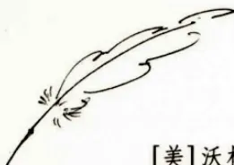
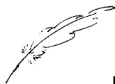
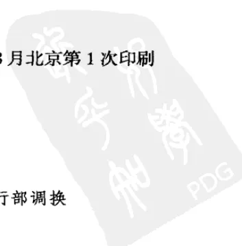
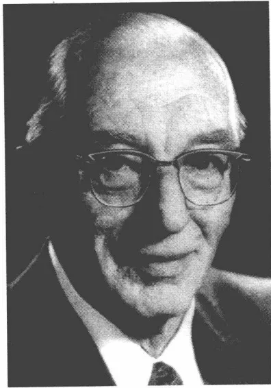

西方传统 经典与解释

Classici et Commentarii

# HERMES

刘小枫 ● 主编

[美]沃格林 Eric Voegelin ● 口述/订正

[美]桑多兹 Ellis Sandoz ● 访谈/实录/编辑

## 自传性反思

Autobiographical reflections

徐志跃 ● 译

华夏出版社西方传统 经典与解释 HERMES  
Classici et Commentarii

刘小枫 ● 主编

# 自传性反思

## Autobiographical reflections

[美]沃格林 Eric Voegelin | 口述/订正

[美]桑多兹 Ellis Sandoz | 访谈/实录/编辑

徐志跃 | 译

林志猛 | 校

华夏出版社## 图书在版编目(CIP)数据

自传性反思/(美)沃格林著;徐志跃译. -北京:华夏出版社,2009.7  
(西方传统:经典与解释)

ISBN 978-7-5080-5264-9

I. 自… II. ①沃… ②徐… III. 沃格林,E.(1901~1985)~政治哲学 IV.D097.125

中国版本图书馆 CIP 数据核字(2009)第 108533 号

*Autobiographical reflections*

by Eric Voegelin; edited, with an introduction, by Ellis Sandoz

Original Copyright ©1989

By Louisiana State University Press

All rights and control thereof purchased September 1998

By The Curators of the University of Missouri

University of Missouri Press, Columbia, MO 65201

北京市版权局著作权合同登记号:图字 01-2006-3426

## 自传性反思

[美]沃格林 著

徐志跃 译

出版发行:华夏出版社

(北京市东直门外香河园北里 4 号 邮编:100028)

经 销:新华书店

印 刷:北京市人民文学印刷厂

装 订:三河市李旗庄少明装订厂

版 次:2009 年 7 月北京第 1 版 2009 年 8 月北京第 1 次印刷

开 本:880×1230 1/32 开

印 张:7.125

字 数:170 千字

定 价:22.00 元

本版图书凡印刷、装订错误,可及时向我社发行部调换

## 缘 起

自严复译泰西政法诸书至本世纪四十年代，汉语学界中的有识之士深感与西学相遇乃汉语思想史无前例的重大事变，孜孜以求西学堂奥，凭着个人的禀赋和志趣选译西学经典，翻译大家辈出。可以理解的是，其时学界对西方思想统绪的认识刚刚起步，选择西学经典难免带有相当的随意性。

五十年代后期，中国政府规范西学经典译业，整编四十年代遗稿，统一制订新的选题计划，几十年来寸累铢积，至八十年代中期形成振袞挈领的“汉译世界学术名著”体系。虽然开牖后学之功万不容没，这套名著体系的设计仍受当时学界的教条主义限制。“思想不外义理和制度两端”（康有为语），涉及义理和制度的西方思想典籍未有译成汉语的，实际未在少数。

八十年代中期，新一代学人感到通盘重新考虑“西学名著”清单的迫切性，创设“现代西方学术文库”。虽然从译现代西学经典入手，这一学术战略实际基于悉心梳理西学传统流变、逐渐重建西方思想汉译典籍系统的长远考虑，翻译之举若非因历史偶然而中断，势必向古典西学方向推进。

九十年代以来，西学翻译又蔚成风气，丛书迭出，名目繁多。不过，正如科学不等于技术，思想也不等于科学。无论学界译译了多少新兴学科，仍似乎与清末以来汉语思想致力认识西方思想大传统这一未竟前业不大相干。晚近十余年来，欧美学界重新翻译和解释古典思想经典成就斐然，汉语学界若仅仅务竞新奇，紧跟时下“主义”流变以求适时，西学研究终不免以支庶续大统。

西方思想经典即便都译成了汉语，不等于汉语学界有了解读能力。西学典籍的汉译历史虽然仅仅百年，积累已经不菲，学界的读解似乎仍然在吃夹生饭——甚至吃生米，消化不了。翻译西方学界诠释西学经典的论著，充分利用西方学界整理旧故的稳妥成就，於庚续清末以来学界理解西方思想传统的未尽之业意义重大。译界并非不热心翻译西方学界的研究论著，甚至不乏庞大译丛之举。显而易见的是，这类翻译的选题基本上停留在通史或评传阶段，未能向有解释深度的细读方面迈进。设计这套“西方传统：经典与解释”，旨在推进学界对西方思想大传统的深度理解。选题除顾及诸多亟待填补的研究空白（包括一些经典著作的翻译），尤其注重选择思想大家和笃行纯学的思想史家对经典的解读。

编、译者深感汉语思想与西学接榫的历史重负含义深远，亦知译业安有不百年积之而可一朝有成。

刘小枫

2000年10月于北京A black and white portrait of an elderly man with thinning hair, wearing round-rimmed glasses, a white shirt, and a dark suit jacket. He is looking directly at the camera with a slight smile. The background is dark and out of focus.

沃格林 (摄于1980年)In consideratione creaturarum non est vana et  
peritura curiositas exercenda; sed gradus ad im-  
mortalia et simper manentia faciendus.

在对造物的研究上，一个人不应施展无用的  
和会朽坏的好奇心，而应该上升到不朽和永  
存的事物。

——圣奥古斯丁，《论真宗教》## 中译本说明

《自传性反思》可谓沃格林的一幅思想地图。在这部由口述整理而成的著作里,沃格林回顾了自己的求学经历,描绘了自己各个时期的研究。从群星荟萃的维也纳大学,到美、英、法诸大学,沃格林在游学中不断拓展知识视野,其间的种种细节扣人心弦。1938年,沃格林巧妙躲过盖世太保的逮捕,移居美国。

能运用十几种语文——甚至可以从我们中国的红色样板戏中识别出周代的歌词,沃格林这位魅力型教师的课堂,让无数学子心驰神迷。不过,要进入沃格林的研讨班,门槛可不低:至少得掌握一门古典语文(希腊语或拉丁语等),能流利阅读德语、法语和英语(根据研究领域的要求,有些还得掌握别的语文)。显然,沃格林对学生的要求源于对自己的要求:为研究古希腊经典、俄国政治、中国政治等,沃格林分别学了相应的语文。在这部自传里,沃格林展现的学习精神令人敬佩。

作为政治哲人,沃格林从教50年,留下34部著作,但始终关注的是政治的秩序与无序问题——他眼中的“根本问题”。由于亲历过纳粹统治,沃格林对意识形态极为敏感。但值得注意的是,沃格林并没有因意识形态的“苦涩经验”而落入另一种意识形态。或许,这应归因于对“柏拉图处境”的思索:基于身历无序的经验追问真正的秩序(参见沃格林,《城邦的世界》,编者导言,陈周旺译,译林出版社2009,页3,10)。正是对这一根本问题的关注,促使沃格林不断“反思”。在写作《政治观念史》时,沃格林意识到,“观念## 2 自传性反思

史”是个不恰当的概念,自己对政治观念史的先入之见在理论上并不恰当。为此,沃格林“彷徨”五年,逐渐认识到,政府执政的关键不在于代表的选举和程序问题,重要的是要实现如下“根本目的”:保障国内和平、执行正义、关心人民福祉等等。沃格林对“代表”问题的认识与施米特如出一辙——国王在上帝面前是人民的代表,在人民面前是上帝的代表,“生存的代表”需要“超越的代表”来补充。一个与意识形态搏斗的人能作出这样的反思,实在令人惊讶。

无论沃格林对“根本问题”的思考是否透彻,强烈的反思精神一直在推动他走向思考的纵深。值得我们这些习惯于“怀疑”和“批判”的智识分子们好好学习的是:沃格林并没有止步于自己早年获得的立场或观点,而是紧紧抓住“根本问题”,在思考之路上勇于改弦更张。“怀疑”和“批判”并不仅仅是对外的,更重要的是指向自身——反思自己的思想结构,促使问题持续深化,而非几十年如一日没有推进,以为凭借一点儿逻辑思辨的推理就可以解决所有复杂的思想或政治难题,甚至自负地宣称,沃格林或施米特的思考“过于天真”。

在沃格林勾勒的这幅思想地图中,我们可以领略到种种风貌:象征、意识、秩序、历史哲学、神显、实在、经验……这些勾勒是预备性的,为我们进入沃格林的相关著作提供了门径。要进一步深入这些问题,只能按图索骥,回到相应的文本。这幅地图可使我们不至于在沃格林的思想迷宫中迷失方向。

林志猛

2009年8月

中国人民大学文学院

古典文明研究中心## 全集版编者导言

《沃格林全集》最后一卷包含沃格林的《自传性反思》（根据1989年版本重印，增加了少许注解），“沃格林著述中的术语表”（含简释），本卷索引和全集累积索引。① 累积索引不涵盖《政治观念史稿》（全集卷二十六本身包含了《史稿》累积索引），卷二十九和卷三十是书信全集当然也不包含在内，因尚在制作中。②

我并不试图作全面的注解，只是就《自传性反思》中的对话性质的讨论议题，指出一些线索，让读者了解《全集》各处，沃格林对这些议题更为技术化的和更为充分的关注。鉴于《自传性反思》是在1973年实录的，这些线索有助于填补一些细节，尤其是对于其后的一些出版物的寻索。当然，富有说服力的叙述自成一格。同样的方法也可见于术语表，由尤金纳·魏伯（Eugene Webb）辑录，我做了补充。我们并不声称这是一个完全的沃格林技术性术语列表——他本人是极富成就的使用多种语言的人，能运用十多种语言，他的词汇有时候被视为理解上的绊脚石——因此，术语的选择，[1] 其定义和例示来自沃格林的著述，尤为关

---

① [译按] 中译本不含术语表和累积索引，书末索引不含术语表的条目。

② [译按] 卷三十已经于2007年出版。## 2 自传性反思

注希腊词汇。这是希望，特别是新的读者将发现，这两份文献有助于他们在阅读沃格林其他著作时有深入的理解。本卷还包括《全集》累积索引，系统地包括姓名、主题、观念、著述和术语，为学者进入《全集》的整体内容提供了便捷通道，也为任何对沃格林全部著作的严肃研究提供了不可替代的帮助。

本版的每一卷都包括由编者撰写的学术性导言，提供了洞见和评论。八卷《政治观念史稿》（全集版第十九至二十六卷）还另有总导言。本卷还有我在2005年稍加改写和扩充的《自传性反思》的导言。这些导言，如果汇集成册，本身就构成对沃格林从1921年开始直到遗著《求索秩序》①的工作的技术分析和评论。

对转向这些出版物的任何人来说，沃格林作为伟大学者的工作的范围之广和意义之深，都明摆着。然而，在全部这些著作中很少显示的，则是沃格林作为教师——他是一个超级教师——的明证，主要的例外就是《自传性反思》中几页内容。我们曾尝试填补这一空隙，为此在第二十届沃格林协会国际会议专门开设一个圆桌会议。② 但是，既然沃格林在长期职业生涯中是作为教师来谋生的，而在他所有的工作中极为有意地追求授业和解惑，同时也寻求发现和[2]知晓，因此，在这里稍稍谈点他作为教师的教学法和人格，读者也许会感兴趣。

以我自己的经历来说，我第一次遇见沃格林是在路易斯安那州立大学。那时候，我是一名本科生，选修了他的一门主课，面

---

① 《秩序与历史》卷五，1987年出版问世，收入《全集》卷十八，2000年版。

② 该届沃格林协会年会以“大师级教师沃格林”（Eric Voeglin as Master Teacher）为题的讨论组论文可以在下述网站查阅：[www.cricvoeglin.org](http://www.cricvoeglin.org)。全集版编者导言 3

向三四年级的“政治理论研究”，然后一路读下去，并在他的指导下写出硕士论文。自从第一堂课起的十五年之后（我在美国海军将近三年，加上有两年在海德堡大学学习），我又继续在慕尼黑跟着他完成我的博士论文。从在路易斯安那和在慕尼黑这样的经验，我可以说，沃格林博士在课堂上是令人钦佩的、引人注目的人物——不论是大课，还是讨论课。讲课引人入胜，他从不照本宣读，通过脱口而出的扼要提示和提纲，复杂的材料被十分有力而清晰地传达出来。每堂课似乎都有其特殊的时刻，通常有一种探险感，即，伴随着一场知识探险，进入未知海域。沃格林的课堂上不会庸常，正因此，他吸引了全校各系的学生和旁听生，以及社会上的公众。他的硕士生（那时候，路易斯安那大学还没有博士生）讨论课一般晚上在他贝顿罗格（Baton Rouge）的家里进行，女主人（丽希·沃格林）则在一旁聆听，每当休息之际，她总会端上茶点。我记得有一次讨论课是读亚里士多德《形而上学》的第十一章。在这一学期的讨论课中，我们每次课的前半段时间是一句句研读，沃格林对照希腊文原文来核对译文，并校正、修改和讲解文本。在每次的下半段时间，学生表述围绕所分配的其他种种课题，并进行讨论。我在慕尼黑参加的第一个讨论课也按照类似程序进行，细读柏拉图的《普罗塔戈拉》，并逐行讨论。在这过程中，他发现，他在《秩序与历史》卷三《城邦世界》① 中给出的分析里，有个解释观点是错的，并说在该书下次重印时要修正。在慕尼黑的路德维希 - 马克西米大学（Ludwig - Maximilian - Universität），[3] 研讨班更大更正式，一般是在沃

---

① 全集卷十五，十一章三节。#### 4 自传性反思

格林 1958 年担任教授职位时建立的政治科学研究所进行。

先概括一下：沃格林要求学生的注意和尊敬，他把自己呈现为知道本行当的内行。他基于一个坚定的确信，即，古典希腊哲学是政治科学的根基：讲课材料是从这个一贯的起点来呈现的。对真理的献身，和向学生沟通真理的意欲，在每堂课和每个讨论中显明出来，并伴随着问题的探究，这种探究始终反映出，朝向实在之神性根基的张力乃是探索人之条件和政治议题的决定性背景。向着实在之地平线的开放感，拒绝截去实在的顶端，或者说，拒绝与任何种类的简约主义的建构走在一起，鼓励学生用充分的资源投入到对复杂多端的材料的研究，并使学生在讨论中成为伙伴，而不仅仅是吸收冷漠的信息的观众，这反过来鼓励学生在理解艰难的材料时同情性地把他们自身的常识、智力和信仰经验卷进个人的反思意识。这某种程度是基于苏格拉底的“看看、想想这是否不是实情”的模式——即，经由个人的理解和质问来证明分析性话语。

因此，某种程度上，沃格林和他的课堂其实是在做他所教的“科学”，不论是在讲课中还是在研讨班中，并且，每个人都知晓，这就是我们正在做的：学生和课堂是说服性探究的参与者，某种程度上可以被称赞为对真理——对重要真理——的一种追求。我认为，在有价值的探究活动中的这种易察觉到的参与感，加上他生动的幽默感，也许是沃格林作为教师和讲课者，不论走到哪里都受到欢迎和吸引人的主要源泉。

若如此理解的话，加上我前面提示的，我们就可以清楚地看到，“教学”处在非常接近沃格林工作的核心位置，这不仅是在出版物中，而且也在广泛的讲学中。正如他 1972 年在塔夫兹大全集版编者导言 5

学弗莱切学院的一次谈话中所说：“[慕尼黑政治科学研究所的]基金会提供[给我]建立[4]政治科学的机会，从外部，又在当代科学的水平。我们可以避开描述性工具主义，历史实证主义，以及形形色色左右意识形态意见的常规镇重物……有可能建立这样的课程设置，其核心课程和讨论课围绕古典政治学，并强调洛克和《联邦党人文集》的英美政治学。”①

沃格林的教学方法坦诚地沟通他的思想的默想性根基。“上帝”不是一个脏词，他经常向他的听众（尤其是更为意识形态头脑的慕尼黑学生）强调，“科学”是被“经验和理性”控制的——并且，你不能走到“启示的背面”，并佯称它（即，领悟的灵气经验）从来没有发生。在他教学达十六年之久的路易斯安那，“信仰”之经验性根基是更为可见的。②事实上，他总是以多种多样的方法在讲述“不朽的拯救故事”——这出于一个确信：超越经验对人之为人的生存来说，是根本性的，这在他已经出版的著作中也是一再强调的。这既不是“从宗教角度”，也不是从枯燥乏味的假设出发来论证，而是从科学上以经过批判性确认的历史事实基础为支撑，并与所讨论的诸般主观要事构成整体。一个教授（professor）总被期待声称（profess）某种东西，那是就他对此所知而言的不动感情地确肯的真理——沃格林是这么想的，也一直这么说。这是马克思·韦伯意义上的“心智健

---

① 全集卷三十三《人性的戏剧和其他未刊论文，1939—1985》，页348。

② 参库珀（Barry Cooper），《沃格林和现代政治科学的基础》（*Eric Voegelin and the Foundations of Modern Political Science*），第一、二章，密苏里大学出版社，1999年。另参：安布瑞（Charles R. Embry）编，《黑尔曼与沃格林：书信中的友谊》（*Robert B. Heilman and Eric Voegelin: A Friendship in Letters, 1944—1984*），密苏里大学出版社，2004。6 自传性反思

全”，即科学的客观性的核心之所在。

他在讲课中有效地使用写在黑板上的简图；一般总是弥漫着一种轻松的氛围，这种轻松在精神上是苏格拉底式的：他常常会说，我们正在处理重要的事情，但我们在这里对它们的讨论也许并不非常重要。不过，在具体场合的限度内，他的目的显然是[5]严肃的。办公室接待学生的时间是被非常严谨地遵守的，但学生不太愿意待得比他们解决不得不问的问题所绝对必要的时间更长。有点诙谐意味的是，用无关紧要的问题占据这位教授的时间，他们或许在妨碍文明本身的进展。

对待本科生温柔一点，这是规则，并且打分也相当慷慨，但是，对于那些懒惰的笨蛋，要是让沃格林碰到，可就倒霉了。他评论说：“我这辈子一直不得不在讨论课伊始就向学生说明：根本没有一种叫做愚蠢的权利的东西；根本没有一种叫做文盲的权利的东西；也根本没有一种叫做无能的权利的东西。”①他在论辩中也极具摧毁力。假如你是教师队伍中的一员，却又不知道你在说些什么，那么，你在公开的讨论中就只有求老天帮忙了。

在路易斯安那大学较早的一代学生中，哈福德（William Harvard）先生回忆过当时的印象。他在本科两年级开始上沃格林的课，最终成为行政系的系主任。他写道：

作为一名教师，沃格林从来不炫耀才气；他的影响纯然基于渊博学问和分析能力。假如一个人恰好站在他的实际语言可以得到理解的界限之外，那么，他的讲课听起来也许就

---

① 全集卷三十三，页419。全集版编者导言 7

单调乏味了，因为句子的流动加上缺乏抑扬曲折就可能构成要命的均匀性，要是碰到某个比沃格林更不会激动的人，也就可能是死气沉沉了。我先是作为本科生，后来是研究生，再后来是年轻同事，坐在他的课堂和讨论班上，而每当我听到同行内的同事诋毁地说他“傲慢”或“严厉”，我总是惊讶不已。我总是在他身上发现，他对学生超常的体谅，对他们理解上的问题非常有耐心，在评分问题上也是心慈手软。在指导研究方面，就像人们可以想到的那样，他是一个准确的评论者；但他对他的时间和思想，是非常大方。他有一种淘气的幽默感，常常是由于他德语口音出乎意料地冒出来的。① [6]

对于沃格林在慕尼黑的教学来说，非常幸运的是，有根据录音整理的主要文件，他的“政治科学引论”，出版时作《希特勒与德国人》。② 这是他1964年夏天所做讲座的录音稿，它显然是毫无先例的政治科学引论。此处我无意对这些讲座作分析或者概括，既然对任何感兴趣的读者来说，该书很容易获得。但人们可以赞同该书编者的主张，即，这“毫无疑问是慕尼黑大学人文教师中最为惊人的课程”。理由容易确定：“对他的大部分学生来说，就像他们中的一位事后描述的，‘它是他们经历的德国教育的顶点，因为，他们从来没有遇到这样如此直言不讳地告诉他们

---

① 哈福德（William Harvard），“沃格林之历史和意识概念的变迁模式”，《南方评论》，第七期（1971），转引自桑多兹《沃格林革命》（*The Voegelinian Revolution: A Biographical Introduction*），第二版，2000年，页75。

② 全集卷三十一，另有平装本，中文版将由上海三联书店出版。8 自传性反思

真相的教师’”。① 这些讲座之影响力的主要理由是它们的沉思维度，正如该卷书编者说明的，这里，沉思的具体含义在于：唤起对部分被擦掉的、部分被拒绝的生平经验和历史经验的记忆（或 *anamnesis*，回忆；既往），那些经验旨在隐瞒自身。

讲座的方法是既往性的，其意义在于克服“在人的当前生存中对秩序之起源、开端和根基的”遗忘。在讲座中，这种既往性努力采取不同的形式：重新唤起哲学的和启示的洞见，面对根本性的忘却（聪明的或不聪明的），把大量新近确认的历史材料提高到理论的相关性。而原则和无序的数据资料之间的互动还相关性地加深了既往性沉思本身。②

编者正确地总结道：“沃格林作为政治哲学的教师也许可以被视为根植于他自身承担见证的人生”。③

爱理斯·桑多兹 [7]

---

① 同上，页1-2。此处是海宁森（Manfred Henningsen）的话，他是沃格林当时的助手之一，后担任夏威夷大学政治科学教授。

② 同上，页29，内引自沃格林，“意识和秩序”，《既往》“序”（全集卷六）。原刊《逻各斯》（*Logos: Philosophical Issues in Christian Perspective*），第四期（1983），页22。

③ 同上，页34。另参桑多兹，《沃格林革命》，页47-70。## 修订版导言

沃格林的《自传性反思》口述实录于1973年，该书使他得以简明扼要地审视并解释自己至此为止的大部分工作。沃格林是我们时代闻名遐迩的学者，也可以说是我们时代最伟大的哲学家，这些反思为管窥其人格和思想，提供了可能是最好的门径。在这份自传式的描述中，沃格林解释了沃格林，这份描述旨在阐明他的其他著作，并确立这些著作在他整个思想视野中的位置。《自传性反思》具有权威、敏锐、典雅和深刻的特点，既揭示了从二十世纪二十年代以来，沃格林所经历的不同发展阶段中，其出众学术工作的诸般动机，同时也展现了那些认识他的人所熟悉的工作背后一个学者的风范：亲切友善，聪明，勇敢，坚韧，严格，博学，以及对根本原则的坚持。沃格林《自传性反思》的出版乃是重大的知识事件。

为这样一本简明而可读的书作复杂精致的引论无疑是画蛇添足。但是，稍稍花点笔墨来简要概括一下沃格林的生平，以及纪录《自传性反思》的缘起，也许是切题且有助于读者的。

艾瑞克·赫曼·威尔海姆·沃格林（Erich Hermann Wilhelm Voeglin）1901年1月3日出生在德国科隆（Cologne），1985年1月19日在加州斯坦福（Stanford）去世。其父奥托·斯蒂芬·沃格林，其母伊丽莎白·瑞尔·沃格林，父亲是位建筑工程师。沃## 2 自传性反思

格林一家住在莱茵兰的科隆和柯尼希维特（Königwinter），直到1910年，举家迁往维也纳。艾瑞克在维也纳上学，并进入维也纳大学读书，最终成为该校法学系的政治科学副教授〔15〕。但在1938年的“吞并”之后，他立即被纳粹解了职，因为他反对希特勒（尤其体现在1933年至1938年间出版的四本书中），就在盖世太保逮捕他之前，他幸运地逃到了瑞士。随后不久，他与妻子（婚前姓名：露丝·贝迪·“丽希”·盎肯，生于1906年9月3日，死于1996年10月8日，她与沃格林在1932年7月30日结婚）去了美国。先在哈佛大学行政系担任一年助教，并在第二学期兼课于佛蒙特州的本宁顿学院，之后在西北大学暑期学院任教。在威斯康辛短期工作后，于1939年秋天到阿拉巴马大学任教，达两年半时间。

1942年1月，沃格林正式加盟路易斯安那（Louisiana）州立大学行政系。直到1958年1月，他一直住在贝顿罗格（Baton Rouge），曾被选为路易斯安那州立大学三位博伊德教授之一。在路易斯安那的16年间，他用英语撰写和出版了：使他出名的《政治的新科学》（*The New Science of Politics*, Chicago, 1952年），那是基于他此前两年在芝加哥大学的威格林（Walgreen）讲座；《秩序与历史》（*Order and History*）前三卷：卷一《以色列与启示》（*Israel and Revelation*），卷二《城邦世界》（*The World of the Polis*），卷三《柏拉图和亚里士多德》（*Plato and Aristotle*）。①他和丽希于1944年成为美国公民，此后一直保持着美国国籍。不

---

① [译按] 收入全集卷十四至十六，中文版将由译林出版社出版。《政治的新科学》收入全集卷五，中文版将由上海人民出版社出版。修订版导言 3

过，1958年，沃格林接受了一项任命，即，慕尼黑的路德维希—马克西米（Ludwig—Maximilian）大学的政治科学教授，并在那里建立新的政治科学研究所。在这一时期，他的主要出版物是《既往》（*Anamnesis*, 1966），① 该著直接提出了英语著作背后的意识哲学。十年后，沃格林于1969年永久性地返回美国。此后五年，沃格林担任斯坦福大学哈佛战争、革命[16]与和平研究所的萨韦特里（Salvatori）著名学者。正是在此期间，《自传性反思》得以产生。在此时期结束之际，《秩序与历史》卷四终于出版，题名《人居领地时代》（*The Ecumenic Age*, LSU, 1974），② 离卷三出版时间已有十七年。退休后，沃格林继续住在斯坦福，他和妻子丽希的墓地也在此。他们没有生育孩子。

除了上面提到的著作外，沃格林教授生前发表了约一百篇论文；留下大量未刊手稿，包括题名为“政治观念史”（*The History of Political Ideas*）的多达四千页规模的研究：此项著作部分被吸收进《秩序与历史》，并有十一章为哈洛威尔（John H. Hallowell）编辑出版，题作《从启蒙到革命》（*From Enlightenment to Revolution*, Duke, 1975）。③ 《秩序与历史》卷五作为遗著出版，题名《求索秩序》（*In Search of Order*, LSU, 1987），乃是沃格林关于政治、历史和意识之革命性哲学的巅峰之作。

---

① 英译本出版于1978年，修订版收为全集卷六（1990）。

② [译按] 全集卷十七。书名中的 *ecumenic age* 指的是人类历史中的一段时期，大约从波斯帝国兴起到罗马帝国没落为止，其特点是通过帝国的征服或权力建立有秩序的地域，当然主要是人居住的地方。中文的“天下时代”可以表达一部分意思，但出于其语义的丰富性考虑，暂时译作“人居领地时代”。

③ [译按] 构成八大卷的《政治观念史稿》作为遗著收入全集卷十九至二十六，中文版将由华东师范大学出版社陆续出版。4 自传性反思

关于在何种意义上沃格林的工作可理解为革命性的，可参考我在《沃格林革命：传记性引论》（*The Voegelinian Revolution: A Biographical Introduction*, LSU, 1981）① 中的论辩，而《自传性反思》的存在理由也正在于我在准备做该项研究时的需要。因为，在1973年，沃格林根本不会考虑写自传或者回忆录——除了他在1943年早已做过的并只在《既往》中发表的回忆性试验之外。那些迷人的素描般的忆往片段涵盖他整个童年的经验，他发现自己作为一个人的意识的构成，开始于14个月大的时候第一次的记忆，直到10岁左右。在1972年和1973年，他正努力于完成《人居领地时代》（次年问世）。我自己的工作则要求更多有关他的传记的细节，而当时能够得到的信息远远不够，因此，我开始进行录音访谈，就一些对我研究他的思想来说是重要的议题展开。这些访谈涉及许多议题和事情，最终在1973年夏天期间[17]得以完成，那时，为了收集信息我访问了斯坦福，并开始尝试把一些有关沃格林思想发展的编年性和主题性的描述放在一起。在几次错误的开始之后，我们才找到进行一系列访谈的程序，基础是我的询问，而沃格林则可以以口述实录的形式来回答。可以肯定，口述记录可做到准确无误，他的秘书在场，用速记记下所有的口述。这一切都在6月26日至7月7日之间（我们当然要庆祝7月4日）的几天内完成，在沃格林在索诺马街（Sonoma Terrace）的住所的工作间进行——在雪茄烟雾中，这烟雾来自他每天消耗的18支左右的King Edwards牌雪茄；在两条宠

---

① [译按] 初版于1981年，路易斯安那大学出版社，2000年Transaction出版社再版。中文版将由上海三联书店出版。修订版导言 5

物北京犬暴烈而频繁的狂吠声中，尽管沃格林夫人尽了最大努力让它们保持安静，但两条狗还是到处制造麻烦；还有割草机的嗡嗡声和唧唧呱呱，真空吸尘器的咆哮，和不时的电话铃声。（这些环境因素在文本中毫无体现，但我在预备书稿出版再次聆听长达27小时的录音时，它们在我的记忆里是如此鲜活，并且也是最真切的一部分“经验”，尽管已经过去整整15年了。）录音记录稿随后让沃格林阅读和修改，然后重新打印以形成修订过的文件，我称之为沃格林的《自传性回忆录》（*Autobiographical Memoir*），并在我的著作中大量引用。后来，1989年单独出版时重新定名。

假如沃格林有目的地坐下来，按照自己的意志单独写一部自传，将会是什么样子？对此，我们难以知道。我的寻问所唤起的回应就是我们这里看到的。所问和所答的问题并非是事实类型的基本信息问题，而是那些对于充分和准确理解沃格林所写的或与他有关的材料至关重要的问题，对这些材料的研究，我在1950年听他的研究课的本科生时代就已经开始了。不论主题有多么复杂，沃格林作为教师的伟大才赋就在于，他有能力以活生生的口语方式来简单地、明晰地且有说服力地表述它。这一才华我有幸在我对他的访谈中得先领略，这些访谈其实成了私下的讨论课——为期两周，每个早晨二至三小时。起先是相当形式化的（*pro forma*）例行公事——（我觉得）一定程度上可视作为一种手段[18]，旨在让持续不断的追问停止，并摆脱一个执意让他从“工作”中分心的麻烦追问者——却有了意想不到的活力。沃格林对主题感兴趣。然后他开始指挥，起先是在刺激之下而且有点不情愿，然后就下决心，最终饶有兴味地保留了“工作”本身，这工6 自传性反思

作渐渐转变成对埃瑞克·沃格林实际过往的进一步求索，而那个时候，沃格林的故事抵达了进入高级哲学之沉思性对话的最佳时刻。即使文本上是冰冷的，但结果却是大家都可以为之欣喜的胜利。

最后，在我现在看来，《自传性反思》是任何不熟知沃格林的人开始他们的研究的最佳地方。这么做的主要价值在于，这是非常有利的位置，在一个具体的人的传记中以简单直接的语言探索多个语境，而这个人恰好善于反思性地理解高度分层的实在，这实在又是我们作为人都必然参与其中的。我愿强调有着埃瑞克·沃格林这个名字和身份的特定个人生命和思想的具体性。

以常规的假设方式来探索抽象语境和有关它们的抽象问题所具有的含混性，也因此由下列事实得到修正，即，这里，你是在面对一个人的回忆，这个人从他自己个人的和智性的“人生历程”（pilgrimage）——从弥漫四处的实证主义和致命性的国家社会主义，走向哲学化的开放生存，而帮助他的，主要是古代经典，基督教经院学术和神秘传统，以色列的古代先知和新约的使徒（也包括其他资源）。沃格林人生旅程的一个突出部分是他可察知的求索和逐步推进的发现——和他的涉及面之广——去何处寻找帮助和解救，尤其是身处制度性毁灭、知识分子的道德败坏和人格的堕落之时。在这种情况下，他是如何做的？这就是这本小书的实质。

这样一种回顾我认为也是一条去理解心灵生活与人格的成熟之间所谓的“关联性”的最佳途径。它承载着作为第一人称叙述的本真性，那是事实的，诚实的，智性的，幽默的和精致复杂的。顺路而下，一个人开始认识到，诸般问题[19]以及这些问修订版导言 7

题的起源构成语境的“镶嵌画”，在其中，我们每个人或多或少将依然发现我们生活着，并在实质性程度上卷入其间。

因此，你从中所获得的某种结果类似于从阅读奥古斯丁的《忏悔录》或柏拉图的《申辩》所获得的。沃格林寻求哲学化，为的是，在一个被种种次等的实在——且不提种种虚拟实在——主宰的世界，重新获得实在的指南针，这对他自身和对于他人都是一项生死攸关的紧要事——正如他曾经提到过的。①在这本小书中，我们得以一瞥沃格林做此事的实际方式——不仅作为有待解决的智力问题或有时候玩过的危险游戏，而是通过活出来的生命。那也是为什么我特别喜欢这本小书。他是向我讲述的，围着一张桌子，面对面，一个人对另一个人，但这并不妨碍阅读。

读者也许将会对沃格林精简生平概括感兴趣，那是现在这个文本被听写之后约10年给出的，题名“82岁之际的自传性陈述”。②

此外，对原书的评论也有一些。③这些评论一般都同意，“此书用作对沃格林工作的出色介绍，因为它提供的历史的和传记性背景不仅揭示了作者的动机，而且识别出他有关政治、历史、意识的本质和神性显现等方面许多最重要的思想发展的来源并勾勒了发展过程”。④然而，也有不满意之处，比如，“沃格林对一些他不表赞同的思想家的观察常常是激怒人的，有时候是如此不近

---

① 在《以色列与启示》（1956）序言倒数第二段，全集卷十四。

② 载全集卷三十三，页432-56。

③ 评论目录可参见普莱斯（Geoffrey L. Price）和洛赫纳（Eberhard Freiherr von Lochner）编，《沃格林：国际文献，1921-2000》（Wihelm Fink Verlag，2000），页200-201。

④ 密特谢林（Jeff Mitscherling），见《欧洲观念史》杂志，1990年第五期，页705。8 自传性反思

人情 (silly)，以至令人惊恐”。① 另一位持较为颂扬态度的评论者责怪编者没有写下更长的介绍，没有提供更多的注释，没有为第一版提供索引。② 这些不足在目前这个版本部分得到弥补，1996 年路易斯安那大学出版社的平装版 (20) 就已经加了索引。伊安·克劳特 (Ian Crowther) 发现可推荐之处太多了，尤其是其中对经验的追溯提供了理解现代“显现自我的反叛” (egophanic revolt) 的钥匙。他总结道，尽管我们还没有见到空想家之“第二实在”的最后品种，但我们经过许多苦恼之后，现在终于能够在沃格林和他的阐释者的帮助下……看穿它们”。③ 托马斯·德伊夫林 (Thomas DeEvelyn) 则写道：

[《自传性反思》] 留给读者的印象是一种具有魅力的和流畅的理解。在沃格林对极左知识分子之反智主义和反美主义的攻击中，他有点像阿兰·布鲁姆。但两者有着巨大的差异。人们记住《美国精神的封闭》的作者，最主要是因为他的攻击的猛烈和华丽。人们记住沃格林，主要是因为他……对“古典哲人的伟大发现”——“人不是‘必朽者’，而是朝向不朽运动的存在者”。……仔细研究沃格林完整的著作，人们看见的不是巨大的、蹩脚的、光彩夺目的凯旋门，而是一道彩虹。④

---

① 同上。

② 鲍利尔 (Maben Walter Poirier)，见《现代时代》杂志，1992 年春季号，页 262。

③ 克劳特，“实在的秩序”，载 *Salisbury Review*，1992 年 3 月号，页 43。

④ 德伊夫林，见“世界级史学家发现无序之上的秩序”，《基督教科学箴言报》，1989 年 11 月 6 日。修订版导言 9

最后提一下昆兹（Paul G. Kuntz）引人注目的评论性论文，他从书中提炼出新的“十诫”——神学的诫命，道德的诫命，哲学的诫命，以及学者的诫命，他这么称它们——他还以一段华彩文字总结道：

这卷书，篇幅轻轻，却传递出一个有着规范力量的巨人的形象。我发现论说本书的最佳方式是说，沃格林是一个摩西，要呈现他的刻上律法的石版（tablets of the law）。在学术生涯中——最好概括为漂移，就像以这样或那样的方式被种种喧嚣的压力集团所拉的漂移，——沃格林最清楚地把握到了，为什么我们应该接受四种绝对律令。①

现在说说技术性细节：第十一节之后，分段和标题都为我所加；括弧中的注释和插入句子是编者加入的；语法上的些微改动是责任编辑默默地做的；文本中不小心遗漏的但录音带上有的，意思清晰的现在都予以恢复；斜体（〔译按〕中文用楷体）或黑体强调皆为编者所加。〔21〕既然此书稿的缘起明显是这样，亦即，为别人撰写的一项研究作准备的背景性研究论文，因此，沃格林也就不会像对待自己的专著手稿那样仔细修改，直到最后出版。我加倍小心，力图填补这一空白。在准备此全集版的时候，又插入了一些改动和修正。

爱理斯·桑多兹 [22]

---

① 昆兹，见 *Intercollegiate Review*，1990年秋季号，页50。# 目 录

<table><tr><td>中译本说明 .....</td><td>1</td></tr><tr><td>全集版编者导言 .....</td><td>1</td></tr><tr><td>修订版导言 .....</td><td>1</td></tr><tr><td> </td><td></td></tr><tr><td><b>自传性反思</b> .....</td><td>1</td></tr><tr><td>    维也纳大学 .....</td><td>2</td></tr><tr><td>    高级中学 .....</td><td>8</td></tr><tr><td>    马克斯·韦伯 .....</td><td>11</td></tr><tr><td>    比较知识 .....</td><td>14</td></tr><tr><td>    乔治和克劳斯 .....</td><td>16</td></tr><tr><td>    纯粹法理论：新康德主义的方法论 .....</td><td>20</td></tr><tr><td>    政治的刺激因素 .....</td><td>24</td></tr><tr><td>    关于我的博士论文 .....</td><td>26</td></tr></table>## 2 自传性反思

<table><tbody><tr><td>关于 1921 或 1922 年在牛津 .....</td><td>27</td></tr><tr><td>美国的影响 .....</td><td>28</td></tr><tr><td>关于在法国的那一年 .....</td><td>34</td></tr><tr><td>回到维也纳 .....</td><td>38</td></tr><tr><td>吞并和移民 .....</td><td>42</td></tr><tr><td>关于意识形态、个人政治见解和出版物 .....</td><td>45</td></tr><tr><td>关于在 1938 年的移民 .....</td><td>55</td></tr><tr><td>生活在美国</td><td></td></tr><tr><td>    ——从哈佛到路易斯安那大学 .....</td><td>58</td></tr><tr><td>从政治观念史到经验象征 .....</td><td>63</td></tr><tr><td>舒茨和意识理论 .....</td><td>71</td></tr><tr><td>秩序和无序 .....</td><td>76</td></tr><tr><td>《秩序与历史》的背景 .....</td><td>79</td></tr><tr><td>教师生涯 .....</td><td>86</td></tr><tr><td>为什么做哲学？为了再现实在！ .....</td><td>94</td></tr><tr><td>历史哲学 .....</td><td>103</td></tr><tr><td>真理的范围、恒定性、遮蔽和等价 .....</td><td>109</td></tr><tr><td>意识、神显和神秘主义哲人 .....</td><td>113</td></tr><tr><td>革命、开放社会和制度 .....</td><td>116</td></tr><tr><td>终末论和哲学</td><td></td></tr><tr><td>    ——死亡的练习 .....</td><td>121</td></tr><tr><td><b>附录</b></td><td></td></tr><tr><td>    论沃格林对政治理论的贡献/哈弗德 .....</td><td>125</td></tr><tr><td><b>索引</b> .....</td><td>165</td></tr></tbody></table># 自传性反思## 维也纳大学

我在维也纳大学上学，入法学系，1919年至1922年间完成博士学位。一战结束时，奥匈帝国的解体决定了那时的大学氛围。就该大学的构成来说，它依然是帝国首都的大学，在其学术和教授们的个人态度上，反映了一种世界主义的氛围。在我还是一名学生的时候，以及在整个二十年代，甚或直到国家社会主义的后果在三十年代初显示出来的时候，维也纳依然拥有极为宽广的知识视野，并且数个领域的科学研究在国际上处于领先地位。首先是凯尔森（Hans Kelsen）的纯粹法理论，以他本人和他日益增多的年轻弟子为代表，尤其是菲德洛斯（Alfred von Verdross）和梅科尔（Adolf Merkl）。第二，有奥地利边际效用学派。庞巴维克（Eugen von Böhm-Bawerk）那时已经去世，但威瑟（Leopold von Wieser）依然是名声显赫的老人，开设经济学理论方面的主课。年轻经济学家中，有因发展了货币理论而声名鹊起的米塞斯（Ludwig von Mises）。那时候，熊彼特（Joseph A. Schumpeter）在格拉兹，当然，他的作品也为人研究。那时对年轻人产生影响的其他知识与精神氛围中，还可以追溯到马赫（Ernst Mach）的理论物理学派，当时的代表人物是石里克（Moritz Schlick）。那个圈子中的重要知识力量是维特根斯坦（Ludwig Wittgenstein），其影响在于他的研究，而不在于他的在场。另外还需要提及的是奥地维也纳大学 3

利历史研究所 (Austrian Institut für Geschichtsforschung)，道普西 (Alfons Dopsch) 是其代表人物 [31]。在那时，道普西因着他对卡罗林王朝经济历史的研究，已取得国际声望。

在年轻人当中，有布伦纳 (Otto Brunner) 这一正在崛起的力量，他后来因他的中世纪封建主义理论而声名远播。① 那时，维也纳大学其他可引以为荣的是艺术史，以德弗拉克 (Max Dvořák) 和斯特兹高斯克 (Josef Strzigowski) 为代表。我入学时德弗拉克已过世。但斯特兹高斯克仍很活跃。我听过他的文艺复兴艺术史课程；特别吸引人的是他对近东艺术的兴趣，在这方面，他有关亚美尼亚的二卷本著作是伟大文献。同时，在维也纳充满活力的，还有史前史研究所。

就我所关心但处于边缘位置的，则有诸如威勒茨 (Egon Wellesz) 领导的著名的拜占庭音乐研究所，我熟悉威勒茨则是在后来。国家社会主义者占领后，威勒茨去了牛津。此外，必然产生巨大影响的是心理学家。我上了斯沃博达 (Hermann Swoboda) 的课，他非常迷恋克莱斯 (Ernst Kries) 的节奏理论；但是，斯沃博达是弗洛伊德的亲密朋友。说到斯沃博达的心理学，就必然要进入另一层背景，即，他早期与魏宁格 (Otto Weininger) 的友谊。那时候，魏宁格的著作几乎人人都读。当然，心理学中最重要的影响来自弗洛伊德的出场。我不属于弗洛伊德的圈子，而且从来没见过他，但我非常了解几位受他训练的年轻人。我那时候认识的这些人当中，最重要的有哈特曼 (Heine Hartmann)，他后来去了纽约；还有维尔德 (Robert Waelder)，他后来在费城有所

---

① 尤其是其《国土与统治》(*Land und Herrschaft*)，第四版 (1959)。4 自传性反思

作为；再有就是克莱斯，他后来去了澳大利亚。

现在讲讲法学院的构成。那时候颇吸引学生的伟大知识人物是凯尔森这位奥地利宪法的律师和缔造者，以及斯潘（Othmar Spann）这位经济学家和社会学家，他发展出一种普遍主义理论，并完成了对人民经济的一种结构分析，其内容所及远远超出了更为严格的边际效用理论家处理的主题。吸引众多学生的第三个人物是格吕恩伯格（Carl Gruenberg），一个坚定的社会民主党人[32]。伴随帝国解体的剧变以及1918年共和国建立而来的，是社会民主党逐步崛起，在我曾参与的第一次选举中，我投了该党的票；有一位重要人物是社会民主党的主要理论家，那就是麦克斯·阿德勒（Max Adler）。更为边缘的，就我所知，是一些卓越的律师，比如，国际法领域的斯特里索维尔（Leo Strisower），推行民法改革的谢伊（Schey），以及民事诉讼领域的胡普卡（Hupka）。

我作为一个学生注册的课程系列，通向政治科学博士。读这些引向政治科学博士的课程的决定，部分出于经济考虑，部分出于原则。就经济状况来说，我很穷，而一个可以在三年内完成博士的课程系列特别令人动心。法律博士也许要求四年时间。至于原则问题，其实是那时候的一个含混但强烈的冲动，即，我要从事一份科学职业。法律博士有这样的诱惑：一个人假如不成为一名独立律师，就可以落脚公务员职位；而我并不想成为一名公务员。此外，选择政治科学还取决于教师的吸引力，其中包括凯尔森和斯潘这样的著名学者。还有，我的当建筑工程师的父亲也做出了严肃考虑，而我那时候还想着研究物理学和数学。但政治学更有吸引力。不过，在我完成政治科学博士学习之后，我在哲学维也纳大学 5

系又学了一些数学课程，特别是福特威恩格勒（Philipp Furtwaengler）的函数理论（Funktionentheorie）课。但这些研究结果不成体统，因为我根本无法对数学问题充满热情。

在这三年期间，我开始与我的同龄学生建立个人关系，其中有的比我稍大一两岁，但有些服过兵役的学生，尽管年龄差别不大，看起来却比我这样的人要成熟（我年轻时逃避了兵役），而且颇有吸引力。我和他们建立关系的场合主要是我们一起听的公共课，尤其是讨论课。有三门课对我不得不与之交谈的小集体在后来形成团结 [33] 至关重要。我首先要提到斯潘的讨论课，这并不是因为这门课在这个方面是最重要的，而是因为在这个班上，我结识了一些人，后来我在生活中与之断绝往来了。斯潘小组以及为之所吸引的年轻人的一般氛围，乃是浪漫主义和德国观念论，而且还有强烈的民族主义倾向。当中有些人后来卷入了国家社会主义，或者反对国家社会主义的更为激进的民族运动。到了希特勒问题在奥地利变得是致命的时候，我与这些人的联系也就越来越少，此后也没有恢复过。不过，我还是不得不提这一阶段，因为，我对古典哲人（柏拉图和亚里士多德）的熟悉，以及对费希特、黑格尔和谢林的德国观念论体系的熟悉，要归功于斯潘和他讨论课上的研究，特别是我参加了几年的他的私下讨论课。对我后来的人生更为重要的，当然也是因为合乎我性情的，则是凯尔森和米塞斯的讨论课。通过凯尔森的讨论课，尤其是他的私下讨论课，我和一些学长建立了关系，特别是国际法领域的菲德洛斯和行政法领域的梅科尔。与我年龄相仿的人当中，则有：舒茨（Alfred Schütz），后来成为纽约社会研究新学院的社会学教授；温特尼茨（Emanuel Winternitz），在我们都被希特勒扔6 自传性反思

出来之后，他成为纽约的大都市艺术博物馆的馆长；法哲学家考夫曼（Felix Kaufman），他后来成为社会研究新学院的教授；施莱尔（Fritz Schreier），当他来到美国后，进入了独立的市场营销和广告业。第三则是米塞斯的私下研讨班，我参加了好多年，直到我在奥地利的生活结束为止，在那里，我与哈耶克（Hayek）、摩根斯特恩（Oscar Morgenstern）、马赫鲁普（Fritz Machlup）和哈伯勒（Gottfried von Haberler）建立了联系。

这些小组取决于讨论班的建制、个人友谊，以及这些人与其他人之间的关系，最终结晶出一种所谓的 *Geistkreis*（精神或知识圈子）建制。一群年轻人每月有规律地见面，其中有一个人会就他选择的主题作个演讲 [34]，而其他人则会把他驳得体无完肤。既然这是一个有教养的团体，有一个规则是：我们会面的屋子的主人不会是演讲的那一位，因为屋子的女主人允许参加（别的妇女不允许参加），而假如某个男子汉在妻子在场时被驳得体无完肤，那就显得不近人情了。刚才列举到的大多数人，多少属于这种随着某些人的退出而逐步扩展的群体，特别是：舒茨，温特尼茨，哈伯勒，福尔特（Herbert Furth），艺术史家瓦尔德（Johannes Wilde），精神分析学家维尔德，考夫曼，历史学家恩格尔 - 亚诺西（Friedrich von Engle-Janosi），希弗（Georg Schiff）。此群体的一个重要特征是，我们都是因为在追求这门或那门科学上的知识兴趣而走到一起，且同时有相当数量的成员不单单属于大学，而且还从事种种商业活动。比如，像舒茨这样的人是一个银行家组织的秘书长，并在后来进入银行业。来到纽约后，他继续从事银行业的活动，并且有着神奇的精力既成功地做生意，又成为现在已通过他的著作汇编而成名的研究作品的作者。温特尼茨维也纳大学 7

是实践型律师，业务特别与住房储蓄银行（Bausparkassen）有关。他把作为一名成功律师挣来的大把收入，用于多次旅行意大利，为的是沉浸于艺术史上的个人兴趣。他后来靠着这一基础在美国站稳脚跟，最终使他获得大都会艺术博物馆的职位。他最伟大的成就是组建了展品丰富的乐器展室，自1972年以来，展室吸引了无数游客的瞩目。

维也纳大学在共和国处境下的萎缩，使经济学家受到了影响。一所大学容纳不了这些年涌现的诸多一流经济学家，哈耶克、哈伯勒、摩根斯特恩和马赫鲁普这些名字已经在英美名闻遐迩。他们甚至在希特勒上台之前就想离开维也纳。马赫鲁普是最后一个离开的，因为他是一名独立的实业家。恩格尔 - 亚诺西，除了作为卓越的史学家，还是一家镶木地板厂的老板；但我必须说，[35] 他的生意兴隆很大程度上要归功于他妻子卡蕾蒂（Carlette）出众的商业才智。其他的困难源于这一事实：随着共和国的建立，反犹太主义成了维也纳大学不可避免的因素。我入学当学生的时候，相当数量的全职教授是犹太人，这也反映出君主政体的自由政策。但在1918年共和国建立之后，不再有犹太人被任命为全职教授，因此，年轻的犹太人从此就没有机会从讲师（Privatdozent）位置上升。一定程度上，该限制迫使像考夫曼和舒茨这样的卓越人士去经商。我已经提到，舒茨是银行家，而考夫曼则是英国 - 波斯石油公司的董事。随着希特勒的出现，许多这样的年轻人，迫于被解除职位的事实及逃离的必要性，而投身商业。这些年建立的友谊仍保持着。这个Geistkreis的成员在现实中解散了，但个人关系一直完好地保持着。[36]## 高级中学

我大学研习上的发展，要求对高级中学获得的知识背景作出反思。我进的是真正的高级中学（Real-Gymnasium），这意味着要念8年拉丁文，6年英语和作为选修科目的两年意大利语。此外，我父母留意，让我额外学习初级法语。在1914年至1918年的战争期间，学校还有一个特点：由于部分正式的教师被派去部队服务，有些课程也就由那些非正职的免于兵役的人来上。对我们青春期少年人来说，这种凑巧情况会有很大影响。特别值得一提的是英语老师奥托·克劳斯（Otto Erwin Kraus）。据我所知，他在战争开始时回到奥地利从事教育之前，一直在英国当记者。他是一名博学的知识分子，特别对阿德勒（Alfred Adler）类型的精神分析感兴趣。我高中教育最令人难忘的事之一是研读《哈姆雷特》，在一个讨论班上，我们按照阿德勒的规范（Geltung）心理学来解读。

菲利普·弗洛伊德是正式教师之一，他是一位优秀的物理学家和数学家，教得非常出色，这使得在高中最后一年（八年级），我的朋友迈尔（Robert Maier）和我对相对论产生了浓厚的兴趣，那时候，相对论刚开始变得有名；1917年，爱因斯坦对其理论的阐明刚刚出版，那本书依然是我最有价值的藏书之一。我们研究这本书，起先不能理解，[37]但随后我们发现，我们的困难是高级中学 9

因该理论的简单性而引起的。我们完全理解了它，但难以相信，如此简单的东西竟能作为一种非常难的理论引起这么大的轰动。当然，数学理论全然不是我们的兴趣。当我们碰到这些看似难以理解的问题时，就去问我们的物理老师弗洛伊德，便能得到解答并获得进一步的信息。

我特别记得有一次和弗洛伊德在一起的时候，他让我们注意到，按照新的原子理论，当你用一把锯子锯断一块木头时，你就分离了原子结构。对他来说，用锯子可以分开原子结构，乃是物理实在结构中最难理解的事。弗洛伊德已发现，现实存在中不同层面的简化问题和自主问题。

实在的区分导致了另一相关事变。这些年里从外面来的许多好人中，有一位是来自维也纳理工学院的化学家斯特利宾戈(Strebinger)。我有次缺课后被叫去口试，那节课讨论的是柠檬酸的成分。我在家自习并了解了所有关于柠檬酸的材料，但我不能回答如何获得它的问题，因为我以为这会涉及某种复杂的化学过程。于是，我就被怒喝一顿，成了蠢猪，因为，我不知道柠檬酸可以通过榨柠檬来获得。那门课我得分很低。

另一名来自理工学院的重要老师，乃是数学家科巴茨切克(Kopatschek)。在数学方面，我们达到规定程度的微分学之后，又以进一步的热情进入了矩阵理论，并涉及了一点点群论。这些好教师所体现的如此广泛的兴趣，可以解释我进入大学时的知识接受能力。在我进入大学之前，即在我毕业会考之后到入学之间的一段假期，我研究了马克思的《资本论》(*Kapital*)，这当然是由当时对俄国革命的兴趣所引发。由于对这类问题全然无知，我理所当然被我所阅读的东西说服了，我必须说，从1919年8月到## 10 自传性反思

那年的12月，我是一个马克思主义者。到了圣诞节，这个问题消失了，因为我同时上了经济理论和经济理论史两门课，知道了马克思的错误所在。从此以后，马克思主义对我就不再成为问题。[38]## 马克斯·韦伯

在这些年来，因在科学上站不住脚而抛弃某种意识形态，这一问题依然很常见。我早年对韦伯作品的熟悉，对我科学态度的形成至关重要。韦伯的《宗教社会学》（*Sociology of Religion*）和《经济与社会》（*Wirtschaft und Gesellschaft*）在那些年问世，我们学生当然会如饥似渴地阅读。韦伯的恒久影响可以集中在下面几点来谈。首先，韦伯早在1904—1905年写就的论马克思主义的论文，使我完成了对马克思主义的否弃，即，它在科学上站不住脚，我前面已提过，我修习的经济学和经济理论史课程，为这种否弃做好了预备。第二，韦伯后来有关“学术与政治”（*Wissenschaft und Politik*）的讲座澄清了，诸般意识形态乃是所谓的“价值观”，这种“价值观”是一个人在行动时不得不假设的，但它们本身不是科学命题。由于韦伯区分了意图伦理（*Gesinnungsethik*）和责任伦理（*Verantwortungsethik*）（英文分别译作 *ethics of intention* 和 *ethics of responsibility*），这个问题变得尖锐了。韦伯倾向于责任伦理，亦即，对一个人的行动之后果承担责任的伦理，这样，比如说，一个人建立了没收所有者财产政府，他就必须对自己由此给人们带来的苦难承担责任。在一个人诸意图的道德性或高贵性中，根本找不到为道德主义的行动造成的恶果负责的理由。道德主义的目的并不能为行动的不道德提供辩护。12 自传性反思

即便对他的这一根本性洞见，韦伯没有全面分析其含义，但这依然具有强大的影响力。各种意识形态不是科学，各种理想根本不是伦理学的替代品。[39] 我后来发现，韦伯的这个区分与新康德主义的历史科学方法论关系紧密，所谓西南德国的李克尔特和文德尔班发展了这种方法论。在韦伯的语境中，变得清楚的是，如果社会科学想成为一门科学，就不得不保持价值中立。对韦伯来说，那就意味着，社会学家不得不探索社会过程中的因果关系。他用来选择这些材料的价值观是前提，不被进行科学处理；因此，价值判断不得不排除在科学之外。这就给他留下了困难，即，运用于科学的材料选择的前提，以及一种责任伦理的前提，皆不得不待在阴影中。韦伯无法分析这些领域。在他的理论中，这一缺陷的外部症象就在于这样一个事实：在他的宗教社会学中，尽管范围很广，但根本不处理早期基督教或古典哲学。那就是说，为生存秩序和负责任行动提供准则的经验之分析，依然在他的考虑范围之外。如果说，韦伯从来没有沦落为某类相对主义或无政府主义，那也是因为，即使没有进行这样的分析，他还是一个有着坚定伦理品格的人，并且，他事实上是个神秘主义者（如他的外甥鲍姆伽顿 [Eduard Baumgarten] 的传记披露的）。因此，他知道什么是对的，而无需知道对的理由。当然喽，就科学而言，那是一个非常危险的立场，因为学生们终究想知道，为什么他们应该以确然的方式行动的理由；而一旦理由（即理性的生存秩序）不予考虑，情感就很容易把你带入各色意识形态和理想主义的冒险，而在那样的冒险中，目的变得比手段更激动人心。在我熟悉韦伯思想以来的五十年间，正是他著作中的这一缺陷，成了我要解决的大问题。马克斯·韦伯 13

但是，第三点，在我进入正题之前，我应该强调，韦伯另外一个重要影响是他比较知识的宽广范围。就我自身体会来说，韦伯一劳永逸地确立了一个结论：在社会科学和政治科学领域，一个人除非知道自己正在谈的是什么，否则不可能是一个成功的学者。而那就意味着去获得对文明进行比较的知识，[40] 不仅要知道现代文明，而且还要知道中世纪和古代文明，不仅要知道西方文明，而且要知道近东文明和远东文明。那还意味着，通过保持与种种领域的专门科学的接触，而不断更新那种知识。任何不这么做的人，就没有权利称自己是个经验主义者，作为此领域的学者，他的能力无疑也是有缺陷的。[41]## 比较知识

我们继续谈谈比较知识问题。韦伯当然不是树立此榜样的先驱。社会学的创建者孔德（Auguste Comte）也坚决主张拥有这种范围宽广的知识，从此以后，这种广度对伟大的社会科学家来说就一直无从避免。近来，限制重重的社会学定义已遮蔽了这个问题，于是乎，像孔德这类思想家现在被归为历史哲学家或历史社会学家。然而，这样的归类并没有取消实际的结构。在这些问题中，必要的经验知识广度，依然是所有严肃科学的基础。

事实上，在二十世纪初，在我作为学生进入这个领域的时候，比较的历史知识必不可少，这一点早已一清二楚。韦伯在这方面的典范，为施本格勒（Oswald Spengler）《西方的没落》（*Decline of the West*）所加强。我们不应该仅仅从这个角度来考虑这部作品：其文明分类及基本类比含糊不清，而是首先要视之为这样一个人的作品，他拥有使文明之比较研究得以进行的历史知识。施本格勒的作品，其背景当然是梅耶（Eduard Meyer）的伟大著作《古代史》（*History of Antiquity*），梅耶的工作在随后几十年间还是汤因比（Arnold J. Toynbee）工作的基础。如果你去看汤因比的文本，特别是关于古代文明那部分，你会发现梅耶是最常被引用的权威。

很幸运的是，当我 1922 - 1923 年作为一个研讨班的学生时，比较知识 15

我能选修梅耶的希腊史课程。他的个性给人很深印象。他，头发蓬乱无比，高大的身躯因年龄关系稍稍有点踉跄地走进教室，[42] 迈上讲台，两臂交叉，闭上眼睛，然后不停顿地讲上整整一个小时，语言纯正，从不犯语法错误或风格错误，句子从来不会乱作一团。铃声一响，他会总结讲课内容，睁开眼睛，走出教室。梅耶给人印象最深的，是他从处身于行动的个人的视界来处理历史场景。我至今依然记得他出色概括萨拉米（Slamis）之战的前一夜，特米斯托克勒斯（Themistocles）权衡着能够制胜的可能性。我想坦诚，梅耶的这种理解技巧，即，通过一个卷入其中的人的自我理解来认识历史场景，已作为一个永恒的因素进入我自己的工作。

梅耶所代表的这种知识广度，应该用对另一个人的回忆来补充。那就是阿尔弗雷德·韦伯（Alfred Weber），他在评论细节上不太为人看重，但他有着同样的广度和比较视野。我有幸在1929年于海德堡访学一个学期，他正好第一次在那里讲授文化社会学课程。这再次向我证实，一个学者，假如他要在历史语境中谈论社会结构，就必须拥有比较知识，并尽可能像熟悉西方文明在墨洛温王朝（Merovingians）和卡洛林王朝（Carolingians）时期的起源一样，熟悉巴比伦文明的起源。[43]## 乔治和克劳斯

出于比较目的的知识广度，远远不止是个形式原则。正如这些林林总总的回忆显示的，通过研究马克斯·韦伯的著作——后来是阿尔弗雷德·韦伯、梅耶、施本格勒和汤因比的著作，实际上，我出于这样的比较目的获得了相当大的知识储备。在那些年，所谓“斯泰芬-乔治-圈子”（Stefan-George-Kreis）的影响力，相当有利于这种知识的获得。在今天，乔治（Stefan George）主要是作为象征主义时期的伟大德语诗人为人记取，正是这一点，他无疑对我有影响。通过他，我注意到了象征主义的抒情诗，并开始致力于研究像马拉美（Stéphane Mallarmé）和瓦雷里（Paul Valéry）这样的法国诗人。

然而，那时候，乔治的重要性主要在于，他对相当数量的追随者和他最接近的朋友和学生产生的影响，这些人成了名副其实的学者，并为心智上更为敏感的年轻一代确立了德国大学的氛围。那时，我对这些人的著作心醉神迷，他们著作的首版仍是我藏书的一部分。这些人里头，我想提一下根多弗（Friedrich Gundolf），特别是他的《歌德》（Goethe）、《凯撒名声的历史》（*History of Caesar's Fame*）及《莎士比亚和德意志精神》（*Shakespeare und der Deutsche Geist*）；还有科梅内尔（Max Kommerell）的《让-保罗》（*Jean-Paul*）及其论德国古典学和浪漫派文学的著作乔治和克劳斯 17

《作为领袖的诗人》（*Der Dichter als Führer*）；贝特拉姆（Ernst Bertram）的《尼采》（*Nietzsche*）；斯泰因（Wilhelm Stein）的《拉斐尔》（*Rafael*）；以及坎托洛维茨（Ernst Kantorowicz）的《弗里德里希二世大帝》（*Kantorowicz's Kaiser Friedrich II*）。当然，还有属于乔治圈子的古典学学者的作品，这些学者可延伸到二十年代，起初是弗里德曼（Heinrich Friedemann，一战时被杀）论柏拉图的著作，该作品为弗里德兰德（Paul Friedländer）〔44〕和希尔德勃朗特（Kurt Hildebrandt）论述柏拉图的著作所继承——他们的论著对我自己的研究来说至关重要，我的研究也继承了他们的精神。

另一个最重大的影响早在二十年代初就已出现端倪，在1927年我从美国 and 法国回来后达到白热化程度，并延续到克劳斯（Karl Kraus）1937年去世时。克劳斯是伟大的政论家，他出版了不定期的《火炬》（*Die Fackel*）杂志，以及其他文学著作。我认识的年轻人都读他的文章。在德国和奥地利社会解体，并进而为国家社会主义铺平道路的过程中，正是这种知识背景和道德情怀，使我们能够批判性地理解政治，尤其是报刊的功能。克劳斯最主要的身份是伟大的语言艺术家，他捍卫语言的水准，以反抗当前写作的败坏，尤其是新闻记者写作的败坏。

与乔治的著作一样，克劳斯的著作也必须在这样的语境中理解，即1870年后德意志帝国时期，德语遭到根本性毁灭的语境。在英法或同时期的美国，我们根本看不到恰恰切比较的现象。修复语言是年轻一代有意识努力的要事。斯泰芬-乔治-克劳斯圈子的风格在我求学时期的影响，任何有心留意我首批著作中提及这些事的读者仍可以发现，这些著作有《美国精神中的形式》18 自传性反思

(*über die Form des amerikanischer Geistes*)，尤其是《思想史上的种族观念：从雷到卡鲁斯》(*Die Rassenidee in der Geistesgeschichte von Ray bis Carus*)。① 修复语言意味着恢复用语言来表达的主题，而这就意味着摆脱我们现在所谓的小资产阶级的虚假意识（包括这个头衔下的实证主义者和马克思主义者），那时，小资产阶级的文学代表们占据了舞台。这样，关心语言便是抵抗摧毁语言的意识形态的一部分，由于意识形态型思想家与实在脱离了关系，发展出来的各种象征不是用来表达实在，而是用来表达脱离实在的异化状态，意识形态便摧毁了语言。通过修复语言来穿越这种虚假语言并修复实在 [45]，就是那个时候克劳斯和乔治及其朋友的工作。

克劳斯的著作特别有影响力的是，他描写第一次世界大战的恢弘剧作《人类的末日》(*Die Letzten Tage der Menschheit*)。该作品对下列事物中的虚假音调和词汇无比敏锐：政治，战争的爱国主义，敌人的诋毁，以及暴民政治的辱骂。克劳斯的批判性著作，第一波高潮体现在《人类的末日》，继而是在整个二十年代，对奥地利及德国的魏玛共和国之文学、新闻语言的批评。随着国家社会主义的逐渐崛起到主导公共领域，这变得越来越重要。《瓦普克斯的第三夜》(*Dritte Walpurgisnacht*)是他处理二十世纪重大灾难的第二部伟大著作，针对的是希特勒和国家社会主义的现象。在他去世前一年，这部作品的删节版刊登在《火炬》杂志。之所以删节是因为他担心，全面展示肮脏的灾难会伤害这些人，即掌权者的潜在牺牲品。《瓦普克斯的第三夜》完整而不删

---

① 此二著均被翻译成英语，收入全集卷一和卷三。乔治和克劳斯 19

节的版本，在二战后才出版，是慕尼黑库瑟尔出版社（Kösel-Verlag）十六卷本《克劳斯集》的第一卷。我得说，若不借助《瓦普克斯的第三夜》以及《火炬》那些年发表的评论，对国家社会主义的严肃研究是不可能的，因为在这里，知识分子的困境可以看得一清二楚，这一困境必须理解为希特勒之所以能上台的背景。

希特勒现象并不被他这个人所穷尽。他的成功必须在一个知识上或道德上被摧毁的社会背景中理解，在这样的社会中，原本是荒唐可笑的无名之辈，可以获得公共权力，因为他们出色地代表了倾慕他们的人民。在二战中盟军战胜德军后，这种社会内部的毁灭并没有终结，而是继续存在着。我应该说，德国知识生活在当代的毁灭，尤其是大学的毁灭，乃是导致希特勒上台并受其政权统治的致命毁灭。就社会的解体程度来说，还看不见终结之时，依然有可能产生令人瞠目结舌的后果。克劳斯对这一时期的研究 [46]，尤其是他对龌龊的详情（阿伦特称这部分为“恶的平庸”）的精密分析，仍具有最重要的意义，因为，在我们西方社会，应该可以发现相应的现象，尽管幸运的是，我们还没有出现导致德国灾难的毁灭性效应。[47]## 纯粹法理论：新康德主义的方法论

现在我要进入下一个问题：我大学时代作为学生时更为直接的研究，以及我转向凯尔森的纯粹法理论。我不能准确说出，为何比起斯潘来，凯尔森是更令我心驰神迷的老师。就哲学和史学而言，斯潘的知识视野，毫无疑问比凯尔森要广得多。就我所记忆所及，凯尔森吸引我的，恰恰是一个伟大律师所特有的分析工作的精确性。纯粹法理论的成功，及其对法哲学的持续影响，有时候会让人忘记凯尔森是名实践型律师，曾起草过1920年的奥地利宪法，并成为宪政法院（Verfassungsgerichtshof）的成员。凯尔森对由他起草的宪法的评注，最大限度地显示了他在司法上的敏锐。应该说，我从凯尔森那里所学到的，是对文本进行认真的、负责任的分析，这可以见之于他卷帙浩繁的著述和他的课堂讨论中。当然，他的工作与纯粹法理论本身不可分离，该理论提供了一种有关法律体系的逻辑分析。在凯尔森的基本规范（Grundnorm, basic norm）概念中，这种体系分析达到了顶峰，在今天依然站得住脚。它在无数细节上得到了改进，比如，梅科尔对“相关关系代表”（Delegationszusammenhang）的阐述，以及菲德洛斯把体系从宪政的基本规范，扩展到国际法的基本规范。进一步的精细改进是通过考夫曼、施莱尔和温特尼茨[48]这样的年轻人的研究。但在整体上，凯尔森的分析是完美的，对其只能纯粹法理论：新康德主义的方法论 21

进行小修小补。这一事实解释了，为什么纯粹法理论没有再取得大发展。因为它是优秀分析家的辉煌成就，好到难以再有改进的地步。凯尔森在这方面所做的研究，依然是一切分析法理论的基础课。我在路易斯安那大学教授的法理学课程上，也设置了这门基础课，我自己也做了些改进。① 我应该强调的是，在有关纯粹法理论的根本有效性的看法上，我与凯尔森之间从来没有分歧。

我与凯尔森理论的分歧是逐步形成的。我不是一个纯粹的跟从者，这可以在下述事实中看出：斯潘和凯尔森同时是我的博士论文导师。这样的绝配是当时的年轻人极为羡慕的，因为，斯潘的普遍主义和凯尔森的新康德主义被认为水火不容。分歧的形成源于纯粹法理论中的意识形态成分，这些成分被附加在严格意义的法律体系的逻辑上，但不影响该理论的有效性。除去这些成分无损于纯粹法理论的核心。这一附加的意识形态就是新康德主义的方法论，这种方法论决定了一个科学的领域，亦即，由用于科学的探索方法所决定——在本案例中，就是由法律体系的逻辑所决定。由于在那个时代的常规术语中，凯尔森作为教授代表的领域是政治理论（Staatslehre），由于新康德主义方法论为其法律体系的逻辑方法所限定，故而，政治理论也就不得不成为法理论（Rechtslehre），凡是法理论之外的东西都不会再成为政治理论的一部分。当然，这是站不住脚的。那时候，我并不完全理解这种错误构建中包含的相当原始的语义游戏，但我至少已经感觉到了。要处理国家（staat）的诸般问题，以及一般的政治问题，却

---

① [译按] 该讲义收入全集二十七卷，题为“法的本质”。中译本将由上海三联书店出版。22 自传性反思

遗漏了法律规范逻辑之外的所有东西，显然是不可能的。由此可见，我与凯尔森之间的分歧，乃源于我对政治科学的各种材料的兴趣，[49] 这些材料遭到排除是因为，政治理论被理解为法理论。1924年，我发表了第一篇论文“纯粹法理论与政治理论”（*Reine Rechtslehre und Staatslehre*），①在这篇有着相当含混的科学品质的论文中，我用十九世纪初德国的政治理论所处理的材料来对抗纯粹法理论。那时我就已经认识到，未来政治科学家的任务是，在政治科学局限于逻辑规范（*Normlogik*）中心之后，重建政治科学的完整范围。

这里，需要按其呈现给我这位二十年代的学生时的样子，稍稍评论一下新康德主义问题。那时有几个新康德主义学派。一是支配凯尔森这个人的学派，即所谓马堡的科亨（*Hermann Cohen*）学派。在解释康德的《纯粹理性批判》（*Critique of Pure Reason*）时，科亨致力于用时间、空间和本质这些范畴来建构科学——科学意指康德所理解的牛顿物理学。这种通过应用于大量材料的范畴来建构一门科学的模式，就是用于构建纯粹法理论的模式。任何不能装入逻辑规范范畴的东西，就不能再被视为科学。当然，还有其他新康德主义学派，主要就是以文德尔班和李克尔特为代表的所谓西南德国学派。这两人处理了用“价值”构建历史科学主题的问题。该方法论的分支可回溯到19世纪70年代，那时，新教神学家利奇尔（*Albrecht Ritschl*）首次区分了事实科学（*Tatsachenwissenschaften*）与价值科学（*Wertwissenschaften*）。选择这样的术语暴露了如下问题的根源，即自然科学在早期作为科学主

---

① 英译文收入全集卷七第二章——是沃格林发表的第二篇文章。纯粹法理论：新康德主义的方法论 23

导模型的问题。神学家、史学家和刚出现的社会科学家这些可怜的家伙，以有辱他们尊名的方式，不得不去证实，他们的领域追根究底也都是科学。

“价值”就是这么发明的。在李克尔特的概念中，价值是某些文化力量，比如，国家，艺术和宗教，至于它们的实在，没有人会有任何合理的怀疑；所选择的与这些价值有关的材料 [50]，也许就是艺术科学、宗教科学和国家科学的主题。用所谓的价值观方法（wertbeziehende Methode，即，参照一种价值）来重建历史科学和社会科学的技巧，有着致命的缺陷，因为，价值是极为复杂的象征，而它们的意义取决于西方自由社会的既成“文化”。假定国家是一个决定材料之选择的价值，这相当不错，但这种选择会陷入各种各样的困难，因为，国家（staat）的模型是西方的民族—国家，这就难以把希腊的城邦（polis）置于这个名目之下，更难以把埃及的帝国置于这个名目之下。此外，价值不得不被接受。而假如某人不接受它们，你将怎么办——比如某些意识形态分子，他们想构建一种科学，但不是通过把材料与国家价值联系在一起，而是通过把材料与国家消亡的价值联系在一起？例如，马克思主义意识形态（可回溯到费希特的约阿希姆式国家消亡观），这种移植启示录的梦想，就完全不适合以“国家”价值来建构政治科学。[51]## 政治的刺激因素

当我意识到这些问题的时候，对它们的严重性甚至还一无所知。现在，我要转到使我得以识别它们本质的视野是如何逐步扩展的。

让我进一步深入问题的刺激因素来自政治事件。显然，当你生活在前不久的俄国共产主义革命主导的时代，对一个政治科学家来说，马克思主义（及其背后的马克思著作）就是重要的问题。我开始对意识形态问题感兴趣。第二大刺激因素当然是法西斯主义和国家社会主义的崛起。我研究了这些逐步发展的运动，并在国家社会主义的案例中，钻研了国家社会主义的种族概念所暗含的生物学理论问题。我的两本著作，《种族与国家》（*Rasse und Staat*）和《思想史上的种族观念》（*Die Rassenidee in der Geistesgeschichte*），① 都在1933年出版，它们是我沉浸于生物学理论的结果。对生物学的这种兴趣，以及有关遗传学的一些技术知识，可以追溯到我1924—1925年间在纽约的研究，那时候我的好几位朋友是像斯特恩（Kurt Stern）这样的年轻生物学家，斯特恩当时在哥伦比亚大学摩根（Thomas Hunt Morgan）实验室从事果蝇遗传学研究。和这些年轻人一起度过的无数个夜晚，我对实验

---

① 英译文收入全集卷二和卷三。政治的刺激因素 25

室的经常访问，以及我由此获得的对遗传突变的发展的熟悉，都为我理解种族问题中所涉及的生物学问题打下了坚实的基础。我的研究成果自然很难与国家社会主义相容，上面提到的第二本书[52]《思想史上的种族观念》，呈现了种族观念从它在十八世纪开始的形成过程，出版不久，出版社就停止了发行，并销毁了剩余库存。这也是为什么，这本在我看来是我费尽心力的著作之一，实际上依然不为人所知，尽管它会相当有助于当前极其浅薄的进化论者和反进化论者之间的论争。生物学理论一直是我恒久的兴趣之一，正如从我高中最后几年开始的物理学兴趣一直保持着那样。

我未曾细加注意该理论范围更广的材料，只是一个政治上的刺激因素又使我留意起来。1933年后，奥地利对国家社会主义的抵抗导致了1934年的内战局面，并导致了所谓威权主义国家的建立。由于威权主义宪法这个概念密切联系于《四十年通谕》(*Quadragesimo anno*) [1931]的思想，以及较早的有关社会问题的教宗通谕，我就不得不钻研这些材料；而如果没有对它们的托马斯哲学的背景有些理解，我就难以深入其中。在1933-1936年间，我开始对新托马斯主义感兴趣。我阅读了舍替兰格斯(A. D. Sertillanges)、马里坦(Jacques Maritain)、吉尔森的著作，并进一步对巴尔塔萨(Hans Urs von Balthasar)和吕巴克(Henri de Lubac)这样的耶稣会士着迷，他们与其说是托马斯主义者，不如说是奥古斯丁主义者。这方面的研究持续多年，我也由此拥有了有关中世纪哲学及其问题的知识。[53]## 关于我的博士论文

其主题是交互行动与共同体（Wechselwirkung und Gezwungung）。交互行动是西美尔（Georg Simmel）社会学的关键术语，西美尔的社会学构成了德国社会科学中关系理论（Beziehungstheorie）进一步发展的基础。共同体是斯潘社会学中喜欢的术语。二者的差异在于建构社会实在上的本体论差异，一种是从自律个体之间的关系来构建，另一种则从假设人类之间预先存在精神联系来建构，这种先在的精神联系会在人际关系中得到实现。我关注的是，西美尔个人主义的社会建构和斯潘普遍主义的社会建构之间的差异。博士论文没有出版，很抱歉，我现在难以记住细节了。① [54]

---

① 英译文收入全集卷三十二，页19-140。## 关于 1921 或 1922 年在牛津

我很幸运，通过联系，我获得了奖学金，得以去牛津参加一个暑期学院的学习。冠冕堂皇的目的是去学英语，我记得一个叫亚历山大的优秀英国青年，竭尽全力纠正了我许多发音错误。我那时候的英语水平还很一般，有一次经历可以说明。记得有个晚上，我在牛津闲逛，在某个广场上，我发现一个公开的演讲者向一群稀稀拉拉的听众发表长篇大论。我起先理解为他在为某种奶酪做广告，我花了好一会儿才弄明白，他是在宣传耶稣。这几个月印象最深的是穆雷（Gilbert Murray）的一系列讲座。这次的印象无比震撼：我第一次见识了最富有活力且与众不同的英国学术风格。[55]## 美国的影响

我已经提到过我在纽约的岁月，在此期间的一个重要影响来自摩根周围的年轻人。这一年能去纽约是因为，那时候，在劳拉·斯贝尔曼·洛克菲勒（Laura Spellman Rockefeller）奖学金的名下，洛克菲勒基金会把研究奖学金扩展到了欧洲学生。我是首批受益者之一，就我所知，我是奥地利第一个获得此项奖学金的人，并且为期三年。第一年，在纽约的哥伦比亚大学。第二年，第一学期去了哈佛参加一个研讨班，第二学期则去了威斯康辛大学。第三年我在巴黎度过。

在美国的两年给我的思想发展带来极大的断裂。尽管我的兴趣极其广泛，但依然是狭隘的，因为中欧的位置不利于理解欧洲大陆之外的更大世界。在哥伦比亚大学，我听了这些人的课：社会学家吉丁斯（Franklin Henry Giddings），杜威，埃德曼（Irwin Edman），经济学家威斯里（John Wesley），公共管理领域的麦克麦洪（Arthur Whittier Macmahon），这个我此前几乎怀疑其存在的新世界征服了我。最重要的影响来自图书馆。在纽约期间，我开始研究英国哲学史及其扩展进美国思想的历史。我的研究得到杜威和埃德曼的极大鼓励和帮助。我发现了英美的常识哲学。更直接的影响，来自杜威的新著《人的自然和行为》（*Human Nature and Conduct*），那是基于英国的传统。从那里，我一路追溯到里美国的影响 29

德 (Thomas Reid) 和汉密尔顿 (Sir William Hamilton)。[56] 这种英格兰和苏格兰的常识概念, 作为一种人的态度, 融入了哲学家面对人生的态度, 但又无需哲学家的技术装备, 反过来, 古典哲学和廊下派 (Stoic) 哲学也可以理解为, 对常识态度专门的、分析性的阐述。这种概念对我理解常识哲学和古典哲学有着持久的影响。正是在此期间, 我第一次觉察到, 基于常识层面的、持续不断的古典哲学传统, 即便没有一种必要的亚里士多德的技术装备, 对于知识氛围和社会的团结, 会具有重要意义。

我现在认识到, 德国社会领域明显缺乏的, 恰恰就是常识传统这个因素, 这在法国的发展也远远比不上英美的发展。回头看, 我要说, 没有根植于完好无损的常识传统的政治建制, 乃是德国政治结构的一个根本缺陷, 而且至今没有被克服。我观察德国当代景观时, 发现那里有着实证主义者、马克思主义者和新黑格尔主义者之间的白热化争论, 这和我在二十年代在魏玛共和国当学生时观察到的景观一样; 然而, 思想水平已经变得不是一般的平庸。在 1920 年代, 前前后后卷入到哲学问题分析的伟大人物——像舍勒 (Max Scheler), 雅斯贝尔斯, 海德格尔, 阿尔弗雷德·韦伯, 曼海姆——已经从舞台上消失, 但没有举足轻重、出类拔萃的人所取代。在我的纽约岁月中, 我开始感觉到, 比起我能发现的、代表我成长于其中的方法论环境的任何东西来, 美国社会拥有一种在范围和生存实质上更为优越的哲学背景, 尽管并不总是清晰地显露出来。

在哥伦比亚大学的那一年期间, 听了吉丁斯和杜威的课并读过他们的书后, 我开始意识到英语世界中的社会实质的一些范畴。杜威的范畴是同心 (likemindedness), 我发现钦定版《圣30 自传性反思

经》用这个术语来翻译《新约》的 *homonoia*（协同）这个语词。那是我第一次开始意识到协同问题，但那时候我所知甚少，因为我的古典哲学知识还远远不够，[57] 而我对基督教问题的知识实际上还不存在。只是在后来，当我研习了希腊语、能够读原文的时候，我才真正认识到，在决定什么是社会的真正实质上，这些范畴的根本功能。吉丁斯的术语是“类的意识”（*consciousness of kind*）。尽管我那时不太了解这些问题的背景，但我记得自己已开始意识到，吉丁斯和杜威正在指向的是同一个问题，但选择的术语却使得该问题与古典传统和基督教传统的联系看不出来。吉丁斯的意图是，将精神共同体意义上的协同，转变成像生物学意义上的类的共同体这种无害的东西。

在哥伦比亚这一年之后的下一年，我在哈佛印象最深的是新来的怀特海（Alfred North Whitehead）。当然，在他的讲座中，我听懂的只是很少一部分，他的《观念的探险》（*The Adventures of Ideas*）那时刚出版，我不得不自己去搞懂该书的文化背景和历史文化背景。但是，这使我注意到，如果我要理解英美文明，我就必须更为努力地研究这样的背景。我在威斯康辛时，即1925 - 1926学年的第二个学期，扩展我知识的机遇到来了。我在哥大已经了解了康芒斯（John R. Commons）的作品，因为那一年，他出版了《人的自然与产权》（*Human Nature and Property*）。鲍威尔（Thomas Reed Powell）那时还在哥大（第二年去了哈佛），他评论了康芒斯的著作。在威斯康辛，我以自己仍有限的知识，研究了我那时视为真实的、真正的美国。在我看来，康芒斯的体形就像林肯，他的特色是，同时强有力地在职州层面和国层面联系了经济与政治问题，并特别关注劳动问题。在威斯康辛那个环境美国的影响 31

中，我的同窗有劳动史家佩尔曼（Selig Perlman）这样的人，以及康芒斯和佩尔曼手下的年轻人，在此，我的知识第一次得到了拓宽，认识到了美国高等法院的重要性，及其意见作为美国政治文化之源泉〔58〕的重要性。威斯康辛的这个经历成了我以后生涯的强有力因素。当我在 1938 年永久性地来到美国，我就想涉足美国政治的教学，以此作为理解美国政治文化的核心；由于在东部大学，我作为新来的外国人不被允许教授美国政治，我就去了南方，那里在这方面的异议不那么强烈。

如果我不提到桑塔亚那（George Santayana）的强有力影响，我对美国经历的描述就不会完整。我从来没有见过他，但我在纽约时，部分是由于埃德曼的建议，我了解了他的研究。我仔细阅读了他的著作，在我的书房依然有我在纽约那年购买的他的书。对我来说，桑塔亚那在哲学上对我是一种启示，堪比同时期我通过常识哲学获得的启示。这是一个哲学知识极其渊博的人，他对精神问题特别敏感，却无需接受一种教条，而且对新康德主义的方法论一点也不感兴趣。我逐步发现了，在他的思想中，卢克莱修的唯物主义乃是激发性的体验，这对我后来在巴黎理解法国诗人瓦雷里及其卢克莱修式动机，具有相当的重要性。对我来说，桑塔亚那和瓦雷里依然是几近神秘的怀疑论的两大代表，而其实，这种怀疑论根本不是唯物主义的。这一发现的情感冲击力十分强烈，一直延续到 1960 年代——当我有机会在法国南部旅行时，我去看了在采特（Cette）的海边墓园，瓦雷里葬在那里，眺望着地中海。

在美国这两年的结果就是，促成了我的《美国精神的形式》32 自传性反思

(*über die Form des amerikanischen Geistes*) 一书。① 各章对应于我所研习的文学和史学的几个领域。论“时间与生存”一章反映了我对英国意识哲学的研究，以及它与以胡塞尔为代表的德国意识理论的比较研究。论桑塔亚那一章，乃是我当时所理解的桑塔亚那的著作及其哲学特性的总结[59]。接下来论“清教的神秘主义”一章，是我研究爱德华兹(Jonathan Edwards)的结果——即使回过头来看，我必须说，那是一篇好文章。再往后论“英美的分析法理论”一章，约有五十页，反映了我在这一领域的研究，即，在英国和美国文明中，对应于凯尔森的大陆欧洲法理论中“逻辑规范”的那部分。最后一章论“康芒斯”，反映了我对康芒斯著作和人格的理解，以及我对他的强烈的敬慕之情。

不过，这本我两年美国之行结集而成的论著，并没有体现这两年对于我今后人生的重要性的充分理解。大事件是这一事实：我卷入了一个新康德主义方法论大争论的世界，而这场争论我认为知识界最重要的事情，到头来却根本不重要。与之相反，在我作为学生所经历的方法论争论中，这些背景显得黯淡无光(即便不能说销声匿迹)：1776年和1789年伟大的政治奠基背景，以及这种奠基行动藉此而展开的背景，即主要以律师的指导和高等法院为代表的政治文化和法律文化。同时，还有基督教和古典文化的强大背景。简而言之，存在这样一个世界，在知识上、道德上和精神上，它与我成长的另一个世界都不相干。应该有这种多重的世界，这个结论对我具有摧毁性的效应。断开我的中欧或一般的欧洲地方主义，而又没让我坠入美国地方主义，这是件好事

---

① 英译文收入全集卷一。美国的影响 33

(至少我希望如此)。在各种不同文明中实现的人类可能性，其多重性我在这几年获得了理解，而且是一种直接的体验，即 *expérience vécue*（活生生的体验），迄今为止，只是在通过文明的比较研究——恰如我在韦伯、施本格勒和后来的汤因比那里看到的，我才获得了这种体验。直接的效应就是，当我回到欧洲时，某些现象不再对我有任何影响，这些现象曾在中欧的知识和意识形态语境中具有最大的影响，比如，海德格尔的著作——其名著《存在与时间》我在 1928 年读过。它不再起作用了，因为，[60] 在美国，尤其是在威斯康辛的岁月，使我对整个哲学化的语境有了免疫力。各种不同理论之间的重要性，其排序和关系都已彻底改变，而且，就我所能看见的而言，是朝好的方向变了。[61]## 关于在法国的那一年

在美国两年后，洛克菲勒基金会非常友好，把劳拉·斯佩尔曼·洛克菲勒纪念奖学金延长一年，使我得以继续到法国研究。我接受了这样的机会，希望在法国生活一年能扩大我的视野，并亲自去发现法国文化中 with 政治科学家有关的各种要点。研究领域拓展得很宽。我上了法学院的课，特别是法国经济学家阿夫塔利翁（Albert Aftalion）的课，我也听了著名的帕斯卡学者布伦斯韦克（Léon Brunschvicg）的讲座。开始时我的研究有些阻力，因为我有阅读法语的知识，但还没有真正掌握更为复杂的词汇。我记得阅读福楼拜的《三故事》（*Trois Contes*）非常折磨人，因为福楼拜的词汇量巨大，我几乎每个句子都要查词典。但是，阅读那些词汇量大的作者是增长语言知识的唯一途径。

那时，巴黎还有一个不可抗拒的吸引力，亦即，俄国移民潮。我恰巧认识了其中几个人，并认识到为了获得政治材料有必要学习俄语。因此我开始学习俄语，由穆楚尔斯基（Konstantin V. Muchulski）和劳钦斯基（G. Lozinski）当我的老师。和这两位出色的语文学家一起学习实际上持续了整整一年，我甚至达到了足以阅读陀思妥耶夫斯基的水平。不幸的是，我所学的东西几乎忘光了，因为在后来的实际工作中，研究俄语材料的机会很少。

不过，我的主要研究领域当然是法国文学和法国哲学。[62]关于在法国的那一年 35

引领我进入这些领域的问题的好向导，乃是蒂博代（Albert Thibaudet）论马拉美和瓦雷里的著作，以及拉劳（René Lalou）的法国文学史概论和法国小说史专著。在巴黎这一年，我获得了极其完整而重要的法国白话文学系列：从拉斐德夫人（Madame de La Fayette）的《克莱芙王妃》（*La Princesse de Clèves*）到普鲁斯特（Marcel Proust）的著作，那时候，普鲁斯特的《追忆逝水年华》（*A la Recherche du temps perdu*）的最后几卷正在推出。普鲁斯特和福楼拜一样，是丰富我的法语词汇的无价宝藏。拉劳的《从笛卡尔到普鲁斯特》（*De Descartes à Proust*）对我理解法国知识史的连续性至关重要。在此，我发现了与英美十八世纪以来的哲学中的意识史相平行的法国意识史。

蒂博代和拉劳使我对马拉美和瓦雷里极为关注。那时，我几乎收集了瓦雷里的全部作品，其中有些还是最初版本，现在可是价值连城。我还有机会亲眼目睹瓦雷里，那次，他在与国际联盟（League of Nations）有关的某次会议上作了宴后讲话。那时候，他最吸引我的地方，除了他是伟大的艺术家之外，还有他的卢克莱修哲学，我将之理解为与桑塔亚那的卢克莱修主义相对应的一个现象。《海滨墓园》（*Cimetière Marin*）是我情有独衷的一首诗。

有机会在巴黎耗上一年，只要条件允许，当然也可以用来四处走走。我记得对沙特尔（Chartres）的首次深刻印象，以及在夏天去观光诺曼底的修道院遗迹。

当然，不太引人注目的是，我在法国法理论上的研究，特别是狄骥（Léon Duguit）的法理论。那时候，我第一次了解了法国的团结（solidarité）问题。奇怪的是，我还没有对柏格森的研究感兴趣，尽管那时我已熟悉他的《材料与记忆》（*Matière*36 自传性反思

*et Mémoire*) 和《论意识的直接产物》(*Essai sur les données immédiates*)。直到1932年《论宗教与道德的两个来源》(*Les deux sources de la morale et de la religion*)的出版,我才真正对柏格森感兴趣。令我兴致盎然的是法国的回忆录(*Mémoires*)文学。[63]我记得在阅读雷斯枢机主教(Cardinal de Retz)的回忆录时特别兴奋,它向我介绍了十七世纪的政治。或许是因为篇幅原因,我对圣西蒙(Sant-Simon)的回忆录不怎么感兴趣。雷斯的回忆录对我之所以特别重要,乃因为这些回忆描述了体现十七世纪特征的大阴谋之一。我研究了沃伦斯坦(Wallenstein)阴谋、热那亚的斐斯寇(Fiesco)阴谋和维也纳的斯巴尼亚兹(Spaniards)阴谋这些相应的案例。我那时也读了一部拉罗什富科(duc de la Rochefoucauld)的回忆录,这让我转向了法国道德主义者(moralistes)的哲学传统。除了拉罗什富科,我还读了沃旺纳侯爵(Marquise de Vauvenargues)的回忆录,发现了从法国道德主义者到尼采这条线的影响。

我1934年又去了巴黎几个星期。那时我对十六世纪的法国感兴趣,尤其是博丹(Jean Bodin)的作品。我为全面研究博丹收集了材料,事实上后来也写了论著,构成没有出版的《政治观念史稿》的一部分。①那时候,我还为法国国家图书馆里有关十六世纪历史和政治的出版物做了一份目录。就我记忆所及,目录上的每一项我至少经手过一次,做这件工作的时候,我逐渐认识到了这一点的巨大影响:蒙古人的入侵和十五世纪的一些事件,尤其是泰摩兰(Tamerlane,即铁木尔)对拜亚吉德一世(Bayazid I)

---

① 此论著见全集卷二十三,第六章。关于在法国的那一年 37

的临时性胜利，已成为十六世纪政治进程的一个模型。实际上，每个重要作者都处理过这些事件，因为这些事件全然外在于西方的常规政治经验，并展现了无法解释的统治模式，而这种模式影响了西方文明的生存，并作为一个要素进入了世界历史。人文主义者注意到了这一经历：土耳其奥特曼（Ottoman）的威胁因着泰摩兰的胜利而临时中断，这一经历也构成了马基雅维利《君王论》（*Prince*）的一个概念，即人可以凭自身的德性（能力）而掌权。那时候收集的卷帙浩繁的材料，有些用于我1937年发表的文章“人道主义者眼中的铁木尔形象”（*Das Timurbild der Humanisten*），该文后来收入1966年再版的《既往》。① [64] 就这些事件对马基雅维利的影响，尤其是对他虚构的卡斯特尼（Castruccio Castracani）传记的影响，我撰写了一篇论马基雅维利背景的文章，发表在1951年的《政治学评论》（*Review of Politics*）。但相当数量的材料以及与博丹作品有关的材料，都没有发表。②

同样是在1934年，我还花了几个星期在伦敦搜索沃伯格学院（Warburg Institute）的资料，那时，该学院已从汉堡转到伦敦。这是我第一次接触文艺复兴时期的炼金术、天文学和复杂的诺斯替象征符号论。那时候积累的资料，我整合进了到《政治观念史稿》论“天文学政治”一章。③ 这第一次的了解，乃是我后来进一步提高对天文学和炼金术的兴趣的基础，这个兴趣有助于我理解某些连续性，亦即，从中世纪经文艺复兴直至现在的西方知识史的连续性。[65]

① 英译文见全集卷六。

② 参见全集卷二十二，第一章。

③ 见全集二十三卷，第五章。## 回到维也纳

洛克菲勒奖学金三年资助结束后，我回到了维也纳，开始集中撰写将使我获得任教资格和教授职位的著作。我完成的第一部作品于1928年出版，题为《美国精神的形式》。然后我寻求进一步的教职。我开始发展一种政治理论（Staatslehre）体系，实际上也写了论述法理论和权力理论的章节。①之后本应有论及政治观念的第三部分，但是，当写到第三部分时我才发现，对于政治观念，我什么也不懂，也就不得不放弃这项研究政治理论的计划。我开始利用手头已有的具体材料，致力于获得特殊观念的知识，以便分析所谓的观念问题。

这一工作的结果是我对种族问题的研究。显然，国家社会主义运动在政治上占了上风；尽管人们还难以预见它会掌权，但有关种族、犹太人问题之类的论争一直在进行。材料本身需要进行处理，结果就是我论种族问题的两卷著作。这两卷著作还融合了我先前几年获得的、但直到当时才理清的生物学理论知识。就在那个机缘下，我猛然发现，一种政治理论，尤其是它要应用于分析意识形态时，就必须以古典哲学和基督教哲学为基础。正如论种族与国家那本书第一章所显示的，我当时采纳了舍勒的哲学人

---

① 英译文见全集卷三十二，第四和第五章。回到维也纳 39

类学，[66] 他在前不久出版的《人在宇宙中的位置》（*Die Stellung des Menschen im Kosmos*）中阐述了这一学问。为了分析种族问题，这种哲学人类学是足够的；其缺陷对于要处理的问题来说根本不重要，尽管后来我在着手写作论古典哲学的第一部作品时，发现了这些缺陷。

在研究种族问题的同时，我逐渐确信，假如我要成为一名出色的政治科学家，我得有能力阅读古典作者，也就是柏拉图和亚里士多德。在博代克（Hermann Bodek）的帮助下，我开始学习希腊文。博代克是我的同龄人，他是一名优秀的古典语文学家，也是乔治圈子的次要成员。博代克把我引入了希腊语语法的堂奥，以及复杂哲学文本的阅读。记得在为期六个月的学习课程中，我做了第一批翻译，那是帕默尼德（Parmenides）的诗歌。无疑，获得那门知识对我以后的研究至关重要。这不仅就我的希腊哲学知识来说，而且在于我从根本上认识到，除非你能阅读材料，否则你无法处理它们。这听起来像是无关紧要，但是，正如我后来发现的，这不仅是一个为人忽视的真理，也是我们大学聘用的许多人所猛烈抨击的，这些人最为从容自在地谈论着柏拉图和亚里士多德，或托马斯和奥古斯丁，或但丁和塞万提斯，或拉伯雷和歌德，却根本不读他们高谈阔论的作者的一行字。

从1933年起在奥地利的那些年，我在情感上为当时的政治事件所缠绕。我在1929年成为一名编外讲师，并在1936年获得副教授职称，但这些荣誉与任何物质支持都不相干。这些年我是作为法学院宪法和行政法的助教，先是凯尔森的助教，而后是梅科尔的助教。这样，我的收入非常有限。我记得起先是每月100先令，到1938年我离开时，是200先令，相当于50美元。即使40 自传性反思

你考虑到美元的贬值而乘上四倍，也不超过每月 250 美元，那刚到我交税的收入水平。不管怎么说，为了生活的必需，我不得不业余写稿、教书等。也许有人会说，我始终是个独立的创业者。

维也纳的局势因着 1934 年的内战事件而紧张。[67] 那种情形下，因意识形态分子而引发中欧社会的灾难性解体变得越来越明显。当时的奥地利政府坚决抵制国家社会主义的任何发展，但其效力受到反对派社会民主党的威胁，因为社会民主党出于马克思主义意识形态而不想承认，像奥地利共和国这样的小国必须自己适应时代的政治压力。奥地利转向墨索里尼寻求保护以对抗希特勒之极恶，显然，这种转向是狂热的马克思主义者所无法理解的，他们只会为“法西斯主义”摇旗呐喊。

事实上，我在 1920 年代当学生时和我的绝大多数朋友一样，倾向于成为社会民主党人，尽管不是有组织的政党的成员。在 1920 年的选举中，我投了社会民主党的票。奥地利民族主义的发展本可抵制国家社会主义和共产主义，但在其发展中，国内冲突不断上升，民众分裂也在加剧，我因为在 1924 至 1927 年的关键三年不在奥地利，也就没有参与其中。我依然记得 1927 年正当我和美国朋友从巴黎出发去诺曼底旅行时，发生了司法部大广场（Brand of the Justizpalast）大冲突。只是在 1927 年秋回到奥地利的时候，我才对奥地利政治重新感兴趣。

有两个理由使我转向基督教社会主义政府。首先，基督教社会主义政治家代表了欧洲文化的诸般传统，而马克思主义政治家至少公然地不是如此。我说“至少公然地”，是因为在事实上，即使狂热的马克思主义者也生活在奥地利传统中，而这种传统相当民主也易成习惯。但马克思主义意识形态必然面临困难，因为回到维也纳 41

党纲有明确的段落说，社会民主党会遵循民主程序，直到获得大多数选票。一旦获得多数，社会主义革命就会开始：根本不允许回到资本主义民主的邪恶，相反，要用暴力予以阻止。那时候最让我震惊的，乃是社会民主党领袖所代表的意识形态分子的愚蠢。尽管在涉及经济和社会的政治方面我同意他们，[68]但在面对正逼近的希特勒启示录时，他们启示录梦想的愚蠢简直恶心之极。我对那时候的社会民主党的态度可以等同于克劳斯采取的立场。灾难后幸存的意识形态知识分子依然不宽恕克劳斯，因为他太聪明而一直不能同情他们的愚蠢。当然，他们也没有宽恕我。

1933年后，这些年紧张的结果是我对威权主义国家的研究，我的著作在1936年出版。①这是我试图洞彻左右意识形态在当代处境下的角色的第一次重大尝试，并试图理解，可以将极端意识形态分子遏制住的威权主义国家，最有可能捍卫民主。我那时在这些事情上的理论态度，无异于后来高等法院大法官杰克森（Robert H. Jackson）展现的态度，1949年，在他作为纽伦堡法庭成员熟悉欧洲激进意识形态之后，他在特米尼娄案（Terminiello case）中说，民主“不是一个自杀合约”。[69]

---

① 英译文见全集卷四。[译按] 近年也有德语新版：*Der autoritäre Staat*, Springer/Wien, 1997。## 吞并和移民

在奥地利沦陷的关键时刻，一个深远的情感冲击来临了。要不是我曾以为奥地利在抵御国家社会主义上还是安全的，早在1938年以前，我就会离开维也纳了。根据我有着历史依据的政治知识，我认为西方民主不可能让希特勒吞并奥地利，因为，这样的事件显然会成为最终导致世界大战的一系列事件的导火索。德国占领奥地利会产生一个战略形势：使得占领捷克斯洛伐克成为可能；而占领捷克斯洛伐克将会使中欧要地联为一体，并由此使得与西方大国的战争有可能取胜。对我来说，最吃惊的莫过于西方大国什么也没做。从一位当时在罗马工作并且有朋友在意大利外交部的友人那里，我了解到，就在入侵的那一夜，墨索里尼还通过热线与英国政府通话，呼吁共同行动，然而，这一要求被拒绝了。我记得这些事件使我陷入了无比愤怒的状态。随着希特勒对奥地利的占领，我甚至有一刻想加入国家社会主义阵营，因为，那些自称是民主派（即西方民主派）的蠢猪，假如他们能犯下导致如此罪行的愚蠢，显然活该被征服和摧毁。但过去形成的品性不会容许采取这个极端的做法。如此这般的愤怒持续了几小时后，理性稍稍恢复了，我准备移民。那是必要的，因为我从不隐瞒自己反国家社会主义的态度，而且自然不过的是，我立即被大学开除了。[70]吞并和移民 43

在准备移民的过程中，发生了一些与这个计划有关的常见怪事。总的来说，我必须在奥地利境外有些钱，但汇钱出去是禁止的。我有位瑞士朋友，他是瑞士新闻媒体驻维也纳的记者，我安排支付他在奥地利的收入，而他则把等值的瑞士法郎留存在他在苏黎士的律师那里。这样，钱就累积了起来，成了我从美国领事馆获得移民签证之前，在苏黎世生活几个月的基础。

我的移民计划差点泡汤。尽管在政治上我是个无足轻重的人物，那些重要人物得先抓完，最后才会轮到我。正当我接近办完准备事项、为办理出境签证把护照留在警察局时，盖世太保在我的居所出现了，要没收护照。幸运的是，我不在家，我妻子〔丽希·昂肯·沃格林〕欣然告诉他们，为了办理出境签证，护照留在了警察局，这让盖世太保很满意。通过朋友，我们得以赶在盖世太保之前从警察局拿到护照，包括出境签证——全都在一天内。同一天傍晚，我带着两个包，踏上去苏黎世的列车，一路惊恐万状，生怕盖世太保最终查到我的行踪并在边境逮捕我。但是，在这些事情上，盖世太保没有我妻子和我有效率。我妻子与她父母及一个盖世太保卫兵，站在住所前等候我再次出现。我妻子获悉，在盖世太保卫兵撤离时，我已经逃脱，过了二十分钟之后，我从苏黎世发出电报告诉她，我已抵达那里。

但是，这只是奇怪事情的开始。在苏黎士，我得等待一种颁发给已在美国获得工作的学者的不限额移民签证。我在哈佛的朋友——哈伯勒，熊彼特，以及至关重要的行政系主任哈尔康姆（Arthur Holcombe）——已经给我提供了兼职讲师的位置，但我还没有收到正式信件。为了获得美国签证，我不得不等待此信件。在等待签证时，我就跟美国在苏黎士的副领事打起交道。这44 自传性反思

是一位可爱的哈佛毕业生，对我有疑虑重重。[71] 他解释说，既然我既不是共产主义者也不是天主教徒或犹太人，我就没有理由不偏向国家社会主义，并且我本人也应该是个国家社会主义者。因此，假如我要离开，唯一的理由必定是有犯罪记录，在查清我的犯罪原因之前，他不想给我签证。幸运的是，郝尔康姆的信按时到达，内容当然是告诉我被任命为兼职讲师，领事馆的哈佛男孩看到郝尔康姆的签名，自然也就确信我是被接纳的，于是我就获得了签证。

我在这里讲这件事并非是要批评这名副领事——他对政治问题，尤其是人的问题，还很天真，这样的人是恰巧碰到的。因此，我想说说此后二十多年，即 1960 年代，发生的类似事情。那是在萨兹伯里的一次会议，马克思主义哲学家布洛赫（Ernst Bloch）和我一同受邀作演讲。我们的夫人们也在那里。在晚宴上，夫人们也加入了谈话，布洛赫夫人谨慎地询问，为什么我们恰巧也都到了美国，因为我们都不是犹太人；她问我以前是不是共产主义者。我妻子解释说，我不曾是共产主义者。布洛赫夫人随即又问她，“那好，为什么他不能待在奥地利？”其实，不用受意识形态上相对立的立场刺激，或因为他是犹太人，任何人都可以成为反国家社会主义者，就我的经验而言，我在学术界认识的大多数人，都对这一现象感到不可思议。[72]## 关于意识形态、个人政治见解和出版物

正如刚刚提到的逸事显示的，我个人在政治上的态度，尤其是关于国家社会主义的态度，常常遭误解，因为太多太多在公共领域表达自身的人们不能理解，抵抗国家社会主义，除了党派动机之外，还可以有别的原因。我从 1920 年代首次了解国家社会主义起就一直恨它的理由，可以简括为非常基本的反应。首先是韦伯的影响。他要求的学者具备的美德之一是 *intellectuelle Rechtschaffenheit*，可译为“知性的诚实”。除了诚实地想要探索实在的结构，我看不出，人们还能出于其他理由来研究这些领域，即社会科学，以及一般地与人有关的科学。意识形态，不论是实证主义的，或马克思主义的，或国家社会主义的，都沉浸于知性上站不住脚的构建。这就提出了一个问题，有些人原本不那么愚蠢的，在其日常事务中也拥有相当诚实这种次级美德，但为何他们一接触到科学，就会沉浸于知性上的不诚实。毋庸置疑，意识形态是知性上不诚实的现象，因为，种种意识形态终究无法反驳批评，而任何愿意阅读文献的人都知道，它们是站不住脚的以及为何站不住脚。如果一个人仍信奉意识形态，显然可以认为，他在知性上不诚实。知性不诚实这个引人注目的现象又提出了一个问题：为什么一个人愿意沉浸于这样的不诚实。[73] 这是一个普遍问题，在我后来的岁月中，要求复杂的研究来确定异化状态46 自传性反思

的本质、原因及其持久性。更为直接的是，由于知性的不诚实公然强加给别人，这导致我反对任何意识形态——马克思主义的，法西斯主义的，国家社会主义的，或者任何什么主义的——因为，在理性批判分析的意义下，各种意识形态都与科学水火不容。我再次回溯到马克斯·韦伯，作为伟大的思想家，他使我关注到这一问题；而我至今认为，任何人，只要他是一个意识形态分子，就不会是个称职的社会科学家。

结果，党派问题只具有次级的重要性；这些问题都归于意识形态分子互相斗争的名下。然而，那并非是全新的现象。在研究十六世纪宗教改革中知识分子的斗争时，我不得不注意同样的问题。我以下述表达来概括此问题：存在这样的知识分子的处境，在其中，人人都大谬不然，因此足以维持对峙，为的是至少获得部分正确。对这些结构的探索有助于理解“公意”（或译作公共舆论）的含义，但这些结构显然与科学毫无关联。

由于这一态度，形形色色的意识形态党徒曾给我扣上了各种可以想得出来的名号。在我的档案中，给我贴上的标签有共产主义者，法西斯主义者，国家社会主义者，老牌自由主义者，新自由主义者，犹太人，天主教徒，新教徒，柏拉图主义者，新奥古斯丁主义者，托马斯主义者，当然还有黑格尔主义者——不要忘记，他们认为我受过修伊·隆（Huey Long）的强大影响。这份清单我认为有点重要，因为不同的描述当然总是命名不同批评者的眼中钉（*bête noire*），由此也给出了一幅上佳画卷，用来刻画当代学术界知识分子的毁灭和败坏。可想而知，我从不回应这样的批评；这类批评家可以成为探究的对象，但他们无法成为讨论伙伴。关于意识形态、个人政治见解和出版物 47

我憎恨国家社会主义和其他意识形态的另一个理由相当简单。我非常厌恶为了取乐而杀人。那时候，我对这种乐趣还不是很了解，但在介入其中的那些年，对革命意识的充分研究使我明白了是怎么回事。这种乐趣在于，通过伸张一个人要获得权力，最好是通过杀掉某人，而获得一种伪同一性，[74] 以作为丧失了自身的人的替代品。在1970年发表的“实在的遮蔽”（*Eclipse of Reality*）① 这一研究中，我提到了其中的某些问题。为了在一种替代品（*Ersatzform*）中重新获得已失去的东西而不得不杀人，这种唯我类型的佳例是著名的圣贾斯特（Louis Antoine Leon Saint-Juste），他说过，布鲁图斯（Brutus）必定要么杀人，要么自杀。加缪（Albert Camus）已研究过这个问题，而知识分子杀人的泰然镇静，梅洛-庞蒂的《人道主义的恐怖》（*Humanisme et Terreur*, 1947）也已出色地展现过。这种知识分子已失去了他们的自我，却试图藉着成为形形色色的杀人极权的娼妓而重获自我。对这样的性格，我压根不予同情，而且永远都会毫不迟疑地把他们描述为“杀人的猪猡”。

在我对意识形态的恨恶中，我能确定的第三个动机，就是一个喜欢保持语言干净的人的动机。如果任何事物都具有意识形态及其思想家的特征，那就是对语言的摧毁，有时是在高度复杂的知识术语上，有时则在低级层面。对于黑格尔主义或马克思主义类型的意识形态分子，就我个人的体会而言，我有这样的印象：相当数量的有着不凡知识能量的人，原本或许是马克思主义者，但会选择做黑格尔主义者，就因为黑格尔要复杂得多。这是一种

---

① 扩展的文本出版于全集卷二十八，第三章。48 自传性反思

并不与任何深刻的确信有关的差异，而是一种我想把它比作人的趣味的差异，这人喜欢象棋胜过纸牌游戏。黑格尔更复杂，一个人很容易耗费毕生时间来探索，从黑格尔体系不同角度来解释实在的种种可能性，而根本不用触及错误的前提假设——也许永远不会去发现，存在错误的前提。与黑格尔主义者交谈时，我经常发现，只要一触及黑格尔的假设，黑格尔主义者就拒绝进入论辩，并要你确信，除非你接受黑格尔的前提，否则你就不能理解黑格尔。当然，那是千真万确的——但是，假如前提是错误的，由此而来的一切也是错的，一个好的意识形态分子由此就不得不设防他们的讨论。就黑格尔而言，那是比较容易的，[75] 因为黑格尔是一流的思想家，并了解哲学史。因此，假如一个人想要攻击黑格尔的诸般前提，他就不得不了解，它们在普罗提诺和十七世纪新柏拉图主义的神秘主义中的背景。既然很少有吹捧黑格尔的人的哲学知识能与他相提并论，这些前提就很容易被隐藏起来，有时候甚至不必隐藏，因为那些谈论这些前提的人的无知就隐藏了它们。

就马克思而言，各种假设的错误更为明显。当马克思写到黑格尔时，由于把黑格尔曲解得太离谱，他的诚实的编辑们便不得不反思这个事实，并亲自小心翼翼地表达他们的发现。马克思《早期著作》（*Fruhschriften*, Kröner, 1955）的编辑们，特别是兰特舒特（Siegfried Landshut），这样说到马克思对黑格尔《法哲学》（*Philosophy of Law*）的研究：“假如我们能够以这样的方式来表述，我们可以说，马克思藉着仿佛是故意的误解，把黑格尔那些作为观念之述词（predicates）的所有概念看作是事实的陈述”（页 xxv - xxvi）。作为一个不喜欢为了给知识分子提供乐趣关于意识形态、个人政治见解和出版物 49

而杀人的人，我要以不太文明的方式直言，马克思自觉充当知识骗子，其目的是为了维持一种意识形态，允许他以一场道德义愤秀来支持对人实施暴力行为。在1958年慕尼黑的就职演讲《科学、政治和诺斯替主义》①中，我毫不含糊地陈述了这个问题，并在那里探究了此类行为背后的精神紊乱。不过，马克思是在非常高的知识层次来进行他的论辩的，而我直言他在从事一场知识骗局所引起的惊诧（新闻媒体反响不小），很容易按照与隐匿黑格尔诸前提一样的方式来解读。马克思的骗局涉及断然拒绝考虑亚里士多德的原因论论证，亦即亚里士多德论及的这一问题：人不是凭自身而存在，而是凭一切实在的神性根基而存在。[76]再者，有别于那些吹捧马克思的我们当代人，马克思本人有非常好的哲学教养。他知道人的存在中的原因论问题，乃是人的哲学的核心问题；而假如他要藉着使人成为“社会人”来摧毁其人性，他就不得不拒绝考虑原因论问题。在这一点上，你必须承认，他比黑格尔要诚实得多，因为黑格尔不会引述他拒绝考虑的论证。但结果与黑格尔的情形一样，因为，同时代的批评者当然了解亚里士多德和原因论的论证，就像他们了解黑格尔的新柏拉图主义背景一样——也就是说，结果等于什么也没说。西方文明国家的学术界和知识界对教养的普遍贬低（general deculturation），为这样的舆论主导社会提供了背景：在中世纪后期或文艺复兴时期，这些舆论会被一笑了之。

当我们越过马克思，转向十九世纪后期和二十世纪意识形态

---

① 德文版：*Wissenschaft, Politik, und Gnosis*, 1959。英译本单行本：1967, 1997, 2004。收入全集卷五。[译按]中文版收入《没有约束的现代性》，华东师范大学出版社，2007。50 自传性反思

的跟屁虫时，我们所面对的知识水准，远远不如构成马克思背景的知识水准。这就是我特别憎恨意识形态分子的地方，因为他们矮化了知识辩论，赋予公共讨论一种明显的暴民统治色彩，如今，这一色彩已经到了这种地步：假如你要讨论政治论争中出现的问题，你甚至还要把法西斯主义者或威权主义者作为一种参考物，观照本需要知晓的有关政治史和知识史的事实。对历史知识和哲学知识的极端谴责，必须视为社会环境中的重要因素，因为，那些甚至连知识骗子也称不上的人主导了这一谴责，由于他们的意识水平极其低下，而连自己的客观性欺诈也意识不到，但最好是把他们描述为有着自我夸大的强烈欲望的半文盲。

这些观察由此将我们带入国家社会主义层面。1964年，在慕尼黑开设的讨论班课程“希特勒与德国人”上，我发现，对国家社会主义观念进行批判性讨论极为艰难，因为面对国家社会主义及其相关的文件，比起黑格尔和马克思的论证来，我们的水平仍难以展开理性论证。[77] 为了处理这种类型的修辞，你首先必须发展一种语言哲学，并这样来研究象征问题，即根据哲学家对人性的体验，并根据那些完全无法阅读哲学著作的人在低俗层面上对这些象征的歪曲。我描述为低俗的这一层面，就其与社会有关联而言，属于暴民统治的层面，处于这一层面的人同样不能成为讨论伙伴，而只能作为科学研究的对象。这些粗俗者和暴民统治的问题不能轻易打发；你不能简单地以不予关注而了事。它们是生死攸关的严肃问题，因为，低俗之人创造并主导了知识氛围，在那样的氛围中，像希特勒这样的人物才有可能上台。因此，我要说，就德国而言，克劳斯三十多年间在《火炬》杂志各卷中予以概括分析的文学界和新闻界对德语的摧毁者，乃是真正关于意识形态、个人政治见解和出版物 51

的罪犯，他们对国家社会主义者的残暴负有罪责，只有当社会环境被低俗者彻底摧毁时，那种残暴才可能出现，这种低俗精神的真正代表才得以上台。

那时，我对这些动机一清二楚，但明白它们的方向并不意味着明白其细节上的蕴涵。知识的变形、扭曲、欺诈和低俗化，这些现象高度复杂，那时候，还不存在用来处理这些现象的知识工具，因此，创造这种工具的研究也就极为需要。我当时切入这一语境的研究是1938年出版的《政治宗教》（*Die politischen Religionen*）。①当我论及政治宗教时，我对该词的使用符合某种学术作品的用法，即把意识形态运动解释为各式各样的宗教。这类作品的代表是鲁吉埃（Louis Rougier）颇为成功的论“政治的迷思”（*Les Mystiques politiques*）那本书。这一解释并非全错，但我不再使用“宗教”（*religions*）这个术语，因为它太粗糙，而且由于把真实的经验问题与其他教条或教义问题混为一谈，而扭曲了前一个问题。此外，在《政治宗教》中，[78]我还把这样的现象凑在一起讨论，如伊克纳顿（Ikhnation）运动，有关宗教权力和世俗权力的中世纪理论，启示论，霍布斯的《利维坦》，以及某些国家社会主义的象征论。而更为恰当的处理或许要求，对这些不同的现象作出细致入微的区分。该书1938年3月问世，时值国家社会主义者侵占奥地利发生之际。伯曼-费希（Berman-Fischer）出版社是占领部队必然的目标，该本在出版社全被没收，从没上市销售。后来我才知道，有一些书流入了市场；显然，国家社会主义者的数个机构从盖世太保那里得到了样书，而该书真正开始

---

① 英文收在全集卷五。[译按] 中译文见上面提到的《没有约束的现代性》。52 自传性反思

流通是在二战之后。

1936 年在维也纳出版的《威权主义国家》那本书，整体而言是应景之作。①我已经具备了社会学的编外讲师资格（Privatdozent），并想将我的讲师资格（venia legendi）扩展到政治科学。为此，我不得不写一本新书，完全是政治科学性质的，并且在可能的情况下论述一个与奥地利政治有关的主题。材料那时候已经非常丰富，因为 1930 年代正处于这样的时期：普遍抵制国家社会主义，1934 年内战爆发，杜尔夫斯（Engelbert Dollfuss）被暗杀，以及最终的共同宪法的创建。新的威权主义宪法及其背景是进行研究的合适主题，因为那时候还没有人注意这些问题。

这本书有点杂。在第一部分，我处理了“极权的”和“威权的”这两个象征。我应该再次强调，那时候还没有人处理这种性质的问题，而处理这些专门术语的知识工具也还没创造出来。在那种情况下，我阐述了“普通概念”（topoi）和概念之间的区别。这一区别是恰切处理政治中的语言问题的基础。按常规来讲，不论在政治中突然出现的语言象征是什么，它只是如其所是地为人接受，并进入政治观念的含糊领域。要让盲众对某种理性秩序发生兴趣，第一步是要澄清什么构成了理论（这个问题曾激励我去研究古典政治哲学），以及理论概念区别于其他语言象征的方式，[79] 那些语言象征并不表达生存秩序，而只是文盲们在低级层面上一知半解的各种概念的混杂和变形。这类政治象征显然不是理论概念，而是属于“极权的”和“威权的”这样的象征。

我对奥地利威权主义国家的解释，很大程度上得益于郝里欧

---

① 英译文收于全集卷四。关于意识形态、个人政治见解和出版物 53

(Maurice Hauriou) 的制度论。此外,我早已扩大我的知识范围,进入哲学史的诸多领域,我能够认识到,在集体性实体的假设中,可证明将其成员视为次人的合理性,这些人不得不服从代表集体性实体的人的想法,而不管那人是谁。这种集体性实体概念对应于阿威罗伊主义的(Averroëist)“统一心智”(intellectus unus)概念,在这种概念中,人类的心智(mind)只不过是活力(spark)。我不太确定我完全意识到了这一发现的重要性。确然的是,我已经理解到,“统一心智”概念转变为内在于世界的实体(world-immanent entity),即所谓的国家或民族,以及国家或民族的代表,这一切对人的本性都是致命性的。我也确然地意识到,中世纪对亚里士多德心理学的解释上,在阿威罗伊(Averroës)和托马斯之间发生了十分严重的分裂。我倾向于站在托马斯一边,而非阿维罗伊式的思想家一边。我那时候研究的一小部分材料,后来在1944年出版于我有关“布拉邦的西格尔”(Siger de Brabant)的研究中。①

对我这一发现的回应产生了一个有趣的副作用。既然阿威罗伊恰巧是个阿拉伯人,而阿拉伯人是闪米特人,而闪米特人归根结底又是犹太人,那么,某些如卡尔·施米特(Carl Schmitt)这样的亲国家社会主义政权的思想家就高度怀疑,国家社会主义的集体主义会与这种肮脏的闪米族来源毫不相干。第一部分中的这个重要因素,也是我对卢梭与众不同的集体主义的第一次清楚理解。我那时候的分析还不太深入,仅有几页,但后来在《极权主义民主的起源》(*Origins of Totalitarian Democracy*) [1952] 中,

---

① 未经改动的原文收入全集卷二十。54 自传性反思

泰尔门 (J. L. Talmon) 极为出色地研究了这个问题。

基于 1848 年以来的历史视界，拙作第二部分概述了奥地利的制宪问题。[80] 对我来说，这是一次了解奥匈君主制中制宪问题背景的机会，也是了解解决以下问题的连续性的机会，即 1918 年后奥地利共和国出现的问题。

在处理新宪法的第三部分，我对凯尔森的纯粹法理论，及其与特定的奥地利政治理论的关联，进行了全面的分析。此分析长达五十页。那部分使我与凯尔森的关系陷入麻烦，因为我在此明确拒斥的不是纯粹法理论，而是它声称是政治理论的替代品。我不得不强调，法的理论不足以理解政治问题，主张不应该或不可能科学地处理政治问题，则具有毁灭性的后果。自那以后，我与凯尔森的关系万劫不复，此后多年，在美国，我的《政治的新科学》在 1952 年问世后，他写了一本书篇幅的精致批判，旨在彻底压倒我。① 然而，凯尔森的批判——他很好心，让我看了手稿——从没出版，或许是因为我直接给了他一封告诫形式的信，以及通过共同的朋友更为坦率的告诫。我的信指出，他对所涉及的历史问题和哲学问题的理解并不恰切，一旦出版，将会有损他的声望，而不是我。由于《威权主义国家》1936 年问世，在纳粹 1938 年占领奥地利后停止销售，那时候没有得到太多的关注。后来也一样，因为在俄国人攻占维也纳期间，一枚炸弹正好落在了斯普林格出版社，地下室的所有书都烧毁了。[81]

---

① [译按] 此书已经出版：*A new science of politics: Hans Kelsen's reply to Eric Voegelin's "New science of politics": a contribution to the critique of ideology*, Ontos Verlag, 2004.## 关于在 1938 年的移民

如我前面说明的，我好不容易才逃出了奥地利。盖世太保就要来没收我的护照，那将意味着，除了偷越边境，移民的可能性就没了。但是，盖世太保的注意也有其有趣的一面。比如，在对大学职员普查之际，一个盖世太保官员来到我们家，四处搜查了我的书桌、抽屉和书箱，为的是看看我做了什么。他是一个 25 岁左右的年轻人，当我们有了善意的时候，他告诉我他原本是汉堡的一名律师。首先，他查我的书桌，看看有没有可以用于控告的材料。那段时间，由于我已经解了职，除了准备移民，没事可做，因此，我有完全的闲暇来探索复杂问题。那时候我正在思考帝国问题，我的书桌上堆满有关拜占庭的论著，其中有些是英语和法语的。因此，他粗粗翻阅了这些拜占庭帝国的文献；过一会儿，他提到，他负责检查法学院的所有教授，而我的书桌是他看到的第一个像学者的书桌。气氛变得越来越轻松。他不得不带走有关我的政治兴趣的控告材料。我当然也在书架上摆放着政治性质的重要资料：希特勒《我的奋斗》；舒施尼格（Kurt von Schuschnigg）的著作，《再见，奥地利》（*Dreimal Österreich*）；墨索里尼的《法西斯主义学说》（*Dottrina del Fascismo*）；以及马克思的《共产党宣言》。因此，他拿走了舒施尼格和马克思的著作。我抗议这会对我的政治兴趣产生不56 自传性反思

公平的印象，因为我的兴趣不偏不倚，并暗示他拿走希特勒的《我的奋斗》。但他拒绝了，这就是为什么我拥有的这本书的版本还相当早。[82] 但此时，我们之间已经变得更为友好。因为他还不得不带走一些我自己写的书，比如《美国精神的形式》和那些论种族问题的书，我建议他最好不要带走精装本，而是带走校样。他同意了，对此心满意足。我也因此得以保留精装本，而且至今还在我手上。

当他进屋时，我的妻子，一位非常爱整洁的女士，要拿他扔在椅子上的外衣，并挂到衣架上。他于是叫了起来，“不要动！那里有我的枪。”

尽管我明显是个受注意的目标，但我妻子不是，所以，在当时生效的法令下，必须视为应该遵守的法律程序，在此完全得到了遵守。此外，当我离开时，妻子可以和她父母住在一起，而她的父母是国家社会主义党人，在他们客厅挂着希特勒的巨幅照片。当然，我在盖世太保想要没收我护照的当天傍晚离开以后，他在第二天早上又来了，为的是问清护照在哪，我在何处。随后在我岳父母家门前安排了卫兵，因为我妻子在那里。但就在我抵达苏黎世并发出电报后，卫兵消失了，而我的电报在二十分钟后到达。他显然知道我安然离开了。一周后，我妻子在苏黎世和我团圆。当然，我不得不留下几乎每样东西，但是，拿几样家当，最重要的，拿走藏书，是可能的。有些东西则不得不留下。又是细节，多少有点好玩。比如，我不得不留下从小就开始收集的集邮品，这是有价值的东西。书显然不会留下。我从其他人那里知道，尽管措施相当严格，一个人还是可以带出很多东西。比如，我听说一位年轻的女艺术家获得了几幅丢勒（Dürer）版画的原关于在 1938 年的移民 57

作。为了送出艺术品，必须获得许可，因此，她就把丢勒的作品放在她自己的作品中。检查其文件夹的官员一件件看这些木刻，当他看到这幅或那幅丢勒的作品时，他会说，“好，好！你作为艺术家已经有相当的进步”，然后就放行了。[83]# 生活在美国

## ——从哈佛到路易斯安那大学

当我 1938 年来到美国时，我有一个在哈佛当兼职讲师的职位。这一职位是通过几个人的帮忙才得到的，尤其是埃廖特 (W. Y. Bill Elliot)、哈伯勒和熊彼特的帮忙，以及系主任郝尔康姆对我的任命的同意。然而，这一任命受严格限制，我依然记得与郝尔康姆的第一次谈话。当我在哈佛向他自我介绍时，他以干巴巴的精确语言告诉我，哈佛乐意给我这个为期一年的机会，而且，一年到期，此机会也就终止。该任命的重要性在于，首先，借此我获得了前面提到的不限额移民签证。否则，我就得在不确定的时间里等待，直至轮到我拿到普通的移民签证。第二，哈佛这个起点无疑具有最大的价值，因为，对到别处寻找工作来说，这是个很好的联络地址。在哈佛的第一个学期，我立即开始另找工作。为此，我写了四十多封信广撒各所大学和名人，让整个国家都知道我找工作的欲望。最快的结果是，佛蒙特的本宁顿学院 1939 年春季学期的讲师任命 [这涉及要从坎布里奇来来往往]。

本宁顿向我呈现了全新的经验，那时候我还只能部分吸收，因为我有关美国社会的知识背景依然很欠缺。不过，我还是清楚，[84] 尽管下个年度五千美元薪水的助教职位是非常诱人的邀约，但我不想待在那儿。我拒绝邀约和寻求别的职位的理由是生活在美国 59

东海岸的氛围。在本宁顿，特别令我注意的是异常强烈的左派因素，教员中有几个公开身份的共产主义者，学生中更多。就我的品味来说，这一环境与国家社会主义环境半斤八两，我只有离开。更直接点说，我注意到，来自中欧的避难者操纵了东海岸的机构，假如我待在东部，我的地位必定和避难团体中的成员相同。那也相当不符合我的品位，因为我已经打定主意，一旦国家社会主义者把我抛出了奥地利，我就要断得彻底，从此以后，我就是一个美国人。然而，如果我被打上避难团体一员的印记，我就难以实现这一目的。再则，我想成为一名政治科学家。出于这个目的，我就得通过讲授美国政治来亲自熟悉它；但是，在任何主要的东部机构，一个外国人不可能找到讲授美国政治的教职。

因此，我接受了阿拉巴马（Alabama）大学的邀约。在那里我可以进入一个完全没有避难者的环境，这样，适应并进入美国社会，至少不会从一开始就受到外部环境的干扰。此外，我在那里获得讲授美国政治的机会，而且，在系主任马丁（Roscoe Martin）的领导下，该系的高效率足以让我忙活一阵子，以获得有关美国制度的新知识。不过，薪水可是够惨的：我在该年度可得二千五百美元，几乎是本宁顿学院提供的一半。但是，我适应新环境的总体效果确实达到了，这得感谢南方人真正恩慈的接纳，他们在某种程度上喜欢居高临下地保护一名来自欧洲的无辜者。我想特别纪念系主任马丁的夫人米德瑞·马丁（Mildred Martin），她与我妻子建立了完美的友谊，极大地帮助了我们，给予我们各式各样的忠告，使得我们免于因措辞不周而受伤害。

我在阿拉巴马当了两年半助教，其间我钻研了美国政治，宪法，甚至还获得了公共管理方面的大量知识。[85] 同时，我还60 自传性反思

得开设政治观念史课程。从那时起，我成了南部政治科学协会的会员，并参加了协会组织的会议，协会的一些新同事渐渐了解了我的活动，当时在路易斯安那大学担任系主任的哈里斯（Robert J. Harris）教授，邀请我到路易斯安那〔在1942年〕当副教授。我欣然接受了，因为这稍稍改善我的经济状况，无疑，在环境上也会有所改善。

那还是一伙人组织起来创办《南方评论》（*Southern Review*）的时期。当我到那里时，英语系有黑尔曼（Robert B. Heilman）和布鲁克斯（Cleanth Brooks），一年后去了明尼苏达的沃伦（Penn Warren）当时也还在那里。我还记得我至少在一次聚会上遇见波特（Katherine Anne Porter）的情形。政治系之外的这种环境有着无可估量的价值，因为我现在可以进入文学批评这一有趣的运动，并与那些英语文学和语言上的权威人士结下友谊。我想特别提到黑尔曼提供的帮助，他使我发现了美国文学史上的一些奥秘，并热心地帮我克服了英语惯用法上的困难。我仍记得一次最重要的情形，当他阅读了我的约二十页的手稿时，标出了惯用语上的每个错误，这就使我有了一份关于错误用法的可靠清单，我必须对这些错误全面加以改进。我必须说，黑尔曼的分析是我理解英语的转折点，帮助我逐渐获得了对英语的中等水平的把握。①

---

① 参见《黑尔曼与沃格林：书信中的友谊》（*Robert B. Heilman and Eric Voegelin: A Friendship in Letters, 1944 - 1984*），密苏里大学出版社，2004。关于沃格林逃离奥地利和到达美国的细节，参见库珀（Barry Cooper），《沃格林和现代政治科学的基础》（*Eric Voegelin and the Foundations of Modern Political Science*），第一章。关于在路易斯安那大学的十六年，参见普尤尔（Monika Puhl），《沃格林在贝顿罗格》（*Eric Voegelin in Baton Rouge*），Wilhelm Fink Verlage，2004。生活在美国 61

还有，与布鲁克斯和黑尔曼的友谊，帮助我获得了不同社会集团在美式英语上区隔的知识。当你作为外国人到了美国，你当然会为周围的各色人等所说的语言所困，[86] 有些人说正确的英语，有些人说地方话，有些人错误连篇满口脏话。如果你尽最大努力去适应环境，却没有关于该环境属于什么等级的批评性知识，那你很容易最终落到底端的低俗水平。黑尔曼和布鲁克斯当然非常了解语言的社会区隔，他们帮我证实了我对所处环境中听到的语言的怀疑。

这个问题的性质可以通过我与布鲁克斯的一场对话来了解。有一次，当我穿越校园时，我见他深深陷入忧伤和沉思，我问他为何忧心忡忡。他告诉我，他和沃伦重新编写了一本关于英语风格的教材，他必须撰写有关典型错误的一章，而找到典型错误则是相当令人苦恼的事情。我有点惊讶，天真地告诉他，“噢，找典型错误很简单。随便找本教科书，你就能在每页上找到一打错误。”他随后就对我解释说，他不能采用这种方法，因为教育学家远远低于中等的文字水准，他们的错误不能视为一般说英语的人的典型错误。相反，他正在采用社会学教材，有时候读上二十页才能找到一个真正好的例子。但即便如此，他还是忧心忡忡，因为也不能把社会科学家视为典型英语的写作者，而他们的水准也低于中等水准，尽管比教育学家要好些。

这就是区隔的典型，我不得不逐渐了解，以达到较为可容忍的英语水平，没有意识形态的行话，也没有学术界的庸俗习气。

我的活动中心当然是政治系。我需要上两节美国政治的课，因此我实现了讲授美国政治十六年的目标，如果加上阿拉巴马的几年，就达到了二十年。在我对美国建制的理解的发展上，我从62 自传性反思

哈里斯那里受益匪浅，他也成了我的亲密朋友。他是最高法院判决的一流行家，可以给我解释许许多多的事情，要不是他的耳提，那些事情也许要很长时间我才能了解。[87] 我尤其感谢他的一系列交谈让我理解到，在最高法院的判决中，程序法的极端重要性。除了美国政治，我还要上比较政治的课，甚至开过外交史课程，但一般而言，这些年的主课是“政治观念史”。[88]## 从政治观念史到经验象征

这下把我引到观念史问题了。在哈佛，我遇见了莫斯坦 - 马克思（Fritz Morstein-Marx），他那时候是麦格劳 - 希尔（McGraw-Hill）出版社一个教材系列的主编。他很友好，提名我为这套书写一本中等篇幅的教材——我想差不多是二三百页的样子。这就是我在讲授政治观念史之外，还参与写作这样一本教材的原因。那时候，不论是否喜欢，萨拜因（George H. Sabine）的《政治理论史》（*History of Political Theory*）[1937]无疑是标准教材，我起先也以之为范本来准备材料。但是，随着我对材料研究的逐步深入，我发现迄今为止与这些材料相应的论述并不恰当，而我自己对这些材料的知识，还根本不足以更为恰当地处理它们。实际上，我不得不钻研从古希腊至今的文献。那就是我那些年所做的。然而，这样的工作程序打断了莫斯坦 - 马克思那套书的小教材计划。我不能按时提交，因为我依然忙于获得各类知识，而我获得的知识越多，手稿也就越长越胖。

但那还不是全部。在工作过程中，变得越来越明显的是，强加到观念史的限制和这一常规做法都站不住脚，也就是，从希腊古典哲学家开始写起，而以一些当代意识形态作结。当我还在阿拉巴马的时候，就发现了其中的一些问题。那时候我发现，要想写好中世纪及其政治，就得知道大量基督教起源的知识，而我那64 自传性反思

时候的知识储备还远远不够；[89] 而要恰当地理解基督教的开端，就必须进入犹太教背景。于是，我在阿拉巴马大学就开始跟从一位当地的拉比学习希伯来文，那位拉比也在该大学教希伯来文。凡事开头难，但我也逐渐获得了足够的语法和词汇知识，得以校对各种译文并最终根据原文自己翻译。通过对以色列背景的这些研究，也就突破了从希腊哲学开始写起的政治观念史模式。然而，甚至更糟糕的是，在芝加哥大学东方研究所成员对古代近东文明的探索上，我又了解了他们取得的出色成就。因此，背景就扩展到了以色列得以出现的古代近东帝国。以色列人是基督徒的背景，基督徒又是中世纪观念的背景。政治观念的这一直线发展模式坍塌了，亦即，从柏拉图和亚里士多德假定的宪政主义，经由中世纪含混的宪政主义，发展到现代时期杰出的宪政主义。

随后，该模式也在其他线索中断裂了。我已经写了直至十九世纪的《政治观念史》。论谢林、巴枯宁、马克思和尼采的几大章已经完成。在写作谢林那一章时，我明白了，“观念史”这个概念是意识形态对实在的扭曲。要是没有关于直接经验的象征，根本就没有观念。再者，在“观念”的名目下，你难以处理埃及人的加冕典礼，或撒玛利亚人在新年的节庆场合吟咏埃努玛 - 埃利什史诗（*enuma Elish*）。那时，我还无法真正理解，观念这一概念来自哪里、它究竟意味着什么。只是很久之后我才发现，在廊下派的共同意见（*koinai enoiai*）中，或许可以发现起源。这些共同的或自明的意见，乃是洛克《人类理解论》（*Essay Concerning Human Understanding*, 1690）第一章的批评的出发点——他反对这些意见，为的是重返孕生观念的经验。

这些各不相同的情形使我逐渐知道，我关于政治观念史因袭从政治观念史到经验象征 65

的先入之见在理论上并不恰当，[90] 这些情形并非一下子就出现，也无法找到直接的解决之道。我想把 1945 年至 1950 年这五年称为彷徨时期，即便不是瘫痪状态，我是指在处理这些问题上的迟疑不决，即我已发现的但还不能满意地从知识上洞悉的问题。工作并没停止。我不得不继续探寻资源，而在战争期间，视界甚至变得更广了，因为中国已经变得时髦，系里考虑到我的语言能力，决定选我来教中国政治。这就让我投入了中国史的研究；考虑到不理解当代中国观念的古典背景，就难以对其进行谈论，我就开始学习中文，学到足以理解古典——尤其是孔子和老子——的象征。这一知识对我理解中国思想极有助益，至今还受益匪浅，因为我能在革命歌剧（样板戏）中认出周代的歌词，稍稍不同的是，周代的作者是在颂赞周朝的胜利，而现代革命歌剧则是在颂赞革命军队的胜利。不过，整体而言，这是理论上瘫痪的时期，因为我不断发现的问题无法立即解决。

突破发生在 1951 年我在芝加哥做威格林（Walgreen）讲座那会儿。在此，我被迫以相对扼要的形式来系统阐述我刚开始成形的某些观念。我的关注点是代表问题，以及代表在真理上与社会、个人的生存之间的关系。比如，显而易见，一个苏维埃政府不是靠着西方意义上的代表选举而执政的，也根本不是俄罗斯人民的代表——那靠的是什么呢？我当时把这一问题叫做生存的代表问题。我发现，这种生存代表总是有效统治的核心，并独立于生存性代表的政府藉以上台的形式程序。在一个比较原始的社会，百姓没有能力进行理性辩论，也无法形成负责选择议题的政党，因此，政府将依赖于传统的或革命的力量，而无需得益于选举。[91] 人们容忍政府是因为，它或多或少恰当地实现了，任66 自传性反思

哪一个之所以建立的政府的根本目的——保障国内和平，保护领土，执行正义，关心人民福祉。如果这些职能实现得还不错，政府藉以掌权的程序就是次要的了。我又发现，在历史上已有的社会中，此种生存的代表，实际上又为我当时所谓的“超越的”代表的诉求所补充。我用“超越的代表”是指，政府职能的象征作为宇宙中的神性秩序的代表。那是根本的象征，可以回溯到古代近东帝国，在那里，国王在上帝面前是人民的代表，在人民面前是上帝的代表。在这种统治秩序的基本结构中，什么也没有改变，就连在现代意识形态的帝国中，也是如此。唯一的区别在于，现在，政府在其革命能力中代表的历史意识形态，取代了政府所代表的上帝。

刚才提到的区别必须在理论范畴中表述。有那么几年，通过对基督教历史和中世纪历史的研究，我已经意识到，形形色色的宗派主义运动，就其态度和信念而言，还没有得到清晰的描述。在1940年代和1950年代，我逐渐认识到，除了古典哲学和主流教会所代表的启示性基督教，在这个领域中，还存在专家归类为诺斯替派的根本信条这类象征系（Symbolism）。就我的记忆所及，我最初意识到诺斯替主义问题，及其应用到现代意识形态现象的问题，乃是通过1937年出版的巴尔塔萨的《普罗米修斯》（*Prometheus*）的引介。从1930年代起，论述诺斯替主义的文献不断增多，也不时有人提到，处处可以发现它在现代的相应现象。我发现，诺斯替主义从古代到现代时期的连续性，乃是十八、十九世纪早期较优秀学者的一种共识。我愿意提一下鲍尔（Ferdinand Christian Baur）1835年的巨著：《基督教诺斯替主义：或者其历史发展中的基督教宗教哲学》（*Die christliche Gnosis: oder, die*从政治观念史到经验象征 67

*christliche Religionsphilosophie in ihrer geschichtlichen Entwicklung*)。[92] 从古代的原初诺斯替教派，经中世纪，直到布莫（Jakob Böhme）、谢林、施莱尔马赫和黑格尔这些人的宗教哲学，鲍尔呈现了诺斯替主义的历史。

我想强调，诺斯替主义及其从古代到现代的历史，是得到极大发展的科学的主题，把当代现象解释为诺斯替主义的这个想法，可能并不像已经为此而批评我的那些笨蛋们所看到的那样富有原创性。一般而言，我应该提请注意，我真要是亲自发现了所有那些历史问题和哲学问题（知识分子们为此而批评我），那么，我毫无疑问就成了整个人类历史上最最伟大的哲学家。关于诺斯替范畴应用于现代意识形态的适用性，我在发表任何这方面的东西之前，请教过我们同时代研究诺斯替主义的权威人物，尤其是巴黎的普奇（Henri Charles Puech）和乌特勒支的奎斯佩尔（Gills Quispel）。普奇认为这一点理所当然：现代意识形态是诺斯替的玄想；奎斯佩尔则使我注意到他特别感兴趣的荣格的诺斯替主义。

既然在《政治的新科学》里，我第一次把诺斯替主义应用到现代现象，而在1959年的《科学、政治和诺斯替主义》中也这么做，现在我就不得不修正我的立场。当然，把诺斯替主义这个范畴应用到现代意识形态，依然站得住脚。不过，在更为完整的分析中，其他因素也要一并考虑进去。其中的一个因素就是变形的启示论（metastatic apocalypse）。这种启示论直接源自以色列先知，中经保罗，并构成一直到文艺复兴时期的基督教宗派主义运动中的一个恒久因素。对这一连续性的出色阐述可见之于考恩（Norman Cohn）的《千禧年的追求》（*The pursuit of the Millenni-*68 自传性反思

um, 1957)。我还发现, 启示论和诺斯替主义的线索都不能完全说明内在化的过程。在十五世纪后期佛罗伦萨的新柏拉图主义的复兴中, 这一因素有着独立的根源。通过复兴新柏拉图主义来重新获得对宇宙秩序的理解, 这一企图失败了; 在古代意义上的宇宙中复兴神性秩序, 就已要求复兴异教诸神, 而那是不可行的。新柏拉图主义者尝试复兴的宇宙之内的神性秩序所遗留下来的东西, 乃是一种内在的实在秩序——[93] 这是一种必然要成为世俗主义的内在论, 正如在今天, 由于跟随了异教诸神, 基督教的上帝也就被抛弃了。

因此, 导致内在论的诸般建构的经验就必须予以探索。作为历史现象, 它们并不为人了解。也许, 最重要的一个现象就是, 霍布斯从奥古斯丁的灵魂结构中挪走了上帝之爱 (amor Dei), 并将其定秩 (ordering) 力量简化为自我之爱 (amor sui)。因此, 通过法国道德家 (moralistes) 发展的自爱 (amour-de-soi)1 心理学, 这种简化的自我之爱在 18 世纪大行其道。然而, 毫无疑问, 要解释这样的现象困难重重, 因为, 常规的哲学术语已经接受了新的简约论立场的诸前提——这种立场就是还没有引起分析家和批评家注意的简约主义。只是近年来, 我才发展出显现自我的反叛 (egophanic revolt) 概念,① 为的是把对自我显现的专注界定为一种基本经验, 这种经验遮蔽了古典的和基督教的意识结构中的上帝显现。在《政治的新科学》中, 我用了人的启示 (apocalypse of man) 这一术语来概括这一问题。在那里, 我想强调人的

---

① 参见《秩序与历史》卷四, 《人居领地时代》, 第五章第二节, “显现自我的反叛”, 全集卷十七。从政治观念史到经验象征 69

可能性的发现——这是现代时期的特色。获得这一发现是毫无疑问的，但仅仅强调这一发现并没有考虑到它的简约主义的背景。人的发现不得不以上帝之死为代价，黑格尔和尼采就是如此称呼这一现象。迄今为止，我创造出来的最好术语是“显现自我的反叛”，它区分了两种体验，一种是意气风发的自我，一种是神显的人性构成。

变形的启示论一词需要做些解释。那是我在研究以色列先知时发明的术语。在以赛亚的预言中，我们遭遇了一件奇事：以赛亚告诫犹大王，不要依靠耶路撒冷的防御工事和他的军队的力量，而要依靠他对耶和华的信仰。如果犹大王有真正的信心，上帝就会藉着在敌人中间产生流行病或恐慌来做其余的事情，城邦的危险也就消除了。[94] 犹大王拥有的常识足以使他不听从先知的劝告，反而是依靠防御工事和军事装备。还有，这里有先知的一个假设：通过信仰之举，能有效改变实在的结构。

在研究这一问题并试图理解它的过程中，我的第一个想法当然是，先知沉迷于魔法，或至少相信魔法。那也许历来就不令人惊讶，因为在以色列的历史上，这一直是先知的职能：比如，牵引王的手向着敌人射弓就是一种会获得胜利的魔法。在现代心理学中，按尼采或弗洛伊德的看法，以赛亚案例中发生的事情，可称作较为原始的自然巫术的升华。我依然对此感到不安，还特意请教了海德堡的冯·拉德（Gerhard von Rad），他对这一想法大为震惊：像以赛亚这种具有伟大精神的先知是个魔法师。他的态度给我留下异常深刻的印象，以致我让了步。我不把“魔法”一词用到以赛亚建议的做法上，而是构造了一个新词来描述特殊的、升华了的魔法信念，即通过信仰之举使实在变形的信念。这70 自传性反思

类信仰我就称之为变形的信仰——通过信仰之举使实在变形的信念。我不太确定，现在我会不会做出这样的让步，因为这类信仰确实是魔法性质的，尽管我们不得不区分“升华了的”变种与较原始的巫术活动。如果真要在魔法和变形的信仰之间作出明确的区分，我生怕会模糊了它们共同具有的因素——试图借助自然中的因果关系之外的手段，产生意欲的结果。[95]## 舒茨和意识理论

有些问题在整个 1940 年代一直困扰着我，在《秩序与历史》的写作中也还存在，我和舒茨（Alfred Schütz）有关意识问题的通信标志着，我对这些问题的理解取得了重大进展。这些事情是《既往》一书的第一部分，直到 1966 年才出版。与舒茨通信，是因为阅读了胡塞尔《欧洲科学的危机》（*Krisis der europäischen Wissenschaften*）。胡塞尔的研究令我兴致盎然，因为，该书出色梳理了从笛卡尔到他本人研究的历史。该书也相当令我恼怒，因为存在一种有点天真的哲学家的傲慢。胡塞尔相信，他的现象学方法最终开启了他所谓的不容置疑的哲学视野，从此以后，谁想要成为纯粹的哲学家，就不得不成为胡塞尔的跟随者。这种傲慢让我猛然想起其他终结哲学，如黑格尔或马克思之流，并同时想起国家社会主义者的确信——他们拥有的是终极真理。我还特别讨厌胡塞尔说他是精神之官（the functionary of the spirit）时的夸夸其谈，因为，这样的言语让我想起最近与其他种类的“官”打交道的经历。与我早期在《美国精神的形式》中的意识分析构成连续性的，是我目前着手的对胡塞尔意识概念的详尽批评，关键点在于，他的意识模型是对外部世界对象的感性知觉。尽管你可以同意，他用在这一知觉模型上的分析十分精致，[96] 但是，在我看来，这样佯称荒唐可笑：除了对外部世界对象的意识之外，72 自传性反思

再也没有其他意识。在 1942 年那个时候，有关古典的、教父时代的和经院主义的哲学，我已有所了解，足以认识到，那些把哲学的基础奠定在意识分析上的哲学家，除了分析有关外部世界对象的知觉外，还分析了几种意识现象。因此，我研究了这一问题：什么才真正是构成人的意识的经验；我在《既往》中处理了这个问题，该书回忆了我童年的主要经验。事实上，我写了二十篇简介，每一篇给出一种早期经验，这样，它们加在一起就好像构成了我到十岁为止的知识自传。

我所描述的现象肯定是意识现象，因为它们描述了我作为儿童对实在之各种领域的意识。而这些经验几乎与感性知觉的对象没啥关系。比如，其中的一个经验根深蒂固，足以让我在四十年之后还回忆得起来，那是海斯特巴赫（Heisterbach）修士的故事。海斯特巴赫是靠近科尼希斯温特（Königswinter）的一座中世纪修道院的废墟，我们经常星期天去那里游玩。海斯特巴赫的修士是个神秘的修士，他走丢了，要一千年之后才回来，然后他会发现千年之流逝对他来说仿佛是过了一天而已。这样一种时间的集中和缩短，虽说显然不是感性知觉问题，但至少构成与我的意识密切相关的部分，即便它们不是胡塞尔意识的一部分。以这样的方式，我历数了诸如焦虑和陶醉的经验，比如，在安徒生的某个童话故事中和他一起站在已知世界的边界上，向着北方看到无限远处神秘的地平线；或者，当我看到在莱茵河上行驶着的蒸汽船及其船上的夜晚聚会时，我感觉到的人类生活中的节日活动；诸如此类的经验。这些类型的经验构成意识；而这是一个人拥有的真实的意识，除非有人想要坚持说，我的童年完全不同于人类历史上的任何其他儿童的童年。这些参与到现实的不同领域的经舒茨和意识理论 73

验，构成了在这个世界中生存的视界。重点在于对现实的经验的多重性，[97] 即向所有经验敞开并让它们处于平衡之中。这就是我所理解的哲学家的态度，也是在那时已引起我注目的所有伟大哲人在开放生存中的态度。在我看来，恢复这种对实在的开放，就是哲学家的主要任务。

对经验的分析需要有技术性词汇。幸运的是，我不必胡乱抓些词汇，而是不断从其他哲学家那里获得，他们已经历过同样的过程并找到了术语，借助这些术语，他们可表明探索自身经验时的分析步骤。我发现，意识的核心是对参与的经验，这意指着与在我自身之外的实在相联系的实在。神话分析证实了参与乃是核心问题这一认识，这项分析由芝加哥东方学院的研究人员在同质范畴下进行，由亨利·法兰克福（Henri Frankfort）和亨利蒂·法兰克福（Henritte A. Frankfort）所发展，或许是为莱维-布鲁尔（Lucien Levy-Bruhl）所承袭。假如人不与他经验到的实在同质，他就不能够经验它。在哲学家当中，我从詹姆斯（William James）的根本经验主义那里找到了重要的证实。那时候，詹姆斯对“‘意识’是否存在？”这一问题的研究（1904）深深触动了我，至今还打动着我，该研究堪称二十世纪最重要的哲学文献之一。詹姆斯在发展他的纯粹经验概念中，触及了有关参与意识的实在，这是就他所谓的纯粹经验而言，他说，纯粹经验这种东西，既可放入主体意识流的语境，也可以放入外部世界之客体的语境。詹姆斯的这一根本洞见，识别出了介于这两者之间的东西，即经验参与的主体和客体。我后来发现，柏拉图在更大范围内也探讨过这类分析，并产生了他的间际（metaxy, In-Between）概念。经验既不在主体中，也不在客体的世界中，而是在间际，74 自传性反思

那意味着介于（In-Between）人与他经验到的实在这两极之间。

对于理解神性显现之运动的反应来说，经验的间际性变得至关重要。因为，对这类运动的经验并不处于人的意识流之中[98]——内在论意义上所理解的人——而是处在介于神性与人性之间的位置上。经验是神性和人性同时在场的实在，只有在经验发生后，它才能或是分配给人的意识，或是分配给启示名下的神性语境。现在搞清楚了，困扰哲学史的诸多难题，乃是詹姆斯意义上的纯粹经验之两极的实体化（hypostases），或柏拉图意义上的间际经验的实体化。实体化是指这种错误的假设：参与性经验的两极是自足的实体，在经验场合，它们形成了神秘的联系。可以确定，存在神秘之物，但是，即使是神秘之物也可以藉此明确表达出来，即通过强调参与的经验实在乃是意识的场所，并将经验的两极理解为实在的两极，而不是理解为自足的实体。因此，经验到的实在在这个问题变成了参与性实在的流动这一问题，在这样的流动中，就人的意识而言，实在就向它自身敞亮了。故而，对我来说，意识一词就不再可能是人的意识——意识到了人的意识之外的实在，而是必定意味着参与性纯粹经验的间际实在，至于纯粹经验，从分析上来说也可以通过这类术语来描述，如“经验张力的两极”，“间际中有关经验张力的实在”。意识的敞亮（luminosity of consciousness）是我越来越频繁使用的术语，这个术语试图强调经验的“间际”特性，用以反对有关人的意识的内在化语言——人的意识作为主体与经验的客体相对立。

意识的敞亮并非是主体意识的敞亮，而是从两极进入经验的实在的敞亮。对意识及其敞亮的间际特性的这种理解，还使我更好地理解了象征问题：象征是由参与性经验的过程孕生的语言现舒茨和意识理论 75

象。表达一种经验的语言象征，不是内在论的人的意识的产物，而是在参与这个过程中孕生的。因此，语言具有意识的间际特性。象征既不是人类习俗的符号——用来表示意识之外的实在，[99] 也不是像某些神学建构中所说的，乃上帝出于方便而传递进语言的语词，只有接受者才能理解；相反，象征是藉着神 - 人相遇和参与而产生的，因此，象征既在人的实在中，也在神的实在中。这在我看来，至少在当时，是对困扰形形色色象征主义哲学家的难题的最好阐述。那个问题是：象征并不仅仅表示一个超越意识的神之实在，而是某种程度上呈现了自身的神之实在。但是，对于这一参与性象征论哲学的具体细节，我恐怕自己至今还没有完全弄清楚。[100]## 秩序和无序

人们经常向我提出的问题，乃是有关我所分析的秩序与无序的含义。有关秩序的实在并不是我的发现。我所说的实在中的秩序，那是早在我们有书写记录时的人发现的，现在，随着我们开始熟悉考古学家发现的石碑中的象征，这种发现则可追溯到更久远的年代，甚至可回溯到旧石器时代。秩序一词，指的是经验到的实在结构，以及人向着一个不属于他的制作（his making）的秩序（即，宇宙秩序）调适。如我所说，这些对结构的洞见，对调节或调适问题的洞见，远在公元前三千年古埃及的文字记载中就已出现。同样是在公元前三千年，也可回溯到埃及人无序经验的文字表达，例如，当日常经验还是街上杀人的无序经验时，对宇宙秩序的根本怀疑的表述。这种无序经验可参看著名的《一个自杀者与其灵魂的对话》（*Dialogue of a Suicide with his Soul*），我在“不朽：经验和象征”（*Immortality: Experience and Symbol*）这项研究①中分析过该著作。在此类社会无序和宇宙无序的经验中，秩序被简化为一个人自身的人格，甚至在那里也找不到；这些经验产生了某种极端的异化状态，在那种状态下，死亡看起来就像是从监牢中释放，或者生命从致死的疾病中康复。自公元前

---

① 1967年首次出版，收入全集卷十二，第三章。秩序和无序 77

三千年以来，在这些异化的基本象征中，实际上什么也没改变。

不过，这些无序经验的分类，很晚才出现。异化（alienation, allotriosis）概念，[101]就我所知，最早是由廊下派创造的，后来普罗提诺（Plotinus）广为使用。在廊下派心理学中，异化意味着从一个人的自我退缩的状态，自我是由朝向生存之神性根基的张力构建的。既然生存的神性根基，乃是古典哲学和廊下派哲学的逻各斯，或是这个世界的秩序的源泉，那么，从由这一定秩力量构建的自我中退缩，就是从生存的理性中退缩。因此，结果就是使用人终究拥有的理性，以证明在异化状态中生存的正当性。廊下派甚至早就发展出异化的精神病理学。

廊下派的范畴可应用到现代意识形态现象，这是因为，在这种现象中，可作为理解实在的经验依据的，正是异化状态，而不是朝向神性根基的张力中的生存状态。像黑格尔这种思想家的体系是异化状态的系统化；必然地，他们定会得出上帝之死的结论，这不是因为上帝是死的，而是因为神的理性在自我显现的反叛中被拒斥了。若不反叛理性，就无法反叛上帝；反之亦然。对实在的解释，依据的是扭曲的生存，这种生存不再向有关根基的实在敞开，也因此不得不把有关根基的经验从对实在的考虑中挪走；这些解释产生了上述独特现象。

这种现象最重要的当然是体系的构建。体系是独特的现代现象，不过，舆论掩盖了它的现代性，舆论认为，哲学思维模式理所当然是体系，这样一来，便遮蔽了非系统性哲学思维的存在。一个人可以不假思索便脱口而出，这是柏拉图或亚里士多德的体系，那是托马斯的体系，而一点也不顾这样的事实：这些思想家也许已举起双手惊恐于这样的想法，即他们对实在的经验性探索78 自传性反思

会形成一个体系。柏拉图这样的思想者，懂得区分存在的经验与非存在的经验，并同时承认两者，如果他曾认为有什么东西是十分清楚的话，那就是，不论是好是坏，实在不是一个体系。故此，如果有人建构了一个体系，他势必要伪造实在。关于现代政治，必须探索的重要对象之一也许是，系统伪造现象的“存货清单”（inventory），[102] 因为，这类现象是造成当代处境中的无序的关键因素。但是，对这类探索的抵制无疑强而有力，因为，恰恰是应该从事这种探索的人，是这一团体的人：他们首先得把自身的系统性思维作为对实在的伪造而加以抛弃。无疑，他们并不乐于这样做。不过，扩展历史知识——既涉及政治史，又涉及知识和精神现象史——的压力与日俱增，而且越来越强烈，因此，若无致使极权主义的系统化党派上台的重大社会灾难，我们就可以合理地预期，系统化论者及其对实在混乱的伪造，时日不多了。[103]## 《秩序与历史》的背景

我的《政治观念史》从常规假设出发，即，存在着观念，而观念有历史，因此，政治观念的历史必定是从古典政治一路发展到现在。在这些假设下，我毕恭毕敬地钻研资料，最终，一份数千页的手稿摆在那里了。

然而，在研究进程中产生的各种疑虑现已转变成我的认识：政治观念史是项毫无意义的事业，与当前的科学形式不相容。观念毕竟是次级概念的产物，肇始于廊下派，在中世纪后期得到激化，自十八世纪以来则遍地开花。观念把表达经验的象征转变成概念——概念又被认为是指称实在，而不是经验到的实在。但这个并非经验到的实在的实在，并不存在。于是，观念就易于扭曲经验及其象征的真相。

必将出现疑虑的几个关节点显而易见。首先，这两者之间并不存在连续性，一是所谓的从公元前七世纪至公元前四世纪的希腊哲人观念，二是以色列先知的著作和《新约》启示性著作的内容。这两种象征触及不同的经验领域，在历史上也没有关联。再者，越是追踪观念的常规起源，就可以越清楚地看到，诸如神话和启示这样的象征系，任凭你异想天开，也不能归类为“观念”。[104] 你必须承认象征系的多重性。譬如，简单来说，赫西俄德的神谱并不是亚里士多德意义上的哲学，虽然由神话和哲学表达80 自传性反思

的实在结构是同一个——亚里士多德已认识到结构的同一性。问题不断产生，我尝试通过“笼统”（compact）、“原初的宇宙经验”和“区分”（differentiations）这类概念来表达这些问题，由此引向希腊古典、以色列和早期基督教意义上的生存真理。为了描述意识史上从笼统的真理到区分的真理的决定性转变，我那时候采用了“存在中的跳跃”（leap in being）这个术语，“跳跃”一词采自基尔克果（Kierkegaard）的 Sprung（跳跃）。

因此，我的兴趣点从观念转移到了有关实在的经验，正是实在经验产生了种种象征，用来清晰地表达经验。那并不是说，观念问题现在销声匿迹了。问题当然存在着，但我是逐渐才发现究竟是什么样的问题。比如，一个经过好多年才变得清晰的重要节点，就是认识到，原初的经验—象征系转变为教条（doctrines）需要生存的扭曲变形（deformation），如果与经验到的实在失去了联系，那么，由原初经验产生的语言象征的使用，就会蜕变为近似空洞的游戏。有关这种扭曲变形的一些最明显的事情，我发现的时候已相当晚，那已经是在19世纪五六十年代了。比如，我那时还没有清楚地认识到，形而上学（metaphysics）不是一个希腊术语，而是一个阿拉伯人对亚里士多德的“物理学之后”（meta ta physica）这一希腊标题的变形；托马斯从阿拉伯人那里沿袭了这个术语，并首次用于西方语言，这出现在他的《亚里士多德〈形而上学〉评注》（*Commentary on Aristotle's Metaphysics*）的导言中；从此以后，就有了一门叫做形而上学的奇怪科学。所以，对这种教条性形而上学，启蒙思想家和早期实证主义者不那么恰切的批评，压根没有触及古典哲学的问题。那时候，古典哲学不太为人所知；而今天，依然鲜为人知，因为，老套的形而上学已成《秩序与历史》的背景 81

为魔术般的词语，藉此，你能对所有古典意义上的哲学分析施展魔力。

我不得不放弃把“观念”作为史学的对象，而是把实在的经验——个人的、社会的、历史的、宇宙的——确立为有待从历史上进行探索的实在。[105] 然而，要探索这些经验，你只能通过探索它们经由象征的明确表述。对主题的确认，以及用来探讨主题的方法，形成了一条原则，作为我后来所有研究的基础，那就是：经验到的实在可以自我解释。拥有经验的人通过象征来表达经验，因此象征是理解这些被表达的经验的关键。这样佯称毫无意义：例如，那些写了《孟斐斯神学》(*Theology of Memphis*)的埃及祭司，或那些制订了《苏美尔王表》(*Sumerian King List*)的美索不达米亚祭司，他们无法明确表达经验是因为，他们的问题与伏尔泰、孔德或黑格尔的完全不一样。在区分的发展过程中，经验到和象征为实在的东西，乃是历史的实质。我的《政治观念史》研究并非徒劳无获，因为，我由此熟悉了历史渊源。但现在，在经验和象征化方面，有必要重组材料。于是，我放弃了《政治观念史》的研究计划，着手进行《秩序与历史》①的研究。

那时候，在我看来，《秩序与历史》不得不始于美索不达米亚和埃及帝国，以及它们有关个人秩序和社会秩序的宇宙论象征。正是在这个宇宙论象征和帝国象征的背景下，以色列启示的突破性转折才得以出现。不传承且独立于精神先知的是，在希腊哲人那里出现了努斯思维的爆发（outburst of noetic thinking）。对公元前的近东和以色列经验的研究，构成了《秩序与历史》卷一

---

① 《秩序与历史》，见全集卷十四至卷十八。82 自传性反思

的内容，而希腊经验从宇宙论起源到知性区分的演变，则分别是卷二和卷三的内容。根据原来的计划，接下来是对帝国、中世纪帝国主义、唯心主义以及现代发展的研究。

然而，这一计划被证明无法实现。其实已经写了好几部分，但在卷数问题上，工作中断了。〔106〕我总是陷入这样的难题：为了形成理论的阐述，我不得不先呈现材料，并让理论阐述作为这些材料的分析结果。如果我按计划进行，继前三卷之后的就不是原计划的另外三卷，也许是另外的六至七卷甚至更多。一般公众并不熟悉导致某些理论洞见的资料，因此，若无材料，理论洞见难以表呈。

因此，我决定开展一系列的专题研究：早期基督教的某些问题；有关历史起源的神话—反思形式；从反思历史起源转向修史；由希罗多德、波利比乌斯和中国史学家发展的“人居领地”（ecumene）问题；某些现代理论问题，如黑格尔的体系构造中涉及的巫术；等等。似乎以这些专题研究来出版两本书更有意义，可以更快地抵达理论结果，相比于卷帙浩繁的讨论材料，尤其是，既然其他人也发现了我在19世纪四五十年代已发现的问题，而且，对某些问题的历史探索已取得巨大进展，比如，诺斯替主义、死海古卷和纳格哈马迪（Nag Hammadi）的发现，伪第奥尼修的前史，新柏拉图主义在文艺复兴时期的再兴，及其对其后的直到黑格尔的西方思想发展的影响，那么，我现在就可以参考许许多多学者的资料研究——当我在19世纪四五十年代初步阐述秩序与历史的概念时，这些资料尚未公之于众。我想强调刚才提到的发展，因为这些发展在我开始研究那会儿无法预见。我们现在正处于历史科学和哲学科学的进步时期，人类历史上还没有出《秩序与历史》的背景 83

现这样一个时期。

事实上，经过了历史科学尤其是史前领域和考古学如此迅猛的发展，我开始写作《秩序与历史》时据以作为出发点的许多理论假设，都已变得陈旧过时。当我写作《秩序与历史》卷一时，我的视界依然限制在近东帝国。那时，我把自己在那里发现的宇宙论象征，等同于美索布达米亚和埃及的帝国象征。〔107〕依据我们的史前知识和考古知识的新扩展，我现在可以说，实际上所有出现在古代近东的象征都有史前史，即在近东帝国之前的、从新石器时代回溯到旧石器时代的约两万年的时期。由此就产生了新问题：要把宇宙论象征的一般问题，与其特殊的、帝国的变异问题剥离开来；而部落水平，甚至远到石器时代的宇宙论象征，也得进行分析；然后，由帝国之建立所引出的特殊区分（*differentia specifica*），比如在埃及的情形，也要区别开来。我为此收集了材料；我希望在将来某个时候发表我的发现。①

历经好几十年取得的另一伟大科学进展，近些年来因1966年发明的碳辐射测年法而获得关键性支持。考虑到近东、中国、印度和希腊在年代上的平行发展，线性历史这一概念就已相当成问题，而今，在可以确定像马耳他（Malta）庙宇文化的年代，是在埃及金字塔时期前的实质性时期后，线性历史的概念就轰然倒塌了。独立的新石器时代诸般文明先于美索不达米亚和埃及地区的帝国文明。这种性质的发现与日俱增，以致你现在仍可以明确地说，早先的线性历史概念肯定过时了，在尾随孔多塞、孔德、黑格尔和马克思而来的模仿构造形式中，这一概念仍主导着低俗

---

① 呵，一个没有实现的希望。84 自传性反思

层次。人类历史已变得多样化，因为，不断区分的发展是如此广泛地扩散分布。发展领域具有多元性的特征。想象中的抽象“人类”的进步或普遍进展，已区分为各式各样不同的行为，这些行为发生在不同的时间点上，并独立出现在具体的人类和社会中。

这些新的历史方向并没有排除一个可能性：通过文化传播而促进文明发展，但此问题必须回溯到更早的时期。[108] 正如亨兹（Carl Hentze）曾在一次交谈中对我说过的那样，如果经验之明确表达的历史可以回溯到五万年前，那么，在那个时候，什么都可能已发生过；在所谓的公元前三千年后的历史时期，借助文化比较而发现的东西，必须比照这样的时间跨度中人类社会交往的广大背景来考察。举个例子来说：关于波利尼西亚（Polynesian）文化，及其艺术和神话，我们现在已经有出色的研究文献。人们常常没有认识到的事实是，波利尼西亚人并非来自波利尼西亚群岛这块土地，而是从亚细亚大陆迁移到这里的。这种迁移不大可能始于公元前八世纪。因此，在那时候之前，我们今天叫做波利尼西亚文化的部落发展，以及促成中国文明兴起的其他部落发展，属于同一个文化地区。所以，这一点并不奇怪（又正如亨兹观察到的）：来自波利尼西亚的装饰与商朝瓶器上的装饰，有着极为有趣的相似之处。

然而，科学在我们时代的高歌猛进，不应导致我们轻率地期待意识形态及其社会效力的灭亡。科学与意识形态之间的不一致由来已久。事实上，某些意识形态信条的发展，伴随着与当时众所周知的、尤其是为意识形态思想家所知的日常历史事实的激烈对抗。比如，马克思和恩格斯以下述命题作为《共产党宣言》的开场白：至今，一切社会的历史都是阶级斗争的历史。当他们这《秩序与历史》的背景 85

么说的时候，他们是在说不着边际的废话，因为历史上毕竟还有其他斗争，那是马克思和恩格斯读中学时就众所周知的，比如，波斯战争，亚历山大的征服，伯罗奔尼撒战争，古迦太基人的战争，以及罗马帝国的扩张——可以肯定地说，这些战争与阶级斗争毫无关联。如果意识形态分子可以作如此宏大的废话陈述，并用它们鸣锣开道达一个多世纪之久，那么，我们就不应该期待，我们通过科学扩展的历史知识，可以稍微改变我们这个时代的意识形态追随者的堕落生活。不过，这最后一席话不应该理解为是在表达一种浓厚的悲观主义。那恰巧是十八世纪的情绪，在今天显得有点时代倒错。[109]## 教师生涯

在尽己所能努力参与实际的科学研究外，我从教已有五十年。我的教学经验从高中开始。由于我们是穷人，我就不得不通过辅导其他高中生，以此找点零花钱。那些学生是较为富裕家庭的子女，但在智力和勤奋上并不与他们的物质财富相称。这种工作一直持续到我高中毕业。进入大学后，我非常幸运地在贸易联合公司（Handelsvereinigung-Ost）找到一个自愿助理的工作，那是一家奥地利 - 乌克兰企业，是因一战时中欧大国占领乌克兰而诞生的一家公。我曾辅导的一个学生是维也纳商务部秘书长的儿子，我去做的这份工作是他注意到的。这份工报酬很低，但足以供我继续研究。就在我从研讨班上认识了大学里的一些教授后，又开启了一份教职的可能性，那是在韦恩 - 弗克夏恩业余大学（Volkshochschule Wien-Volksheim）教书，报酬非常非常低。这是一所由维也纳市社会主义者政府兴办的成人学校，那里的学生出身于工人，是智力上较为敏锐而又勤奋的极端分子。我必须强调“智力上较为敏锐”，因为，工会的培训课程无疑会照顾政治觉悟不高的工人阶层。业余大学有点像是工人和中低阶层的年轻人上大学的地方。

在这一环境中，我学会了讨论和辩论。[110] 到我接受这份工作之际，我已经远离了1919年夏持续三个月的马克思主义，教师生涯 87

现在，我面对的是这些相当激进的社会主义者，大多数可能还是彻底的共产主义者。既然我必须讲授的主题是政治科学和观念史，在接踵而来的狂热辩论中，我是不会屈服的，或者，我不会丧失我的权威。在这些年来，我和那些年轻的激进人士还发展起了永久性的良好关系，我在 1927 年从美国和法国回来后，还继续此项工作，直到 1938 年被国家社会主义者开除。尽管年轻的马克思主义者与我起初试图当一名以科学为取向的学者之间，总是爆发出强烈的冲突，但个人之间的关系非常好。在晚上九点之后，即讲课和讨论过后，一群人总是会一起在附近无数咖啡馆中的某一家继续讨论。我依然记得 1930 年代的一个情景，那时候，在一场造成意见分歧的激辩之后，一个年轻伙伴，比我年轻不了多少，含着泪告诉我，“我们一掌权，非杀了你不可。”

这一小插曲也许是讲述另一个描述奥地利社会氛围的故事的诱因。在 1934 年社会民主党起义之后，逮捕并关押了某些社会民主党领袖，但关押的时间很短。其中一个领导人是著名的阿德勒（Max Adler），即他们的首席意识形态专家，却没有被抓。那一事件极大打击了阿德勒的自尊心，因为，这样政府就表明了众所周知的事情——他在政治上是无足轻重的人物。阿德勒也是我在法学院同事，他的朋友们有次要求我，是否能够通过与我有同样良好关系的另一方做点什么，好让阿德勒也受拘留一下，那样的话，他也就不至于〔因自己没有被捕而〕太过郁闷和低落。实际上，我还与一位同事谈过此事，他在政府当高官，同时在大学教行政法，我问他，政府是否能在人身保护条款允许的情况下，拘押阿德勒至少四十八小时，然后释放他。我们一起讨论了这事，他非常乐意帮忙并且彬彬有礼。他说，他完全理解阿德勒的88 自传性反思

处境，[111] 阿德勒也是他在同一个学院的同事，他自然愿意做点能帮上忙的事情。但是，他很遗憾谁都不能做点什么。如果阿德勒被捕，政府会让自己出丑，因为每个人都知道阿德勒不重要。他实在帮不上忙。

我与这些年轻极端分子的良好关系一直持续到纳粹时期。在1930年代，他们变得更为热情，因为每个人都知道，假如我不是一名共产主义者，那我就更不会是一名国家社会主义者。占领风暴落下后，我用推荐信帮助这些极端分子的一部分逃到了较安全的地区，如瑞典。然而，在维也纳大学——我自1929年就作为讲师开始讲课的地方，我与学生的关系充满紧张，因为这些学生来自中等阶层家庭，他们不是工人，同时，在中等阶层猖獗蔓延的国家社会主义和反犹主义，深刻影响了那些智力上较为活跃的学生。并没有公开的冲突，但关系也不温和。在1938年，国家社会主义者的占领到来后，我观察到，相当数量在前一天还是我行政程序讨论班上的学生，穿上了党卫队的黑色制服。

那些不同于年轻的工人-极端者的中欧学生，我能说的与他们相处的真实经验，只是在1958年至1969年之间的岁月，那时我在慕尼黑当教授。因为我被召集去慕尼黑组建一个那时尚未存在的政治科学研究所，我必须先有一打助理人员，帮忙建立图书馆，并管理无数的学生，他们蜂拥而至我的讲座和讨论班。从这些开始，随着无数的空房间装满书架和图书，那里发展出一个研究所，一直延续到我在1969年离开。渐渐地，那里成长出一批学生，他们自己也成为教育力量，让另外一些学生对政治科学产生了兴趣。这十一年的结果应该说是硕果累累。首先，建立了研究所这个实体机构，还有一个一流的图书馆——藏书涵盖历史科教师生涯 89

学的最新发展成果，不仅有德语的，尤其是还有英语和法语的。[112] 图书馆尤为关注的是，那些对于理解西方文化至关重要的不同领域——古典哲学，犹太教和基督教；现代史和现代政治观念部分不得不尽可能迅速更新资料；古代近东、中国、印度和非洲史前史的最新发展，以及必须予以关注考古学的新发现。由于在有关人和社会的当代科学的发展方面，这是最好的、全方位的图书馆，因此，图书馆变得闻名遐迩，为来自各个领域的年轻学者广泛使用着。

年轻人也做得相当好，我们也开始出版代表研究所工作的专著。这些系列专著中最重要的是，由慕尼黑利斯特（List）出版社出版的“政治与历史丛刊”（Schriftenreihe zur Politik und Geschichte），现已出版十几卷。就涵盖的领域和问题而言，我想提及的是：韦伯 - 谢法（Peter Weber-Schaefer）论中国“人居领地”，奥匹兹（Peter J. Opitz）论老子，西弗斯（Peter von Sivers）论伊本 - 赫勒顿（Ibn-Khaldum）的政治理论；另外主要是处理十八、十九世纪西方思想史的研究和一些专著：海宁森（Manfred Henningssen）论汤因比《历史研究》，瑞曼（Michael Naumann）论克劳斯，科尔伯格（Eckard Kolberg）论拉沙勒（LaSalle），海达·赫维希（Hedda Herwig）论弗洛伊德和荣格，夏伯特（Tilo Schabert）论法国十八世纪有关自然和革命的象征系，以及达格玛·赫维希（Dagmar Herwig）论穆西尔（Robert Musil）。桑多兹（Ellis Sandoz）教授论陀斯妥耶夫斯基的著作也属于那些岁月，该著作（1971年出版）最初是作为慕尼黑大学的博士论文出版的。在这十年间，研究所的第一代人变老了，也变得独立。其中的三位——奥匹兹、海宁森和盖伯哈特（Jürgen Gebhart）——成90 自传性反思

为平装版《政治思想史》（Geschichte des politischen Denkens）极为活跃的主编，该学刊至今已出版十一卷。奥匹兹还主编了一本论文集，论述了十九世纪中期直到共产主义运动的中国革命。后来从其他领域进入研究所的人，也产生了令人瞩目的新成果。我愿意提及丰通（Klaus Vondung）和[113]他的《魔术与操控》（*Magie und Manipulation*）一书。在开始与我一起工作的年轻人当中的年长者，现在也处在教授职位或快要当教授了，这一团体及其工作的聚合已成为德国知识界的一支独特力量——虽然我不能说，或左或右的意识形态分子会喜爱这一特殊团体及其力量。

人们经常问我有关欧洲学生和美国学生之间差异的经验。确实存在明显的差异，但还不具有一种本质的差异，使我可以断言孰优孰劣。他们都各有特点。关于德国的学生，我发现他们的背景知识非常好，有利于促进他们独立进行科学研究。允许参加我的讨论班的人，特别是成为助教并开始自己主持讨论班的人，都至少掌握一门古典语言，当然，他们都能流利地阅读德语、法语和英语。有些在他们的特殊领域还掌握另外的语言知识。比如，根据大学的规定，伊斯兰教专家必须能很好地掌握阿拉伯语和土耳其语；研究远东问题的学生则除了西方语言之外，还要懂得汉语和日语。这就造就了一个教养高、智力敏锐的年轻人团队，无疑，在对各种问题的竞争性辩论的激烈竞赛中，他们可以互相帮助。当然，他们最喜欢的游戏之一是，纠出我的一些技术性错误，但不幸的是，我很少有机会能让他们满意。

美国学生属于相当不同的类型。在路易斯安那，有着由天主教堂区学校提供的相当好的文化背景。在我班上，有的学生懂拉丁语，并选了天主教神甫在路易斯安那大学开设的托马斯哲学课教师生涯 91

程。普通学生，我得说，并不拥有你可以对欧洲学生期待的背景知识，但他们拥有相反的东西：常识文化的传统，这通常是欧洲的特别是德国的学生所缺少的。尤其在南方，年轻人当中的意识形态的腐败问题几乎可以忽略不计。学生心态开放，很少接触意识形态的党派运动。但我在东部的经验则不太令人感到高兴。[114] 东海岸的意识形态腐败已经深刻地影响了学生的心灵，有时候，这些学生显露出极权主义攻击性的行为特征。许多学生简直不能宽容与他们的意识形态偏见不一致的信息。我面对这类学生常常感到困难。不过，在总体上，即使是在所谓的极端派学生当中，也很少有赤裸裸的好斗分子。我对付他们的方法是：用堆积如山的信息击溃他们。他们依然有足够的常识意识到，他们自身的观念必须与周边的现实有一定的关联；在使他们明白其有关现实的图景极为扭曲后，他们并不会轻易改变立场，但至少会开始重新思考。然而，对德国学生中的极端分子，我难以说同样的话，假如你要做出严肃的尝试，把那些与他们的成见不相容的事实引入到讨论中，他们只会开始嚎叫和闹事。

在路易斯安那的岁月里，我妻子和我获得了美国公民身份。这里有一个有趣的细节。负责移民事务的司法部发布了一个小册子，上面罗列可能问到的主要问题及其必需的回答。我注意到，先不管罗斯福和战争，司法部依然相当保守——美国的政治形式是共和制（republic）；如果你说它是民主制，你就错了。我相信，这些问答小册子现在已经改写了。

就我在路易斯安那的教师职位而言，我从副教授升到了全职的终身教授，并最终和威廉姆斯（T. Harry Williams）教授一起，成了首批博伊德教授称号的教授之一。大学引入这种教授席位的92 自传性反思

目的是，向那些他们希望留住的学者支付更高的薪水。不过，当1950年代后期，慕尼黑的教授席位向我招手时，我没有拒绝。有几个理由。首先，我可以组建我自己的研究所，并培养年轻学者以继续我所开创的研究。第二，当时慕尼黑的薪水比路易斯安那的要高。第三，像史学家和哲学家戴姆普夫（Alois Dempf）这样的老朋友一直在做工作，让我去慕尼黑，而我确实不反对进入这一意气相投的知识和精神环境。[115] 除此之外，让美国的民主精神在德国扎根，或许是件好事。

就最后一方面而言，起先有点困难，因为德国的学生还不习惯像美国学生那样自由说话。即使那些已经成为助教的人，你也不得不非常用力地推动他们进入个人独立的姿态，毕竟，这种独立姿态与无足轻重的职位大相径庭，老式德国教授手下的许多助教都处于这样的位置。在我看来，研究所有一点是不讨人喜欢的，那就是，与慕尼黑其他研究所中受喜爱的行为类型相比，我反复灌输的那群年轻人在行为上显得与众不同。不过，总体来说，我相信，把一种国际意识的元素和民主态度的元素注入到德国政治科学中去的想法，除了我亲自训练的年轻人圈子之外，还没有人取得像我那样的成功。正如我后来在论述德国大学的讲座（1966；英文版1985）中分析的形势，国家社会主义的损害相当大。我们所谓的上层大学人，几乎被消灭了，部分是通过实际的谋杀；因此，我1929年在海德堡遇到的那类教授完全消失后，并没有留下由他们培养的年轻一代。然而，中低层的大学人则保存了力量；现在，他们决定着德国大学的一般氛围，而那个氛围是相当平庸和有限的。来自下层的暴民的人侵毁灭了当代德国大学，国家社会主义的后果在这一毁灭中依然可以感觉到，对此，教师生涯 93

大学的人事部门不能提供有效的抵抗，因为，在大学里，大学者的权威随着他们的去世而消失了。因此，我认为整个前景还模糊不清。

当我说前景还模糊不清时，我是指，事实上，大学的有效运转，特别是在社会科学和人文学科领域，已遭到普遍摧毁，原因就在于著名的民主化，尤其是参与的民主——这实际上意味着没有人能安心做他的研究。[116] 比如，举个柏林的例子，极左学生完全不允许任何一个非马克思主义者开口；我听说在马堡某些地方也有类似情况。慕尼黑还算不幸中的万幸，部分是因为，我的研究所有一个非意识形态的科学堡垒。我很愿意强调这一点，因为人们时常低估一个教授可以有的效应，这不是通过利用他在周遭的权威，而是通过在他的课堂和讨论班每年教出两三个班的学生，其中有些学生后来成了反对意识形态的有效传播力量。当然，这也会慢慢消失，如果没有保持积极的态度，或者，因迅速增加人员编制也会变得无效，因为那样的话，研究机构会被庸人所占据，他们无法在辩论中恰当地抵制极端学生。[117]## 为什么做哲学？为了再现实在！

我的研究在历史哲学中达到了顶点，所源出的动机是简单的。它们来自政治处境。一个生活在一战结束以来的二十世纪的人，只要有一个开明和反思的头脑，正如我一样，就会发现自身被意识形态语言的洪水从四周包围，即使不说是遭到了挤压——因此，意识形态的语言也意味着语言象征，后者佯装为概念，而实际上是未经分析的传统主题（topoi）或话题。此外，任何暴露于这种支配性的舆论环境下的人，都不得不应对语言乃社会现象这一问题。他不能把意识形态语言的使用者视为讨论伙伴，但他必须把他们作为探究的对象。主流意识形态的代表们根本没有语言共同体。因此，为了批评意识形态语言的使用者，必须首先发现（必要的话则要建立）他自己想使用的语言共同体。

以上描述的特殊处境并非是哲学家在历史上第一次遇到的。在历史上，语言不止一次劣化和腐败到这样的地步，以致不再能用来表达生存的真理。比如，这是培根在他撰写《新工具》（*Novum Organum*）时的情形。培根把他的时代中未经分析的话题归类为各种“偶像”：洞穴的偶像，市场的偶像，伪理论思辨的偶像。在抵抗偶像的支配时，亦即，已和实在失去关联的语言象征的支配，我们不得不重新发现对实在的各种经验，以及恰切表达这些经验的语言。[118] 今天的处境并非截然不同。为了看清为什么做哲学？为了再现实在！ 95

问题的连续性，我们只需回忆一下索尔仁尼琴《癌症楼》论“市场偶像”的那一章（第31章）。索尔仁尼琴不得不借助培根及其偶像概念，以在他的生存中捍卫理性的实在，对抗共产主义教条的影响。我愿意提到索尔仁尼琴的案例是因为，他对问题的意识，以及在他参照培根上体现的作为哲学家的资格，显然是个模范，如果我们跟随他，也许就可以从根本上改变我们的高等院校的知识氛围。在与主流的社会科学氛围的关系上，美国哲学家发现自身的处境，非常类似于索尔仁尼琴和苏联作家协会的关系——当然，重要差别是，我们的苏联作家协会不能援引政治权力来压制学者。因此，在西方总是有一些飞地，在那里，科学得以继续甚至繁荣，尽管有诸如大众媒体、大学科系、基金会和商业出版社这类机构的知识恐怖主义。

当前的处境堪比柏拉图开始写作时的处境。在对柏拉图的常规解释中，实际上遗忘了一点：柏拉图的主要概念是二分的。哲学（philosophy）这一术语并不是孤立的，而是从它的这个对立面获得了意义，即占据优势的意见爱好者（philodoxy）。正义问题不是在抽象中发展的，而是在与正义的错误概念的对抗中发展，这些错误概念事实上反映了环境中的非正义潮流。哲人本身的特性获得其特殊意义，乃是通过与智术师特性的对立，而智术师对实在的曲解，是为了获得社会权势和物质利益。

这就是哲人的处境，在此，哲人不得不在一个既领会过去又领会现在的共同体中，找到同类人。尽管意识形态意见总是主导着社会氛围，但也存在着，甚至在我们的社会也存在着庞大的学人族和思想者团体，这类学人还没有与实在脱离联系，而思想者则试图恢复他们正面临丧失的这一联系。[119] 二十世纪的一个96 自传性反思

典型现象就是，精神上富有能力的人冲破主流的知识分子集团，以找到失去了的实在。著名的例子有，在英格兰，奥威尔（George Orwell）与他的知识环境的决裂；在法国，加缪与党派性知识分子环境的决裂；在德国，托马斯·曼的巨著力图与魏玛时期和魏玛共和国的意识形态决裂，这在他伟大的历史哲学中达到了顶峰——在《约瑟夫和他的兄弟们》的导言中，他阐明了历史哲学。

恢复与实在的联系最重要手段是，求助于以往的还没有脱离实在的思想家，或致力于恢复实在的思想家。从何处着手的问题往往是传记的花絮问题。像加缪这样的人就是诉诸神话，从传记上看，在加缪受教育和在北非成长的整个过程中，神话与他最密切。类似诉诸神话以及以色列启示的，还可以在托马斯·曼的作品中找到。在这最后的例子中，你还能辨识出，当代对这种努力的支持源自何处，比如，源于托马斯·曼与科伦伊（Karl Kerényi）的关系。一般而言，在科学里可以发现我们的社会所蕴涵的实在，科学处理了有关实在的完好无损的经验和象征系，尽管意识形态氛围的影响严重损害了科学本身。

就我自己的经验来说，这样的领域是古典哲学和古典哲学学者的著作，比如，弗里德兰德，耶格尔（Werner Jäger），多德（E. R. Dodds），或施奈尔（Bruno Snell）。另一个这样的领域是教父哲学和经院哲学，以及诸如吉尔森（Étienne Gilson）和吕巴克（Henri de Lubac）这些当代代表性学者的著作。第三个领域则是古代近东史。我已经指出芝加哥东方学院对我的影响，以及过去三十年间古代史研究取得的巨大进展对我的影响。另外的领域则是比较宗教；我已经提过研究诺斯替主义的学者对我的影响，以为什么做哲学？为了再现在！ 97

及一般意义上的早期比较宗教的学者，如伊利亚德（Mircea Eliade），普奇（Puech）和奎斯佩尔（Quispel）的影响。较近的，则有早期延伸到旧石器时代的象征研究。

在有的场合，我已评论过一种奇怪的社会现象：[120] 在我们的大学，散落着这样一些学者，对他们来说，石器时代的象征系、新石器时代文明、古代文明，或古代中国或印度文明的探索，乃是重新获得精神根基的手段，在我们大学和教会的主导层，他们并没有找到这种根基。刚才略微提到的社会现象依然很少得到探讨，但鉴于其重要性，我可以根据我个人经验来说明。我当学生时，四处弥漫着新康德方法论的知识氛围。在维也纳纯粹法理论的圈子中，所谓的哲学家就是把他的方法论建立在康德之上的人；所谓的历史学家就是读康德之前的著作的人。因此，我那时已经显示出的对古典哲学的兴趣，我的同事们将其解释为历史兴趣，以及逃离以新康德主义思想家为代表的真正哲学的企图。重建包括以往的伟大思想家在内的社会，这种问题必然让人想起马基雅维利的一封著名信件，在这封写给他的朋友维托里（Francesco Vettori）的信中（1513年12月10日），他描述了自己圣卡西亚诺（San Casciano）不稳定的乡村社会做卑微工作的日子，以及他如何在夜晚降临时披上节日装束，进入他的研究，与古人相伴，参与温文尔雅的交流和对谈。

再现在以反对当代的扭曲变形需要纷繁复杂的研究。你必须重建生存、经验、意识和实在的基本范畴。对于那些使日常习惯变得混乱的扭曲变形，你必须同时研究其手法和结构；你必须发展一些概念，藉此对生存的扭曲变形及其象征表达进行归类。因此，这一研究的展开不仅必须反对扭曲的意识形态，而且要反98 自传性反思

对思想家对实在的扭曲，他们本该是实在的守护者（如神学家）。

在致力于穿越腐败语言的迷津，以寻找某种方式通往实在及其表达的恰切语言时，出现了某些不总让当代知识分子喜欢的规则。我的研究中，在方法上首要的、也许是最重要的规则，乃是回到孳生象征的经验。[121] 今天的语言象征根本不能视为真正的（*bona fide*）象征，因为腐败如此之深，每一个都值得怀疑。在这一努力的过程中，我发现自己不得不探索古典哲人创立的哲学这一象征的含义，其含义必须根据文本来确定。所以，这一象征的含义在时间推移中发生的这类变化，必须通过把它们与原初含义联系起来看，小心地予以确定，因为，只有在这种比较研究的基础上，你才能判断含义的改变是有根有据（因为这种改变考虑到了实在的某些方面，它们并不包含在原初含义中），还是无根无据（因为，为了建构有缺陷的新概念，实在的要素被排除了）。

我在讨论中已提过，这种分析性探究的规则常常招致知识分子的反对，因为他们坚持有权赋予语词任何他们想要的含义。他们断然拒绝了这一标准的存在，该标准基于一个历史事实，即语词并非是语言的点缀，而是思想家创造的、用于表达他们拥有的经验。他们所喜欢的语言哲学，我称之为杜撰词义者（*Humpty-Dumpty*）的语言哲学：确定词语的含义是知识能力的一种练习，而这种能力不必服从批评。

在理解扭曲变形的过程时，我深深受益于伟大的奥地利小说家对这些过程的观察，特别是居特斯洛（*Albert Paris Gütersloh*），穆西尔（*Robert Musil*）和冯·多德勒（*Heimto von Doderer*）。他们发明了次等实在（*second reality*）这一术语，以表示那些生存为什么做哲学？为了再现实在！ 99

于异化状态的人所创造的实在形象。与经验实在相对立的次等实在，其想象性构建支持了这种异化状态。异化状态的主要特征是多德勒所谓的“拒绝统觉理解”（Apperzeptionsverweigerung）。此概念出现在他的小说《恶魔》（*Die Dämonen*）中，我总是欣赏这一事实：他是在讨论某些性倒错时发展出这一概念的。“拒绝统觉理解”的正式提出是在“饮食恶魔”一章的引言中，“饮食恶魔”即小说中的某个男主人公喜爱的肥胖女士。

对我来说，“拒绝统觉理解”已成为核心概念，用于理解意识形态的倒错和扭曲。[122] 它出现在种种现象中，其中在历史上最有趣的一例就是，孔德和马克思所要求的正式禁止提问。假如你提出实在的神性根基这一问题来质问他们的意识形态教条，孔德将告知你，你不应该问“无聊的问题”（questions oiseuse），马克思也会告诉你，你应该闭嘴并成为“社会主义者”——“不要思考，不要问我”（Denke nicht, frage mich nicht）。

对其前提的质疑会立即推翻他们的体系，这种不许质疑的态度是意识形态分子在讨论中普遍采用的战术。比如，与黑格尔主义者的无数交谈中，我总是走到这一地步，即我不得不质问处在黑格尔思辨基础中异化了的生存前提。只要出现这样的质问，相应的黑格尔主义者就会告知我，我不懂黑格尔，除非你不加质疑地承认黑格尔的前提，否则你无法理解他。如果把禁止提问理解为所有意识形态辩论的核心战术，你就至少获得了一项诊断意识形态的重要准则：诊断的目的是要确定，为了使得一种捏造的体系之建构成为可能，实在的哪一部分被排除了。受排除的实在可能多种多样，但有一项总是被排除在外：人对其生存之神性根基的张力的经验。100 自传性反思

一旦将生存张力的意识视为意识形态分子必须排除的重要经验（如果想把自己的异化状态强加给每个人），那么，对这一张力的意识问题就进入了哲学思想的核心。对古典哲学和基督教哲学的理解，以及对生存的意识形态扭曲的理解，都预设了对意识的全面理解。所谓的“现代意识观”，其特征就是，用对外部实在中的对象的感性知觉的模型来构造意识。把意识的模型局限于外部实在的对象，一定程度上，这变成了19世纪体系构建中隐藏着的戏法（trick）。你甚至可以在黑格尔的核心部分（如《精神现象学》）观察到，[123]他也是从感性知觉开始，并从这一基础发展所有更高的意识结构。这种做法引人注目，因为黑格尔是最伟大的历史哲学专家之一；他当然知道，像古典哲人著作中出现的意识之初始经验，并不关乎感性知觉，而是关乎结构经验（比如，数学结构）和转向生存之神性根基的经验——神性根基发挥的效力激发了这一转向。我丝毫不怀疑，有着黑格尔那样的历史知识的人，故意忽视了意识的直接经验，并代之以高度抽象的、历史上非常晚才出现的外部世界之对象的知觉模型，以便形成一个表达其异化状态的体系。在黑格尔著作的任何一个段落中，我没有发现，他反思过自己的知识欺骗的手法，但在马克思1944年的巴黎手稿中，这种手法变得明目张胆了。

如果对外部世界中的对象的经验被绝对化为总体意识结构，与神性实在相联系的所有精神现象和知识现象就会自动受到遮蔽。然而，既然这些现象不能全然排除在外——因为它们终究是人性的历史，它们就必然被扭曲为有关超验实在的命题。这种对哲人和先知的象征的命题化扭曲，乃是人类历史上的一个重要现象。这个扭曲在经院哲学中高度发达，在笛卡尔的现代形而上学为什么做哲学？为了再现实在！ 101

转型中进一步得到了强化，然后就作为一种次级正统为意识形态思想家所延续。那种命题性形而上学是哲学的扭曲，在教条性意识形态中一直延续着——我认为这是我较为重要的发现之一。

一旦认识到这一问题，接着就要问，为什么人类要卷入命题性形而上学游戏，以及相继的命题性意识形态的正统。十六世纪以降的现代意见统治（dogmatomachies），持续了四百多年，至今还没有回到前教条时期具有经验洞见的实在，其经验性动机是什么呢？

这一问题导致了异化问题，异化就是[124]在把象征扭曲为教条时表达自身的存在状态。当然，这并不是新问题。早在古典时期，产生象征系的社会帝国一解体，城邦神话变成空壳后，扭曲变形就已经开始了。伴随帝国征服而来的廊下派及其对生存无序的观察，开启了对异化的理解，并在异化（allotriosis）一词的创造中表达了这一理解。作为受过良好教育的哲学家，廊下派透彻理解了异化现象。如果说，哲学的存在是意识到人之人性的存在，而这种人性由人向着神性根基的张力所构建，同时，如果这种意识是在生存实践中，而该实践由柏拉图的转向（periagoge）即转向根基所实现，那么，异化就是转离根基，走向一个被设想为人的自我，而无需由人与神性根基的关系来构建。因此，在对人的生存状态的描述中，转向神性根基，亦即古典的转向（epistrophe），应该由廊下派的转离（apostrophe）来补充。转向根基和转离根基，成了描述人的生存的秩序和无序状态的基本范畴。

廊下派有关生存结构的这些基本观察，与前面提过的对“拒绝统觉理解”的现代观察一致。“转离”意味着，拒绝统觉理解102 自传性反思

有关神性根基的经验，该根基构成了人的实在。这种对基本实在经验的故意转离，廊下派将其诊断为一种心灵疾病。研究经由转离根基、并因此出离自我而导致的生存扭曲的科学，就成为精神病理学的核心，直到文艺复兴时期仍是核心。

在二十世纪，此问题再度显露出来，因为，我们时代在精神和知识上迷失方向这种普遍现象，再次引起了人们对转离这一基本行为的注意。在种种次级症状（如任性的放纵激情）中发现了无序的原因后，[125] 你现在又发现，用生存心理学的语言来说，就是在这些次级症状背后，还存在着转离的基本问题——人从他自身的人性中出离。

以上描述的重新发现之现象并非现代所特有。我们在古希腊的这一时期也可以观察到：修昔底德用希波克拉底学派的医学术语作出的社会病理学观察，成了柏拉图和亚里士多德发现生存秩序的基础。以极其类似的方式，在历经二千年严重的生存扭曲之后的今天，此等现象开始让人理解为病理性的；由于人们发现它是病理性的，健全、秩序井然的生存问题也就再次引起了关注。

[126]## 历史哲学

这些各不相同的发展影响到历史哲学问题。历史哲学作为一个话题最早也只能追溯到十八世纪。在十八世纪出现后，它就与一种想象的历史构造结合在一起，这一构造是为了把构造者及其个人的异化状态，解释成所有先前历史的顶峰。一直到不久前，历史哲学还与从异化立场出发历史曲解紧密相联，不论是就孔多塞、孔德、黑格尔而言，还是就马克思而言。在 20 世纪，历史作为一种根本的伪造，对异化的生存状态之实在的伪造，其坚固的构造正在瓦解。一旦认识到，导致构建意识形态体系的存在扭曲竟是如此，未扭曲的人类生存范畴就成了准则，扭曲的生存和体系必须藉以来判断。因此，意识形态体系本身成了这一过程中的历史现象，该过程尤其反映了人类的张力，即存在的秩序与无序之间的张力。秩序井然的时期之后紧接着解体的时期，继之是迷失方向的人类对实在的曲解。针对这样的解体、迷失方向和曲解，出现了反向运动，在此，实在的完整度（fullness）恢复到了意识。

根据这种秩序和无序的概念，你能解释所谓的现代性的某些方面，这种现代性乃是扭曲生存的表达。在同样的意义上，修昔底德在《战争志》（*History of the Peloponnesian*）中把战争及其前史描述为社会“乱动”（*kinesis*）——解体和无序的狂热运动。104 自传性反思

[127] 然而，这并不意味着，在这样的运动中，即修昔底德研究的那段时期的运动，或18世纪以来的现代“乱动”，只有狂热的无序占据了舞台。尽管贬义的“现代性”是现代时期不可否认的一个特征，但与此同时也出现了对无序的抵抗，出现了恢复丧失的或扭曲的实在的努力。然而，如果人们想构造现代性概念，他就不得不同时涵盖两者：一方面是实在的毁灭，那是异化了的人（意识形态思想家）为了自我吹捧而做的，另一方面是哲学家和学者的反对运动，这在我们时代历史科学的蓬勃发展达到了顶峰，并暴露出了仍占统治地位的意识形态构造的荒诞。如今，你可以发现，一方面，在美国史学家当中有一种宏大的修正主义运动，这些史学家带着马克思主义的偏见来重写冷战史，另一方面，像雷蒙·阿隆（Raymond Aron）这样的学者，将此类运动描述为“准马克思主义的滑稽戏”。

要是把生存的顺序和无序的概念应用到日益增多的历史材料上，意义的某些结构线索就会浮现——当然，总得有条件，即根据日益发展的历史知识，这些线索本来就得进行修正。整合进将要出版的《秩序与历史》卷四①中的一个重要结果，就是描述人居领地时代（Ecumenic Age）。该时代是人类历史上的这样一个时期：大体上是从琐罗亚斯德（Zoroaster，拜火教创始人）时期和阿契美尼德（Achemenide）征服开始，延伸到罗马帝国的终结。在这个时期，对实在的崭新理解明确取代了对实在的宇宙论理解。这一新理解旨在区分两种经验的真相，一是由希腊哲学而来的经验，二是基督教的启示经验。在地理上，人居领地时代从波

---

① 1974年出版，后收入全集卷十七。历史哲学 105

斯开始延伸，希腊和罗马紧随其后，接着是在西方的发展，与此对应的，是在远东尤其是在中国的文明中，人居领地意识的发展。[128] 这个时代的某一时期曾以轴心时代（Axis-time）的概念来理解，这一时期在公元前五百年左右，赫拉克利特、佛陀和孔子是那个时期的人。人居领地时代的另一方面是它因此得名的现象，即，通过波斯人、亚历山大、罗马人、印度的孔雀王朝和中国的秦汉王朝的帝国扩张。到了公元前二世纪左右，我们不再处于部落社会的或小城市国家的世界，而是处于从大西洋延伸到太平洋的人居领地帝国世界。我已提过一种人居领地意识，那意味着，帝国事件的参与者和同时代人，将这些事件解释为他们所谓的人居领地的发现和征服，就像这些人所做的那样：希罗多德，波利比乌斯，或者中国的第一代史学家司马谈和司马迁。人居领地这一象征成为该时期的力的观念（idée-force）；从此以后，人居领地的征服，就统治同时代生活着的人而言，便一直是历史的一股根本力量，即使实际上，这种人居领地的（现在就得变成全球性的）统治从未实现过。因此，人居领地时代不得不用三个引人注目的现象来描述：（1）雅斯贝尔斯所关注的精神迸发；（2）一直受史学家关注的帝国之强烈欲望的爆发；（3）修史的开始，从历史来看，帝国的毁灭性扩张造成的无序，有损于已建立的秩序，而对存在秩序新的、有区分的理解，则用来衡量已建立的秩序。

精神迸发、帝国和修史这个三足鼎立结构，描述了人类历史的一个时期。在我看来，这一结构必须取代别的历史建构，甚至是非意识形态的建构，例如，汤因比早期把文明作为历史研究的基本单元的设想。面对波斯人、亚历山大统治下的希腊人，以及106 自传性反思

罗马人所创造的多文明帝国，面对帝国扩张的推动力遭遇种种阻挠之际，诸帝国解体为亚种族单位，我们很难说，文明仍可以作为基本单元。再者，为了建立作为基本单元的文明概念，汤因比不得不从帝国的建制反过头来建构文明单元——他考虑了帝国解体的空位期之前，帝国建制的最后阶段。[129] 事实上，在“人居领地帝国”中达到顶点的“文明”，在帝国扩张前并不存在。显然，存在一种类似于中国历史的连续性的东西，即从古典的周时期进入汉和后汉帝国的连续性。但是，在帝国的苦难历程中出现的中国文明，显然不是公元前八世纪进入帝国的部落社会的集合体，而在希腊和罗马帝国扩张中出现的希腊罗马社会，显然也不是柏拉图的雅典或早期共和国的罗马。文明社会不是历史的基本单元，而是极为令人不快的、血腥历史过程的产物。我认为不可以这样设想：文明社会产生于帝国，并保留了人居领地意识的区分（尽管在实际的政治中，帝国不得不限制其野心），文明社会可回溯到进入此过程的社会。

因此，我们不妨说，人居领地时代是人类历史上的这样一个时期：在此出现了新型社会，在其中，除了帝国征服的冲动这个因素外，其他因素也开始变得具有效力。当罗马帝国瓦解，进入拜占庭帝国之际，或者某个西方拉丁帝国瓦解，进入近东和北非的新兴扩张性伊斯兰帝国之际，还要声称希腊罗马文明在持续着，那就是在胡扯。已形成的新型社会单元，乃基于新的移民运动、文化接收和扩张，并采取了人居领地时期创造的帝国形式，现在，为了获得正当性，则吸收了教义化的精神迸发，将其作为自身的政治神学。人居领地的帝国及其动乱继之以正统帝国——不论是在儒教中国或在印度教的印度，还是在伊斯兰帝国，东方历史哲学 107

希腊正教或西方拉丁正统帝国。这些新型帝国文明作为文明社会，绝不能等同于人居领地帝国所统治的社会，它们全都持续着，直到在所谓的现代时期出现动乱和分裂的新浪潮。

然而，这些对人类历史上可识别的结构的观察，如今在转变为教条时，没有一个必须进行变更。[130] 正统帝国在这样的时候解体，亦即，某些重大现象，如西方重新发现了异教古代，以及同时发生的自然科学的扩展，开启了人对实在领域的意识——帝国所确立的正统遮蔽了实在。因此，在这个意义上的现代时期，乃是帝国正统的分裂期，由实在的新意识所导致。可是，这个新意识反过来——确实如此——退化成为一种正统，这种正统是进步论类型的意识形态，因为，对实在的新意识承袭了正统帝国时期的做法：将象征扭曲为教条。现代的扭曲可描述为有关异化的正统，即把最重要的实在领域——人与神性根基的关联——排除出意识。当然，对实在的这种新限制，不会比展现正统帝国时期的那些限制持续得更久，因为，人们无法永远抵挡住实在的压力。

然而，在某些情形中，借助政府的权力把生存秩序从公众意识中除去，并不是消解当代意识形态支配力量的唯一因素。困扰我们的问题，也同样困扰过早期人居领地的帝国和后来正统帝国的创建者——事实就在于，人类在种族和文化上多种多样。比如，我们所谓的罗马帝国无疑不属于罗马人。罗马共和国有一个帝国扩张的核心，但这一共和国不得不超越自身的疆界，以便把意大利部落社会组织进同盟，当它征服完全不属于意大利文化—种族单元的其他人民，并遭到他们的抵抗时，则更是如此。罗马帝国的解体大致上沿着种族的—文化的路线。尽管在扩张和自我108 自传性反思

保存的过程中，帝国经常造成社会 and 文化的毁灭，人类之种族—文化的多样性却仍是重要因素。比如，你难以想象，面对占人口一半以上的非俄罗斯人的种族文化，苏联帝国还能永久保持它当前的形式。在美国，我们也遇到程度较轻的类似问题，毕竟，构成美国人民的种族移民，至今还没被完全吸收进统一的文明，[131] 各个或许要经历上百年才会变得完全有效的族群，其日益增强的文化自我意识，将大大改变美国社会。最明显的例子是，尽管著名的欧洲已经不复存在，但我们还有这样的问题：从西方的基督教正统帝国中出现的无数种族文化，有着非常明显的标记和自我意识，但至今还没有融合进一个新型文明单元，该单元堪比基督教的统治机构——种族文化从其中挣脱了出来。因此，事情的终结还没有来临，而一个哲学家对理解如今正在进行的过程所能贡献的，就是去理解这些要素：它们导致了以上提及的那类整合和瓦解。[132]## 真理的范围、恒定性、遮蔽和等价

在每一种历史哲学中，基本问题之一就是，在笼统（compactness）转变为区分（differentiation）的过程中经验到的实在的恒定性。所谓的原始人经验到的实在，与现代人经验到的实在，并无不同。比如，在新石器时代和现代之间所发生的事，是有关区分的事件。首先意识到这一问题的思想家是亚里士多德，他在《形而上学》第一章和第二章中阐明了该问题的结构。亚里士多德认识到，他对实在的哲学分析所分析的实在，也是“神学化”思想家所经验到的实在，他们用神话表达了自己的经验。亚里士多德特别提到了赫西俄德和荷马。当早期思想家通过乌拉诺斯（Ouranos）和该亚（Gaia）的神话来表达他们关于存在起源的经验时，他们是在寻求存在的神性根基，这和亚里士多德所寻求并识别为努斯（Nous）的，乃是同一个神性根基。在亚里士多德看来，神话之爱（philomythos）类似于智慧之爱（philosophos）。在晚年，亚里士多德变得越来越喜欢神话，他把神话当成了一种智慧的源泉，因为，神话有时候比哲学家所区分的实在中的结构更为完整。他理解处于笼统和区分各种层次上的经验和象征的关联，我将笼统和区分纳入了等价（equivalence）概念。等价是指，在区分的各种不同层面上，经验到的和象征化的实在可识别的等110 自传性反思

同。①[133]

这一洞见的最重要结果就是对历史上某些过程的理解。当一种新的区分出现之际，重新阐述的实在领域，可理解为具有特殊重要性的领域；在发现的喜悦中，过高估计其重要性也会导致对实在之其他领域的忽略，这些领域包含在较早的笼统的经验中，但现在被忽略了。在现代，伴随着新区分的自然科学，出现了对这类最为重要的事件的忽视。有助于认识外部世界的理性模型已严重变形，以至于忽略了古典存在论意义上有关理性的基本方面，亦即，人性的组成要素；只是到了二十世纪，在“存在主义”（existentialism）名下，这些要素才逐渐重新发现，但是，“存在主义”不是阐明、而是遮蔽了存在中的理性结构。在重新发现存在秩序上遇到的困难，迫使雅斯贝尔斯放弃了他在早期著作中偏爱的存在语言，而当他意识到存在主义的“脱轨”（尤其是在萨特那里）时，他便转向了理性（Vernunft）语言。当然，萨特不是唯一的例子。

有一个最显著的忽视并遮蔽实在的情形，乃尾随基督教而来。我们归于基督和保罗的灵性区分（pneumatic differentiation），在启示的名义下，已成为基督教思想的核心。由于启示（即灵性意识的区分）必定是某种全新的东西，建构了历史上的一个新纪元，这样，人类早期思想中以笼统形式呈现的精神层面，就受到了忽略乃至否认。基督教教义假定，人的理性是自然的，它本身就是知识的源泉；除了这种自然理性之外，新的超自然知识之源（即启示）进入了世界。这样，人们就完全忽略了希腊思想家充

---

① 参考“历史中经验和象征的等价”[1970]，收入全集卷十二。真理的范围、恒定性、遮蔽和等价 111

分意识到的情况，即，他们发现努斯这个生存的根基时已得到一个启示。直到今天，古典哲学的神显核心实际上仍不为人知，这种遮蔽得归因于基督教的自然理性教义。因此，对于希腊哲人的启示与以色列－基督教的启示相对应的现象，其研究少得可怜，尽管这一事实本应让人感兴趣：先知（prophet）一词来自希腊诗人的用语，[134] 诗人们认识到自己是诸神的先知，就像以色列先知是诸神的代言人（nabi）。

一旦认识到呈现在笼统之不同层面的启示，你当然就能发展出一套术语，以恰切地谈论相应的现象。你就能同时在两个知性和灵性的语境谈论神显事件与神显经验，一个是希腊哲学的语境，一个是以色列和基督教启示的语境。而且，一旦认识到这种对应关系，你就能进一步探索这两者的区别，即柏拉图的知性神显和保罗的灵性神显。这样的探究会非常有助于理解哲人的经验结构，但这也会迫使分析家去确定，基督教灵性区分的内容究竟是什么，这种区分超越了柏拉图和亚里士多德的知性区分。这一任务从来没有人承担过；自然理性和启示的术语遮蔽了这个问题。

可以肯定，该问题并非全然在基督教思想家的视野之外。像托马斯·阿奎那这么聪明的人对此问题一清二楚。他知道，如果基督是全人类的头，他就必须不只是基督教会成员们的头。因此，托马斯清楚表明，从世界的创造到终了，基督确实是全人类的头。有人或许会说，托马斯是一个真正的人文主义者，他知道基督已经临近每个人，不只是限于基督徒，或者，更不只是限于神学家。无疑，托马斯的洞见产生了这些问题——就我所知，还没有基督教思想家敢触及这些问题：基督具体如何成为头，即巴112 自传性反思

比伦人的头，或城邦 - 国家时期希腊人的头，同时，在巴比伦人或埃及人的经验和象征系中，基督之道的显灵如何呈现自身？对历史来源兴致盎然的历史哲学家来说，这是个广阔而开放的领域。

无疑，这个问题以一种半意识的方式，呈现在这些领域的探究求索中：古代史、象征史、神话史以及比较宗教，因为，我们对这些早期象征中的神性显现的关切，激发了我们对所有这些材料的兴趣。[135] 不过，这些材料的历史探究者很难坦诚他们的探究动机，也难以清楚地将这个问题表达为对区分过程的关切。这种区分过程在人居领地时代达到了顶峰，在哲学、基督和使徒们带来的新纪元的意识区分中达到了顶峰。[136]## 意识、神显和神秘主义哲人

对人居领地时代这一关键性时期的研究将不得不面对如下事实：区分过程的发生地是在人的灵魂中。一旦将意识——或用希腊术语来讲，人的灵魂（psyche），理解为区分过程的发生地，神显的象征就必定发生转移，从宇宙内的（intracosmic）诸神转到作为神显位置之人之灵魂，并伴随着在道成肉身这一基督教的象征中最极端的经验表达。

在区分的历史过程中，当意识因作为神 - 人协作的场所而变得清晰时，万物的终结并没有出现——像相信这一伟大事件的某些同时代人所期望的那样。耶稣基督的第二次来临，将彻底毁灭此世的结构，这也没有发生，尽管保罗和早期基督徒期待，这会在不远的将来出现。相反，某种全然不同的事情发生了。表达灵魂及其意识之经验的象征，表达知性的和灵性的结构之经验的象征，被看作是历史过程中出现的真理的象征系，而历史过程一方面是此世的一个过程，另外又是一个神显的过程。整体象征转移到了次等的认知；除了这个次等的认知外，还产生了对人之朝向神性根基的张力的理解，此世真理的任何象征都无法恰切表达神性根基。在伪 - 迪奥尼修斯之后，超越知性和灵性神显的象征的经验层，[137] 对它的进一步阐述就是所谓的神秘主义（mysticism）。当然，这一经验层在阐明清楚前也展现过，曾出现在五世114 自传性反思

纪受新柏拉图主义影响的基督教思想家那里。甚至柏拉图也清楚认识到了与神性实在的某些关联，神性实在超越了他的如下象征所表达的启示，即造物主（Demiurge）的象征，或历史上继克洛诺斯和宙斯之后的第三位神努斯这个象征。神秘主义被理解为对实在层面的意识，这一实在在结构上超越了历史神显的实在；在有文字记载以来的历史的早期形式中，可以识别到这种神秘主义。比如，在《东西方神秘主义》（*Mysticism East and West*）中，奥托（Rudolf Otto）研究了西方与印度神秘主义的惊人相似。

自从中世纪以来，神秘主义在西方历史上变得举足轻重，那时，真理的教条性表达的局限变得越来越明显，特别是在托马斯·阿奎那的著作中。在阿奎那之后的那一代，神学阐述就出现了分裂，一方面是奥卡姆的威廉（William of Ockham）的唯名论，另一方面则是埃克哈特（Meister Eckhart）的神秘主义。此后，在西方思想史上，唯名论与神秘主义信仰就一直是两股重要潮流。唯名论的教条脱离了经验，因此也就不再能诉诸经验而得到控制，唯名论已成为西方公共舆论的主导形式，因为从十八世纪开始，它就被选定为意识形态化的知识形式。在这种情形下，当各种不同的真理（verities）开始互相斗争，神秘主义就一再成为哲学家的关注点。在十六世纪，在法国发生了八场宗教内战后，博丹（Jean Bodin）认识到，战场上形形色色的神学真理之间的斗争，只有通过这样的理解才能得到平息，也就是，与神秘洞见有关的教条性真理仅具有次等的重要性。博丹希望他的最高统治者法兰西国王，即便没有成为神秘主义者，至少应该受像他这样的神秘主义者指导，以搁置意见的统治（dogmatomachy）。三十年代初，我对博丹作品的仔细研究，使我首次全面了解了神秘主意识、神显和神秘主义哲人 115

义在社会无序时代的功能。我依然记得博丹的《致让·鲍图的信》(*Lettre à Jean Bautru*)，这是对我思想影响最深的作品之一。①[138] 在二十世纪，当意见的统治不再属于神学派别而是属于意识形态派别时，在《论道德与宗教的两个来源》中，柏格森对此问题获得了相似的理解。我不知道柏格森作为一名神秘主义者是否与博丹旗鼓相当，但对我来说，在理解精神无序时代的秩序上，这两位法国精神主义者(spiritualists)是代表性人物。[139]

---

① 参见全集卷二十三(《政治观念史稿》第五卷)，第六章第四节：“致让·鲍图的信”。## 革命、开放社会和制度

生存秩序在制度上的实现，美国社会比起西方世界其他民族社会来，似乎具有某些优势。但我必须首先承认，在这个问题上我有偏见，因为，我不得不逃离中欧的政治环境，而美国则友善接纳了我。这当然会产生偏见。不过，我还是希望下面的观察不会过多受此偏见影响。

首先有待考虑的是西方革命的问题。施本格勒（Oswald Spengler）观察到，1789年之前发生的革命——指的是英国革命和美国革命——属于保守类型，保留了西方文明的文化结构。在他看来，法国革命的到来，开启了西方文化的毁灭运动。这些表述有点抽象，但它们可以用更为具体的观察来说明。显然，像美国那样的革命，有别于法国的、俄国的，或德国国家社会主义的革命，事实在于，美国革命能成功造就一个开放社会，而其暴力所施加的强迫微乎其微。你可以说，在主要的革命中，美国革命是唯一真正成功的。在法国和德国知识分子中，可以发现对美国的极大憎恶，原因就在于其革命的成功：这样的革命不应该是成功的，因为，在摧毁文化秩序的法国传统中，那些知识分子试图自行发动一场革命。[140] 法国革命以理性、至高存在的名义，反抗基督教的秩序，这样的敌意在美国没有真正的对应物。当然，在十八世纪的法国，教会及其神职人员所代表的基督教秩革命、开放社会和制度 117

序，也确实令人不快。我们所在的国家也是一个基于革命传统的社会，但推动这种传统的不是刚才提到的反基督教的敌意。然而，欧洲的影响也波及到美国；我们的知识分子深受这些思潮的影响：欧洲的、尤其是法国的唯理智论风格，近些年的德国黑格尔主义和马克思主义，及其在俄国的变种。

这些影响与美国传统相冲突。当代的许多精神混乱，即著名的“分裂的社会”，是由于吸收了法—德类型的不完全革命，这类革命与美国革命相反。必须认识到，很大一部分美国知识分子是反美的，即使他们会否认这一点；在欧洲知识分子中，同样可以找到反美主义。① 然而，暂且不提某些极度边缘的运动，这种反美主义显然不是严肃的共产主义——这样说的理由不外乎是因为，就我所知，最狂热的“自由派”知识分子大都修养不高，很少有学者能够阅读黑格尔或者马克思这种水平的思想家。我们拥有的不是共产主义运动，甚或马克思主义运动，而是总在实践上彻底失败的准马克思主义的怪物，因为马克思所面对的问题超出了这种怪物的理解水平。不过，即使在这种低俗形式中，这些运动还是社会中令人不安的因素，以致于“极化”（polarization）语言大行其道。考虑到美国社会的结构，我很怀疑会出现这样的两极化。真正发生的是一种无足轻重的、有些无知的知识运动，这种运动因疏忽大意而极化到脱离美国社会现实的地步，现在不得不为其刻意的疏漏而导致的失败付出代价。

在某一方面，美国这种脱离现实的极化，与欧洲相应的知识

---

① 参见 Jean-Francois Revel 和 Diarmid Cammell 译，《反美主义》（*Anti-Americanism*），Encounter Books，2003。118 自传性反思

发展有些相似。[141] 1968 年的著名革命及其在巴黎的暴乱，反而揭示了一种不存在的革命情形。雷蒙·阿隆对问题所在看得相当准确，他在题为《不可能找到的革命》（*La Révolution introuvable*）中分析了这些事件——他因该分析而很不讨人喜欢。这种极化到脱离现实的运动，能够引起并制造刺耳的公共噪音，这种情况之所以可能发生，只是因为美国社会也受一系列社会问题所困扰，而解决这些问题的措施又迟迟拿不出来。黑人居民及其地位是显而易见的问题。基于美国历史的这些情形：移民、奴隶以及种族和人种上可辨认的族群融为一体，较低阶层势必必然的地位便打上了令人不快的色调，因为较低阶层同时又可视为人种的或种族的团体。因此，就出现了或确切地说曾出现了越南战争问题。是否有必要为了国家利益参与那场战争，这是个非常开放的问题；但是，问题一提出，就不得不探究出某种结论，因为你无法仅靠出离战争而结束战争。再者，一场针对极权主义权力的战争条件，使得美国政府遇到了一些问题，在反抗希特勒的战争中，面临这些问题无从避免，但在越南战争中，由于战事远离美国人民的日常经验，便进一步激化了这些问题。我指的主要问题是一个事实：由于极权主义派系的统治集团信仰坚定，为了其统治最终宁肯牺牲人民，这样，反抗极权主义权力的战争，就只能终结于对物质摧毁的恐惧——我们从希特勒的案例中了解到这点。在越南出现了同样的问题。北越政府毫不迟疑地将越南人民置于战争的毁灭；而从美国一方，尤其是通过电视报道，让美国人民了解到，毁灭乃是美国军队所为。一场战争总有双方，毁灭为其中一方所致，而那一方也是毁灭的军事牺牲品，这一事实完全没有上升到意识。轰炸使德国一些城市变成了巨大的废墟场，革命、开放社会和制度 119

使无数的平民死于非命，[142] 比如，在汉堡的一次轰炸中，据估计一夜就有四万人死亡——这种轰炸的进行需要镇定（equanimity）。相比之下，在一个不发达国家进行的规模较小的摧毁，则引起了惊恐。引发这些惊恐的，是意识形态的党派，而非美国政府，人们忽视了这点。

在这一情形中，知识机构掌控的大众媒体的巨大权力，变得一清二楚。对于史学家来说，对理解美国社会最重要性的事实在于：在1968年越南春节期间，共产主义分子进攻中的军事溃败，通过大众媒体的宣传，有可能转变成美国人的一场溃败。在柬埔寨的著名入侵中，类似的转变也发生过。事实上，来自北越的一支共产主义军队曾侵略过柬埔寨，而随后抗击此侵略的军事讨伐就不是一种侵略，但这并没有阻止知识分子把事实歪曲成残暴的美国人的入侵。知识分子所做的较小的类似转变，还出现在对北越堤坝的著名轰炸中，或者，通过故意的谎言，把对河内（Hanoi）军事目标的轰炸转变成对平民的地毯式轰炸。以上提出的例子向史学家表明了一个严重问题，亦即，在美国社会的知识部门中，为了追求乌托邦梦想而故意脱离实际和暴力攻击。既然这一知识疾病并不局限于报社记者和电视报道者，而是深入渗透到了学界，并通过学界而进入到对年轻一代的教育，你就必须在这些趋势中认出对民主统治的威胁，毕竟，民主统治不得不依赖于大多数人与实在的接触。

一切都会过去，当前的“极化”也将过去。不过，在眼下，美国政府的理性政治行为受到严重损害，因为，与当前的乌托邦幻想相冲突的政府行动，在实践上已不可能。脱离实在的知识分子，将对美国造成威胁，美国的行动范围会因此受到何等程度的120 自传性反思

局限，[143] 只有将来才能显示出来。显然，我们今天得面对严峻的知识不诚实，这已渗透到学术界以及其他社会部门；假如知识处境应该变得具有真正的批判性，那种不诚实就亟待以各种各样的方式进行修正。[144]# 终末论和哲学

## ——死亡的练习

一旦实在的某些结构开始区分，并上升到清楚的意识，它们在历史中就有了生命力。哲学家、以色列先知和早期基督徒获得的一个重要洞见是，实在中的运动朝向一个超越其当前结构的状态。就个体性的人而言，显然，只能通过他个人的死，这一运动才能达到顶点。古典哲人的伟大发现就是，人不是“必朽者”，而是参与朝向不朽运动的存在者。不朽化（athanatizein）——使人不朽的活动——作为哲学家的生存实质，在柏拉图和亚里士多德那里都是核心经验。同样，保罗的伟大经验和洞见，乃是实在超越其当前的死亡结构向着不朽状态的运动（这种状态将通过上帝的恩典成功获得），亦即，向着永生（aphtharsia）或永存的状态运动。这种朝向超越当前结构的存在状态的运动，将一种更强的张力注入了生存秩序，这是因为，只有以这样的方式指引生命，生命才会走向不朽的状态。然而，并不是每个人都愿意使自己的生活在这一运动相协调。相当一部分人还梦想着就在此生中抵达圆满的捷径。因此，只要识别出问题，梦想在这个世界中让实在变形为永存的圆满，就会变成历史中的一个常项。犹太启示论思想家期盼着，在帝国的更迭中，他们作为受害者的苦难，很快就会为神的干预所终止，[145] 那样，就会带来荣耀的状态和帝国的终结。甚至在活着的时候，保罗就期盼耶稣基督的第二次122 自传性反思

来临，但在基督第二次来临之前，受那些信仰基督向死的信徒的经验影响，保罗修改了这个梦想。

在当前活着的时候，用新世界取代旧世界的变形期待，已成为社会和政治实在中恒久的混乱因素。一定程度上，主流教会曾成功地压制着这一运动；至少，启示论的期盼被挤压进了宗派性的边缘运动。但是，随着宗教改革运动的到来，这些边缘性运动逐渐登上了舞台中心；宗派主义者的期盼代替了基督徒的希望，这没有改变问题的结构。

在现代时期，当直接用人的行动来产生新世界的要求，取代对神的干预的期待后，一个重要的新因素便进入了处境。比如，马克思就期待，通过一场暴力革命的血腥洗礼，把人转变成超人。当他期盼的由血腥洗礼促成的转型并没有在 1848 年发生时，他设置了一个过渡时期，那就是他所谓的无产阶级专政。但马克思至少还知道，单靠外部行动，就像政府对工业生产手段的占有一样，并不会产生所期望的转型。在较高层次的马克思主义思想家那里，这一点依然是清楚的。共产主义政府的建立是一个外部事件，这一事件被认为，时机一到，就会产生所期待的转型为超人的完满。马克思对此心知肚明：共产主义政府的建立实际上只是意味着，将资本主义体系的罪恶推向顶峰。但后来在低俗水平的马克思主义的宗派人士那里，尤其是在当代的乌托邦主义者那里，对这一问题的认识消失了，为某种类似于行动魔术的东西取而代之。借助直接的暴力，就可实现启示论的完美状态。对实在中超越其结构的运动的经验，就转型为魔术般的粗俗行为，进攻性地摧毁了社会秩序。

尽管这一经验经历了刚才提到的低俗转型，但这个经验仍是终末论和哲学 123

真实的。[146] 要不然，它不可能具有恒久的激发效应，甚至在种种扭曲变形中也在在可见。因此，每一种历史哲学都必须注意到这样的事实：历史过程不是内在的，而是运动于此世和他世的实在之间的间隙（In-Between）。此外，过程的这种间隙特性不是被经验为无限时间中的一个结构，而是被经验为一种运动，这种运动将终末论式地终结于一个超越了间隙和时间的状态。没有一种历史哲学可以视为严肃处理了历史问题，除非这种哲学承认过程根本性的终末论特点。

对终末论运动的理解需要纠正一些扭曲，即古典哲学的概念在这些解释者手中遭受的扭曲：他们试图让人性变成一种固定的实体。如我刚才提到的，古典哲人很清楚地意识到终末论问题。他们知道，他们是在从事死亡的练习（practice of dying），并且知道，死亡的练习意味着不朽化的练习。这一经验扩展到对历史的理解，当然也就不可能把人性这样的概念树立为实在中的常项。然而——还存在着理解这个问题的困难，这并不意味着人性可以在历史内变形。在历史过程中，人性确实只是因其终末论的命运而变得明亮。不过，人性变得明亮的过程，尽管也加深了对人性及其问题的理解，但终究不会在空间 - 时间生存中的此时此地改变人性。终末论期盼的意识是生存中的定秩因素；它使得把人的生存理解为基督教意义上的漫游者（viator）成为可能——漫游者是朝向启示论圆满的朝圣者——但这一朝圣依然是朝圣者在此世的历程。

人性中这一终末论的张力，在其个人、社会 and 历史的维度上，不只是哲人进行理论探究的问题；它是一个实践问题。我已经说过，柏拉图和亚里士多德很清楚地意识到，哲学化的行动是124 自传性反思

在此世获得不朽的过程。在柏拉图和亚里士多德那里，这一行动并没有终结；[147] 它继续着，尽管在每一个具体处境中，哲学家不得不具体处理他在其位置上遇到的问题。如果说，由一个正在死去的神话和一种活跃的智术师式攻击所产生的难题，古典哲人不得不进行处理，那么，二十世纪的哲学家就必须与“舆论氛围”作斗争——“舆论氛围”是怀特海对这种现象的称呼。此外，在怀特海的具体研究中，他不得不吸收巨大的科学成就，无论是自然科学的还是历史科学的，并将它们与对生存的理解联系起来。由于我们时代已为人所知的历史资料堆积如山，这将是件极为繁重的劳作。

历史的新景象正在发展。在概念上吃透材料是当今哲学家的任务；他的分析成果必须传播给一般公众，假如他恰巧是大学里的教授，则要传播给学生。这些繁重的工作——紧盯问题，分析资料和传播成果——是些具体行动，通过这些行动，哲学家们参与了历史的终末论运动，并遵循了柏拉图 - 亚里士多德式的死亡练习。[148]## 附录

# 论沃格林对政治理论的贡献

哈弗德 (William C. Havard)①

—

人们不时会碰到或听到美国知名政治科学家的排名表，一般包括十名。甚至有这样的传闻，说是有一次，列在这类排名表上的两位名家，参与一场有关该学科状况的重要问题的辩论，而其中的一位以如下说法来结束辩论（无关议题的实质）：他指出，他的排名使他在今天获胜，因为他在排名表上比另一位更靠前。据我所知，沃格林的名字从来没有出现在此类名单上。其实，有关学科的本质以及不同学者对其贡献的相对地位，在这些方面的争论上，沃格林常常被不言而喻地排除在外，这种排斥，往往是通过含蓄的或直言不讳的声称：他根本不是政治科学家。

上述开场白并不全是开玩笑。有相当多的理由表明，对沃格

---

① [译按] 哈弗德是沃格林在路易斯安那大学时期的学生和同事，撰写此文时是弗吉尼亚文理学院和州立大学的大学杰出贡献教授，兼任《政治杂志》(*Journal of Politics*) 主编。126 自传性反思

林作为政治理论家的任何恰当评价，尤其是在今天的语境下，必然会成为（至少在推论上）对政治科学状态的评价或批判。

首先，沃格林职业上的自我身份认同一直是政治科学家，①他的同道对此可能会困惑不解。尽管他们不太清楚政治科学是什么，或做这行当的人应该做什么，但他们对于沃格林的语言和概念的关切点觉得很不舒服，这就足以让他们要把沃格林贴上别的标记。但是，在将近三十年的从教生涯中，沃格林在美国和德国大学的教席一直是在政治科学领域，而且他大胆地断言，任何科学都依赖于同道间工作关系的存在，因为“科学不是这个学者或那个学者单枪匹马的成就；科学是合作的成果。只有在一个崇尚知识的文化传统内，有效的工作才得以可能”。②

沃格林作为政治科学职业之一员，其特征显而易见，但是，这一角色却遭到理直气壮地怀疑，做此怀疑的人当中，不仅仅有对政治科学之可能性还不敢肯定的，而且更有那些肯定这门科学的人——他们认为，基于自然科学方法的政治科学不仅有可能，而且是已实现或有待实现的。举个例子说，沃格林一直坚持使用一个术语，但该术语并不传达出正统政治科学家所赋予的当下含

---

① 在由桑多兹（Ellis Sandoz）录音的〔当时还〕未出版的“自传性评论”（即《自传性反思》——译者）中，沃格林解释说，他选择政治科学这一职业，而非其他可能的选择，“部分出于经济考虑，部分出于原则”。感谢桑多兹教授慷慨地允许我使用这份自传性材料，以“补充”本文的参考文献。根据其他文献，我还讨论过某些对沃格林教授作为政治科学家的早期影响，以及他与新康德实证主义针锋相对的立场，见我的论文，“沃格林的历史和意识概念的变化模式”（The Changing Pattern of Voegelin's Conception of History and Consciousness），载 Southern Review 7, no. 1 N. s (1971 年冬)，页 52。

② 《新政治科学》（The New Science of Politics, Chicago, 1952），页 23（收于全集卷五，页 105）。附录：论沃格林对政治理论的贡献 127

义。比如，他会谈到人和社会的“科学”，及其在古典哲人的政治科学（*epistēmē politikē*）中的根源，而那些人则在还原论的意义上理解“科学”，但这种理解恰恰被沃格林归为“以三大教义为特征的……科学信纲（*creed*）：（1）假定有关自然现象的数学化科学是所有其他科学都必须服从的典范科学；（2）所有存在领域都可通过现象科学的方法抵达；（3）所有不为现象科学所抵达的实在，要么无关紧要，要么在更为极端的教义中是虚幻的。此信纲意味着两大否认：它否认了科学的尊严——探索自然、人、社会以及先验实在中的实质。甚至以更为激进的形式，否认了实质的真实性。”① 更奇怪的是，沃格林也会谈到理论的经验基础，即使他所指向的是，历史、先验经验、象征中的意义，以及像秩序这样的抽象“价值”。而另一方面，每个“科学家”都知道，科学家被假定不诉诸于价值判断来展开工作，也都晓得，价值是主观的，价值恰切的说法是“偏好”，它并不在认知确认的范围内，而科学则基于“事实”，通过观察外部（客观）现象可把握“事实”。②

对于那些从当代文化中的“舆论氛围”（*climate of opinion*，沃格林经常引用的怀特海的术语）获得语言象征的人们来说，遭遇到这样一种语言无疑是个恼人的经历——这种语言暗示，他们在有关方法论和认识论问题上的研究，出自封闭的“立场”，而

---

① “科学主义的起源”（*The Origins of Scientism*），载 *Social Research* 15，no. 4（1948. 12），页 462。

② 沃格林常常区分这两者：一是一般理解的科学（即 *epistēmē*），它向任何与人的经验相关的问题敞开；二是这些人所使用的“科学”：他们希望把某些能合理提问的问题，限定在那些可由自然现象的科学方法回应的问题上。或许，在严格的社会科学语境下，沃格林的深入讨论，最早可见《政治的新科学》的引论部分，特别是页 3-13（收于全集卷五，页 91-102）。128 自传性反思

非出自探索实在的敞开性，这种敞开性基于一种源远流长的、可远溯古典时期的探究精神。因此，毫不奇怪，在他们自成系统的知识世界的实质性面临威胁时，绝大多数政治科学家（尤其是美国的）都防御性地进行了抗击。不是去认真面对沃格林的追索及其结果，而是把沃格林已处理的问题的本质进一步掩盖起来，并把沃格林归入“形而上学家”之列，以此继续对科学的意义作出教条性声称，这种做法，实在是太容易了，不过十分糟糕。大约在二十年的时间里（约1950—1970年间），当此学科内的斗争还围绕在主义之争之际——一方是好斗的行为主义者运动，他们紧紧团结在实证主义信纲的旗帜下，另一方通常被行为主义者称为“传统主义者”，他们是诸团体的混合体（这些团体大多相当被动，一般是非哲学性质的）——行为主义者倾向于将沃格林划到传统主义的范畴，尽管并没有多少证据表明，按照传统主义大多数广为流传的要素，他获得的承认比形式上的（pro forma）更多。在该领域的一部经典之作中，索米特（Somit）和塔壬豪斯（Tanenhaus）对此的总结最为贴切：“在意识形态藩篱的另一边，还有沃格林那令人印象深刻但并未广为流传的《政治的新科学》”。①

沃格林对“理论”这一术语的理解，也有助于使作为政治科

---

① 《政治科学的发展：从自由民到行为主义》（*The Development of Political Science: From Burgess to Behavioralism*, Allyn and Bacon, 1967），页188。尽管沃格林和行为主义者也许都不乐意接受他们的研究被贴上“意识形态”的标记，但相当多激情昂扬的 behaviorist 提倡者，已表现出某些从事意识形态事业的人所具有的行为特征。当然，沃格林也有跟随者，但他维系自己的研究（包括某些令人信服的有关意识形态本质的讨论），不是靠一帮拍马屁的人来宣传教义，形成“运动”。他的行为方式和他对意识形态的评论，都没有阻止别人给他安在五花八门的意识形态位置上，而且绝大多数归类都明显自相矛盾。附录：论沃格林对政治理论的贡献 129

学家的他，区别于该学科状态下也许更具代表性的人物，所谓的代表性，是指在学科当前的（各种）自我概念下来衡量的。以我在阅读沃格林的论著和论文过程中的一得之见，关于什么是“理论”，我们似乎不可能从他所从事的整个探索中抽象出牢不可破的概念。首先，对于任何他所研究的经验，他都反对下固定不变的定义，哪怕只有一点点这样的味道，他都害怕沾染。他把“理论”，“理论的”和“重新理论化”这样的术语当作常见的语言象征——它们既不意指逻辑上相一致、但还未经恰当检测的说明，作为一种构架用来指引实验性探究，也不意指经验分析结果的综合化说明，更不是这两种认识功能的联合体，用于形成科学据以推进的范式。即使理论在科学上具有指导作用，并且，在某种特殊意义上，理论也是某个特定时期的确定知识的总和，但其内涵远不止此。尽管这个术语总体来看并不令人满意，但你可以认为，对沃格林来说，理论更是一个过程，而不只是从产生理论的整个经验活动中抽象出的逻辑建构。一个科学家，从他遭遇到刺激他去探索的那一刻起，就卷入了理论活动，先是构造有待找到答案的问题，再找到适合此探索的诸方法，然后抵达象征的构成，并借助象征来解释和交流经验——经验既指引此过程又是其探究的客体。

这意味着主客一体，经由这种一体化，理论过程朝前推动，当然，是推动我们超越当前论辩的局限，进入更实质性的问题。沃格林把这一问题描述为，人意识到自己是结构性实在的参与者，他是实在的一部分。这时，就足以确定，既然实在的结构是这样，人借助理论活动参与实在就永无完结。尽管探索的常规对象可以识别，但作为主体 - 参与者的人无法抵达最终形式的知识，因为这一抱负的实现也许逾越了人的界限，而这又是由于人130 自传性反思

是自然世界的一部分，而且与自然世界的神性根基同质一体。因此，人的条件是其理论活动的一个根本源泉，也是对可由理论实现的结果的一个限制。这不仅是因为理论活动会被导向错误方向，而且因为它是在历史之流内发生的，其成就会被放错地方，或随时间推移而丢失，从而不得不借助回忆和重新理论化来恢复，这就涉及到理论成就得以实现的经验之重新产生，而非仅仅涉及恢复经验得以表达的象征。探索的有限目的的实现，作为此种理论活动的一个事实，就像这活动整体的其他可进行逻辑分析、但实践上不可分离的组成部分一样。

尽管在美国政治科学文献中，“理论”这一术语一直没有得到清楚的或一致的梳理，①但如果对近年修饰该名词（通常还有其他的形容性名词）的倾向进行粗略考察，就可以提供一些洞察，使我们看到一种走向科学正统的主流倾向，而这种正统与沃格林的理论贡献格格不入。比如，“经验主义的”理论与“规范的”理论的分离就进一步表明，前面提到过的主流倾向，即，把自然科学当作人与社会的科学的确定模式，已经走到了何等地步。除此之外，在政治科学的追求上，方法也已到这样的地步：方法取代理论相关性，成为选择研究对象的决定性因素。我不想在这个主题上多费口舌，但应该注意到，“经验主义的理论”经常出现于其中的语境包括了这样的假设（常常是含蓄的而非言明的）：政治有一个可比拟于自然秩序的客观秩序结构，而这样的

---

① 对归于“政治理论”的种种混乱含义，其简明扼要的讨论，参见 Neil A. McDonald 和 James N. Rosenau，“作为学术领域和知识活动的政治理论”（Political Theory as Academic Field and Intellectual Activity），载 *Journal of Politics* 30, no. 2 (1968. 5)，页 311~344。附录：论沃格林对政治理论的贡献 131

假设是由数学化的自然科学成功渗透进来的。

“理论”的进一步修饰词还包括，“说明性的理论”（低级秩序）和“因果理论”（高级秩序）这样的层级概念。这就意味着进步性的发展，而其顶点则是预测性的政治科学。靠着缓慢的步伐，近年来，美国政治科学形成的宏大事业正朝着这个意识到的目标迈进。尽管不时有人对其缓慢表示失望，但是，鲜有证据可拿来显明，倡导者们已严肃地面对这个问题：建立在这种基础上的确然政治知识，会意味着什么？从这样一种完成了的理论追求中，是否会出现一种控制人和社会的操纵性技术？暗中操控科学所揭示的人与社会的结构，其结果，是否会产生一个乌托邦或者一场恶梦？迄今为止，以自然科学为模范的政治科学难以产生一种哪怕是说明性的理论，更不要说因果理论了，这种失败所导致的（至少在该学科内），只不过是这样的建议，亦即，在“等待”宏大理论的“戈多”这段时期，此专业应该集中在“中等范围”的理论。显然，这样的一种追求或许确保了实证主义模式的连续性，并持续关心这些问题：它们既不干扰理论活动在其中产生的政治“体系”，也不扰动这类理论，亦即，对政治作为人类经验的整个范围的一部分，不尽力探究的理论。

从《政治的新科学》出现以来，沃格林一直在最高理论水平上从事理论工作。这一工作涉及两项紧密相连的活动：首先，沃格林对某种政治科学提出了强有力的批评，因为，通过实证主义的简化，政治科学实际上摧毁了我们对于政治实在的把握。在这一批评过程中，他还阐明了，实证主义是如何为此开辟了道路：内在论的意识形态取代基于本体论的人与社会的科学。其次，对于恢复一种从人类经验的普遍性视角来探索政治实在的政治科学的理论内容，132 自传性反思

所涉及的是什 么，沃格林也提出了日益复杂且权威的阐述。塞巴 (Gregor Sebba) 用这些话概括了沃格林在理论活动中的参与:①

对“什么是政治科学?”这个问题的回答，因对另一个问题彻底的重新思考而得到更新：什么是政治实在？什么样的认识道路通向对政治实在的批判性理解？

在认识新理论的这种极为迅猛的发展道路上，迄今存在两大因素，但不是其新颖性。第一个因素是，与行为主义社会科学相反，其结果不是许许多多理论的和技术的研究进展——由诸多社会科学家所开启，并由庞大的机构所支持的无数工作者所继续；它是独立思想家沃格林的成果，他四十年前出版第一本著作，并在十多年前开始了他的大业且在继续推进，其推进步伐使他最好的读者都落在了后面……

第二个因素当然是，新发展对进入此类研究的新入行者提出了极高的要求。要获得恰当的理解——甚至不是批判性的理解——他必须能跟得上今天所能发现的最抽象的哲学推理，他还必须全面了解思想、哲学、形而上学、认识论、宗教和神学的历史，了解政治理论史，以及从撒玛利亚人 (Sumerians) 到现在的政治史；他还必须知道像人类学、圣经考评、比较文学、心理学这些领域的当前学术状态。这份清单绝非全部。所有这一切皆与当前在业的政治科学家的关注点相隔遥远。

---

① “政治理论的现状” (The Present State of Political Theory)，载 Polity 1, no. 2 (1968 年冬)，页 263 - 264。附录：论沃格林对政治理论的贡献 133

这一总结不仅仅是这两种政治科学之间的区别的扼要评估，一是沃格林的政治的新科学，一是目前还在专业领域中上升的新行为主义政治科学；它还暗示了，即使试图简单解释沃格林的研究也面临着某些困难，更不用说汲取他的成就来提供一种支撑性的理论核心，并围绕这个核心，使得献身于政治科学的知性文化（intellectual culture）能够发展。这些解释和暗含的推断上的一些难题，只有根据这两者的相互作用才能得到理解，一是沃格林的某些传记性事件，二是沃格林研究中各种论题的关注点的编年性发展。显然，我们无法在此进行这样一种分析，但是，对他的学术和著述的某些特征的粗略勾勒，至少能够提供一个有用的背景，并借此稍稍阐明这种理论贡献的实质。

## 二

要发现沃格林研究的统一性，并不在于对历史编年的强调，也不在于具体的研究对象（不论它是社会组织或政治组织的一个历史单元，还是其具体表征中的抽象概念），或着眼于适合理解人的政治经验的某种方法。沃格林之探索的坚持不懈，当然是他的理论生活（bios theoretikos）最明显的特征，或许可以说，由原本意义的爱智慧（philosophia）所产生的感召力，乃是全然投身学术的无可置疑的动机，这种献身显明于他的教学生涯，以及卷帙浩繁的复杂研究的“多产”。但是，这种个人品质并不必然产生理论的连贯性，一种基于规模上堪称科学的连贯性。可以指出，其他的学者，他们也在不懈地工作着，出产了大量的著作和文134 自传性反思

章，有些已经成为特殊主题上的亚经典（minor classics），但其累积的结果似乎不是出于任何根本性原则，能使他们自认为达到了上述水准的理论成就。①

从沃格林的整个工作，我们可以发现：某些旨在确立理论相关性的问题的持续性；在探索过程中不得不阐明的一般议题的不变本质；方法是如何产生的，又是如何应用于由此识别出的各种问题的。由于这些恒常因素在其研究的不同部分中，并不总是处于同样的相互关系中，也由于这些恒常因素本身，就它们被具体应用到他在特定时期所研究的历史材料而言，也一直在被深化和扩展，所以，在某些并不仔细阅读他的人看来，沃格林论及了那些大到不可思议的资料，而其解释，则几乎变化无常地根据那些看似很少有具体意义的抽象概念来进行。其实相反，沃格林的研究是在双层意义上累积起来的：他所处理的每个新议题都扩展了经验探究（通常是就历史的延伸和所研究的种种象征形式而言）的范围，与此同时，又显示出对具体问题所处的更大理论语境的精细改进。因此，先前发展的理论状态引导了批判性分析，甚至在同时，批评范围的扩展，也是在扩展、深化和强化一般理论，而政治科学正是基于一般理论。正如杰米诺（Dante Germino）注意到的：

---

① 李普曼（Walter Lippmann）是个显而易见的例子，但某些学院里的政治科学家可能会说，那是因为他不仅仅是一个“记者”（尽管每天关注和论述公共事务的压力，可能是限制他成为一名政治理论家的潜在因素）。即使李普曼的书以其显著的分析技艺，吸引了国际政治、公共舆论和政治哲学领域的严肃学者的关注，但在他对具体问题的洞察背后，他还没有达到进入统一实在的突破点。他不仅穿越了好几种意识形态（大多是在自由主义常规框架下的意识形态），而没有深究这一做法：将各组问题处理为一连串的相互纠正，同时，即使在他的批判才能处于最佳状态之际，在他察觉到“公共哲学”中的根本裂缝之际，他看到的也主要是各种缺陷的结果，而非发现，要理解和纠正这些缺陷，需要哪类理论探究。附录：论沃格林对政治理论的贡献 135

“对沃格林来说，政治科学和政治理论紧密相连、融为一体”。①

要明白这一点，我们也可以通览一下沃格林的研究逐步展开的秩序。在此语境下，值得注意的是，沃格林理论发展的内在模式，非常类似于其一般性解释中的某些前提和后继发展，该解释是他对于不同历史处境下秩序科学的出现方式的解释。在《政治的新科学》中，沃格林首次以相当的篇幅说明了他的一般性探求的本质，他指出，臻至完美的政治科学“乃是有关人在社会和历史中存在的科学，以及一般的秩序原则，同时，对有着革命性和批判性本质的伟大纪元来说，[这样的政治科学]具有代表性”。②在此，沃格林识别出了西方历史上的三大纪元性（epochal）危机，每一次都以重大理论发展的产生为标志：在希腊危机时期，柏拉图和亚里士多德奠定了政治科学；在罗马和基督教危机中，出现了圣奥古斯丁的《上帝之城》；在“西方危机的第一次大地震”中，产生了黑格尔的法哲学和历史哲学。③在这些重大时期之间，则出现了较小的纪元性时期和次等的恢复，比如，在十六世纪，博丹的研究。

促进有关人与社会中的秩序之理论科学的发展，或从一场危机中走出，让这样一门科学的诸原则在人和社会的生存秩序中恢复，这一概念是个恒常因素，但其应用又可以说是随着如下语境而变化的，亦即，对越来越大的经验性历史材料这一领域逐步展开分析的语境。在可以举出的其他例子中，在我看来有两个格外

---

① 《超越意识形态：政治理论的复兴》（*Beyond Ideology: The Revival of Political Theory*, Harper and Row, 1967），页163。

② 《政治的新科学》，前揭，页2。

③ 同上。136 自传性反思

引人注目。沃格林后来在论述黑格尔时,① 远离了纪元性主题(该主题意味着在科学相对于危机的反应性关系上具有历史规律),并发展出了他自己的批判理论,且抵达如此的深度(通过进一步研究前苏格拉底哲学,诺斯替主义和17世纪新柏拉图主义者,等等),从而发现,在黑格尔对显明于法国革命的西方现代性危机的反应中,存在着一种颠覆,具体说就是,在对实在的“自我显现的违抗”这一形式中,哲学的定秩象征被颠覆了。因此,黑格尔的反应,就不是秩序科学的恢复,而是西方的秩序危机已变得无比深重的一个症状。另一方面,当沃格林将上述概念再次应用到他对古典的理性经验格外简洁的分析时,此概念被赋予了新的内容和力度。在分析中,他处理的“并不是‘观念’或唯名论者对理性的‘定义’,而是实在中的过程,在其中,一个特定的人群,即‘爱智慧的人’,按他们自己的说法就是哲学家,从事一种抵抗他们时代的个人和社会之无序的行动”。② 我们再次看到,此概念的应用范围比以前更为宽广,经由对城邦、柏拉图和亚里士多德的研究,抵达《既往》对意识哲学的详细阐述。在这里,我们发现,个人和社会的无序最初所产生的影响,与这两者关系紧密:一是如下穿越过程,即经由象征直抵作为理解实在之本质和源泉的理性经验,二是哲学家在反抗其时代的无序时提出的大胆解释——这一反抗成了他们发现理性的出发点。

当无序本身显明于20世纪的意识形态,显明于基于这些意

---

① “论黑格尔——一个巫术研究”(On Hegel - A Study in Sorcery),载*Studium Generale* 24 (1971),页335-368。(全集卷十二,页213-255。)

② “理性:古典的经验”(Reason: The Classic Experience),载*The Southern Review* 10, no. 2 (1974年春),页237。(收于全集卷十二,页265。)附录：论沃格林对政治理论的贡献 137

识形态的群众运动所开辟的战争与革命时，沃格林意识到了时代的诸般无序，这种意识也是他寻求这样一门科学的出发点：不仅要说明这样的无序如何产生，而且还要说明，要恢复秩序，什么样的资源可以汲取。作为1920年代初维也纳大学的学生，沃格林对所处时空的“舆论氛围”显然还很能适应。那个时候，新康德实证主义圈子影响了，尤其是，他还当过凯尔森教授的助手。但其他经验（太复杂，在此无法展开）则推动他进入新的方向，并最终促使他研究秩序与历史。此过程相当吻合于他的建议，即，科学始于一个人根据当下的经验范围对具体政治事件的评判。纯粹法科学（和韦伯）的价值中立，根本无法防御意识形态的叛乱，因此，沃格林对作为意识形态之表现的政治观念越来越感兴趣。

沃格林1930年代的著作和论文——论种族观念，威权主义国家和政治宗教——就是把握这些问题的部分努力。他后来对这些论著的评价，沿循了他在任何特定时刻反省几乎所有此前著作的模式：作为特定的研究，它们都是正确的，但又是尝试性的，因为它们还不够广博，以体现出后来的研究所揭示的某种或某些理论原则。比如，对威权主义国家的研究，就是他穿越当时左右意识形态之作用的最初尝试，但其写作时间，是在他全面分析意识形态的语言特征的扭曲变形之前。“威权主义”这个术语本身与以意识形态方式描述的政体的联系过于紧密，无法作为一种恰切的理论范畴，来研究一个国家的这种努力：坚持国家权威以对抗那些意识形态运动，因为，意识形态运动决意运用制度安排来强化自身，并随后摧毁这些制度安排。同样，政治宗教的研究依赖当时文献的处理方式，即，把意识形态当作世俗种类的宗教来处理，而这种作法容易扭曲经验，因为这样会把经验与教条和教138 自传性反思

义的问题混同起来，也会把许多现象混为一谈，而出于比较目的，这些现象本该更充分地区别开来。①

对政治观念史日益浓烈的兴趣，与维也纳之外的知识界的接触日益扩展（尤其是1920年代，在洛克菲勒奖学金资助下，他在美国、英国和法国度过的岁月），以及1930年代早期奥地利政治事件的经历，这三个方面的相互影响把沃格林引向基督教和古典时期的研究。在1938年移居到美国之后不久，沃格林开始了西方政治观念史的研究；起初，该项工程被视为教材，但材料的范围很快就超出了目标。到1940年代后期，该史稿已写成大部头著作，涵盖了从希腊的起源直到19世纪的典型时期。此稿中出现的理论焦点集中于基督教和古典哲学。基督教和古典哲学，作为西方文明从中出现的经验性实质，对西方人和西方社会来说，构成了秩序之源。检测西方思想主要人物之观念的主要标准，乃是沃格林对柏拉图、亚里士多德的阐释，也是他解释基督徒经验的主要资源。如果从另一个语境来应用沃格林的某个范畴，我们不妨说，有待他在后来的著作中更全面“区分”（实际上是在种种历史修正中的区分过程）的有关基督教和古典哲学的理解，已经以“笼统”的形式存在于政治观念史研究中。②

到1940年代后期，沃格林对历史的未来进程有种不确定感。像往常一样，他被迫将其探索推向远远超越当初设想的项目所确

---

① “自传性评论”，前揭，页41，50-55。对于这两者之间关系的进一步讨论：一是《威权主义国家》（*The Authoritarian State*, 1936），一是1921年的奥地利宪法（凯尔森是主要起草者）和1934年杜尔夫斯（Dollfuss）的组合式宪法，可参见“沃格林的意识和历史概念的变化模式”，前揭，页56-57。

② [译按] 区分（differentiation）和笼统（compact）是沃格林后期发展的概念。附录：论沃格林对政治理论的贡献 139

立的边界，尽管该项目已从教科书转变为卷帙浩繁的解释，解释政治观念所揭示的西方文明史中的模式。对基督教和古典哲学的研究都要求进一步考虑其起源的深层历史背景，由此开启了希伯来研究和对古代近东帝国的历史来源的探究。当研究进展到谢林时，沃格林又开始质疑这一概念：把观念史作为解释政治实在的手段。如果我对沃格林理解正确的话，沃格林在这里发现，有必要超越“观念”而抵达各种社会藉以表达它们在历史中的生存意义的象征，然后，为了理解象征所表达的有关实在的经验，就要深入到象征系。观念与象征的关系问题，象征与经验的关系问题，都是极为困难的问题，在此无法详细展开，但到目前为止已足以总结说，对这个问题的察觉，以及伴随着将历史视角拓展到其他文明，导致沃格林抛弃了将政治观念史作为把握政治实在的方法。①

---

① 尽管源于历史的材料已融入《政治的新科学》、《科学、政治与诺斯替主义》、《既往》和《秩序与历史》，沃格林拒绝单独以完整或部分的形式，分别出版西方观念史稿，直到《从启蒙到革命》（*From Enlightenment to Revolution*, John H. Hallowell 编，Durham, 1975）的出版。该书选择性地论述了从伏尔泰到马克思的这段时期。我认为，沃格林教授低估了此史稿的重要性，因为，史稿不仅是引导他形成更有穿透力的理论探究方法的重要因素，而且是一个资源，可用来理解他的“人与社会”理论和历史哲学。理论根植于历史批评：即使“观念”两次脱离了实在的经验，但观念藉以得到表达的语言却是一种象征的形式——沃格林以高超的技艺分析了该形式，以此证明实在的扭曲变形，或证明在某些情形下，体现在观念表达中的实在之象征的有效性。在“自传性评论”中，沃格林指出了不同时期对他思想的不同影响因素（最初的、仍未成型的影响）；并由此指出，许多充分发展的理论可以从它们在历史上刚出现的（有时不仅是刚出现的）阶段来识别，历史本身就经历了诸多修正。我在别处谈到，新手进入沃格林的最好途径是《从启蒙到革命》。参见我的论文，“沃格林对西方危机的诊断”（*Voegelin's Diagnosis of the Western Crisis*），载 *The Denver Quarterly* 10, no. 3（1975 年秋），页 133 - 134。140 自传性反思

1951年，沃格林受邀在芝加哥作威格令讲座，这为他提供了阐述某些理论原则的契机。这些理论原则源于历史研究，正是这些研究导致他把观念史搁置起来。讲座以《政治的新科学》为题出版，从许多方面讲，该书是他此后25年间展开的理论的浓缩版。我不想在此处总括该书，我想将它置于理论发展的脉络。至此，沃格林已超越了对其时代无序的根源的探索，并正在以有点含糊的形式，阐述西方社会在历史中将其生存象征化的方式，并阐明如何区分这些不同时期的象征，阐明那些最接近实在的象征又如何被扭曲变形到了产生当前秩序危机的地步。我们可能再次看到，他早期阶段的解释中的一些重要概念与他后期探索的关系。其中（在一系列次要的主题中）有：体现在最初文明的宇宙论神话中的代表性象征，以及希腊哲学、以色列启示和基督教救赎真理中普遍的代表性超验象征系。所有这些主题都将在《秩序与历史》中详尽探索，并且，这种探索是在更全面阐述的理论原则下进行的。

在《秩序与历史》中，最重要的也许是对诺斯替主义的研究。作为具体的资源，此研究可以用来说明，基督教超越实在的象征，如何转变为内在论的解释——这些解释乃是实在的扭曲变形和无序的根源。在《政治的新科学》里，沃格林讨论了诺斯替主义在斗争过程中的发展方式，这些斗争从古代世界的没落处登场，又在新的多种族人居领地的帝国（ecumenic empires）出现，继而伴随着基督教作为主导因素出现在西方。根据基督教的象征系，生存领域被划分为永恒的、超越的上帝领域和有限的、俗世的人的领域；由于对人的拯救只可能在此世之外，而在诺斯替愿景中，世界被视为全然混乱的地方，并且，附录：论沃格林对政治理论的贡献 141

这个地方本身要经过神性的或人性的干预，才会转变为完美永存的秩序，所以，当这种愿景呈现在基督教内时，当然就被看成是异端。如沃格林所指出，诺斯替主义在整个西方基督教时期以种种不同形式持续存在，但一般是受抑制的，直到在西方世界的一些民族 - 国家中，基督教象征背后的意义遭到侵蚀，诺斯替的实在象征才得以掌管代表功能。结果就是，在试图实现这种或那种诺斯替梦想世界时，违抗上帝和人的力度狂飙直上，当然，这些梦想世界已变为实在的新版本。历程就是从进步论到乌托邦主义再到极权主义。

在此出现的一个解释问题再次表明，用政治科学家的一般套路来严肃讨论沃格林的理论，困难重重。甚至沃格林一些最忠实的读者，在把“诺斯替主义”概念应用于分析现代性的政治无序时，也感到困难，似乎那只是一种有用的类推工具（那样的话，就是一种格外不精确的工具），用于描述历史事件并进行归类。① 非常难以理解的是，基督教（和古典哲学）有关实在的象征系，一直能唤起实在的经验，而触及很大一部分人的意识，由此构成两千年来持存的文明秩序之实在基础。但是，还有一种看法，即，这些象征（尤其包括神圣历史和终末论期盼的三一论象征，两者都被内在化了）持续存在的教条形式影响了整个历史，而这

---

① 在“《秩序与历史》：计划的中断”（*Order and History: The Breaking of Program*，载 *The Denver Quarterly* 10, no. 3 [1975 年秋]，页 122）一文中，考林顿（John Corrington）说，阿提泽（Altizer）教授曾经告诉他，“沃格林教授发现每样事情都是诺斯替式的”。考林顿那时候认为，这一评论是防御性的（考虑到沃格林对“上帝之死”的哲学和神学评论），但他承认，在读完了《人居领地时代》之后，他看到了其中的实质性之所在。换言之，当沃格林从历史研究转移到“纯”理论解释时，问题便有了扩大的倾向。142 自传性反思

些实在的扭曲变形能够唤起群众运动，这些运动始终威胁着整个社会结构，并最终挣脱了整个社会结构；这样的看法不易为人吸取，甚至对这些人也是如此：他们已不生活在对一种“次等”实在的代表性解释中。对后者来说，沃格林显然是某种知识上搞错时代的人，因为沃格林力图把那些基督教中世纪过时的、相互冲突的论点应用到现代世俗的（“科学的”）世界，而在现代，那些论点并没有一席之地。①

所有追随沃格林之奥德修斯式知识之旅的人，都熟悉一种方式，以该方式，沃格林选择他在慕尼黑的就职讲座（1958）这个时机，详细阐明了诺斯替主义在其近代语境中的含义，并通过分析几个主要的德国思想家（黑格尔、马克思、尼采和海德格尔），

---

① 在一篇评论文章中：“新旧政治科学”（The Science of Politics: New and Old），载 *World Politics* 7（1955），页 497-489，达尔（Robert Dahl）抱怨，“沃格林不停地具体化”，并说，他得照着做。这一声明其实是批评沃格林提到该事实：基督教之前的社会把自身象征化为超验真理的代表（这是后期分析的一个先导，沃格林后来把宇宙论神话视为对这未区分的四重结构概念的“笼统”象征，即人与社会、上帝与世界）。关键在于，沃格林并不具体化任何东西；每个社会都借此作为实在的一部分而存在，即该社会对自己之所是的象征化解释，每个视自己为该社会一员的人，都或多或少参与了该社会的生存真理的代表性象征背后的经验。

达尔在评论中还提出了别的许多观点，这些观点以此区分为特征：一是沃格林的科学和理论的概念，一是正统政治科学家的概念。整个讨论可作为分析这些方式的衬托，即当代政治科学无法或拒绝面对沃格林理论的方式。我们很想转而分析这点，但一两个自明的例子就够了：达尔在某处注意到，《政治的新科学》的三部分之一是“考察沃格林所谓的诺斯替主义的兴起”。但他在总结评论时，压根没注意到沃格林对笛卡尔之后简化科学意义的讨论，他说，“沃格林不仅不定义科学，而且还把科学非科学化”，由此来证明沃格林如何参与了那种简化（页 489）。达尔的评论是个很好例证，表明了他在本文一开始提到的那类排名表中的地位的恰切性，当我这样说时，并不意味着我在用出于个人偏好（ad hominem）的论辩给这篇文章戴帽子。附录：论沃格林对政治理论的贡献 143

阐述了他们的诺斯替思想与政治哲学有何不同。① 在引论性材料中，沃格林详细说明了，诺斯替主义并不是他出于分析方便而选择的深奥难解的基督教异端邪说。沃格林指出，“欧洲、特别是德国思想的主流之一，本质上是诺斯替主义的，这一看法尽管在今天看来显得奇怪，其实并不是近来的发现。在百年前，这是众所周知的事实”。② 他继续引用早期的文献，并提到1930年代对此主题的兴趣的复兴，那是作为历史科学历经几十年的普遍（尽管不广为人知）复兴的一部分，这些对他自己的研究有很大的作用。沃格林还进一步发现了科学复兴的问题，他指出，在美国，早在20世纪初，詹姆斯（William James）就认识到了诺斯替那人造（ersatz）宗教的本质，这位詹姆斯也晓得，黑格尔的思辨是现代诺斯替主义的顶峰，但詹姆斯批评性的反对意见没起什么作用，因为，今天的“诺斯替”知识运动在欧洲和美国都占据着主导地位。

当诺斯替主义中断了个人和社会秩序时，认真处理该秩序的努力……一直不太成功，因为，实现这一目的所要求的哲学知识本身，已为流行的知识风气所摧毁。反对诺斯替主义后果的斗争，正是以诺斯替主义语言进行的。③

---

① 此讲座出版时题为《科学、政治与诺斯替主义》，附有一个论诺斯替主义之本质的导论，并增收了“谋杀上帝”（Der Gottesmord）一节。一篇先前发表的题为“人造宗教”（Ersatz - Religion）的论文收录在美国版《科学、政治与诺斯替主义》（Chicago, 1968）中。（收于全集卷五，中译本见《没有约束的现代性》）。

② 《科学、政治与诺斯替主义》，前揭，页3。

③ 同上，“序言”，页vi。144 自传性反思

诺斯替主义的论述，在含义上是丰富的，不仅在其本身，而且在于它的阐述方式，而沃格林作为理论家的成就也在这种阐述方式中得到实现。有几方面值得顺带一提。首先，很显然，他也在其间工作的知性文化中的参与者，包括史学家，哲学家，神学家，人类学家，等等，但不包括“社会科学家”。他对一手和二手文献的熟悉引人注目，这不仅是指其广度，而且是指其掌握程度。其次，他身体力行，反对把“立场”作为出发点，因为出于立场的思辨的顶点，就是封闭的“体系”，而这种体系的形成，乃是靠着排除所有这类问题：它们不符合于内部自足的实在“模型”；充分证实沃格林这一反对的正是他自身这个榜样：他不仅回应针对其表述（包括那些通过自我批评认识到的）中的疏漏所提出的问题，而且，他始终在科学的开放性所必需的时候，重新起航。① 第三，沃格林的语言问题常常遭到一些人的极度抱怨，那些人想要把沃格林描绘成一个风格隐晦的作者，但对那些严谨地尝试理解他的人来说，其语言也时常会是理解困难的原因，② 对此，需要通过推论和直接援引进行澄清。在此书和后继研究中，沃格林说得很明确，他不是在发明一种属于他自己的专业术语，而是力图重新恢复適切于哲学论述的语言的准确

---

① 同上，“序言”倒数第二段，页 vii，在此，沃格林提到，在科学的当前状态，现代诺斯替主义的研究“必然处于进步之中”，随后又指出，他自己把研究扩展到异化主题。

② 大多数旨在扩展理解沃格林思想的一般基础的评注，倾向于紧密追踪他的术语（有时候甚至是他的句法和习惯用语），以致于贬损了它的解释价值。不过，这一倾向是可以理解的，考虑到他经常反复指责那些拙劣使用“语言象征”的做法，而他则随着探索范围的扩大，通过自己的语文技能，将不断扩大的词汇引入自己的写作中。附录：论沃格林对政治理论的贡献 145

含义。这有双重目的：阻遏错误解释，但不是依赖于我们这个时代因贬低文化而腐化了的语言，并确保（通过文本和语境的精确性）哲学家的诸多微妙之处——更不用说宽广的表达——没有在解释中丢失。再则，批判的努力和重建的努力齐头并进。逐渐地，沃格林让那些心智开放的跟随者感到快乐，也间接回答了那些把他的语言视为全然发明出来的人，① 他采用的方式就是把希腊语（有时候是其他语言）术语用括号放在相应的英语旁边。

《政治的新科学》是对这一研究的预想：“历史的秩序产生于秩序的历史”。② 以类似观念史的方式，《秩序与历史》经历了显著的变化，这一变化还在进行。《秩序与历史》原计划为六卷本，涵盖古代近东文明，经希腊文明，进入亚历山大以来的多文明化帝国，西方基督教帝国，新教世纪，现代民族国家的兴起，及作为秩序象征形式的诺希思（Gnosis）③ 的发展。前三卷是《以色列与启示》、《城邦世界》和《柏拉图与亚里士多德》，在1956和1957年出版。沃格林追求的目标，是从历史资料中识别出各种社

---

① 这种批评模式的确切例子，参见 Dahl，“新旧政治科学”，前揭，页484。

② 这是沃格林《秩序与历史》卷一《以色列与启示》（Israel and Revelation, Baton Rouge, 1956）序言的首句，见页ix。

③ [译按] 诺希思（Gnosis）在希腊文原意就是“知识”（Knowledge），原本可用于各类知识，后来，在基督教时代，伴随诺斯替主义运动，指的是所谓无需批判性反思就对真理或愿景具有直接、当下领悟；该词还指灵性和知识精英的品质。根据沃格林的看法，对诺希思的声称采取知识的、情感的和意志的形式。与此词相关的诺斯替主义（Gnosticism）也是沃格林采用的术语，表示一种思想类型，该种思想声称对实在有绝对的认知上的掌握。诺斯替主义认为，其诺希思（知识）不服从批评。在沃格林的分析中，诺斯替主义既可以采取超越化的形式（如古代后期的诺希思的运动），或内在论的形式（在马克思主义、孔德的实证主义和其他追求人类和社会之极端的俗世内的圆满的现代运动）。146 自传性反思

会将自身的生存意义象征化的方式，而生存则包括四重的存在共同体（上帝与人，世界与社会），他发现，最初的社会通过宇宙论神话表达自身的意义，在那些神话中，存在共同体的元素还没区分出来。主要的“存在跳跃”是以色列启示、希腊哲学和基督教的拯救真理，通过这样的“存在跳跃”，生存经验的意识找到了象征化的表达。①凭着对历史材料的熟练掌握和理论的严密，《秩序与历史》前三卷分析了多种多样的神话象征，分析了唤起哲学家理性经验的危机，分析了摩西和先知们的启示性经验，还分析了存在结构中的参与经验如何影响（正讨论着的）文明秩序。原本期待，最后三卷会往下追踪西方文明进程，直至当代。

卷三和卷四的出版相隔18年。在《人居领地时代》引论中，沃格林对原计划的六卷本项目中产生的“中断”作了说明。沃格林表示，随着工作的进展，“源于历史秩序及其象征的结构，比他预想的要复杂得多”。②研究的原则（历史的秩序产生于秩序的历史？）没有错，但项目的扩展把它带向超出原先确立的边界。“历史科学”一直突飞猛进，单是来自其中的经验材料的数量，或许就使得后三卷有必要扩展到六卷以上，起初确定的五个类型的秩序和象征（古代近东和宇宙论神话，以色列和历史生存中的启示形式，希腊和哲学的发展，多文明帝国和基督教的出现，现

---

① 此句是一个综合表述，参见《以色列与启示》序言的评论和《新政治科学》的章节，特别是页76-77。尽管我认为这对目前谈到的研究阶段（约1950-1960）是恰当的，但后来出版的著作——包括《秩序与历史》卷四《人居领地时代》（Baton Rouge, 1974）——提出的关于这两者关系的一些问题：哲学的理性经验与基督教的灵性经验，还没有得到彻底解决。

② 《人居领地时代》，前揭，页2。附录：论沃格林对政治理论的贡献 147

代民族国家和诺斯替主义)，显然是“令人遗憾地有限”。那种情形相当尴尬；

然而，最终使项目中断的，是根本不可能沿着时间顺序来排列经验类型，那会使得实际发现的结构出现在被构想为“进程”的历史中。说真的，原先构想的计划并没全错。确实有纪元性的区分事件，即，孕生“前”“后”意识的“存在跳跃”，在它们相应的社会激发了历史“进程”的象征系——跳跃事件有意图地构建了历史“进程”。有关存在真理的新洞见的经验，是真真切切的，这些经验伴随着一种意识：将事件作为历史中建构的纪元。……不过，这概念站不住脚，因为它还没有恰当考虑到这些重要的意义线索：它们并不按时间线索前行。①

没有必要在此把问题复杂化，我们可以简要指出这个扩大的历史秩序视界所带来的某些后果。首先，沃格林发现，即使在宇宙论文明中，历史也不被视为简单的循环，而历史想象的起源涉及具体社会的生存象征，这种社会起源于时间之前的无限之处，

---

① 同上。考虑到某些后来的解释，对存在跳跃的纪元本质的评论是吸引人的。比如，希腊哲学家不仅发展了哲学这一象征形式，来表达超越神话形式的经验分化，他们还意识到，这一象征系建构了历史的新纪元（意识到会突破线性时间，从那时起，线性时间将建立起“前后”的历史概念）。考虑到后来的这些看法：与时间顺序毫无关联的各种不同象征形式“对等”，人们会想，各种孕生的经验在不同的对等形式中是否相同，象征化的有效性是否是建构和维持具体的社会生存的关键要素。果真如此的话，“存在的跳跃”与其说是经验的分化，不如说是沟通性的经验表达上的一个推进。148 自传性反思

并一直持续到未来的时间，甚至是超越时间的。其次，在西方和远东，人居领地文明的出现，涉及到人类的普遍性意识，甚至在非普遍的具体（部落和种族的？）社会的范围内（我们没有世界帝国的历史经验，只有关于这样一个秩序的概念，以及显而易见地，对这一秩序错综复杂和反复不断的向往）。最后（但并非不重要），以下两者关系的复杂性远远高于早期的研究，一是秩序经验的象征系，二是为了在其社会中起代表作用，运用这些象征的方式。单单举一个例子来说，靠征服而建立多种族的（人居领地的）地理上的帝国，这样的运动可描述为，由进行征服的最高统治者出于几近纯粹的权力意志（*libido dominandi*）而引发，并伴随着人居领地宗教（及其精神秩序的象征化）的流行；虽然宗教的运用在当时只是出于方便，而非作为实质性的秩序基础，但宗教却是社会无序的缓和剂。人的自然本性和条件所带来的经验中的偶然，必然使得哪怕是最充分区分的理性经验和灵性经验也不够彻底（此问题的任何其他解释也许是诺斯替式的）；经验必然无法恰当地转译成用于沟通的象征，这还进一步涉及实在经验在当下的丢失（参阅圣保罗以及如下形式的终末论象征的被接受：期待基督在他们有生之年回来）；与接受象征相随的历史环境，使得同时曲解象征成为可能，更不用说时间推移中的扭曲变形过程了。

影响《秩序与历史》结构和语境上的转变的另一个因素（尽管在卷四引论中没有将其作为历史因素进行全面讨论），就是在头三卷和最后一卷之间，沃格林强烈关注的意识哲学。1966年出版的《既往》，最明显地体现了沃格林兴趣的转移。尽管构成该书的某些分散的研究在沃格林职业生涯的早期就已开始，同时沃附录：论沃格林对政治理论的贡献 149

格林也注意到，他对意识主题的兴趣可以回溯到20世纪20年代，但是，该书的核心篇章（有些此前已发表）是在出版前的十年间撰写或实质性修改的。①

也许，沃格林研究中的这一新方向给《秩序与历史》带来的焦点转移，最简洁的概括就是如下陈述：“历史不是时间中的人类及其行动的河流，而是人参与到有着终末方向的神性呈现之流的过程。‘人类历史’这一令人费解的象征，也因此表达出人的这一认识：这些洞见，尽管来自具体的人的意识中的具体事件，却对所有人都有效”。② 变化似乎意味着，尽管探索秩序的历史仍作为人命中注定对生存意义的探索的一部分，但历史的秩序将不会从杂乱无章的历史事件中出现。或许历史中会有各种具体的秩序，但不会有这样的总体秩序；它超越了人的灵魂对秩序和无序的分辨，而灵魂中的这些区分反复不断在象征中显明自身，借助这些象征，气势磅礴的政治秩序在历史之流中或多或少得到了全面的代表。

《秩序与历史》卷四的目录，以及计划中的卷五卷六的目录，反映了这个变化了的重点。与《既往》一样，这几卷乃是对范围广大的问题所作的一系列分散研究，这些问题松散地统一于它们在人的意识经验中的起源。组织原则已经改变，原来的指导性原则是对历史“进程”的感知，类似于求索本体论意义上的对象的

---

① 尽管《既往》英文版还未出版，有两篇关注此书的论文是对沃格林较好的评论（Germino 论文的总结部分除外）。它们是：Dante Germino, “沃格林的《既往》”（Eric Voegelin's Anamnesis），载 *The Southern Review* 7, no. 1, N. S. (1971年冬)，页68-88；以及 Ellis Sandoz, “沃格林政治理论的基础”（The Foundations of Voegelin's Political Theory），载 *Political Reviewer* 1 (1971年秋)，页30-73。

② 《人居领地时代》，前揭，页6。150 自传性反思

恒常性，现在则是为一种唤起的渴求所指引，即，要不断深入探测象征背后在经验着的灵魂（psyche），借助象征，人表达了自己参与神性根基的经验。卷四某些篇章和卷五计划的篇章是探索一些最宽泛的经验概念（比如，历史源起，不朽，经验和象征的等价，古典的理性经验，等等），而另一些篇章则是解释各种经验，并说明由代表性人物（例如，圣保罗，黑格尔，谢林，亨利·詹姆士，等等）对经验进行象征化的方式。尽管这些研究取自历史，有时还把历史经验本身作为主题，但这些研究，与其说是对如此这般的秩序与历史的研究，不如说接近于一种纯粹的存在理论。

### 三

在我看来，若没有对上述简要概括的沃格林理论成就出现的过程有所洞察，就难以理解他对政治科学的贡献。在当前的环境中，我们尤其有义务努力以更为一致的方式阐明他的理论内容。要在简短篇幅中以如此简要的方式来从事这个高风险的工作，方式之一就是采纳他自身的政治理论的准则，并评估在何种程度上他满足了这些准则的要求。在这样的框架下，我认为有三个分散的陈述构成他所期待的一种理论的总和，但同时要记住我前面陈述的有关这点的保留态度：在他那里可发现术语的任何固定意义。政治理论的必要条件之一是充分阐明的哲学人类学，或有关人的自然的概念，我们可以发现，在其著作的许多地方都明确表附录：论沃格林对政治理论的贡献 151

明了这点，在其他地方也有所暗示。①《政治的新科学》首句确立了第二个准则：“人在政治社会的生存是历史的生存；一种政治理论，如果渗透到诸原则，必须同时是一种历史理论”。②最后，沃格林《既往》的前言如此开篇：“社会和历史中的人的秩序问题源于意识的秩序。意识哲学因此是政治哲学的核心”。③所以，哲学人类学，历史理论和意识哲学，对政治理论来说都至关重要。

沃格林的哲学人类学难以勾画，这有两点理由。第一个是表面性的简单化问题：我没有理由怀疑这种可能性，亦即，从对沃格林有关该主题的评述的集注式处理中，有可能引申出一组清清楚楚的命题性表述，这些表述概括了他有关人的自然本性的概念。这样的概括从最基本的区别开始，并推进到更为分化的本体论概念。沃伦（Robert Penn Warren）说，人是有意识的机器，这一说法可谓简明扼要的开放性命题。尽管人有在世界上存在的有限性意识，但人还意识到，他加入到了存在的结构，他是存在的一部分。人的存在受困于“间际”（in-between）状态（即柏拉图的 metaxy）中的生存张力，在该状态中，在世界上生活的局限性也暴露无遗（必死性、无序、异化、无意义），但也有朝向超越性实在（神性根基）的拉力，超越性实在乃是指向不朽、秩序

---

① 沃格林某些最令人信服的表情达，可以在较少受到注意的批评性著作中找到。因此，沃格林经常说的对哲学人类学原则的依附，可见下述例子——来自他对阿伦特《极权主义起源》（*The Origins of Totalitarianism*）的评论，见 *The Review of Politics* 15, no. 1 (1953.1)，页 68。他说，“没有发展良好的哲学人类学，就难以对政治现象作出恰切的归类”（该文收于全集卷十一，页 15-23）。

② 《新政治科学》，前揭，页 1。

③ 《既往》，前揭，页 7。152 自传性反思

和与存在同质的源泉。个人灵魂的秩序有赖于朝向存在根基的方向，社会秩序依赖于类似井然有序的人的灵魂中的秩序结构。然而，人朝向存在根基的方向作为其灵魂内秩序的源泉（并因此意识到社会和历史的秩序的可能性），并不是这样的东西：可简单作为教条性的或独断的规定。它只出现在个体的意识之中，而过程必须靠个体去经历。尽管如此，朝向神性秩序的调适过程，一直是以广阔的分化方式来象征：在古典哲学那里，是通过努斯（nous）概念（即作为人类区分属性的理性，人类借此作为参与者分享存在；“运用努斯的”[noetic]和“努斯的认识作用”[noesis]这两个术语来自“努斯”）；在圣奥古斯丁那里，是通过上帝之爱（amor Dei）和自我之爱（amor sui）的二分法；在柏格森那里，则是通过这一对照：灵魂向超越性的敞开与灵魂反对终极实在的封闭。

这里，命题性的陈述必须结束了，因为我们已经超越了表面性的简单化描述，有必要穿越各种象征，努力重构经验本身。概括沃格林哲学人类学的第二项困难来自一种转移，即，从我们或多或少熟悉的一种描述——根据形而上学和宗教中的教条性资源进行的描述，转移到沃格林对意识经验的哲学重构，尤其是在因为，这些经验获得象征化，乃是通过柏拉图和亚里士多德哲学的各种起源。在两篇长文章，“什么是政治实在？”（Was ist Politische Realität?）①和“理性：古典的经验”（Reason: The Classic Experience）②中，沃格林把哲学人类学的内容扩展到了几乎与他

---

① 见《南方评论》（The Southern Review）卷十，页283-354（收于全集卷十二，页265-291）。

② 见《既往》，前揭，页237-264（英文版见全集卷六，页341-412）。附录：论沃格林对政治理论的贡献 153

的意识哲学融为一体的地步。尽管这两篇论文很长，但它们是如此简练，几乎不可能进行概括性解释。它们必须得到完整地阅读，以便明白沃格林的理论重构的完整内涵。如下事实又进一步使问题复杂化了：虽然它们选自古典哲学的全集，但它们并不是简单重述柏拉图和亚里士多德的核心概念，而是理性显现中的意识经验的哲学重构。

尽管在此无法概述这些关键的论文，但它们的内容范围可以原原本本地阐明：其中包括哲学探索的各种起源——哲学探索致力于区分爱智慧（philosophy）与爱意见（philodoxy）；探索辩证的论证的展开方式；重构探索理性潜能的深度和高度的过程（尤其强调探寻神性的根基和至高的启明性，借助这两者，理性的意识使自己与存在合一）；进入到人灵魂中的秩序经验，并通过象征明确阐述这种秩序——这些象征乃是人类共享的理性潜能的代表。

这些探索对政治科学的某些意义将在后面考虑。现在只须提一二点就够了。首先，并不是每个人都能过理性的生活，或成为完全有序的或成熟的人（亚里士多德“理智成熟的人”〔*spoudaios*〕这一概念描述了这类人），但是，理性的秩序向所有人敞开（至少就被吸引到此秩序的能力而言，特别是别人感知到这种秩序的时候），尤其是哲学家，他的身上将展现出实在秩序向所有人敞开的高度。社会秩序的可能性来自人的这些定秩潜能。为了在公私生活的大多数方面运用常识，在实用层面运用努斯的潜能的进一步扩展，有待在每个人的能力中发现。① 理性意识的定

---

① 在沃格林理论中，苏格兰学派（尤其是里德〔*Thomas Reid*〕）常识哲学中的“领悟”所起的作用，是个无法在此探究的有趣问题。154 自传性反思

秩潜力还提供了一种手段，以批判性地理解演变为精神病理学的无序的本质。批评社会无序的基础得到发展，乃是通过把握这一封闭性——反对人运用努斯的理性意义，论述理性的那篇文章也分析了这种发展方式。由于生存张力没有因发现努斯的认识作用而消失，努斯的认识作用就具有教育、诊断和治疗的功能。

在我看来，由于存在这样一种焦点转变，即从早期著作中的历史哲学，转向后期著作中涉及到批判性历史事件的意识哲学，我在此就无须过多言及历史理论——此乃沃格林整个事业的一部分。我们至少会注意到，历史是人生戏剧的舞台，这出戏剧涉及到探索人与社会中的秩序。因此，人与社会的科学就必然涉及历史科学。经验史学的材料是各种原始资料，从这些资料可以看出，社会或许是源于构成社会之自我解释的秩序的象征系，同时，通过这些原始资料也可以认识人与社会的无序。此外，存在的跳跃（人通过它区分出了自己的实在意识）是历史中的事件，这些事件在如下意义上是纪元性的：它们改变了历史的秩序，并被那些将之象征化的人视为纪元性的。

历史理论之必要，还因为历史概念是人解释他的存在秩序的一部分；正是在对历史的领悟中，人使历史成为人和社会在他们的生存实在中的自我解释的一部分。但历史，或至少是象征（包含作为代表性秩序之一部分的历史），也能成为遁入非实在（unreality）的无序性的一部分。譬如，在某种程度上，诺斯替主义可描述为对启示论的历史终结的投射。所有将历史变成一个封闭概念的企图，都被指称为脱离实在而进入“次等”实在。因此，政治科学是有关人、社会和历史的科学。附录：论沃格林对政治理论的贡献 155四

一开始我就提到，评价政治理论家沃格林的贡献，必然会涉及到对政治科学这一专业的评价。作出这个判断，很大程度上根据如下事实：他几乎是单枪匹马地致力于（至少在当代政治科学家当中）发展一门具有理论根基的政治科学，而他的理论，在认识论上和方法论上，都与如今在该学科占主导地位的实证主义取向判然有别。① 因此，问题就在于，沃格林是否已拿出足够综合和一致的理论基础，而那些有志者能够在此基础上合力建起一种“知性文化”，以扩展和延续政治科学。如果答案是肯定的话，那么，沃格林在他的理论中已经提供了什么，从而使它与另外的理论相比，能更有效地理解政治实在，同时，我们又如何将其作为一种“范式”来展开研究？我们可以通过评价沃格林工作的四个方面，来回答这些问题：他的理论的一般性（generality），亦即这两者具有的一致性，一是他把政治作为人的生存中的常项这一概念，二是政治经验与整体经验的关系；他对其他政治实在概念

---

① 这并不意味着所有实践型的政治科学家都是实证主义者。而是说，绝大多数自觉从事或期待建立综合的政治理论的人，皆有实证主义取向。其他人以不拘一格的方式研究政治问题，但没有显示出对理论问题的太大兴趣。Germino 已看到一些关键人物，他们已在非实证主义的基础上对政治理论的复兴做出了新贡献——特别是奥克肖特，阿伦特，乔万内（Jouvenel）和施特劳斯，还有沃格林——但在我看来，在他的书里，他把沃格林放在了一个独特的位置，这可以从他谈沃格林的篇幅看出来，也可以见之于他对奥克肖特等人的批判性著作的强调，更多是为对照出沃格林理论的建构性。见《超越意识形态：政治理论的复兴》，前揭，特别是第七章和第八章。156 自传性反思

批评的有效性，这一批评作为一种手段，开启了通过重构政治科学理解政治的道路；他对理论原则的阐述作为我们在政治科学中寻找的指南，具有合适性（suitability）；如果理论基础本身有待扩展，沃格林的理论结论中的议题就需要进一步阐明。再次说明，在本论文的限度内，对这些广阔的探索领域，只能是匆匆一瞥。

关于他的理论的一般性问题，值得再次强调的中心点是，沃格林并不试图把政治解释为特殊的或有限的经验形式（用奥克肖特 [Michael Oakeshott] 的话来说，即一个“模式”）。人和社会的理论，要是没与本体论理论紧密联系在一起，就只能用来解释短暂的政治事务，因为政治源于人在存在链条中的特殊位置，那个位置涉及到人参与他本身是其中一部分的 [存在] 结构。社会结构的源头，就像人自身的结构一样，并不是个既定物，可以仅从外部视角来理解。对人的本体论理解只能从内部产生；其恰当的探究方法涉及到对意识经验的考察，而结果则通过哲学的象征来表明。既然政治是人的现世生存的一部分，人本身就是其政治经验的创造性源泉。用奥克肖特的术语来说，政治是自推动的活动方式。但那种自推动活动的本质依赖于“人是什么”——不仅是作为政治参与者，而且是作为生存之总体中的一个参与者。人试图通过政治来构造的社会秩序依赖于这样的秩序经验：他作为存在秩序的一部分，能够实现社会秩序。当然，社会秩序尽管没有向人的理解力无限敞开，因为其源泉是存在的根基，而人只是存在的一部分（尽管通过理性意识的参与而成为同质的一部分），却也向人大大敞开了，足以使人通过理性来构造其存在秩序——当他借助朝向根基的张力探索意识秩序之时。因此，社会秩序依附录：论沃格林对政治理论的贡献 157

赖于存在秩序的象征化，而存在就像是灵魂有序的人。尽管参与存在秩序的意识只发生在个人身上，而且不同的人有不同的参与水平，但理性是普遍的实质，使得实在结构中的人互不相同。通过哲学把参与实在秩序的经验象征化，这样一种能力提供了一个方法，使得普遍的政治科学成为可能。同时，柏拉图的间隙（metaxy）概念传达出的人在世界中存在的限度，意味着人和社会中的秩序状态处于历史之流中，试图把握该秩序的理论活动也就永无完结。

目前，我们不习惯根据政治的本体论基础来思考，这恰恰是该问题的一部分：它使沃格林取得了批判性成就。关于政治科学的论争，大多是在“政治观念”的层面上展开，而不是在这一层面上展开：把握理性的实在结构中的政治含义。甚至相对不那么扭曲变形的政治实在之象征，作为用来表达历史上特定社会的生存的手段，也倾向于变得教义化和教条化，但这样的方式并不能唤起这些经验：它们构成了该社会所代表的实在秩序。而当那些象征因服务于意识形态而扭曲变形时，实在便彻底丢失了，由此导致了秩序的危机。

前面提到，沃格林的批评始于我们时代的危机，以及随之而来由意识形态造成的激进主义运动（在沃格林最宽泛的描述中，他将其称为“反对人和上帝的革命”）。沃格林的批评随后经观念史回到象征形式，又进而努力重构产生象征系的经验。在这些探索过程中所做的大量批评，是抵达理论原则的最有价值的资源；即使对那些没有穿越理论原则的哲学渴望的人来说，该资源也形成了大量的规整性观念，可防止更具实用取向的政治科学家去犯错，犯那些该专业领域常见的粗俗理论错误。沃158 自传性反思

格林的批评，凭借其清晰性和广泛性给人留下了深刻印象；此外，有些最出色的批评是以评论和期刊论文的形式存在，还没有汇集成册。

最好的一个例子是“牛津的政治哲学家”（The Oxford Political Philosophers）一文（尤其是因为它并没有因攻击诺斯替主义的破坏性而产生熠熠生辉的效应）。① 他的读者将会记得，沃格林在《政治的新科学》结尾处指出，美国和英国的民主，通过它们的制度最牢靠地表达了灵魂的真实，同时也具有最强大的力量，从而为“压制诺斯替式腐败和恢复文明的力量”提供了某种希望。② 但在以上提到的论文中，沃格林也不无忧虑地指出，在牛津盛行的政治哲学传统并不能满足理论相关性的试验。由于把英国制度当作有效的一般政治理论的模型，各色哲学家（唯一的例外是缪尔 [G. R. G. Mure]）把理论对象从整体的文明缩窄为特定的民族国家，倾向于把当代民族国家之内的各种政治运动，作为世俗权力政治层面的运动来处理（其实并非如此），并因此而不能深入到原则：他们投身于有关人的权利和什么是最好的制度的论争，而不是去阐述更大的哲学人类学问题。在评价几位领军人物的“理论”之独特时，沃格林显明了，这些人如何倾向于以其自身的方式，将世俗化了的英国制度转变为一种公民神学（但没有分析英国历史上赞美建立政治秩序的象征），从而把这套特定政治制度所基于的原则，转变成整体的政治原则。在此，就如在沃格林的所有批评中一样，对仔细研究的材料的具体呈现，

---

① 见《哲学季刊》（*The Philosophical Quarterly* 3），no. 11（1953.4），页 97 - 114（后收于全集卷十一，页 24 - 46）。

② 《政治的新科学》，前揭，页 189。附录：论沃格林对政治理论的贡献 159

都渗透着一个“目的（尽管看起来有些模糊），即发展一个〔更具包容性的〕理论……”①

对牛津哲学家的批评，尽管切中要害，但还是温和的，因为这一批评呈现了对政治科学中一个阶段的研究，在该阶段，英国公共秩序的某些象征形式得到保护，没有因抬高到教义或者教条而腐朽或扭曲变形，在某些方面，这样的教义或教条值得赞扬。但这个批评依然是附带的捍卫，且是不恰当的捍卫；要面对革命意识形态对定序制度所构成的威胁（牛津哲学家专注于这些制度），需要的是，穿越这些威胁在实在中的源头。

在更为广泛的批评中，沃格林分析了诸世俗信纲导向摧毁性结果的方式，即从较温和的进步主义和自由主义形式，转向乌托邦（基于更为可怕的封闭思想体系），再转到虚无主义、国家社会主义和共产主义的革命运动，而所有这些运动的最终目的，都是以内在论实在的名义促使人和社会的转型，而不是保存一个环境，让人有机会过一种与实在秩序相和谐的生活。

沃格林在自己的研究中展现的批评标准，足以适用几乎各个层次的分析：从简单的制度描述，到体现在观念和象征中的更为复杂的抽象概念。至于如何应用到实证主义和牛津哲学家都践行的政治科学，前已提及；特别值得强调的是，他们各自限制探究对象的方式，以及把某些象征和观念教条化的方式。对此，人们可以通过留意这点作出推断：沃格林的批判性分析如何拓展到美国政治科学内的运动；最近，美国政治科学挑战了行为主义的这一宣称：它是“新”政治科学。当然，我指的是激进主义运动，

---

① “牛津的政治哲学家”，页 99（收于全集卷十一，页 26-27）。160 自传性反思

该运动与新政治科学的“政策讨论会”（Caucus）几无二致。在他们对政治科学（尤其当它不断滑向行为主义）的诸多批评中，政策讨论会的主要发言人与沃格林有许多相同的观点：比如，反对盲目模仿自然科学的理由在于，这样的信奉排除了与政治最密切相关的人类经验；行为主义的价值中立掩盖了一种强烈支持现状的面相。在政策讨论会某些成员的自由主义危机意识中，沃格林可能也发现了一个潜在的激励因素，鼓励他们去探索现存政治秩序的某些象征所丧失的含义。但是，从那些自称是政治科学中最新变革的支持者的许多倾向中，沃格林也认识到，那只不过是左派意识形态的泛滥和对激进主义的诉求，以此替代了理论的恢复。在该学科内，最新的未来浪潮在许多方面更显得是政治危机和政治科学危机的症候，而非行为主义者对科学主义无伤大雅的沉迷。

在过去四分之一世纪或更长岁月里，沃格林已阐明的理论原则之主体，包括了某些已被简要触及的主题。其中之一是哲学人类学，它区分出了这三者，一是人作为历史的生存结构中的参与者，二是探索人身上的秩序经验，而那些象征正是源于秩序经验，并作为主要的探索目标，三是由哲学人类学的内容和探求对象所指引的方法的应用（这些方法主要是对历史中的秩序的经验性研究，以及对意识秩序的哲学探究）。

然而，在此似乎有必要再强调一下这些限度，即致力于恢复以这样的理论原则为基础的政治科学的限度。这样的原则本身必定也包含了这些限度。首先，由于人处于存在结构中的“间际”，向人敞开的知识有限度。人不得不伴随生存的诸般张力而生活，不能通过“显现自我的违抗”来彻底克服这些张力，意识到这一附录：论沃格林对政治理论的贡献 161

点，就能对此构成最重要的抵御，即意识形态和激进主义摧毁生存秩序的倾向。其次，在具体社会中，其秩序的延伸和持续存在限度。社会是非理性的，即使它们相应的秩序依赖于其存在的理性象征。只有个人才能过理性的生活，而这意味着，走出社会秩序危机的唯一可能，就在于对无序作出理性的响应，由此唤起政治科学的恢复。既然社会秩序不是一个自我纠正的“系统”，而是通过象征化注入秩序的结果，而象征化又涉及理性、有序的显赫人物，那么，有关人与社会之秩序的科学原则，就不会永久不变，而必须始终处于恢复和扩展的过程。最后，某种意义上，理性生活本身与理论活动的恒常性紧密相连，从而给理论家实用的政治活动设置了限制。哲学家的义务就是从事理论活动，并努力通过对原则的开放辩论传达出该活动的成果，以影响社会秩序。但是，哲学家的秩序象征不能通过行动来强加，因为，那会把象征简化成教义：在争取生存权利的斗争中所采用的教义。是说服，而非权力意志，才是作为真理追求者的哲学家的唯一有效方式。（对于担当理论生活之义务的人来说，苏格拉底依然是象征性模范。）

## 五

在沃格林的一般理论和引入该理论的批评的主体中，他还确立了有待研究的问题集，而这个问题集其实是没有边界的。这些问题不只包括研究他的理论成就所带来的问题。在很大程度上，本文关注一个过程，即，沃格林走到当前有关政治的理论归纳的162 自传性反思

过程。既然如此大力地强调探索的永恒开放性，现在就不妨提供一类问题的样本，这类问题来自沃格林的理论原则，是沃格林或其他在他创立的“范式”下工作的人需要面对的。不考虑普遍存在的内部一致性这类问题，在我看来，还有三个问题要求沃格林或某位比我更深入阅读沃格林的人作出进一步说明。它们是：（1）有没有这种可能，在最完整意义上把握努斯活动的内省方法会产生某种非常接近于唯我论的东西？（2）这两者之间关系的模糊性，即秩序经验的分化与秩序经验的有效象征，该经验乃是历史上具体社会生存之意义的代表；（3）哲学与基督教作为秩序象征的源泉的关系问题，借此象征，西方文明表达了在历史中存在的真理。①

随着沃格林的理论探索从象征转移到经验（经由一种意识哲学来表达），在我看来，从内部而来的这种探索变得太过于主观，以至表达几乎不再可能，更不用说以足够清晰的象征来表达——这种表达能使哲学家的理性秩序向非哲学家理性潜能施加充足的拉力，从而有效地把秩序带入社会。这一点之所以提出来，并不是因为我发现沃格林对古典哲人的理性经验的解释不恰当。那确实是一部力作（tour de force），尽管在描述经由理性意识深入到神性根基的过程上，所运用的术语让人联想到神秘主义的不可说性。我们都意识到语言和其他象征在这点上的缺陷：用唤起性方式来表达我们最深层的经验——即使我们在创作中还不曾冒失地告诉我们的指导教师（就像我们曾听说有学生这样做过），我们

---

① [译按] 从本文的引注来看，作者哈佛德在当时没有注意到沃格林处理这一问题的重要论文“福音与文化”，现收入全集卷十二，页 172-212。附录：论沃格林对政治理论的贡献 163

已强烈地体验过一首诗，我们再也无法创作出来。真正让我担心的是，在沃格林的晚期著作中，似乎可以发现，扭曲象征的可能性极大（正是借助这些象征，理性意识中的秩序经验才得以表达），因此，社会秩序不建立在最不可靠的基础上的前景，显得非常黯然。

第二个问题与第一个问题关联紧密，借助对具体社会中社会秩序的出现或重建的经验性研究，应该能够得到澄清。该问题就是，如果社会秩序是非理性的，其实现依赖于人的理性秩序，那么，理性的秩序经验与表达社会秩序的象征之间，又有什么样的关系？如果构成社会的自我解释是非理性的，但政治科学却还是恰当地基于对人和社会的理性解释，那么，政治科学就应该仍然有能力告诉我们，非理性解释如何呈现这样一个秩序：它至少是理性秩序的教义化或教条化形式。特别是，宗教的象征，作为社会与神性根基之关联的非理性表达，是否总是涉及到某一社会象征性的自我解释？

以此方式提问随即引向了第三个典型问题。沃格林在早期著作中经常强调，西方文明秩序中主要的基本象征是基督教和古典哲学。甚至在《人居领地时代》的某些部分，他似乎是借此来处理意识的分化：将运用努斯的和灵性的经验作为根本是同一个层面的经验。① 但一些最忠实的读者也觉得困惑的是，与关注意识哲学相伴随的，是明显转移到对哲学象征的强调，强调它作为表

---

① 《人居领地时代》，前揭，特别是第七章，页 327。164 自传性反思

达实在秩序的独特形式。① 这种批评还包含某些相当令人不安的评论，评议表示，从一开始，教义的和教条的关注就主导了灵性的象征，甚至圣托马斯·阿奎那也受到了尖锐的批评，说他是个非理性的命题性形而上学家。努斯活动经由对神性根基的经验，是否完全替代了基督教的灵性经验？在此情形下，人们至少希望，沃格林实现了他原先表达的意图，亦即，将考察“基督教世纪”作为他研究秩序与历史的一部分。《人居领地时代》对“保罗式复活观”的研究，很难成为这两者的理论补充，一是《既往》对意识的哲学分析，二是论古典哲学中的理性的论文。在时间的推移中，沃格林理论兴趣的焦点转移，其中绝大多数可以在他研究的整体语境中得到说明；但在我看来，本文还没有对此作出解释。

有关沃格林对政治实在的多层面探究的各个不同部分，尽管还存有上述这些那些问题，但清楚的是，他已敞开了问题，在近代政治科学中，这些问题一直为人忽略乃至不被探究，但这些问题对于政治科学之恰当理论基础的发展至关重要。老实说，是否有足够多的政治科学家会建立起这一基础，以影响该学科的方向，尚存疑问。

---

① 例如，参见 Gerhart Niemeyer, “沃格林的哲学和人类戏剧” (*Eric Voegelin's Philosophy and the Drama of Mankind*), 载 *Modern Age* 20 (1976), 页 28-39。此问题被作为知识控制的问题来处理，见“福音和政治秩序：沃格林论基督教的政治作用” (*The Gospel and Political Order: Eric Voegelin on the Political Role of Christianity*), 载 *Journal of Politics* 38, no. 1 (1976. 2), 页 25-45。## 索引

(阿拉伯数字为原英文版页码, 在本书中用方括号 [] 标出)

阿尔弗雷德·阿德勒 (Adler, Alfred), 37

马克斯·阿德勒 (Adler, Max), 33, 111 - 12

《观念的探险》(怀特海) [*Adventures of Ideas* (Whitehead)], 58

阿尔贝特·阿夫塔利翁 (Aftalion, Albert), 62

《追忆逝水年华》(普鲁斯特) [*A la Recherche du temps perdu* (Proust)], 63

炼金术 (Alchemy), 65

亚历山大大帝 (Alexander the Great), 129

异化 (Alienation): 其定义, 125; 其与扭曲变形, 124 - 25, 131; 与历史哲学, 127; 与第二实在, 122; 与廊下派, 101 - 2, 125

异化 (Allotriosis), 101 - 2, 125

上帝之爱 (Amor Dei), 94

自我之爱 (Amor su), 94

自爱 (Amour-de-soi), 94

《既往》(沃格林) [*Anamnesis* (Voegelin)]: 与意识, 97; 内容, 64; 海斯特巴赫修士, 97; 与沃格林教学风格, 7; 写作和出版, 16, 17166 自传性反思

安德森 (Andersen, Hans Christian), 97

反美主义 (Anti-Americanism), 14

反犹主义 (Anti-Semitism), 36, 112

永存的 (Aphtharsia), 145, 147

人之启示 (Apocalypse of man), 94

启示论 (Apocalypticism), 145 - 46

《苏格拉底的申辩》(柏拉图) [*Apology* (Plato)], 20

转离 (Apostroph), 125 - 26

拒绝统觉理解 (Apperzeptionsverweigerung), 122 - 23

阿伦特 (Arendt, Hannah), 47

亚里士多德 (Aristotle), 105, 133; 论不朽化, 145, 147; 原因论证明, 76, 77; 论生存秩序, 126; 物理学之后, 105; 知性区分, 135; 论努斯, 133; 论神话之爱, 133; 沃格林对其的研究, 34, 67; 沃格林对他的讲授, 3

亚里士多德著作:《形而上学》(*Metaphysics*), 3, 105, 133

阿隆 (Aron, Raymond), 128, 142

占星术 (Astrology), 65

奥古斯丁 (Augustine, Saint), 11, 20, 94

奥地利 (Austria): 基督教社会主义党, 68; 内战, 53, 67 - 68, 79; 宪法制定, 80 - 81; 被德国占领, 70, 79; 凯尔森起草宪法, 48; 社会民主党, 32 - 33, 68 - 69, 111 - 12; 沃格林从奥地利移民, 16, 70 - 72, 82 - 83

奥地利历史研究 (Austrian Institut für Geschichtsforschung), 31

奥地利边际效用学派 (Austrian School of Marginal Utility), 31

《威权主义国家》(沃格林) [*Authoritarian State* (Voege-索引 167

lin)]：论意识形态，69；总览，79-81；出版，69，79，81

《自传性反思》（沃格林）〔*Autobiographical Reflections* (Voegelin)〕：总览，15-22；评论，20-21；桑多兹对沃格林的访谈，17-20；成文和出版，17，18

“82岁之际的自传性陈述”（沃格林）〔*Autobiographical Statement at Eighty-Two* (Voegelin)〕，20

阿威罗伊〔Averroës (Ibn Rushd)〕，80

轴心时代 (Axis-time)，129

培根 (Bacon, Sir Francis)，118-19

巴枯宁 (Bakunin, Mikhail)，90

巴尔塔萨 (Balthasar, Hans Urs von)，53，92

鲍姆伽顿 (Baumgarten, Eduard)，40

鲍尔 (Baur, Ferdinand Christian)，92-93

拜亚吉德一世 (Bayazid I)，64

本宁顿学院 (Bennington College)，16，84-85

柏格森 (Bergson, Henri)，63，139

贝特拉姆 (Bertram, Ernst)，44

关系理论 (*Beziehungslehre*)，54

生物学 (Biology)，52-53，66

美国的黑人 (Blacks: in the United States)，142

布洛赫 (Bloch, Ernst)，72

布洛赫夫人 (Bloch, Mrs. Ernst)，72

布鲁姆 (Bloom, Arthur)，21

博代克 (Bodek, Hermann)，67

博丹 (Bodin, Jean)，64，65，138-39168 自传性反思

庞巴维克 (Böhm-Bawerk, Eugen), 31

布莫 (Böhme, Jakob), 93

布鲁克斯 (Brooks, Cleanth), 86 - 87

布伦纳 (Brunner, Otto), 32

布伦斯韦克 (Brunschvicg, Léon), 62

佛陀 (Buddha), 129

加缪 (Camus, Albert), 75, 120

《癌症楼》(索尔仁尼琴) [*Cancer Ward* (Solzhenitsyn)], 119

芝加哥东方学院 (Chicago Oriental Institute), 90, 98, 120

中国 (China), 91, 109, 113, 129, 130

周朝 (Chou Dynasty), 91

基督 (Christ): 参见耶稣基督 (Jesus Christ) 词条

基督教 (Christianity): 希腊哲学与基督教的平行事件, 134 - 35; 与灵气区分, 134 - 35; 与理性, 134

《基督教诺斯替主义》(鲍尔) [*Christliche Gnosis, Die* (Baur)], 92 - 93

“海滨墓园” (瓦雷里) [*Cimetière Marin* (Valéry)], 63

文明 (Civilizations), 129 - 30

《美国精神的封闭》(布鲁姆) [*The Closing of the American Mind* (Bloom)], 21

柯亨 (Cohen, Hermann), 50

考恩 (Cohn, Norman), 93

哥伦比亚大学 (Columbia University), 52, 56 - 58

《亚里士多德〈形而上学〉评注》(阿奎那) [*Commentary on Aristotle's Metaphysics* (Thomas Aquinas)], 105索引 169

康芒斯 (Commons, John R.), 58, 60

常识哲学 (Common Sense philosophy), 56 - 57,

共产主义 (Communism), 85, 112, 143, 146

《共产党宣言》(马克思和恩格斯) [ *Communist Manifesto* (Marx and Engels) ], 82, 109

比较文明的知识 (Comparative civilizational knowledge), 40 - 44, 60

孔德 (Comte, Auguste), 42, 123, 127

孔多塞 (Condorcet, Marquis de), 127

《忏悔录》(奥古斯丁) [ *Confessions* (Augustine) ], 20

孔子 (Confucius), 91, 129

意识 (Consciousness): 与神性呈现, 37 - 39; 黑格尔论意识, 123 - 24; 胡塞尔论意识, 96 - 97; 与间际, 98 - 99; 詹姆斯论意识, 98; 其敞亮, 99; 现代意识观, 123 - 24; 与参与, 98; 与象征, 137; 意识理论, 96 - 100

类的意识 (Consciousness of kind), 58

实在的恒定性 (Constancy of reality), 133

共实质性 (Consubstantiality), 98

《纯粹理性批判》(康德) [ *Critique of Pure Reason* (Kant) ], 50

克劳特 (Crowther, Ian), 21

捷克斯洛伐克 (Czechoslovakia), 70

《恶魔》(多德勒) [ *Dämonen, Die* (Doderer) ], 122

上帝之死 (Death of God), 94, 102

《西方的没落》(施本格勒) [ *Decline of the West* (Spengler) ], 42170 自传性反思

《从笛卡尔到普鲁斯特》(拉劳) [*De Descartes à Proust* (Lalou)], 63

变形扭曲 (Deformation): 与异化, 124 - 25, 131; 与意识形态, 127; 与城邦神话, 125; 命题性形而上学作为哲学的扭曲变形, 124; 与拒绝统觉理解, 122 - 23; 哲学用于摆脱扭曲变形以重获实在, 118 - 26

相互关系代表 (Delegationszusammenhang), 48

造物主 (Demiurge), 138

民主 (Democracy), 69

戴姆普夫 (Dempf, Alois), 115

《论宗教与道德的两个来源》(伯格森) [*Deux sources de la morale et de la religion*, Les (Bergson)], 63, 139

德伊夫林 (D'Evelyn, Thomas), 21

《论真宗教》(奥古斯丁) [*De Vera Religione* (Augustine)], 11

杜威 (Dewey, John), 56, 57 - 58

《一个自杀者与其灵魂的对话》(*Dialogue of a Suicide with His Soul*), 101

《作为领袖的诗人》(科梅内尔) [*Dichter als Führer*, Der (Kommerell)], 44

无序 (Disorder), 101 - 2, 127 - 28

神性显现 (Divine presence), 137 - 39

教条 (Doctrine), 130 - 31

多德 (Dodds, E. R.), 120

多德勒 (Doderer, Heimito von), 113, 122

意见统治 (Dogmatomachy), 138,索引 171

杜尔夫斯 (Dollfuss, Engelbert), 79

道普西 (Dopsch, Alfons), 31 - 32

陀思妥耶夫斯基 (Dostoevsky, Fyodor), 62, 113

《法西斯主义学说》 (墨索里尼) [*Dottrina del Fascismo* (Mussolini)], 82

《再见, 奥地利》 (舒施尼格) [*Dreimal Österreich* (Schuschnigg)], 82

《瓦普克斯的第三夜》 (克劳斯) [*Dritte Walpurgisnacht* (Kraus)], 46

狄骥 (Duguit, Leon), 63

德弗拉克 (Dvořák, Max), 32

埃克哈特 (Eckhart, Meister), 138

“实在的遮蔽” (沃格林) [*Eclipse of Reality* (Voegelin)], 75

实在的遮蔽 (*Eclipses of reality*), 134 - 35

人居领地 (*Ecumene*): 作为象征, 129

人居领地时代 (*Ecumenic age*), 128 - 30

《人居领地时代》 (沃格林) [*Ecumenic Age* (Voegelin)]: 总览, 128 - 30; 写作和出版, 17

埃德曼 (Edman, Irwin), 56, 59

爱德华兹 (Edwards, Jonathan), 60

显现自我的违抗 (*Egophanic revolt*), 94, 102

埃及 (Egypt), 101

爱因斯坦 (Einstein, Albert), 37 - 38

埃利亚德 (Eliade, Mircea), 120

埃廖特 [Elliot, W. Y. (Bill)], 84172 自传性反思

- 帝国 (Empires), 130 - 31
- 卡蕾蒂·恩格尔 - 亚诺西 (Engel-Janosi, Carlette), 36
- 恩格尔 - 亚诺西 (Engel-Janosi, Friedrich von), 35 - 36
- 恩格斯 (Engels, Friedrich), 109
- 英语 (English language), 55, 86 - 87
- 英国革命 (English revolution), 140
- 转向根基 (*Epistrophe*), 125
- 同等 (Equivalence), 133
- 替代品 (*Ersatzform*), 75
- 《论意识的直接产物》(伯格森) [*Essai sur les données immédiates de la conscience* (Bergson)], 63
- 《人类理解论》(洛克) [*Essay Concerning Human Understanding* (Locke)], 90
- 种族 - 文化多样 (Ethnic-cultural diversity), 131 - 32
- 原因论与马克思 (Etiology, and Marx), 76 - 77
- 欧洲 (Europe): 其种族 - 文化多样性, 132
- 恶 (Evil): 阿伦特论恶的平庸 (Arendt on banality of), 47
- 存在主义 (Existentialism), 134
- 生存心理学 (Existential psychology), 125 - 26
- 经验 (Experiences): 与观念, 90, 104 - 5; 与象征, 121 - 22
- 《火炬》(克劳斯) [*Fackel, Die* (Kraus)], 45, 46, 78
- 信仰 (Faith): 信仰的经验根基, 5; 变形的信仰, 94 - 95;
- 唯名论的信仰对抗神秘主义信仰, 138
- 法西斯主义 (Fascism), 68
- 《联邦党人文集》(*Federalist Papers*), 5索引 173

- 费希特 (Fichte, Johann Gottlieb), 34, 51
- 福楼拜 (Flaubert, Gustave), 62, 63
- 法国 (France): 法国革命 (French Revolution), 140; 宗教内战, 138; 1968 年巴黎动乱, 142; 沃格林在法国的研究, 56, 62 - 65
- 亨利·法兰克福 (Frankfort, Henri), 98
- 亨利蒂·法兰克福 (Frankfort, Henriette A.), 98
- 法国革命 (French Revolution), 140 - 41
- 菲利普·弗洛伊德 (Freud, Philip), 37 - 38
- 西格蒙特·弗洛伊德 (Freud, Sigmund): 赫维希对弗洛伊德的研究, 113; 论升华, 95; 沃格林与弗洛伊德学生的联系, 32
- 弗里德曼 (Friedemann, Heinrich), 44
- 弗里德兰德 (Friedländer, Paul), 44 - 45, 120
- 《从启蒙到革命》(沃格林) [*From Enlightenment to Revolution* (Voegelin)], 17
- 福尔特 (Fuerth, Herbert), 35
- 函数理论 (*Funktionentheorie*), 33
- 福特威恩格勒 (Furtwaengler, Philipp), 33
- 该亚 (Gaia), 133
- 盖伯哈特 (Gebhardt, Jürgen), 113
- 精神或知识圈子 (*Geistkreis*), 34 - 36
- 规范 (*Geltung*), 37
- 遗传学 (Genetics), 52
- 乔治 (George, Stefan), 44 - 45, 46
- 德国的大学 (Germany, universities in), 116 - 17174 自传性反思

《政治思想史》(*Geschichte des politischen Denkens*), 113

意图伦理 (*Gesinnungsethik*), 39

共同体 (*Gezweiung*), 54

吉丁斯 (Giddings, Franklin Henry), 56, 58

吉尔森 (Gilson, Etienne), 53, 120

诺斯替主义 (Gnosis): 其历史, 92 - 93; 与变形的启示论, 93 - 95

上帝 (God): 上帝之死, 94, 102; 沃格林有关上帝的教导, 5

《歌德》(根多弗) [*Goethe* (Gundolf)], 44

希腊哲学 (Greek philosophy): 与终末论, 145, 147 - 48; 以色列人和基督徒启示与希腊哲学的平行, 134 - 35; 希腊哲学的神性显现核心, 134 - 35

格吕恩伯格 (Gruenberg, Carl), 32

基本规范 (Grundnorm), 48

根多弗 (Gundolf, Friedrich), 44

居特斯洛 (Gütersloh, Albert Paris), 122

哈伯勒 (Haberler, Gottfried von), 34, 35, 71, 84

哈洛威尔 (Hallowell, John H.), 17

汉密尔顿 (Hamilton, Sir William), 56 - 57

哈里斯 (Harris, Robert J.), 86, 87 - 88

哈特曼 (Hartmann, Heinz), 32

哈佛大学 (Harvard University), 16, 56, 58, 71, 72, 84, 89

郝里欧 (Hauriou, Maurice), 80索引 175

哈福德 (Havard, William C.), 6

哈耶克 (Hayek, Friedrich August von), 34, 35

黑格尔 (Hegel, G. W. F.): 论意识 (on consciousness), 123 - 24; 论上帝之死, 94, 102; 终结哲学, 96; 马克思论黑格尔, 76; 与新柏拉图主义, 76, 77; 与历史哲学, 127; 与宗教哲学, 93; 其前提, 75 - 76, 77, 123; 沃格林论黑格尔的教养, 34

黑格尔著作 (Works): 《现象学》(*Phenomenology*), 123 - 24; 《法哲学》(*Philosophy of Law*), 76

海德格尔 (Heidegger, Martin), 57, 60 - 61

黑尔曼 (Heilman, Robert B.), 86 - 87

海宁森 (Henningsen, Manfred), 7, 113

亨兹 (Hentze, Carl), 109

赫拉克利特 (Heraclitus), 129

希罗多德 (Herodotus), 129

达格玛·赫维希 (Herwig, Dagmar), 113

海达·赫维希 (Herwig, Hedda), 113

希尔德勃朗特 (Hildebrandt, Kurt), 45

印度教 (Hinduism), 138

修史 (Historiography), 129

历史 (History): 史学上的进展 (advances in historical sciences), 107 - 9, 128

《古代史》(梅耶) [*History of Antiquity* (Meyer)], 42

《凯撒名声的历史》(根多弗) [*History of Caesars' Fame* (Gundolf)], 44176 自传性反思

“政治观念史”（沃格林）〔*History of Political Ideas*（Voegelin）〕，17

《政治观念史稿》（沃格林）〔*History of Political Ideas*（Voegelin）〕：背后的假设，104；其中的“天文学政治”，65；其中论博丹，64；其出版，17；其研究价值，106；沃格林对《史稿》的不满，90 - 91，104 - 6；其写作，90

《政治理论史》（萨拜因）〔*History of Political Theory*（Sabbine）〕，89

《战争志》（修希底德）〔*History of the Peloponnesian War*（Thucydides）〕，127 - 28

《从雷到卡鲁斯的种族观念史》（沃格林）〔*History of the Race Idea from Ray to Carus*（Voegelin）〕：被国家社会主义者查禁，53；与生物学的种族理论，52 - 53；与盖世太保查抄沃格林家，83；对此书的影响因素，45

希特勒（Hitler, Adolf）：与奥地利（and Austria），34，70；其《我的奋斗》，82；其成功，46，78；美国参加反对希特勒的战争，142；沃格林反对希特勒，15

《希特勒与德国人》（沃格林）〔*Hitler and the Germans*（Voegelin）〕，7

霍布斯（Hobbes, Thomas），79，94

郝尔康姆（Holcombe, Arthur），71，72，84

协同性（*Homonoia*），57 - 58

《人道主义的恐怖》（梅洛 - 庞蒂）〔*Humanisme et Terreur*（Merleau-Ponty）〕，75

人的自然（Human nature），147索引 177

《人的自然和行为》（杜威）〔*Human Nature and Conduct* (Dewey)〕, 56

《人的自然与产权》（康芒斯）〔*Human Nature and Property* (Commons)〕, 58

胡普卡 (Hupka), 33

胡塞尔 (Husserl, Edmund), 59, 96 - 97

实体化 (Hypostasis, hypotases), 99

伊本 - 赫勒顿 (Ibn-Khaldun), 113

观念 (Ideas), 90, 104 - 5

意识形态 (Ideology): 与美国学生, 85, 114 - 15; 诊断意识形态的准则, 123; 与生存的扭曲变形, 127; 科学和意识形态之间的不一致之处, 109; 与意见统治, 139; 与知识不诚实, 73 - 74; 与禁止提问, 123; 与对人们的谋杀, 74 - 75; 与语言, 45 - 46, 75, 78; 与秩序和无序, 127; 与拒绝统觉理解, 122 - 23; 沃格林对意识形态的反对, 73 - 81; 韦伯论意识形态, 39 - 40, 74

伊克纳顿 (Ikhnaton), 79

内在论 (Immanentism), 93 - 94

“不朽: 经验与象征” (沃格林) 〔*Immortality: Experience and Symbol* (Voegelin)〕, 101

间际 (In-Between), 98 - 99, 147

印度 (India), 129

《求索秩序》(沃格林) 〔*In Search of Order* (Voegelin)〕: 其出版, 17

政治科学研究所 (慕尼黑) 〔*Institute of Political Science* (Munich)〕, 4 - 5, 16, 112 - 17178 自传性反思

制度论 (Institutionalism), 80

统一心智 (*Intellectus unus*), 80

《交互行动与共同体》(沃格林) [*Interaction and Spiritual Community* (Veogelin)], 54

以赛亚 (Isaiah), 94 - 95

《以色列与启示》(沃格林) [*Israel and Revelation* (Veogelin)], 16

以色列人 (Israelites): 与变形的启示论, 93, 94 - 95

杰克森 (Jackson, Robert H.), 69

耶格尔 (Jäger, Werner), 120

詹姆斯 (James, William), 98, 99

雅斯贝尔斯 (Jaspers, Karl), 57, 129, 134

《让 - 保罗》(科梅内尔) [*Jean-Paul* (Kommerell)], 44

耶稣基督 (Jesus Christ): 作为所有人的头, 135; 与逻各斯, 135; 与灵气区分, 134; 与第二次来临, 137, 146; 耶稣基督的神性显现, 138;

荣格 (Jung, Carl), 93, 113

美国司法部 (Justice Department, U. S.), 115

《弗里德里希二世大帝》(坎托洛维茨) [*Kaiser Friedrich II* (Kantorowicz)], 44

康德 (Kant, Immanuel), 50

坎托洛维茨 (Kantorowicz, Ernst), 44

《资本论》(马克思) [*Kapital, Das* (Marx)], 38

考夫曼 (Kaufmann, Felix), 34, 35, 36, 48

凯尔森 (Kelsen, Hans): 与奥地利宪法 (1920), 48; 与新索引 179

康德主义, 49, 50; 论法逻辑, 60; 与法的纯粹理论, 31, 48 - 51, 81; 与政治理论, 49 - 50; 在维也纳大学, 31, 32, 33, 34, 48, 49; 沃格林作为凯尔森的助手, 67; 沃格林与凯尔森的不同, 49 - 50; 其反对沃格林的《政治的新科学》, 81

科伦伊 (Kerenyi, Karl), 120

基尔克果 (Kierkegaard, Soren), 105

乱动 (Kinesis), 127 - 28

共同看法 (*Koinai ennoiai*), 90

科尔伯格 (Kolberg, Eckard), 113

科梅内尔 (Kommerell, Max), 44

寇巴茨茄克 (数学家) [*Kopatschek (mathematician)*], 38

克劳斯 (Kraus, Karl), 45 - 47, 69, 78, 113

奥托·克劳斯 (Kraus, Otto Erwin), 37

克莱斯 (Kries, Ernst), 32

《欧洲科学的危机》(胡塞尔) [*Krisis der europäischen Wissenschaften (Husserl)*], 96

克罗诺斯 (Kronos), 138

昆兹 (Kuntz, Paul G.), 21

拉斐德夫人 (La Fayette, Madame de), 63

拉劳 (Lalou, René), 63

兰特舒特 (Landshut, Siegfried), 76

《国家和统治》(布伦纳) [*Land und Herrschaft (Brunner)*], 32

语言 (Language): 杜撰词义的语言哲学, 122; 与意识形态, 45 - 46, 75, 78; 作为社会现象, 118 - 19; 语言的社会区隔, 86 - 87; 与象征, 99 - 100180 自传性反思

老子 (Lao-tse), 91, 113

拉罗什富科 (La Rochefoucauld, Duc de), 64

法 (Law): 法国法理论 (French theory of), 63

存在的跳跃 (Leap in being), 105

《致让·鲍图的信》(博丹) [*Lettre a Jean Bautru* (Bodin)],  
138 - 39

《人类的末日》(克劳斯) [*Letzten Tage der Menschheit, Die*  
(Kraus)], 46

《利维坦》(霍布斯) [*Leviathan* (Hobbes)], 79

莱维 - 布鲁尔 (Levy-Bruhl, Lucien), 98

同心 (Likemindedness), 57 - 58

洛克 (Locke, John), 5, 90

逻各斯 (*Logos*), 102, 135

修伊·隆 (Long, Huey), 74

路易斯安那大学 (Louisiana State University), 3, 5, 6, 16,  
49, 86 - 88, 114, 115

劳钦斯基 (Lozinski, G.), 62

吕巴克 (Lubac, Henri de), 53, 120

路德维希 - 马克西米大学 (Ludwig-Maximilian University), 3 -  
4, 16

意识的敞亮 (Luminosity, of consciousness), 99

马赫 (Mach, Ernst), 31

马基雅维里 (Machiavelli, Niccolò), 64, 65, 121

马赫鲁普 (Machlup, Fritz), 34, 35

麦克麦洪 (Macmahon, Arthur Whittier), 56索引 181

魔术 (Magic), 95

《魔术与操控》(丰通) [*Magie und Manipulation* (Vondung)], 114

迈尔 (Maier, Robert), 37 - 38

马拉美 (Mallarmé, Stéphane), 44, 63

曼海姆 (Mannheim, Karl), 57

托马斯·曼 (Mann, Thomas), 120

毛泽东夫人 (Mao Tse-tung, Madame), 91

马里坦 (Maritain, Jacques), 53

米德瑞·马丁 (Martin, Mildred), 85

马丁 (Martin, Roscoe), 85

马克思 (Marx, Karl): 其《共产党宣言》, 82, 109; 与人之生存的原因论, 76 - 77; 终结哲学, 96; 论黑格尔, 76; 与禁止提问, 123; 与巴黎手稿 (1844), 124; 与历史哲学, 127; 论革命, 146; 在沃格林的《政治观念史稿》, 90; 沃格林对马克思的研究, 38, 52

马克思主义 (Marxism): 沃格林对之兴趣和拒绝, 38, 39, 52, 74, 111; 韦伯论马克思主义, 39

大众媒体 (Mass media): 对越战的影响 (on Vietnam War), 143

《材料和记忆》(柏格森) [*Matière et Mémoire* (Bergson)], 63

麦格劳 - 希尔 (McGraw-Hill), 89

《我的奋斗》(希特勒) [*Mein Kampf* (Hitler)], 82

回忆录文学 (*Mémoires literature*), 63 - 64

梅科尔 (Merkl, Adolf), 31, 34, 48, 67182 自传性反思

梅洛 - 庞蒂 (Merleau-Ponty, Maurice), 75

形而上学 (Metaphysics): 该术语的起源, 105; 作为哲学之扭曲变形的命题性形而上学, 124

《形而上学》(亚里士多德) [*Metaphysics* (Aristotle)]: 其中的神话, 133; 其中的努斯, 133; 沃格林的论述, 3

变形的启示论 (Metastatic apocalypse), 93 - 95

变形的信仰 (Metastatic faith), 94 - 95

物理学之后 (Meta ta physica), 105

间际 (Metaxy), 98, 99

大都会艺术博物馆 (Metropolitan Museum of Art), 34, 35

梅耶 (Meyer, Eduard), 42 - 43, 44

米塞斯 (Mises, Ludwig von), 31, 34

穆楚尔斯基 (Mochulski, Konstantin V.), 62

现代性的含义 (Modernity, meanings of), 128

摩根 (Morgan, Thomas Hunt), 56

摩根斯特恩 (Morgenstern, Oscar), 34, 35

莫斯坦 - 马克思 (Morstein-Marx, Fritz), 89

慕尼黑大学 (Munich University), 7

穆雷 (Murray, Gilbert), 55

穆西尔 (Musil, Robert), 113, 122

墨索里尼 (Mussolini, Benito), 68, 70, 82

神秘主义 (Mysticism), 137 - 39

《东西方神秘主义》(奥托) [*Mysticism East and West* (Otto)], 138

《政治的迷思》(鲁吉埃) [*Mystiques politiques*, *Les* (Rougi-索引 183

er)], 78

神话 (Myth): 亚里士多德论神话, 105, 133

代言人 (Nabi), 135

国家社会主义 (National Socialism): 奥地利对之的抵抗, 53; 查禁沃格林的著作, 53, 79; 其危害, 116; 与维也纳大学解聘沃格林, 16, 70, 111; 与克劳斯, 46-47; 与种族概念, 52-53, 66; 其象征系, 79; 与维也纳大学, 34; 沃格林对之的简要兴趣, 70; 沃格林对之的反对, 70, 72-74, 77-78, 82-83, 85, 111

《〈法的本质〉及其相关著述》(沃格林) [*Nature of the Law and Related Legal Writings* (Voegelin)], 49

瑙曼 (Naumann, Michael), 113

新康德主义 (Neo-Kantianism), 49, 50, 121

新柏拉图主义 (Neo-Platonism), 76, 77, 93-94

新托马斯主义 (Neo-Thomism), 53

社会研究新学院 (New School for Social Research), 34

《政治的新科学》(沃格林) [*New Science of Politics* (Voegelin)]: 论人的启示, 94; 凯尔森对之的批评, 81; 写作和出版, 16

尼采 (Nietzsche, Friedrich), 90, 94, 95

《尼采》(贝特拉姆) [*Nietzsche* (Bertram)], 44

法逻辑 (Normlogik), 50

西北大学 (Northwestern University), 16

努斯 (Nous): 亚里士多德论努斯, 133; 基督徒对之的忽视, 134; 柏拉图论努斯, 138184 自传性反思

《新工具》（培根）〔*Novum Organum*（Bacon）〕，118 - 19

《美国精神的形式》（沃格林）〔*On the Form of the American Mind*（Voegelin）〕：内容，59 - 60；与盖世太保抄沃格林家，83；论胡塞尔的意识概念，96 - 97；所受影响 45，59 - 60；写作和出版，66

奥匹兹（Opitz, Peter J.），113

秩序（Order）：定义，101；与逻各斯，102；与历史哲学，127 - 28

《秩序与历史》（沃格林）〔*Order and History*（Voegelin）〕：与历史科学进展，107 - 9；背景，104 - 9；其中的人居领地时代，128 - 30；该著的组织计划，106 - 7；写作和出版，16，17

东方研究所（芝加哥）〔*Oriental Institute*（Chicago）〕，90，98，120

《极权主义民主的起源》（泰尔门）〔*Origins of Totalitarian Democracy*（Talmon）〕，80

奥维尔（Orwell, George），120

奥托（Otto, Rudolf），138

乌拉诺斯（Ouranos），133

牛津大学（Oxford University），55

巴门尼德（Parmenides），67

参与（Participation），98

保罗（Paul）：与永存的（aphtharsia），145；与变形的启示论，93；与灵气区分（pneumatic differentiation），134，135；与耶稣基督的第二次来临，137，146

转向（*Periagoge*），125索引 185

佩尔曼 (Perlman, Selig), 58

波斯帝国 (Persian Empire), 129

现象学 (*Phenomenology*), 96 - 97

《现象学》(黑格尔) [*Phenomenology* (Hegel)], 123 - 24

爱神话 (Philomythos), 133

哲学家的任务 (Philosophers, tasks of), 148

爱智慧 (Philosophos), 133

哲学 (Philosophy): 与终末论, 145 - 48; 作为象征的含义, 122; 作为哲学之扭曲变形的命题性形而上学, 124; 用于再现实在, 118 - 26

历史哲学 (Philosophy of history): 其开始, 127; 与人居领地时代, 128 - 30; 与终末论, 147; 与种族 - 文化多样性, 131 - 32; 与间际, 147; 与秩序和无序, 127 - 28; 与正统帝国, 130 - 31; 与真理之范围、常项、遮蔽和等价, 133 - 36

《法哲学》(黑格尔) [*Philosophy of Law* (Hegel)]: 马克思论《法哲学》, 76

柏拉图 (Plato): 不朽化, 145, 147; 存在和非存在, 102; 造物主, 138; 其概念的二分性质, 119; 生存秩序, 126; 正义, 119; 间际, 98, 99; 知性的神显, 135; 努斯, 138; 转向, 125; 意见爱好者, 119; 哲学家对抗智术师, 119; 哲学, 119; 沃格林对柏拉图的研究, 34, 44 - 45, 67

柏拉图著作 (Works): 《苏格拉底的申辩》, 20; 《普罗塔戈拉》, 3

《柏拉图与亚里士多德》(沃格林) [*Plato and Aristotle* (Voegelin)], 16186 自传性反思

普罗提诺 (Plotinus), 76, 102

极化 (Polarization), 141 - 44

城邦 (Polis), 125

《政治启示论》(桑多兹) [*Political Apocalypse* (Sandoz)], 113

《政治宗教》(沃格林) [*Political Religions* (Voegelin)], 78 - 79

波利比乌斯 (*Polybius*), 129

波利尼西亚文化 (Polynesian cultures), 109

波特 (Porter, Katherine Anne), 86

鲍威尔 (Powell, Thomas Reed), 58

《克莱芙王妃》(拉斐德夫人) [*Princesse de Cleves, La* (*La Fayette*)], 63

《君王论》(马基雅维里) [*Prince, The* (Machiavelli)], 64

《普罗米修斯》(巴尔塔萨) [*Prometheus* (Balthasar)], 92

先知 (Prophets), 93, 94 - 95, 134 - 35

《普罗塔戈拉》(柏拉图) [*Protagoras* (Plato)], 3

普鲁斯特 (Proust, Marcel), 63

伪 - 迪奥尼修斯 (Pseudo-Dionysius), 137 - 38

灵魂 (Psyche), 137

普奇 (Puech, Henri Charles), 93, 120

纯粹经验 (Pure experience), 98, 99

纯粹法理论 (Pure Theory of Law), 31, 48 - 51, 81

《千禧年的追求》(考恩) [*Pursuit of the Millennium* (Cohn)], 93

《四十年》(*Quadragesimo anno*), 53

奎斯佩尔 (Quispel, Gilles), 93, 120索引 187

种族 (Race), 52 - 53, 66

《种族与国家》(沃格林) [*Race and State* (Voegelin)], 52, 66 - 67, 83

拉德 (Rad, Gerhard von), 95

碳辐射测年法 (Radiocarbon dating), 108

《拉斐尔》(斯泰因) [*Rafael* (Stein)], 44

实在 (Reality): 遮蔽, 134 - 35; 第二实在和异化, 122; 对实在的系统伪造, 102 - 3; 用哲学来再现实在, 118 - 26

理性 (Reason), 134

政治理论 (Rechtslehre), 49 - 50

宗教改革 (Reformation), 74

里德 (Reid, Thomas), 56

“纯粹法理论和政治理论”(沃格林) [*Reine Rechtslehre und Staatslehre* (Voegelin)], 50

相对论 (Relativity theory), 37 - 38

雷斯 (Retz, Cardinal de), 64

启示 (Revelation), 134 - 35

雷维尔 (Revel, Jean-François), 141

《政治学评论》(*Review of Politics*), 65

革命 (Revolutions), 140 - 41, 146

李克尔特 (Rickert, Heinrich), 40, 50

利奇尔 (Ritschl, Albrecht), 50

洛克菲勒基金会 (Rockefeller Foundation), 56, 62

罗马帝国 (Roman Empire), 129, 131

罗斯福 (Roosevelt, Franklin D.), 115188 自传性反思

鲁吉尔 (Rougier, Louis), 78

卢梭 (Rousseau, Jean-Jacques), 80

萨拜因 (Sabine, George H.), 89

圣茹斯特 (Saint-Juste, Louis Antoine Leon), 75

桑多兹 (Sandoz, Ellis): 论陀思妥耶夫斯基, 113; 对沃格林的访谈, 17-20; 照片, 28; 作为沃格林的学生, 3-4, 18

桑塔亚那 (Santayana, George), 59-60, 63

萨特 (Sartre, Jean-Paul), 134

拯救故事 (Saving tale), 5

夏伯特 (Schabert, Tilo), 113

舍勒 (Scheler, Max), 57, 66-67

谢林 (Schelling, F. W. J. von), 34, 90, 93, 174

谢伊 (Schey), 33

希弗 (Schiff, Georg), 35

施莱尔马赫 (Schleiermacher, Friedrich), 93

石里克 (Schlick, Moritz), 31

施米特 (Schmitt, Carl), 80

施莱尔 (Schreier, Fritz), 34, 48

“政治与历史丛刊” (*Schriftenreihe zur Politik und Geschichte*), 113

熊彼特 (Schumpeter, Joseph A.), 31, 71, 84

舒施尼格 (Schuschnigg, Kurt von), 82

舒茨 (Schütz, Alfred), 34, 35, 36, 96

科学 (Science), 5, 50

《科学、政治和诺斯替主义》(沃格林) [*Science, Politics, and Gnosticism* (Voegelin)], 76索引 189

耶稣基督的第二次来临 (Second Coming), 137, 146

次等的实在 (Second reality), 122

《存在与时间》(海德格尔) [*Sein und Zeit* (Heidegger)],  
60 - 61

舍替兰格斯 (Sergillanges, A. D.), 53

《莎士比亚和德意志精神》(根多弗) [*Shakespeare und der Deutsche Geist* (Gundolf)], 44

布拉邦的西格尔 (Siger de Brabant), 80

西美尔 (Simmel, Georg), 54

西弗斯 (Sivers, Peter von), 113

奴隶 (Slavery), 142

施奈尔 (Snell, Bruno), 120

社会民主党 (Social Democratic party), 32 - 33, 68 - 69, 111  
- 12

社会科学 (Social science): 韦伯之论, 40

《宗教社会学》(韦伯) [*Sociology of Religion* (Weber)], 39

索尔仁尼琴 (Solzhenitsyn, Alexander), 119

灵魂 (Soul), 94

南方政治科学协会 (Southern Political Science Association), 86

《南方评论》(*Southern Review*), 86

斯潘 (Spann, Othmar): 共同体, 54; 与普遍主义, 49,  
54; 在维也纳大学, 32, 33, 34, 48, 49

施本格勒 (Spengler, Oswald), 42, 44, 60, 140

跳跃 (Sprung), 105

司马迁 (Ssu-ma Ch'ien), 129190 自传性反思

司马谈 (Ssu-ma T'an), 129

国家 (Staat), 51

政治理论 (Staatslehre), 49 - 50, 66

斯坦福大学 (Stanford University), 16 - 17, 18

斯泰芬 - 乔治圈 (Stefan-George-Kreis), 44 - 45, 67

斯泰因 (Stein, Wilhelm), 44

《人在宇宙中的位置》(舍勒) [*Stellung des Menschen im Kosmos, Die* (Scheler)], 67

斯特恩 (Stern, Kurt), 52

廊下派 (Stoicism): 与异化, 101 - 2, 125; 与转离, 125 - 26

斯特利宾戈 (化学家) [Strebinger (chemist)], 38

斯特里索维尔 (Strisower, Leo), 33

斯特兹高斯克 (Strzigowski, Josef), 32

《历史研究》(汤因比) [*Study of History* (Toynbee)], 113

升华 (Sublimation), 95

美国最高法院 (Supreme Court, U. S.), 58 - 59, 60, 69, 87

斯沃博达 (Swoboda, Hermann), 32

象征论 (Symbolism): 之参与性哲学, 99 - 100; 与超越性代表, 92

象征主义诗 (Symbolist poetry), 44

象征 (Symbols): 与意识, 137; 其定义, 99 - 100; 与经验, 106, 121 - 22; 作为象征的“集权的”和“威权的”, 79 - 80

体系 (Systems), 102 - 3

泰尔门 (Talmon, J. L.), 80

泰摩兰 (Tamerlane), 64索引 191

事实的科学 (Tatsachenwissenschaften), 50

特米尼娄案 (Terminiello case), 69

蒂博代 (Thibaudet, Albert), 63

阿奎那 (Thomas Aquinas): 与亚里士多德, 80; 论基督是所有人的头, 135; 所用术语形而上学, 105; 与神秘主义, 138

修昔底德 (Thucydides), 126, 127 - 28

“人道主义者的铁木尔形象” (沃格林) [*Timurbild der Humanisten, Das* (Voegelin)], 64

普通概念 (*Topoi*), 118

汤因比 (Toynbee, Arnold J.), 42, 44, 60, 113, 129 - 30

超越的代表 (Transcendental representation), 92

《三故事》(福楼拜) [*Trois Contes* (Flaubert)], 62

真理 (Truth), 5

塔夫兹大学 (Tufts University), 4 - 5

美国 (United States): 黑人, 142; 沃格林的美国公民资格, 16, 115; 种族 - 文化多样性, 131 - 32; 知识分子, 141, 143 - 44; 与极化, 141 - 44; 其革命传统, 140 - 41; 其中的奴隶制, 142; 大学生, 85, 114 - 15; 与越南战争, 142 - 43; 沃格林移民美国, 16, 71 - 72, 140

大学 (Universities): 欧美大学生比较, 85, 114 - 15, 116; 德国的大学, 116 - 17

阿拉巴马大学 (University of Alabama), 16, 85 - 86, 89 - 90

芝加哥大学 (University of Chicago), 90, 98, 120

维也纳大学 (University of Vienna): 那里的反犹主义, 36, 112; 沃格林在那里被国家社会主义者解聘, 16, 70, 111; 凯尔192 自传性反思

森在那里, 31, 32, 33, 34, 48, 49; 斯潘在那里, 32, 33, 34, 48, 49; 沃格林作为该校教员, 15 - 16, 67, 79, 112; 沃格林作为该校学生, 15, 31 - 36, 49, 121

威斯康辛大学 (University of Wisconsin), 56, 58 - 59, 61

瓦雷里 (Valery, Paul), 44, 59, 63

价值 (Values), 50 - 51

责任伦理 (Verantwortungsethik), 39 - 40

菲德洛斯 (Verdross, Alfred von), 31, 34, 48

理性 (Vernunft), 134

魏托理 (Vettori, Francesco), 121

漫游者 (Viator), 147

越南战争 (Vietnam War), 142 - 43

暴力 (Violence), 146

伊丽莎白·瑞尔·沃格林 (Voegelin, Elisabeth Ruehl), 15

沃格林 (Voegelin, Eric): 美国对他的影响, 56 - 61; 在本宁顿学院任教, 16, 84 - 85; 生平概括, 15 - 17; 出生日期, 15; 学习中文, 91; 与基督教社会主义党, 68; 哥伦比亚大学求学, 52, 56 - 58; 与共产主义, 85, 112; 与比较文明知识, 40 - 44; 对其的批评, 74; 去世, 15, 17; 其政治观念史的发展, 89 - 92; 论欧美大学生差异, 114 - 5, 116; 从奥地利移民, 16, 70 - 72, 82 - 83; 与英语, 55, 86 - 87; 经济状况, 67, 85, 115; 被维也纳大学解聘, 16, 70, 111; 脱离盖世太保到瑞士, 16, 71 - 72, 82, 83; 与法语, 62; 乔治对其的影响, 44 - 45; 盖世太保抄他的家, 82 - 83; 学习希腊语, 67; 哈佛大学指导员, 56, 58; 学习希伯来语, 90; 高中教育, 15, 37 - 38, 53; 加利福尼索引 193

亚安家, 18; 移民到美国, 16, 71 - 72, 140; 政治科学研究所(慕尼黑), 4 - 5, 16, 112 - 17; 桑多兹对他的访谈, 17 - 20; 与凯尔森的法的纯粹理论, 48 - 51; 克劳斯对他的影响, 45 - 47; 其藏书, 63, 82 - 83; 当路易斯安那大学教授, 3, 5, 6, 16, 49, 86 - 88, 115; 婚姻, 16; 与马克思主义, 38, 39, 52, 74, 111; 其师梅耶, 42 - 43; 慕尼黑大学教授, 7; 与国家社会主义, 16, 53, 70, 72 - 74, 77 - 78, 82 - 83, 85, 111; 求学牛津大学, 55; 其父母, 15; 求学巴黎, 56, 62 - 65; 其人格, 15; 其博士论文, 49, 54, 54; 其照片和画像, 10, 25, 26, 28 - 30; 退休, 17; 1927年回到维也纳, 66 - 69; 接受洛克菲勒奖学金, 56 - 65; 与俄语, 62; 与社会民主党, 33, 68 - 69, 111 - 12; 当斯坦福大学教授, 16 - 17; 教师生涯, 2 - 7, 15 - 17, 84 - 88, 110 - 17; 阿拉巴马大学当教师, 16, 85 - 86, 89 - 90; 维也纳大学当教师, 15 - 16, 67, 79, 112; 求学维也纳大学, 15, 31 - 36, 49, 121; 求学威斯康辛大学, 56, 58 - 59, 61; 其获得美国公民资格, 16, 115; 其语汇, 1 - 2; 做威格令讲座, 91; 作为沃格林之师的阿尔弗雷德·韦伯, 43; 韦伯对其的影响, 39 - 41, 73; 著述概要, 16 - 17, 50, 66 - 67, 69, 83

奥托·斯蒂芬·沃格林 (Voegelin, Otto Stefan), 15, 33

《沃格林革命》(桑多兹) [*Voegelinian Revolution* (Sandoz)], 17

丰通 (Vondung, Klaus), 113 - 14

维尔德 (Waelder, Robert), 32, 35

沃伯格学院 (Warburg Institute), 65

沃伦 (Warren, Robert Penn), 86, 87

阿尔弗雷德·韦伯 (Weber, Alfred), 43, 44, 57194 自传性反思

韦伯 (Weber, Max): 与比较文明知识, 40 - 41, 44, 60; 论意图伦理和责任伦理, 39 - 40; 论意识形态, 39 - 40, 74; 对沃格林的影响, 39 - 41, 73; 论知性的诚实, 5, 73, 74; 论马克思主义, 39; 论社会科学, 40

韦伯 - 谢法 (Weber-Schaefer, Peter), 113

交互行动 (Wechselwirkung), 54

维宁格 (Weininger, Otto), 32

威勒茨 (Wellesz, Egon), 32

价值观方法 (Wertbeziehende Methode), 51

价值科学 (Wertwissenschaften), 50

威斯里 (Wesley, John), 56

怀特海 (Whitehead, Alfred North), 58

威瑟 (Wieser, Leopold von), 31

瓦尔德 (Wilde, Johannes), 35

奥卡姆的威廉 (William of Ockham), 138

威廉姆斯 (Williams, T. Harry), 115

文德尔班 (Windelband, Wilhelm), 40, 50

温特尼茨 (Winternitz, Emanuel), 34, 35, 48

《经济与社会》(韦伯)[*Wirtschaft und Gesellschaft* (Weber)], 39

《学术与政治》(韦伯)[*Wissenschaft und Politik* (Weber)], 39

维特根斯坦 (Wittgenstein, Ludwig), 31

《城邦世界》(沃格林) [*World of the Polis* (Voegelin)],

3, 16

第二次世界大战 (World War II), 142 - 43

宙斯 (Zeus), 138# HERMES

西方传统 经典与解释

Classici et Commentarii

## 自传性反思

《自传性反思》可谓沃格林(1901-1985)的一幅思想地图。在这部由口述整理而成的著作里,沃格林回顾了自己的求学经历,描绘了自己各个时期的研究。从群星荟萃的维也纳大学,到美、英、法诸大学,沃格林在游学中不断拓展知识视野,其间的种种细节扣人心弦。

无论沃格林对“根本问题”的思考是否透彻,强烈的反思精神一直在推动他走向思考的纵深。值得我们这些习惯于“怀疑”和“批判”的智识分子们好好学习的是:沃格林并没有止步于自己早年获得的立场或观点,而是紧紧抓住“根本问题”,在思考之路上勇于改弦更张。“怀疑”和“批判”并不仅仅是对外的,更重要的是指向自身——反思自己的思想结构,促使问题持续深化。

ISBN 978-7-5080-5264-9

9 787508 052649 >

定价: 22.00 元

米春燕 著  
责任编辑[General Information]

=

=

=194

=

=2009.08

SS =12409331

DX =00006752497

url =ht tp: //book2. duxi u. com/bookDet ail . j sp?dxNumber =  
00006752497&d=19C1156B97970E00A7DCF A7E093E8D7F&  
fenl ei =11090405&sw=%D7%D4%B4%AB%D0%D4%B7%B4%CB%BC1921 1922

1938

--

--&